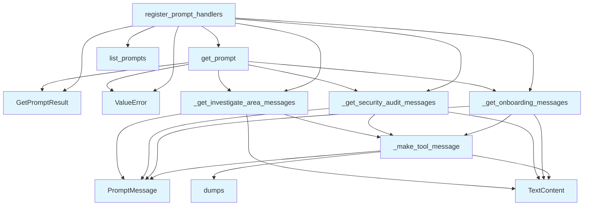

# File: `src/local_deepwiki/handlers/prompts.py`

## File Overview

This file implements MCP (Model Control Protocol) prompt handlers that define pre-built, multi-step workflows for interacting with codebases. It provides structured prompts for common tasks such as onboarding to a new codebase, running security audits, and investigating specific code areas. These prompts are designed to guide AI agents through complex workflows by composing sequences of tool calls and user instructions.

The module integrates with the `mcp.server.Server` to register handlers that support the `list_prompts` and `get_prompt` endpoints, enabling clients to discover and retrieve these predefined workflows.

## Key Concepts

### Prompt Composition Pattern
This file follows a pattern of composing prompt sequences using helper functions (`_get_onboarding_messages`, `_get_security_audit_messages`, etc.). Each function builds a list of `PromptMessage` objects that represent a step-by-step workflow. This modular approach allows for reuse and clear separation of concerns.

### Tool Message Construction
The `_make_tool_message` function encapsulates the logic for generating a user message that instructs an agent to call a specific tool with given arguments. It uses JSON formatting to ensure structured input, which aligns with the expected tool interface.

### Handler Registration
The `register_prompt_handlers` function demonstrates how MCP protocol handlers are registered on a server instance. It maps prompt names to their respective message sequences, supporting dynamic discovery and retrieval of workflows by clients.

## Integration

This module is used by the `prompts` and `test_prompts` test suites, indicating its role in providing core functionality for prompt-based workflows. It integrates with the `mcp.server.Server` to expose prompt handling capabilities, and relies on `mcp.types` for type definitions and `local_deepwiki.logging` for logging.

The module is not directly imported or used by other modules in the provided codebase, but it is expected to be part of the larger CLI tooling system, likely invoked via CLI entrypoints such as those in `src/local_deepwiki/cli/main.py`.

## Design Notes

### Why Pre-Built Prompts?
Pre-built prompts simplify the interaction with agents by providing well-defined workflows. Instead of requiring users to manually construct complex prompts, this module abstracts the complexity into reusable sequences.

### Argument Validation
The `get_prompt` handler includes explicit validation for required arguments (`repo_path`, `query`). This ensures that prompts fail gracefully when invoked with missing or invalid parameters, improving robustness.

### JSON Formatting for Tool Calls
The `_make_tool_message` function formats tool arguments as JSON with indentation. This improves readability and maintainability of tool call instructions, especially when arguments are complex or nested.

### Separation of Concerns
Each workflow is encapsulated in its own function (`_get_onboarding_messages`, etc.), making it easy to extend or modify individual workflows without affecting others. This design promotes modularity and testability.

## API Reference

### Functions

#### `register_prompt_handlers`

```python
def register_prompt_handlers(server: Server) -> None
```

Register MCP Prompt protocol handlers on the server.


| Parameter | Type | Default | Description |
|-----------|------|---------|-------------|
| `server` | `Server` | - | The MCP Server instance to register handlers on. |

**Returns:** `None`


<details>
<summary>View Source (lines 149-196) | <a href="https://github.com/UrbanDiver/local-deepwiki-mcp/blob/main/src/local_deepwiki/handlers/prompts.py#L149-L196">GitHub</a></summary>

```python
def register_prompt_handlers(server: Server) -> None:
    """Register MCP Prompt protocol handlers on the server.

    Args:
        server: The MCP Server instance to register handlers on.
    """

    @server.list_prompts()
    async def list_prompts() -> list[Prompt]:
        return list(_PROMPTS)

    @server.get_prompt()
    async def get_prompt(
        name: str, arguments: dict[str, str] | None = None
    ) -> GetPromptResult:
        arguments = arguments or {}

        if name == "onboarding":
            repo_path = arguments.get("repo_path", "")
            if not repo_path:
                raise ValueError("repo_path argument is required")
            return GetPromptResult(
                description="Onboard to a new codebase",
                messages=_get_onboarding_messages(repo_path),
            )

        if name == "security_audit":
            repo_path = arguments.get("repo_path", "")
            if not repo_path:
                raise ValueError("repo_path argument is required")
            return GetPromptResult(
                description="Security audit of the codebase",
                messages=_get_security_audit_messages(repo_path),
            )

        if name == "investigate_area":
            repo_path = arguments.get("repo_path", "")
            query = arguments.get("query", "")
            if not repo_path:
                raise ValueError("repo_path argument is required")
            if not query:
                raise ValueError("query argument is required")
            return GetPromptResult(
                description=f"Investigate: {query}",
                messages=_get_investigate_area_messages(repo_path, query),
            )

        raise ValueError(f"Unknown prompt: {name}")
```

</details>

#### `list_prompts`

`@server.list_prompts()`

```python
async def list_prompts() -> list[Prompt]
```

**Returns:** `list[Prompt]`


<details>
<summary>View Source (lines 157-158) | <a href="https://github.com/UrbanDiver/local-deepwiki-mcp/blob/main/src/local_deepwiki/handlers/prompts.py#L157-L158">GitHub</a></summary>

```python
async def list_prompts() -> list[Prompt]:
        return list(_PROMPTS)
```

</details>

#### `get_prompt`

`@server.get_prompt()`

```python
async def get_prompt(name: str, arguments: dict[str, str] | None = None) -> GetPromptResult
```


| Parameter | Type | Default | Description |
|-----------|------|---------|-------------|
| `name` | `str` | - | - |
| `arguments` | `dict[str, str] | None` | `None` | - |

**Returns:** `GetPromptResult`


<details>
<summary>View Source (lines 161-196) | <a href="https://github.com/UrbanDiver/local-deepwiki-mcp/blob/main/src/local_deepwiki/handlers/prompts.py#L161-L196">GitHub</a></summary>

```python
async def get_prompt(
        name: str, arguments: dict[str, str] | None = None
    ) -> GetPromptResult:
        arguments = arguments or {}

        if name == "onboarding":
            repo_path = arguments.get("repo_path", "")
            if not repo_path:
                raise ValueError("repo_path argument is required")
            return GetPromptResult(
                description="Onboard to a new codebase",
                messages=_get_onboarding_messages(repo_path),
            )

        if name == "security_audit":
            repo_path = arguments.get("repo_path", "")
            if not repo_path:
                raise ValueError("repo_path argument is required")
            return GetPromptResult(
                description="Security audit of the codebase",
                messages=_get_security_audit_messages(repo_path),
            )

        if name == "investigate_area":
            repo_path = arguments.get("repo_path", "")
            query = arguments.get("query", "")
            if not repo_path:
                raise ValueError("repo_path argument is required")
            if not query:
                raise ValueError("query argument is required")
            return GetPromptResult(
                description=f"Investigate: {query}",
                messages=_get_investigate_area_messages(repo_path, query),
            )

        raise ValueError(f"Unknown prompt: {name}")
```

</details>

## Call Graph



## Used By

Functions and methods in this file and their callers:

- **`GetPromptResult`**: called by `get_prompt`, `register_prompt_handlers`
- **`PromptMessage`**: called by `_get_investigate_area_messages`, `_get_onboarding_messages`, `_get_security_audit_messages`, `_make_tool_message`
- **`TextContent`**: called by `_get_investigate_area_messages`, `_get_onboarding_messages`, `_get_security_audit_messages`, `_make_tool_message`
- **`ValueError`**: called by `get_prompt`, `register_prompt_handlers`
- **`_get_investigate_area_messages`**: called by `get_prompt`, `register_prompt_handlers`
- **`_get_onboarding_messages`**: called by `get_prompt`, `register_prompt_handlers`
- **`_get_security_audit_messages`**: called by `get_prompt`, `register_prompt_handlers`
- **`_make_tool_message`**: called by `_get_investigate_area_messages`, `_get_onboarding_messages`, `_get_security_audit_messages`
- **`dumps`**: called by `_make_tool_message`
- **`get_prompt`**: called by `register_prompt_handlers`
- **`list_prompts`**: called by `register_prompt_handlers`

## Usage Examples

*Examples extracted from test files*

### Test that custom_dir is included in search paths

From `test_prompts.py::TestPromptLoader::test_custom_dir_in_search_paths`:

```python
custom_dir = tmp_path / "prompts"
custom_dir.mkdir()

loader = PromptLoader(custom_dir=custom_dir)
paths = loader._get_search_paths()

assert custom_dir in paths
assert paths[0] == custom_dir  # Should be first (highest priority)
```

### Test that factory creates a manager

From `test_prompts.py::TestGetPromptManager::test_creates_manager`:

```python
manager = get_prompt_manager()
assert isinstance(manager, PromptManager)
```

### Test that custom_dir is passed to manager

From `test_prompts.py::TestGetPromptManager::test_passes_custom_dir`:

```python
custom_prompts = tmp_path / "prompts"
custom_prompts.mkdir()

manager = get_prompt_manager(custom_dir=custom_prompts)
assert manager.loader.custom_dir == custom_prompts
```


## Last Modified

| Entity | Type | Author | Date | Commit |
|--------|------|--------|------|--------|
| `_make_tool_message` | function | Brian Breidenbach | Feb 14, 2026 | `2732638` feat: agent UX improvements... |
| `_get_onboarding_messages` | function | Brian Breidenbach | Feb 14, 2026 | `2732638` feat: agent UX improvements... |
| `_get_security_audit_messages` | function | Brian Breidenbach | Feb 14, 2026 | `2732638` feat: agent UX improvements... |
| `_get_investigate_area_messages` | function | Brian Breidenbach | Feb 14, 2026 | `2732638` feat: agent UX improvements... |
| `register_prompt_handlers` | function | Brian Breidenbach | Feb 14, 2026 | `2732638` feat: agent UX improvements... |
| `list_prompts` | function | Brian Breidenbach | Feb 14, 2026 | `2732638` feat: agent UX improvements... |
| `get_prompt` | function | Brian Breidenbach | Feb 14, 2026 | `2732638` feat: agent UX improvements... |

## Additional Source Code

Source code for functions and methods not listed in the API Reference above.

#### `_make_tool_message`

<details>
<summary>View Source (lines 70-89) | <a href="https://github.com/UrbanDiver/local-deepwiki-mcp/blob/main/src/local_deepwiki/handlers/prompts.py#L70-L89">GitHub</a></summary>

```python
def _make_tool_message(tool_name: str, args: dict[str, str]) -> PromptMessage:
    """Build a user PromptMessage instructing the agent to call a tool.

    Args:
        tool_name: Name of the tool to call.
        args: Arguments to pass as JSON.

    Returns:
        A PromptMessage with role="user".
    """
    import json

    args_str = json.dumps(args, indent=2)
    return PromptMessage(
        role="user",
        content=TextContent(
            type="text",
            text=f"Call the `{tool_name}` tool with these arguments:\n```json\n{args_str}\n```",
        ),
    )
```

</details>


#### `_get_onboarding_messages`

<details>
<summary>View Source (lines 92-108) | <a href="https://github.com/UrbanDiver/local-deepwiki-mcp/blob/main/src/local_deepwiki/handlers/prompts.py#L92-L108">GitHub</a></summary>

```python
def _get_onboarding_messages(repo_path: str) -> list[PromptMessage]:
    """Build the onboarding prompt sequence."""
    return [
        PromptMessage(
            role="user",
            content=TextContent(
                type="text",
                text=f"I want to understand the codebase at `{repo_path}`. "
                "Please index it (if not already indexed), then show me the wiki structure and key stats.",
            ),
        ),
        _make_tool_message("index_repository", {"repo_path": repo_path}),
        _make_tool_message(
            "read_wiki_structure", {"wiki_path": f"{repo_path}/.deepwiki"}
        ),
        _make_tool_message("get_wiki_stats", {"repo_path": repo_path}),
    ]
```

</details>


#### `_get_security_audit_messages`

<details>
<summary>View Source (lines 111-128) | <a href="https://github.com/UrbanDiver/local-deepwiki-mcp/blob/main/src/local_deepwiki/handlers/prompts.py#L111-L128">GitHub</a></summary>

```python
def _get_security_audit_messages(repo_path: str) -> list[PromptMessage]:
    """Build the security audit prompt sequence."""
    return [
        PromptMessage(
            role="user",
            content=TextContent(
                type="text",
                text=f"Run a security review of `{repo_path}`. "
                "Scan for hardcoded secrets, check project dependencies, and identify complexity hotspots.",
            ),
        ),
        _make_tool_message("detect_secrets", {"repo_path": repo_path}),
        _make_tool_message("get_project_manifest", {"repo_path": repo_path}),
        _make_tool_message(
            "run_workflow",
            {"repo_path": repo_path, "workflow": "security_audit"},
        ),
    ]
```

</details>


#### `_get_investigate_area_messages`

<details>
<summary>View Source (lines 131-146) | <a href="https://github.com/UrbanDiver/local-deepwiki-mcp/blob/main/src/local_deepwiki/handlers/prompts.py#L131-L146">GitHub</a></summary>

```python
def _get_investigate_area_messages(repo_path: str, query: str) -> list[PromptMessage]:
    """Build the investigate_area prompt sequence."""
    return [
        PromptMessage(
            role="user",
            content=TextContent(
                type="text",
                text=f"I want to investigate '{query}' in `{repo_path}`. "
                "Search for relevant code, generate a codemap, and explain key entities.",
            ),
        ),
        _make_tool_message("search_code", {"repo_path": repo_path, "query": query}),
        _make_tool_message(
            "generate_codemap", {"repo_path": repo_path, "query": query}
        ),
    ]
```

</details>

## Relevant Source Files

- `src/local_deepwiki/handlers/prompts.py:70-89`
