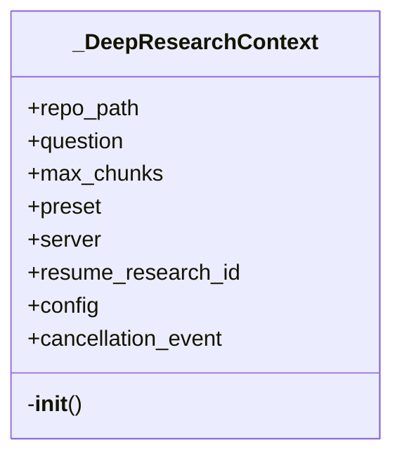

# File: `src/local_deepwiki/handlers/research.py`

## File Overview

This file implements the core tool handlers for performing deep research within a repository using multi-step reasoning. It provides functionality for initiating, resuming, cancelling, and listing research sessions, as well as tracking progress for long-running operations. The handlers are designed to work within the MCP (Model Control Protocol) framework, supporting both push-based progress notifications and pull-based progress queries.

The module is responsible for orchestrating the entire deep research workflow:
1. Validating inputs and setting up the research context.
2. Creating and configuring the [`DeepResearchPipeline`](../core/deep_research/pipeline.md) with appropriate providers (LLM, embedding, vector store).
3. Executing the research phases with cancellation and progress tracking capabilities.
4. Managing checkpoints and resumption logic for interrupted research sessions.
5. Handling progress reporting for client applications.

## Key Concepts

### Deep Research Pipeline Orchestration
The module implements a layered orchestration pattern for the [`DeepResearchPipeline`](../core/deep_research/pipeline.md). It separates concerns into:
- Configuration setup (`_setup_deep_research_config`)
- Provider instantiation (`_create_research_pipeline`)
- Execution with cancellation/progress (`_execute_research_phases`)

This design promotes testability, modularity, and separation of concerns.

### Cancellation and Progress Tracking
Cancellation is supported through [`asyncio.Event`](../events.md) and `asyncio.current_task().cancelled()`, ensuring that long-running research steps can be interrupted gracefully. Progress tracking is implemented via MCP's progress notifications, enabling real-time updates to clients.

### Checkpoint Management
Research sessions can be cancelled and resumed using checkpointing. This allows users to interrupt a long-running research task and continue from where they left off, improving usability for large or time-consuming queries.

### Role-Based Access Control (RBAC)
Each handler performs a permission check using `get_access_controller()`, ensuring that only authorized users can initiate or manipulate research sessions. The permission model supports three modes: disabled, permissive, and enforced.

### Input Validation and Sanitization
pydantic models are used to validate inputs from tool calls. Additionally, custom validation functions ([`validate_deep_research_parameters`](../validation.md)) are used to prevent potential abuse such as CWE-400 (Uncontrolled Resource Consumption).

## Integration

This file integrates with several core components of the `local_deepwiki` system:

- **MCP Server**: Used for sending progress notifications and extracting request context.
- **Deep Research Core**: Interfaces with [`DeepResearchPipeline`](../core/deep_research/pipeline.md), [`list_research_checkpoints`](../core/deep_research/checkpoints.md), [`cancel_research`](../core/deep_research/checkpoints.md), and [`get_research_checkpoint`](../core/deep_research/checkpoints.md).
- **Providers**: Utilizes embedding and LLM providers via `get_embedding_provider` and `get_cached_llm_provider`.
- **Configuration System**: Leverages `get_config()` and [`ResearchConfig`](../core/deep_research/config.md) for managing research parameters.
- **Error Handling**: Uses shared error utilities like [`not_indexed_error`](../error_factories.md), [`path_not_found_error`](../error_factories.md).
- **Logging and Progress Tracking**: Integrates with `get_logger()` and `get_progress_registry()` for observability.

The functions in this file are called by the CLI entrypoints (`main.py`) and potentially from MCP clients that invoke tools such as `deep_research`, [`list_research_checkpoints`](../core/deep_research/checkpoints.md), [`cancel_research`](../core/deep_research/checkpoints.md), etc. The test suite (`test_handlers_research_export`) also directly imports and tests internal helper functions like `_is_cancelled` and `progress_callback`.

## Design Notes

### Why Separate Context Object?
The `_DeepResearchContext` class centralizes state for a single research execution. This avoids passing multiple parameters through deeply nested functions and makes testing easier by allowing mocking of the context.

### Why Asynchronous Progress Notifications?
Progress notifications are sent asynchronously to avoid blocking the main execution flow. This ensures that even if a client is unresponsive or the network is slow, the research continues uninterrupted.

### Why Not Use a Global Cancellation Mechanism?
Instead of relying on a global cancellation flag, the module uses a per-task [`asyncio.Event`](../events.md) and checks `current_task().cancelled()`. This approach is more robust in concurrent environments and aligns with Python's asyncio cancellation model.

### Why Use `TextContent` for Outputs?
The handlers return `list[TextContent]` to comply with the MCP protocol, which standardizes communication between tools and clients. This enables rich, structured responses including JSON-formatted results.

### Handling Edge Cases
- **Missing Repository Index**: Raises a custom [`not_indexed_error`](../error_factories.md) if the repository has not been indexed.
- **Cancelled Tasks**: Properly propagates `asyncio.CancelledError` and sends cancellation notifications.
- **No Progress Token**: Gracefully handles cases where no progress token is available (e.g., during testing).
- **Incomplete Checkpoints**: Ensures that only valid, resumable checkpoints are returned or used.

### Performance Considerations
- **Caching**: LLM calls are cached using `get_cached_llm_provider` to reduce redundant processing.
- **Chunk Limiting**: Input size limits prevent resource exhaustion.
- **Efficient Checkpointing**: Checkpoints store minimal necessary metadata to support resumption without bloating storage.

## API Reference

### Functions

#### `is_cancelled`

```python
def is_cancelled() -> bool
```

**Returns:** `bool`


<details>
<summary>View Source (lines 265-266) | <a href="https://github.com/UrbanDiver/local-deepwiki-mcp/blob/main/src/local_deepwiki/handlers/research.py#L265-L266">GitHub</a></summary>

```python
def is_cancelled() -> bool:
        return _is_cancelled(ctx)
```

</details>

#### `progress_callback`

```python
async def progress_callback(progress: Any) -> None
```


| Parameter | Type | Default | Description |
|-----------|------|---------|-------------|
| `progress` | `Any` | - | - |

**Returns:** `None`


<details>
<summary>View Source (lines 268-269) | <a href="https://github.com/UrbanDiver/local-deepwiki-mcp/blob/main/src/local_deepwiki/handlers/research.py#L268-L269">GitHub</a></summary>

```python
async def progress_callback(progress: Any) -> None:
        await _send_progress(ctx, progress)
```

</details>

#### `send_cancellation_notification`

```python
async def send_cancellation_notification(step: str) -> None
```


| Parameter | Type | Default | Description |
|-----------|------|---------|-------------|
| `step` | `str` | - | - |

**Returns:** `None`


<details>
<summary>View Source (lines 271-272) | <a href="https://github.com/UrbanDiver/local-deepwiki-mcp/blob/main/src/local_deepwiki/handlers/research.py#L271-L272">GitHub</a></summary>

```python
async def send_cancellation_notification(step: str) -> None:
        await _send_cancellation(ctx, step)
```

</details>

#### `handle_deep_research`

`@handle_tool_errors`

```python
async def handle_deep_research(args: dict[str, Any], server: Server | None = None) -> list[TextContent]
```

Handle deep_research tool call for multi-step reasoning.


| Parameter | Type | Default | Description |
|-----------|------|---------|-------------|
| `args` | `dict[str, Any]` | - | Tool arguments. |
| `server` | `Server | None` | `None` | Optional MCP server instance for progress notifications. |

**Returns:** `list[TextContent]`


<details>
<summary>View Source (lines 384-397) | <a href="https://github.com/UrbanDiver/local-deepwiki-mcp/blob/main/src/local_deepwiki/handlers/research.py#L384-L397">GitHub</a></summary>

```python
async def handle_deep_research(
    args: dict[str, Any],
    server: Server | None = None,
) -> list[TextContent]:
    """Handle deep_research tool call for multi-step reasoning.

    Args:
        args: Tool arguments.
        server: Optional MCP server instance for progress notifications.

    Returns:
        List of TextContent with research results.
    """
    return await _handle_deep_research_impl(args, server)
```

</details>

#### `handle_list_research_checkpoints`

`@handle_tool_errors`

```python
async def handle_list_research_checkpoints(args: dict[str, Any]) -> list[TextContent]
```

Handle [list_research_checkpoints](../core/deep_research/checkpoints.md) tool call.  Lists all research checkpoints for a repository, including incomplete and cancelled research sessions that can be resumed.


| Parameter | Type | Default | Description |
|-----------|------|---------|-------------|
| `args` | `dict[str, Any]` | - | - |

**Returns:** `list[TextContent]`


<details>
<summary>View Source (lines 401-462) | <a href="https://github.com/UrbanDiver/local-deepwiki-mcp/blob/main/src/local_deepwiki/handlers/research.py#L401-L462">GitHub</a></summary>

```python
async def handle_list_research_checkpoints(args: dict[str, Any]) -> list[TextContent]:
    """Handle list_research_checkpoints tool call.

    Lists all research checkpoints for a repository, including incomplete
    and cancelled research sessions that can be resumed.
    """
    from local_deepwiki.core.deep_research import list_research_checkpoints

    # Validate with Pydantic
    try:
        validated = ListResearchCheckpointsArgs.model_validate(args)
    except PydanticValidationError as e:
        raise ValueError(str(e)) from e

    repo_path = Path(validated.repo_path).resolve()

    if not repo_path.exists():
        raise path_not_found_error(str(repo_path), "repository")

    checkpoints = list_research_checkpoints(repo_path)

    if not checkpoints:
        return [
            TextContent(
                type="text",
                text=json.dumps(
                    {
                        "status": "success",
                        "message": "No research checkpoints found",
                        "checkpoints": [],
                    },
                    indent=2,
                ),
            )
        ]

    # Format checkpoints for output
    checkpoint_list = []
    for cp in checkpoints:
        checkpoint_list.append(
            {
                "research_id": cp.research_id,
                "question": cp.question[:100] + "..."
                if len(cp.question) > 100
                else cp.question,
                "current_step": cp.current_step.value,
                "completed_steps": cp.completed_steps,
                "started_at": cp.started_at,
                "updated_at": cp.updated_at,
                "can_resume": cp.current_step.value not in ("complete", "error"),
                "error": cp.error,
            }
        )

    response = {
        "status": "success",
        "checkpoint_count": len(checkpoints),
        "checkpoints": checkpoint_list,
    }

    logger.info("Listed %s research checkpoints for %s", len(checkpoints), repo_path)
    return [TextContent(type="text", text=json.dumps(response, indent=2))]
```

</details>

#### `handle_cancel_research`

`@handle_tool_errors`

```python
async def handle_cancel_research(args: dict[str, Any]) -> list[TextContent]
```

Handle [cancel_research](../core/deep_research/checkpoints.md) tool call.  Cancels an active research session and saves its checkpoint for potential resumption later.


| Parameter | Type | Default | Description |
|-----------|------|---------|-------------|
| `args` | `dict[str, Any]` | - | - |

**Returns:** `list[TextContent]`


<details>
<summary>View Source (lines 466-512) | <a href="https://github.com/UrbanDiver/local-deepwiki-mcp/blob/main/src/local_deepwiki/handlers/research.py#L466-L512">GitHub</a></summary>

```python
async def handle_cancel_research(args: dict[str, Any]) -> list[TextContent]:
    """Handle cancel_research tool call.

    Cancels an active research session and saves its checkpoint for
    potential resumption later.
    """
    from local_deepwiki.core.deep_research import cancel_research

    # Validate with Pydantic
    try:
        validated = CancelResearchArgs.model_validate(args)
    except PydanticValidationError as e:
        raise ValueError(str(e)) from e

    repo_path = Path(validated.repo_path).resolve()
    research_id = validated.research_id

    if not repo_path.exists():
        raise path_not_found_error(str(repo_path), "repository")

    checkpoint = cancel_research(repo_path, research_id)

    if not checkpoint:
        return [
            TextContent(
                type="text",
                text=json.dumps(
                    {
                        "status": "error",
                        "message": f"Research checkpoint {research_id} not found",
                    },
                    indent=2,
                ),
            )
        ]

    response = {
        "status": "success",
        "message": f"Research {research_id} cancelled and checkpointed",
        "research_id": checkpoint.research_id,
        "question": checkpoint.question,
        "completed_steps": checkpoint.completed_steps,
        "hint": "Use deep_research with resume_research_id to continue later",
    }

    logger.info("Cancelled research %s", research_id)
    return [TextContent(type="text", text=json.dumps(response, indent=2))]
```

</details>

#### `handle_resume_research`

`@handle_tool_errors`

```python
async def handle_resume_research(args: dict[str, Any], server: Server | None = None) -> list[TextContent]
```

Handle resume_research tool call.  Resumes a previously interrupted research session from its checkpoint. This is a convenience [wrapper](_error_handling.md) around deep_research with resume_research_id.


| Parameter | Type | Default | Description |
|-----------|------|---------|-------------|
| `args` | `dict[str, Any]` | - | - |
| `server` | `Server | None` | `None` | - |

**Returns:** `list[TextContent]`


<details>
<summary>View Source (lines 516-577) | <a href="https://github.com/UrbanDiver/local-deepwiki-mcp/blob/main/src/local_deepwiki/handlers/research.py#L516-L577">GitHub</a></summary>

```python
async def handle_resume_research(
    args: dict[str, Any],
    server: Server | None = None,
) -> list[TextContent]:
    """Handle resume_research tool call.

    Resumes a previously interrupted research session from its checkpoint.
    This is a convenience wrapper around deep_research with resume_research_id.
    """
    from local_deepwiki.core.deep_research import get_research_checkpoint

    # Validate with Pydantic
    try:
        validated = ResumeResearchArgs.model_validate(args)
    except PydanticValidationError as e:
        raise ValueError(str(e)) from e

    repo_path = Path(validated.repo_path).resolve()
    research_id = validated.research_id

    if not repo_path.exists():
        raise path_not_found_error(str(repo_path), "repository")

    # Load the checkpoint to get the original question
    checkpoint = get_research_checkpoint(repo_path, research_id)

    if not checkpoint:
        return [
            TextContent(
                type="text",
                text=json.dumps(
                    {
                        "status": "error",
                        "message": f"Research checkpoint {research_id} not found",
                    },
                    indent=2,
                ),
            )
        ]

    if checkpoint.current_step.value == "complete":
        return [
            TextContent(
                type="text",
                text=json.dumps(
                    {
                        "status": "error",
                        "message": f"Research {research_id} is already complete",
                    },
                    indent=2,
                ),
            )
        ]

    # Delegate to deep_research handler with resume_research_id
    deep_research_args = {
        "repo_path": str(repo_path),
        "question": checkpoint.question,
        "resume_research_id": research_id,
    }

    return await handle_deep_research(deep_research_args, server)
```

</details>

#### `handle_get_operation_progress`

`@handle_tool_errors`

```python
async def handle_get_operation_progress(args: dict[str, Any]) -> list[TextContent]
```

Handle get_operation_progress tool call.  Returns current progress for active operations, supporting the pull-based progress model for clients that cannot receive push notifications.


| Parameter | Type | Default | Description |
|-----------|------|---------|-------------|
| `args` | `dict[str, Any]` | - | - |

**Returns:** `list[TextContent]`


<details>
<summary>View Source (lines 581-621) | <a href="https://github.com/UrbanDiver/local-deepwiki-mcp/blob/main/src/local_deepwiki/handlers/research.py#L581-L621">GitHub</a></summary>

```python
async def handle_get_operation_progress(args: dict[str, Any]) -> list[TextContent]:
    """Handle get_operation_progress tool call.

    Returns current progress for active operations, supporting the
    pull-based progress model for clients that cannot receive push notifications.
    """
    # Validate with Pydantic
    try:
        validated = GetOperationProgressArgs.model_validate(args)
    except PydanticValidationError as e:
        raise ValueError(str(e)) from e

    registry = get_progress_registry()
    operation_id = validated.operation_id

    if operation_id:
        # Get progress for specific operation
        progress = registry.get_operation_progress(operation_id)
        if not progress:
            return [
                TextContent(
                    type="text",
                    text=json.dumps(
                        {
                            "status": "not_found",
                            "message": f"Operation {operation_id} not found or already completed",
                        },
                        indent=2,
                    ),
                )
            ]
        return [TextContent(type="text", text=json.dumps(progress, indent=2))]
    else:
        # List all active operations
        operations = registry.list_operations()
        response = {
            "status": "success",
            "active_operations": len(operations),
            "operations": operations,
        }
        return [TextContent(type="text", text=json.dumps(response, indent=2))]
```

</details>

## Class Diagram



## Call Graph

```mermaid
flowchart TD
    N0[Path]
    N1[TextContent]
    N2[ValueError]
    N3[_DeepResearchContext]
    N4[_DeepResearchContext.__init__]
    N5[_create_progress_callbacks]
    N6[_create_research_pipeline]
    N7[_execute_research_phases]
    N8[_handle_deep_research_impl]
    N9[_is_cancelled]
    N10[_send_cancellation]
    N11[_send_progress]
    N12[_setup_deep_research_config]
    N13[dumps]
    N14[exists]
    N15[get_embedding_provider]
    N16[get_vector_db_path]
    N17[handle_cancel_research]
    N18[handle_deep_research]
    N19[handle_get_operation_progress]
    N20[handle_list_research_checkp...]
    N21[handle_resume_research]
    N22[model_dump_json]
    N23[model_validate]
    N24[not_indexed_error]
    N25[path_not_found_error]
    N26[resolve]
    N27[send_cancellation_notification]
    N28[send_progress_notification]
    N29[validate_deep_research_para...]
    N12 --> N23
    N12 --> N2
    N12 --> N26
    N12 --> N0
    N12 --> N29
    N12 --> N3
    N12 --> N16
    N12 --> N14
    N12 --> N24
    N6 --> N15
    N6 --> N16
    N11 --> N28
    N11 --> N22
    N10 --> N28
    N10 --> N22
    N5 --> N9
    N5 --> N11
    N5 --> N10
    N27 --> N10
    N7 --> N1
    N7 --> N13
    N7 --> N27
    N8 --> N12
    N8 --> N6
    N8 --> N5
    N8 --> N7
    N18 --> N8
    N20 --> N23
    N20 --> N2
    N20 --> N26
    N20 --> N0
    N20 --> N14
    N20 --> N25
    N20 --> N1
    N20 --> N13
    N17 --> N23
    N17 --> N2
    N17 --> N26
    N17 --> N0
    N17 --> N14
    N17 --> N25
    N17 --> N1
    N17 --> N13
    N21 --> N23
    N21 --> N2
    N21 --> N26
    N21 --> N0
    N21 --> N14
    N21 --> N25
    N21 --> N1
    N21 --> N13
    N21 --> N18
    N19 --> N23
    N19 --> N2
    N19 --> N1
    N19 --> N13
    classDef func fill:#e1f5fe
    class N0,N1,N2,N3,N5,N6,N7,N8,N9,N10,N11,N12,N13,N14,N15,N16,N17,N18,N19,N20,N21,N22,N23,N24,N25,N26,N27,N28,N29 func
    classDef method fill:#fff3e0
    class N4 method
```



## Used By

Functions and methods in this file and their callers:

- **[`DeepResearchPipeline`](../core/deep_research/pipeline.md)**: called by `_create_research_pipeline`
- **[`Event`](../events.md)**: called by `_DeepResearchContext.__init__`
- **`Path`**: called by `_setup_deep_research_config`, `handle_cancel_research`, `handle_list_research_checkpoints`, `handle_resume_research`
- **[`ResearchConfig`](../core/deep_research/config.md)**: called by `_create_research_pipeline`
- **[`ResearchProgress`](../models/research.md)**: called by `_send_cancellation`
- **`TextContent`**: called by `_execute_research_phases`, `handle_cancel_research`, `handle_get_operation_progress`, `handle_list_research_checkpoints`, `handle_resume_research`
- **`ValueError`**: called by `_setup_deep_research_config`, `handle_cancel_research`, `handle_get_operation_progress`, `handle_list_research_checkpoints`, `handle_resume_research`
- **[`VectorStore`](../core/vectorstore/store.md)**: called by `_create_research_pipeline`
- **`_DeepResearchContext`**: called by `_setup_deep_research_config`
- **`_create_progress_callbacks`**: called by `_handle_deep_research_impl`
- **`_create_research_pipeline`**: called by `_handle_deep_research_impl`
- **`_execute_research_phases`**: called by `_handle_deep_research_impl`
- **`_format_research_results`**: called by `_execute_research_phases`
- **`_handle_deep_research_impl`**: called by `handle_deep_research`
- **`_is_cancelled`**: called by `_create_progress_callbacks`, `is_cancelled`
- **`_send_cancellation`**: called by `_create_progress_callbacks`, `send_cancellation_notification`
- **`_send_progress`**: called by `_create_progress_callbacks`, `progress_callback`
- **`_setup_deep_research_config`**: called by `_handle_deep_research_impl`
- **[`cancel_research`](../core/deep_research/checkpoints.md)**: called by `handle_cancel_research`
- **`cancelled`**: called by `_is_cancelled`
- **`current_task`**: called by `_is_cancelled`
- **`dumps`**: called by `_execute_research_phases`, `handle_cancel_research`, `handle_get_operation_progress`, `handle_list_research_checkpoints`, `handle_resume_research`
- **`exists`**: called by `_setup_deep_research_config`, `handle_cancel_research`, `handle_list_research_checkpoints`, `handle_resume_research`
- **[`get_access_controller`](../security/access_control.md)**: called by `_handle_deep_research_impl`
- **`get_cached_llm_provider`**: called by `_create_research_pipeline`
- **[`get_config`](../config/loader.md)**: called by `_DeepResearchContext.__init__`
- **`get_embedding_provider`**: called by `_create_research_pipeline`
- **`get_operation_progress`**: called by `handle_get_operation_progress`
- **[`get_progress_registry`](../progress.md)**: called by `handle_get_operation_progress`
- **`get_prompts`**: called by `_create_research_pipeline`
- **[`get_research_checkpoint`](../core/deep_research/checkpoints.md)**: called by `handle_resume_research`
- **`get_vector_db_path`**: called by `_create_research_pipeline`, `_setup_deep_research_config`
- **[`get_wiki_path`](../web/utils.md)**: called by `_create_research_pipeline`
- **`handle_deep_research`**: called by `handle_resume_research`
- **`is_set`**: called by `_is_cancelled`
- **`list_operations`**: called by `handle_get_operation_progress`
- **[`list_research_checkpoints`](../core/deep_research/checkpoints.md)**: called by `handle_list_research_checkpoints`
- **`model_dump_json`**: called by `_send_cancellation`, `_send_progress`
- **`model_validate`**: called by `_setup_deep_research_config`, `handle_cancel_research`, `handle_get_operation_progress`, `handle_list_research_checkpoints`, `handle_resume_research`
- **[`not_indexed_error`](../error_factories.md)**: called by `_setup_deep_research_config`
- **[`path_not_found_error`](../error_factories.md)**: called by `handle_cancel_research`, `handle_list_research_checkpoints`, `handle_resume_research`
- **[`require_permission`](../security/access_control.md)**: called by `_handle_deep_research_impl`
- **`research`**: called by `_execute_research_phases`
- **`resolve`**: called by `_setup_deep_research_config`, `handle_cancel_research`, `handle_list_research_checkpoints`, `handle_resume_research`
- **`send_cancellation_notification`**: called by `_execute_research_phases`
- **`send_progress_notification`**: called by `_send_cancellation`, `_send_progress`
- **[`validate_deep_research_parameters`](../validation.md)**: called by `_setup_deep_research_config`
- **`with_preset`**: called by `_create_research_pipeline`

## Last Modified

| Entity | Type | Author | Date | Commit |
|--------|------|--------|------|--------|
| `_create_research_pipeline` | function | Brian Breidenbach | yesterday | `1eef062` refactor: complete Grade A ... |
| `_is_cancelled` | function | Brian Breidenbach | 2 days ago | `09de062` refactor: decompose CC > 15... |
| `_send_progress` | function | Brian Breidenbach | 2 days ago | `09de062` refactor: decompose CC > 15... |
| `_send_cancellation` | function | Brian Breidenbach | 2 days ago | `09de062` refactor: decompose CC > 15... |
| `_create_progress_callbacks` | function | Brian Breidenbach | 2 days ago | `09de062` refactor: decompose CC > 15... |
| `is_cancelled` | function | Brian Breidenbach | 2 days ago | `09de062` refactor: decompose CC > 15... |
| `progress_callback` | function | Brian Breidenbach | 2 days ago | `09de062` refactor: decompose CC > 15... |
| `send_cancellation_notification` | function | Brian Breidenbach | 2 days ago | `09de062` refactor: decompose CC > 15... |
| `_execute_research_phases` | function | Brian Breidenbach | Feb 23, 2026 | `c6fe2bd` refactor: split oversized m... |
| `_setup_deep_research_config` | function | Brian Breidenbach | Feb 20, 2026 | `b807417` refactor: high-priority Pyt... |
| `handle_list_research_checkpoints` | function | Brian Breidenbach | Feb 11, 2026 | `ba96da1` fix: publication plan P0-P2... |
| `handle_cancel_research` | function | Brian Breidenbach | Feb 11, 2026 | `ba96da1` fix: publication plan P0-P2... |
| `_DeepResearchContext` | class | Brian Breidenbach | Feb 09, 2026 | `c79a754` fix: improve type safety ac... |
| `_handle_deep_research_impl` | function | Brian Breidenbach | Feb 09, 2026 | `c79a754` fix: improve type safety ac... |
| `handle_deep_research` | function | Brian Breidenbach | Feb 09, 2026 | `c79a754` fix: improve type safety ac... |
| `handle_resume_research` | function | Brian Breidenbach | Feb 09, 2026 | `c79a754` fix: improve type safety ac... |
| `handle_get_operation_progress` | function | Brian Breidenbach | Feb 09, 2026 | `2341e82` refactor: Split monolithic ... |

## Additional Source Code

Source code for functions and methods not listed in the API Reference above.

### `_DeepResearchContext`

<details>
<summary>View Source (lines 41-61) | <a href="https://github.com/UrbanDiver/local-deepwiki-mcp/blob/main/src/local_deepwiki/handlers/research.py#L41-L61">GitHub</a></summary>

```python
class _DeepResearchContext:
    """Context object holding state for deep research execution."""

    def __init__(
        self,
        repo_path: Path,
        question: str,
        max_chunks: int,
        preset: str | None,
        server: Server | None,
        resume_research_id: str | None = None,
    ):
        self.repo_path = repo_path
        self.question = question
        self.max_chunks = max_chunks
        self.preset = preset
        self.server = server
        self.resume_research_id = resume_research_id
        self.config = get_config()
        self.progress_token: str | int | None = None
        self.cancellation_event = asyncio.Event()
```

</details>


#### `_setup_deep_research_config`

<details>
<summary>View Source (lines 64-130) | <a href="https://github.com/UrbanDiver/local-deepwiki-mcp/blob/main/src/local_deepwiki/handlers/research.py#L64-L130">GitHub</a></summary>

```python
def _setup_deep_research_config(
    args: dict[str, Any],
    server: Server | None = None,
) -> _DeepResearchContext:
    """Handle config setup and input validation for deep research.

    Args:
        args: Tool arguments containing repo_path, question, max_chunks, preset.
        server: Optional MCP server instance for progress notifications.

    Returns:
        DeepResearchContext with validated inputs and config.

    Raises:
        ValueError: If inputs are invalid or repository not indexed.
    """
    # Validate with Pydantic
    try:
        validated = DeepResearchArgs.model_validate(args)
    except PydanticValidationError as e:
        raise ValueError(str(e)) from e

    repo_path = Path(validated.repo_path).resolve()
    question = validated.question
    max_chunks = validated.max_chunks
    preset = validated.preset
    resume_research_id = validated.resume_research_id

    # Validate input size limits (CWE-400 prevention)
    validate_deep_research_parameters(question, preset, max_chunks)

    logger.info("Deep research on %s: %s...", repo_path, question[:100])
    logger.debug(
        "Max chunks: %d, preset: %s, resume: %s",
        max_chunks,
        preset or "default",
        resume_research_id or "new",
    )

    # Create context
    ctx = _DeepResearchContext(
        repo_path=repo_path,
        question=question,
        max_chunks=max_chunks,
        preset=preset,
        server=server,
        resume_research_id=resume_research_id,
    )

    # Validate repository is indexed
    vector_db_path = ctx.config.get_vector_db_path(repo_path)
    if not vector_db_path.exists():
        raise not_indexed_error(str(repo_path))

    # Extract progress token from MCP request context
    if server is not None:
        try:
            request_ctx = server.request_context
            if request_ctx.meta and request_ctx.meta.progressToken:
                ctx.progress_token = request_ctx.meta.progressToken
        except LookupError:
            # Not in a request context (e.g., testing or direct API calls)
            logger.debug(
                "No MCP request context available for deep research progress token"
            )

    return ctx
```

</details>


#### `_create_research_pipeline`

<details>
<summary>View Source (lines 133-194) | <a href="https://github.com/UrbanDiver/local-deepwiki-mcp/blob/main/src/local_deepwiki/handlers/research.py#L133-L194">GitHub</a></summary>

```python
def _create_research_pipeline(
    ctx: _DeepResearchContext,
    args: dict[str, Any],
) -> tuple["DeepResearchPipeline", "VectorStore", Any]:
    """Create the DeepResearchPipeline instance with providers.

    Args:
        ctx: Deep research context with config and settings.
        args: Original tool arguments for max_chunks override check.

    Returns:
        Tuple of (pipeline, vector_store, llm_provider).
    """
    from local_deepwiki.core.deep_research import DeepResearchPipeline
    from local_deepwiki.providers.llm import get_cached_llm_provider

    # Create vector store and LLM provider
    embedding_provider = get_embedding_provider(ctx.config.embedding)
    vector_db_path = ctx.config.get_vector_db_path(ctx.repo_path)
    vector_store = VectorStore(vector_db_path, embedding_provider)

    cache_path = ctx.config.get_wiki_path(ctx.repo_path) / "llm_cache.lance"
    llm = get_cached_llm_provider(
        cache_path=cache_path,
        embedding_provider=embedding_provider,
        cache_config=ctx.config.llm_cache,
        llm_config=ctx.config.llm,
    )

    # Apply preset if specified (overrides config file values)
    dr_config = ctx.config.deep_research.with_preset(ctx.preset)

    # Use max_chunks from args if provided, otherwise use preset/config value
    effective_max_chunks = (
        ctx.max_chunks
        if args.get("max_chunks") is not None
        else dr_config.max_total_chunks
    )

    # Get provider-specific prompts
    prompts = ctx.config.get_prompts()

    from local_deepwiki.core.deep_research.config import ResearchConfig

    pipeline = DeepResearchPipeline(
        vector_store=vector_store,
        llm_provider=llm,
        config=ResearchConfig(
            max_sub_questions=dr_config.max_sub_questions,
            chunks_per_subquestion=dr_config.chunks_per_subquestion,
            max_total_chunks=effective_max_chunks,
            max_follow_up_queries=dr_config.max_follow_up_queries,
            synthesis_temperature=dr_config.synthesis_temperature,
            synthesis_max_tokens=dr_config.synthesis_max_tokens,
            decomposition_prompt=prompts.research_decomposition,
            gap_analysis_prompt=prompts.research_gap_analysis,
            synthesis_prompt=prompts.research_synthesis,
            repo_path=ctx.repo_path,
        ),
    )

    return pipeline, vector_store, llm
```

</details>


#### `_is_cancelled`

<details>
<summary>View Source (lines 197-207) | <a href="https://github.com/UrbanDiver/local-deepwiki-mcp/blob/main/src/local_deepwiki/handlers/research.py#L197-L207">GitHub</a></summary>

```python
def _is_cancelled(ctx: _DeepResearchContext) -> bool:
    """Check if the research should be cancelled."""
    if ctx.cancellation_event.is_set():
        return True
    try:
        task = asyncio.current_task()
        if task and task.cancelled():
            return True
    except RuntimeError:
        logger.debug("Failed to check asyncio task cancellation state", exc_info=True)
    return False
```

</details>


#### `_send_progress`

<details>
<summary>View Source (lines 210-223) | <a href="https://github.com/UrbanDiver/local-deepwiki-mcp/blob/main/src/local_deepwiki/handlers/research.py#L210-L223">GitHub</a></summary>

```python
async def _send_progress(ctx: _DeepResearchContext, progress: Any) -> None:
    """Send MCP progress notifications."""
    if ctx.progress_token is None or ctx.server is None:
        return
    try:
        request_ctx = ctx.server.request_context
        await request_ctx.session.send_progress_notification(
            progress_token=ctx.progress_token,
            progress=float(progress.step),
            total=float(progress.total_steps),
            message=progress.model_dump_json(),
        )
    except (RuntimeError, OSError, AttributeError) as e:
        logger.warning("Failed to send progress notification: %s", e)
```

</details>


#### `_send_cancellation`

<details>
<summary>View Source (lines 226-246) | <a href="https://github.com/UrbanDiver/local-deepwiki-mcp/blob/main/src/local_deepwiki/handlers/research.py#L226-L246">GitHub</a></summary>

```python
async def _send_cancellation(ctx: _DeepResearchContext, step: str) -> None:
    """Send a cancellation progress notification."""
    if ctx.progress_token is None or ctx.server is None:
        return
    from local_deepwiki.models import ResearchProgress, ResearchProgressType

    try:
        request_ctx = ctx.server.request_context
        progress = ResearchProgress(
            step=0,
            step_type=ResearchProgressType.CANCELLED,
            message=f"Research cancelled during {step}",
        )
        await request_ctx.session.send_progress_notification(
            progress_token=ctx.progress_token,
            progress=0.0,
            total=5.0,
            message=progress.model_dump_json(),
        )
    except (RuntimeError, OSError, AttributeError) as e:
        logger.warning("Failed to send cancellation notification: %s", e)
```

</details>


#### `_create_progress_callbacks`

<details>
<summary>View Source (lines 249-274) | <a href="https://github.com/UrbanDiver/local-deepwiki-mcp/blob/main/src/local_deepwiki/handlers/research.py#L249-L274">GitHub</a></summary>

```python
def _create_progress_callbacks(
    ctx: _DeepResearchContext,
) -> tuple[
    CancellationChecker,
    ProgressReporter,
    Callable[[str], Awaitable[None]],
]:
    """Create cancellation checker and progress callback functions.

    Args:
        ctx: Deep research context with server and progress token.

    Returns:
        Tuple of (is_cancelled, progress_callback, send_cancellation_notification).
    """

    def is_cancelled() -> bool:
        return _is_cancelled(ctx)

    async def progress_callback(progress: Any) -> None:
        await _send_progress(ctx, progress)

    async def send_cancellation_notification(step: str) -> None:
        await _send_cancellation(ctx, step)

    return is_cancelled, progress_callback, send_cancellation_notification
```

</details>


#### `_execute_research_phases`

<details>
<summary>View Source (lines 277-336) | <a href="https://github.com/UrbanDiver/local-deepwiki-mcp/blob/main/src/local_deepwiki/handlers/research.py#L277-L336">GitHub</a></summary>

```python
async def _execute_research_phases(
    ctx: _DeepResearchContext,
    pipeline: "DeepResearchPipeline",
    is_cancelled: CancellationChecker,
    progress_callback: ProgressReporter,
    send_cancellation_notification: Callable[[str], Awaitable[None]],
) -> list[TextContent]:
    """Execute the research phases with progress tracking.

    Args:
        ctx: Deep research context.
        pipeline: The configured DeepResearchPipeline.
        is_cancelled: Function to check if research is cancelled.
        progress_callback: Function to send progress updates.
        send_cancellation_notification: Function to send cancellation notifications.

    Returns:
        List of TextContent with research results.

    Raises:
        asyncio.CancelledError: If the task is cancelled.
    """
    from local_deepwiki.core.deep_research import ResearchCancelledError

    try:
        result = await pipeline.research(
            ctx.question,
            progress_callback=progress_callback,
            cancellation_check=is_cancelled,
            resume_id=ctx.resume_research_id,
            cancellation_event=ctx.cancellation_event,
        )

        response = _format_research_results(result)

        logger.info(
            "Deep research complete: %d chunks, %d LLM calls",
            result.total_chunks_analyzed,
            result.total_llm_calls,
        )
        return [TextContent(type="text", text=json.dumps(response, indent=2))]

    except ResearchCancelledError as e:
        logger.info("Deep research cancelled: %s", e)
        await send_cancellation_notification(e.step)
        cancel_response: dict[str, str] = {
            "status": "cancelled",
            "message": f"Research cancelled during {e.step}",
        }
        if e.checkpoint_id:
            cancel_response["checkpoint_id"] = e.checkpoint_id
            cancel_response["hint"] = (
                "Use resume_research_id to continue from where you left off"
            )
        return [TextContent(type="text", text=json.dumps(cancel_response))]

    except asyncio.CancelledError:
        logger.info("Deep research task cancelled")
        await send_cancellation_notification("task_cancellation")
        raise  # Re-raise to properly propagate cancellation
```

</details>


#### `_handle_deep_research_impl`

<details>
<summary>View Source (lines 339-380) | <a href="https://github.com/UrbanDiver/local-deepwiki-mcp/blob/main/src/local_deepwiki/handlers/research.py#L339-L380">GitHub</a></summary>

```python
async def _handle_deep_research_impl(
    args: dict[str, Any],
    server: Server | None = None,
) -> list[TextContent]:
    """Internal implementation of deep_research handler.

    Coordinates the deep research process by delegating to focused helper functions:
    1. Setup and validation via _setup_deep_research_config()
    2. Pipeline creation via _create_research_pipeline()
    3. Progress callbacks via _create_progress_callbacks()
    4. Execution via _execute_research_phases()

    Args:
        args: Tool arguments.
        server: Optional MCP server instance for progress notifications.

    Returns:
        List of TextContent with research results.
    """
    # RBAC check - behavior depends on controller mode (disabled/permissive/enforced)
    controller = get_access_controller()
    controller.require_permission(Permission.QUERY_DEEP_RESEARCH)

    # Step 1: Setup config and validate inputs
    ctx = _setup_deep_research_config(args, server)

    # Step 2: Create the research pipeline with providers
    pipeline, *_ = _create_research_pipeline(ctx, args)

    # Step 3: Create progress and cancellation callbacks
    is_cancelled, progress_callback, send_cancellation_notification = (
        _create_progress_callbacks(ctx)
    )

    # Step 4: Execute research phases with progress tracking
    return await _execute_research_phases(
        ctx,
        pipeline,
        is_cancelled,
        progress_callback,
        send_cancellation_notification,
    )
```

</details>

## Relevant Source Files

- `src/local_deepwiki/handlers/research.py:41-61`
