# File: `src/local_deepwiki/handlers/resources.py`

## File Overview

This file implements the MCP (Model Control Protocol) Resource handlers that allow exposing wiki pages as browsable resources within a local DeepWiki environment. It bridges the gap between the local file system and the MCP protocol, enabling tools and agents to discover, list, and read documentation pages from `.deepwiki` directories.

The primary responsibility of this module is to register handlers with an MCP server instance that support:
- Listing available resource templates (URI patterns)
- Discovering and listing all available wiki pages and special files like `llms.txt`
- Reading content from a specified deepwiki URI, including lazy generation of missing pages

## Key Concepts

### URI Scheme and Parsing

The module introduces and enforces the `deepwiki://` URI scheme for referencing wiki pages. This is a custom scheme designed to provide a consistent and structured way to identify documentation resources.

The `_parse_deepwiki_uri` function handles parsing of these URIs into a tuple of `(wiki_path, page_relative)` which is then used to resolve and validate access to the underlying file system resources.

### Lazy Page Generation

A core design choice is the support for lazy generation of missing wiki pages. When a page is requested but not found on disk, the `_try_lazy_generate_page` function attempts to generate the content using the lazy generator, if applicable. This allows the system to dynamically produce documentation content on demand, reducing upfront build time.

### Resource Discovery

The module supports discovering two types of resources:
1. Standard markdown files (`*.md`) within `.deepwiki` directories.
2. Special text files (`llms.txt`, `llms-full.txt`) that are used for LLM consumption.

Each discovered resource is represented as a `Resource` object with metadata such as name, description, and MIME type.

### Path Validation

To prevent path traversal vulnerabilities, all paths are validated using [`validate_sub_path`](../core/path_utils.md). This ensures that requested pages are strictly within the boundaries of the `.deepwiki` directory.

## Integration

This file integrates deeply with the broader `local_deepwiki` ecosystem through several key mechanisms:

- **MCP Server Integration**: The `register_resource_handlers` function registers the handlers on an MCP `Server` instance, making this module a core part of the server-side protocol implementation.
- **Path Utilities**: It uses [`find_deepwiki_dirs`](../core/path_utils.md) and [`validate_sub_path`](../core/path_utils.md) from `local_deepwiki.core.path_utils`, ensuring consistent directory discovery and path validation across the project.
- **Lazy Generation**: It integrates with `local_deepwiki.generators.lazy_generator` to enable dynamic page generation, which is essential for maintaining up-to-date documentation without full rebuilds.
- **Error Handling**: The module relies on [`ValidationError`](../errors.md) from `local_deepwiki.errors` to ensure consistent error reporting throughout the resource handling pipeline.

This module is primarily used by the CLI entrypoint (`src/local_deepwiki/cli/main.py`) and test suite (`test_resources`) to expose wiki content via the MCP protocol.

## Design Notes

### URI Parsing Logic

The URI parsing logic (`_parse_deepwiki_uri`) handles two different formats:
1. Standard format with `.deepwiki/` path component.
2. Alternative format where `.deepwiki` is at the root of the path.

This flexibility allows for both explicit and implicit `.deepwiki` directory references, accommodating different deployment or development setups.

### MIME Type Handling

The module correctly distinguishes between markdown and text files when reading content. Markdown files use `text/markdown`, while `llms.txt` and `llms-full.txt` use `text/plain`. This ensures proper rendering and interpretation by clients consuming these resources.

### Lazy Generation Fallback

When a requested page is not found, the system attempts lazy generation. If the necessary index or registry files are present, it uses the [`get_lazy_generator`](../generators/lazy_generator.md) to produce the content. Otherwise, it raises a `FileNotFoundError`, which is a clear signal to the caller that the page could not be resolved.

### Resource Templates

The `list_resource_templates` function returns a single template for `deepwiki://` URIs, specifying the expected structure. This template is used by MCP clients to understand how to construct valid resource URIs.

### Error Handling and Validation

All external inputs (URIs, paths) are strictly validated. Invalid schemes, malformed paths, or out-of-bounds requests are caught early and raise [`ValidationError`](../errors.md) with helpful hints for users. This ensures robustness and prevents security issues like path traversal attacks.

## API Reference

### Functions

#### `build_resource_uri`

```python
def build_resource_uri(wiki_path: Path, page_relative: str) -> str
```

Build a deepwiki:// URI for a wiki page.


| Parameter | Type | Default | Description |
|-----------|------|---------|-------------|
| `wiki_path` | `Path` | - | Absolute path to the wiki directory. |
| `page_relative` | `str` | - | Page path relative to wiki root (e.g., 'index.md'). |

**Returns:** `str`


<details>
<summary>View Source (lines 29-39) | <a href="https://github.com/UrbanDiver/local-deepwiki-mcp/blob/main/src/local_deepwiki/handlers/resources.py#L29-L39">GitHub</a></summary>

```python
def build_resource_uri(wiki_path: Path, page_relative: str) -> str:
    """Build a deepwiki:// URI for a wiki page.

    Args:
        wiki_path: Absolute path to the wiki directory.
        page_relative: Page path relative to wiki root (e.g., 'index.md').

    Returns:
        URI string like 'deepwiki:///path/to/.deepwiki/index.md'.
    """
    return f"{DEEPWIKI_SCHEME}://{wiki_path}/{page_relative}"
```

</details>

#### `register_resource_handlers`

```python
def register_resource_handlers(server: Server) -> None
```

Register MCP Resource protocol handlers on the server.


| Parameter | Type | Default | Description |
|-----------|------|---------|-------------|
| `server` | `Server` | - | The MCP Server instance to register handlers on. |

**Returns:** `None`


<details>
<summary>View Source (lines 184-244) | <a href="https://github.com/UrbanDiver/local-deepwiki-mcp/blob/main/src/local_deepwiki/handlers/resources.py#L184-L244">GitHub</a></summary>

```python
def register_resource_handlers(server: Server) -> None:
    """Register MCP Resource protocol handlers on the server.

    Args:
        server: The MCP Server instance to register handlers on.
    """

    @server.list_resource_templates()
    async def list_resource_templates() -> list[ResourceTemplate]:
        """Return URI templates for deepwiki resources."""
        return [
            ResourceTemplate(
                uriTemplate=f"{DEEPWIKI_SCHEME}://{{wiki_path}}/{{page}}",
                name="DeepWiki Page",
                description="A wiki documentation page generated by local-deepwiki",
                mimeType="text/markdown",
            )
        ]

    @server.list_resources()
    async def list_resources() -> list[Resource]:
        """Discover all available wiki page resources."""
        resources: list[Resource] = []
        for wiki_dir in _find_wiki_directories():
            resources.extend(_discover_wiki_pages(wiki_dir))
            resources.extend(_discover_llms_txt(wiki_dir))
        return resources

    @server.read_resource()
    async def read_resource(
        uri: AnyUrl,
    ) -> str | bytes | Iterable[ReadResourceContents]:
        """Read a wiki page by its deepwiki:// URI.

        Args:
            uri: The deepwiki:// URI to read.

        Returns:
            The markdown content of the wiki page.

        Raises:
            ValidationError: If the URI is invalid or path traversal is detected.
            FileNotFoundError: If the page does not exist.
        """
        uri_str = str(uri)
        wiki_path, page_relative = _parse_deepwiki_uri(uri_str)

        page_path = validate_sub_path(
            wiki_path,
            page_relative,
            field="uri",
            value=uri_str,
            hint="The page path must be within the wiki directory.",
        )

        if not page_path.exists():
            return await _try_lazy_generate_page(wiki_path, page_relative)

        mime = "text/plain" if page_path.suffix == ".txt" else "text/markdown"
        content = page_path.read_text(encoding="utf-8")
        return [ReadResourceContents(content=content, mime_type=mime)]
```

</details>

#### `list_resource_templates`

`@server.list_resource_templates()`

```python
async def list_resource_templates() -> list[ResourceTemplate]
```

Return URI templates for deepwiki resources.

**Returns:** `list[ResourceTemplate]`


<details>
<summary>View Source (lines 192-201) | <a href="https://github.com/UrbanDiver/local-deepwiki-mcp/blob/main/src/local_deepwiki/handlers/resources.py#L192-L201">GitHub</a></summary>

```python
async def list_resource_templates() -> list[ResourceTemplate]:
        """Return URI templates for deepwiki resources."""
        return [
            ResourceTemplate(
                uriTemplate=f"{DEEPWIKI_SCHEME}://{{wiki_path}}/{{page}}",
                name="DeepWiki Page",
                description="A wiki documentation page generated by local-deepwiki",
                mimeType="text/markdown",
            )
        ]
```

</details>

#### `list_resources`

`@server.list_resources()`

```python
async def list_resources() -> list[Resource]
```

Discover all available wiki page resources.

**Returns:** `list[Resource]`


<details>
<summary>View Source (lines 204-210) | <a href="https://github.com/UrbanDiver/local-deepwiki-mcp/blob/main/src/local_deepwiki/handlers/resources.py#L204-L210">GitHub</a></summary>

```python
async def list_resources() -> list[Resource]:
        """Discover all available wiki page resources."""
        resources: list[Resource] = []
        for wiki_dir in _find_wiki_directories():
            resources.extend(_discover_wiki_pages(wiki_dir))
            resources.extend(_discover_llms_txt(wiki_dir))
        return resources
```

</details>

#### `read_resource`

`@server.read_resource()`

```python
async def read_resource(uri: AnyUrl) -> str | bytes | Iterable[ReadResourceContents]
```

Read a wiki page by its deepwiki:// URI.


| Parameter | Type | Default | Description |
|-----------|------|---------|-------------|
| `uri` | `AnyUrl` | - | The deepwiki:// URI to read. |

**Returns:** `str | bytes | Iterable[ReadResourceContents]`


<details>
<summary>View Source (lines 213-244) | <a href="https://github.com/UrbanDiver/local-deepwiki-mcp/blob/main/src/local_deepwiki/handlers/resources.py#L213-L244">GitHub</a></summary>

```python
async def read_resource(
        uri: AnyUrl,
    ) -> str | bytes | Iterable[ReadResourceContents]:
        """Read a wiki page by its deepwiki:// URI.

        Args:
            uri: The deepwiki:// URI to read.

        Returns:
            The markdown content of the wiki page.

        Raises:
            ValidationError: If the URI is invalid or path traversal is detected.
            FileNotFoundError: If the page does not exist.
        """
        uri_str = str(uri)
        wiki_path, page_relative = _parse_deepwiki_uri(uri_str)

        page_path = validate_sub_path(
            wiki_path,
            page_relative,
            field="uri",
            value=uri_str,
            hint="The page path must be within the wiki directory.",
        )

        if not page_path.exists():
            return await _try_lazy_generate_page(wiki_path, page_relative)

        mime = "text/plain" if page_path.suffix == ".txt" else "text/markdown"
        content = page_path.read_text(encoding="utf-8")
        return [ReadResourceContents(content=content, mime_type=mime)]
```

</details>

## Call Graph

```mermaid
flowchart TD
    N0[AnyUrl]
    N1[FileNotFoundError]
    N2[Path]
    N3[ReadResourceContents]
    N4[Resource]
    N5[ResourceTemplate]
    N6[ValidationError]
    N7[_discover_llms_txt]
    N8[_discover_wiki_pages]
    N9[_find_wiki_directories]
    N10[_parse_deepwiki_uri]
    N11[_try_lazy_generate_page]
    N12[build_resource_uri]
    N13[exists]
    N14[find_deepwiki_dirs]
    N15[get_lazy_generator]
    N16[get_page]
    N17[is_file]
    N18[list_resource_templates]
    N19[list_resources]
    N20[lstrip]
    N21[read_resource]
    N22[read_text]
    N23[register_resource_handlers]
    N24[relative_to]
    N25[resolve]
    N26[rglob]
    N27[validate_sub_path]
    N9 --> N14
    N10 --> N6
    N10 --> N25
    N10 --> N2
    N11 --> N13
    N11 --> N15
    N11 --> N16
    N11 --> N3
    N11 --> N1
    N8 --> N26
    N8 --> N17
    N8 --> N24
    N8 --> N12
    N8 --> N22
    N8 --> N20
    N8 --> N4
    N8 --> N0
    N7 --> N17
    N7 --> N12
    N7 --> N4
    N7 --> N0
    N23 --> N18
    N23 --> N5
    N23 --> N19
    N23 --> N9
    N23 --> N8
    N23 --> N7
    N23 --> N21
    N23 --> N10
    N23 --> N27
    N23 --> N13
    N23 --> N11
    N23 --> N22
    N23 --> N3
    N18 --> N5
    N19 --> N9
    N19 --> N8
    N19 --> N7
    N21 --> N10
    N21 --> N27
    N21 --> N13
    N21 --> N11
    N21 --> N22
    N21 --> N3
    classDef func fill:#e1f5fe
    class N0,N1,N2,N3,N4,N5,N6,N7,N8,N9,N10,N11,N12,N13,N14,N15,N16,N17,N18,N19,N20,N21,N22,N23,N24,N25,N26,N27 func
```



## Used By

Functions and methods in this file and their callers:

- **`AnyUrl`**: called by `_discover_llms_txt`, `_discover_wiki_pages`
- **`FileNotFoundError`**: called by `_try_lazy_generate_page`
- **`Path`**: called by `_parse_deepwiki_uri`
- **`ReadResourceContents`**: called by `_try_lazy_generate_page`, `read_resource`, `register_resource_handlers`
- **`Resource`**: called by `_discover_llms_txt`, `_discover_wiki_pages`
- **`ResourceTemplate`**: called by `list_resource_templates`, `register_resource_handlers`
- **[`ValidationError`](../errors.md)**: called by `_parse_deepwiki_uri`
- **`_discover_llms_txt`**: called by `list_resources`, `register_resource_handlers`
- **`_discover_wiki_pages`**: called by `list_resources`, `register_resource_handlers`
- **`_find_wiki_directories`**: called by `list_resources`, `register_resource_handlers`
- **`_parse_deepwiki_uri`**: called by `read_resource`, `register_resource_handlers`
- **`_try_lazy_generate_page`**: called by `read_resource`, `register_resource_handlers`
- **`build_resource_uri`**: called by `_discover_llms_txt`, `_discover_wiki_pages`
- **`exists`**: called by `_try_lazy_generate_page`, `read_resource`, `register_resource_handlers`
- **[`find_deepwiki_dirs`](../core/path_utils.md)**: called by `_find_wiki_directories`
- **[`get_lazy_generator`](../generators/lazy_generator.md)**: called by `_try_lazy_generate_page`
- **`get_page`**: called by `_try_lazy_generate_page`
- **`is_file`**: called by `_discover_llms_txt`, `_discover_wiki_pages`
- **`list_resource_templates`**: called by `register_resource_handlers`
- **`list_resources`**: called by `register_resource_handlers`
- **`lstrip`**: called by `_discover_wiki_pages`
- **`read_resource`**: called by `register_resource_handlers`
- **`read_text`**: called by `_discover_wiki_pages`, `read_resource`, `register_resource_handlers`
- **`relative_to`**: called by `_discover_wiki_pages`
- **`resolve`**: called by `_parse_deepwiki_uri`
- **`rglob`**: called by `_discover_wiki_pages`
- **[`validate_sub_path`](../core/path_utils.md)**: called by `read_resource`, `register_resource_handlers`

## Usage Examples

*Examples extracted from test files*

### Example: `build_resource_uri`

From `test_resources.py::TestBuildResourceUri::test_basic_uri`:

```python
wiki_path = tmp_path / ".deepwiki"
        uri = build_resource_uri(wiki_path, "index.md")
        assert uri == f"deepwiki://{wiki_path}/index.md"
```

### Example: `build_resource_uri`

From `test_resources.py::TestBuildResourceUri::test_nested_page`:

```python
wiki_path = tmp_path / ".deepwiki"
        uri = build_resource_uri(wiki_path, "modules/core.md")
        assert uri == f"deepwiki://{wiki_path}/modules/core.md"
```

### Example: `_find_wiki_directories`

From `test_resources.py::TestFindWikiDirectories::test_no_wikis`:

```python
monkeypatch.chdir(tmp_path)
        result = _find_wiki_directories()
        assert result == []
```

### Example: `_find_wiki_directories`

From `test_resources.py::TestFindWikiDirectories::test_one_wiki`:

```python
wiki_dir = tmp_path / ".deepwiki"
        wiki_dir.mkdir()
        monkeypatch.chdir(tmp_path)
        result = _find_wiki_directories()
        assert len(result) == 1
        assert result[0] == wiki_dir.resolve()
```

### Example: `list_resource_templates`

From `test_resources.py::TestRegisterResourceHandlers::test_list_resource_templates`:

```python
handlers = self._make_server_and_handlers()
        templates = await handlers["list_resource_templates"]()
        assert len(templates) == 1
        assert "deepwiki" in templates[0].uriTemplate
        assert templates[0].mimeType == "text/markdown"
```


## Last Modified

| Entity | Type | Author | Date | Commit |
|--------|------|--------|------|--------|
| `_parse_deepwiki_uri` | function | Brian Breidenbach | Feb 23, 2026 | `086ea33` refactor: reduce cyclomatic... |
| `_try_lazy_generate_page` | function | Brian Breidenbach | Feb 23, 2026 | `086ea33` refactor: reduce cyclomatic... |
| `_discover_wiki_pages` | function | Brian Breidenbach | Feb 23, 2026 | `086ea33` refactor: reduce cyclomatic... |
| `_discover_llms_txt` | function | Brian Breidenbach | Feb 23, 2026 | `086ea33` refactor: reduce cyclomatic... |
| `register_resource_handlers` | function | Brian Breidenbach | Feb 23, 2026 | `086ea33` refactor: reduce cyclomatic... |
| `list_resources` | function | Brian Breidenbach | Feb 23, 2026 | `086ea33` refactor: reduce cyclomatic... |
| `read_resource` | function | Brian Breidenbach | Feb 23, 2026 | `086ea33` refactor: reduce cyclomatic... |
| `_find_wiki_directories` | function | Brian Breidenbach | Feb 20, 2026 | `6be69f5` refactor: low-priority Pyth... |
| `build_resource_uri` | function | Brian Breidenbach | Feb 12, 2026 | `df695d3` feat: add MCP Resources, ag... |
| `list_resource_templates` | function | Brian Breidenbach | Feb 12, 2026 | `df695d3` feat: add MCP Resources, ag... |

## Additional Source Code

Source code for functions and methods not listed in the API Reference above.

#### `_find_wiki_directories`

<details>
<summary>View Source (lines 24-26) | <a href="https://github.com/UrbanDiver/local-deepwiki-mcp/blob/main/src/local_deepwiki/handlers/resources.py#L24-L26">GitHub</a></summary>

```python
def _find_wiki_directories() -> list[Path]:
    """Find .deepwiki directories under the current working directory."""
    return find_deepwiki_dirs()
```

</details>


#### `_parse_deepwiki_uri`

<details>
<summary>View Source (lines 42-90) | <a href="https://github.com/UrbanDiver/local-deepwiki-mcp/blob/main/src/local_deepwiki/handlers/resources.py#L42-L90">GitHub</a></summary>

```python
def _parse_deepwiki_uri(uri_str: str) -> tuple[Path, str]:
    """Parse a deepwiki:// URI into (wiki_path, page_relative).

    Args:
        uri_str: The full URI string.

    Returns:
        Tuple of resolved wiki Path and the page-relative path string.

    Raises:
        ValidationError: If the URI scheme or structure is invalid.
    """
    if not uri_str.startswith(f"{DEEPWIKI_SCHEME}://"):
        raise ValidationError(
            message=f"Invalid URI scheme: expected {DEEPWIKI_SCHEME}://",
            hint="Use a deepwiki:// URI returned by list_resources.",
            field="uri",
            value=uri_str,
        )

    raw_path = uri_str[len(f"{DEEPWIKI_SCHEME}://") :]

    deepwiki_marker = "/.deepwiki/"
    marker_idx = raw_path.find(deepwiki_marker)
    if marker_idx == -1:
        deepwiki_marker_alt = ".deepwiki/"
        if raw_path.startswith(deepwiki_marker_alt):
            wiki_path = Path(raw_path[: len(".deepwiki")]).resolve()
            page_relative = raw_path[len(deepwiki_marker_alt) :]
        else:
            raise ValidationError(
                message="Cannot parse wiki path from URI",
                hint="URI must contain a .deepwiki directory path.",
                field="uri",
                value=uri_str,
            )
    else:
        wiki_path = Path(raw_path[: marker_idx + len("/.deepwiki")]).resolve()
        page_relative = raw_path[marker_idx + len(deepwiki_marker) :]

    if not page_relative:
        raise ValidationError(
            message="No page path specified in URI",
            hint="Include a page path after the wiki directory, e.g., deepwiki:///path/.deepwiki/index.md",
            field="uri",
            value=uri_str,
        )

    return wiki_path, page_relative
```

</details>


#### `_try_lazy_generate_page`

<details>
<summary>View Source (lines 93-117) | <a href="https://github.com/UrbanDiver/local-deepwiki-mcp/blob/main/src/local_deepwiki/handlers/resources.py#L93-L117">GitHub</a></summary>

```python
async def _try_lazy_generate_page(
    wiki_path: Path,
    page_relative: str,
) -> list[ReadResourceContents]:
    """Attempt lazy generation for a missing page.

    Args:
        wiki_path: Path to the .deepwiki directory.
        page_relative: Page path relative to wiki root.

    Returns:
        List containing the generated page content.

    Raises:
        FileNotFoundError: If lazy generation is not possible.
    """
    entity_reg = wiki_path / "entity_registry.json"
    index_status_file = wiki_path / "index_status.json"
    if entity_reg.exists() or index_status_file.exists():
        from local_deepwiki.generators.lazy_generator import get_lazy_generator

        generator = get_lazy_generator(wiki_path)
        content = await generator.get_page(page_relative)
        return [ReadResourceContents(content=content, mime_type="text/markdown")]
    raise FileNotFoundError(f"Wiki page not found: {page_relative}")
```

</details>


#### `_discover_wiki_pages`

<details>
<summary>View Source (lines 120-153) | <a href="https://github.com/UrbanDiver/local-deepwiki-mcp/blob/main/src/local_deepwiki/handlers/resources.py#L120-L153">GitHub</a></summary>

```python
def _discover_wiki_pages(wiki_dir: Path) -> list[Resource]:
    """Discover markdown wiki pages in a .deepwiki directory.

    Args:
        wiki_dir: Path to the .deepwiki directory.

    Returns:
        List of Resource objects for each markdown page.
    """
    resources: list[Resource] = []
    for md_file in sorted(wiki_dir.rglob("*.md")):
        if not md_file.is_file():
            continue

        rel_path = str(md_file.relative_to(wiki_dir))
        uri = build_resource_uri(wiki_dir, rel_path)

        title = rel_path
        try:
            first_line = md_file.read_text(encoding="utf-8").split("\n", 1)[0]
            if first_line.startswith("#"):
                title = first_line.lstrip("#").strip()
        except (OSError, UnicodeDecodeError):
            pass

        resources.append(
            Resource(
                uri=AnyUrl(uri),
                name=title,
                description=f"Wiki page: {rel_path} in {wiki_dir.parent.name}",
                mimeType="text/markdown",
            )
        )
    return resources
```

</details>


#### `_discover_llms_txt`

<details>
<summary>View Source (lines 156-181) | <a href="https://github.com/UrbanDiver/local-deepwiki-mcp/blob/main/src/local_deepwiki/handlers/resources.py#L156-L181">GitHub</a></summary>

```python
def _discover_llms_txt(wiki_dir: Path) -> list[Resource]:
    """Discover llms.txt and llms-full.txt resources.

    Args:
        wiki_dir: Path to the .deepwiki directory.

    Returns:
        List of Resource objects for each discovered txt file.
    """
    resources: list[Resource] = []
    for txt_name, txt_desc in (
        ("llms.txt", "LLM-friendly project summary (llmstxt.org)"),
        ("llms-full.txt", "Full documentation for LLM consumption"),
    ):
        txt_path = wiki_dir / txt_name
        if txt_path.is_file():
            uri = build_resource_uri(wiki_dir, txt_name)
            resources.append(
                Resource(
                    uri=AnyUrl(uri),
                    name=txt_name,
                    description=f"{txt_desc} in {wiki_dir.parent.name}",
                    mimeType="text/plain",
                )
            )
    return resources
```

</details>

## Relevant Source Files

- `src/local_deepwiki/handlers/resources.py:24-26`
