# File: `src/local_deepwiki/handlers/types.py`

## File Overview

This file defines a set of `TypedDict` classes that serve as type annotations for structured data returned by various handlers within the `local_deepwiki` project. These types are used across multiple modules to ensure consistency and correctness in data shapes, particularly in high-traffic functions such as search, research, and secret detection.

The primary purpose of this file is to define the expected structure of return values from core system components, enabling better code reliability, IDE support, and documentation.

## Key Concepts

The use of `TypedDict` in this file is a design choice to provide static type checking for dictionaries with predefined keys and value types. This approach:

- Ensures that functions returning structured data conform to a consistent schema.
- Enables IDEs to provide better autocompletion and error detection.
- Facilitates clear communication of expected data formats between modules.
- Reduces runtime errors due to incorrect data access.

The design rationale for structuring the types this way is to support a modular and maintainable architecture where each handler's output is well-defined and easily traceable through the system.

## Integration

This file is imported and used by several modules throughout the codebase:

- `SearchResult` is referenced by `interactive_search`, `reranker`, `cache`, and six other components involved in search and indexing workflows.
- `ResearchResult` is used by `research` and `test_models`.
- `SecretFinding` and related types are used by `protocols` and `secret_detector`.

These types are central to the project's data flow, acting as shared interfaces between components. They help maintain a contract between modules, ensuring that data passed between functions maintains a consistent structure.

## Design Notes

- The `TypedDict` classes are defined at the module level to be reusable and consistent across the system.
- The use of `str | None` for optional fields (e.g., `docstring` in `SearchResult`) reflects that some fields may not always be populated, which is a common pattern in real-world data processing.
- The types are designed to support both structured logging and data interchange, making them suitable for both internal processing and API return values.
- No complex logic or methods are included in these types; they are purely for type annotation and data schema definition.

This file acts as a central registry of data structures used in the system, promoting consistency and reducing coupling between modules.

## API Reference

### class `SearchResult`

**Inherits from:** `TypedDict`

Shape returned by ``RepositoryIndexer.search()`` for each result.


<details>
<summary>View Source (lines 8-18) | <a href="https://github.com/UrbanDiver/local-deepwiki-mcp/blob/main/src/local_deepwiki/handlers/types.py#L8-L18">GitHub</a></summary>

```python
class SearchResult(TypedDict):
    """Shape returned by ``RepositoryIndexer.search()`` for each result."""

    file_path: str
    name: str
    type: str
    language: str
    lines: str
    score: float
    content: str
    docstring: str | None
```

</details>

### class `ResearchSubQuestion`

**Inherits from:** `TypedDict`

Sub-question entry in a research result.


<details>
<summary>View Source (lines 21-25) | <a href="https://github.com/UrbanDiver/local-deepwiki-mcp/blob/main/src/local_deepwiki/handlers/types.py#L21-L25">GitHub</a></summary>

```python
class ResearchSubQuestion(TypedDict):
    """Sub-question entry in a research result."""

    question: str
    category: str
```

</details>

### class `ResearchSource`

**Inherits from:** `TypedDict`

Source entry in a research result.


<details>
<summary>View Source (lines 28-35) | <a href="https://github.com/UrbanDiver/local-deepwiki-mcp/blob/main/src/local_deepwiki/handlers/types.py#L28-L35">GitHub</a></summary>

```python
class ResearchSource(TypedDict):
    """Source entry in a research result."""

    file: str
    lines: str
    type: str
    name: str
    relevance: float
```

</details>

### class `ResearchTraceStep`

**Inherits from:** `TypedDict`

Trace step in a research result.


<details>
<summary>View Source (lines 38-43) | <a href="https://github.com/UrbanDiver/local-deepwiki-mcp/blob/main/src/local_deepwiki/handlers/types.py#L38-L43">GitHub</a></summary>

```python
class ResearchTraceStep(TypedDict):
    """Trace step in a research result."""

    step: str
    description: str
    duration_ms: int
```

</details>

### class `ResearchStats`

**Inherits from:** `TypedDict`

Statistics in a research result.


<details>
<summary>View Source (lines 46-50) | <a href="https://github.com/UrbanDiver/local-deepwiki-mcp/blob/main/src/local_deepwiki/handlers/types.py#L46-L50">GitHub</a></summary>

```python
class ResearchStats(TypedDict):
    """Statistics in a research result."""

    chunks_analyzed: int
    llm_calls: int
```

</details>

### class `ResearchResult`

**Inherits from:** `TypedDict`

Shape returned by ``_format_research_results()``.


<details>
<summary>View Source (lines 53-61) | <a href="https://github.com/UrbanDiver/local-deepwiki-mcp/blob/main/src/local_deepwiki/handlers/types.py#L53-L61">GitHub</a></summary>

```python
class ResearchResult(TypedDict):
    """Shape returned by ``_format_research_results()``."""

    question: str
    answer: str
    sub_questions: list[ResearchSubQuestion]
    sources: list[ResearchSource]
    research_trace: list[ResearchTraceStep]
    stats: ResearchStats
```

</details>

### class `SecretFinding`

**Inherits from:** `TypedDict`

A single secret finding entry.


<details>
<summary>View Source (lines 64-70) | <a href="https://github.com/UrbanDiver/local-deepwiki-mcp/blob/main/src/local_deepwiki/handlers/types.py#L64-L70">GitHub</a></summary>

```python
class SecretFinding(TypedDict):
    """A single secret finding entry."""

    type: str
    line: int
    confidence: float
    recommendation: str
```

</details>

### class `SecretFileFinding`

**Inherits from:** `TypedDict`

Per-file secret findings.


<details>
<summary>View Source (lines 73-78) | <a href="https://github.com/UrbanDiver/local-deepwiki-mcp/blob/main/src/local_deepwiki/handlers/types.py#L73-L78">GitHub</a></summary>

```python
class SecretFileFinding(TypedDict):
    """Per-file secret findings."""

    file_path: str
    is_test_file: bool
    secrets: list[SecretFinding]
```

</details>

### class `SecretScanResult`

**Inherits from:** `TypedDict`

Shape returned by ``handle_detect_secrets()``.


<details>
<summary>View Source (lines 81-88) | <a href="https://github.com/UrbanDiver/local-deepwiki-mcp/blob/main/src/local_deepwiki/handlers/types.py#L81-L88">GitHub</a></summary>

```python
class SecretScanResult(TypedDict):
    """Shape returned by ``handle_detect_secrets()``."""

    status: str
    files_with_secrets: int
    total_findings: int
    exclude_tests: bool
    findings: list[SecretFileFinding]
```

</details>

## Class Diagram

```mermaid
classDiagram
    class ResearchResult {
        +question: str
        +answer: str
        +sub_questions: list[ResearchSubQuestion]
        +sources: list[ResearchSource]
        +research_trace: list[ResearchTraceStep]
        +stats: ResearchStats
    }
    class ResearchSource {
        +file: str
        +lines: str
        +type: str
        +name: str
        +relevance: float
    }
    class ResearchStats {
        +chunks_analyzed: int
        +llm_calls: int
    }
    class ResearchSubQuestion {
        +question: str
        +category: str
    }
    class ResearchTraceStep {
        +step: str
        +description: str
        +duration_ms: int
    }
    class SearchResult {
        +file_path: str
        +name: str
        +type: str
        +language: str
        +lines: str
        +score: float
        +content: str
        +docstring: str | None
    }
    class SecretFileFinding {
        +file_path: str
        +is_test_file: bool
        +secrets: list[SecretFinding]
    }
    class SecretFinding {
        +type: str
        +line: int
        +confidence: float
        +recommendation: str
    }
    class SecretScanResult {
        +status: str
        +files_with_secrets: int
        +total_findings: int
        +exclude_tests: bool
        +findings: list[SecretFileFinding]
    }
    ResearchResult --|> TypedDict
    ResearchSource --|> TypedDict
    ResearchStats --|> TypedDict
    ResearchSubQuestion --|> TypedDict
    ResearchTraceStep --|> TypedDict
    SearchResult --|> TypedDict
    SecretFileFinding --|> TypedDict
    SecretFinding --|> TypedDict
    SecretScanResult --|> TypedDict
```



## Last Modified

| Entity | Type | Author | Date | Commit |
|--------|------|--------|------|--------|
| `SearchResult` | class | Brian Breidenbach | Feb 22, 2026 | `be4d6be` refactor: use enum values f... |
| `ResearchSubQuestion` | class | Brian Breidenbach | Feb 22, 2026 | `be4d6be` refactor: use enum values f... |
| `ResearchSource` | class | Brian Breidenbach | Feb 22, 2026 | `be4d6be` refactor: use enum values f... |
| `ResearchTraceStep` | class | Brian Breidenbach | Feb 22, 2026 | `be4d6be` refactor: use enum values f... |
| `ResearchStats` | class | Brian Breidenbach | Feb 22, 2026 | `be4d6be` refactor: use enum values f... |
| `ResearchResult` | class | Brian Breidenbach | Feb 22, 2026 | `be4d6be` refactor: use enum values f... |
| `SecretFinding` | class | Brian Breidenbach | Feb 22, 2026 | `be4d6be` refactor: use enum values f... |
| `SecretFileFinding` | class | Brian Breidenbach | Feb 22, 2026 | `be4d6be` refactor: use enum values f... |
| `SecretScanResult` | class | Brian Breidenbach | Feb 22, 2026 | `be4d6be` refactor: use enum values f... |

## Relevant Source Files

- `src/local_deepwiki/handlers/types.py:8-18`
