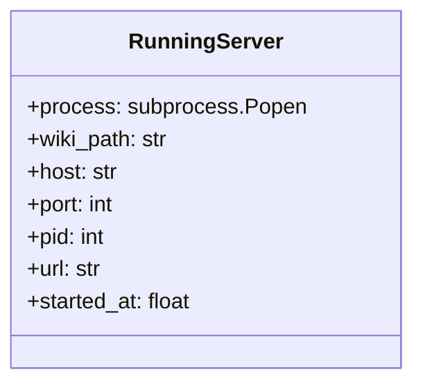

# File: `src/local_deepwiki/handlers/web_server.py`

## File Overview

This file implements the core logic for managing wiki web server lifecycle operations. It provides two primary handler functions: `handle_serve_wiki` and `handle_stop_wiki_server`. These functions are responsible for starting and stopping Flask-based wiki servers as subprocesses, managing their lifecycle, and handling errors appropriately.

The module maintains an in-memory registry of running servers (`_running_servers`) to track active processes, prevent conflicts, and support graceful shutdowns. It also includes utility functions for validating inputs, checking port availability, and ensuring secure subprocess execution.

## Key Concepts

### Server Lifecycle Management

The module implements a robust server lifecycle management system:
- **Process Tracking**: A global `_running_servers` registry tracks all started servers using `RunningServer` records.
- **Concurrency Control**: Uses an async lock (`_registry_lock`) to ensure thread-safe registration and unregistration of servers.
- **Graceful Shutdown**: Servers are terminated gracefully with `terminate()` before resorting to `kill()` if needed.

### Security and Sanitization

To prevent sensitive environment variables from leaking into subprocesses, the `_build_safe_env` function explicitly selects only a predefined set of environment variables to pass to child processes. This prevents accidental exposure of API keys or database credentials.

### Error Handling and Validation

- Input validation is performed via pydantic models ([`ServeWikiArgs`](../models/tool_args.md), [`StopWikiServerArgs`](../models/tool_args.md)) to ensure type safety and consistency.
- Custom validation logic ensures paths are valid and safe, checking for null bytes, option injection, and existence.
- Errors are wrapped in descriptive [`ValidationError`](../errors.md) exceptions for clear feedback to callers.

### Port and Host Management

- The module verifies that ports are not already in use before attempting to start a new server.
- It enforces that only loopback addresses (as defined in `ALLOWED_HOSTS`) can be used for server binding, enhancing security.
- A timeout-based health check (`_wait_for_server_ready`) ensures that a server is actually accepting connections before reporting success.

## Integration

This file is part of the `local_deepwiki.handlers` package and integrates with several other components:

- **CLI Entry Points**: The functions `handle_serve_wiki` and `handle_stop_wiki_server` are called by the CLI commands defined in `src/local_deepwiki/cli/main.py`.
- **Configuration Handling**: It depends on configuration models from `src/local_deepwiki/config/models_wiki.py` to validate inputs.
- **Error Handling**: Reuses error handling utilities from `src/local_deepwiki/handlers/_error_handling.py` and response generation from `src/local_deepwiki/handlers/_response.py`.
- **Security Layer**: Integrates with the permission system via `get_access_controller()` from `src/local_deepwiki/security.py` to enforce access control.

Additionally, this file is used by test suite functions (`test_handlers_web_server`) which call internal helper functions like `_get_running_servers`, `_clear_running_servers`, and `handle_serve_wiki`/`handle_stop_wiki_server` to simulate and verify behavior.

## Design Notes

### Trade-offs and Considerations

- **Process Management**: The use of `subprocess.Popen` to spawn Flask apps allows for true isolation and easier debugging, but introduces complexity in tracking and cleaning up processes.
- **Registry Locking**: An async lock is used to prevent race conditions when registering/unregistering servers. This is necessary because the registry is accessed from multiple async contexts.
- **Graceful Termination**: The module attempts graceful termination first, then forces a kill, balancing between clean shutdown and reliability.

### Edge Cases Handled

- **Dead Server Pruning**: The `_prune_dead_servers` function automatically cleans up registry entries for processes that have already exited, preventing stale entries.
- **Startup Failures**: If a server starts but fails to accept connections within a timeout, it raises a descriptive [`ValidationError`](../errors.md).
- **Browser Opening Failures**: When `open_browser` is enabled, failures to open the browser do not crash the server — they are logged as warnings.
- **Port Conflicts**: Before starting a server, the code checks if the port is already in use and raises a clear error if so.
- **[Permission](../security/access_control.md) Enforcement**: Only users with `SYSTEM_ADMIN` permission can start or stop servers, protecting against unauthorized access.

### Non-Obvious Implementation Choices

- **Use of `asyncio.to_thread`**: For spawning subprocesses and waiting on them, `asyncio.to_thread` is used to avoid blocking the event loop.
- **Health Check Interval**: A fixed `HEALTH_CHECK_INTERVAL` (not shown in snippet) is used for polling readiness, balancing responsiveness and resource usage.
- **Environment Sanitization**: Only a minimal set of environment variables is passed to subprocesses, reducing the risk of credential leakage.
- **Logging**: Extensive logging is used throughout to aid debugging and provide visibility into server state changes.

## API Reference

### class `RunningServer`

Immutable record of a running wiki server process.

---


<details>
<summary>View Source (lines 40-49) | <a href="https://github.com/UrbanDiver/local-deepwiki-mcp/blob/main/src/local_deepwiki/handlers/web_server.py#L40-L49">GitHub</a></summary>

```python
class RunningServer:
    """Immutable record of a running wiki server process."""

    process: subprocess.Popen
    wiki_path: str
    host: str
    port: int
    pid: int
    url: str
    started_at: float
```

</details>

### Functions

#### `handle_serve_wiki`

`@handle_tool_errors`

```python
async def handle_serve_wiki(args: dict[str, Any]) -> list[TextContent]
```

Start the Flask wiki web server as a subprocess.


| Parameter | Type | Default | Description |
|-----------|------|---------|-------------|
| `args` | `dict[str, Any]` | - | - |

**Returns:** `list[TextContent]`


<details>
<summary>View Source (lines 255-313) | <a href="https://github.com/UrbanDiver/local-deepwiki-mcp/blob/main/src/local_deepwiki/handlers/web_server.py#L255-L313">GitHub</a></summary>

```python
async def handle_serve_wiki(args: dict[str, Any]) -> list[TextContent]:
    """Start the Flask wiki web server as a subprocess."""
    get_access_controller().require_permission(Permission.SYSTEM_ADMIN)

    try:
        validated = ServeWikiArgs.model_validate(args)
    except PydanticValidationError as e:
        raise ValueError(str(e)) from e

    if validated.host not in ALLOWED_HOSTS:
        raise ValueError(
            f"Host must be a loopback address ({', '.join(sorted(ALLOWED_HOSTS))}), "
            f"got: {validated.host!r}"
        )

    wiki_path = _validate_wiki_path(validated.wiki_path)
    host = validated.host
    port = validated.port

    if not (wiki_path / "index.md").exists():
        logger.warning("Wiki directory has no index.md: %s", wiki_path)

    _prune_dead_servers()
    if len(_running_servers) >= MAX_CONCURRENT_SERVERS:
        raise ValueError(
            f"Maximum concurrent servers ({MAX_CONCURRENT_SERVERS}) reached. "
            f"Stop an existing server first."
        )

    spawn_result = await _spawn_and_register(wiki_path, host, port)
    # If a live server was already registered, return the already_running response.
    if isinstance(spawn_result, list):
        return spawn_result
    process, url = spawn_result

    logger.info("Wiki server started: pid=%d, url=%s", process.pid, url)

    if validated.open_browser:
        try:
            await asyncio.to_thread(webbrowser.open, url)
        except Exception as e:  # noqa: BLE001 — handler boundary: browser open in headless environments must not crash server
            logger.warning("Failed to open browser: %s", e)

    return make_tool_text_content(
        "serve_wiki",
        {
            "status": "started",
            "message": f"Wiki server started at {url}",
            "url": url,
            "pid": process.pid,
            "wiki_path": str(wiki_path),
            "host": host,
            "port": port,
        },
        hints={
            "open_in_browser": url,
            "stop_command": f"Use stop_wiki_server with port={port} to stop",
        },
    )
```

</details>

#### `handle_stop_wiki_server`

`@handle_tool_errors`

```python
async def handle_stop_wiki_server(args: dict[str, Any]) -> list[TextContent]
```

Stop a previously started wiki server subprocess.


| Parameter | Type | Default | Description |
|-----------|------|---------|-------------|
| `args` | `dict[str, Any]` | - | - |

**Returns:** `list[TextContent]`


<details>
<summary>View Source (lines 317-393) | <a href="https://github.com/UrbanDiver/local-deepwiki-mcp/blob/main/src/local_deepwiki/handlers/web_server.py#L317-L393">GitHub</a></summary>

```python
async def handle_stop_wiki_server(args: dict[str, Any]) -> list[TextContent]:
    """Stop a previously started wiki server subprocess."""
    get_access_controller().require_permission(Permission.SYSTEM_ADMIN)

    try:
        validated = StopWikiServerArgs.model_validate(args)
    except PydanticValidationError as e:
        raise ValueError(str(e)) from e

    port = validated.port
    server_record = _running_servers.get(port)

    if server_record is None:
        running = {
            str(p): {"wiki_path": s.wiki_path, "url": s.url, "pid": s.pid}
            for p, s in _running_servers.items()
            if s.process.poll() is None
        }
        return make_tool_text_content(
            "stop_wiki_server",
            {
                "status": "not_found",
                "message": f"No wiki server found on port {port}",
                "running_servers": running,
            },
        )

    # Optional wiki_path filter
    if validated.wiki_path is not None:
        resolved_filter = str(Path(validated.wiki_path).resolve())
        if server_record.wiki_path != resolved_filter:
            return make_tool_text_content(
                "stop_wiki_server",
                {
                    "status": "not_found",
                    "message": (
                        f"Server on port {port} serves {server_record.wiki_path}, "
                        f"not {resolved_filter}"
                    ),
                },
            )

    if server_record.process.poll() is not None:
        del _running_servers[port]
        return make_tool_text_content(
            "stop_wiki_server",
            {
                "status": "already_stopped",
                "message": (
                    f"Server on port {port} had already exited "
                    f"(code {server_record.process.returncode})"
                ),
            },
        )

    # Graceful terminate, then force kill if needed
    logger.info("Stopping wiki server: pid=%d, port=%d", server_record.pid, port)
    server_record.process.terminate()
    try:
        await asyncio.to_thread(server_record.process.wait, timeout=5)
    except subprocess.TimeoutExpired:
        logger.warning("Server did not stop gracefully, sending SIGKILL")
        server_record.process.kill()
        await asyncio.to_thread(server_record.process.wait, timeout=3)

    del _running_servers[port]
    logger.info("Wiki server stopped: pid=%d, port=%d", server_record.pid, port)

    return make_tool_text_content(
        "stop_wiki_server",
        {
            "status": "stopped",
            "message": f"Wiki server on port {port} has been stopped",
            "pid": server_record.pid,
            "wiki_path": server_record.wiki_path,
        },
    )
```

</details>

## Class Diagram



## Call Graph

```mermaid
flowchart TD
    N0[Path]
    N1[ValidationError]
    N2[ValueError]
    N3[_check_existing_server]
    N4[_cleanup_all_servers]
    N5[_handle_startup_failure]
    N6[_is_port_in_use]
    N7[_prune_dead_servers]
    N8[_spawn_and_register]
    N9[_spawn_wiki_server]
    N10[_validate_wiki_path]
    N11[_wait_for_server_ready]
    N12[connect_ex]
    N13[exists]
    N14[get_access_controller]
    N15[handle_serve_wiki]
    N16[handle_stop_wiki_server]
    N17[kill]
    N18[lstrip]
    N19[make_tool_text_content]
    N20[model_validate]
    N21[monotonic]
    N22[poll]
    N23[require_permission]
    N24[resolve]
    N25[settimeout]
    N26[sleep]
    N27[socket]
    N28[terminate]
    N29[to_thread]
    N6 --> N27
    N6 --> N25
    N6 --> N12
    N11 --> N21
    N11 --> N6
    N11 --> N26
    N10 --> N2
    N10 --> N18
    N10 --> N24
    N10 --> N0
    N10 --> N13
    N10 --> N1
    N7 --> N22
    N4 --> N28
    N4 --> N17
    N3 --> N22
    N3 --> N19
    N9 --> N29
    N5 --> N1
    N8 --> N3
    N8 --> N29
    N8 --> N1
    N8 --> N9
    N8 --> N11
    N8 --> N22
    N8 --> N5
    N15 --> N23
    N15 --> N14
    N15 --> N20
    N15 --> N2
    N15 --> N10
    N15 --> N13
    N15 --> N7
    N15 --> N8
    N15 --> N29
    N15 --> N19
    N16 --> N23
    N16 --> N14
    N16 --> N20
    N16 --> N2
    N16 --> N22
    N16 --> N19
    N16 --> N24
    N16 --> N0
    N16 --> N28
    N16 --> N29
    N16 --> N17
    classDef func fill:#e1f5fe
    class N0,N1,N2,N3,N4,N5,N6,N7,N8,N9,N10,N11,N12,N13,N14,N15,N16,N17,N18,N19,N20,N21,N22,N23,N24,N25,N26,N27,N28,N29 func
```



## Used By

Functions and methods in this file and their callers:

- **`Path`**: called by `_validate_wiki_path`, `handle_stop_wiki_server`
- **`RunningServer`**: called by `_spawn_and_register`
- **[`ValidationError`](../errors.md)**: called by `_handle_startup_failure`, `_spawn_and_register`, `_validate_wiki_path`
- **`ValueError`**: called by `_validate_wiki_path`, `handle_serve_wiki`, `handle_stop_wiki_server`
- **`_build_safe_env`**: called by `_spawn_wiki_server`
- **`_check_existing_server`**: called by `_spawn_and_register`
- **`_handle_startup_failure`**: called by `_spawn_and_register`
- **`_is_port_in_use`**: called by `_wait_for_server_ready`
- **`_prune_dead_servers`**: called by `handle_serve_wiki`
- **`_spawn_and_register`**: called by `handle_serve_wiki`
- **`_spawn_wiki_server`**: called by `_spawn_and_register`
- **`_validate_wiki_path`**: called by `handle_serve_wiki`
- **`_wait_for_server_ready`**: called by `_spawn_and_register`
- **`connect_ex`**: called by `_is_port_in_use`
- **`decode`**: called by `_handle_startup_failure`
- **`exists`**: called by `_validate_wiki_path`, `handle_serve_wiki`
- **[`get_access_controller`](../security/access_control.md)**: called by `handle_serve_wiki`, `handle_stop_wiki_server`
- **`is_dir`**: called by `_validate_wiki_path`
- **`kill`**: called by `_cleanup_all_servers`, `handle_stop_wiki_server`
- **`lstrip`**: called by `_validate_wiki_path`
- **[`make_tool_text_content`](_response.md)**: called by `_check_existing_server`, `handle_serve_wiki`, `handle_stop_wiki_server`
- **`model_validate`**: called by `handle_serve_wiki`, `handle_stop_wiki_server`
- **`monotonic`**: called by `_wait_for_server_ready`
- **[`path_not_found_error`](../error_factories.md)**: called by `_validate_wiki_path`
- **`poll`**: called by `_check_existing_server`, `_prune_dead_servers`, `_spawn_and_register`, `handle_stop_wiki_server`
- **`read`**: called by `_handle_startup_failure`
- **[`require_permission`](../security/access_control.md)**: called by `handle_serve_wiki`, `handle_stop_wiki_server`
- **`resolve`**: called by `_validate_wiki_path`, `handle_stop_wiki_server`
- **`settimeout`**: called by `_is_port_in_use`
- **`sleep`**: called by `_wait_for_server_ready`
- **`socket`**: called by `_is_port_in_use`
- **`terminate`**: called by `_cleanup_all_servers`, `handle_stop_wiki_server`
- **`time`**: called by `_spawn_and_register`
- **`to_thread`**: called by `_spawn_and_register`, `_spawn_wiki_server`, `handle_serve_wiki`, `handle_stop_wiki_server`
- **`wait`**: called by `_cleanup_all_servers`

## Last Modified

| Entity | Type | Author | Date | Commit |
|--------|------|--------|------|--------|
| `_check_existing_server` | function | Brian Breidenbach | yesterday | `29ae780` refactor: decompose long me... |
| `_spawn_wiki_server` | function | Brian Breidenbach | yesterday | `29ae780` refactor: decompose long me... |
| `_handle_startup_failure` | function | Brian Breidenbach | yesterday | `29ae780` refactor: decompose long me... |
| `_spawn_and_register` | function | Brian Breidenbach | yesterday | `29ae780` refactor: decompose long me... |
| `handle_serve_wiki` | function | Brian Breidenbach | yesterday | `29ae780` refactor: decompose long me... |
| `_cleanup_all_servers` | function | Brian Breidenbach | Feb 23, 2026 | `c6fe2bd` refactor: split oversized m... |
| `_prune_dead_servers` | function | Brian Breidenbach | Feb 20, 2026 | `f9ffbea` refactor: medium-priority P... |
| `handle_stop_wiki_server` | function | Brian Breidenbach | Feb 20, 2026 | `f9ffbea` refactor: medium-priority P... |
| `RunningServer` | class | Brian Breidenbach | Feb 18, 2026 | `3e2f123` feat: add serve_wiki and st... |
| `_is_port_in_use` | function | Brian Breidenbach | Feb 18, 2026 | `3e2f123` feat: add serve_wiki and st... |
| `_wait_for_server_ready` | function | Brian Breidenbach | Feb 18, 2026 | `3e2f123` feat: add serve_wiki and st... |
| `_build_safe_env` | function | Brian Breidenbach | Feb 18, 2026 | `3e2f123` feat: add serve_wiki and st... |
| `_validate_wiki_path` | function | Brian Breidenbach | Feb 18, 2026 | `3e2f123` feat: add serve_wiki and st... |
| `_get_running_servers` | function | Brian Breidenbach | Feb 18, 2026 | `3e2f123` feat: add serve_wiki and st... |
| `_clear_running_servers` | function | Brian Breidenbach | Feb 18, 2026 | `3e2f123` feat: add serve_wiki and st... |

## Additional Source Code

Source code for functions and methods not listed in the API Reference above.

#### `_is_port_in_use`

<details>
<summary>View Source (lines 59-63) | <a href="https://github.com/UrbanDiver/local-deepwiki-mcp/blob/main/src/local_deepwiki/handlers/web_server.py#L59-L63">GitHub</a></summary>

```python
def _is_port_in_use(host: str, port: int) -> bool:
    """Check if a port is already bound on the given host."""
    with socket.socket(socket.AF_INET, socket.SOCK_STREAM) as sock:
        sock.settimeout(1)
        return sock.connect_ex((host, port)) == 0
```

</details>


#### `_wait_for_server_ready`

<details>
<summary>View Source (lines 66-73) | <a href="https://github.com/UrbanDiver/local-deepwiki-mcp/blob/main/src/local_deepwiki/handlers/web_server.py#L66-L73">GitHub</a></summary>

```python
async def _wait_for_server_ready(host: str, port: int, timeout: float) -> bool:
    """Poll until the server is accepting connections or timeout."""
    start = time.monotonic()
    while time.monotonic() - start < timeout:
        if _is_port_in_use(host, port):
            return True
        await asyncio.sleep(HEALTH_CHECK_INTERVAL)
    return False
```

</details>


#### `_build_safe_env`

<details>
<summary>View Source (lines 76-85) | <a href="https://github.com/UrbanDiver/local-deepwiki-mcp/blob/main/src/local_deepwiki/handlers/web_server.py#L76-L85">GitHub</a></summary>

```python
def _build_safe_env() -> dict[str, str]:
    """Build a sanitized env for the subprocess.

    Prevents leaking API keys, DB passwords, etc. to the child process.
    """
    return {
        k: os.environ[k]
        for k in ("PATH", "HOME", "LANG", "PYTHONPATH", "VIRTUAL_ENV")
        if os.environ.get(k)
    }
```

</details>


#### `_validate_wiki_path`

<details>
<summary>View Source (lines 88-106) | <a href="https://github.com/UrbanDiver/local-deepwiki-mcp/blob/main/src/local_deepwiki/handlers/web_server.py#L88-L106">GitHub</a></summary>

```python
def _validate_wiki_path(raw_path: str) -> Path:
    """Validate wiki_path for null bytes, option injection, and existence."""
    if "\x00" in raw_path:
        raise ValueError("wiki_path contains null byte")
    if raw_path.lstrip().startswith("-"):
        raise ValueError("wiki_path must not start with '-'")

    resolved = Path(raw_path).resolve()

    if not resolved.exists():
        raise path_not_found_error(str(resolved), "wiki directory")
    if not resolved.is_dir():
        raise ValidationError(
            message=f"Path is not a directory: {resolved}",
            hint="Provide a path to a .deepwiki directory.",
            field="wiki_path",
            value=str(resolved),
        )
    return resolved
```

</details>


#### `_prune_dead_servers`

<details>
<summary>View Source (lines 109-115) | <a href="https://github.com/UrbanDiver/local-deepwiki-mcp/blob/main/src/local_deepwiki/handlers/web_server.py#L109-L115">GitHub</a></summary>

```python
def _prune_dead_servers() -> None:
    """Remove entries for processes that have already exited."""
    dead_ports = [
        p for p, s in _running_servers.items() if s.process.poll() is not None
    ]
    for port in dead_ports:
        del _running_servers[port]
```

</details>


#### `_cleanup_all_servers`

<details>
<summary>View Source (lines 119-130) | <a href="https://github.com/UrbanDiver/local-deepwiki-mcp/blob/main/src/local_deepwiki/handlers/web_server.py#L119-L130">GitHub</a></summary>

```python
def _cleanup_all_servers() -> None:
    """Terminate all tracked servers. Registered via atexit."""
    for server_info in list(_running_servers.values()):
        try:
            server_info.process.terminate()
            server_info.process.wait(timeout=3)
        except Exception:  # noqa: BLE001 — atexit cleanup: terminate may fail if process already exited
            try:
                server_info.process.kill()
            except Exception:  # noqa: BLE001 — atexit cleanup: kill is last resort, must not raise
                pass
    _running_servers.clear()
```

</details>


#### `_get_running_servers`

<details>
<summary>View Source (lines 137-139) | <a href="https://github.com/UrbanDiver/local-deepwiki-mcp/blob/main/src/local_deepwiki/handlers/web_server.py#L137-L139">GitHub</a></summary>

```python
def _get_running_servers() -> dict[int, RunningServer]:
    """Return a shallow copy of the running servers registry (for testing)."""
    return dict(_running_servers)
```

</details>


#### `_clear_running_servers`

<details>
<summary>View Source (lines 142-144) | <a href="https://github.com/UrbanDiver/local-deepwiki-mcp/blob/main/src/local_deepwiki/handlers/web_server.py#L142-L144">GitHub</a></summary>

```python
def _clear_running_servers() -> None:
    """Clear the running servers registry (for testing)."""
    _running_servers.clear()
```

</details>


#### `_check_existing_server`

<details>
<summary>View Source (lines 147-167) | <a href="https://github.com/UrbanDiver/local-deepwiki-mcp/blob/main/src/local_deepwiki/handlers/web_server.py#L147-L167">GitHub</a></summary>

```python
def _check_existing_server(port: int) -> list[TextContent] | None:
    """Return an already_running response if a live server is on this port, else None.

    Removes the registry entry if the process has already exited.
    """
    existing = _running_servers.get(port)
    if existing is None:
        return None
    if existing.process.poll() is None:
        return make_tool_text_content(
            "serve_wiki",
            {
                "status": "already_running",
                "message": f"Wiki server already running on port {port}",
                "url": existing.url,
                "pid": existing.pid,
                "wiki_path": existing.wiki_path,
            },
        )
    del _running_servers[port]
    return None
```

</details>


#### `_spawn_wiki_server`

<details>
<summary>View Source (lines 170-189) | <a href="https://github.com/UrbanDiver/local-deepwiki-mcp/blob/main/src/local_deepwiki/handlers/web_server.py#L170-L189">GitHub</a></summary>

```python
async def _spawn_wiki_server(wiki_path: Path, host: str, port: int) -> subprocess.Popen:
    """Spawn the Flask wiki subprocess and return the process handle."""
    safe_env = _build_safe_env()
    return await asyncio.to_thread(
        subprocess.Popen,
        [
            sys.executable,
            "-m",
            "local_deepwiki.web.app",
            str(wiki_path),
            "--host",
            host,
            "--port",
            str(port),
        ],
        shell=False,
        env=safe_env,
        stdout=subprocess.PIPE,
        stderr=subprocess.PIPE,
    )
```

</details>


#### `_handle_startup_failure`

<details>
<summary>View Source (lines 192-202) | <a href="https://github.com/UrbanDiver/local-deepwiki-mcp/blob/main/src/local_deepwiki/handlers/web_server.py#L192-L202">GitHub</a></summary>

```python
def _handle_startup_failure(process: subprocess.Popen, wiki_path: Path) -> None:
    """Raise a descriptive ValidationError when the server exits before accepting connections."""
    stderr_out = ""
    if process.stderr:
        stderr_out = process.stderr.read().decode("utf-8", errors="replace")[:500]
    raise ValidationError(
        message=f"Wiki server exited with code {process.returncode}",
        hint=f"Check Flask is installed and wiki path is valid. stderr: {stderr_out}",
        field="wiki_path",
        value=str(wiki_path),
    )
```

</details>


#### `_spawn_and_register`

<details>
<summary>View Source (lines 205-251) | <a href="https://github.com/UrbanDiver/local-deepwiki-mcp/blob/main/src/local_deepwiki/handlers/web_server.py#L205-L251">GitHub</a></summary>

```python
async def _spawn_and_register(
    wiki_path: Path,
    host: str,
    port: int,
) -> tuple[subprocess.Popen, str] | list[TextContent]:
    """Spawn the wiki server and register it under the registry lock.

    Returns (process, url) on success, or an already_running TextContent list
    when a live server is already registered on this port.

    Raises ValidationError if the port is in use or the process exits immediately.
    """
    async with _registry_lock:
        already_running = _check_existing_server(port)
        if already_running is not None:
            return already_running

        if await asyncio.to_thread(_is_port_in_use, host, port):
            raise ValidationError(
                message=f"Port {port} is already in use",
                hint=f"Choose a different port or stop the process using port {port}.",
                field="port",
                value=str(port),
            )

        process = await _spawn_wiki_server(wiki_path, host, port)
        url = f"http://{host}:{port}"
        ready = await _wait_for_server_ready(host, port, SERVER_STARTUP_TIMEOUT)

        if not ready:
            if process.poll() is not None:
                _handle_startup_failure(process, wiki_path)
            logger.warning(
                "Server started but not accepting connections after %ds",
                SERVER_STARTUP_TIMEOUT,
            )

        _running_servers[port] = RunningServer(
            process=process,
            wiki_path=str(wiki_path),
            host=host,
            port=port,
            pid=process.pid,
            url=url,
            started_at=time.time(),
        )
    return process, url
```

</details>

## Relevant Source Files

- `src/local_deepwiki/handlers/web_server.py:40-49`
