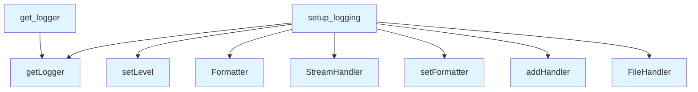

# logging.py

## File Overview

This module provides logging configuration utilities for the local-deepwiki package. It offers a centralized way to set up logging with customizable formats, output destinations, and log levels.

## Functions

### setup_logging

```python
def setup_logging(
    level: str | int | None = None,
    format_style: Literal["simple", "detailed"] = "simple",
    stream: bool = True,
    log_file: str | None = None,
) -> logging.Logger
```

Configure logging for the local-deepwiki package.

**Parameters:**
- `level`: Log level (DEBUG, INFO, WARNING, ERROR, CRITICAL). Defaults to INFO, or DEEPWIKI_LOG_LEVEL environment variable if set
- `format_style`: Format style for log messages - "simple" for basic format, "detailed" for file/line info
- `stream`: Whether to log to stderr (default: True)
- `log_file`: Optional file path for logging output

**Returns:**
- `logging.Logger`: The configured logger instance

### get_logger

A function for retrieving logger instances (signature not fully visible in the provided code).

## Usage Examples

### Basic Logging Setup

```python
from local_deepwiki.logging import setup_logging

# Simple setup with default INFO level
logger = setup_logging()

# Setup with custom level
logger = setup_logging(level="DEBUG")

# Setup with detailed formatting
logger = setup_logging(format_style="detailed")
```

### File and Stream Logging

```python
# Log to both stderr and a file
logger = setup_logging(
    level="INFO",
    format_style="detailed",
    stream=True,
    log_file="app.log"
)

# Log only to file
logger = setup_logging(
    stream=False,
    log_file="app.log"
)
```

### Environment Variable Configuration

The setup_logging function respects the `DEEPWIKI_LOG_LEVEL` environment variable for default log level configuration.

## Related Components

This module uses the standard Python `logging` module and integrates with environment variables through the `os` module. It provides logging infrastructure that can be used throughout the local-deepwiki package.

## API Reference

### Functions

#### `setup_logging`

```python
def setup_logging(level: str | int | None = None, format_style: Literal["simple", "detailed"] = "simple", stream: bool = True, log_file: str | None = None) -> logging.Logger
```

Configure logging for the local-deepwiki package.


| [Parameter](generators/api_docs.md) | Type | Default | Description |
|-----------|------|---------|-------------|
| `level` | `str | int | None` | `None` | Log level (DEBUG, INFO, WARNING, ERROR, CRITICAL). Defaults to INFO, or DEEPWIKI_LOG_LEVEL env var. |
| `format_style` | `Literal["simple", "detailed"]` | `"simple"` | "simple" for basic format, "detailed" for file/line info. |
| `stream` | `bool` | `True` | Whether to log to stderr. |
| `log_file` | `str | None` | `None` | Optional file path for logging. |

**Returns:** `logging.Logger`


#### `get_logger`

```python
def get_logger(name: str) -> logging.Logger
```

Get a logger for a specific module.


| [Parameter](generators/api_docs.md) | Type | Default | Description |
|-----------|------|---------|-------------|
| `name` | `str` | - | Module name (typically __name__). |

**Returns:** `logging.Logger`


## Call Graph



## Relevant Source Files

- `src/local_deepwiki/logging.py:19-70`

## See Also

- [git_utils](core/git_utils.md) - uses this
- [test_examples](generators/test_examples.md) - uses this
- [llm_cache](core/llm_cache.md) - uses this
- [server](server.md) - uses this
- [chunker](core/chunker.md) - uses this
