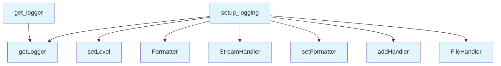

# Logging Module

## File Overview

The `logging.py` module provides centralized logging configuration for the local-deepwiki package. It offers flexible logging setup with support for different output formats, multiple destinations (console and file), and environment-based configuration.

## Functions

### setup_logging

Configures logging for the local-deepwiki package with customizable options.

**Parameters:**
- `level` (str | int | None): Log level such as DEBUG, INFO, WARNING, ERROR, or CRITICAL. Defaults to INFO, or uses the `DEEPWIKI_LOG_LEVEL` environment variable if set
- `format_style` (Literal["simple", "detailed"]): Format style - "simple" for basic format or "detailed" for format including file and line information. Defaults to "simple"
- `stream` (bool): Whether to enable logging to stderr. Defaults to True
- `log_file` (str | None): Optional file path for file-based logging. Defaults to None

**Returns:**
- `logging.Logger`: The configured logger instance

### get_logger

Based on the function name shown in the module summary, this function exists but its implementation details are not visible in the provided code.

## Usage Examples

### Basic Logging Setup

```python
from local_deepwiki.logging import setup_logging

# Simple setup with default INFO level
logger = setup_logging()
```

### Detailed Logging Configuration

```python
from local_deepwiki.logging import setup_logging

# Configure with detailed format and file output
logger = setup_logging(
    level="DEBUG",
    format_style="detailed",
    stream=True,
    log_file="/path/to/logfile.log"
)
```

### Environment-Based Configuration

```python
import os
from local_deepwiki.logging import setup_logging

# Set log level via environment variable
os.environ["DEEPWIKI_LOG_LEVEL"] = "WARNING"
logger = setup_logging()
```

## Related Components

This module uses the standard Python `logging` library and integrates with the operating system through `os` for environment variable access and `sys` for system-level operations.

## API Reference

### Functions

#### `setup_logging`

```python
def setup_logging(level: str | int | None = None, format_style: Literal["simple", "detailed"] = "simple", stream: bool = True, log_file: str | None = None) -> logging.Logger
```

Configure logging for the local-deepwiki package.


| [Parameter](generators/api_docs.md) | Type | Default | Description |
|-----------|------|---------|-------------|
| `level` | `str | int | None` | `None` | Log level (DEBUG, INFO, WARNING, ERROR, CRITICAL). Defaults to INFO, or DEEPWIKI_LOG_LEVEL env var. |
| `format_style` | `Literal["simple", "detailed"]` | `"simple"` | "simple" for basic format, "detailed" for file/line info. |
| `stream` | `bool` | `True` | Whether to log to stderr. |
| `log_file` | `str | None` | `None` | Optional file path for logging. |

**Returns:** `logging.Logger`


<details>
<summary>View Source (lines 18-72) | <a href="https://github.com/UrbanDiver/local-deepwiki-mcp/blob/[main](export/pdf.md)/src/local_deepwiki/logging.py#L18-L72">GitHub</a></summary>

```python
def setup_logging(
    level: str | int | None = None,
    format_style: Literal["simple", "detailed"] = "simple",
    stream: bool = True,
    log_file: str | None = None,
) -> logging.Logger:
    """Configure logging for the local-deepwiki package.

    Args:
        level: Log level (DEBUG, INFO, WARNING, ERROR, CRITICAL).
               Defaults to INFO, or DEEPWIKI_LOG_LEVEL env var.
        format_style: "simple" for basic format, "detailed" for file/line info.
        stream: Whether to log to stderr.
        log_file: Optional file path for logging.

    Returns:
        The configured root logger for the package.
    """
    # Determine log level
    if level is None:
        level = os.environ.get("DEEPWIKI_LOG_LEVEL", "INFO")

    if isinstance(level, str):
        level = getattr(logging, level.upper(), logging.INFO)

    # At this point level is guaranteed to be an int
    log_level: int = level if isinstance(level, int) else logging.INFO

    # Get the package logger
    logger = logging.getLogger(PACKAGE_NAME)
    logger.setLevel(log_level)

    # Clear existing handlers to avoid duplicates
    logger.handlers.clear()

    # Choose format
    log_format = LOG_FORMAT_DETAILED if format_style == "detailed" else LOG_FORMAT
    formatter = logging.Formatter(log_format)

    # Add stream handler
    if stream:
        stream_handler = logging.StreamHandler(sys.stderr)
        stream_handler.setFormatter(formatter)
        logger.addHandler(stream_handler)

    # Add file handler if specified
    if log_file:
        file_handler = logging.FileHandler(log_file)
        file_handler.setFormatter(formatter)
        logger.addHandler(file_handler)

    # Don't propagate to root logger
    logger.propagate = False

    return logger
```

</details>

#### `get_logger`

```python
def get_logger(name: str) -> logging.Logger
```

Get a logger for a specific module.


| [Parameter](generators/api_docs.md) | Type | Default | Description |
|-----------|------|---------|-------------|
| `name` | `str` | - | Module name (typically __name__). |

**Returns:** `logging.Logger`


<details>
<summary>View Source (lines 75-89) | <a href="https://github.com/UrbanDiver/local-deepwiki-mcp/blob/[main](export/pdf.md)/src/local_deepwiki/logging.py#L75-L89">GitHub</a></summary>

```python
def get_logger(name: str) -> logging.Logger:
    """Get a logger for a specific module.

    Args:
        name: Module name (typically __name__).

    Returns:
        Logger instance for the module.
    """
    # If name starts with the package name, use it directly
    if name.startswith(PACKAGE_NAME):
        return logging.getLogger(name)

    # Otherwise, prefix with package name
    return logging.getLogger(f"{PACKAGE_NAME}.{name}")
```

</details>

## Call Graph



## Used By

Functions and methods in this file and their callers:

- **`FileHandler`**: called by `setup_logging`
- **`Formatter`**: called by `setup_logging`
- **`StreamHandler`**: called by `setup_logging`
- **`addHandler`**: called by `setup_logging`
- **`getLogger`**: called by `get_logger`, `setup_logging`
- **`setFormatter`**: called by `setup_logging`
- **`setLevel`**: called by `setup_logging`

## Usage Examples

*Examples extracted from test files*

### Test setup_logging uses INFO as default level

From `test_logging_coverage.py::TestSetupLogging::test_setup_logging_default_level`:

```python
logger = setup_logging()

assert logger.name == PACKAGE_NAME
assert logger.level == logging.INFO
assert len(logger.handlers) == 1
assert isinstance(logger.handlers[0], logging.StreamHandler)
```

### Test setup_logging uses INFO as default level

From `test_logging_coverage.py::TestSetupLogging::test_setup_logging_default_level`:

```python
logger = setup_logging()

assert logger.name == PACKAGE_NAME
assert logger.level == logging.INFO
assert len(logger.handlers) == 1
assert isinstance(logger.handlers[0], logging.StreamHandler)
```

### Test setup_logging accepts string level

From `test_logging_coverage.py::TestSetupLogging::test_setup_logging_with_string_level`:

```python
logger = setup_logging(level="DEBUG")

assert logger.level == logging.DEBUG
```

### Test setup_logging accepts string level

From `test_logging_coverage.py::TestSetupLogging::test_setup_logging_with_string_level`:

```python
logger = setup_logging(level="DEBUG")

assert logger.level == logging.DEBUG
```

### Test get_logger with name starting with package name

From `test_logging_coverage.py::TestGetLogger::test_get_logger_with_package_prefix`:

```python
module_name = f"{PACKAGE_NAME}.some_module"
logger = get_logger(module_name)

assert logger.name == module_name
```


## Last Modified

| Entity | Type | Author | Date | Commit |
|--------|------|--------|------|--------|
| `setup_logging` | function | Brian Breidenbach | yesterday | `8078321` Fix ruff and pyright code q... |
| `get_logger` | function | Brian Breidenbach | 3 days ago | `60f9bc9` Add structured logging module |

## Relevant Source Files

- `src/local_deepwiki/logging.py:18-72`

## See Also

- [test_examples](generators/test_examples.md) - uses this
- [vectorstore](core/vectorstore.md) - uses this
- [chunker](core/chunker.md) - uses this

## See Also

- [chunker](core/chunker.md) - uses this
- [vectorstore](core/vectorstore.md) - uses this
- [test_examples](generators/test_examples.md) - uses this
