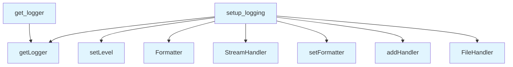

# File Overview

This file, `src/local_deepwiki/logging.py`, provides logging configuration and utility functions for the `local-deepwiki` package. It sets up logging with customizable log levels, output streams, and file destinations. The module also includes a helper function to retrieve loggers for specific modules, ensuring consistent logging behavior across the package.

## Classes

### AuditLogger

The [`AuditLogger`](core/audit.md) class is referenced in the type definitions but is not defined in the provided code. It is likely a custom logger class used for audit trails or specific logging requirements within the package.

## Functions

### setup_logging

```python
def setup_logging(
    level: str | int | None = None,
    format_style: Literal["simple", "detailed"] = "simple",
    stream: bool = True,
    log_file: str | None = None,
) -> logging.Logger:
```

Configures logging for the `local-deepwiki` package.

**Parameters:**
- `level` (`str | int | None`): Log level (DEBUG, INFO, WARNING, ERROR, CRITICAL). Defaults to INFO, or `DEEPWIKI_LOG_LEVEL` environment variable.
- `format_style` (`Literal["simple", "detailed"]`): "simple" for basic format, "detailed" for file/line info. Defaults to "simple".
- `stream` (`bool`): Whether to log to stderr. Defaults to `True`.
- `log_file` (`str | None`): Optional file path for logging. Defaults to `None`.

**Returns:**
- `logging.Logger`: The configured logger instance.

### get_logger

```python
def get_logger(name: str) -> logging.Logger:
```

Get a logger for a specific module.

**Parameters:**
- `name` (`str`): Module name (typically `__name__`).

**Returns:**
- `logging.Logger`: Logger instance for the module.

## Integration

This file is used by the `setup_logging` function, which is called by `test_logging_coverage`. It integrates with the standard Python `logging` module and supports configuration via environment variables and function parameters. The `get_logger` function ensures consistent logger naming by prefixing module names with the package name when necessary.

## Usage Examples

### Setup Logging

```python
import logging
from local_deepwiki.logging import setup_logging

# Configure logging with default settings
logger = setup_logging()

# Configure logging with custom level and format
logger = setup_logging(level=logging.DEBUG, format_style="detailed")
```

### Get Logger

```python
from local_deepwiki.logging import get_logger

# Get logger for current module
logger = get_logger(__name__)
```

## API Reference

### Functions

#### `setup_logging`

```python
def setup_logging(level: str | int | None = None, format_style: Literal["simple", "detailed"] = "simple", stream: bool = True, log_file: str | None = None) -> logging.Logger
```

Configure logging for the local-deepwiki package.


| [Parameter](generators/api_docs.md) | Type | Default | Description |
|-----------|------|---------|-------------|
| `level` | `str | int | None` | `None` | Log level (DEBUG, INFO, WARNING, ERROR, CRITICAL). Defaults to INFO, or DEEPWIKI_LOG_LEVEL env var. |
| `format_style` | `Literal["simple", "detailed"]` | `"simple"` | "simple" for basic format, "detailed" for file/line info. |
| `stream` | `bool` | `True` | Whether to log to stderr. |
| `log_file` | `str | None` | `None` | Optional file path for logging. |

**Returns:** `logging.Logger`


<details>
<summary>View Source (lines 18-72) | <a href="https://github.com/UrbanDiver/local-deepwiki-mcp/blob/[main](export/pdf.md)/src/local_deepwiki/logging.py#L18-L72">GitHub</a></summary>

```python
def setup_logging(
    level: str | int | None = None,
    format_style: Literal["simple", "detailed"] = "simple",
    stream: bool = True,
    log_file: str | None = None,
) -> logging.Logger:
    """Configure logging for the local-deepwiki package.

    Args:
        level: Log level (DEBUG, INFO, WARNING, ERROR, CRITICAL).
               Defaults to INFO, or DEEPWIKI_LOG_LEVEL env var.
        format_style: "simple" for basic format, "detailed" for file/line info.
        stream: Whether to log to stderr.
        log_file: Optional file path for logging.

    Returns:
        The configured root logger for the package.
    """
    # Determine log level
    if level is None:
        level = os.environ.get("DEEPWIKI_LOG_LEVEL", "INFO")

    if isinstance(level, str):
        level = getattr(logging, level.upper(), logging.INFO)

    # At this point level is guaranteed to be an int
    log_level: int = level if isinstance(level, int) else logging.INFO

    # Get the package logger
    logger = logging.getLogger(PACKAGE_NAME)
    logger.setLevel(log_level)

    # Clear existing handlers to avoid duplicates
    logger.handlers.clear()

    # Choose format
    log_format = LOG_FORMAT_DETAILED if format_style == "detailed" else LOG_FORMAT
    formatter = logging.Formatter(log_format)

    # Add stream handler
    if stream:
        stream_handler = logging.StreamHandler(sys.stderr)
        stream_handler.setFormatter(formatter)
        logger.addHandler(stream_handler)

    # Add file handler if specified
    if log_file:
        file_handler = logging.FileHandler(log_file)
        file_handler.setFormatter(formatter)
        logger.addHandler(file_handler)

    # Don't propagate to root logger
    logger.propagate = False

    return logger
```

</details>

#### `get_logger`

```python
def get_logger(name: str) -> logging.Logger
```

Get a logger for a specific module.


| [Parameter](generators/api_docs.md) | Type | Default | Description |
|-----------|------|---------|-------------|
| `name` | `str` | - | Module name (typically __name__). |

**Returns:** `logging.Logger`


<details>
<summary>View Source (lines 75-89) | <a href="https://github.com/UrbanDiver/local-deepwiki-mcp/blob/[main](export/pdf.md)/src/local_deepwiki/logging.py#L75-L89">GitHub</a></summary>

```python
def get_logger(name: str) -> logging.Logger:
    """Get a logger for a specific module.

    Args:
        name: Module name (typically __name__).

    Returns:
        Logger instance for the module.
    """
    # If name starts with the package name, use it directly
    if name.startswith(PACKAGE_NAME):
        return logging.getLogger(name)

    # Otherwise, prefix with package name
    return logging.getLogger(f"{PACKAGE_NAME}.{name}")
```

</details>

## Call Graph


```mermaid
flowchart TD
    N0[FileHandler]
    N1[Formatter]
    N2[StreamHandler]
    N3[addHandler]
    N4[getLogger]
    N5[get_logger]
    N6[setFormatter]
    N7[setLevel]
    N8[setup_logging]
    N8 --> N4
    N8 --> N7
    N8 --> N1
    N8 --> N2
    N8 --> N6
    N8 --> N3
    N8 --> N0
    N5 --> N4
    classDef func fill:#e1f5fe
    class N0,N1,N2,N3,N4,N5,N6,N7,N8 func
```

## Used By

Functions and methods in this file and their callers:

- **`FileHandler`**: called by `setup_logging`
- **`Formatter`**: called by `setup_logging`
- **`StreamHandler`**: called by `setup_logging`
- **`addHandler`**: called by `setup_logging`
- **`getLogger`**: called by `get_logger`, `setup_logging`
- **`setFormatter`**: called by `setup_logging`
- **`setLevel`**: called by `setup_logging`

## Usage Examples

*Examples extracted from test files*

### Test setup_logging uses INFO as default level

From `test_logging_coverage.py::TestSetupLogging::test_setup_logging_default_level`:

```python
logger = setup_logging()

assert logger.name == PACKAGE_NAME
assert logger.level == logging.INFO
assert len(logger.handlers) == 1
assert isinstance(logger.handlers[0], logging.StreamHandler)
```

### Test setup_logging uses INFO as default level

From `test_logging_coverage.py::TestSetupLogging::test_setup_logging_default_level`:

```python
logger = setup_logging()

assert logger.name == PACKAGE_NAME
assert logger.level == logging.INFO
assert len(logger.handlers) == 1
assert isinstance(logger.handlers[0], logging.StreamHandler)
```

### Test setup_logging accepts string level

From `test_logging_coverage.py::TestSetupLogging::test_setup_logging_with_string_level`:

```python
logger = setup_logging(level="DEBUG")

assert logger.level == logging.DEBUG
```

### Test setup_logging accepts string level

From `test_logging_coverage.py::TestSetupLogging::test_setup_logging_with_string_level`:

```python
logger = setup_logging(level="DEBUG")

assert logger.level == logging.DEBUG
```

### Test get_logger with name starting with package name

From `test_logging_coverage.py::TestGetLogger::test_get_logger_with_package_prefix`:

```python
module_name = f"{PACKAGE_NAME}.some_module"
logger = get_logger(module_name)

assert logger.name == module_name
```


## Last Modified

| Entity | Type | Author | Date | Commit |
|--------|------|--------|------|--------|
| `setup_logging` | function | Brian Breidenbach | 3 weeks ago | `8078321` Fix ruff and pyright code q... |
| `get_logger` | function | Brian Breidenbach | 3 weeks ago | `60f9bc9` Add structured logging module |

## Relevant Source Files

- `src/local_deepwiki/logging.py:18-72`
