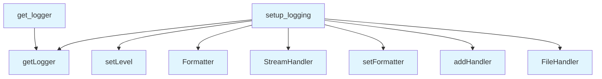

# File: `src/local_deepwiki/logging.py`

## File Overview

This file provides logging configuration and utility functions for the `local-deepwiki` package. It centralizes the setup and retrieval of loggers to ensure consistent logging behavior across the application. The module allows for flexible configuration of log levels, output formats, and destinations (console and/or file), making it suitable for both development and production environments.

The file is designed to be a single point of entry for all logging-related setup within the package, enabling centralized control over logging behavior and reducing boilerplate code in other modules.

## Key Concepts

### Logger Configuration Abstraction
The `setup_logging` function abstracts the complexity of configuring Python's `logging` module. It handles:
- Parsing log level from string or integer input, falling back to an environment variable (`DEEPWIKI_LOG_LEVEL`) if not explicitly provided.
- Selecting between simple and detailed log formats.
- Adding handlers for both console (`StreamHandler`) and file (`FileHandler`) output.
- Ensuring no duplicate handlers are added by clearing existing ones before adding new ones.
- Preventing logs from propagating to the root logger to avoid duplicate or unwanted messages.

This abstraction promotes consistency and reduces the risk of misconfigured loggers across the application.

### Module-Specific Logger Retrieval
The `get_logger` function ensures that loggers are retrieved with consistent naming conventions. It prefixes module names with the package name (`PACKAGE_NAME`) if they are not already prefixed, which helps in organizing logs under a common namespace and improves traceability.

This design choice aligns with Python logging best practices, where loggers are typically named using the module's `__name__` attribute, but also ensures that all loggers within this package are clearly grouped under the `local_deepwiki` namespace.

## Integration

This file is used by:
- `test_logging_config` and `test_logging_coverage` — which call `setup_logging` to configure logging during testing.

The module integrates with the rest of the `local-deepwiki` package by:
- Providing a standard way to set up logging for the entire package.
- Supporting the use of `get_logger` in core modules like `src/local_deepwiki/core/audit.py`, `src/local_deepwiki/core/graph_rag/models.py`, and `src/local_deepwiki/generators/analysis/api_docs.py` to ensure consistent logging behavior across components.

The functions defined here are essential for maintaining a clean and predictable logging system that can be configured externally via environment variables or passed directly in code.

## Design Notes

### Log Level Handling
The log level is parsed in a robust way:
- If a string is passed, it's converted to a numeric level using `getattr(logging, level.upper(), logging.INFO)`.
- If the environment variable `DEEPWIKI_LOG_LEVEL` is not set, it defaults to `INFO`.
- This allows for flexibility in configuration without breaking the application if an invalid log level is passed.

### Handler Management
The `setup_logging` function explicitly clears existing handlers before adding new ones to prevent duplication. This is important in environments where logging might be initialized multiple times (e.g., during tests or in interactive environments).

### Propagation Control
The line `logger.propagate = False` prevents log messages from being passed up to the root logger. This avoids duplicate logging in scenarios where multiple loggers are configured or where the root logger is also configured elsewhere.

### Format Flexibility
The choice to support both "simple" and "detailed" log formats allows developers to choose the verbosity of logs depending on the context:
- "simple" format is suitable for console output where brevity is preferred.
- "detailed" format includes file and line information, which is useful for debugging.

This design supports both operational and diagnostic use cases without requiring changes to the core logging logic.

## API Reference

### Functions

#### `setup_logging`

```python
def setup_logging(level: str | int | None = None, format_style: Literal["simple", "detailed"] = "simple", stream: bool = True, log_file: str | None = None) -> logging.Logger
```

Configure logging for the local-deepwiki package.


| Parameter | Type | Default | Description |
|-----------|------|---------|-------------|
| `level` | `str | int | None` | `None` | Log level (DEBUG, INFO, WARNING, ERROR, CRITICAL). Defaults to INFO, or DEEPWIKI_LOG_LEVEL env var. |
| `format_style` | `Literal["simple", "detailed"]` | `"simple"` | "simple" for basic format, "detailed" for file/line info. |
| `stream` | `bool` | `True` | Whether to log to stderr. |
| `log_file` | `str | None` | `None` | Optional file path for logging. |

**Returns:** `logging.Logger`


<details>
<summary>View Source (lines 28-83) | <a href="https://github.com/UrbanDiver/local-deepwiki-mcp/blob/main/src/local_deepwiki/logging.py#L28-L83">GitHub</a></summary>

```python
def setup_logging(
    level: str | int | None = None,
    *,
    format_style: Literal["simple", "detailed"] = "simple",
    stream: bool = True,
    log_file: str | None = None,
) -> logging.Logger:
    """Configure logging for the local-deepwiki package.

    Args:
        level: Log level (DEBUG, INFO, WARNING, ERROR, CRITICAL).
               Defaults to INFO, or DEEPWIKI_LOG_LEVEL env var.
        format_style: "simple" for basic format, "detailed" for file/line info.
        stream: Whether to log to stderr.
        log_file: Optional file path for logging.

    Returns:
        The configured root logger for the package.
    """
    # Determine log level
    if level is None:
        level = os.environ.get("DEEPWIKI_LOG_LEVEL", "INFO")

    if isinstance(level, str):
        level = getattr(logging, level.upper(), logging.INFO)

    # At this point level is guaranteed to be an int
    log_level: int = level if isinstance(level, int) else logging.INFO

    # Get the package logger
    logger = logging.getLogger(PACKAGE_NAME)
    logger.setLevel(log_level)

    # Clear existing handlers to avoid duplicates
    logger.handlers.clear()

    # Choose format
    log_format = LOG_FORMAT_DETAILED if format_style == "detailed" else LOG_FORMAT
    formatter = logging.Formatter(log_format)

    # Add stream handler
    if stream:
        stream_handler = logging.StreamHandler(sys.stderr)
        stream_handler.setFormatter(formatter)
        logger.addHandler(stream_handler)

    # Add file handler if specified
    if log_file:
        file_handler = logging.FileHandler(log_file)
        file_handler.setFormatter(formatter)
        logger.addHandler(file_handler)

    # Don't propagate to root logger
    logger.propagate = False

    return logger
```

</details>

#### `get_logger`

```python
def get_logger(name: str) -> logging.Logger
```

Get a logger for a specific module.


| Parameter | Type | Default | Description |
|-----------|------|---------|-------------|
| `name` | `str` | - | Module name (typically __name__). |

**Returns:** `logging.Logger`


<details>
<summary>View Source (lines 86-100) | <a href="https://github.com/UrbanDiver/local-deepwiki-mcp/blob/main/src/local_deepwiki/logging.py#L86-L100">GitHub</a></summary>

```python
def get_logger(name: str) -> logging.Logger:
    """Get a logger for a specific module.

    Args:
        name: Module name (typically __name__).

    Returns:
        Logger instance for the module.
    """
    # If name starts with the package name, use it directly
    if name.startswith(PACKAGE_NAME):
        return logging.getLogger(name)

    # Otherwise, prefix with package name
    return logging.getLogger(f"{PACKAGE_NAME}.{name}")
```

</details>

## Call Graph


```mermaid
flowchart TD
    N0[FileHandler]
    N1[Formatter]
    N2[StreamHandler]
    N3[addHandler]
    N4[getLogger]
    N5[get_logger]
    N6[setFormatter]
    N7[setLevel]
    N8[setup_logging]
    N8 --> N4
    N8 --> N7
    N8 --> N1
    N8 --> N2
    N8 --> N6
    N8 --> N3
    N8 --> N0
    N5 --> N4
    classDef func fill:#e1f5fe
    class N0,N1,N2,N3,N4,N5,N6,N7,N8 func
```

## Used By

Functions and methods in this file and their callers:

- **`FileHandler`**: called by `setup_logging`
- **`Formatter`**: called by `setup_logging`
- **`StreamHandler`**: called by `setup_logging`
- **`addHandler`**: called by `setup_logging`
- **`getLogger`**: called by `get_logger`, `setup_logging`
- **`setFormatter`**: called by `setup_logging`
- **`setLevel`**: called by `setup_logging`

## Usage Examples

*Examples extracted from test files*

### Test setup_logging uses INFO as default level

From `test_logging_coverage.py::TestSetupLogging::test_setup_logging_default_level`:

```python
logger = setup_logging()

assert logger.name == PACKAGE_NAME
assert logger.level == logging.INFO
assert len(logger.handlers) == 1
assert isinstance(logger.handlers[0], logging.StreamHandler)
```

### Test setup_logging uses INFO as default level

From `test_logging_coverage.py::TestSetupLogging::test_setup_logging_default_level`:

```python
logger = setup_logging()

assert logger.name == PACKAGE_NAME
assert logger.level == logging.INFO
assert len(logger.handlers) == 1
assert isinstance(logger.handlers[0], logging.StreamHandler)
```

### Test setup_logging accepts string level

From `test_logging_coverage.py::TestSetupLogging::test_setup_logging_with_string_level`:

```python
logger = setup_logging(level="DEBUG")

assert logger.level == logging.DEBUG
```

### Test get_logger with name starting with package name

From `test_logging_coverage.py::TestGetLogger::test_get_logger_with_package_prefix`:

```python
module_name = f"{PACKAGE_NAME}.some_module"
logger = get_logger(module_name)

assert logger.name == module_name
```

### Test get_logger with name not starting with package name

From `test_logging_coverage.py::TestGetLogger::test_get_logger_without_package_prefix`:

```python
module_name = "external_module"
logger = get_logger(module_name)

assert logger.name == f"{PACKAGE_NAME}.{module_name}"
```


## Last Modified

| Entity | Type | Author | Date | Commit |
|--------|------|--------|------|--------|
| `setup_logging` | function | Brian Breidenbach | Feb 20, 2026 | `8182b15` refactor: Pythonic API impr... |
| `get_logger` | function | Brian Breidenbach | Jan 13, 2026 | `60f9bc9` Add structured logging module |

## Relevant Source Files

- `src/local_deepwiki/logging.py:28-83`

## See Also

- [cli_progress](cli_progress.md) - shares 3 dependencies
- [access_control](security/access_control.md) - shares 2 dependencies

## See Also

- [init_cli](cli/init_cli.md) - shares 3 dependencies

## See Also

- [coupling](generators/analysis/coupling.md) - uses this
- [init_cli](cli/init_cli.md) - shares 3 dependencies

## See Also

- [coupling](generators/analysis/coupling.md) - uses this
- [init_cli](cli/init_cli.md) - shares 3 dependencies

## See Also

- [coupling](generators/analysis/coupling.md) - uses this
- [init_cli](cli/init_cli.md) - shares 3 dependencies

## See Also

- [coupling](generators/analysis/coupling.md) - uses this
- [init_cli](cli/init_cli.md) - shares 3 dependencies

## See Also

- [coupling](generators/analysis/coupling.md) - uses this
- [init_cli](cli/init_cli.md) - shares 3 dependencies

## See Also

- [coupling](generators/analysis/coupling.md) - uses this
- [init_cli](cli/init_cli.md) - shares 3 dependencies
