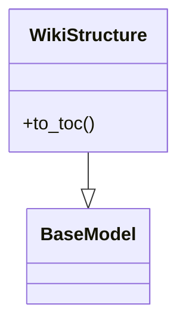
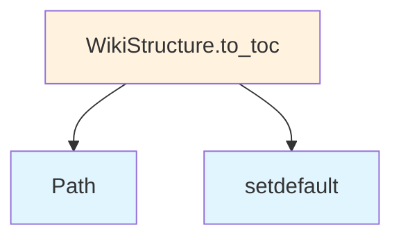

# File Overview

This file defines the core data models and enumerations used throughout the local_deepwiki system. It provides the foundational data structures that represent various components of the wiki generation process, including language specifications, chunk types, file information, wiki pages, and search results. These models serve as the interface between different system components and ensure type safety and data consistency across the application.

The models in this file work closely with components like [WikiGenerator](generators/wiki.md), [CodeChunker](core/chunker.md), and [VectorStore](core/vectorstore.md) to handle the structured representation of code documentation, file analysis, and search functionality within the local deep wiki system.

# Classes

## Language

An enumeration representing supported programming languages for code analysis and documentation generation.

```python
class Language(Enum):
    PYTHON = "python"
    JAVASCRIPT = "javascript"
    JAVA = "java"
    CPP = "cpp"
    CSHARP = "csharp"
    GO = "go"
    RUST = "rust"
    TYPESCRIPT = "typescript"
    PHP = "php"
    RUBY = "ruby"
```

## ChunkType

An enumeration defining the types of code chunks that can be processed during documentation generation.

```python
class ChunkType(Enum):
    FUNCTION = "function"
    CLASS = "class"
    METHOD = "method"
    MODULE = "module"
    FILE = "file"
    COMMENT = "comment"
    IMPORT = "import"
    EXPORT = "export"
    VARIABLE = "variable"
    CONSTANT = "constant"
    INTERFACE = "interface"
    TYPE = "type"
    ENUM = "enum"
    TRAIT = "trait"
    STRUCT = "struct"
    UNION = "union"
    EXCEPTION = "exception"
    TEST = "test"
    CONFIG = "config"
    README = "readme"
    DOCUMENTATION = "documentation"
```

## CodeChunk

A data model representing a structured code element with metadata for documentation generation.

```python
class CodeChunk(BaseModel):
    id: str = Field(..., description="Unique identifier for the code chunk")
    content: str = Field(..., description="The actual code content")
    type: ChunkType = Field(..., description="Type of code chunk")
    language: Language = Field(..., description="Programming language of the chunk")
    file_path: str = Field(..., description="Path to the source file")
    start_line: int = Field(..., description="Starting line number in source file")
    end_line: int = Field(..., description="Ending line number in source file")
    name: str = Field(..., description="Name of the code element")
    description: str = Field("", description="Description of the code element")
    tags: list[str] = Field(default_factory=list, description="Tags for categorizing the chunk")
    metadata: dict[str, Any] = Field(default_factory=dict, description="Additional metadata")
```

## FileInfo

A data model representing information about source files in the codebase.

```python
class FileInfo(BaseModel):
    path: str = Field(..., description="Full path to the file")
    name: str = Field(..., description="Name of the file")
    extension: str = Field(..., description="File extension")
    language: Language = Field(..., description="Programming language of the file")
    size: int = Field(..., description="File size in bytes")
    last_modified: str = Field(..., description="Last modified timestamp")
    is_binary: bool = Field(False, description="Whether the file is binary")
    is_test: bool = Field(False, description="Whether the file contains tests")
    is_documentation: bool = Field(False, description="Whether the file is documentation")
```

## IndexStatus

An enumeration representing the indexing status of files and chunks in the wiki system.

```python
class IndexStatus(Enum):
    PENDING = "pending"
    PROCESSING = "processing"
    COMPLETED = "completed"
    FAILED = "failed"
    SKIPPED = "skipped"
```

## WikiPage

A data model representing a page in the generated wiki documentation.

```python
class WikiPage(BaseModel):
    id: str = Field(..., description="Unique identifier for the wiki page")
    title: str = Field(..., description="Title of the wiki page")
    content: str = Field(..., description="Markdown content of the page")
    file_path: str = Field(..., description="Source file path this page represents")
    chunks: list[str] = Field(default_factory=list, description="List of chunk IDs included in this page")
    created_at: str = Field(..., description="Creation timestamp")
    updated_at: str = Field(..., description="Last update timestamp")
    tags: list[str] = Field(default_factory=list, description="Tags for categorizing the page")
    status: WikiPageStatus = Field(WikiPageStatus.DRAFT, description="Status of the page")
```

## WikiStructure

A data model representing the hierarchical structure of the wiki documentation.

```python
class WikiStructure(BaseModel):
    pages: dict[str, WikiPage] = Field(default_factory=dict, description="Dictionary of wiki pages by ID")
    sections: dict[str, dict] = Field(default_factory=dict, description="Hierarchical structure of sections")
    navigation: dict[str, str] = Field(default_factory=dict, description="Navigation links between pages")
    metadata: dict[str, Any] = Field(default_factory=dict, description="Additional structure metadata")
```

## SearchResult

A data model representing search results from the wiki system.

```python
class SearchResult(BaseModel):
    query: str = Field(..., description="The search query that was executed")
    results: list[dict[str, Any]] = Field(default_factory=list, description="List of search result items")
    total_matches: int = Field(..., description="Total number of matches found")
    page: int = Field(..., description="Current page of results")
    page_size: int = Field(..., description="Number of results per page")
    timestamp: str = Field(..., description="Timestamp of the search")
```

## WikiPageStatus

An enumeration representing the status of wiki pages.

```python
class WikiPageStatus(Enum):
    DRAFT = "draft"
    PUBLISHED = "published"
    ARCHIVED = "archived"
    DELETED = "deleted"
```

## WikiGenerationStatus

An enumeration representing the overall status of wiki generation process.

```python
class WikiGenerationStatus(Enum):
    NOT_STARTED = "not_started"
    IN_PROGRESS = "in_progress"
    COMPLETED = "completed"
    FAILED = "failed"
    CANCELLED = "cancelled"
```

# Usage Examples

## Creating a CodeChunk

```python
from local_deepwiki.models import CodeChunk, ChunkType, Language

chunk = CodeChunk(
    id="chunk_123",
    content="def hello_world():\n    return 'Hello, World!'",
    type=ChunkType.FUNCTION,
    language=Language.PYTHON,
    file_path="/src/main.py",
    start_line=1,
    end_line=3,
    name="hello_world",
    description="A simple hello world function"
)
```

## Creating a WikiPage

```python
from local_deepwiki.models import WikiPage, WikiPageStatus

page = WikiPage(
    id="page_456",
    title="Getting Started",
    content="# Getting Started\n\nThis is a sample page.",
    file_path="/docs/getting_started.md",
    chunks=["chunk_123"],
    status=WikiPageStatus.PUBLISHED
)
```

## Creating FileInfo

```python
from local_deepwiki.models import FileInfo, Language

file_info = FileInfo(
    path="/src/main.py",
    name="main.py",
    extension=".py",
    language=Language.PYTHON,
    size=1024,
    last_modified="2023-01-01T00:00:00Z"
)
```

## Using SearchResult

```python
from local_deepwiki.models import SearchResult

search_result = SearchResult(
    query="hello world",
    results=[{"title": "Hello World", "content": "Sample content"}],
    total_matches=1,
    page=1,
    page_size=10
)
```

# Related Components

This models file works closely with [WikiGenerator](generators/wiki.md) to create and manage documentation pages, with [CodeChunker](core/chunker.md) to process and categorize code elements, and with [VectorStore](core/vectorstore.md) to store and retrieve embeddings for search functionality. The data models provide the structured interface that allows these components to communicate effectively and maintain consistent data formats throughout the system.

## API Reference

### class `Language`

**Inherits from:** `str`, `Enum`

Supported programming languages.

### class `ChunkType`

**Inherits from:** `str`, `Enum`

Types of code chunks.

### class `CodeChunk`

**Inherits from:** `BaseModel`

A chunk of code extracted from the repository.

### class `FileInfo`

**Inherits from:** `BaseModel`

Information about a source file.

### class `IndexStatus`

**Inherits from:** `BaseModel`

Status of repository indexing.

### class `WikiPage`

**Inherits from:** `BaseModel`

A generated wiki page.

### class `WikiStructure`

**Inherits from:** `BaseModel`

Structure of the generated wiki.

**Methods:**

#### `to_toc`

```python
def to_toc() -> dict[str, Any]
```

Generate table of contents.


### class `SearchResult`

**Inherits from:** `BaseModel`

A search result from semantic search.

### class `WikiPageStatus`

**Inherits from:** `BaseModel`

Status of a generated wiki page for incremental generation.

### class `WikiGenerationStatus`

**Inherits from:** `BaseModel`

Status of wiki generation for tracking incremental updates.


## Class Diagram



## Call Graph



## See Also

- [chunker](core/chunker.md) - uses this
- [test_api_docs](../../tests/test_api_docs.md) - uses this
- [test_crosslinks](../../tests/test_crosslinks.md) - uses this
- [wiki](generators/wiki.md) - uses this
- [indexer](core/indexer.md) - uses this
