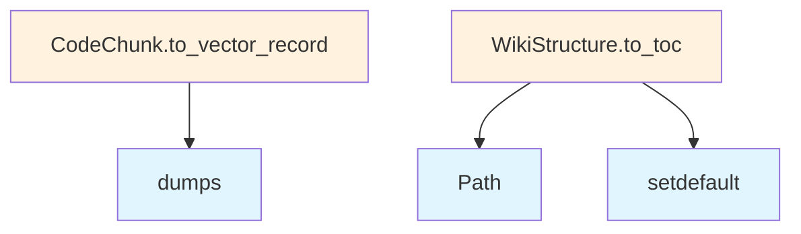

# models.py

## File Overview

This file contains the core data models and type definitions for the local_deepwiki package. It defines various data structures using Pydantic for validation, enums for type safety, and protocols for interface definitions. The models cover wiki generation, code analysis, research functionality, and progress tracking.

## Dependencies

- **json**: Standard library for JSON operations
- **enum**: Standard library for enumeration types
- **pathlib**: Standard library for path operations
- **typing**: Standard library for type hints and protocols
- **pydantic**: External library for data validation and settings management

## Classes

### ProgressCallback

```python
class ProgressCallback(Protocol)
```

A protocol defining the interface for progress callback functions. This establishes a contract for functions that handle progress updates throughout the application.

### Language

```python
class Language(Enum)
```

An enumeration that defines supported programming languages for code analysis and documentation generation.

### ChunkType

```python
class ChunkType(Enum)
```

An enumeration that categorizes different types of code chunks that can be analyzed and processed.

### CodeChunk

```python
class CodeChunk(BaseModel)
```

A Pydantic model representing a segment of code with associated metadata. This model stores information about code structure and content for analysis purposes.

### FileInfo

```python
class FileInfo(BaseModel)
```

A Pydantic model that contains metadata about files in the codebase, including their properties and analysis status.

### IndexStatus

```python
class IndexStatus(Enum)
```

An enumeration representing the various states of the indexing process for files and code chunks.

### WikiPage

```python
class WikiPage(BaseModel)
```

A Pydantic model representing a single wiki page with its content, metadata, and relationships to other pages.

### WikiStructure

```python
class WikiStructure(BaseModel)
```

A Pydantic model that defines the overall structure and organization of the generated wiki documentation.

### SearchResult

```python
class SearchResult(BaseModel)
```

A Pydantic model representing search results within the wiki system, containing matched content and relevance information.

### WikiPageStatus

```python
class WikiPageStatus(Enum)
```

An enumeration defining the various states a wiki page can be in during the generation and update process.

### WikiGenerationStatus

```python
class WikiGenerationStatus(BaseModel)
```

A Pydantic model that tracks the overall status and progress of wiki generation operations.

### ResearchStepType

```python
class ResearchStepType(Enum)
```

An enumeration categorizing different types of research steps that can be performed during deep research operations.

### ResearchStep

```python
class ResearchStep(BaseModel)
```

A Pydantic model representing an individual step in the research process, with its type, content, and results.

### SubQuestion

```python
class SubQuestion(BaseModel)
```

A Pydantic model for sub-questions generated during the research process to break down complex queries.

### SourceReference

```python
class SourceReference(BaseModel)
```

A Pydantic model that represents references to source materials and code locations used in research and documentation.

### DeepResearchResult

```python
class DeepResearchResult(BaseModel)
```

A Pydantic model containing the comprehensive results of deep research operations, including findings, sources, and analysis.

### ResearchProgressType

```python
class ResearchProgressType(Enum)
```

An enumeration defining different types of progress updates that can occur during research operations.

### ResearchProgress

```python
class ResearchProgress(BaseModel)
```

A Pydantic model for tracking and reporting progress during research operations, with type-specific information.

## Usage Examples

### Working with Language Enum

```python
from local_deepwiki.models import Language

# Check supported language
if language_type == Language.PYTHON:
    process_python_file(file_path)
```

### Creating Code Chunks

```python
from local_deepwiki.models import CodeChunk, ChunkType

# Create a code chunk instance
chunk = CodeChunk(
    content="def example_function():\n    pass",
    chunk_type=ChunkType.FUNCTION,
    # Additional fields as defined in the model
)
```

### Progress Tracking

```python
from local_deepwiki.models import ResearchProgress, ResearchProgressType

# Create progress update
progress = ResearchProgress(
    progress_type=ResearchProgressType.ANALYSIS_COMPLETE,
    # Additional progress information
)
```

## Related Components

This models file serves as the foundation for the entire local_deepwiki package, with its types being used throughout:

- Code analysis components rely on CodeChunk and FileInfo models
- Wiki generation uses WikiPage, WikiStructure, and related status enums
- Research functionality depends on the research-related models
- Progress tracking utilizes the ProgressCallback protocol and progress models

The models provide type safety and data validation across the entire application through Pydantic's validation framework.

## API Reference

### class `ProgressCallback`

**Inherits from:** `Protocol`

Protocol for progress callback functions.  Progress callbacks are used to report progress during long-running operations like indexing and wiki generation.

**Methods:**

#### `__call__`

```python
def __call__(msg: str, current: int, total: int) -> None
```

Report progress.


| Parameter | Type | Default | Description |
|-----------|------|---------|-------------|
| `msg` | `str` | - | Description of current operation. |
| `current` | `int` | - | Current step number. |
| `total` | `int` | - | Total number of steps. |


### class `Language`

**Inherits from:** `str`, `Enum`

Supported programming languages.

### class `ChunkType`

**Inherits from:** `str`, `Enum`

Types of code chunks.

### class `CodeChunk`

**Inherits from:** `BaseModel`

A chunk of code extracted from the repository.

**Methods:**

#### `to_vector_record`

```python
def to_vector_record(vector: list[float] | None = None) -> dict[str, Any]
```

Convert chunk to a dict suitable for vector store storage.


| Parameter | Type | Default | Description |
|-----------|------|---------|-------------|
| `vector` | `list[float] | None` | `None` | Optional embedding vector to include in the record. |


### class `FileInfo`

**Inherits from:** `BaseModel`

Information about a source file.

### class `IndexStatus`

**Inherits from:** `BaseModel`

Status of repository indexing.

### class `WikiPage`

**Inherits from:** `BaseModel`

A generated wiki page.

### class `WikiStructure`

**Inherits from:** `BaseModel`

Structure of the generated wiki.

**Methods:**

#### `to_toc`

```python
def to_toc() -> dict[str, Any]
```

Generate table of contents.


### class `SearchResult`

**Inherits from:** `BaseModel`

A search result from semantic search.

### class `WikiPageStatus`

**Inherits from:** `BaseModel`

Status of a generated wiki page for incremental generation.

### class `WikiGenerationStatus`

**Inherits from:** `BaseModel`

Status of wiki generation for tracking incremental updates.

### class `ResearchStepType`

**Inherits from:** `str`, `Enum`

Types of steps in the deep research process.

### class `ResearchStep`

**Inherits from:** `BaseModel`

A single step in the deep research process.

### class `SubQuestion`

**Inherits from:** `BaseModel`

A decomposed sub-question for deep research.

### class `SourceReference`

**Inherits from:** `BaseModel`

A reference to a source code location.

### class `DeepResearchResult`

**Inherits from:** `BaseModel`

Result from deep research analysis.

### class `ResearchProgressType`

**Inherits from:** `str`, `Enum`

Types of deep research progress events.

### class `ResearchProgress`

**Inherits from:** `BaseModel`

Progress update from deep research pipeline.  Sent via MCP progress notifications to provide real-time feedback during long-running deep research operations.


## Class Diagram

```mermaid
classDiagram
    class CodeChunk {
        <<dataclass>>
        +id: str
        +file_path: str
        +language: Language
        +chunk_type: ChunkType
        +name: str | None
        +content: str
        +start_line: int
        +end_line: int
        +docstring: str | None
        +parent_name: str | None
        +to_vector_record() -> dict[str, Any]
        -__repr__() -> str
    }
    class DeepResearchResult {
        <<dataclass>>
        +question: str
        +answer: str
        +sub_questions: list[SubQuestion]
        +sources: list[SourceReference]
        +reasoning_trace: list[ResearchStep]
        +total_chunks_analyzed: int
        +total_llm_calls: int
        -__repr__() -> str
    }
    class FileInfo {
        <<dataclass>>
        +path: str
        +language: Language | None
        +size_bytes: int
        +last_modified: float
        +hash: str
        +chunk_count: int
        -__repr__() -> str
    }
    class IndexStatus {
        <<dataclass>>
        +repo_path: str
        +indexed_at: float
        +total_files: int
        +total_chunks: int
        +languages: dict[str, int]
        +files: list[FileInfo]
        +schema_version: int
        -__repr__() -> str
    }
    class ProgressCallback {
        -__call__() -> None
    }
    class ResearchProgress {
        <<dataclass>>
        +step: int
        +total_steps: int
        +step_type: ResearchProgressType
        +message: str
        +sub_questions: list[SubQuestion] | None
        +chunks_retrieved: int | None
        +follow_up_queries: list[str] | None
        +duration_ms: int | None
    }
    class ResearchStep {
        <<dataclass>>
        +step_type: ResearchStepType
        +description: str
        +duration_ms: int
        -__repr__() -> str
    }
    class SearchResult {
        <<dataclass>>
        +chunk: CodeChunk
        +score: float
        +highlights: list[str]
        -__repr__() -> str
    }
    class SourceReference {
        <<dataclass>>
        +file_path: str
        +start_line: int
        +end_line: int
        +chunk_type: str
        +name: str | None
        +relevance_score: float
        -__repr__() -> str
    }
    class SubQuestion {
        <<dataclass>>
        +question: str
        +category: str
        -__repr__() -> str
    }
    class WikiGenerationStatus {
        <<dataclass>>
        +repo_path: str
        +generated_at: float
        +total_pages: int
        +index_status_hash: str
        +pages: dict[str, WikiPageStatus]
        -__repr__() -> str
    }
    class WikiPage {
        <<dataclass>>
        +path: str
        +title: str
        +content: str
        +generated_at: float
        -__repr__() -> str
    }
    class WikiPageStatus {
        <<dataclass>>
        +path: str
        +source_files: list[str]
        +source_hashes: dict[str, str]
        +source_line_info: dict[str, dict[str, int]]
        +content_hash: str
        +generated_at: float
        -__repr__() -> str
    }
    class WikiStructure {
        <<dataclass>>
        +root: str
        +pages: list[WikiPage]
        -__repr__() -> str
        +to_toc() -> dict[str, Any]
    }
    CodeChunk --|> BaseModel
    DeepResearchResult --|> BaseModel
    FileInfo --|> BaseModel
    IndexStatus --|> BaseModel
    ProgressCallback --|> Protocol
    ResearchProgress --|> BaseModel
    ResearchStep --|> BaseModel
    SearchResult --|> BaseModel
    SourceReference --|> BaseModel
    SubQuestion --|> BaseModel
    WikiGenerationStatus --|> BaseModel
    WikiPage --|> BaseModel
    WikiPageStatus --|> BaseModel
    WikiStructure --|> BaseModel
```



## Call Graph



## Relevant Source Files

- `src/local_deepwiki/models.py:11-26`

## See Also

- [test_parser](../../tests/test_parser.md) - uses this
- [test_vectorstore](../../tests/test_vectorstore.md) - uses this
- [crosslinks](generators/crosslinks.md) - uses this
- [test_models](../../tests/test_models.md) - uses this
- [test_crosslinks](../../tests/test_crosslinks.md) - uses this
