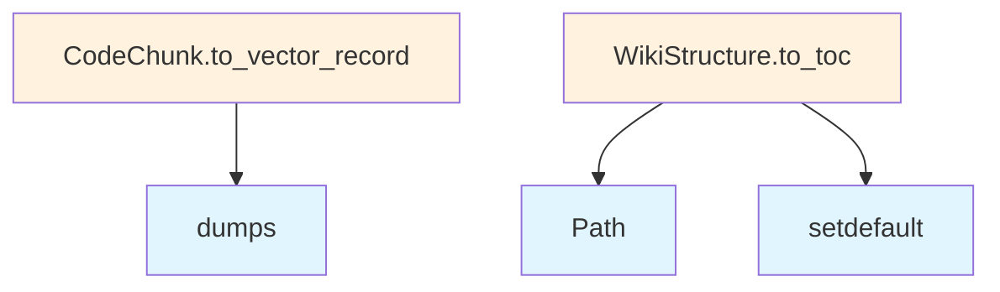

# Models Module

## File Overview

The `models.py` file defines the core data models and type definitions for the local_deepwiki system. It uses Pydantic for data validation and includes models for representing wiki pages, research results, file processing status, and various enumeration types used throughout the application.

## Dependencies

- `json`: Standard library for JSON operations
- `enum.Enum`: For creating enumeration types
- `pathlib.Path`: For file path handling
- `typing.Any`, `typing.Protocol`: Type hints and protocols
- `pydantic.BaseModel`, `pydantic.Field`: Data validation and modeling

## Classes

### ProgressCallback

A Protocol class that defines the interface for progress callback functions used throughout the system.

### Language

An enumeration class that defines supported programming languages for code analysis.

### ChunkType

An enumeration that categorizes different types of code chunks that can be processed.

### CodeChunk

A Pydantic model representing a segment of code with associated metadata including:
- Chunk type classification
- Content and location information
- Language specification

### FileInfo

A model that stores metadata about processed files, including file paths, types, and processing status.

### IndexStatus

An enumeration representing the various states a file can be in during the indexing process.

### WikiPage

A comprehensive model for wiki page content that includes:
- Page metadata (title, file path)
- Generated content sections
- Cross-references and links
- Processing status information

### WikiStructure

A model that represents the overall structure of the generated wiki, containing collections of WikiPage objects and organizational metadata.

### SearchResult

A model for representing search results within the wiki system, including relevance scoring and result metadata.

### WikiPageStatus

An enumeration defining the possible states of wiki page generation and processing.

### WikiGenerationStatus

A model tracking the overall status of wiki generation processes.

### ResearchStepType

An enumeration categorizing different types of research steps in the deep research process.

### ResearchStep

A model representing individual steps in the research process, including step type, content, and execution status.

### SubQuestion

A model for representing sub-questions generated during deep research, with associated research steps and results.

### SourceReference

A model for tracking source references used in research, including file paths, line numbers, and relevance information.

### DeepResearchResult

A comprehensive model containing the results of deep research operations, including:
- Main research findings
- Sub-questions and their results
- Source references
- Confidence metrics

### ResearchProgressType

An enumeration defining different types of research progress updates.

### ResearchProgress

A model for tracking and reporting research progress, including progress type, completion status, and descriptive messages.

## Usage Examples

### Creating a CodeChunk

```python
from local_deepwiki.models import CodeChunk, ChunkType, Language

chunk = CodeChunk(
    type=ChunkType.FUNCTION,
    content="def example_function():\n    pass",
    language=Language.PYTHON,
    start_line=10,
    end_line=12
)
```

### Working with WikiPage

```python
from local_deepwiki.models import WikiPage, WikiPageStatus

page = WikiPage(
    title="Example Documentation",
    file_path="src/example.py",
    content="# Example\n\nThis is example documentation.",
    status=WikiPageStatus.COMPLETED
)
```

### Creating Research Progress

```python
from local_deepwiki.models import ResearchProgress, ResearchProgressType

progress = ResearchProgress(
    type=ResearchProgressType.ANALYSIS,
    message="Analyzing code structure",
    completion_percentage=75
)
```

## Related Components

This models file serves as the foundation for data structures used throughout the local_deepwiki system. The models defined here are likely used by:

- Code analysis and processing components
- Wiki generation systems
- Research and documentation engines
- File indexing and status tracking systems

The Protocol-based ProgressCallback interface suggests integration with asynchronous processing systems that provide progress updates during long-running operations.

## API Reference

### class `ProgressCallback`

**Inherits from:** `Protocol`

Protocol for progress callback functions.  Progress callbacks are used to report progress during long-running operations like indexing and wiki generation.

**Methods:**

#### `__call__`

```python
def __call__(msg: str, current: int, total: int) -> None
```

Report progress.


| [Parameter](generators/api_docs.md) | Type | Default | Description |
|-----------|------|---------|-------------|
| `msg` | `str` | - | Description of current operation. |
| `current` | `int` | - | Current step number. |
| `total` | `int` | - | Total number of steps. |


### class `Language`

**Inherits from:** `str`, `Enum`

Supported programming languages.

### class `ChunkType`

**Inherits from:** `str`, `Enum`

Types of code chunks.

### class `CodeChunk`

**Inherits from:** `BaseModel`

A chunk of code extracted from the repository.

**Methods:**

#### `to_vector_record`

```python
def to_vector_record(vector: list[float] | None = None) -> dict[str, Any]
```

Convert chunk to a dict suitable for vector store storage.


| [Parameter](generators/api_docs.md) | Type | Default | Description |
|-----------|------|---------|-------------|
| `vector` | `list[float] | None` | `None` | Optional embedding vector to include in the record. |


### class `FileInfo`

**Inherits from:** `BaseModel`

Information about a source file.

### class `IndexStatus`

**Inherits from:** `BaseModel`

Status of repository indexing.

### class `WikiPage`

**Inherits from:** `BaseModel`

A generated wiki page.

### class `WikiStructure`

**Inherits from:** `BaseModel`

Structure of the generated wiki.

**Methods:**

#### `to_toc`

```python
def to_toc() -> dict[str, Any]
```

Generate table of contents.


### class `SearchResult`

**Inherits from:** `BaseModel`

A search result from semantic search.

### class `WikiPageStatus`

**Inherits from:** `BaseModel`

Status of a generated wiki page for incremental generation.

### class `WikiGenerationStatus`

**Inherits from:** `BaseModel`

Status of wiki generation for tracking incremental updates.

### class `ResearchStepType`

**Inherits from:** `str`, `Enum`

Types of steps in the deep research process.

### class `ResearchStep`

**Inherits from:** `BaseModel`

A single step in the deep research process.

### class `SubQuestion`

**Inherits from:** `BaseModel`

A decomposed sub-question for deep research.

### class `SourceReference`

**Inherits from:** `BaseModel`

A reference to a source code location.

### class `DeepResearchResult`

**Inherits from:** `BaseModel`

Result from deep research analysis.

### class `ResearchProgressType`

**Inherits from:** `str`, `Enum`

Types of deep research progress events.

### class `ResearchProgress`

**Inherits from:** `BaseModel`

Progress update from deep research pipeline.  Sent via MCP progress notifications to provide real-time feedback during long-running deep research operations.


## Class Diagram


## Call Graph



## Usage Examples

*Examples extracted from test files*

### Test basic chunk to vector record conversion

From `test_models.py::test_basic_conversion`:

```python
language=Language.PYTHON,
    chunk_type=ChunkType.FUNCTION,
    name="test_func",
    content="def test_func(): pass",
    start_line=1,
    end_line=1,
)

record = chunk.to_vector_record()

assert record["id"] == "test_id"
```

### Test basic chunk to vector record conversion

From `test_models.py::test_basic_conversion`:

```python
chunk_type=ChunkType.FUNCTION,
    name="test_func",
    content="def test_func(): pass",
    start_line=1,
    end_line=1,
)

record = chunk.to_vector_record()

assert record["id"] == "test_id"
```

### Test basic chunk to vector record conversion

From `test_models.py::test_basic_conversion`:

```python
chunk = CodeChunk(
    id="test_id",
    file_path="src/main.py",
    language=Language.PYTHON,
    chunk_type=ChunkType.FUNCTION,
    name="test_func",
    content="def test_func(): pass",
    start_line=1,
    end_line=1,
)

record = chunk.to_vector_record()

assert record["id"] == "test_id"
```

### Test conversion with vector embedding

From `test_models.py::test_with_vector`:

```python
language=Language.PYTHON,
    chunk_type=ChunkType.FUNCTION,
    content="def test(): pass",
    start_line=1,
    end_line=1,
)
vector = [0.1, 0.2, 0.3]

record = chunk.to_vector_record(vector=vector)

assert record["vector"] == [0.1, 0.2, 0.3]
```

### Test conversion with vector embedding

From `test_models.py::test_with_vector`:

```python
chunk_type=ChunkType.FUNCTION,
    content="def test(): pass",
    start_line=1,
    end_line=1,
)
vector = [0.1, 0.2, 0.3]

record = chunk.to_vector_record(vector=vector)

assert record["vector"] == [0.1, 0.2, 0.3]
```

## Relevant Source Files

- `src/local_deepwiki/models.py:11-26`

## See Also

- [crosslinks](generators/crosslinks.md) - uses this
- [test_examples](generators/test_examples.md) - uses this
- [source_refs](generators/source_refs.md) - uses this
- [search](generators/search.md) - uses this
- [diagrams](generators/diagrams.md) - uses this
