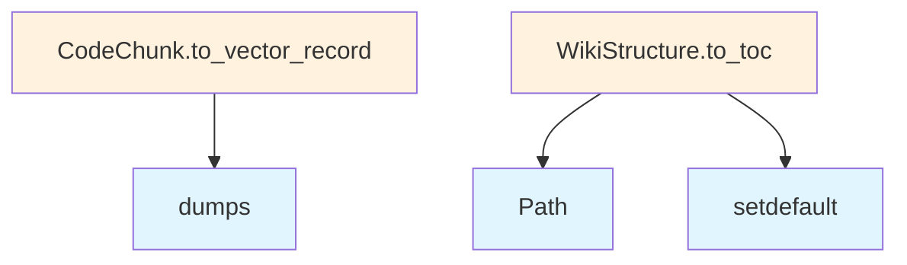

# models.py

## File Overview

This file contains the core data models and type definitions for the local_deepwiki system. It defines data structures for representing code chunks, wiki pages, search results, research processes, and various status enums using Pydantic models and Python enums.

## Imports

The module depends on:
- `json` - Standard JSON handling
- `enum.Enum` - For enumeration types
- `pathlib.Path` - For file path operations
- `typing` - Type hints including `Any` and `Protocol`
- `pydantic` - `BaseModel` and `Field` for data validation

## Classes

### ProgressCallback

A Protocol class that defines the interface for progress callback functions.

### Language

An Enum that represents supported programming languages in the system.

### ChunkType

An Enum that categorizes different types of code chunks that can be processed.

### CodeChunk

A Pydantic model representing a chunk of code with associated metadata. This is a fundamental data structure for representing parsed code segments.

### FileInfo

A Pydantic model that stores information about files in the system, including metadata and processing status.

### IndexStatus

An Enum representing the various states a file or component can be in during the indexing process.

### WikiPage

A Pydantic model representing a wiki page with content and metadata. This is the core structure for generated documentation pages.

### WikiStructure

A Pydantic model that defines the overall structure and organization of the wiki system.

### SearchResult

A Pydantic model representing search results returned from queries against the wiki content.

### WikiPageStatus

An Enum indicating the current status of wiki page generation or processing.

### WikiGenerationStatus

An Enum representing the overall status of the wiki generation process.

### ResearchStepType

An Enum that categorizes different types of research steps in the deep research process.

### ResearchStep

A Pydantic model representing an individual step in the research process, with type and associated data.

### SubQuestion

A Pydantic model representing sub-questions generated during the research process.

### SourceReference

A Pydantic model that represents references to source materials or code locations.

### DeepResearchResult

A Pydantic model containing the complete results of a deep research operation, including findings and references.

### ResearchProgressType

An Enum representing different types of progress updates during research operations.

### ResearchProgress

A Pydantic model for tracking and reporting progress during research operations.

## Usage Examples

```python
from local_deepwiki.models import CodeChunk, Language, ChunkType

# Create a code chunk
chunk = CodeChunk(
    content="def example(): pass",
    language=Language.PYTHON,
    chunk_type=ChunkType.FUNCTION
)

# Create a wiki page
page = WikiPage(
    title="Example Documentation",
    content="# Example\nThis is example content."
)
```

## Related Components

This models file serves as the foundation for the entire local_deepwiki system. The data structures defined here are used throughout the codebase for:
- Code parsing and chunking operations
- Wiki generation and management
- Search functionality
- Research and analysis processes
- Progress tracking and status reporting

The Pydantic models provide data validation and serialization capabilities, while the Enum classes ensure type safety for status and categorization fields throughout the system.

## API Reference

### class `ProgressCallback`

**Inherits from:** `Protocol`

Protocol for progress callback functions.  Progress callbacks are used to report progress during long-running operations like indexing and wiki generation.

**Methods:**

#### `__call__`

```python
def __call__(msg: str, current: int, total: int) -> None
```

Report progress.


| [Parameter](generators/api_docs.md) | Type | Default | Description |
|-----------|------|---------|-------------|
| `msg` | `str` | - | Description of current operation. |
| `current` | `int` | - | Current step number. |
| `total` | `int` | - | Total number of steps. |


### class `Language`

**Inherits from:** `str`, `Enum`

Supported programming languages.

### class `ChunkType`

**Inherits from:** `str`, `Enum`

Types of code chunks.

### class `CodeChunk`

**Inherits from:** `BaseModel`

A chunk of code extracted from the repository.

**Methods:**

#### `to_vector_record`

```python
def to_vector_record(vector: list[float] | None = None) -> dict[str, Any]
```

Convert chunk to a dict suitable for vector store storage.


| [Parameter](generators/api_docs.md) | Type | Default | Description |
|-----------|------|---------|-------------|
| `vector` | `list[float] | None` | `None` | Optional embedding vector to include in the record. |


### class `FileInfo`

**Inherits from:** `BaseModel`

Information about a source file.

### class `IndexStatus`

**Inherits from:** `BaseModel`

Status of repository indexing.

### class `WikiPage`

**Inherits from:** `BaseModel`

A generated wiki page.

### class `WikiStructure`

**Inherits from:** `BaseModel`

Structure of the generated wiki.

**Methods:**

#### `to_toc`

```python
def to_toc() -> dict[str, Any]
```

Generate table of contents.


### class `SearchResult`

**Inherits from:** `BaseModel`

A search result from semantic search.

### class `WikiPageStatus`

**Inherits from:** `BaseModel`

Status of a generated wiki page for incremental generation.

### class `WikiGenerationStatus`

**Inherits from:** `BaseModel`

Status of wiki generation for tracking incremental updates.

### class `ResearchStepType`

**Inherits from:** `str`, `Enum`

Types of steps in the deep research process.

### class `ResearchStep`

**Inherits from:** `BaseModel`

A single step in the deep research process.

### class `SubQuestion`

**Inherits from:** `BaseModel`

A decomposed sub-question for deep research.

### class `SourceReference`

**Inherits from:** `BaseModel`

A reference to a source code location.

### class `DeepResearchResult`

**Inherits from:** `BaseModel`

Result from deep research analysis.

### class `ResearchProgressType`

**Inherits from:** `str`, `Enum`

Types of deep research progress events.

### class `ResearchProgress`

**Inherits from:** `BaseModel`

Progress update from deep research pipeline.  Sent via MCP progress notifications to provide real-time feedback during long-running deep research operations.


## Class Diagram


## Call Graph



## Usage Examples

*Examples extracted from test files*

### Test basic chunk to vector record conversion

From `test_models.py::test_basic_conversion`:

```python
language=Language.PYTHON,
    chunk_type=ChunkType.FUNCTION,
    name="test_func",
    content="def test_func(): pass",
    start_line=1,
    end_line=1,
)

record = chunk.to_vector_record()

assert record["id"] == "test_id"
```

### Test basic chunk to vector record conversion

From `test_models.py::test_basic_conversion`:

```python
chunk_type=ChunkType.FUNCTION,
    name="test_func",
    content="def test_func(): pass",
    start_line=1,
    end_line=1,
)

record = chunk.to_vector_record()

assert record["id"] == "test_id"
```

### Test basic chunk to vector record conversion

From `test_models.py::test_basic_conversion`:

```python
chunk = CodeChunk(
    id="test_id",
    file_path="src/main.py",
    language=Language.PYTHON,
    chunk_type=ChunkType.FUNCTION,
    name="test_func",
    content="def test_func(): pass",
    start_line=1,
    end_line=1,
)

record = chunk.to_vector_record()

assert record["id"] == "test_id"
```

### Test conversion with vector embedding

From `test_models.py::test_with_vector`:

```python
language=Language.PYTHON,
    chunk_type=ChunkType.FUNCTION,
    content="def test(): pass",
    start_line=1,
    end_line=1,
)
vector = [0.1, 0.2, 0.3]

record = chunk.to_vector_record(vector=vector)

assert record["vector"] == [0.1, 0.2, 0.3]
```

### Test conversion with vector embedding

From `test_models.py::test_with_vector`:

```python
chunk_type=ChunkType.FUNCTION,
    content="def test(): pass",
    start_line=1,
    end_line=1,
)
vector = [0.1, 0.2, 0.3]

record = chunk.to_vector_record(vector=vector)

assert record["vector"] == [0.1, 0.2, 0.3]
```

## Relevant Source Files

- `src/local_deepwiki/models.py:11-26`

## See Also

- [source_refs](generators/source_refs.md) - uses this
- [crosslinks](generators/crosslinks.md) - uses this
- [test_models](../../tests/test_models.md) - uses this
- [test_crosslinks](../../tests/test_crosslinks.md) - uses this
- [api_docs](generators/api_docs.md) - uses this
