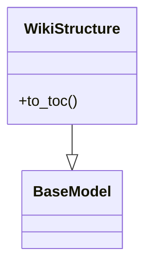
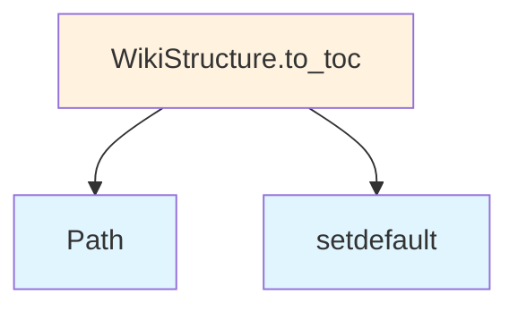

# File Overview

This file defines the core data models and enumerations used throughout the local_deepwiki system. It provides the foundational data structures that represent various components of the wiki generation and indexing process, including language specifications, chunk types, file information, wiki pages, and search results.

The models in this file serve as the data contracts between different components of the system, ensuring consistent data representation across the codebase. They work closely with components like [WikiGenerator](generators/wiki.md), [CodeChunker](core/chunker.md), and [VectorStore](core/vectorstore.md) to manage the flow of information during wiki creation and search operations.

# Classes

## Language

An enumeration representing supported programming languages for code processing.

## ChunkType

An enumeration defining the types of chunks that can be processed, including code, documentation, and other content types.

## CodeChunk

A data model representing a chunk of code with metadata including file information, content, and processing details.

**Fields:**
- `file_info`: FileInfo object containing file metadata
- `content`: The actual code content as a string
- `chunk_type`: The type of chunk (from ChunkType enum)
- `start_line`: Starting line number of the chunk
- `end_line`: Ending line number of the chunk

## FileInfo

A data model containing metadata about source files.

**Fields:**
- `path`: Path to the file
- `name`: Name of the file
- `extension`: File extension
- `size`: File size in bytes
- `language`: Language of the file (from Language enum)

## IndexStatus

An enumeration representing the indexing status of wiki pages.

## WikiPage

A data model representing a wiki page with its content and metadata.

**Fields:**
- `title`: Page title
- `content`: Page content
- `file_info`: FileInfo object for the source file
- `status`: IndexStatus indicating the page's indexing state
- `created_at`: Timestamp when the page was created
- `updated_at`: Timestamp when the page was last updated

## WikiStructure

A data model representing the overall structure of a wiki, including pages and their relationships.

**Fields:**
- `pages`: List of WikiPage objects
- `title`: Wiki title
- `description`: Wiki description
- `created_at`: Timestamp when the wiki was created

## SearchResult

A data model representing the results of a search operation.

**Fields:**
- `query`: The search query
- `results`: List of matching WikiPage objects
- `total_matches`: Total number of matches found
- `score_threshold`: Minimum similarity score for results

## WikiPageStatus

An enumeration representing the status of individual wiki pages.

## WikiGenerationStatus

An enumeration representing the overall status of wiki generation process.

# Usage Examples

```python
# Creating a FileInfo object
file_info = FileInfo(
    path="/path/to/file.py",
    name="example.py",
    extension=".py",
    size=1024,
    language=Language.PYTHON
)

# Creating a CodeChunk
chunk = CodeChunk(
    file_info=file_info,
    content="def hello_world():\n    print('Hello, World!')",
    chunk_type=ChunkType.CODE,
    start_line=1,
    end_line=2
)

# Creating a WikiPage
page = WikiPage(
    title="Example Page",
    content="This is an example wiki page",
    file_info=file_info,
    status=IndexStatus.INDEXED
)
```

# Related Components

This file works with [WikiGenerator](generators/wiki.md) to manage the creation and structure of wiki pages. The CodeChunk model is used by [CodeChunker](core/chunker.md) to process source files into manageable pieces. The WikiPage and WikiStructure models integrate with [VectorStore](core/vectorstore.md) to store and retrieve embeddings for search operations. The SearchResult model is returned by search functions that query the [VectorStore](core/vectorstore.md) for relevant wiki content.

## API Reference

### class `Language`

**Inherits from:** `str`, `Enum`

Supported programming languages.

### class `ChunkType`

**Inherits from:** `str`, `Enum`

Types of code chunks.

### class `CodeChunk`

**Inherits from:** `BaseModel`

A chunk of code extracted from the repository.

### class `FileInfo`

**Inherits from:** `BaseModel`

Information about a source file.

### class `IndexStatus`

**Inherits from:** `BaseModel`

Status of repository indexing.

### class `WikiPage`

**Inherits from:** `BaseModel`

A generated wiki page.

### class `WikiStructure`

**Inherits from:** `BaseModel`

Structure of the generated wiki.

**Methods:**

#### `to_toc`

```python
def to_toc() -> dict[str, Any]
```

Generate table of contents.


### class `SearchResult`

**Inherits from:** `BaseModel`

A search result from semantic search.

### class `WikiPageStatus`

**Inherits from:** `BaseModel`

Status of a generated wiki page for incremental generation.

### class `WikiGenerationStatus`

**Inherits from:** `BaseModel`

Status of wiki generation for tracking incremental updates.


## Class Diagram



## Call Graph



## See Also

- [chunker](core/chunker.md) - uses this
- [test_api_docs](../../tests/test_api_docs.md) - uses this
- [test_crosslinks](../../tests/test_crosslinks.md) - uses this
- [wiki](generators/wiki.md) - uses this
- [server](server.md) - uses this
