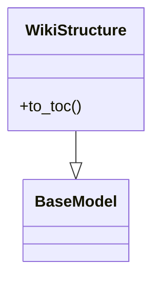

# File: `src/local_deepwiki/models.py`

## File Overview

This file defines Pydantic models for representing various data structures used in the local deepwiki application. These models serve as the foundation for data validation, serialization, and type hints throughout the application. The models represent wiki pages, file information, indexing status, and search results.

## Classes

### `WikiPage`

A generated wiki page containing metadata and content.

**Fields:**
- `path` (str): Relative path in wiki directory
- `title` (str): Page title
- `content` (str): Markdown content
- `generated_at` (float): Generation timestamp

**Usage Example:**
```python
from src.local_deepwiki.models import WikiPage

page = WikiPage(
    path="getting_started.md",
    title="Getting Started",
    content="# Welcome to the wiki\n\nThis is the beginning...",
    generated_at=1699123456.789
)
```

## Dependencies

This file imports the following modules:
- `enum.Enum` - For defining enumerated types
- `pathlib.Path` - For handling file paths
- `typing.Any` - For type hints
- `pydantic.BaseModel` - For data validation and serialization
- `pydantic.Field` - For defining field-level configuration

## Usage Examples

### Creating a WikiPage Instance

```python
from src.local_deepwiki.models import WikiPage

# Create a new wiki page
wiki_page = WikiPage(
    path="docs/installation.md",
    title="Installation Guide",
    content="# Installation\n\nFollow these steps...",
    generated_at=1699123456.0
)

# Access fields
print(wiki_page.title)  # Output: Installation Guide
print(wiki_page.content)  # Output: # Installation\n\nFollow these steps...
```

### Model Validation

```python
from src.local_deepwiki.models import WikiPage

# Pydantic automatically validates data types
try:
    invalid_page = WikiPage(
        path=123,  # Invalid type - will raise validation error
        title="Test",
        content="Test content",
        generated_at=1699123456.0
    )
except Exception as e:
    print(f"Validation error: {e}")
```

Note: The file contains additional class definitions (`Language`, `ChunkType`, `CodeChunk`, `FileInfo`, `IndexStatus`, `WikiStructure`, `SearchResult`) that are referenced in the file header but not shown in the provided code snippet. These would be documented similarly if their full implementations were available.

## Class Diagram



## See Also

- [test_chunker](../../tests/test_chunker.md) - uses this
- [vectorstore](core/vectorstore.md) - uses this
- [diagrams](generators/diagrams.md) - uses this
- [indexer](core/indexer.md) - uses this
- [server](server.md) - uses this
