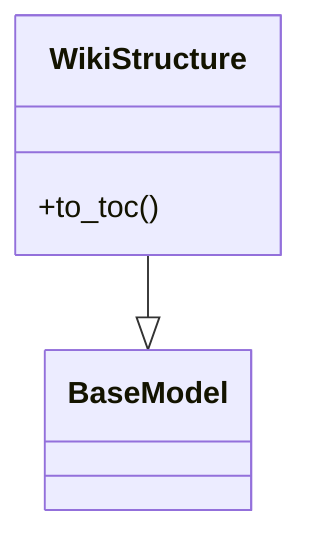
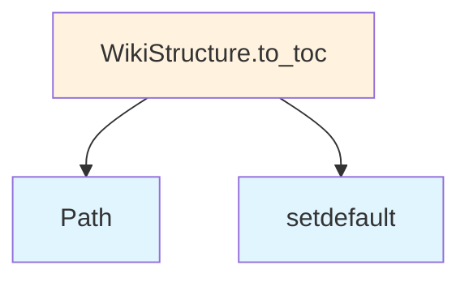

# File Overview

This file defines data models and enumerations used in the local_deepwiki application. It provides the foundational data structures for representing language types, chunk types, file information, wiki pages, and search results. The models are built using Pydantic for data validation and serialization.

# Classes

## Language

An enumeration representing supported programming languages.

## ChunkType

An enumeration representing different types of code chunks.

## CodeChunk

A data model representing a code chunk with fields for content, language, and type.

**Fields:**
- content (str): The content of the code chunk
- language (Language): The programming language of the chunk
- type (ChunkType): The type of the chunk

## FileInfo

A data model representing file information.

**Fields:**
- path (Path): The file path
- size (int): The file size in bytes
- modified_time (float): The last modified timestamp

## IndexStatus

An enumeration representing the indexing status of a wiki page.

## WikiPage

A data model representing a wiki page.

**Fields:**
- title (str): The page title
- content (str): The page content
- file_info (FileInfo): Information about the source file
- status (IndexStatus): The indexing status of the page
- chunks (list[CodeChunk]): List of code chunks in the page

## WikiStructure

A data model representing the overall structure of a wiki.

**Fields:**
- pages (list[WikiPage]): List of wiki pages
- title (str): The wiki title

## SearchResult

A data model representing a search result.

**Fields:**
- page (WikiPage): The wiki page containing the result
- snippet (str): A snippet of text containing the search term
- score (float): The relevance score of the result

## WikiPageStatus

An enumeration representing the status of a wiki page.

## WikiGenerationStatus

An enumeration representing the status of a wiki generation process.

# Functions

No functions are defined in this file.

# Usage Examples

```python
from src.local_deepwiki.models import WikiPage, FileInfo, CodeChunk, Language, ChunkType

# Create a file info object
file_info = FileInfo(
    path=Path("example.py"),
    size=1024,
    modified_time=1634567890.0
)

# Create a code chunk
chunk = CodeChunk(
    content="print('Hello World')",
    language=Language.PYTHON,
    type=ChunkType.CODE
)

# Create a wiki page
page = WikiPage(
    title="Example Page",
    content="This is an example page",
    file_info=file_info,
    status=IndexStatus.INDEXED,
    chunks=[chunk]
)
```

# Related Components

This file imports and uses:
- `Enum` from `enum` module
- `Path` from `pathlib` module
- `Any` from `typing` module
- `BaseModel` and `Field` from `pydantic` module

The models defined in this file are likely used by other components in the local_deepwiki application for data representation and validation.

## API Reference

### class `Language`

**Inherits from:** `str`, `Enum`

Supported programming languages.

### class `ChunkType`

**Inherits from:** `str`, `Enum`

Types of code chunks.

### class `CodeChunk`

**Inherits from:** `BaseModel`

A chunk of code extracted from the repository.

### class `FileInfo`

**Inherits from:** `BaseModel`

Information about a source file.

### class `IndexStatus`

**Inherits from:** `BaseModel`

Status of repository indexing.

### class `WikiPage`

**Inherits from:** `BaseModel`

A generated wiki page.

### class `WikiStructure`

**Inherits from:** `BaseModel`

Structure of the generated wiki.

**Methods:**

#### `to_toc`

```python
def to_toc() -> dict[str, Any]
```

Generate table of contents.


### class `SearchResult`

**Inherits from:** `BaseModel`

A search result from semantic search.

### class `WikiPageStatus`

**Inherits from:** `BaseModel`

Status of a generated wiki page for incremental generation.

### class `WikiGenerationStatus`

**Inherits from:** `BaseModel`

Status of wiki generation for tracking incremental updates.


## Class Diagram



## Call Graph



## Relevant Source Files

- `src/local_deepwiki/models.py`

## See Also

- [test_incremental_wiki](../../tests/test_incremental_wiki.md) - uses this
- [api_docs](generators/api_docs.md) - uses this
- [test_see_also](../../tests/test_see_also.md) - uses this
- [wiki](generators/wiki.md) - uses this
- [test_chunker](../../tests/test_chunker.md) - uses this
