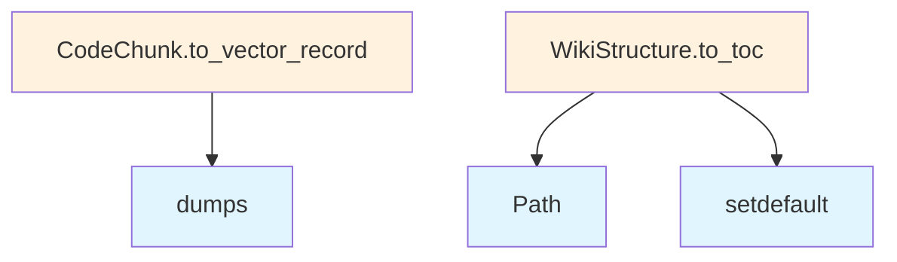

# models.py

## File Overview

This module defines the core data models and types used throughout the local_deepwiki application. It provides Pydantic-based models for representing wiki pages, file information, search results, and research data structures, along with enums for various status types and configurations.

## Dependencies

- `json` - Standard library for JSON operations
- `enum.Enum` - For creating enumeration types
- `pathlib.Path` - For file path handling
- `typing` - For type annotations including `Any` and `Protocol`
- `pydantic` - For data validation with `BaseModel` and `Field`

## Classes

### ProgressCallback
A Protocol class that defines the interface for progress callback functions used throughout the application.

### Language
An Enum class that defines supported programming languages for code analysis and documentation generation.

### ChunkType
An Enum class that categorizes different types of code chunks that can be processed by the system.

### CodeChunk
A Pydantic model representing a piece of code with associated metadata such as type, name, and line numbers.

### FileInfo
A Pydantic model that stores information about files in the codebase, including path, language, and processing status.

### IndexStatus
An Enum class that tracks the various states of file indexing operations.

### WikiPage
A Pydantic model representing a documentation page with content, metadata, and relationships to other pages.

### WikiStructure
A Pydantic model that defines the overall structure and organization of the generated wiki documentation.

### SearchResult
A Pydantic model for representing search results with relevance scoring and content snippets.

### WikiPageStatus
An Enum class that tracks the status of individual wiki page generation.

### WikiGenerationStatus
An Enum class that represents the overall status of the wiki generation process.

### ResearchStepType
An Enum class that categorizes different types of research steps in the deep research process.

### ResearchStep
A Pydantic model representing an individual step in the research process with type, description, and results.

### SubQuestion
A Pydantic model for representing sub-questions generated during deep research analysis.

### SourceReference
A Pydantic model that stores references to source code locations with file paths and line numbers.

### DeepResearchResult
A Pydantic model containing the complete results of a deep research analysis, including findings and source references.

### ResearchProgressType
An Enum class that defines different types of progress updates during research operations.

### ResearchProgress
A Pydantic model for tracking and reporting progress during research operations.

## Usage Examples

```python
from local_deepwiki.models import Language, CodeChunk, FileInfo

# Create a code chunk
chunk = CodeChunk(
    type=ChunkType.CLASS,
    name="MyClass",
    start_line=10,
    end_line=25,
    content="class MyClass:\n    pass"
)

# Create file information
file_info = FileInfo(
    path=Path("src/example.py"),
    language=Language.PYTHON,
    status=IndexStatus.INDEXED
)
```

## Related Components

This models module serves as the foundation for data structures used throughout the application. The classes defined here are likely used by:

- Wiki generation components that process the WikiPage and WikiStructure models
- Search functionality that works with SearchResult models
- Research components that utilize the DeepResearchResult and related research models
- File processing systems that work with FileInfo and CodeChunk models

## API Reference

### class `ProgressCallback`

**Inherits from:** `Protocol`

Protocol for progress callback functions.  Progress callbacks are used to report progress during long-running operations like indexing and wiki generation.

**Methods:**


<details>
<summary>View Source (lines 11-26) | <a href="https://github.com/UrbanDiver/local-deepwiki-mcp/blob/feature/wiki-enhancements-round2/src/local_deepwiki/models.py#L11-L26">GitHub</a></summary>

```python
class ProgressCallback(Protocol):
    """Protocol for progress callback functions.

    Progress callbacks are used to report progress during long-running
    operations like indexing and wiki generation.
    """

    def __call__(self, msg: str, current: int, total: int) -> None:
        """Report progress.

        Args:
            msg: Description of current operation.
            current: Current step number.
            total: Total number of steps.
        """
        ...
```

</details>

#### `__call__`

```python
def __call__(msg: str, current: int, total: int) -> None
```

Report progress.


| [Parameter](generators/api_docs.md) | Type | Default | Description |
|-----------|------|---------|-------------|
| `msg` | `str` | - | Description of current operation. |
| `current` | `int` | - | Current step number. |
| `total` | `int` | - | Total number of steps. |


<details>
<summary>View Source (lines 11-26) | <a href="https://github.com/UrbanDiver/local-deepwiki-mcp/blob/feature/wiki-enhancements-round2/src/local_deepwiki/models.py#L11-L26">GitHub</a></summary>

```python
class ProgressCallback(Protocol):
    """Protocol for progress callback functions.

    Progress callbacks are used to report progress during long-running
    operations like indexing and wiki generation.
    """

    def __call__(self, msg: str, current: int, total: int) -> None:
        """Report progress.

        Args:
            msg: Description of current operation.
            current: Current step number.
            total: Total number of steps.
        """
        ...
```

</details>

### class `Language`

**Inherits from:** `str`, `Enum`

Supported programming languages.


<details>
<summary>View Source (lines 29-45) | <a href="https://github.com/UrbanDiver/local-deepwiki-mcp/blob/feature/wiki-enhancements-round2/src/local_deepwiki/models.py#L29-L45">GitHub</a></summary>

```python
class Language(str, Enum):
    """Supported programming languages."""

    PYTHON = "python"
    JAVASCRIPT = "javascript"
    TYPESCRIPT = "typescript"
    TSX = "tsx"
    GO = "go"
    RUST = "rust"
    JAVA = "java"
    C = "c"
    CPP = "cpp"
    SWIFT = "swift"
    RUBY = "ruby"
    PHP = "php"
    KOTLIN = "kotlin"
    CSHARP = "csharp"
```

</details>

### class `ChunkType`

**Inherits from:** `str`, `Enum`

Types of code chunks.


<details>
<summary>View Source (lines 48-57) | <a href="https://github.com/UrbanDiver/local-deepwiki-mcp/blob/feature/wiki-enhancements-round2/src/local_deepwiki/models.py#L48-L57">GitHub</a></summary>

```python
class ChunkType(str, Enum):
    """Types of code chunks."""

    FUNCTION = "function"
    CLASS = "class"
    METHOD = "method"
    MODULE = "module"
    IMPORT = "import"
    COMMENT = "comment"
    OTHER = "other"
```

</details>

### class `CodeChunk`

**Inherits from:** `BaseModel`

A chunk of code extracted from the repository.

**Methods:**


<details>
<summary>View Source (lines 60-107) | <a href="https://github.com/UrbanDiver/local-deepwiki-mcp/blob/feature/wiki-enhancements-round2/src/local_deepwiki/models.py#L60-L107">GitHub</a></summary>

```python
class CodeChunk(BaseModel):
    """A chunk of code extracted from the repository."""

    id: str = Field(description="Unique identifier for this chunk")
    file_path: str = Field(description="Path to the source file")
    language: Language = Field(description="Programming language")
    chunk_type: ChunkType = Field(description="Type of code chunk")
    name: str | None = Field(default=None, description="Name of function/class/etc")
    content: str = Field(description="The actual code content")
    start_line: int = Field(description="Starting line number")
    end_line: int = Field(description="Ending line number")
    docstring: str | None = Field(default=None, description="Associated docstring")
    parent_name: str | None = Field(default=None, description="Parent class/module name")
    metadata: dict[str, Any] = Field(default_factory=dict, description="Additional metadata")

    def to_vector_record(self, vector: list[float] | None = None) -> dict[str, Any]:
        """Convert chunk to a dict suitable for vector store storage.

        Args:
            vector: Optional embedding vector to include in the record.

        Returns:
            Dict with all fields formatted for LanceDB storage.
        """
        record: dict[str, Any] = {
            "id": self.id,
            "file_path": self.file_path,
            "language": self.language.value,
            "chunk_type": self.chunk_type.value,
            "name": self.name or "",
            "content": self.content,
            "start_line": self.start_line,
            "end_line": self.end_line,
            "docstring": self.docstring or "",
            "parent_name": self.parent_name or "",
            "metadata": json.dumps(self.metadata),
        }
        if vector is not None:
            record["vector"] = vector
        return record

    def __repr__(self) -> str:
        """Return a concise representation for debugging."""
        name_part = f" {self.name}" if self.name else ""
        return (
            f"<CodeChunk {self.chunk_type.value}{name_part} "
            f"at {self.file_path}:{self.start_line}-{self.end_line}>"
        )
```

</details>

#### `to_vector_record`

```python
def to_vector_record(vector: list[float] | None = None) -> dict[str, Any]
```

Convert chunk to a dict suitable for vector store storage.


| [Parameter](generators/api_docs.md) | Type | Default | Description |
|-----------|------|---------|-------------|
| `vector` | `list[float] | None` | `None` | Optional embedding vector to include in the record. |


<details>
<summary>View Source (lines 60-107) | <a href="https://github.com/UrbanDiver/local-deepwiki-mcp/blob/feature/wiki-enhancements-round2/src/local_deepwiki/models.py#L60-L107">GitHub</a></summary>

```python
class CodeChunk(BaseModel):
    """A chunk of code extracted from the repository."""

    id: str = Field(description="Unique identifier for this chunk")
    file_path: str = Field(description="Path to the source file")
    language: Language = Field(description="Programming language")
    chunk_type: ChunkType = Field(description="Type of code chunk")
    name: str | None = Field(default=None, description="Name of function/class/etc")
    content: str = Field(description="The actual code content")
    start_line: int = Field(description="Starting line number")
    end_line: int = Field(description="Ending line number")
    docstring: str | None = Field(default=None, description="Associated docstring")
    parent_name: str | None = Field(default=None, description="Parent class/module name")
    metadata: dict[str, Any] = Field(default_factory=dict, description="Additional metadata")

    def to_vector_record(self, vector: list[float] | None = None) -> dict[str, Any]:
        """Convert chunk to a dict suitable for vector store storage.

        Args:
            vector: Optional embedding vector to include in the record.

        Returns:
            Dict with all fields formatted for LanceDB storage.
        """
        record: dict[str, Any] = {
            "id": self.id,
            "file_path": self.file_path,
            "language": self.language.value,
            "chunk_type": self.chunk_type.value,
            "name": self.name or "",
            "content": self.content,
            "start_line": self.start_line,
            "end_line": self.end_line,
            "docstring": self.docstring or "",
            "parent_name": self.parent_name or "",
            "metadata": json.dumps(self.metadata),
        }
        if vector is not None:
            record["vector"] = vector
        return record

    def __repr__(self) -> str:
        """Return a concise representation for debugging."""
        name_part = f" {self.name}" if self.name else ""
        return (
            f"<CodeChunk {self.chunk_type.value}{name_part} "
            f"at {self.file_path}:{self.start_line}-{self.end_line}>"
        )
```

</details>

### class `FileInfo`

**Inherits from:** `BaseModel`

Information about a source file.


<details>
<summary>View Source (lines 110-123) | <a href="https://github.com/UrbanDiver/local-deepwiki-mcp/blob/feature/wiki-enhancements-round2/src/local_deepwiki/models.py#L110-L123">GitHub</a></summary>

```python
class FileInfo(BaseModel):
    """Information about a source file."""

    path: str = Field(description="Relative path from repo root")
    language: Language | None = Field(default=None, description="Detected language")
    size_bytes: int = Field(description="File size in bytes")
    last_modified: float = Field(description="Last modification timestamp")
    hash: str = Field(description="Content hash for change detection")
    chunk_count: int = Field(default=0, description="Number of chunks extracted")

    def __repr__(self) -> str:
        """Return a concise representation for debugging."""
        lang = self.language.value if self.language else "unknown"
        return f"<FileInfo {self.path} ({lang}, {self.chunk_count} chunks)>"
```

</details>

### class `IndexStatus`

**Inherits from:** `BaseModel`

Status of repository indexing.


<details>
<summary>View Source (lines 126-142) | <a href="https://github.com/UrbanDiver/local-deepwiki-mcp/blob/feature/wiki-enhancements-round2/src/local_deepwiki/models.py#L126-L142">GitHub</a></summary>

```python
class IndexStatus(BaseModel):
    """Status of repository indexing."""

    repo_path: str = Field(description="Path to the repository")
    indexed_at: float = Field(description="Timestamp of last indexing")
    total_files: int = Field(description="Total files processed")
    total_chunks: int = Field(description="Total chunks extracted")
    languages: dict[str, int] = Field(default_factory=dict, description="Files per language")
    files: list[FileInfo] = Field(default_factory=list, description="Indexed file info")
    schema_version: int = Field(default=1, description="Schema version for migration support")

    def __repr__(self) -> str:
        """Return a concise representation for debugging."""
        return (
            f"<IndexStatus {self.repo_path} "
            f"({self.total_files} files, {self.total_chunks} chunks)>"
        )
```

</details>

### class `WikiPage`

**Inherits from:** `BaseModel`

A generated wiki page.


<details>
<summary>View Source (lines 145-155) | <a href="https://github.com/UrbanDiver/local-deepwiki-mcp/blob/feature/wiki-enhancements-round2/src/local_deepwiki/models.py#L145-L155">GitHub</a></summary>

```python
class WikiPage(BaseModel):
    """A generated wiki page."""

    path: str = Field(description="Relative path in wiki directory")
    title: str = Field(description="Page title")
    content: str = Field(description="Markdown content")
    generated_at: float = Field(description="Generation timestamp")

    def __repr__(self) -> str:
        """Return a concise representation for debugging."""
        return f"<WikiPage {self.path} ({self.title!r})>"
```

</details>

### class `WikiStructure`

**Inherits from:** `BaseModel`

Structure of the generated wiki.

**Methods:**


<details>
<summary>View Source (lines 158-181) | <a href="https://github.com/UrbanDiver/local-deepwiki-mcp/blob/feature/wiki-enhancements-round2/src/local_deepwiki/models.py#L158-L181">GitHub</a></summary>

```python
class WikiStructure(BaseModel):
    """Structure of the generated wiki."""

    root: str = Field(description="Wiki root directory")
    pages: list[WikiPage] = Field(default_factory=list, description="All wiki pages")

    def __repr__(self) -> str:
        """Return a concise representation for debugging."""
        return f"<WikiStructure {self.root} ({len(self.pages)} pages)>"

    def to_toc(self) -> dict[str, Any]:
        """Generate table of contents."""
        toc: dict[str, Any] = {"sections": []}
        for page in sorted(self.pages, key=lambda p: p.path):
            parts = Path(page.path).parts
            current = toc
            for part in parts[:-1]:
                section = next((s for s in current.get("sections", []) if s["name"] == part), None)
                if not section:
                    section = {"name": part, "sections": [], "pages": []}
                    current.setdefault("sections", []).append(section)
                current = section
            current.setdefault("pages", []).append({"path": page.path, "title": page.title})
        return toc
```

</details>

#### `to_toc`

```python
def to_toc() -> dict[str, Any]
```

Generate table of contents.


<details>
<summary>View Source (lines 158-181) | <a href="https://github.com/UrbanDiver/local-deepwiki-mcp/blob/feature/wiki-enhancements-round2/src/local_deepwiki/models.py#L158-L181">GitHub</a></summary>

```python
class WikiStructure(BaseModel):
    """Structure of the generated wiki."""

    root: str = Field(description="Wiki root directory")
    pages: list[WikiPage] = Field(default_factory=list, description="All wiki pages")

    def __repr__(self) -> str:
        """Return a concise representation for debugging."""
        return f"<WikiStructure {self.root} ({len(self.pages)} pages)>"

    def to_toc(self) -> dict[str, Any]:
        """Generate table of contents."""
        toc: dict[str, Any] = {"sections": []}
        for page in sorted(self.pages, key=lambda p: p.path):
            parts = Path(page.path).parts
            current = toc
            for part in parts[:-1]:
                section = next((s for s in current.get("sections", []) if s["name"] == part), None)
                if not section:
                    section = {"name": part, "sections": [], "pages": []}
                    current.setdefault("sections", []).append(section)
                current = section
            current.setdefault("pages", []).append({"path": page.path, "title": page.title})
        return toc
```

</details>

### class `SearchResult`

**Inherits from:** `BaseModel`

A search result from semantic search.


<details>
<summary>View Source (lines 184-194) | <a href="https://github.com/UrbanDiver/local-deepwiki-mcp/blob/feature/wiki-enhancements-round2/src/local_deepwiki/models.py#L184-L194">GitHub</a></summary>

```python
class SearchResult(BaseModel):
    """A search result from semantic search."""

    chunk: CodeChunk = Field(description="The matched code chunk")
    score: float = Field(description="Similarity score")
    highlights: list[str] = Field(default_factory=list, description="Relevant snippets")

    def __repr__(self) -> str:
        """Return a concise representation for debugging."""
        name = self.chunk.name or self.chunk.chunk_type.value
        return f"<SearchResult {name} score={self.score:.3f}>"
```

</details>

### class `WikiPageStatus`

**Inherits from:** `BaseModel`

Status of a generated wiki page for incremental generation.


<details>
<summary>View Source (lines 197-216) | <a href="https://github.com/UrbanDiver/local-deepwiki-mcp/blob/feature/wiki-enhancements-round2/src/local_deepwiki/models.py#L197-L216">GitHub</a></summary>

```python
class WikiPageStatus(BaseModel):
    """Status of a generated wiki page for incremental generation."""

    path: str = Field(description="Wiki page path (e.g., 'files/src/module/file.md')")
    source_files: list[str] = Field(
        default_factory=list, description="Source files that contributed to this page"
    )
    source_hashes: dict[str, str] = Field(
        default_factory=dict, description="Mapping of source file path to content hash"
    )
    source_line_info: dict[str, dict[str, int]] = Field(
        default_factory=dict,
        description="Mapping of source file path to {start_line, end_line}",
    )
    content_hash: str = Field(description="Hash of the generated page content")
    generated_at: float = Field(description="Timestamp when page was generated")

    def __repr__(self) -> str:
        """Return a concise representation for debugging."""
        return f"<WikiPageStatus {self.path} ({len(self.source_files)} sources)>"
```

</details>

### class `WikiGenerationStatus`

**Inherits from:** `BaseModel`

Status of wiki generation for tracking incremental updates.


<details>
<summary>View Source (lines 219-234) | <a href="https://github.com/UrbanDiver/local-deepwiki-mcp/blob/feature/wiki-enhancements-round2/src/local_deepwiki/models.py#L219-L234">GitHub</a></summary>

```python
class WikiGenerationStatus(BaseModel):
    """Status of wiki generation for tracking incremental updates."""

    repo_path: str = Field(description="Path to the repository")
    generated_at: float = Field(description="Timestamp of last generation")
    total_pages: int = Field(description="Total pages generated")
    index_status_hash: str = Field(
        default="", description="Hash of index status for detecting changes"
    )
    pages: dict[str, WikiPageStatus] = Field(
        default_factory=dict, description="Mapping of page path to status"
    )

    def __repr__(self) -> str:
        """Return a concise representation for debugging."""
        return f"<WikiGenerationStatus {self.repo_path} ({self.total_pages} pages)>"
```

</details>

### class `ResearchStepType`

**Inherits from:** `str`, `Enum`

Types of steps in the deep research process.


<details>
<summary>View Source (lines 240-246) | <a href="https://github.com/UrbanDiver/local-deepwiki-mcp/blob/feature/wiki-enhancements-round2/src/local_deepwiki/models.py#L240-L246">GitHub</a></summary>

```python
class ResearchStepType(str, Enum):
    """Types of steps in the deep research process."""

    DECOMPOSITION = "decomposition"
    RETRIEVAL = "retrieval"
    GAP_ANALYSIS = "gap_analysis"
    SYNTHESIS = "synthesis"
```

</details>

### class `ResearchStep`

**Inherits from:** `BaseModel`

A single step in the deep research process.


<details>
<summary>View Source (lines 249-258) | <a href="https://github.com/UrbanDiver/local-deepwiki-mcp/blob/feature/wiki-enhancements-round2/src/local_deepwiki/models.py#L249-L258">GitHub</a></summary>

```python
class ResearchStep(BaseModel):
    """A single step in the deep research process."""

    step_type: ResearchStepType = Field(description="Type of research step")
    description: str = Field(description="Description of what was done")
    duration_ms: int = Field(description="Duration of this step in milliseconds")

    def __repr__(self) -> str:
        """Return a concise representation for debugging."""
        return f"<ResearchStep {self.step_type.value} ({self.duration_ms}ms)>"
```

</details>

### class `SubQuestion`

**Inherits from:** `BaseModel`

A decomposed sub-question for deep research.


<details>
<summary>View Source (lines 261-271) | <a href="https://github.com/UrbanDiver/local-deepwiki-mcp/blob/feature/wiki-enhancements-round2/src/local_deepwiki/models.py#L261-L271">GitHub</a></summary>

```python
class SubQuestion(BaseModel):
    """A decomposed sub-question for deep research."""

    question: str = Field(description="The sub-question to investigate")
    category: str = Field(
        description="Category: structure, flow, dependencies, impact, or comparison"
    )

    def __repr__(self) -> str:
        """Return a concise representation for debugging."""
        return f"<SubQuestion [{self.category}] {self.question[:50]}...>"
```

</details>

### class `SourceReference`

**Inherits from:** `BaseModel`

A reference to a source code location.


<details>
<summary>View Source (lines 274-287) | <a href="https://github.com/UrbanDiver/local-deepwiki-mcp/blob/feature/wiki-enhancements-round2/src/local_deepwiki/models.py#L274-L287">GitHub</a></summary>

```python
class SourceReference(BaseModel):
    """A reference to a source code location."""

    file_path: str = Field(description="Path to the source file")
    start_line: int = Field(description="Starting line number")
    end_line: int = Field(description="Ending line number")
    chunk_type: str = Field(description="Type of code chunk")
    name: str | None = Field(default=None, description="Name of the code element")
    relevance_score: float = Field(description="Relevance score from search")

    def __repr__(self) -> str:
        """Return a concise representation for debugging."""
        name = self.name or self.chunk_type
        return f"<Source {self.file_path}:{self.start_line}-{self.end_line} ({name})>"
```

</details>

### class `DeepResearchResult`

**Inherits from:** `BaseModel`

Result from deep research analysis.


<details>
<summary>View Source (lines 290-312) | <a href="https://github.com/UrbanDiver/local-deepwiki-mcp/blob/feature/wiki-enhancements-round2/src/local_deepwiki/models.py#L290-L312">GitHub</a></summary>

```python
class DeepResearchResult(BaseModel):
    """Result from deep research analysis."""

    question: str = Field(description="Original question asked")
    answer: str = Field(description="Comprehensive answer with citations")
    sub_questions: list[SubQuestion] = Field(
        default_factory=list, description="Decomposed sub-questions investigated"
    )
    sources: list[SourceReference] = Field(
        default_factory=list, description="Source code references used"
    )
    reasoning_trace: list[ResearchStep] = Field(
        default_factory=list, description="Steps taken during research"
    )
    total_chunks_analyzed: int = Field(description="Total code chunks analyzed")
    total_llm_calls: int = Field(description="Total LLM calls made")

    def __repr__(self) -> str:
        """Return a concise representation for debugging."""
        return (
            f"<DeepResearchResult {len(self.sub_questions)} sub-questions, "
            f"{len(self.sources)} sources, {self.total_llm_calls} LLM calls>"
        )
```

</details>

### class `ResearchProgressType`

**Inherits from:** `str`, `Enum`

Types of deep research progress events.


<details>
<summary>View Source (lines 315-325) | <a href="https://github.com/UrbanDiver/local-deepwiki-mcp/blob/feature/wiki-enhancements-round2/src/local_deepwiki/models.py#L315-L325">GitHub</a></summary>

```python
class ResearchProgressType(str, Enum):
    """Types of deep research progress events."""

    STARTED = "started"
    DECOMPOSITION_COMPLETE = "decomposition_complete"
    RETRIEVAL_COMPLETE = "retrieval_complete"
    GAP_ANALYSIS_COMPLETE = "gap_analysis_complete"
    FOLLOWUP_COMPLETE = "followup_complete"
    SYNTHESIS_STARTED = "synthesis_started"
    COMPLETE = "complete"
    CANCELLED = "cancelled"
```

</details>

### class `ResearchProgress`

**Inherits from:** `BaseModel`

Progress update from deep research pipeline.  Sent via MCP progress notifications to provide real-time feedback during long-running deep research operations.


<details>
<summary>View Source (lines 328-350) | <a href="https://github.com/UrbanDiver/local-deepwiki-mcp/blob/feature/wiki-enhancements-round2/src/local_deepwiki/models.py#L328-L350">GitHub</a></summary>

```python
class ResearchProgress(BaseModel):
    """Progress update from deep research pipeline.

    Sent via MCP progress notifications to provide real-time feedback
    during long-running deep research operations.
    """

    step: int = Field(description="Current step number (0-5)")
    total_steps: int = Field(default=5, description="Total number of steps")
    step_type: ResearchProgressType = Field(description="Type of progress event")
    message: str = Field(description="Human-readable progress message")
    sub_questions: list[SubQuestion] | None = Field(
        default=None, description="Sub-questions after decomposition"
    )
    chunks_retrieved: int | None = Field(
        default=None, description="Number of chunks retrieved so far"
    )
    follow_up_queries: list[str] | None = Field(
        default=None, description="Follow-up queries from gap analysis"
    )
    duration_ms: int | None = Field(
        default=None, description="Duration of completed step in milliseconds"
    )
```

</details>

## Class Diagram


## Call Graph



## Used By

Functions and methods in this file and their callers:

- **`Path`**: called by `WikiStructure.to_toc`
- **`dumps`**: called by `CodeChunk.to_vector_record`
- **`setdefault`**: called by `WikiStructure.to_toc`

## Usage Examples

*Examples extracted from test files*

### Test basic chunk to vector record conversion

From `test_models.py::test_basic_conversion`:

```python
language=Language.PYTHON,
    chunk_type=ChunkType.FUNCTION,
    name="test_func",
    content="def test_func(): pass",
    start_line=1,
    end_line=1,
)

record = chunk.to_vector_record()

assert record["id"] == "test_id"
```

### Test basic chunk to vector record conversion

From `test_models.py::test_basic_conversion`:

```python
chunk_type=ChunkType.FUNCTION,
    name="test_func",
    content="def test_func(): pass",
    start_line=1,
    end_line=1,
)

record = chunk.to_vector_record()

assert record["id"] == "test_id"
```

### Test basic chunk to vector record conversion

From `test_models.py::test_basic_conversion`:

```python
chunk = CodeChunk(
    id="test_id",
    file_path="src/main.py",
    language=Language.PYTHON,
    chunk_type=ChunkType.FUNCTION,
    name="test_func",
    content="def test_func(): pass",
    start_line=1,
    end_line=1,
)

record = chunk.to_vector_record()

assert record["id"] == "test_id"
```

### Test conversion with vector embedding

From `test_models.py::test_with_vector`:

```python
language=Language.PYTHON,
    chunk_type=ChunkType.FUNCTION,
    content="def test(): pass",
    start_line=1,
    end_line=1,
)
vector = [0.1, 0.2, 0.3]

record = chunk.to_vector_record(vector=vector)

assert record["vector"] == [0.1, 0.2, 0.3]
```

### Test conversion with vector embedding

From `test_models.py::test_with_vector`:

```python
chunk_type=ChunkType.FUNCTION,
    content="def test(): pass",
    start_line=1,
    end_line=1,
)
vector = [0.1, 0.2, 0.3]

record = chunk.to_vector_record(vector=vector)

assert record["vector"] == [0.1, 0.2, 0.3]
```

## Relevant Source Files

- `src/local_deepwiki/models.py:11-26`

## See Also

- [callgraph](generators/callgraph.md) - uses this
- [validation](validation.md) - uses this
- [coverage](generators/coverage.md) - uses this
- [search](generators/search.md) - uses this
- [api_docs](generators/api_docs.md) - uses this
