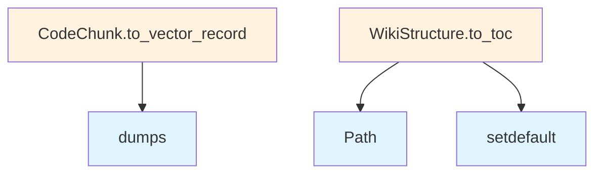

# File Overview

This file defines Pydantic models and data structures used throughout the `local_deepwiki` application for representing various entities like code chunks, wiki pages, indexing status, research steps, and arguments for different operations. It serves as a core data layer for managing and exchanging information between components.

## Dependencies

The file imports:
- `json` for JSON serialization
- `Enum` from `enum` for defining enumerations
- `Path` from `pathlib` for handling file paths
- `Any`, `Protocol` from `typing` for type hints
- `BaseModel`, `Field` from `pydantic` for data validation and serialization

## External Usage

The classes defined in this file are used by:
- `ExportWikiHtmlArgs`: used by handlers
- `ExportWikiPdfArgs`: used by handlers

# Classes

## ProgressCallback

A protocol defining the interface for progress callback functions used during long-running operations like indexing and wiki generation.

### Methods
- `__call__(self, msg: str, current: int, total: int) -> None`
  - Reports progress.
  - **Parameters**:
    - `msg`: Description of current operation.
    - `current`: Current step number.
    - `total`: Total number of steps.

## Language

An enumeration of supported programming languages.

### Values
- `PYTHON`
- `JAVASCRIPT`
- `TYPESCRIPT`
- `TSX`
- `GO`
- `RUST`
- `JAVA`
- `C`
- `CPP`
- `SWIFT`
- `RUBY`
- `PHP`
- `KOTLIN`
- `CSHARP`

## ChunkType

An enumeration of types of code chunks.

### Values
- `FUNCTION`
- `CLASS`
- `METHOD`
- `MODULE`
- `IMPORT`
- `COMMENT`
- `OTHER`

## CodeChunk

A chunk of code extracted from the repository.

### Fields
- `id`: Unique identifier for this chunk
- `file_path`: Path to the source file
- `language`: Programming language
- `chunk_type`: Type of code chunk
- `name`: Name of function/class/etc (optional)
- `content`: The actual code content
- `start_line`: Starting line number
- `end_line`: Ending line number

## FileInfo

Information about a source file.

### Fields
- `path`: Relative path from repo root
- `language`: Detected language (optional)
- `size_bytes`: File size in bytes
- `last_modified`: Last modification timestamp
- `hash`: Content hash for change detection
- `chunk_count`: Number of chunks extracted (default: 0)

### Methods
- `__repr__(self) -> str`
  - Returns a concise representation for debugging.

## IndexStatus

Status of repository indexing.

### Fields
- `repo_path`: Path to the repository
- `indexed_at`: Timestamp of last indexing
- `total_files`: Total files processed
- `total_chunks`: Total chunks extracted
- `languages`: Files per language (default: {})
- `files`: Indexed file info (default: [])
- `schema_version`: Schema version (default: 1)

## WikiPage

A generated wiki page.

### Fields
- `path`: Relative path in wiki directory
- `title`: Page title
- `content`: Markdown content
- `generated_at`: Generation timestamp

### Methods
- `__repr__(self) -> str`
  - Returns a concise representation for debugging.

## WikiStructure

Structure of the generated wiki.

### Fields
- `root`: Wiki root directory
- `pages`: All wiki pages (default: [])

### Methods
- `__repr__(self) -> str`
  - Returns a concise representation for debugging.
- `to_toc(self) -> dict[str, Any]`
  - Generates table of contents.

## SearchResult

A search result from semantic search.

### Fields
- `chunk`: The matched code chunk
- `score`: Similarity score
- `highlights`: Relevant snippets (default: [])
- `suggestions`: 'Did you mean?' suggestions when results are poor (default: None)

### Methods
- `__repr__(self) -> str`
  - Returns a concise representation for debugging.

## WikiPageStatus

Status of a generated wiki page for incremental generation.

### Fields
- `path`: Wiki page path (e.g., 'files/src/module/file.md')
- `source_files`: Source files that contributed to this page (default: [])
- `source_hashes`: Mapping of source file path to content hash (default: {})
- `source_line_info`: Mapping of source file path to {start_line, end_line} (default: {})

## WikiGenerationStatus

Status of wiki generation for tracking incremental updates.

### Fields
- `repo_path`: Path to the repository
- `generated_at`: Timestamp of last generation
- `total_pages`: Total pages generated
- `index_status_hash`: Hash of index status for detecting changes (default: "")
- `pages`: Mapping of page path to status (default: {})

### Methods
- `__repr__(self) -> str`
  - Returns a concise representation for debugging.

## ResearchStepType

Types of steps in the deep research process.

### Values
- `DECOMPOSITION`
- `RETRIEVAL`
- `GAP_ANALYSIS`
- `SYNTHESIS`

## ResearchStep

A single step in the deep research process.

### Fields
- `step_type`: Type of research step
- `description`: Description of what was done
- `duration_ms`: Duration of this step in milliseconds

### Methods
- `__repr__(self) -> str`
  - Returns a concise representation for debugging.

# Integration

This file provides the foundational data models for the `local_deepwiki` application. It is imported by other modules within the project to define the structure of data exchanged between components. The models are used by handlers for operations like exporting wiki content to HTML or PDF, as indicated by the usage of `ExportWikiHtmlArgs` and `ExportWikiPdfArgs`.

# Usage Examples

The following examples demonstrate how to use the defined models based on their actual signatures:

### CodeChunk Example

```python
from src.local_deepwiki.models import CodeChunk, Language, ChunkType

chunk = CodeChunk(
    id="chunk_123",
    file_path="src/main.py",
    language=Language.PYTHON,
    chunk_type=ChunkType.FUNCTION,
    name="my_function",
    content="def my_function():\n    pass",
    start_line=10,
    end_line=15
)
```

### WikiPage Example

```python
from src.local_deepwiki.models import WikiPage

page = WikiPage(
    path="api/users.md",
    title="User API",
    content="# User API\n\nThis is the user API documentation.",
    generated_at=1678886400.0
)
```

### SearchResult Example

```python
from src.local_deepwiki.models import SearchResult, CodeChunk

chunk = CodeChunk(...)
result = SearchResult(
    chunk=chunk,
    score=0.95,
    highlights=["def my_function", "return True"],
    suggestions=["Did you mean 'my_function'?"]
)
```

## API Reference

### class `ProgressCallback`

**Inherits from:** `Protocol`

Protocol for progress callback functions.  Progress callbacks are used to report progress during long-running operations like indexing and wiki generation.

**Methods:**


<details>
<summary>View Source (lines 11-26) | <a href="https://github.com/UrbanDiver/local-deepwiki-mcp/blob/[main](export/pdf.md)/src/local_deepwiki/models.py#L11-L26">GitHub</a></summary>

```python
class ProgressCallback(Protocol):
    """Protocol for progress callback functions.

    Progress callbacks are used to report progress during long-running
    operations like indexing and wiki generation.
    """

    def __call__(self, msg: str, current: int, total: int) -> None:
        """Report progress.

        Args:
            msg: Description of current operation.
            current: Current step number.
            total: Total number of steps.
        """
        ...
```

</details>

#### `__call__`

```python
def __call__(msg: str, current: int, total: int) -> None
```

Report progress.


| [Parameter](generators/api_docs.md) | Type | Default | Description |
|-----------|------|---------|-------------|
| `msg` | `str` | - | Description of current operation. |
| `current` | `int` | - | Current step number. |
| `total` | `int` | - | Total number of steps. |


<details>
<summary>View Source (lines 11-26) | <a href="https://github.com/UrbanDiver/local-deepwiki-mcp/blob/[main](export/pdf.md)/src/local_deepwiki/models.py#L11-L26">GitHub</a></summary>

```python
class ProgressCallback(Protocol):
    """Protocol for progress callback functions.

    Progress callbacks are used to report progress during long-running
    operations like indexing and wiki generation.
    """

    def __call__(self, msg: str, current: int, total: int) -> None:
        """Report progress.

        Args:
            msg: Description of current operation.
            current: Current step number.
            total: Total number of steps.
        """
        ...
```

</details>

### class `Language`

**Inherits from:** `str`, `Enum`

Supported programming languages.


<details>
<summary>View Source (lines 29-45) | <a href="https://github.com/UrbanDiver/local-deepwiki-mcp/blob/[main](export/pdf.md)/src/local_deepwiki/models.py#L29-L45">GitHub</a></summary>

```python
class Language(str, Enum):
    """Supported programming languages."""

    PYTHON = "python"
    JAVASCRIPT = "javascript"
    TYPESCRIPT = "typescript"
    TSX = "tsx"
    GO = "go"
    RUST = "rust"
    JAVA = "java"
    C = "c"
    CPP = "cpp"
    SWIFT = "swift"
    RUBY = "ruby"
    PHP = "php"
    KOTLIN = "kotlin"
    CSHARP = "csharp"
```

</details>

### class `ChunkType`

**Inherits from:** `str`, `Enum`

Types of code chunks.


<details>
<summary>View Source (lines 48-57) | <a href="https://github.com/UrbanDiver/local-deepwiki-mcp/blob/[main](export/pdf.md)/src/local_deepwiki/models.py#L48-L57">GitHub</a></summary>

```python
class ChunkType(str, Enum):
    """Types of code chunks."""

    FUNCTION = "function"
    CLASS = "class"
    METHOD = "method"
    MODULE = "module"
    IMPORT = "import"
    COMMENT = "comment"
    OTHER = "other"
```

</details>

### class `CodeChunk`

**Inherits from:** `BaseModel`

A chunk of code extracted from the repository.

**Methods:**


<details>
<summary>View Source (lines 60-111) | <a href="https://github.com/UrbanDiver/local-deepwiki-mcp/blob/[main](export/pdf.md)/src/local_deepwiki/models.py#L60-L111">GitHub</a></summary>

```python
class CodeChunk(BaseModel):
    """A chunk of code extracted from the repository."""

    id: str = Field(description="Unique identifier for this chunk")
    file_path: str = Field(description="Path to the source file")
    language: Language = Field(description="Programming language")
    chunk_type: ChunkType = Field(description="Type of code chunk")
    name: str | None = Field(default=None, description="Name of function/class/etc")
    content: str = Field(description="The actual code content")
    start_line: int = Field(description="Starting line number")
    end_line: int = Field(description="Ending line number")
    docstring: str | None = Field(default=None, description="Associated docstring")
    parent_name: str | None = Field(
        default=None, description="Parent class/module name"
    )
    metadata: dict[str, Any] = Field(
        default_factory=dict, description="Additional metadata"
    )

    def to_vector_record(self, vector: list[float] | None = None) -> dict[str, Any]:
        """Convert chunk to a dict suitable for vector store storage.

        Args:
            vector: Optional embedding vector to include in the record.

        Returns:
            Dict with all fields formatted for LanceDB storage.
        """
        record: dict[str, Any] = {
            "id": self.id,
            "file_path": self.file_path,
            "language": self.language.value,
            "chunk_type": self.chunk_type.value,
            "name": self.name or "",
            "content": self.content,
            "start_line": self.start_line,
            "end_line": self.end_line,
            "docstring": self.docstring or "",
            "parent_name": self.parent_name or "",
            "metadata": json.dumps(self.metadata),
        }
        if vector is not None:
            record["vector"] = vector
        return record

    def __repr__(self) -> str:
        """Return a concise representation for debugging."""
        name_part = f" {self.name}" if self.name else ""
        return (
            f"<CodeChunk {self.chunk_type.value}{name_part} "
            f"at {self.file_path}:{self.start_line}-{self.end_line}>"
        )
```

</details>

#### `to_vector_record`

```python
def to_vector_record(vector: list[float] | None = None) -> dict[str, Any]
```

Convert chunk to a dict suitable for vector store storage.


| [Parameter](generators/api_docs.md) | Type | Default | Description |
|-----------|------|---------|-------------|
| `vector` | `list[float] | None` | `None` | Optional embedding vector to include in the record. |


<details>
<summary>View Source (lines 60-111) | <a href="https://github.com/UrbanDiver/local-deepwiki-mcp/blob/[main](export/pdf.md)/src/local_deepwiki/models.py#L60-L111">GitHub</a></summary>

```python
class CodeChunk(BaseModel):
    """A chunk of code extracted from the repository."""

    id: str = Field(description="Unique identifier for this chunk")
    file_path: str = Field(description="Path to the source file")
    language: Language = Field(description="Programming language")
    chunk_type: ChunkType = Field(description="Type of code chunk")
    name: str | None = Field(default=None, description="Name of function/class/etc")
    content: str = Field(description="The actual code content")
    start_line: int = Field(description="Starting line number")
    end_line: int = Field(description="Ending line number")
    docstring: str | None = Field(default=None, description="Associated docstring")
    parent_name: str | None = Field(
        default=None, description="Parent class/module name"
    )
    metadata: dict[str, Any] = Field(
        default_factory=dict, description="Additional metadata"
    )

    def to_vector_record(self, vector: list[float] | None = None) -> dict[str, Any]:
        """Convert chunk to a dict suitable for vector store storage.

        Args:
            vector: Optional embedding vector to include in the record.

        Returns:
            Dict with all fields formatted for LanceDB storage.
        """
        record: dict[str, Any] = {
            "id": self.id,
            "file_path": self.file_path,
            "language": self.language.value,
            "chunk_type": self.chunk_type.value,
            "name": self.name or "",
            "content": self.content,
            "start_line": self.start_line,
            "end_line": self.end_line,
            "docstring": self.docstring or "",
            "parent_name": self.parent_name or "",
            "metadata": json.dumps(self.metadata),
        }
        if vector is not None:
            record["vector"] = vector
        return record

    def __repr__(self) -> str:
        """Return a concise representation for debugging."""
        name_part = f" {self.name}" if self.name else ""
        return (
            f"<CodeChunk {self.chunk_type.value}{name_part} "
            f"at {self.file_path}:{self.start_line}-{self.end_line}>"
        )
```

</details>

### class `FileInfo`

**Inherits from:** `BaseModel`

Information about a source file.


<details>
<summary>View Source (lines 114-127) | <a href="https://github.com/UrbanDiver/local-deepwiki-mcp/blob/[main](export/pdf.md)/src/local_deepwiki/models.py#L114-L127">GitHub</a></summary>

```python
class FileInfo(BaseModel):
    """Information about a source file."""

    path: str = Field(description="Relative path from repo root")
    language: Language | None = Field(default=None, description="Detected language")
    size_bytes: int = Field(description="File size in bytes")
    last_modified: float = Field(description="Last modification timestamp")
    hash: str = Field(description="Content hash for change detection")
    chunk_count: int = Field(default=0, description="Number of chunks extracted")

    def __repr__(self) -> str:
        """Return a concise representation for debugging."""
        lang = self.language.value if self.language else "unknown"
        return f"<FileInfo {self.path} ({lang}, {self.chunk_count} chunks)>"
```

</details>

### class `IndexStatus`

**Inherits from:** `BaseModel`

Status of repository indexing.


<details>
<summary>View Source (lines 130-150) | <a href="https://github.com/UrbanDiver/local-deepwiki-mcp/blob/[main](export/pdf.md)/src/local_deepwiki/models.py#L130-L150">GitHub</a></summary>

```python
class IndexStatus(BaseModel):
    """Status of repository indexing."""

    repo_path: str = Field(description="Path to the repository")
    indexed_at: float = Field(description="Timestamp of last indexing")
    total_files: int = Field(description="Total files processed")
    total_chunks: int = Field(description="Total chunks extracted")
    languages: dict[str, int] = Field(
        default_factory=dict, description="Files per language"
    )
    files: list[FileInfo] = Field(default_factory=list, description="Indexed file info")
    schema_version: int = Field(
        default=1, description="Schema version for migration support"
    )

    def __repr__(self) -> str:
        """Return a concise representation for debugging."""
        return (
            f"<IndexStatus {self.repo_path} "
            f"({self.total_files} files, {self.total_chunks} chunks)>"
        )
```

</details>

### class `WikiPage`

**Inherits from:** `BaseModel`

A generated wiki page.


<details>
<summary>View Source (lines 153-163) | <a href="https://github.com/UrbanDiver/local-deepwiki-mcp/blob/[main](export/pdf.md)/src/local_deepwiki/models.py#L153-L163">GitHub</a></summary>

```python
class WikiPage(BaseModel):
    """A generated wiki page."""

    path: str = Field(description="Relative path in wiki directory")
    title: str = Field(description="Page title")
    content: str = Field(description="Markdown content")
    generated_at: float = Field(description="Generation timestamp")

    def __repr__(self) -> str:
        """Return a concise representation for debugging."""
        return f"<WikiPage {self.path} ({self.title!r})>"
```

</details>

### class `WikiStructure`

**Inherits from:** `BaseModel`

Structure of the generated wiki.

**Methods:**


<details>
<summary>View Source (lines 166-193) | <a href="https://github.com/UrbanDiver/local-deepwiki-mcp/blob/[main](export/pdf.md)/src/local_deepwiki/models.py#L166-L193">GitHub</a></summary>

```python
class WikiStructure(BaseModel):
    """Structure of the generated wiki."""

    root: str = Field(description="Wiki root directory")
    pages: list[WikiPage] = Field(default_factory=list, description="All wiki pages")

    def __repr__(self) -> str:
        """Return a concise representation for debugging."""
        return f"<WikiStructure {self.root} ({len(self.pages)} pages)>"

    def to_toc(self) -> dict[str, Any]:
        """Generate table of contents."""
        toc: dict[str, Any] = {"sections": []}
        for page in sorted(self.pages, key=lambda p: p.path):
            parts = Path(page.path).parts
            current = toc
            for part in parts[:-1]:
                section = next(
                    (s for s in current.get("sections", []) if s["name"] == part), None
                )
                if not section:
                    section = {"name": part, "sections": [], "pages": []}
                    current.setdefault("sections", []).append(section)
                current = section
            current.setdefault("pages", []).append(
                {"path": page.path, "title": page.title}
            )
        return toc
```

</details>

#### `to_toc`

```python
def to_toc() -> dict[str, Any]
```

Generate table of contents.


<details>
<summary>View Source (lines 166-193) | <a href="https://github.com/UrbanDiver/local-deepwiki-mcp/blob/[main](export/pdf.md)/src/local_deepwiki/models.py#L166-L193">GitHub</a></summary>

```python
class WikiStructure(BaseModel):
    """Structure of the generated wiki."""

    root: str = Field(description="Wiki root directory")
    pages: list[WikiPage] = Field(default_factory=list, description="All wiki pages")

    def __repr__(self) -> str:
        """Return a concise representation for debugging."""
        return f"<WikiStructure {self.root} ({len(self.pages)} pages)>"

    def to_toc(self) -> dict[str, Any]:
        """Generate table of contents."""
        toc: dict[str, Any] = {"sections": []}
        for page in sorted(self.pages, key=lambda p: p.path):
            parts = Path(page.path).parts
            current = toc
            for part in parts[:-1]:
                section = next(
                    (s for s in current.get("sections", []) if s["name"] == part), None
                )
                if not section:
                    section = {"name": part, "sections": [], "pages": []}
                    current.setdefault("sections", []).append(section)
                current = section
            current.setdefault("pages", []).append(
                {"path": page.path, "title": page.title}
            )
        return toc
```

</details>

### class `SearchResult`

**Inherits from:** `BaseModel`

A search result from semantic search.


<details>
<summary>View Source (lines 196-212) | <a href="https://github.com/UrbanDiver/local-deepwiki-mcp/blob/[main](export/pdf.md)/src/local_deepwiki/models.py#L196-L212">GitHub</a></summary>

```python
class SearchResult(BaseModel):
    """A search result from semantic search."""

    chunk: CodeChunk = Field(description="The matched code chunk")
    score: float = Field(description="Similarity score")
    highlights: list[str] = Field(default_factory=list, description="Relevant snippets")
    suggestions: list[str] | None = Field(
        default=None, description="'Did you mean?' suggestions when results are poor"
    )

    def __repr__(self) -> str:
        """Return a concise representation for debugging."""
        name = self.chunk.name or self.chunk.chunk_type.value
        suggestion_str = (
            f" suggestions={len(self.suggestions)}" if self.suggestions else ""
        )
        return f"<SearchResult {name} score={self.score:.3f}{suggestion_str}>"
```

</details>

### class `WikiPageStatus`

**Inherits from:** `BaseModel`

Status of a generated wiki page for incremental generation.


<details>
<summary>View Source (lines 215-234) | <a href="https://github.com/UrbanDiver/local-deepwiki-mcp/blob/[main](export/pdf.md)/src/local_deepwiki/models.py#L215-L234">GitHub</a></summary>

```python
class WikiPageStatus(BaseModel):
    """Status of a generated wiki page for incremental generation."""

    path: str = Field(description="Wiki page path (e.g., 'files/src/module/file.md')")
    source_files: list[str] = Field(
        default_factory=list, description="Source files that contributed to this page"
    )
    source_hashes: dict[str, str] = Field(
        default_factory=dict, description="Mapping of source file path to content hash"
    )
    source_line_info: dict[str, dict[str, int]] = Field(
        default_factory=dict,
        description="Mapping of source file path to {start_line, end_line}",
    )
    content_hash: str = Field(description="Hash of the generated page content")
    generated_at: float = Field(description="Timestamp when page was generated")

    def __repr__(self) -> str:
        """Return a concise representation for debugging."""
        return f"<WikiPageStatus {self.path} ({len(self.source_files)} sources)>"
```

</details>

### class `WikiGenerationStatus`

**Inherits from:** `BaseModel`

Status of wiki generation for tracking incremental updates.


<details>
<summary>View Source (lines 237-252) | <a href="https://github.com/UrbanDiver/local-deepwiki-mcp/blob/[main](export/pdf.md)/src/local_deepwiki/models.py#L237-L252">GitHub</a></summary>

```python
class WikiGenerationStatus(BaseModel):
    """Status of wiki generation for tracking incremental updates."""

    repo_path: str = Field(description="Path to the repository")
    generated_at: float = Field(description="Timestamp of last generation")
    total_pages: int = Field(description="Total pages generated")
    index_status_hash: str = Field(
        default="", description="Hash of index status for detecting changes"
    )
    pages: dict[str, WikiPageStatus] = Field(
        default_factory=dict, description="Mapping of page path to status"
    )

    def __repr__(self) -> str:
        """Return a concise representation for debugging."""
        return f"<WikiGenerationStatus {self.repo_path} ({self.total_pages} pages)>"
```

</details>

### class `ResearchStepType`

**Inherits from:** `str`, `Enum`

Types of steps in the deep research process.


<details>
<summary>View Source (lines 258-264) | <a href="https://github.com/UrbanDiver/local-deepwiki-mcp/blob/[main](export/pdf.md)/src/local_deepwiki/models.py#L258-L264">GitHub</a></summary>

```python
class ResearchStepType(str, Enum):
    """Types of steps in the deep research process."""

    DECOMPOSITION = "decomposition"
    RETRIEVAL = "retrieval"
    GAP_ANALYSIS = "gap_analysis"
    SYNTHESIS = "synthesis"
```

</details>

### class `ResearchStep`

**Inherits from:** `BaseModel`

A single step in the deep research process.


<details>
<summary>View Source (lines 267-276) | <a href="https://github.com/UrbanDiver/local-deepwiki-mcp/blob/[main](export/pdf.md)/src/local_deepwiki/models.py#L267-L276">GitHub</a></summary>

```python
class ResearchStep(BaseModel):
    """A single step in the deep research process."""

    step_type: ResearchStepType = Field(description="Type of research step")
    description: str = Field(description="Description of what was done")
    duration_ms: int = Field(description="Duration of this step in milliseconds")

    def __repr__(self) -> str:
        """Return a concise representation for debugging."""
        return f"<ResearchStep {self.step_type.value} ({self.duration_ms}ms)>"
```

</details>

### class `SubQuestion`

**Inherits from:** `BaseModel`

A decomposed sub-question for deep research.


<details>
<summary>View Source (lines 279-289) | <a href="https://github.com/UrbanDiver/local-deepwiki-mcp/blob/[main](export/pdf.md)/src/local_deepwiki/models.py#L279-L289">GitHub</a></summary>

```python
class SubQuestion(BaseModel):
    """A decomposed sub-question for deep research."""

    question: str = Field(description="The sub-question to investigate")
    category: str = Field(
        description="Category: structure, flow, dependencies, impact, or comparison"
    )

    def __repr__(self) -> str:
        """Return a concise representation for debugging."""
        return f"<SubQuestion [{self.category}] {self.question[:50]}...>"
```

</details>

### class `SourceReference`

**Inherits from:** `BaseModel`

A reference to a source code location.


<details>
<summary>View Source (lines 292-305) | <a href="https://github.com/UrbanDiver/local-deepwiki-mcp/blob/[main](export/pdf.md)/src/local_deepwiki/models.py#L292-L305">GitHub</a></summary>

```python
class SourceReference(BaseModel):
    """A reference to a source code location."""

    file_path: str = Field(description="Path to the source file")
    start_line: int = Field(description="Starting line number")
    end_line: int = Field(description="Ending line number")
    chunk_type: str = Field(description="Type of code chunk")
    name: str | None = Field(default=None, description="Name of the code element")
    relevance_score: float = Field(description="Relevance score from search")

    def __repr__(self) -> str:
        """Return a concise representation for debugging."""
        name = self.name or self.chunk_type
        return f"<Source {self.file_path}:{self.start_line}-{self.end_line} ({name})>"
```

</details>

### class `DeepResearchResult`

**Inherits from:** `BaseModel`

Result from deep research analysis.


<details>
<summary>View Source (lines 308-330) | <a href="https://github.com/UrbanDiver/local-deepwiki-mcp/blob/[main](export/pdf.md)/src/local_deepwiki/models.py#L308-L330">GitHub</a></summary>

```python
class DeepResearchResult(BaseModel):
    """Result from deep research analysis."""

    question: str = Field(description="Original question asked")
    answer: str = Field(description="Comprehensive answer with citations")
    sub_questions: list[SubQuestion] = Field(
        default_factory=list, description="Decomposed sub-questions investigated"
    )
    sources: list[SourceReference] = Field(
        default_factory=list, description="Source code references used"
    )
    reasoning_trace: list[ResearchStep] = Field(
        default_factory=list, description="Steps taken during research"
    )
    total_chunks_analyzed: int = Field(description="Total code chunks analyzed")
    total_llm_calls: int = Field(description="Total LLM calls made")

    def __repr__(self) -> str:
        """Return a concise representation for debugging."""
        return (
            f"<DeepResearchResult {len(self.sub_questions)} sub-questions, "
            f"{len(self.sources)} sources, {self.total_llm_calls} LLM calls>"
        )
```

</details>

### class `IndexingProgressType`

**Inherits from:** `str`, `Enum`

Types of indexing progress events.


<details>
<summary>View Source (lines 333-343) | <a href="https://github.com/UrbanDiver/local-deepwiki-mcp/blob/[main](export/pdf.md)/src/local_deepwiki/models.py#L333-L343">GitHub</a></summary>

```python
class IndexingProgressType(str, Enum):
    """Types of indexing progress events."""

    STARTED = "started"
    SCANNING_FILES = "scanning_files"
    PARSING_FILES = "parsing_files"
    GENERATING_EMBEDDINGS = "generating_embeddings"
    STORING_VECTORS = "storing_vectors"
    GENERATING_WIKI = "generating_wiki"
    GENERATING_PAGES = "generating_pages"
    COMPLETE = "complete"
```

</details>

### class `IndexingProgress`

**Inherits from:** `BaseModel`

Progress update from repository indexing.  Sent via MCP progress notifications to provide real-time feedback during long-running indexing operations.


<details>
<summary>View Source (lines 346-369) | <a href="https://github.com/UrbanDiver/local-deepwiki-mcp/blob/[main](export/pdf.md)/src/local_deepwiki/models.py#L346-L369">GitHub</a></summary>

```python
class IndexingProgress(BaseModel):
    """Progress update from repository indexing.

    Sent via MCP progress notifications to provide real-time feedback
    during long-running indexing operations.
    """

    step: int = Field(description="Current step number")
    total_steps: int = Field(description="Total number of steps")
    step_type: IndexingProgressType = Field(description="Type of progress event")
    message: str = Field(description="Human-readable progress message")
    files_processed: int | None = Field(
        default=None, description="Number of files processed"
    )
    total_files: int | None = Field(default=None, description="Total files to process")
    chunks_created: int | None = Field(
        default=None, description="Number of chunks created"
    )
    pages_generated: int | None = Field(
        default=None, description="Wiki pages generated"
    )
    duration_ms: int | None = Field(
        default=None, description="Duration of step in milliseconds"
    )
```

</details>

### class `ResearchProgressType`

**Inherits from:** `str`, `Enum`

Types of deep research progress events.


<details>
<summary>View Source (lines 372-382) | <a href="https://github.com/UrbanDiver/local-deepwiki-mcp/blob/[main](export/pdf.md)/src/local_deepwiki/models.py#L372-L382">GitHub</a></summary>

```python
class ResearchProgressType(str, Enum):
    """Types of deep research progress events."""

    STARTED = "started"
    DECOMPOSITION_COMPLETE = "decomposition_complete"
    RETRIEVAL_COMPLETE = "retrieval_complete"
    GAP_ANALYSIS_COMPLETE = "gap_analysis_complete"
    FOLLOWUP_COMPLETE = "followup_complete"
    SYNTHESIS_STARTED = "synthesis_started"
    COMPLETE = "complete"
    CANCELLED = "cancelled"
```

</details>

### class `ResearchProgress`

**Inherits from:** `BaseModel`

Progress update from deep research pipeline.  Sent via MCP progress notifications to provide real-time feedback during long-running deep research operations.


<details>
<summary>View Source (lines 385-407) | <a href="https://github.com/UrbanDiver/local-deepwiki-mcp/blob/[main](export/pdf.md)/src/local_deepwiki/models.py#L385-L407">GitHub</a></summary>

```python
class ResearchProgress(BaseModel):
    """Progress update from deep research pipeline.

    Sent via MCP progress notifications to provide real-time feedback
    during long-running deep research operations.
    """

    step: int = Field(description="Current step number (0-5)")
    total_steps: int = Field(default=5, description="Total number of steps")
    step_type: ResearchProgressType = Field(description="Type of progress event")
    message: str = Field(description="Human-readable progress message")
    sub_questions: list[SubQuestion] | None = Field(
        default=None, description="Sub-questions after decomposition"
    )
    chunks_retrieved: int | None = Field(
        default=None, description="Number of chunks retrieved so far"
    )
    follow_up_queries: list[str] | None = Field(
        default=None, description="Follow-up queries from gap analysis"
    )
    duration_ms: int | None = Field(
        default=None, description="Duration of completed step in milliseconds"
    )
```

</details>

### class `LLMProviderType`

**Inherits from:** `str`, `Enum`

Supported LLM providers.


<details>
<summary>View Source (lines 415-420) | <a href="https://github.com/UrbanDiver/local-deepwiki-mcp/blob/[main](export/pdf.md)/src/local_deepwiki/models.py#L415-L420">GitHub</a></summary>

```python
class LLMProviderType(str, Enum):
    """Supported LLM providers."""

    OLLAMA = "ollama"
    ANTHROPIC = "anthropic"
    OPENAI = "openai"
```

</details>

### class `EmbeddingProviderType`

**Inherits from:** `str`, `Enum`

Supported embedding providers.


<details>
<summary>View Source (lines 423-427) | <a href="https://github.com/UrbanDiver/local-deepwiki-mcp/blob/[main](export/pdf.md)/src/local_deepwiki/models.py#L423-L427">GitHub</a></summary>

```python
class EmbeddingProviderType(str, Enum):
    """Supported embedding providers."""

    LOCAL = "local"
    OPENAI = "openai"
```

</details>

### class `IndexRepositoryArgs`

**Inherits from:** `BaseModel`

Arguments for the index_repository tool.


<details>
<summary>View Source (lines 430-452) | <a href="https://github.com/UrbanDiver/local-deepwiki-mcp/blob/[main](export/pdf.md)/src/local_deepwiki/models.py#L430-L452">GitHub</a></summary>

```python
class IndexRepositoryArgs(BaseModel):
    """Arguments for the index_repository tool."""

    repo_path: str = Field(description="Absolute path to the repository to index")
    output_dir: str | None = Field(
        default=None,
        description="Output directory for wiki (default: {repo}/.deepwiki)",
    )
    languages: list[str] | None = Field(
        default=None, description="Languages to include (default: all supported)"
    )
    full_rebuild: bool = Field(
        default=False, description="Force full rebuild instead of incremental update"
    )
    llm_provider: LLMProviderType | None = Field(
        default=None, description="LLM provider for wiki generation"
    )
    embedding_provider: EmbeddingProviderType | None = Field(
        default=None, description="Embedding provider for semantic search"
    )
    use_cloud_for_github: bool | None = Field(
        default=None, description="Use cloud LLM for GitHub repos"
    )
```

</details>

### class `AskQuestionArgs`

**Inherits from:** `BaseModel`

Arguments for the ask_question tool.


<details>
<summary>View Source (lines 455-462) | <a href="https://github.com/UrbanDiver/local-deepwiki-mcp/blob/[main](export/pdf.md)/src/local_deepwiki/models.py#L455-L462">GitHub</a></summary>

```python
class AskQuestionArgs(BaseModel):
    """Arguments for the ask_question tool."""

    repo_path: str = Field(description="Path to the indexed repository")
    question: str = Field(min_length=1, description="Question about the codebase")
    max_context: int = Field(
        default=10, ge=1, le=50, description="Maximum code chunks for context (1-50)"
    )
```

</details>

### class `DeepResearchArgs`

**Inherits from:** `BaseModel`

Arguments for the deep_research tool.


<details>
<summary>View Source (lines 465-481) | <a href="https://github.com/UrbanDiver/local-deepwiki-mcp/blob/[main](export/pdf.md)/src/local_deepwiki/models.py#L465-L481">GitHub</a></summary>

```python
class DeepResearchArgs(BaseModel):
    """Arguments for the deep_research tool."""

    repo_path: str = Field(description="Path to the indexed repository")
    question: str = Field(
        min_length=1, description="Complex question requiring deep analysis"
    )
    max_chunks: int = Field(
        default=30, ge=10, le=50, description="Maximum code chunks to analyze (10-50)"
    )
    preset: str | None = Field(
        default=None, description="Research preset: 'fast', 'deep', or 'comprehensive'"
    )
    resume_research_id: str | None = Field(
        default=None,
        description="Optional checkpoint ID to resume an interrupted research session",
    )
```

</details>

### class `ReadWikiStructureArgs`

**Inherits from:** `BaseModel`

Arguments for the read_wiki_structure tool.


<details>
<summary>View Source (lines 484-487) | <a href="https://github.com/UrbanDiver/local-deepwiki-mcp/blob/[main](export/pdf.md)/src/local_deepwiki/models.py#L484-L487">GitHub</a></summary>

```python
class ReadWikiStructureArgs(BaseModel):
    """Arguments for the read_wiki_structure tool."""

    wiki_path: str = Field(description="Path to the wiki directory")
```

</details>

### class `ReadWikiPageArgs`

**Inherits from:** `BaseModel`

Arguments for the read_wiki_page tool.


<details>
<summary>View Source (lines 490-496) | <a href="https://github.com/UrbanDiver/local-deepwiki-mcp/blob/[main](export/pdf.md)/src/local_deepwiki/models.py#L490-L496">GitHub</a></summary>

```python
class ReadWikiPageArgs(BaseModel):
    """Arguments for the read_wiki_page tool."""

    wiki_path: str = Field(description="Path to the wiki directory")
    page: str = Field(
        min_length=1, description="Relative path to the page within the wiki"
    )
```

</details>

### class `SearchCodeArgs`

**Inherits from:** `BaseModel`

Arguments for the search_code tool.


<details>
<summary>View Source (lines 499-513) | <a href="https://github.com/UrbanDiver/local-deepwiki-mcp/blob/[main](export/pdf.md)/src/local_deepwiki/models.py#L499-L513">GitHub</a></summary>

```python
class SearchCodeArgs(BaseModel):
    """Arguments for the search_code tool."""

    repo_path: str = Field(description="Path to the indexed repository")
    query: str = Field(min_length=1, description="Search query")
    limit: int = Field(default=10, ge=1, le=100, description="Maximum results (1-100)")
    language: str | None = Field(default=None, description="Filter by language")
    type: str | None = Field(
        default=None, description="Filter by chunk type (function, class, method, etc.)"
    )
    path: str | None = Field(default=None, description="Filter by file path pattern")
    fuzzy: bool = Field(default=False, description="Enable fuzzy text matching")
    fuzzy_weight: float = Field(
        default=0.3, ge=0.0, le=1.0, description="Weight for fuzzy vs vector (0.0-1.0)"
    )
```

</details>

### class `ExportWikiHtmlArgs`

**Inherits from:** `BaseModel`

Arguments for the export_wiki_html tool.


<details>
<summary>View Source (lines 516-522) | <a href="https://github.com/UrbanDiver/local-deepwiki-mcp/blob/[main](export/pdf.md)/src/local_deepwiki/models.py#L516-L522">GitHub</a></summary>

```python
class ExportWikiHtmlArgs(BaseModel):
    """Arguments for the export_wiki_html tool."""

    wiki_path: str = Field(description="Path to the wiki directory to export")
    output_path: str | None = Field(
        default=None, description="Output directory for HTML files"
    )
```

</details>

### class `ExportWikiPdfArgs`

**Inherits from:** `BaseModel`

Arguments for the export_wiki_pdf tool.


<details>
<summary>View Source (lines 525-532) | <a href="https://github.com/UrbanDiver/local-deepwiki-mcp/blob/[main](export/pdf.md)/src/local_deepwiki/models.py#L525-L532">GitHub</a></summary>

```python
class ExportWikiPdfArgs(BaseModel):
    """Arguments for the export_wiki_pdf tool."""

    wiki_path: str = Field(description="Path to the wiki directory to export")
    output_path: str | None = Field(default=None, description="Output path for PDF")
    single_file: bool = Field(
        default=True, description="Combine all pages into single PDF"
    )
```

</details>

### class `ResearchCheckpointStep`

**Inherits from:** `str`, `Enum`

Current step in a research checkpoint.


<details>
<summary>View Source (lines 540-550) | <a href="https://github.com/UrbanDiver/local-deepwiki-mcp/blob/[main](export/pdf.md)/src/local_deepwiki/models.py#L540-L550">GitHub</a></summary>

```python
class ResearchCheckpointStep(str, Enum):
    """Current step in a research checkpoint."""

    DECOMPOSITION = "decomposition"
    RETRIEVAL = "retrieval"
    GAP_ANALYSIS = "gap_analysis"
    FOLLOW_UP_RETRIEVAL = "follow_up_retrieval"
    SYNTHESIS = "synthesis"
    COMPLETE = "complete"
    ERROR = "error"
    CANCELLED = "cancelled"
```

</details>

### class `ResearchCheckpoint`

**Inherits from:** `BaseModel`

Checkpoint state for resumable deep research operations.  This model captures the complete state of a research operation, allowing it to be saved after each step and resumed if interrupted.


<details>
<summary>View Source (lines 553-594) | <a href="https://github.com/UrbanDiver/local-deepwiki-mcp/blob/[main](export/pdf.md)/src/local_deepwiki/models.py#L553-L594">GitHub</a></summary>

```python
class ResearchCheckpoint(BaseModel):
    """Checkpoint state for resumable deep research operations.

    This model captures the complete state of a research operation,
    allowing it to be saved after each step and resumed if interrupted.
    """

    research_id: str = Field(description="UUID for this research session")
    question: str = Field(description="Original research question")
    repo_path: str = Field(description="Path to the repository being researched")
    started_at: float = Field(description="Unix timestamp when research started")
    updated_at: float = Field(description="Unix timestamp of last update")
    current_step: ResearchCheckpointStep = Field(
        description="Current step in the research pipeline"
    )
    sub_questions: list[SubQuestion] | None = Field(
        default=None, description="Decomposed sub-questions"
    )
    retrieved_contexts: dict[str, list[dict]] | None = Field(
        default=None, description="Mapping of sub_question to retrieved chunk data"
    )
    follow_up_queries: list[str] | None = Field(
        default=None, description="Follow-up queries from gap analysis"
    )
    follow_up_contexts: list[dict] | None = Field(
        default=None, description="Retrieved contexts from follow-up queries"
    )
    partial_synthesis: str | None = Field(
        default=None, description="Partial synthesis result if available"
    )
    error: str | None = Field(default=None, description="Error message if failed")
    completed_steps: list[str] = Field(
        default_factory=list, description="List of completed step names"
    )

    def __repr__(self) -> str:
        """Return a concise representation for debugging."""
        return (
            f"<ResearchCheckpoint {self.research_id[:8]}... "
            f"step={self.current_step.value} "
            f"completed={len(self.completed_steps)}>"
        )
```

</details>

### class `ListResearchCheckpointsArgs`

**Inherits from:** `BaseModel`

Arguments for the [list_research_checkpoints](core/deep_research.md) tool.


<details>
<summary>View Source (lines 597-600) | <a href="https://github.com/UrbanDiver/local-deepwiki-mcp/blob/[main](export/pdf.md)/src/local_deepwiki/models.py#L597-L600">GitHub</a></summary>

```python
class ListResearchCheckpointsArgs(BaseModel):
    """Arguments for the list_research_checkpoints tool."""

    repo_path: str = Field(description="Path to the repository to list checkpoints for")
```

</details>

### class `ResumeResearchArgs`

**Inherits from:** `BaseModel`

Arguments for resuming research with a checkpoint.


<details>
<summary>View Source (lines 603-607) | <a href="https://github.com/UrbanDiver/local-deepwiki-mcp/blob/[main](export/pdf.md)/src/local_deepwiki/models.py#L603-L607">GitHub</a></summary>

```python
class ResumeResearchArgs(BaseModel):
    """Arguments for resuming research with a checkpoint."""

    repo_path: str = Field(description="Path to the indexed repository")
    research_id: str = Field(description="ID of the research checkpoint to resume")
```

</details>

### class `CancelResearchArgs`

**Inherits from:** `BaseModel`

Arguments for cancelling and checkpointing research.


<details>
<summary>View Source (lines 610-614) | <a href="https://github.com/UrbanDiver/local-deepwiki-mcp/blob/[main](export/pdf.md)/src/local_deepwiki/models.py#L610-L614">GitHub</a></summary>

```python
class CancelResearchArgs(BaseModel):
    """Arguments for cancelling and checkpointing research."""

    repo_path: str = Field(description="Path to the repository")
    research_id: str = Field(description="ID of the research to cancel")
```

</details>

### class `DiagramType`

**Inherits from:** `str`, `Enum`

Types of diagrams that can be generated.


<details>
<summary>View Source (lines 622-629) | <a href="https://github.com/UrbanDiver/local-deepwiki-mcp/blob/[main](export/pdf.md)/src/local_deepwiki/models.py#L622-L629">GitHub</a></summary>

```python
class DiagramType(str, Enum):
    """Types of diagrams that can be generated."""

    CLASS = "class"
    DEPENDENCY = "dependency"
    MODULE = "module"
    SEQUENCE = "sequence"
    LANGUAGE_PIE = "language_pie"
```

</details>

### class `GetGlossaryArgs`

**Inherits from:** `BaseModel`

Arguments for the get_glossary tool.


<details>
<summary>View Source (lines 632-638) | <a href="https://github.com/UrbanDiver/local-deepwiki-mcp/blob/[main](export/pdf.md)/src/local_deepwiki/models.py#L632-L638">GitHub</a></summary>

```python
class GetGlossaryArgs(BaseModel):
    """Arguments for the get_glossary tool."""

    repo_path: str = Field(description="Path to the indexed repository")
    search: str | None = Field(
        default=None, description="Optional search term to filter entities"
    )
```

</details>

### class `GetDiagramsArgs`

**Inherits from:** `BaseModel`

Arguments for the get_diagrams tool.


<details>
<summary>View Source (lines 641-651) | <a href="https://github.com/UrbanDiver/local-deepwiki-mcp/blob/[main](export/pdf.md)/src/local_deepwiki/models.py#L641-L651">GitHub</a></summary>

```python
class GetDiagramsArgs(BaseModel):
    """Arguments for the get_diagrams tool."""

    repo_path: str = Field(description="Path to the indexed repository")
    diagram_type: DiagramType = Field(
        default=DiagramType.CLASS, description="Type of diagram to generate"
    )
    entry_point: str | None = Field(
        default=None,
        description="Entry point function for sequence diagrams",
    )
```

</details>

### class `GetInheritanceArgs`

**Inherits from:** `BaseModel`

Arguments for the get_inheritance tool.


<details>
<summary>View Source (lines 654-657) | <a href="https://github.com/UrbanDiver/local-deepwiki-mcp/blob/[main](export/pdf.md)/src/local_deepwiki/models.py#L654-L657">GitHub</a></summary>

```python
class GetInheritanceArgs(BaseModel):
    """Arguments for the get_inheritance tool."""

    repo_path: str = Field(description="Path to the indexed repository")
```

</details>

### class `GetCallGraphArgs`

**Inherits from:** `BaseModel`

Arguments for the get_call_graph tool.


<details>
<summary>View Source (lines 660-667) | <a href="https://github.com/UrbanDiver/local-deepwiki-mcp/blob/[main](export/pdf.md)/src/local_deepwiki/models.py#L660-L667">GitHub</a></summary>

```python
class GetCallGraphArgs(BaseModel):
    """Arguments for the get_call_graph tool."""

    repo_path: str = Field(description="Path to the indexed repository")
    file_path: str | None = Field(
        default=None,
        description="Specific file to get call graph for (relative to repo root)",
    )
```

</details>

### class `GetCoverageArgs`

**Inherits from:** `BaseModel`

Arguments for the get_coverage tool.


<details>
<summary>View Source (lines 670-673) | <a href="https://github.com/UrbanDiver/local-deepwiki-mcp/blob/[main](export/pdf.md)/src/local_deepwiki/models.py#L670-L673">GitHub</a></summary>

```python
class GetCoverageArgs(BaseModel):
    """Arguments for the get_coverage tool."""

    repo_path: str = Field(description="Path to the indexed repository")
```

</details>

### class `DetectStaleDocsArgs`

**Inherits from:** `BaseModel`

Arguments for the detect_stale_docs tool.


<details>
<summary>View Source (lines 676-684) | <a href="https://github.com/UrbanDiver/local-deepwiki-mcp/blob/[main](export/pdf.md)/src/local_deepwiki/models.py#L676-L684">GitHub</a></summary>

```python
class DetectStaleDocsArgs(BaseModel):
    """Arguments for the detect_stale_docs tool."""

    repo_path: str = Field(description="Path to the indexed repository")
    threshold_days: int = Field(
        default=0,
        ge=0,
        description="Minimum days since source changed to consider stale (default: 0)",
    )
```

</details>

### class `GetChangelogArgs`

**Inherits from:** `BaseModel`

Arguments for the get_changelog tool.


<details>
<summary>View Source (lines 687-693) | <a href="https://github.com/UrbanDiver/local-deepwiki-mcp/blob/[main](export/pdf.md)/src/local_deepwiki/models.py#L687-L693">GitHub</a></summary>

```python
class GetChangelogArgs(BaseModel):
    """Arguments for the get_changelog tool."""

    repo_path: str = Field(description="Path to the repository (must be a git repo)")
    max_commits: int = Field(
        default=30, ge=1, le=200, description="Maximum commits to include (1-200)"
    )
```

</details>

### class `DetectSecretsArgs`

**Inherits from:** `BaseModel`

Arguments for the detect_secrets tool.


<details>
<summary>View Source (lines 696-699) | <a href="https://github.com/UrbanDiver/local-deepwiki-mcp/blob/[main](export/pdf.md)/src/local_deepwiki/models.py#L696-L699">GitHub</a></summary>

```python
class DetectSecretsArgs(BaseModel):
    """Arguments for the detect_secrets tool."""

    repo_path: str = Field(description="Path to the repository to scan")
```

</details>

### class `GetTestExamplesArgs`

**Inherits from:** `BaseModel`

Arguments for the get_test_examples tool.


<details>
<summary>View Source (lines 702-712) | <a href="https://github.com/UrbanDiver/local-deepwiki-mcp/blob/[main](export/pdf.md)/src/local_deepwiki/models.py#L702-L712">GitHub</a></summary>

```python
class GetTestExamplesArgs(BaseModel):
    """Arguments for the get_test_examples tool."""

    repo_path: str = Field(description="Path to the indexed repository")
    entity_name: str = Field(
        min_length=1,
        description="Name of function or class to find usage examples for",
    )
    max_examples: int = Field(
        default=5, ge=1, le=20, description="Maximum examples to return (1-20)"
    )
```

</details>

### class `GetApiDocsArgs`

**Inherits from:** `BaseModel`

Arguments for the get_api_docs tool.


<details>
<summary>View Source (lines 715-722) | <a href="https://github.com/UrbanDiver/local-deepwiki-mcp/blob/[main](export/pdf.md)/src/local_deepwiki/models.py#L715-L722">GitHub</a></summary>

```python
class GetApiDocsArgs(BaseModel):
    """Arguments for the get_api_docs tool."""

    repo_path: str = Field(description="Path to the repository")
    file_path: str = Field(
        min_length=1,
        description="File path relative to repo root to get API docs for",
    )
```

</details>

### class `ListIndexedReposArgs`

**Inherits from:** `BaseModel`

Arguments for the list_indexed_repos tool.


<details>
<summary>View Source (lines 725-731) | <a href="https://github.com/UrbanDiver/local-deepwiki-mcp/blob/[main](export/pdf.md)/src/local_deepwiki/models.py#L725-L731">GitHub</a></summary>

```python
class ListIndexedReposArgs(BaseModel):
    """Arguments for the list_indexed_repos tool."""

    base_path: str | None = Field(
        default=None,
        description="Base directory to search for indexed repos (default: current directory)",
    )
```

</details>

### class `GetIndexStatusArgs`

**Inherits from:** `BaseModel`

Arguments for the get_index_status tool.


<details>
<summary>View Source (lines 734-737) | <a href="https://github.com/UrbanDiver/local-deepwiki-mcp/blob/[main](export/pdf.md)/src/local_deepwiki/models.py#L734-L737">GitHub</a></summary>

```python
class GetIndexStatusArgs(BaseModel):
    """Arguments for the get_index_status tool."""

    repo_path: str = Field(description="Path to the indexed repository")
```

</details>

## Class Diagram

### top-level


```mermaid
classDiagram
    class AskQuestionArgs {
        <<dataclass>>
        +repo_path: str
        +question: str
        +max_context: int
    }
    class CancelResearchArgs {
        <<dataclass>>
        +repo_path: str
        +research_id: str
    }
    class CodeChunk {
        <<dataclass>>
        +id: str
        +file_path: str
        +language: Language
        +chunk_type: ChunkType
        +name: str | None
        +content: str
        +start_line: int
        +end_line: int
        +docstring: str | None
        +parent_name: str | None
        +to_vector_record() -> dict[str, Any]
        -__repr__() -> str
    }
    class DeepResearchArgs {
        <<dataclass>>
        +repo_path: str
        +question: str
        +max_chunks: int
        +preset: str | None
        +resume_research_id: str | None
    }
    class DeepResearchResult {
        <<dataclass>>
        +question: str
        +answer: str
        +sub_questions: list[SubQuestion]
        +sources: list[SourceReference]
        +reasoning_trace: list[ResearchStep]
        +total_chunks_analyzed: int
        +total_llm_calls: int
        -__repr__() -> str
    }
    class DetectSecretsArgs {
        <<dataclass>>
        +repo_path: str
    }
    class DetectStaleDocsArgs {
        <<dataclass>>
        +repo_path: str
        +threshold_days: int
    }
    class ExportWikiHtmlArgs {
        <<dataclass>>
        +wiki_path: str
        +output_path: str | None
    }
    class ExportWikiPdfArgs {
        <<dataclass>>
        +wiki_path: str
        +output_path: str | None
        +single_file: bool
    }
    class FileInfo {
        <<dataclass>>
        +path: str
        +language: Language | None
        +size_bytes: int
        +last_modified: float
        +hash: str
        +chunk_count: int
        -__repr__() -> str
    }
    class GetApiDocsArgs {
        <<dataclass>>
        +repo_path: str
        +file_path: str
    }
    class GetCallGraphArgs {
        <<dataclass>>
        +repo_path: str
        +file_path: str | None
    }
    class GetChangelogArgs {
        <<dataclass>>
        +repo_path: str
        +max_commits: int
    }
    class GetCoverageArgs {
        <<dataclass>>
        +repo_path: str
    }
    class GetDiagramsArgs {
        <<dataclass>>
        +repo_path: str
        +diagram_type: DiagramType
        +entry_point: str | None
    }
    class GetGlossaryArgs {
        <<dataclass>>
        +repo_path: str
        +search: str | None
    }
    class GetIndexStatusArgs {
        <<dataclass>>
        +repo_path: str
    }
    class GetInheritanceArgs {
        <<dataclass>>
        +repo_path: str
    }
    class GetTestExamplesArgs {
        <<dataclass>>
        +repo_path: str
        +entity_name: str
        +max_examples: int
    }
    class IndexRepositoryArgs {
        <<dataclass>>
        +repo_path: str
        +output_dir: str | None
        +languages: list[str] | None
        +full_rebuild: bool
        +llm_provider: LLMProviderType | None
        +embedding_provider: EmbeddingProviderType | None
        +use_cloud_for_github: bool | None
    }
    class IndexStatus {
        <<dataclass>>
        +repo_path: str
        +indexed_at: float
        +total_files: int
        +total_chunks: int
        +languages: dict[str, int]
        +files: list[FileInfo]
        +schema_version: int
        -__repr__() -> str
    }
    class IndexingProgress {
        <<dataclass>>
        +step: int
        +total_steps: int
        +step_type: IndexingProgressType
        +message: str
        +files_processed: int | None
        +total_files: int | None
        +chunks_created: int | None
        +pages_generated: int | None
        +duration_ms: int | None
    }
    class ListIndexedReposArgs {
        <<dataclass>>
        +base_path: str | None
    }
    class ListResearchCheckpointsArgs {
        <<dataclass>>
        +repo_path: str
    }
    class ProgressCallback {
        -__call__() -> None
    }
    class ReadWikiPageArgs {
        <<dataclass>>
        +wiki_path: str
        +page: str
    }
    class ReadWikiStructureArgs {
        <<dataclass>>
        +wiki_path: str
    }
    class ResearchCheckpoint {
        <<dataclass>>
        +research_id: str
        +question: str
        +repo_path: str
        +started_at: float
        +updated_at: float
        +current_step: ResearchCheckpointStep
        +sub_questions: list[SubQuestion] | None
        +retrieved_contexts: dict[str, list[dict]] | None
        +follow_up_queries: list[str] | None
        +follow_up_contexts: list[dict] | None
        -__repr__() -> str
    }
    class ResearchProgress {
        <<dataclass>>
        +step: int
        +total_steps: int
        +step_type: ResearchProgressType
        +message: str
        +sub_questions: list[SubQuestion] | None
        +chunks_retrieved: int | None
        +follow_up_queries: list[str] | None
        +duration_ms: int | None
    }
    class ResearchStep {
        <<dataclass>>
        +step_type: ResearchStepType
        +description: str
        +duration_ms: int
        -__repr__() -> str
    }
    class ResumeResearchArgs {
        <<dataclass>>
        +repo_path: str
        +research_id: str
    }
    class SearchCodeArgs {
        <<dataclass>>
        +repo_path: str
        +query: str
        +limit: int
        +language: str | None
        +type: str | None
        +path: str | None
        +fuzzy: bool
        +fuzzy_weight: float
    }
    class SearchResult {
        <<dataclass>>
        +chunk: CodeChunk
        +score: float
        +highlights: list[str]
        +suggestions: list[str] | None
        -__repr__() -> str
    }
    class SourceReference {
        <<dataclass>>
        +file_path: str
        +start_line: int
        +end_line: int
        +chunk_type: str
        +name: str | None
        +relevance_score: float
        -__repr__() -> str
    }
    class SubQuestion {
        <<dataclass>>
        +question: str
        +category: str
        -__repr__() -> str
    }
    class WikiGenerationStatus {
        <<dataclass>>
        +repo_path: str
        +generated_at: float
        +total_pages: int
        +index_status_hash: str
        +pages: dict[str, WikiPageStatus]
        -__repr__() -> str
    }
    class WikiPage {
        <<dataclass>>
        +path: str
        +title: str
        +content: str
        +generated_at: float
        -__repr__() -> str
    }
    class WikiPageStatus {
        <<dataclass>>
        +path: str
        +source_files: list[str]
        +source_hashes: dict[str, str]
        +source_line_info: dict[str, dict[str, int]]
        +content_hash: str
        +generated_at: float
        -__repr__() -> str
    }
    class WikiStructure {
        <<dataclass>>
        +root: str
        +pages: list[WikiPage]
        -__repr__() -> str
        +to_toc() -> dict[str, Any]
    }
    AskQuestionArgs --|> BaseModel
    CancelResearchArgs --|> BaseModel
    CodeChunk --|> BaseModel
    DeepResearchArgs --|> BaseModel
    DeepResearchResult --|> BaseModel
    DetectSecretsArgs --|> BaseModel
    DetectStaleDocsArgs --|> BaseModel
    ExportWikiHtmlArgs --|> BaseModel
    ExportWikiPdfArgs --|> BaseModel
    FileInfo --|> BaseModel
    GetApiDocsArgs --|> BaseModel
    GetCallGraphArgs --|> BaseModel
    GetChangelogArgs --|> BaseModel
    GetCoverageArgs --|> BaseModel
    GetDiagramsArgs --|> BaseModel
    GetGlossaryArgs --|> BaseModel
    GetIndexStatusArgs --|> BaseModel
    GetInheritanceArgs --|> BaseModel
    GetTestExamplesArgs --|> BaseModel
    IndexRepositoryArgs --|> BaseModel
    IndexStatus --|> BaseModel
    IndexingProgress --|> BaseModel
    ListIndexedReposArgs --|> BaseModel
    ListResearchCheckpointsArgs --|> BaseModel
    ProgressCallback --|> Protocol
    ReadWikiPageArgs --|> BaseModel
    ReadWikiStructureArgs --|> BaseModel
    ResearchCheckpoint --|> BaseModel
    ResearchProgress --|> BaseModel
    ResearchStep --|> BaseModel
    ResumeResearchArgs --|> BaseModel
    SearchCodeArgs --|> BaseModel
    SearchResult --|> BaseModel
    SourceReference --|> BaseModel
    SubQuestion --|> BaseModel
    WikiGenerationStatus --|> BaseModel
    WikiPage --|> BaseModel
    WikiPageStatus --|> BaseModel
    WikiStructure --|> BaseModel
```

## Call Graph


```mermaid
flowchart TD
    N0[CodeChunk.to_vector_record]
    N1[Path]
    N2[WikiStructure.to_toc]
    N3[dumps]
    N4[setdefault]
    N0 --> N3
    N2 --> N1
    N2 --> N4
    classDef func fill:#e1f5fe
    class N1,N3,N4 func
    classDef method fill:#fff3e0
    class N0,N2 method
```

## Used By

Functions and methods in this file and their callers:

- **`Path`**: called by `WikiStructure.to_toc`
- **`dumps`**: called by `CodeChunk.to_vector_record`
- **`setdefault`**: called by `WikiStructure.to_toc`

## Usage Examples

*Examples extracted from test files*

### Test basic chunk to vector record conversion

From `test_models.py::TestCodeChunkToVectorRecord::test_basic_conversion`:

```python
language=Language.PYTHON,
    chunk_type=ChunkType.FUNCTION,
    name="test_func",
    content="def test_func(): pass",
    start_line=1,
    end_line=1,
)

record = chunk.to_vector_record()

assert record["id"] == "test_id"
assert record["file_path"] == "src/main.py"
```

### Test basic chunk to vector record conversion

From `test_models.py::TestCodeChunkToVectorRecord::test_basic_conversion`:

```python
chunk_type=ChunkType.FUNCTION,
    name="test_func",
    content="def test_func(): pass",
    start_line=1,
    end_line=1,
)

record = chunk.to_vector_record()

assert record["id"] == "test_id"
assert record["file_path"] == "src/main.py"
```

### Test basic chunk to vector record conversion

From `test_models.py::TestCodeChunkToVectorRecord::test_basic_conversion`:

```python
chunk = CodeChunk(
    id="test_id",
    file_path="src/main.py",
    language=Language.PYTHON,
    chunk_type=ChunkType.FUNCTION,
    name="test_func",
    content="def test_func(): pass",
    start_line=1,
    end_line=1,
)

record = chunk.to_vector_record()

assert record["id"] == "test_id"
assert record["file_path"] == "src/main.py"
```

### Test conversion with vector embedding

From `test_models.py::TestCodeChunkToVectorRecord::test_with_vector`:

```python
language=Language.PYTHON,
    chunk_type=ChunkType.FUNCTION,
    content="def test(): pass",
    start_line=1,
    end_line=1,
)
vector = [0.1, 0.2, 0.3]

record = chunk.to_vector_record(vector=vector)

assert record["vector"] == [0.1, 0.2, 0.3]
```

### Test conversion with vector embedding

From `test_models.py::TestCodeChunkToVectorRecord::test_with_vector`:

```python
chunk_type=ChunkType.FUNCTION,
    content="def test(): pass",
    start_line=1,
    end_line=1,
)
vector = [0.1, 0.2, 0.3]

record = chunk.to_vector_record(vector=vector)

assert record["vector"] == [0.1, 0.2, 0.3]
```


## Last Modified

| Entity | Type | Author | Date | Commit |
|--------|------|--------|------|--------|
| `AskQuestionArgs` | class | Brian Breidenbach | today | `4dbba1e` fix: Improve wiki accuracy,... |
| `CodeChunk` | class | Brian Breidenbach | today | `21d245e` feat: Add 12 new MCP tools ... |
| `IndexStatus` | class | Brian Breidenbach | today | `21d245e` feat: Add 12 new MCP tools ... |
| `WikiStructure` | class | Brian Breidenbach | today | `21d245e` feat: Add 12 new MCP tools ... |
| `SearchResult` | class | Brian Breidenbach | today | `21d245e` feat: Add 12 new MCP tools ... |
| `IndexingProgress` | class | Brian Breidenbach | today | `21d245e` feat: Add 12 new MCP tools ... |
| `IndexRepositoryArgs` | class | Brian Breidenbach | today | `21d245e` feat: Add 12 new MCP tools ... |
| `DeepResearchArgs` | class | Brian Breidenbach | today | `21d245e` feat: Add 12 new MCP tools ... |
| `ReadWikiPageArgs` | class | Brian Breidenbach | today | `21d245e` feat: Add 12 new MCP tools ... |
| `ExportWikiHtmlArgs` | class | Brian Breidenbach | today | `21d245e` feat: Add 12 new MCP tools ... |
| `ExportWikiPdfArgs` | class | Brian Breidenbach | today | `21d245e` feat: Add 12 new MCP tools ... |
| `DiagramType` | class | Brian Breidenbach | today | `21d245e` feat: Add 12 new MCP tools ... |
| `GetGlossaryArgs` | class | Brian Breidenbach | today | `21d245e` feat: Add 12 new MCP tools ... |
| `GetDiagramsArgs` | class | Brian Breidenbach | today | `21d245e` feat: Add 12 new MCP tools ... |
| `GetInheritanceArgs` | class | Brian Breidenbach | today | `21d245e` feat: Add 12 new MCP tools ... |
| `GetCallGraphArgs` | class | Brian Breidenbach | today | `21d245e` feat: Add 12 new MCP tools ... |
| `GetCoverageArgs` | class | Brian Breidenbach | today | `21d245e` feat: Add 12 new MCP tools ... |
| `DetectStaleDocsArgs` | class | Brian Breidenbach | today | `21d245e` feat: Add 12 new MCP tools ... |
| `GetChangelogArgs` | class | Brian Breidenbach | today | `21d245e` feat: Add 12 new MCP tools ... |
| `DetectSecretsArgs` | class | Brian Breidenbach | today | `21d245e` feat: Add 12 new MCP tools ... |
| `GetTestExamplesArgs` | class | Brian Breidenbach | today | `21d245e` feat: Add 12 new MCP tools ... |
| `GetApiDocsArgs` | class | Brian Breidenbach | today | `21d245e` feat: Add 12 new MCP tools ... |
| `ListIndexedReposArgs` | class | Brian Breidenbach | today | `21d245e` feat: Add 12 new MCP tools ... |
| `GetIndexStatusArgs` | class | Brian Breidenbach | today | `21d245e` feat: Add 12 new MCP tools ... |
| `ResearchCheckpointStep` | class | Brian Breidenbach | 1 week ago | `e899c6c` Add three high-value enhanc... |
| `ResearchCheckpoint` | class | Brian Breidenbach | 1 week ago | `e899c6c` Add three high-value enhanc... |
| `ListResearchCheckpointsArgs` | class | Brian Breidenbach | 1 week ago | `e899c6c` Add three high-value enhanc... |
| `ResumeResearchArgs` | class | Brian Breidenbach | 1 week ago | `e899c6c` Add three high-value enhanc... |
| `CancelResearchArgs` | class | Brian Breidenbach | 1 week ago | `e899c6c` Add three high-value enhanc... |
| `IndexingProgressType` | class | Brian Breidenbach | 1 week ago | `7dfedb5` Add MCP progress streaming ... |
| `LLMProviderType` | class | Brian Breidenbach | 1 week ago | `24904d8` Add Pydantic tool argument ... |
| `EmbeddingProviderType` | class | Brian Breidenbach | 1 week ago | `24904d8` Add Pydantic tool argument ... |
| `ReadWikiStructureArgs` | class | Brian Breidenbach | 1 week ago | `24904d8` Add Pydantic tool argument ... |
| `SearchCodeArgs` | class | Brian Breidenbach | 1 week ago | `24904d8` Add Pydantic tool argument ... |
| `Language` | class | Brian Breidenbach | 3 weeks ago | `55d665c` Fix TypeScript/TSX parsing ... |
| `ResearchProgressType` | class | Brian Breidenbach | 3 weeks ago | `7096531` Add cancellation support fo... |
| `ResearchProgress` | class | Brian Breidenbach | 3 weeks ago | `28ab9b8` Add streaming progress upda... |
| `ResearchStepType` | class | Brian Breidenbach | 3 weeks ago | `2d97082` Add Deep Research mode for ... |
| `ResearchStep` | class | Brian Breidenbach | 3 weeks ago | `2d97082` Add Deep Research mode for ... |
| `SubQuestion` | class | Brian Breidenbach | 3 weeks ago | `2d97082` Add Deep Research mode for ... |
| `SourceReference` | class | Brian Breidenbach | 3 weeks ago | `2d97082` Add Deep Research mode for ... |
| `DeepResearchResult` | class | Brian Breidenbach | 3 weeks ago | `2d97082` Add Deep Research mode for ... |
| `ProgressCallback` | class | Brian Breidenbach | 3 weeks ago | `c568951` Add input validation, type ... |
| `FileInfo` | class | Brian Breidenbach | 3 weeks ago | `c568951` Add input validation, type ... |
| `WikiPage` | class | Brian Breidenbach | 3 weeks ago | `c568951` Add input validation, type ... |
| `WikiPageStatus` | class | Brian Breidenbach | 3 weeks ago | `c568951` Add input validation, type ... |
| `WikiGenerationStatus` | class | Brian Breidenbach | 3 weeks ago | `c568951` Add input validation, type ... |
| `ChunkType` | class | Brian Breidenbach | 3 weeks ago | `cdae76f` Initial commit: Local DeepW... |

## Relevant Source Files

- `src/local_deepwiki/models.py:11-26`
