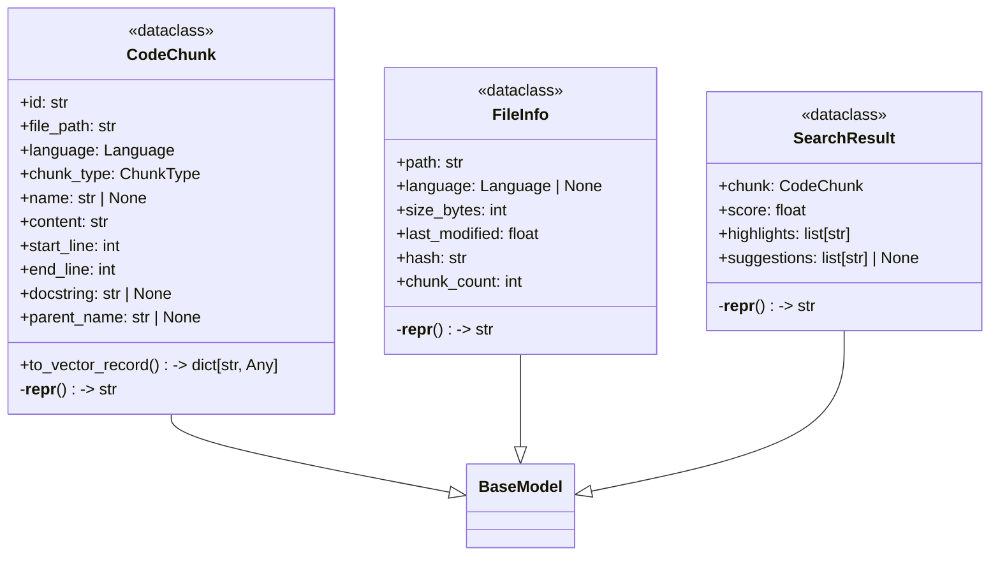
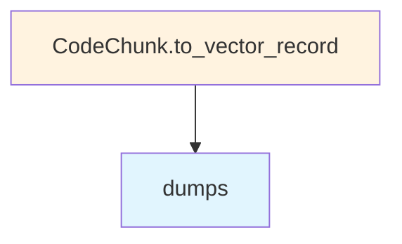

# File: `src/local_deepwiki/models/chunks.py`

## File Overview

This file defines core data models used throughout the local_deepwiki project for representing code chunks, file metadata, and search results. These models are foundational for the code indexing, chunking, and semantic search capabilities of the system.

The models are built using pydantic, which provides automatic validation, serialization, and type hints. This ensures data integrity and makes it easier to work with structured data across different modules of the application.

## Key Concepts

### Data Modeling with pydantic
The use of pydantic `BaseModel` for `CodeChunk`, `FileInfo`, and `SearchResult` enables:
- **Automatic validation** of inputs to ensure data conforms to expected types and constraints.
- **Serialization support**, making it easy to convert models to and from JSON or other formats.
- **Clear documentation** through field descriptions, which aids in understanding the structure and intent of each model.

### Structured Code Representation
The `CodeChunk` model is central to how code is represented within the system. It includes:
- Metadata such as file path, line numbers, and language.
- Semantic elements like `name`, `docstring`, and `parent_name` to support contextual understanding.
- A `metadata` field for extensibility.

This design supports efficient indexing and retrieval of code snippets by capturing both structural and semantic information.

### Search Result Representation
The `SearchResult` model encapsulates the output of semantic searches. It ties a matched `CodeChunk` to a similarity score and optionally includes:
- `highlights`: relevant code snippets.
- `suggestions`: heuristic suggestions for improving search quality.

This abstraction allows downstream components like `interactive_search` and `reranker` to process and display results consistently.

## Integration

This file is a core dependency for several other modules in the project:
- **`CodeChunk`** is used by `chunker`, `files`, `test_chunker`, and 7+ other components, indicating its role in the chunking pipeline.
- **`FileInfo`** is used by `code_parser`, `conftest`, `test_diagrams_misc`, and 6+ other modules, showing its importance in file-level processing and tracking.
- **`SearchResult`** is used by `interactive_search`, `reranker`, `cache`, and 6+ other modules, demonstrating its role in the search and ranking logic.

The models are imported by CLI tools such as `check_cli.py`, `config_validator.py`, `main.py`, and `status_cli.py`, suggesting that they are part of the core data structures used in command-line operations and configuration handling.

These models are also closely related to `src/local_deepwiki/models/foundation.py`, which defines [`ChunkType`](foundation.md) and [`Language`](foundation.md) — both of which are used in this file. This modular design promotes reusability and consistency in type definitions.

## Design Notes

### Extensibility with Metadata
The `CodeChunk` model includes a `metadata` field of type `dict[str, Any]`. This allows for future extensions without modifying the core schema, supporting evolving needs in indexing or analysis.

### Vector Record Conversion
The `to_vector_record` method in `CodeChunk` prepares the model for storage in vector databases (e.g., LanceDB). It serializes the `metadata` to JSON and optionally includes an embedding vector. This design supports efficient storage and retrieval of embeddings alongside code content.

### Handling Optional Fields
Fields like `name`, `docstring`, and `parent_name` in `CodeChunk` are optional (`str | None`). This reflects the reality that not all code elements have these attributes (e.g., a top-level script may not have a `name` or `parent_name`), and allows for robust handling of various code constructs.

### Representation Strings
Each class implements a `__repr__` method for debugging and logging purposes. These representations are concise and informative, helping developers quickly understand the content and context of objects during development and troubleshooting.

### Use of StrEnum for Types
The [`ChunkType`](foundation.md) and [`Language`](foundation.md) types are imported from `foundation.py` and are likely `StrEnum` subclasses. This choice ensures type safety and provides a clear, consistent way to represent discrete categories in the codebase.

## API Reference

### class `CodeChunk`

**Inherits from:** `BaseModel`

A chunk of code extracted from the repository.

**Methods:**


<details>
<summary>View Source (lines 13-64) | <a href="https://github.com/UrbanDiver/local-deepwiki-mcp/blob/main/src/local_deepwiki/models/chunks.py#L13-L64">GitHub</a></summary>

```python
class CodeChunk(BaseModel):
    """A chunk of code extracted from the repository."""

    id: str = Field(description="Unique identifier for this chunk")
    file_path: str = Field(description="Path to the source file")
    language: Language = Field(description="Programming language")
    chunk_type: ChunkType = Field(description="Type of code chunk")
    name: str | None = Field(default=None, description="Name of function/class/etc")
    content: str = Field(description="The actual code content")
    start_line: int = Field(description="Starting line number")
    end_line: int = Field(description="Ending line number")
    docstring: str | None = Field(default=None, description="Associated docstring")
    parent_name: str | None = Field(
        default=None, description="Parent class/module name"
    )
    metadata: dict[str, Any] = Field(
        default_factory=dict, description="Additional metadata"
    )

    def to_vector_record(self, vector: list[float] | None = None) -> dict[str, Any]:
        """Convert chunk to a dict suitable for vector store storage.

        Args:
            vector: Optional embedding vector to include in the record.

        Returns:
            Dict with all fields formatted for LanceDB storage.
        """
        record: dict[str, Any] = {
            "id": self.id,
            "file_path": self.file_path,
            "language": self.language.value,
            "chunk_type": self.chunk_type.value,
            "name": self.name or "",
            "content": self.content,
            "start_line": self.start_line,
            "end_line": self.end_line,
            "docstring": self.docstring or "",
            "parent_name": self.parent_name or "",
            "metadata": json.dumps(self.metadata),
        }
        if vector is not None:
            record["vector"] = vector
        return record

    def __repr__(self) -> str:
        """Return a concise representation for debugging."""
        name_part = f" {self.name}" if self.name else ""
        return (
            f"<CodeChunk {self.chunk_type.value}{name_part} "
            f"at {self.file_path}:{self.start_line}-{self.end_line}>"
        )
```

</details>

#### `to_vector_record`

```python
def to_vector_record(vector: list[float] | None = None) -> dict[str, Any]
```

Convert chunk to a dict suitable for vector store storage.


| Parameter | Type | Default | Description |
|-----------|------|---------|-------------|
| `vector` | `list[float] | None` | `None` | Optional embedding vector to include in the record. |


<details>
<summary>View Source (lines 13-64) | <a href="https://github.com/UrbanDiver/local-deepwiki-mcp/blob/main/src/local_deepwiki/models/chunks.py#L13-L64">GitHub</a></summary>

```python
class CodeChunk(BaseModel):
    """A chunk of code extracted from the repository."""

    id: str = Field(description="Unique identifier for this chunk")
    file_path: str = Field(description="Path to the source file")
    language: Language = Field(description="Programming language")
    chunk_type: ChunkType = Field(description="Type of code chunk")
    name: str | None = Field(default=None, description="Name of function/class/etc")
    content: str = Field(description="The actual code content")
    start_line: int = Field(description="Starting line number")
    end_line: int = Field(description="Ending line number")
    docstring: str | None = Field(default=None, description="Associated docstring")
    parent_name: str | None = Field(
        default=None, description="Parent class/module name"
    )
    metadata: dict[str, Any] = Field(
        default_factory=dict, description="Additional metadata"
    )

    def to_vector_record(self, vector: list[float] | None = None) -> dict[str, Any]:
        """Convert chunk to a dict suitable for vector store storage.

        Args:
            vector: Optional embedding vector to include in the record.

        Returns:
            Dict with all fields formatted for LanceDB storage.
        """
        record: dict[str, Any] = {
            "id": self.id,
            "file_path": self.file_path,
            "language": self.language.value,
            "chunk_type": self.chunk_type.value,
            "name": self.name or "",
            "content": self.content,
            "start_line": self.start_line,
            "end_line": self.end_line,
            "docstring": self.docstring or "",
            "parent_name": self.parent_name or "",
            "metadata": json.dumps(self.metadata),
        }
        if vector is not None:
            record["vector"] = vector
        return record

    def __repr__(self) -> str:
        """Return a concise representation for debugging."""
        name_part = f" {self.name}" if self.name else ""
        return (
            f"<CodeChunk {self.chunk_type.value}{name_part} "
            f"at {self.file_path}:{self.start_line}-{self.end_line}>"
        )
```

</details>

### class `FileInfo`

**Inherits from:** `BaseModel`

Information about a source file.


<details>
<summary>View Source (lines 67-80) | <a href="https://github.com/UrbanDiver/local-deepwiki-mcp/blob/main/src/local_deepwiki/models/chunks.py#L67-L80">GitHub</a></summary>

```python
class FileInfo(BaseModel):
    """Information about a source file."""

    path: str = Field(description="Relative path from repo root")
    language: Language | None = Field(default=None, description="Detected language")
    size_bytes: int = Field(description="File size in bytes")
    last_modified: float = Field(description="Last modification timestamp")
    hash: str = Field(description="Content hash for change detection")
    chunk_count: int = Field(default=0, description="Number of chunks extracted")

    def __repr__(self) -> str:
        """Return a concise representation for debugging."""
        lang = self.language.value if self.language else "unknown"
        return f"<FileInfo {self.path} ({lang}, {self.chunk_count} chunks)>"
```

</details>

### class `SearchResult`

**Inherits from:** `BaseModel`

A search result from semantic search.


<details>
<summary>View Source (lines 83-99) | <a href="https://github.com/UrbanDiver/local-deepwiki-mcp/blob/main/src/local_deepwiki/models/chunks.py#L83-L99">GitHub</a></summary>

```python
class SearchResult(BaseModel):
    """A search result from semantic search."""

    chunk: CodeChunk = Field(description="The matched code chunk")
    score: float = Field(description="Similarity score")
    highlights: list[str] = Field(default_factory=list, description="Relevant snippets")
    suggestions: list[str] | None = Field(
        default=None, description="'Did you mean?' suggestions when results are poor"
    )

    def __repr__(self) -> str:
        """Return a concise representation for debugging."""
        name = self.chunk.name or self.chunk.chunk_type.value
        suggestion_str = (
            f" suggestions={len(self.suggestions)}" if self.suggestions else ""
        )
        return f"<SearchResult {name} score={self.score:.3f}{suggestion_str}>"
```

</details>

## Class Diagram



## Call Graph



## Used By

Functions and methods in this file and their callers:

- **`dumps`**: called by `CodeChunk.to_vector_record`

## Last Modified

| Entity | Type | Author | Date | Commit |
|--------|------|--------|------|--------|
| `CodeChunk` | class | Brian Breidenbach | Feb 11, 2026 | `0c71b8e` refactor: convert models.py... |
| `FileInfo` | class | Brian Breidenbach | Feb 11, 2026 | `0c71b8e` refactor: convert models.py... |
| `SearchResult` | class | Brian Breidenbach | Feb 11, 2026 | `0c71b8e` refactor: convert models.py... |

## Relevant Source Files

- `src/local_deepwiki/models/chunks.py:13-64`
