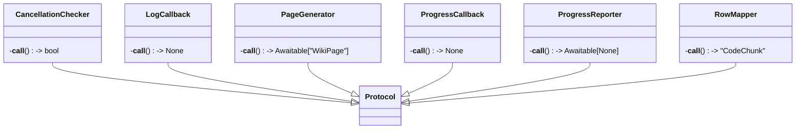

# File: `src/local_deepwiki/models/foundation.py`

## File Overview

This file defines foundational types used throughout the `local_deepwiki` project. It provides core abstractions in the form of protocols and enumerations that are widely used across the codebase for modeling progress reporting, code language support, and chunk types. These types ensure consistent interfaces and data modeling across various components, from CLI tools to research pipelines and code analysis generators.

## Key Concepts

### Protocols for Callbacks and Generators

The file defines several protocols that serve as interfaces for asynchronous and synchronous operations:

- `ProgressCallback`: A protocol for reporting progress during long-running operations. It accepts a message, current step, and total steps.
- `CancellationChecker`: A protocol for checking if an operation should be cancelled.
- `ProgressReporter`: A protocol for reporting detailed research progress using a [`ResearchProgress`](research.md) object. It's asynchronous and returns an `Awaitable[None]`.
- `LogCallback`: A simple protocol for logging human-readable messages.
- `PageGenerator`: A protocol for generating [`WikiPage`](../export/streaming.md) objects asynchronously.
- `RowMapper`: A protocol for mapping raw dictionary rows (from vector stores) into [`CodeChunk`](chunks.md) objects.

These protocols are essential for decoupling components, allowing for flexible and testable implementations across different parts of the system.

### Enumerations for Languages and Code Chunks

- `Language`: An enumeration of supported programming languages. It uses `StrEnum` to ensure that language identifiers are strings and can be used in string contexts, such as file extensions or parser configurations.
- `ChunkType`: An enumeration of types of code chunks that can be analyzed or indexed. These types are used to categorize and structure code for semantic analysis and retrieval.

These enums provide a centralized and type-safe way to define and use language and chunk type identifiers, ensuring consistency and reducing errors.

## Integration

This file is imported and used by multiple modules across the project:

- **`ProgressCallback`** is used by `cli_progress`, which is part of the CLI tooling for reporting progress.
- **`PageGenerator`** is used by `lazy_generator`, which is responsible for generating wiki pages on demand.
- **`Language`** is used by `languages` and `source_formatter`, which are responsible for language-specific processing.
- **`ChunkType`** is used by `fuzzy_search`, `crosslinks`, `test_inheritance`, and potentially more, to categorize and analyze code chunks.

The file's protocols and enums are foundational to the system's architecture, enabling a modular design where components like the research pipeline, CLI, and code analyzers can operate independently while still adhering to shared interfaces.

## Design Notes

### Use of Protocols and `StrEnum`

The use of `Protocol` classes ensures that components can be easily mocked or extended without tight coupling. This is particularly useful in test environments or when integrating with different backend systems.

`StrEnum` is used for `Language` and `ChunkType` to provide both type safety and string interoperability. This is a pragmatic choice that allows for easy serialization and consumption by external systems while maintaining type safety within Python.

### Asynchronous Support

Several protocols in this file, such as `ProgressReporter` and `PageGenerator`, are designed with asynchronous support in mind. This reflects the need for non-blocking operations in a system that may be processing large codebases or interacting with remote services.

### Lightweight Progress Reporting

The `LogCallback` protocol offers a lightweight way to report progress or status messages. This is useful for logging or UI updates where detailed progress tracking is not necessary, and a simple string message suffices.

By centralizing these types, the system avoids code duplication and ensures that all components that require progress reporting or language-specific handling adhere to a consistent interface.

## API Reference

### class `ProgressCallback`

**Inherits from:** `Protocol`

Protocol for progress callback functions.  Progress callbacks are used to report progress during long-running operations like indexing and wiki generation.

**Methods:**


<details>
<summary>View Source (lines 16-31) | <a href="https://github.com/UrbanDiver/local-deepwiki-mcp/blob/main/src/local_deepwiki/models/foundation.py#L16-L31">GitHub</a></summary>

```python
class ProgressCallback(Protocol):
    """Protocol for progress callback functions.

    Progress callbacks are used to report progress during long-running
    operations like indexing and wiki generation.
    """

    def __call__(self, msg: str, current: int, total: int, /) -> None:
        """Report progress.

        Args:
            msg: Description of current operation.
            current: Current step number.
            total: Total number of steps.
        """
        ...
```

</details>

#### `__call__`

```python
def __call__(msg: str, current: int, total: int) -> None
```

Report progress.


| Parameter | Type | Default | Description |
|-----------|------|---------|-------------|
| `msg` | `str` | - | Description of current operation. |
| `current` | `int` | - | Current step number. |
| `total` | `int` | - | Total number of steps. |


<details>
<summary>View Source (lines 16-31) | <a href="https://github.com/UrbanDiver/local-deepwiki-mcp/blob/main/src/local_deepwiki/models/foundation.py#L16-L31">GitHub</a></summary>

```python
class ProgressCallback(Protocol):
    """Protocol for progress callback functions.

    Progress callbacks are used to report progress during long-running
    operations like indexing and wiki generation.
    """

    def __call__(self, msg: str, current: int, total: int, /) -> None:
        """Report progress.

        Args:
            msg: Description of current operation.
            current: Current step number.
            total: Total number of steps.
        """
        ...
```

</details>

### class `CancellationChecker`

**Inherits from:** `Protocol`

Check whether an operation has been cancelled.  Returns True if the operation should stop.

**Methods:**


<details>
<summary>View Source (lines 35-41) | <a href="https://github.com/UrbanDiver/local-deepwiki-mcp/blob/main/src/local_deepwiki/models/foundation.py#L35-L41">GitHub</a></summary>

```python
class CancellationChecker(Protocol):
    """Check whether an operation has been cancelled.

    Returns True if the operation should stop.
    """

    def __call__(self) -> bool: ...
```

</details>

#### `__call__`

```python
def __call__() -> bool
```


<details>
<summary>View Source (lines 35-41) | <a href="https://github.com/UrbanDiver/local-deepwiki-mcp/blob/main/src/local_deepwiki/models/foundation.py#L35-L41">GitHub</a></summary>

```python
class CancellationChecker(Protocol):
    """Check whether an operation has been cancelled.

    Returns True if the operation should stop.
    """

    def __call__(self) -> bool: ...
```

</details>

### class `ProgressReporter`

**Inherits from:** `Protocol`

Report progress for a research operation.  Called with a `[`ResearchProgress`](research.md)` instance during long-running research pipelines.

**Methods:**


<details>
<summary>View Source (lines 45-52) | <a href="https://github.com/UrbanDiver/local-deepwiki-mcp/blob/main/src/local_deepwiki/models/foundation.py#L45-L52">GitHub</a></summary>

```python
class ProgressReporter(Protocol):
    """Report progress for a research operation.

    Called with a ``ResearchProgress`` instance during long-running
    research pipelines.
    """

    def __call__(self, progress: "ResearchProgress", /) -> Awaitable[None]: ...
```

</details>

#### `__call__`

```python
def __call__(progress: "ResearchProgress") -> Awaitable[None]
```


| Parameter | Type | Default | Description |
|-----------|------|---------|-------------|
| `progress` | `"ResearchProgress"` | - | - |


<details>
<summary>View Source (lines 45-52) | <a href="https://github.com/UrbanDiver/local-deepwiki-mcp/blob/main/src/local_deepwiki/models/foundation.py#L45-L52">GitHub</a></summary>

```python
class ProgressReporter(Protocol):
    """Report progress for a research operation.

    Called with a ``ResearchProgress`` instance during long-running
    research pipelines.
    """

    def __call__(self, progress: "ResearchProgress", /) -> Awaitable[None]: ...
```

</details>

### class `LogCallback`

**Inherits from:** `Protocol`

Log a message string.  Used for lightweight progress or status callbacks that accept a single human-readable message.

**Methods:**


<details>
<summary>View Source (lines 56-63) | <a href="https://github.com/UrbanDiver/local-deepwiki-mcp/blob/main/src/local_deepwiki/models/foundation.py#L56-L63">GitHub</a></summary>

```python
class LogCallback(Protocol):
    """Log a message string.

    Used for lightweight progress or status callbacks that accept a
    single human-readable message.
    """

    def __call__(self, message: str, /) -> None: ...
```

</details>

#### `__call__`

```python
def __call__(message: str) -> None
```


| Parameter | Type | Default | Description |
|-----------|------|---------|-------------|
| `message` | `str` | - | - |


<details>
<summary>View Source (lines 56-63) | <a href="https://github.com/UrbanDiver/local-deepwiki-mcp/blob/main/src/local_deepwiki/models/foundation.py#L56-L63">GitHub</a></summary>

```python
class LogCallback(Protocol):
    """Log a message string.

    Used for lightweight progress or status callbacks that accept a
    single human-readable message.
    """

    def __call__(self, message: str, /) -> None: ...
```

</details>

### class `PageGenerator`

**Inherits from:** `Protocol`

Generate a wiki page on demand.  Returns a coroutine that produces a `[`WikiPage`](../export/streaming.md)`.

**Methods:**


<details>
<summary>View Source (lines 67-73) | <a href="https://github.com/UrbanDiver/local-deepwiki-mcp/blob/main/src/local_deepwiki/models/foundation.py#L67-L73">GitHub</a></summary>

```python
class PageGenerator(Protocol):
    """Generate a wiki page on demand.

    Returns a coroutine that produces a ``WikiPage``.
    """

    def __call__(self) -> Awaitable["WikiPage"]: ...
```

</details>

#### `__call__`

```python
def __call__() -> Awaitable["WikiPage"]
```


<details>
<summary>View Source (lines 67-73) | <a href="https://github.com/UrbanDiver/local-deepwiki-mcp/blob/main/src/local_deepwiki/models/foundation.py#L67-L73">GitHub</a></summary>

```python
class PageGenerator(Protocol):
    """Generate a wiki page on demand.

    Returns a coroutine that produces a ``WikiPage``.
    """

    def __call__(self) -> Awaitable["WikiPage"]: ...
```

</details>

### class `RowMapper`

**Inherits from:** `Protocol`

Map a dictionary row to a `[`CodeChunk`](chunks.md)`.  Used by vector store iterators to convert raw LanceDB rows into typed `[`CodeChunk`](chunks.md)` objects.

**Methods:**


<details>
<summary>View Source (lines 77-84) | <a href="https://github.com/UrbanDiver/local-deepwiki-mcp/blob/main/src/local_deepwiki/models/foundation.py#L77-L84">GitHub</a></summary>

```python
class RowMapper(Protocol):
    """Map a dictionary row to a ``CodeChunk``.

    Used by vector store iterators to convert raw LanceDB rows into
    typed ``CodeChunk`` objects.
    """

    def __call__(self, row: dict, /) -> "CodeChunk": ...
```

</details>

#### `__call__`

```python
def __call__(row: dict) -> "CodeChunk"
```


| Parameter | Type | Default | Description |
|-----------|------|---------|-------------|
| `row` | `dict` | - | - |


<details>
<summary>View Source (lines 77-84) | <a href="https://github.com/UrbanDiver/local-deepwiki-mcp/blob/main/src/local_deepwiki/models/foundation.py#L77-L84">GitHub</a></summary>

```python
class RowMapper(Protocol):
    """Map a dictionary row to a ``CodeChunk``.

    Used by vector store iterators to convert raw LanceDB rows into
    typed ``CodeChunk`` objects.
    """

    def __call__(self, row: dict, /) -> "CodeChunk": ...
```

</details>

### class `Language`

**Inherits from:** `StrEnum`

Supported programming languages.


<details>
<summary>View Source (lines 87-103) | <a href="https://github.com/UrbanDiver/local-deepwiki-mcp/blob/main/src/local_deepwiki/models/foundation.py#L87-L103">GitHub</a></summary>

```python
class Language(StrEnum):
    """Supported programming languages."""

    PYTHON = "python"
    JAVASCRIPT = "javascript"
    TYPESCRIPT = "typescript"
    TSX = "tsx"
    GO = "go"
    RUST = "rust"
    JAVA = "java"
    C = "c"
    CPP = "cpp"
    SWIFT = "swift"
    RUBY = "ruby"
    PHP = "php"
    KOTLIN = "kotlin"
    CSHARP = "csharp"
```

</details>

### class `ChunkType`

**Inherits from:** `StrEnum`

Types of code chunks.


<details>
<summary>View Source (lines 106-117) | <a href="https://github.com/UrbanDiver/local-deepwiki-mcp/blob/main/src/local_deepwiki/models/foundation.py#L106-L117">GitHub</a></summary>

```python
class ChunkType(StrEnum):
    """Types of code chunks."""

    FUNCTION = "function"
    CLASS = "class"
    METHOD = "method"
    MODULE = "module"
    IMPORT = "import"
    COMMENT = "comment"
    OTHER = "other"
    FILE_SUMMARY = "file_summary"
    MODULE_SUMMARY = "module_summary"
```

</details>

## Class Diagram



## Last Modified

| Entity | Type | Author | Date | Commit |
|--------|------|--------|------|--------|
| `ChunkType` | class | Brian Breidenbach | 2 weeks ago | `9cf0e15` feat: add FILE_SUMMARY and ... |
| `ProgressCallback` | class | Brian Breidenbach | Feb 21, 2026 | `e45a53a` refactor: apply Pythonic id... |
| `CancellationChecker` | class | Brian Breidenbach | Feb 21, 2026 | `e45a53a` refactor: apply Pythonic id... |
| `ProgressReporter` | class | Brian Breidenbach | Feb 21, 2026 | `e45a53a` refactor: apply Pythonic id... |
| `LogCallback` | class | Brian Breidenbach | Feb 21, 2026 | `e45a53a` refactor: apply Pythonic id... |
| `PageGenerator` | class | Brian Breidenbach | Feb 21, 2026 | `e45a53a` refactor: apply Pythonic id... |
| `RowMapper` | class | Brian Breidenbach | Feb 21, 2026 | `e45a53a` refactor: apply Pythonic id... |
| `Language` | class | Brian Breidenbach | Feb 20, 2026 | `b807417` refactor: high-priority Pyt... |

## Relevant Source Files

- `src/local_deepwiki/models/foundation.py:16-31`
