# File: `src/local_deepwiki/models/research.py`

## File Overview

This file defines pydantic models for representing the state, progress, and results of deep research operations within the Local DeepWiki system. These models support the core functionality of decomposing questions, retrieving and analyzing source code, synthesizing findings, and managing checkpoints for resumable research sessions.

The models are designed to provide structured data exchange between components of the research pipeline, including progress notifications, result summaries, and checkpoint management. They also support integration with external tools like the MCP (Model Context Protocol) for real-time feedback during long-running operations.

## Key Concepts

### Research Process Abstraction
The deep research process is modeled as a sequence of distinct steps: decomposition, retrieval, gap analysis, and synthesis. This abstraction allows for granular control, progress tracking, and checkpointing at each stage. The `ResearchStepType` enum defines these stages, and `ResearchProgressType` provides more detailed progress states.

### Checkpointing for Resumability
The `ResearchCheckpoint` model enables resumable research by capturing the entire state of an ongoing research session. It includes metadata such as timestamps, current step, sub-questions, retrieved contexts, and partial synthesis results. This allows the system to save progress after each step and resume from that point if interrupted, improving robustness in long-running operations.

### Progress Tracking
Progress updates are represented using `IndexingProgress` and `ResearchProgress` models. These models are sent via MCP notifications and provide real-time feedback during indexing and research operations. They include step counts, human-readable messages, and metrics like file counts or chunk creation numbers.

### Structured Output
The `DeepResearchResult` model aggregates all outputs of a research session into a structured format, including the original question, answer, sub-questions, source references, reasoning trace, and statistics like total chunks analyzed and LLM calls. This ensures consistent output for downstream consumers like UIs or reporting tools.

## Integration

This file is a core part of the Local DeepWiki system's research infrastructure and integrates with:

- **Pipeline Components**: `DeepResearchResult`, `ResearchProgress`, and `ResearchCheckpoint` are used by the main research pipeline to manage execution flow and state.
- **Checkpoints and Resume Logic**: `ResearchCheckpoint`, `ListResearchCheckpointsArgs`, `ResumeResearchArgs`, and `CancelResearchArgs` are used by checkpoint management logic and tools.
- **Watcher and MCP Notifications**: `IndexingProgress` and `ResearchProgress` are sent via MCP progress notifications to provide real-time updates.
- **Configuration and Prompt Management**: The models are referenced by configuration files (`src/local_deepwiki/config/models_llm.py`, `src/local_deepwiki/config/prompts.py`) to define expected inputs and outputs for LLM interactions.
- **Access Control and Tests**: Used by `test_access_control.py`, `test_deep_research_pipeline`, and `test_deep_research_checkpoints` for validation and testing of research workflows.

The models are built using pydantic, which enables automatic validation, serialization, and documentation generation. The `StrEnum` usage ensures type safety for string-based enumerations, especially in contexts where the values are used in external protocols or JSON serialization.

## Design Notes

### Enum Usage
The use of `StrEnum` for types like `ResearchStepType`, `IndexingProgressType`, and `ResearchProgressType` provides both type safety and string representation for easier logging and external communication. This design choice simplifies integration with systems that expect string identifiers.

### Progress Updates
The `IndexingProgress` and `ResearchProgress` models include optional fields like `files_processed`, `chunks_created`, and `duration_ms` to provide granular feedback. This allows for rich progress reporting without requiring all fields to be populated at every update.

### Checkpoint Granularity
Checkpoints are designed to capture the state after each major step, including retrieved contexts and follow-up queries. This ensures that if a research session is interrupted, it can resume with sufficient context to continue effectively, rather than restarting from scratch.

### Optional Fields and Defaults
Many fields in `ResearchCheckpoint` and related models are optional or have defaults (e.g., `default_factory=list`). This allows the models to be flexible when used in partial or transitional states, such as during checkpoint creation or when fields are not yet populated.

### Extensibility
The schema version field in `ResearchCheckpoint` allows for future schema evolution without breaking backward compatibility. This is crucial for long-running systems that may need to update their internal state representations over time.

### Data Integrity
All models are validated using pydantic, ensuring that data passed between components conforms to expected structures. This helps prevent runtime errors due to malformed or missing data, especially in distributed or asynchronous systems.

## API Reference

### class `ResearchStepType`

**Inherits from:** `StrEnum`

Types of steps in the deep research process.


<details>
<summary>View Source (lines 10-16) | <a href="https://github.com/UrbanDiver/local-deepwiki-mcp/blob/main/src/local_deepwiki/models/research.py#L10-L16">GitHub</a></summary>

```python
class ResearchStepType(StrEnum):
    """Types of steps in the deep research process."""

    DECOMPOSITION = "decomposition"
    RETRIEVAL = "retrieval"
    GAP_ANALYSIS = "gap_analysis"
    SYNTHESIS = "synthesis"
```

</details>

### class `ResearchStep`

**Inherits from:** `BaseModel`

A single step in the deep research process.


<details>
<summary>View Source (lines 19-28) | <a href="https://github.com/UrbanDiver/local-deepwiki-mcp/blob/main/src/local_deepwiki/models/research.py#L19-L28">GitHub</a></summary>

```python
class ResearchStep(BaseModel):
    """A single step in the deep research process."""

    step_type: ResearchStepType = Field(description="Type of research step")
    description: str = Field(description="Description of what was done")
    duration_ms: int = Field(description="Duration of this step in milliseconds")

    def __repr__(self) -> str:
        """Return a concise representation for debugging."""
        return f"<ResearchStep {self.step_type.value} ({self.duration_ms}ms)>"
```

</details>

### class `SubQuestion`

**Inherits from:** `BaseModel`

A decomposed sub-question for deep research.


<details>
<summary>View Source (lines 31-41) | <a href="https://github.com/UrbanDiver/local-deepwiki-mcp/blob/main/src/local_deepwiki/models/research.py#L31-L41">GitHub</a></summary>

```python
class SubQuestion(BaseModel):
    """A decomposed sub-question for deep research."""

    question: str = Field(description="The sub-question to investigate")
    category: str = Field(
        description="Category: structure, flow, dependencies, impact, or comparison"
    )

    def __repr__(self) -> str:
        """Return a concise representation for debugging."""
        return f"<SubQuestion [{self.category}] {self.question[:50]}...>"
```

</details>

### class `SourceReference`

**Inherits from:** `BaseModel`

A reference to a source code location.


<details>
<summary>View Source (lines 44-57) | <a href="https://github.com/UrbanDiver/local-deepwiki-mcp/blob/main/src/local_deepwiki/models/research.py#L44-L57">GitHub</a></summary>

```python
class SourceReference(BaseModel):
    """A reference to a source code location."""

    file_path: str = Field(description="Path to the source file")
    start_line: int = Field(description="Starting line number")
    end_line: int = Field(description="Ending line number")
    chunk_type: str = Field(description="Type of code chunk")
    name: str | None = Field(default=None, description="Name of the code element")
    relevance_score: float = Field(description="Relevance score from search")

    def __repr__(self) -> str:
        """Return a concise representation for debugging."""
        name = self.name or self.chunk_type
        return f"<Source {self.file_path}:{self.start_line}-{self.end_line} ({name})>"
```

</details>

### class `DeepResearchResult`

**Inherits from:** `BaseModel`

Result from deep research analysis.


<details>
<summary>View Source (lines 60-82) | <a href="https://github.com/UrbanDiver/local-deepwiki-mcp/blob/main/src/local_deepwiki/models/research.py#L60-L82">GitHub</a></summary>

```python
class DeepResearchResult(BaseModel):
    """Result from deep research analysis."""

    question: str = Field(description="Original question asked")
    answer: str = Field(description="Comprehensive answer with citations")
    sub_questions: list[SubQuestion] = Field(
        default_factory=list, description="Decomposed sub-questions investigated"
    )
    sources: list[SourceReference] = Field(
        default_factory=list, description="Source code references used"
    )
    reasoning_trace: list[ResearchStep] = Field(
        default_factory=list, description="Steps taken during research"
    )
    total_chunks_analyzed: int = Field(description="Total code chunks analyzed")
    total_llm_calls: int = Field(description="Total LLM calls made")

    def __repr__(self) -> str:
        """Return a concise representation for debugging."""
        return (
            f"<DeepResearchResult {len(self.sub_questions)} sub-questions, "
            f"{len(self.sources)} sources, {self.total_llm_calls} LLM calls>"
        )
```

</details>

### class `IndexingProgressType`

**Inherits from:** `StrEnum`

Types of indexing progress events.


<details>
<summary>View Source (lines 85-95) | <a href="https://github.com/UrbanDiver/local-deepwiki-mcp/blob/main/src/local_deepwiki/models/research.py#L85-L95">GitHub</a></summary>

```python
class IndexingProgressType(StrEnum):
    """Types of indexing progress events."""

    STARTED = "started"
    SCANNING_FILES = "scanning_files"
    PARSING_FILES = "parsing_files"
    GENERATING_EMBEDDINGS = "generating_embeddings"
    STORING_VECTORS = "storing_vectors"
    GENERATING_WIKI = "generating_wiki"
    GENERATING_PAGES = "generating_pages"
    COMPLETE = "complete"
```

</details>

### class `IndexingProgress`

**Inherits from:** `BaseModel`

Progress update from repository indexing.  Sent via MCP progress notifications to provide real-time feedback during long-running indexing operations.


<details>
<summary>View Source (lines 98-121) | <a href="https://github.com/UrbanDiver/local-deepwiki-mcp/blob/main/src/local_deepwiki/models/research.py#L98-L121">GitHub</a></summary>

```python
class IndexingProgress(BaseModel):
    """Progress update from repository indexing.

    Sent via MCP progress notifications to provide real-time feedback
    during long-running indexing operations.
    """

    step: int = Field(description="Current step number")
    total_steps: int = Field(description="Total number of steps")
    step_type: IndexingProgressType = Field(description="Type of progress event")
    message: str = Field(description="Human-readable progress message")
    files_processed: int | None = Field(
        default=None, description="Number of files processed"
    )
    total_files: int | None = Field(default=None, description="Total files to process")
    chunks_created: int | None = Field(
        default=None, description="Number of chunks created"
    )
    pages_generated: int | None = Field(
        default=None, description="Wiki pages generated"
    )
    duration_ms: int | None = Field(
        default=None, description="Duration of step in milliseconds"
    )
```

</details>

### class `ResearchProgressType`

**Inherits from:** `StrEnum`

Types of deep research progress events.


<details>
<summary>View Source (lines 124-134) | <a href="https://github.com/UrbanDiver/local-deepwiki-mcp/blob/main/src/local_deepwiki/models/research.py#L124-L134">GitHub</a></summary>

```python
class ResearchProgressType(StrEnum):
    """Types of deep research progress events."""

    STARTED = "started"
    DECOMPOSITION_COMPLETE = "decomposition_complete"
    RETRIEVAL_COMPLETE = "retrieval_complete"
    GAP_ANALYSIS_COMPLETE = "gap_analysis_complete"
    FOLLOWUP_COMPLETE = "followup_complete"
    SYNTHESIS_STARTED = "synthesis_started"
    COMPLETE = "complete"
    CANCELLED = "cancelled"
```

</details>

### class `ResearchProgress`

**Inherits from:** `BaseModel`

Progress update from deep research pipeline.  Sent via MCP progress notifications to provide real-time feedback during long-running deep research operations.


<details>
<summary>View Source (lines 137-159) | <a href="https://github.com/UrbanDiver/local-deepwiki-mcp/blob/main/src/local_deepwiki/models/research.py#L137-L159">GitHub</a></summary>

```python
class ResearchProgress(BaseModel):
    """Progress update from deep research pipeline.

    Sent via MCP progress notifications to provide real-time feedback
    during long-running deep research operations.
    """

    step: int = Field(description="Current step number (0-5)")
    total_steps: int = Field(default=5, description="Total number of steps")
    step_type: ResearchProgressType = Field(description="Type of progress event")
    message: str = Field(description="Human-readable progress message")
    sub_questions: list[SubQuestion] | None = Field(
        default=None, description="Sub-questions after decomposition"
    )
    chunks_retrieved: int | None = Field(
        default=None, description="Number of chunks retrieved so far"
    )
    follow_up_queries: list[str] | None = Field(
        default=None, description="Follow-up queries from gap analysis"
    )
    duration_ms: int | None = Field(
        default=None, description="Duration of completed step in milliseconds"
    )
```

</details>

### class `ResearchCheckpointStep`

**Inherits from:** `StrEnum`

Current step in a research checkpoint.


<details>
<summary>View Source (lines 167-177) | <a href="https://github.com/UrbanDiver/local-deepwiki-mcp/blob/main/src/local_deepwiki/models/research.py#L167-L177">GitHub</a></summary>

```python
class ResearchCheckpointStep(StrEnum):
    """Current step in a research checkpoint."""

    DECOMPOSITION = "decomposition"
    RETRIEVAL = "retrieval"
    GAP_ANALYSIS = "gap_analysis"
    FOLLOW_UP_RETRIEVAL = "follow_up_retrieval"
    SYNTHESIS = "synthesis"
    COMPLETE = "complete"
    ERROR = "error"
    CANCELLED = "cancelled"
```

</details>

### class `ResearchCheckpoint`

**Inherits from:** `BaseModel`

Checkpoint state for resumable deep research operations.  This model captures the complete state of a research operation, allowing it to be saved after each step and resumed if interrupted.


<details>
<summary>View Source (lines 180-224) | <a href="https://github.com/UrbanDiver/local-deepwiki-mcp/blob/main/src/local_deepwiki/models/research.py#L180-L224">GitHub</a></summary>

```python
class ResearchCheckpoint(BaseModel):
    """Checkpoint state for resumable deep research operations.

    This model captures the complete state of a research operation,
    allowing it to be saved after each step and resumed if interrupted.
    """

    schema_version: int = Field(
        default=1, description="Schema version for checkpoint compatibility"
    )
    research_id: str = Field(description="UUID for this research session")
    question: str = Field(description="Original research question")
    repo_path: str = Field(description="Path to the repository being researched")
    started_at: float = Field(description="Unix timestamp when research started")
    updated_at: float = Field(description="Unix timestamp of last update")
    current_step: ResearchCheckpointStep = Field(
        description="Current step in the research pipeline"
    )
    sub_questions: list[SubQuestion] | None = Field(
        default=None, description="Decomposed sub-questions"
    )
    retrieved_contexts: dict[str, list[dict]] | None = Field(
        default=None, description="Mapping of sub_question to retrieved chunk data"
    )
    follow_up_queries: list[str] | None = Field(
        default=None, description="Follow-up queries from gap analysis"
    )
    follow_up_contexts: list[dict] | None = Field(
        default=None, description="Retrieved contexts from follow-up queries"
    )
    partial_synthesis: str | None = Field(
        default=None, description="Partial synthesis result if available"
    )
    error: str | None = Field(default=None, description="Error message if failed")
    completed_steps: list[str] = Field(
        default_factory=list, description="List of completed step names"
    )

    def __repr__(self) -> str:
        """Return a concise representation for debugging."""
        return (
            f"<ResearchCheckpoint {self.research_id[:8]}... "
            f"step={self.current_step.value} "
            f"completed={len(self.completed_steps)}>"
        )
```

</details>

### class `ListResearchCheckpointsArgs`

**Inherits from:** `BaseModel`

Arguments for the [list_research_checkpoints](../core/deep_research/checkpoints.md) tool.


<details>
<summary>View Source (lines 227-230) | <a href="https://github.com/UrbanDiver/local-deepwiki-mcp/blob/main/src/local_deepwiki/models/research.py#L227-L230">GitHub</a></summary>

```python
class ListResearchCheckpointsArgs(BaseModel):
    """Arguments for the list_research_checkpoints tool."""

    repo_path: str = Field(description="Path to the repository to list checkpoints for")
```

</details>

### class `ResumeResearchArgs`

**Inherits from:** `BaseModel`

Arguments for resuming research with a checkpoint.


<details>
<summary>View Source (lines 233-237) | <a href="https://github.com/UrbanDiver/local-deepwiki-mcp/blob/main/src/local_deepwiki/models/research.py#L233-L237">GitHub</a></summary>

```python
class ResumeResearchArgs(BaseModel):
    """Arguments for resuming research with a checkpoint."""

    repo_path: str = Field(description="Path to the indexed repository")
    research_id: str = Field(description="ID of the research checkpoint to resume")
```

</details>

### class `CancelResearchArgs`

**Inherits from:** `BaseModel`

Arguments for cancelling and checkpointing research.


<details>
<summary>View Source (lines 240-244) | <a href="https://github.com/UrbanDiver/local-deepwiki-mcp/blob/main/src/local_deepwiki/models/research.py#L240-L244">GitHub</a></summary>

```python
class CancelResearchArgs(BaseModel):
    """Arguments for cancelling and checkpointing research."""

    repo_path: str = Field(description="Path to the repository")
    research_id: str = Field(description="ID of the research to cancel")
```

</details>

## Class Diagram

```mermaid
classDiagram
    class CancelResearchArgs {
        <<dataclass>>
        +repo_path: str
        +research_id: str
    }
    class DeepResearchResult {
        <<dataclass>>
        +question: str
        +answer: str
        +sub_questions: list[SubQuestion]
        +sources: list[SourceReference]
        +reasoning_trace: list[ResearchStep]
        +total_chunks_analyzed: int
        +total_llm_calls: int
        -__repr__() -> str
    }
    class IndexingProgress {
        <<dataclass>>
        +step: int
        +total_steps: int
        +step_type: IndexingProgressType
        +message: str
        +files_processed: int | None
        +total_files: int | None
        +chunks_created: int | None
        +pages_generated: int | None
        +duration_ms: int | None
    }
    class ListResearchCheckpointsArgs {
        <<dataclass>>
        +repo_path: str
    }
    class ResearchCheckpoint {
        <<dataclass>>
        +schema_version: int
        +research_id: str
        +question: str
        +repo_path: str
        +started_at: float
        +updated_at: float
        +current_step: ResearchCheckpointStep
        +sub_questions: list[SubQuestion] | None
        +retrieved_contexts: dict[str, list[dict]] | None
        +follow_up_queries: list[str] | None
        -__repr__() -> str
    }
    class ResearchProgress {
        <<dataclass>>
        +step: int
        +total_steps: int
        +step_type: ResearchProgressType
        +message: str
        +sub_questions: list[SubQuestion] | None
        +chunks_retrieved: int | None
        +follow_up_queries: list[str] | None
        +duration_ms: int | None
    }
    class ResearchStep {
        <<dataclass>>
        +step_type: ResearchStepType
        +description: str
        +duration_ms: int
        -__repr__() -> str
    }
    class ResumeResearchArgs {
        <<dataclass>>
        +repo_path: str
        +research_id: str
    }
    class SourceReference {
        <<dataclass>>
        +file_path: str
        +start_line: int
        +end_line: int
        +chunk_type: str
        +name: str | None
        +relevance_score: float
        -__repr__() -> str
    }
    class SubQuestion {
        <<dataclass>>
        +question: str
        +category: str
        -__repr__() -> str
    }
    CancelResearchArgs --|> BaseModel
    DeepResearchResult --|> BaseModel
    IndexingProgress --|> BaseModel
    ListResearchCheckpointsArgs --|> BaseModel
    ResearchCheckpoint --|> BaseModel
    ResearchProgress --|> BaseModel
    ResearchStep --|> BaseModel
    ResumeResearchArgs --|> BaseModel
    SourceReference --|> BaseModel
    SubQuestion --|> BaseModel
```



## Last Modified

| Entity | Type | Author | Date | Commit |
|--------|------|--------|------|--------|
| `ResearchCheckpoint` | class | Brian Breidenbach | 2 weeks ago | `93b6254` feat: add schema version to... |
| `ResearchStepType` | class | Brian Breidenbach | Feb 20, 2026 | `b807417` refactor: high-priority Pyt... |
| `IndexingProgressType` | class | Brian Breidenbach | Feb 20, 2026 | `b807417` refactor: high-priority Pyt... |
| `ResearchProgressType` | class | Brian Breidenbach | Feb 20, 2026 | `b807417` refactor: high-priority Pyt... |
| `ResearchCheckpointStep` | class | Brian Breidenbach | Feb 20, 2026 | `b807417` refactor: high-priority Pyt... |
| `ResearchStep` | class | Brian Breidenbach | Feb 11, 2026 | `0c71b8e` refactor: convert models.py... |
| `SubQuestion` | class | Brian Breidenbach | Feb 11, 2026 | `0c71b8e` refactor: convert models.py... |
| `SourceReference` | class | Brian Breidenbach | Feb 11, 2026 | `0c71b8e` refactor: convert models.py... |
| `DeepResearchResult` | class | Brian Breidenbach | Feb 11, 2026 | `0c71b8e` refactor: convert models.py... |
| `IndexingProgress` | class | Brian Breidenbach | Feb 11, 2026 | `0c71b8e` refactor: convert models.py... |
| `ResearchProgress` | class | Brian Breidenbach | Feb 11, 2026 | `0c71b8e` refactor: convert models.py... |
| `ListResearchCheckpointsArgs` | class | Brian Breidenbach | Feb 11, 2026 | `0c71b8e` refactor: convert models.py... |
| `ResumeResearchArgs` | class | Brian Breidenbach | Feb 11, 2026 | `0c71b8e` refactor: convert models.py... |
| `CancelResearchArgs` | class | Brian Breidenbach | Feb 11, 2026 | `0c71b8e` refactor: convert models.py... |

## Relevant Source Files

- `src/local_deepwiki/models/research.py:10-16`
