# File: src/local_deepwiki/models/tool_args.py

## File Overview

This file defines pydantic BaseModel classes for arguments used by various tools in the DeepWiki system. Each class corresponds to a specific tool and encapsulates the expected input parameters for that tool. The purpose of this file is to provide a standardized, validated, and documented interface for all tool invocations, ensuring consistent argument handling across the system.

The design rationale behind using pydantic models is to leverage its built-in validation, serialization, and documentation generation capabilities. This approach enforces type safety and provides clear, self-documenting interfaces for each tool, improving both developer experience and runtime reliability.

## Key Concepts

### Tool Argument Validation and Documentation

Each tool argument class inherits from `BaseModel` and uses pydantic's `Field` for parameter definition. This pattern centralizes validation logic and automatically generates documentation from the field definitions. It also ensures that all tool invocations adhere to expected data types and constraints.

### Consistent Argument Patterns

Several tools share common argument patterns, such as `repo_path` or `file_path`, which are defined with consistent descriptions and validation rules. This promotes a unified user experience across tools and reduces cognitive load for developers interacting with the system.

### Integration with Provider Types

The file imports and utilizes several enum types from `local_deepwiki.models.provider_types`:
- [`EmbeddingProviderType`](provider_types.md)
- [`LLMProviderType`](provider_types.md)
- [`CodemapFocusType`](provider_types.md)
- [`DiagramType`](provider_types.md)

These types are used to define tool arguments that accept specific provider or mode values, ensuring that tool inputs are constrained to valid options and providing better type safety and documentation.

## Integration

### External Usage

This file is used by the core system and various components:
- Core tools like `ReadWikiStructureArgs`, `ReadWikiPageArgs`, `SearchCodeArgs` are directly used by core functionality
- Generator tools like `GetGlossaryArgs` are used by generators
- Test and analysis tools like `ExplainEntityArgs`, `ImpactAnalysisArgs`, `AnalyzeDiffArgs` are used by test_explain_entity, analysis_entity, and test_analyze_diff respectively
- Codemap tools like `GenerateCodemapArgs`, `SuggestCodemapTopicsArgs` are used by test_codemap
- Agentic tools like `SuggestNextActionsArgs` are used by agentic components

### Related Files

This file integrates with several other modules in the project:
- `src/local_deepwiki/cli/init_cli.py` - likely uses these models to define CLI argument parsers
- `src/local_deepwiki/config/models_embedding.py` and `src/local_deepwiki/config/models_llm.py` - provide configuration models that may be referenced by these argument models
- `src/local_deepwiki/config/processing_models.py` - may contain shared processing logic used by these tools
- `src/local_deepwiki/config/prompts.py` - may provide prompt templates that these tools use

## Design Notes

### Validation and Constraints

The design includes various constraints on fields to ensure data integrity:
- `min_length`, `max_length` constraints on string fields
- `ge` (greater than or equal) and `le` (less than or equal) for numeric fields
- `default` values for optional parameters
- `description` fields that serve as documentation for each argument

### Consistent Field Definitions

Fields like `repo_path` and `wiki_path` consistently use descriptive field descriptions and maximum length constraints (e.g., `max_length=4096` for repository paths), which helps with both validation and error messaging.

### Tool-Specific Patterns

Different tools follow distinct argument patterns based on their functionality:
- Repository-level tools (e.g., `IndexRepositoryArgs`, `AskQuestionArgs`) typically require `repo_path`
- Wiki-specific tools (e.g., `ReadWikiStructureArgs`, `ExportWikiHtmlArgs`) require `wiki_path`
- Code analysis tools (e.g., `GetInheritanceArgs`, `GetCallGraphArgs`) often include filtering and pagination options
- Diff-related tools (e.g., `AnalyzeDiffArgs`, `AskAboutDiffArgs`) include git reference parameters (`base_ref`, `head_ref`)

### Enum Usage for Mode Selection

The use of enum types like [`CodemapFocusType`](provider_types.md) and [`DiagramType`](provider_types.md) ensures that tools receive only valid mode or type arguments, preventing runtime errors from invalid mode selections and providing better autocomplete and documentation support.

## API Reference

### class `IndexRepositoryArgs`

**Inherits from:** `BaseModel`

Arguments for the index_repository tool.


<details>
<summary>View Source (lines 15-49) | <a href="https://github.com/UrbanDiver/local-deepwiki-mcp/blob/main/src/local_deepwiki/models/tool_args.py#L15-L49">GitHub</a></summary>

```python
class IndexRepositoryArgs(BaseModel):
    """Arguments for the index_repository tool."""

    repo_path: str = Field(description="Absolute path to the repository to index")
    output_dir: str | None = Field(
        default=None,
        description="Output directory for wiki (default: {repo}/.deepwiki)",
    )
    languages: list[str] | None = Field(
        default=None, description="Languages to include (default: all supported)"
    )
    full_rebuild: bool = Field(
        default=False, description="Force full rebuild instead of incremental update"
    )
    llm_provider: LLMProviderType | None = Field(
        default=None, description="LLM provider for wiki generation"
    )
    embedding_provider: EmbeddingProviderType | None = Field(
        default=None, description="Embedding provider for semantic search"
    )
    use_cloud_for_github: bool | None = Field(
        default=None, description="Use cloud LLM for GitHub repos"
    )
    skip_wiki: bool = Field(
        default=False,
        description="Skip wiki page generation (index and embed only). Pages generate on demand.",
    )
    generation_mode: str | None = Field(
        default=None,
        description="Override wiki generation strategy: 'eager', 'lazy', or 'hybrid'.",
    )
    prefetch_drain: bool | None = Field(
        default=None,
        description="Enable drain mode to backfill all remaining pages in the background after indexing.",
    )
```

</details>

### class `AskQuestionArgs`

**Inherits from:** `BaseModel`

Arguments for the ask_question tool.


<details>
<summary>View Source (lines 52-67) | <a href="https://github.com/UrbanDiver/local-deepwiki-mcp/blob/main/src/local_deepwiki/models/tool_args.py#L52-L67">GitHub</a></summary>

```python
class AskQuestionArgs(BaseModel):
    """Arguments for the ask_question tool."""

    repo_path: str = Field(description="Path to the indexed repository")
    question: str = Field(min_length=1, description="Question about the codebase")
    max_context: int = Field(
        default=10, ge=1, le=50, description="Maximum code chunks for context (1-50)"
    )
    agentic_rag: bool = Field(
        default=False,
        description="Enable agentic RAG: grade relevance + auto-rewrite query if needed (default: false)",
    )
    debug: bool = Field(
        default=False,
        description="Include RAG pipeline trace in response for debugging (default: false)",
    )
```

</details>

### class `DeepResearchArgs`

**Inherits from:** `BaseModel`

Arguments for the deep_research tool.


<details>
<summary>View Source (lines 70-86) | <a href="https://github.com/UrbanDiver/local-deepwiki-mcp/blob/main/src/local_deepwiki/models/tool_args.py#L70-L86">GitHub</a></summary>

```python
class DeepResearchArgs(BaseModel):
    """Arguments for the deep_research tool."""

    repo_path: str = Field(description="Path to the indexed repository")
    question: str = Field(
        min_length=1, description="Complex question requiring deep analysis"
    )
    max_chunks: int = Field(
        default=30, ge=10, le=50, description="Maximum code chunks to analyze (10-50)"
    )
    preset: str | None = Field(
        default=None, description="Research preset: 'fast', 'deep', or 'comprehensive'"
    )
    resume_research_id: str | None = Field(
        default=None,
        description="Optional checkpoint ID to resume an interrupted research session",
    )
```

</details>

### class `ReadWikiStructureArgs`

**Inherits from:** `BaseModel`

Arguments for the read_wiki_structure tool.


<details>
<summary>View Source (lines 89-92) | <a href="https://github.com/UrbanDiver/local-deepwiki-mcp/blob/main/src/local_deepwiki/models/tool_args.py#L89-L92">GitHub</a></summary>

```python
class ReadWikiStructureArgs(BaseModel):
    """Arguments for the read_wiki_structure tool."""

    wiki_path: str = Field(description="Path to the wiki directory")
```

</details>

### class `ReadWikiPageArgs`

**Inherits from:** `BaseModel`

Arguments for the read_wiki_page tool.


<details>
<summary>View Source (lines 95-101) | <a href="https://github.com/UrbanDiver/local-deepwiki-mcp/blob/main/src/local_deepwiki/models/tool_args.py#L95-L101">GitHub</a></summary>

```python
class ReadWikiPageArgs(BaseModel):
    """Arguments for the read_wiki_page tool."""

    wiki_path: str = Field(description="Path to the wiki directory")
    page: str = Field(
        min_length=1, description="Relative path to the page within the wiki"
    )
```

</details>

### class `SearchCodeArgs`

**Inherits from:** `BaseModel`

Arguments for the search_code tool.


<details>
<summary>View Source (lines 104-118) | <a href="https://github.com/UrbanDiver/local-deepwiki-mcp/blob/main/src/local_deepwiki/models/tool_args.py#L104-L118">GitHub</a></summary>

```python
class SearchCodeArgs(BaseModel):
    """Arguments for the search_code tool."""

    repo_path: str = Field(description="Path to the indexed repository")
    query: str = Field(min_length=1, description="Search query")
    limit: int = Field(default=10, ge=1, le=100, description="Maximum results (1-100)")
    language: str | None = Field(default=None, description="Filter by language")
    type: str | None = Field(
        default=None, description="Filter by chunk type (function, class, method, etc.)"
    )
    path: str | None = Field(default=None, description="Filter by file path pattern")
    fuzzy: bool = Field(default=False, description="Enable fuzzy text matching")
    fuzzy_weight: float = Field(
        default=0.3, ge=0.0, le=1.0, description="Weight for fuzzy vs vector (0.0-1.0)"
    )
```

</details>

### class `ExportWikiHtmlArgs`

**Inherits from:** `BaseModel`

Arguments for the export_wiki_html tool.


<details>
<summary>View Source (lines 121-127) | <a href="https://github.com/UrbanDiver/local-deepwiki-mcp/blob/main/src/local_deepwiki/models/tool_args.py#L121-L127">GitHub</a></summary>

```python
class ExportWikiHtmlArgs(BaseModel):
    """Arguments for the export_wiki_html tool."""

    wiki_path: str = Field(description="Path to the wiki directory to export")
    output_path: str | None = Field(
        default=None, description="Output directory for HTML files"
    )
```

</details>

### class `ExportWikiPdfArgs`

**Inherits from:** `BaseModel`

Arguments for the export_wiki_pdf tool.


<details>
<summary>View Source (lines 130-137) | <a href="https://github.com/UrbanDiver/local-deepwiki-mcp/blob/main/src/local_deepwiki/models/tool_args.py#L130-L137">GitHub</a></summary>

```python
class ExportWikiPdfArgs(BaseModel):
    """Arguments for the export_wiki_pdf tool."""

    wiki_path: str = Field(description="Path to the wiki directory to export")
    output_path: str | None = Field(default=None, description="Output path for PDF")
    single_file: bool = Field(
        default=True, description="Combine all pages into single PDF"
    )
```

</details>

### class `GetGlossaryArgs`

**Inherits from:** `BaseModel`

Arguments for the get_glossary tool.


<details>
<summary>View Source (lines 140-161) | <a href="https://github.com/UrbanDiver/local-deepwiki-mcp/blob/main/src/local_deepwiki/models/tool_args.py#L140-L161">GitHub</a></summary>

```python
class GetGlossaryArgs(BaseModel):
    """Arguments for the get_glossary tool."""

    repo_path: str = Field(description="Path to the indexed repository")
    search: str | None = Field(
        default=None, description="Optional search term to filter entities"
    )
    file_path: str | None = Field(
        default=None,
        description="Filter to entities from a specific file (relative path)",
    )
    limit: int = Field(
        default=100,
        ge=1,
        le=5000,
        description="Maximum entities to return (1-5000, default 100)",
    )
    offset: int = Field(
        default=0,
        ge=0,
        description="Number of entities to skip for pagination (default 0)",
    )
```

</details>

### class `GetDiagramsArgs`

**Inherits from:** `BaseModel`

Arguments for the get_diagrams tool.


<details>
<summary>View Source (lines 164-174) | <a href="https://github.com/UrbanDiver/local-deepwiki-mcp/blob/main/src/local_deepwiki/models/tool_args.py#L164-L174">GitHub</a></summary>

```python
class GetDiagramsArgs(BaseModel):
    """Arguments for the get_diagrams tool."""

    repo_path: str = Field(description="Path to the indexed repository")
    diagram_type: DiagramType = Field(
        default=DiagramType.CLASS, description="Type of diagram to generate"
    )
    entry_point: str | None = Field(
        default=None,
        description="Entry point function for sequence diagrams",
    )
```

</details>

### class `GetInheritanceArgs`

**Inherits from:** `BaseModel`

Arguments for the get_inheritance tool.


<details>
<summary>View Source (lines 177-195) | <a href="https://github.com/UrbanDiver/local-deepwiki-mcp/blob/main/src/local_deepwiki/models/tool_args.py#L177-L195">GitHub</a></summary>

```python
class GetInheritanceArgs(BaseModel):
    """Arguments for the get_inheritance tool."""

    repo_path: str = Field(description="Path to the indexed repository")
    search: str | None = Field(
        default=None,
        description="Filter classes by name (case-insensitive substring)",
    )
    limit: int = Field(
        default=100,
        ge=1,
        le=5000,
        description="Maximum classes to return (1-5000, default 100)",
    )
    offset: int = Field(
        default=0,
        ge=0,
        description="Number of classes to skip for pagination (default 0)",
    )
```

</details>

### class `GetCallGraphArgs`

**Inherits from:** `BaseModel`

Arguments for the get_call_graph tool.


<details>
<summary>View Source (lines 198-205) | <a href="https://github.com/UrbanDiver/local-deepwiki-mcp/blob/main/src/local_deepwiki/models/tool_args.py#L198-L205">GitHub</a></summary>

```python
class GetCallGraphArgs(BaseModel):
    """Arguments for the get_call_graph tool."""

    repo_path: str = Field(description="Path to the indexed repository")
    file_path: str | None = Field(
        default=None,
        description="Specific file to get call graph for (relative to repo root)",
    )
```

</details>

### class `GetCoverageArgs`

**Inherits from:** `BaseModel`

Arguments for the get_coverage tool.


<details>
<summary>View Source (lines 208-211) | <a href="https://github.com/UrbanDiver/local-deepwiki-mcp/blob/main/src/local_deepwiki/models/tool_args.py#L208-L211">GitHub</a></summary>

```python
class GetCoverageArgs(BaseModel):
    """Arguments for the get_coverage tool."""

    repo_path: str = Field(description="Path to the indexed repository")
```

</details>

### class `DetectStaleDocsArgs`

**Inherits from:** `BaseModel`

Arguments for the detect_stale_docs tool.


<details>
<summary>View Source (lines 214-222) | <a href="https://github.com/UrbanDiver/local-deepwiki-mcp/blob/main/src/local_deepwiki/models/tool_args.py#L214-L222">GitHub</a></summary>

```python
class DetectStaleDocsArgs(BaseModel):
    """Arguments for the detect_stale_docs tool."""

    repo_path: str = Field(description="Path to the indexed repository")
    threshold_days: int = Field(
        default=0,
        ge=0,
        description="Minimum days since source changed to consider stale (default: 0)",
    )
```

</details>

### class `GetChangelogArgs`

**Inherits from:** `BaseModel`

Arguments for the get_changelog tool.


<details>
<summary>View Source (lines 225-231) | <a href="https://github.com/UrbanDiver/local-deepwiki-mcp/blob/main/src/local_deepwiki/models/tool_args.py#L225-L231">GitHub</a></summary>

```python
class GetChangelogArgs(BaseModel):
    """Arguments for the get_changelog tool."""

    repo_path: str = Field(description="Path to the repository (must be a git repo)")
    max_commits: int = Field(
        default=30, ge=1, le=200, description="Maximum commits to include (1-200)"
    )
```

</details>

### class `DetectSecretsArgs`

**Inherits from:** `BaseModel`

Arguments for the detect_secrets tool.


<details>
<summary>View Source (lines 234-241) | <a href="https://github.com/UrbanDiver/local-deepwiki-mcp/blob/main/src/local_deepwiki/models/tool_args.py#L234-L241">GitHub</a></summary>

```python
class DetectSecretsArgs(BaseModel):
    """Arguments for the detect_secrets tool."""

    repo_path: str = Field(description="Path to the repository to scan")
    exclude_tests: bool = Field(
        default=False,
        description="Exclude test files from scan results (files matching test_*, *_test.*, tests/, etc.)",
    )
```

</details>

### class `GetTestExamplesArgs`

**Inherits from:** `BaseModel`

Arguments for the get_test_examples tool.


<details>
<summary>View Source (lines 244-254) | <a href="https://github.com/UrbanDiver/local-deepwiki-mcp/blob/main/src/local_deepwiki/models/tool_args.py#L244-L254">GitHub</a></summary>

```python
class GetTestExamplesArgs(BaseModel):
    """Arguments for the get_test_examples tool."""

    repo_path: str = Field(description="Path to the indexed repository")
    entity_name: str = Field(
        min_length=1,
        description="Name of function or class to find usage examples for",
    )
    max_examples: int = Field(
        default=5, ge=1, le=20, description="Maximum examples to return (1-20)"
    )
```

</details>

### class `GetApiDocsArgs`

**Inherits from:** `BaseModel`

Arguments for the get_api_docs tool.


<details>
<summary>View Source (lines 257-264) | <a href="https://github.com/UrbanDiver/local-deepwiki-mcp/blob/main/src/local_deepwiki/models/tool_args.py#L257-L264">GitHub</a></summary>

```python
class GetApiDocsArgs(BaseModel):
    """Arguments for the get_api_docs tool."""

    repo_path: str = Field(description="Path to the repository")
    file_path: str = Field(
        min_length=1,
        description="File path relative to repo root to get API docs for",
    )
```

</details>

### class `ListIndexedReposArgs`

**Inherits from:** `BaseModel`

Arguments for the list_indexed_repos tool.


<details>
<summary>View Source (lines 267-273) | <a href="https://github.com/UrbanDiver/local-deepwiki-mcp/blob/main/src/local_deepwiki/models/tool_args.py#L267-L273">GitHub</a></summary>

```python
class ListIndexedReposArgs(BaseModel):
    """Arguments for the list_indexed_repos tool."""

    base_path: str | None = Field(
        default=None,
        description="Base directory to search for indexed repos (default: current directory)",
    )
```

</details>

### class `GetIndexStatusArgs`

**Inherits from:** `BaseModel`

Arguments for the get_index_status tool.


<details>
<summary>View Source (lines 276-279) | <a href="https://github.com/UrbanDiver/local-deepwiki-mcp/blob/main/src/local_deepwiki/models/tool_args.py#L276-L279">GitHub</a></summary>

```python
class GetIndexStatusArgs(BaseModel):
    """Arguments for the get_index_status tool."""

    repo_path: str = Field(description="Path to the indexed repository")
```

</details>

### class `SearchWikiArgs`

**Inherits from:** `BaseModel`

Arguments for the search_wiki tool.


<details>
<summary>View Source (lines 282-295) | <a href="https://github.com/UrbanDiver/local-deepwiki-mcp/blob/main/src/local_deepwiki/models/tool_args.py#L282-L295">GitHub</a></summary>

```python
class SearchWikiArgs(BaseModel):
    """Arguments for the search_wiki tool."""

    repo_path: str = Field(
        max_length=4096, description="Path to the indexed repository"
    )
    query: str = Field(min_length=1, max_length=1000, description="Search query string")
    limit: int = Field(
        default=20, ge=1, le=100, description="Maximum results to return (1-100)"
    )
    entity_types: list[str] | None = Field(
        default=None,
        description="Optional filter by entity type: 'function', 'class', 'method', or 'page'",
    )
```

</details>

### class `GetProjectManifestArgs`

**Inherits from:** `BaseModel`

Arguments for the get_project_manifest tool.


<details>
<summary>View Source (lines 298-305) | <a href="https://github.com/UrbanDiver/local-deepwiki-mcp/blob/main/src/local_deepwiki/models/tool_args.py#L298-L305">GitHub</a></summary>

```python
class GetProjectManifestArgs(BaseModel):
    """Arguments for the get_project_manifest tool."""

    repo_path: str = Field(max_length=4096, description="Path to the repository")
    use_cache: bool = Field(
        default=True,
        description="Use cached manifest if available and valid (default: true)",
    )
```

</details>

### class `GetFileContextArgs`

**Inherits from:** `BaseModel`

Arguments for the get_file_context tool.


<details>
<summary>View Source (lines 308-321) | <a href="https://github.com/UrbanDiver/local-deepwiki-mcp/blob/main/src/local_deepwiki/models/tool_args.py#L308-L321">GitHub</a></summary>

```python
class GetFileContextArgs(BaseModel):
    """Arguments for the get_file_context tool."""

    repo_path: str = Field(
        max_length=4096, description="Path to the indexed repository"
    )
    file_path: str = Field(
        min_length=1,
        description="File path relative to repo root (e.g., 'src/local_deepwiki/server.py')",
    )
    detail_level: str = Field(
        default="standard",
        description="Output detail: standard (imports, callers, related files) or full (+ entities, tests, commits)",
    )
```

</details>

### class `FuzzySearchArgs`

**Inherits from:** `BaseModel`

Arguments for the fuzzy_search tool.


<details>
<summary>View Source (lines 324-344) | <a href="https://github.com/UrbanDiver/local-deepwiki-mcp/blob/main/src/local_deepwiki/models/tool_args.py#L324-L344">GitHub</a></summary>

```python
class FuzzySearchArgs(BaseModel):
    """Arguments for the fuzzy_search tool."""

    repo_path: str = Field(
        max_length=4096, description="Path to the indexed repository"
    )
    query: str = Field(
        min_length=1,
        max_length=1000,
        description="Name to search for (function, class, method)",
    )
    threshold: float = Field(
        default=0.6, ge=0.0, le=1.0, description="Minimum similarity score (0.0-1.0)"
    )
    limit: int = Field(
        default=10, ge=1, le=50, description="Maximum results to return (1-50)"
    )
    entity_type: str | None = Field(
        default=None,
        description="Optional filter: 'function', 'class', 'method', or 'module'",
    )
```

</details>

### class `ExplainEntityArgs`

**Inherits from:** `BaseModel`

Arguments for the explain_entity tool.


<details>
<summary>View Source (lines 347-372) | <a href="https://github.com/UrbanDiver/local-deepwiki-mcp/blob/main/src/local_deepwiki/models/tool_args.py#L347-L372">GitHub</a></summary>

```python
class ExplainEntityArgs(BaseModel):
    """Arguments for the explain_entity tool."""

    repo_path: str = Field(
        max_length=4096, description="Path to the indexed repository"
    )
    entity_name: str = Field(
        min_length=1,
        max_length=500,
        description="Name of function, class, or method to explain",
    )
    include_call_graph: bool = Field(
        default=True, description="Include call graph info (callers and callees)"
    )
    include_inheritance: bool = Field(
        default=True, description="Include inheritance tree (for classes)"
    )
    include_test_examples: bool = Field(
        default=True, description="Include usage examples from tests"
    )
    include_api_docs: bool = Field(
        default=True, description="Include API signature details"
    )
    max_test_examples: int = Field(
        default=3, ge=1, le=10, description="Max test examples to include (1-10)"
    )
```

</details>

### class `ImpactAnalysisArgs`

**Inherits from:** `BaseModel`

Arguments for the impact_analysis tool.


<details>
<summary>View Source (lines 375-401) | <a href="https://github.com/UrbanDiver/local-deepwiki-mcp/blob/main/src/local_deepwiki/models/tool_args.py#L375-L401">GitHub</a></summary>

```python
class ImpactAnalysisArgs(BaseModel):
    """Arguments for the impact_analysis tool."""

    repo_path: str = Field(
        max_length=4096, description="Path to the indexed repository"
    )
    file_path: str = Field(
        min_length=1,
        description="File path relative to repo root to analyze impact for",
    )
    entity_name: str | None = Field(
        default=None,
        description="Optional: specific function/class name to narrow analysis",
    )
    include_reverse_calls: bool = Field(
        default=True, description="Include reverse call graph (who calls this)"
    )
    include_dependents: bool = Field(
        default=True, description="Include files that import from this file"
    )
    include_inheritance: bool = Field(
        default=True,
        description="Include classes that inherit from classes in this file",
    )
    include_wiki_pages: bool = Field(
        default=True, description="Include wiki pages that document this file"
    )
```

</details>

### class `GetComplexityMetricsArgs`

**Inherits from:** `BaseModel`

Arguments for the get_complexity_metrics tool.


<details>
<summary>View Source (lines 404-411) | <a href="https://github.com/UrbanDiver/local-deepwiki-mcp/blob/main/src/local_deepwiki/models/tool_args.py#L404-L411">GitHub</a></summary>

```python
class GetComplexityMetricsArgs(BaseModel):
    """Arguments for the get_complexity_metrics tool."""

    repo_path: str = Field(max_length=4096, description="Path to the repository")
    file_path: str = Field(
        min_length=1,
        description="File path relative to repo root to analyze",
    )
```

</details>

### class `AnalyzeDiffArgs`

**Inherits from:** `BaseModel`

Arguments for the analyze_diff tool.


<details>
<summary>View Source (lines 414-433) | <a href="https://github.com/UrbanDiver/local-deepwiki-mcp/blob/main/src/local_deepwiki/models/tool_args.py#L414-L433">GitHub</a></summary>

```python
class AnalyzeDiffArgs(BaseModel):
    """Arguments for the analyze_diff tool."""

    repo_path: str = Field(
        max_length=4096, description="Path to the repository (must be a git repo)"
    )
    base_ref: str = Field(
        default="HEAD~1",
        max_length=256,
        description="Git ref to diff from (default: HEAD~1). Can be a commit SHA, branch, or tag.",
    )
    head_ref: str = Field(
        default="HEAD",
        max_length=256,
        description="Git ref to diff to (default: HEAD). Can be a commit SHA, branch, or tag.",
    )
    include_content: bool = Field(
        default=False,
        description="Include the actual diff content for each file (default: false, can be large)",
    )
```

</details>

### class `AskAboutDiffArgs`

**Inherits from:** `BaseModel`

Arguments for the ask_about_diff tool.


<details>
<summary>View Source (lines 436-463) | <a href="https://github.com/UrbanDiver/local-deepwiki-mcp/blob/main/src/local_deepwiki/models/tool_args.py#L436-L463">GitHub</a></summary>

```python
class AskAboutDiffArgs(BaseModel):
    """Arguments for the ask_about_diff tool."""

    repo_path: str = Field(
        max_length=4096,
        description="Path to the indexed repository (must be a git repo)",
    )
    question: str = Field(
        min_length=1,
        max_length=2000,
        description="Question about the code changes (e.g., 'What was changed?' or 'Does this diff introduce bugs?')",
    )
    base_ref: str = Field(
        default="HEAD~1",
        max_length=256,
        description="Git ref to diff from (default: HEAD~1)",
    )
    head_ref: str = Field(
        default="HEAD",
        max_length=256,
        description="Git ref to diff to (default: HEAD)",
    )
    max_context: int = Field(
        default=10,
        ge=1,
        le=30,
        description="Maximum number of code chunks for additional context (1-30)",
    )
```

</details>

### class `GetWikiStatsArgs`

**Inherits from:** `BaseModel`

Arguments for the get_wiki_stats tool.


<details>
<summary>View Source (lines 466-471) | <a href="https://github.com/UrbanDiver/local-deepwiki-mcp/blob/main/src/local_deepwiki/models/tool_args.py#L466-L471">GitHub</a></summary>

```python
class GetWikiStatsArgs(BaseModel):
    """Arguments for the get_wiki_stats tool."""

    repo_path: str = Field(
        max_length=4096, description="Path to the indexed repository"
    )
```

</details>

### class `GenerateCodemapArgs`

**Inherits from:** `BaseModel`

Arguments for the [generate_codemap](../generators/codemap/generator.md) tool.


<details>
<summary>View Source (lines 474-506) | <a href="https://github.com/UrbanDiver/local-deepwiki-mcp/blob/main/src/local_deepwiki/models/tool_args.py#L474-L506">GitHub</a></summary>

```python
class GenerateCodemapArgs(BaseModel):
    """Arguments for the generate_codemap tool."""

    repo_path: str = Field(
        max_length=4096, description="Path to the indexed repository"
    )
    query: str = Field(
        min_length=1,
        max_length=2000,
        description=(
            "Question or topic to map (e.g., 'How does authentication work?', "
            "'Trace the request handling pipeline', 'What happens during indexing?')"
        ),
    )
    entry_point: str | None = Field(
        default=None,
        max_length=500,
        description=(
            "Optional specific function or class name to start from "
            "(e.g., 'handle_ask_question', 'RepositoryIndexer.index'). "
            "If not provided, the best entry point is auto-discovered."
        ),
    )
    focus: CodemapFocusType = Field(
        default=CodemapFocusType.EXECUTION_FLOW,
        description="Focus mode: execution_flow (calls), data_flow (transformations), dependency_chain (imports)",
    )
    max_depth: int = Field(
        default=5, ge=1, le=10, description="Maximum call graph traversal depth (1-10)"
    )
    max_nodes: int = Field(
        default=30, ge=5, le=60, description="Maximum nodes in the codemap (5-60)"
    )
```

</details>

### class `SuggestCodemapTopicsArgs`

**Inherits from:** `BaseModel`

Arguments for the suggest_codemap_topics tool.


<details>
<summary>View Source (lines 509-520) | <a href="https://github.com/UrbanDiver/local-deepwiki-mcp/blob/main/src/local_deepwiki/models/tool_args.py#L509-L520">GitHub</a></summary>

```python
class SuggestCodemapTopicsArgs(BaseModel):
    """Arguments for the suggest_codemap_topics tool."""

    repo_path: str = Field(
        max_length=4096, description="Path to the indexed repository"
    )
    max_suggestions: int = Field(
        default=10,
        ge=1,
        le=30,
        description="Maximum topic suggestions to return (1-30)",
    )
```

</details>

### class `SuggestNextActionsArgs`

**Inherits from:** `BaseModel`

Arguments for the suggest_next_actions tool.


<details>
<summary>View Source (lines 523-538) | <a href="https://github.com/UrbanDiver/local-deepwiki-mcp/blob/main/src/local_deepwiki/models/tool_args.py#L523-L538">GitHub</a></summary>

```python
class SuggestNextActionsArgs(BaseModel):
    """Arguments for the suggest_next_actions tool."""

    tools_used: list[str] = Field(
        default_factory=list,
        description="List of tool names the agent has already used in this session",
    )
    context: str | None = Field(
        default=None,
        max_length=2000,
        description="Optional context about what the agent is trying to accomplish",
    )
    repo_path: str | None = Field(
        default=None,
        description="Path to the repository (used to check if wiki exists)",
    )
```

</details>

### class `RunWorkflowArgs`

**Inherits from:** `BaseModel`

Arguments for the run_workflow tool.


<details>
<summary>View Source (lines 541-547) | <a href="https://github.com/UrbanDiver/local-deepwiki-mcp/blob/main/src/local_deepwiki/models/tool_args.py#L541-L547">GitHub</a></summary>

```python
class RunWorkflowArgs(BaseModel):
    """Arguments for the run_workflow tool."""

    repo_path: str = Field(description="Path to the indexed repository")
    workflow: str = Field(
        description="Workflow preset to run: 'onboarding', 'security_audit', 'full_analysis', or 'quick_refresh'",
    )
```

</details>

### class `BatchExplainEntitiesArgs`

**Inherits from:** `BaseModel`

Arguments for the batch_explain_entities tool.


<details>
<summary>View Source (lines 550-562) | <a href="https://github.com/UrbanDiver/local-deepwiki-mcp/blob/main/src/local_deepwiki/models/tool_args.py#L550-L562">GitHub</a></summary>

```python
class BatchExplainEntitiesArgs(BaseModel):
    """Arguments for the batch_explain_entities tool."""

    repo_path: str = Field(description="Path to the indexed repository")
    entity_names: list[str] = Field(
        min_length=1,
        max_length=20,
        description="List of entity names to explain (max 20)",
    )
    depth: str = Field(
        default="shallow",
        description="Lookup depth: 'shallow' (search index only) or 'full' (calls explain_entity for each)",
    )
```

</details>

### class `QueryCodebaseArgs`

**Inherits from:** `BaseModel`

Arguments for the query_codebase tool.


<details>
<summary>View Source (lines 565-577) | <a href="https://github.com/UrbanDiver/local-deepwiki-mcp/blob/main/src/local_deepwiki/models/tool_args.py#L565-L577">GitHub</a></summary>

```python
class QueryCodebaseArgs(BaseModel):
    """Arguments for the query_codebase tool."""

    repo_path: str = Field(description="Path to the indexed repository")
    query: str = Field(
        min_length=1,
        max_length=5000,
        description="Natural language question about the codebase",
    )
    auto_escalate: bool = Field(
        default=True,
        description="Automatically escalate to deep_research if initial answer is insufficient (default: true)",
    )
```

</details>

### class `GetLayerDependenciesArgs`

**Inherits from:** `BaseModel`

Arguments for the get_layer_dependencies tool.


<details>
<summary>View Source (lines 580-587) | <a href="https://github.com/UrbanDiver/local-deepwiki-mcp/blob/main/src/local_deepwiki/models/tool_args.py#L580-L587">GitHub</a></summary>

```python
class GetLayerDependenciesArgs(BaseModel):
    """Arguments for the get_layer_dependencies tool."""

    repo_path: str = Field(max_length=4096, description="Path to the repository")
    summary_only: bool = Field(
        default=False,
        description="Return only violation count without full layer details",
    )
```

</details>

### class `GetArchitectureSummaryArgs`

**Inherits from:** `BaseModel`

Arguments for the get_architecture_summary tool.


<details>
<summary>View Source (lines 590-593) | <a href="https://github.com/UrbanDiver/local-deepwiki-mcp/blob/main/src/local_deepwiki/models/tool_args.py#L590-L593">GitHub</a></summary>

```python
class GetArchitectureSummaryArgs(BaseModel):
    """Arguments for the get_architecture_summary tool."""

    repo_path: str = Field(max_length=4096, description="Path to the repository")
```

</details>

### class `GetHotspotsArgs`

**Inherits from:** `BaseModel`

Arguments for the get_hotspots tool.


<details>
<summary>View Source (lines 596-621) | <a href="https://github.com/UrbanDiver/local-deepwiki-mcp/blob/main/src/local_deepwiki/models/tool_args.py#L596-L621">GitHub</a></summary>

```python
class GetHotspotsArgs(BaseModel):
    """Arguments for the get_hotspots tool."""

    repo_path: str = Field(max_length=4096, description="Path to the repository")
    metric: str = Field(
        default="complexity",
        description="Metric to rank by: complexity, params, length, nesting",
    )
    top_n: int = Field(
        default=20,
        ge=1,
        le=100,
        description="Number of top results to return (1-100)",
    )
    min_threshold: float | None = Field(
        default=None,
        description="Minimum metric value to include",
    )
    exclude_tests: bool = Field(
        default=True,
        description="Exclude test files from analysis",
    )
    summary_only: bool = Field(
        default=False,
        description="Return only stats without individual hotspot details",
    )
```

</details>

### class `GetCrossModuleDependenciesArgs`

**Inherits from:** `BaseModel`

Arguments for the get_cross_module_dependencies tool.


<details>
<summary>View Source (lines 624-650) | <a href="https://github.com/UrbanDiver/local-deepwiki-mcp/blob/main/src/local_deepwiki/models/tool_args.py#L624-L650">GitHub</a></summary>

```python
class GetCrossModuleDependenciesArgs(BaseModel):
    """Arguments for the get_cross_module_dependencies tool."""

    repo_path: str = Field(max_length=4096, description="Path to the repository")
    module_filter: str | None = Field(
        default=None,
        description="Filter to modules whose label starts with this prefix",
    )
    include_external: bool = Field(
        default=False,
        description="Include third-party and stdlib imports",
    )
    min_edge_weight: int = Field(
        default=1,
        ge=1,
        description="Minimum import count for an edge to be included",
    )
    top_n: int = Field(
        default=20,
        ge=1,
        le=500,
        description="Limit output to the top N modules by edge count (default: 20)",
    )
    summary_only: bool = Field(
        default=False,
        description="Return only stats (module/edge counts) without full lists",
    )
```

</details>

### class `GetCouplingMetricsArgs`

**Inherits from:** `BaseModel`

Arguments for the get_coupling_metrics tool.


<details>
<summary>View Source (lines 653-678) | <a href="https://github.com/UrbanDiver/local-deepwiki-mcp/blob/main/src/local_deepwiki/models/tool_args.py#L653-L678">GitHub</a></summary>

```python
class GetCouplingMetricsArgs(BaseModel):
    """Arguments for the get_coupling_metrics tool."""

    repo_path: str = Field(max_length=4096, description="Path to the repository")
    module_filter: str | None = Field(
        default=None,
        description="Filter to modules whose label starts with this prefix",
    )
    top_n: int = Field(
        default=20,
        ge=1,
        le=500,
        description="Limit output to the top N modules by distance (default: 20)",
    )
    include_leaves: bool = Field(
        default=False,
        description="Include modules with zero efferent coupling (pure leaves)",
    )
    summary_only: bool = Field(
        default=False,
        description="Return only stats without individual module metrics",
    )
    exclude_tests: bool = Field(
        default=True,
        description="Exclude test modules from metrics",
    )
```

</details>

### class `GetDesignSmellsArgs`

**Inherits from:** `BaseModel`

Arguments for the get_design_smells tool.


<details>
<summary>View Source (lines 681-701) | <a href="https://github.com/UrbanDiver/local-deepwiki-mcp/blob/main/src/local_deepwiki/models/tool_args.py#L681-L701">GitHub</a></summary>

```python
class GetDesignSmellsArgs(BaseModel):
    """Arguments for the get_design_smells tool."""

    repo_path: str = Field(max_length=4096, description="Path to the repository")
    severity_threshold: str = Field(
        default="medium",
        description="Minimum severity to include: low, medium, high",
    )
    exclude_tests: bool = Field(
        default=True,
        description="Exclude test files from analysis",
    )
    top_n: int | None = Field(
        default=None,
        ge=1,
        description="Limit output to the top N smells by severity",
    )
    summary_only: bool = Field(
        default=False,
        description="Return only smells_by_type counts instead of individual smells",
    )
```

</details>

### class `GetArchitectureHealthArgs`

**Inherits from:** `BaseModel`

Arguments for the get_architecture_health tool.


<details>
<summary>View Source (lines 704-717) | <a href="https://github.com/UrbanDiver/local-deepwiki-mcp/blob/main/src/local_deepwiki/models/tool_args.py#L704-L717">GitHub</a></summary>

```python
class GetArchitectureHealthArgs(BaseModel):
    """Arguments for the get_architecture_health tool."""

    repo_path: str = Field(max_length=4096, description="Path to the repository")
    top_findings: int = Field(
        default=5,
        ge=1,
        le=20,
        description="Number of top findings per category (1-20)",
    )
    detail_level: str = Field(
        default="standard",
        description="Output detail: summary (~1K), standard (~4K), full (~12K with file metrics)",
    )
```

</details>

### class `AnalyzeArchitectureArgs`

**Inherits from:** `BaseModel`

Arguments for the analyze_architecture composite tool.


<details>
<summary>View Source (lines 720-731) | <a href="https://github.com/UrbanDiver/local-deepwiki-mcp/blob/main/src/local_deepwiki/models/tool_args.py#L720-L731">GitHub</a></summary>

```python
class AnalyzeArchitectureArgs(BaseModel):
    """Arguments for the analyze_architecture composite tool."""

    repo_path: str = Field(max_length=4096, description="Path to the repository")
    detail_level: str = Field(
        default="standard",
        description="Output detail: summary (~2K), standard (~6K), full (~12K)",
    )
    focus: str = Field(
        default="all",
        description="Focus area: all, complexity, coupling, or smells",
    )
```

</details>

### class `GetOnboardingGuideArgs`

**Inherits from:** `BaseModel`

Arguments for the get_onboarding_guide tool.


<details>
<summary>View Source (lines 734-741) | <a href="https://github.com/UrbanDiver/local-deepwiki-mcp/blob/main/src/local_deepwiki/models/tool_args.py#L734-L741">GitHub</a></summary>

```python
class GetOnboardingGuideArgs(BaseModel):
    """Arguments for the get_onboarding_guide tool."""

    repo_path: str = Field(max_length=4096, description="Path to the repository")
    detail_level: str = Field(
        default="standard",
        description="Output detail: summary (~1K), standard (~3K), full (~6K)",
    )
```

</details>

### class `GetRecommendationsArgs`

**Inherits from:** `BaseModel`

Arguments for the get_recommendations tool.


<details>
<summary>View Source (lines 744-761) | <a href="https://github.com/UrbanDiver/local-deepwiki-mcp/blob/main/src/local_deepwiki/models/tool_args.py#L744-L761">GitHub</a></summary>

```python
class GetRecommendationsArgs(BaseModel):
    """Arguments for the get_recommendations tool."""

    repo_path: str = Field(max_length=4096, description="Path to the repository")
    max_items: int = Field(
        default=10,
        ge=1,
        le=50,
        description="Maximum recommendations to return (1-50)",
    )
    category_filter: str | None = Field(
        default=None,
        description="Filter by category: complexity, coupling, smells, or layers",
    )
    enrich: bool = Field(
        default=False,
        description="Use LLM to generate richer descriptions (slower)",
    )
```

</details>

### class `GetArchitectureTrendsArgs`

**Inherits from:** `BaseModel`

Arguments for the get_architecture_trends tool.


<details>
<summary>View Source (lines 764-771) | <a href="https://github.com/UrbanDiver/local-deepwiki-mcp/blob/main/src/local_deepwiki/models/tool_args.py#L764-L771">GitHub</a></summary>

```python
class GetArchitectureTrendsArgs(BaseModel):
    """Arguments for the get_architecture_trends tool."""

    repo_path: str = Field(max_length=4096, description="Path to the repository")
    since: str | None = Field(
        default=None,
        description="ISO date to filter from (e.g., '2026-03-01'). Default: last 30 days",
    )
```

</details>

### class `CompareArchitectureArgs`

**Inherits from:** `BaseModel`

Arguments for the [compare_architecture](../generators/analysis/architecture_compare.md) tool.


<details>
<summary>View Source (lines 774-794) | <a href="https://github.com/UrbanDiver/local-deepwiki-mcp/blob/main/src/local_deepwiki/models/tool_args.py#L774-L794">GitHub</a></summary>

```python
class CompareArchitectureArgs(BaseModel):
    """Arguments for the compare_architecture tool."""

    repo_path: str = Field(
        max_length=4096,
        description="Path to the repository (must be a git repo)",
    )
    base_ref: str = Field(
        default="HEAD~1",
        max_length=256,
        description="Git ref for baseline (default: HEAD~1)",
    )
    head_ref: str = Field(
        default="HEAD",
        max_length=256,
        description="Git ref for comparison target (default: HEAD)",
    )
    detail_level: str = Field(
        default="standard",
        description="Output detail: standard (scores + verdict) or full (+ coupling changes + smell diff)",
    )
```

</details>

### class `GetModuleHealthArgs`

**Inherits from:** `BaseModel`

Arguments for the get_module_health tool.


<details>
<summary>View Source (lines 797-805) | <a href="https://github.com/UrbanDiver/local-deepwiki-mcp/blob/main/src/local_deepwiki/models/tool_args.py#L797-L805">GitHub</a></summary>

```python
class GetModuleHealthArgs(BaseModel):
    """Arguments for the get_module_health tool."""

    repo_path: str = Field(max_length=4096, description="Path to the repository")
    module_name: str = Field(
        min_length=1,
        max_length=500,
        description="Module to analyze (e.g., 'core.indexer', 'generators.wiki')",
    )
```

</details>

### class `GetGuidedTourArgs`

**Inherits from:** `BaseModel`

Arguments for the get_guided_tour tool.


<details>
<summary>View Source (lines 808-825) | <a href="https://github.com/UrbanDiver/local-deepwiki-mcp/blob/main/src/local_deepwiki/models/tool_args.py#L808-L825">GitHub</a></summary>

```python
class GetGuidedTourArgs(BaseModel):
    """Arguments for the get_guided_tour tool."""

    repo_path: str = Field(max_length=4096, description="Path to the repository")
    topic: str = Field(
        default="architecture",
        description="Tour topic: architecture, data_flow, request_handling, testing, or custom:<query>",
    )
    max_stops: int = Field(
        default=10,
        ge=1,
        le=30,
        description="Maximum tour stops (1-30)",
    )
    enrich: bool = Field(
        default=False,
        description="Use LLM for richer explanations (slower)",
    )
```

</details>

### class `ServeWikiArgs`

**Inherits from:** `BaseModel`

Arguments for the serve_wiki tool.


<details>
<summary>View Source (lines 828-848) | <a href="https://github.com/UrbanDiver/local-deepwiki-mcp/blob/main/src/local_deepwiki/models/tool_args.py#L828-L848">GitHub</a></summary>

```python
class ServeWikiArgs(BaseModel):
    """Arguments for the serve_wiki tool."""

    wiki_path: str = Field(
        description="Path to the wiki directory (typically {repo}/.deepwiki)"
    )
    host: str = Field(
        default="127.0.0.1",
        max_length=256,
        description="Host to bind to (default: 127.0.0.1)",
    )
    port: int = Field(
        default=8080,
        ge=1024,
        le=65535,
        description="Port to bind to (default: 8080)",
    )
    open_browser: bool = Field(
        default=False,
        description="Open the wiki in the default browser after starting",
    )
```

</details>

### class `StopWikiServerArgs`

**Inherits from:** `BaseModel`

Arguments for the stop_wiki_server tool.


<details>
<summary>View Source (lines 851-863) | <a href="https://github.com/UrbanDiver/local-deepwiki-mcp/blob/main/src/local_deepwiki/models/tool_args.py#L851-L863">GitHub</a></summary>

```python
class StopWikiServerArgs(BaseModel):
    """Arguments for the stop_wiki_server tool."""

    port: int = Field(
        default=8080,
        ge=1024,
        le=65535,
        description="Port of the wiki server to stop",
    )
    wiki_path: str | None = Field(
        default=None,
        description="Optional wiki path to identify which server to stop",
    )
```

</details>

## Class Diagram

### models

```mermaid
classDiagram
    class AnalyzeArchitectureArgs {
        <<dataclass>>
        +repo_path: str
        +detail_level: str
        +focus: str
    }
    class AnalyzeDiffArgs {
        <<dataclass>>
        +repo_path: str
        +base_ref: str
        +head_ref: str
        +include_content: bool
    }
    class AskAboutDiffArgs {
        <<dataclass>>
        +repo_path: str
        +question: str
        +base_ref: str
        +head_ref: str
        +max_context: int
    }
    class AskQuestionArgs {
        <<dataclass>>
        +repo_path: str
        +question: str
        +max_context: int
        +agentic_rag: bool
        +debug: bool
    }
    class BatchExplainEntitiesArgs {
        <<dataclass>>
        +repo_path: str
        +entity_names: list[str]
        +depth: str
    }
    class CompareArchitectureArgs {
        <<dataclass>>
        +repo_path: str
        +base_ref: str
        +head_ref: str
        +detail_level: str
    }
    class DeepResearchArgs {
        <<dataclass>>
        +repo_path: str
        +question: str
        +max_chunks: int
        +preset: str | None
        +resume_research_id: str | None
    }
    class DetectSecretsArgs {
        <<dataclass>>
        +repo_path: str
        +exclude_tests: bool
    }
    class DetectStaleDocsArgs {
        <<dataclass>>
        +repo_path: str
        +threshold_days: int
    }
    class ExplainEntityArgs {
        <<dataclass>>
        +repo_path: str
        +entity_name: str
        +include_call_graph: bool
        +include_inheritance: bool
        +include_test_examples: bool
        +include_api_docs: bool
        +max_test_examples: int
    }
    class ExportWikiHtmlArgs {
        <<dataclass>>
        +wiki_path: str
        +output_path: str | None
    }
    class ExportWikiPdfArgs {
        <<dataclass>>
        +wiki_path: str
        +output_path: str | None
        +single_file: bool
    }
    class FuzzySearchArgs {
        <<dataclass>>
        +repo_path: str
        +query: str
        +threshold: float
        +limit: int
        +entity_type: str | None
    }
    class GenerateCodemapArgs {
        <<dataclass>>
        +repo_path: str
        +query: str
        +entry_point: str | None
        +focus: CodemapFocusType
        +max_depth: int
        +max_nodes: int
    }
    class GetApiDocsArgs {
        <<dataclass>>
        +repo_path: str
        +file_path: str
    }
    class GetArchitectureHealthArgs {
        <<dataclass>>
        +repo_path: str
        +top_findings: int
        +detail_level: str
    }
    class GetArchitectureSummaryArgs {
        <<dataclass>>
        +repo_path: str
    }
    class GetArchitectureTrendsArgs {
        <<dataclass>>
        +repo_path: str
        +since: str | None
    }
    class GetCallGraphArgs {
        <<dataclass>>
        +repo_path: str
        +file_path: str | None
    }
    class GetChangelogArgs {
        <<dataclass>>
        +repo_path: str
        +max_commits: int
    }
    class GetComplexityMetricsArgs {
        <<dataclass>>
        +repo_path: str
        +file_path: str
    }
    class GetCouplingMetricsArgs {
        <<dataclass>>
        +repo_path: str
        +module_filter: str | None
        +top_n: int
        +include_leaves: bool
        +summary_only: bool
        +exclude_tests: bool
    }
    class GetCoverageArgs {
        <<dataclass>>
        +repo_path: str
    }
    class GetCrossModuleDependenciesArgs {
        <<dataclass>>
        +repo_path: str
        +module_filter: str | None
        +include_external: bool
        +min_edge_weight: int
        +top_n: int
        +summary_only: bool
    }
    class GetDesignSmellsArgs {
        <<dataclass>>
        +repo_path: str
        +severity_threshold: str
        +exclude_tests: bool
        +top_n: int | None
        +summary_only: bool
    }
    class GetDiagramsArgs {
        <<dataclass>>
        +repo_path: str
        +diagram_type: DiagramType
        +entry_point: str | None
    }
    class GetFileContextArgs {
        <<dataclass>>
        +repo_path: str
        +file_path: str
        +detail_level: str
    }
    class GetGlossaryArgs {
        <<dataclass>>
        +repo_path: str
        +search: str | None
        +file_path: str | None
        +limit: int
        +offset: int
    }
    class GetGuidedTourArgs {
        <<dataclass>>
        +repo_path: str
        +topic: str
        +max_stops: int
        +enrich: bool
    }
    class GetHotspotsArgs {
        <<dataclass>>
        +repo_path: str
        +metric: str
        +top_n: int
        +min_threshold: float | None
        +exclude_tests: bool
        +summary_only: bool
    }
    class GetIndexStatusArgs {
        <<dataclass>>
        +repo_path: str
    }
    class GetInheritanceArgs {
        <<dataclass>>
        +repo_path: str
        +search: str | None
        +limit: int
        +offset: int
    }
    class GetLayerDependenciesArgs {
        <<dataclass>>
        +repo_path: str
        +summary_only: bool
    }
    class GetModuleHealthArgs {
        <<dataclass>>
        +repo_path: str
        +module_name: str
    }
    class GetOnboardingGuideArgs {
        <<dataclass>>
        +repo_path: str
        +detail_level: str
    }
    class GetProjectManifestArgs {
        <<dataclass>>
        +repo_path: str
        +use_cache: bool
    }
    class GetRecommendationsArgs {
        <<dataclass>>
        +repo_path: str
        +max_items: int
        +category_filter: str | None
        +enrich: bool
    }
    class GetTestExamplesArgs {
        <<dataclass>>
        +repo_path: str
        +entity_name: str
        +max_examples: int
    }
    class GetWikiStatsArgs {
        <<dataclass>>
        +repo_path: str
    }
    class ImpactAnalysisArgs {
        <<dataclass>>
        +repo_path: str
        +file_path: str
        +entity_name: str | None
        +include_reverse_calls: bool
        +include_dependents: bool
        +include_inheritance: bool
        +include_wiki_pages: bool
    }
    class IndexRepositoryArgs {
        <<dataclass>>
        +repo_path: str
        +output_dir: str | None
        +languages: list[str] | None
        +full_rebuild: bool
        +llm_provider: LLMProviderType | None
        +embedding_provider: EmbeddingProviderType | None
        +use_cloud_for_github: bool | None
        +skip_wiki: bool
        +generation_mode: str | None
        +prefetch_drain: bool | None
    }
    class ListIndexedReposArgs {
        <<dataclass>>
        +base_path: str | None
    }
    class QueryCodebaseArgs {
        <<dataclass>>
        +repo_path: str
        +query: str
        +auto_escalate: bool
    }
    class ReadWikiPageArgs {
        <<dataclass>>
        +wiki_path: str
        +page: str
    }
    class ReadWikiStructureArgs {
        <<dataclass>>
        +wiki_path: str
    }
    class RunWorkflowArgs {
        <<dataclass>>
        +repo_path: str
        +workflow: str
    }
    class SearchCodeArgs {
        <<dataclass>>
        +repo_path: str
        +query: str
        +limit: int
        +language: str | None
        +type: str | None
        +path: str | None
        +fuzzy: bool
        +fuzzy_weight: float
    }
    class SearchWikiArgs {
        <<dataclass>>
        +repo_path: str
        +query: str
        +limit: int
        +entity_types: list[str] | None
    }
    class ServeWikiArgs {
        <<dataclass>>
        +wiki_path: str
        +host: str
        +port: int
        +open_browser: bool
    }
    class StopWikiServerArgs {
        <<dataclass>>
        +port: int
        +wiki_path: str | None
    }
    class SuggestCodemapTopicsArgs {
        <<dataclass>>
        +repo_path: str
        +max_suggestions: int
    }
    class SuggestNextActionsArgs {
        <<dataclass>>
        +tools_used: list[str]
        +context: str | None
        +repo_path: str | None
    }
    AnalyzeArchitectureArgs --|> BaseModel
    AnalyzeDiffArgs --|> BaseModel
    AskAboutDiffArgs --|> BaseModel
    AskQuestionArgs --|> BaseModel
    BatchExplainEntitiesArgs --|> BaseModel
    CompareArchitectureArgs --|> BaseModel
    DeepResearchArgs --|> BaseModel
    DetectSecretsArgs --|> BaseModel
    DetectStaleDocsArgs --|> BaseModel
    ExplainEntityArgs --|> BaseModel
    ExportWikiHtmlArgs --|> BaseModel
    ExportWikiPdfArgs --|> BaseModel
    FuzzySearchArgs --|> BaseModel
    GenerateCodemapArgs --|> BaseModel
    GetApiDocsArgs --|> BaseModel
    GetArchitectureHealthArgs --|> BaseModel
    GetArchitectureSummaryArgs --|> BaseModel
    GetArchitectureTrendsArgs --|> BaseModel
    GetCallGraphArgs --|> BaseModel
    GetChangelogArgs --|> BaseModel
    GetComplexityMetricsArgs --|> BaseModel
    GetCouplingMetricsArgs --|> BaseModel
    GetCoverageArgs --|> BaseModel
    GetCrossModuleDependenciesArgs --|> BaseModel
    GetDesignSmellsArgs --|> BaseModel
    GetDiagramsArgs --|> BaseModel
    GetFileContextArgs --|> BaseModel
    GetGlossaryArgs --|> BaseModel
    GetGuidedTourArgs --|> BaseModel
    GetHotspotsArgs --|> BaseModel
    GetIndexStatusArgs --|> BaseModel
    GetInheritanceArgs --|> BaseModel
    GetLayerDependenciesArgs --|> BaseModel
    GetModuleHealthArgs --|> BaseModel
    GetOnboardingGuideArgs --|> BaseModel
    GetProjectManifestArgs --|> BaseModel
    GetRecommendationsArgs --|> BaseModel
    GetTestExamplesArgs --|> BaseModel
    GetWikiStatsArgs --|> BaseModel
    ImpactAnalysisArgs --|> BaseModel
    IndexRepositoryArgs --|> BaseModel
    ListIndexedReposArgs --|> BaseModel
    QueryCodebaseArgs --|> BaseModel
    ReadWikiPageArgs --|> BaseModel
    ReadWikiStructureArgs --|> BaseModel
    RunWorkflowArgs --|> BaseModel
    SearchCodeArgs --|> BaseModel
    SearchWikiArgs --|> BaseModel
    ServeWikiArgs --|> BaseModel
    StopWikiServerArgs --|> BaseModel
    SuggestCodemapTopicsArgs --|> BaseModel
    SuggestNextActionsArgs --|> BaseModel
```



## Last Modified

| Entity | Type | Author | Date | Commit |
|--------|------|--------|------|--------|
| `GetCouplingMetricsArgs` | class | Brian Breidenbach | today | `56000bf` fix: improve analysis accur... |
| `GetGuidedTourArgs` | class | Brian Breidenbach | 5 days ago | `d2cd819` feat: add get_guided_tour M... |
| `CompareArchitectureArgs` | class | Brian Breidenbach | 5 days ago | `37320f0` feat: add detail_level to c... |
| `GetFileContextArgs` | class | Brian Breidenbach | 5 days ago | `71bd7d7` feat: add detail_level to g... |
| `GetArchitectureTrendsArgs` | class | Brian Breidenbach | 5 days ago | `fc85c34` feat: add deepwiki check CL... |
| `GetRecommendationsArgs` | class | Brian Breidenbach | 5 days ago | `caa4c66` feat: add get_recommendatio... |
| `GetOnboardingGuideArgs` | class | Brian Breidenbach | 5 days ago | `0fd6383` feat: add get_onboarding_gu... |
| `AnalyzeArchitectureArgs` | class | Brian Breidenbach | 5 days ago | `133094f` feat: add analyze_architect... |
| `GetArchitectureHealthArgs` | class | Brian Breidenbach | 5 days ago | `951a981` feat: add detail_level para... |
| `GetLayerDependenciesArgs` | class | Brian Breidenbach | 5 days ago | `38ffb40` feat: add summary_only para... |
| `GetHotspotsArgs` | class | Brian Breidenbach | 5 days ago | `38ffb40` feat: add summary_only para... |
| `GetCrossModuleDependenciesArgs` | class | Brian Breidenbach | 5 days ago | `38ffb40` feat: add summary_only para... |
| `GetDesignSmellsArgs` | class | Brian Breidenbach | 1 week ago | `2b6636a` feat: add top_n and summary... |
| `GetModuleHealthArgs` | class | Brian Breidenbach | 1 week ago | `38d706a` feat: add architecture_heal... |
| `GetArchitectureSummaryArgs` | class | Brian Breidenbach | 2 weeks ago | `3d14562` feat: add get_layer_depende... |
| `AskQuestionArgs` | class | Brian Breidenbach | 2 weeks ago | `8203fe8` feat: add service layer, hy... |
| `ServeWikiArgs` | class | Brian Breidenbach | 2 weeks ago | `8203fe8` feat: add service layer, hy... |
| `StopWikiServerArgs` | class | Brian Breidenbach | Feb 18, 2026 | `3e2f123` feat: add serve_wiki and st... |
| `BatchExplainEntitiesArgs` | class | Brian Breidenbach | Feb 14, 2026 | `2732638` feat: agent UX improvements... |
| `IndexRepositoryArgs` | class | Brian Breidenbach | Feb 14, 2026 | `45d649a` feat: lazy wiki generation ... |
| `SuggestNextActionsArgs` | class | Brian Breidenbach | Feb 12, 2026 | `df695d3` feat: add MCP Resources, ag... |
| `RunWorkflowArgs` | class | Brian Breidenbach | Feb 12, 2026 | `df695d3` feat: add MCP Resources, ag... |
| `QueryCodebaseArgs` | class | Brian Breidenbach | Feb 12, 2026 | `df695d3` feat: add MCP Resources, ag... |
| `DeepResearchArgs` | class | Brian Breidenbach | Feb 11, 2026 | `0c71b8e` refactor: convert models.py... |
| `ReadWikiStructureArgs` | class | Brian Breidenbach | Feb 11, 2026 | `0c71b8e` refactor: convert models.py... |
| `ReadWikiPageArgs` | class | Brian Breidenbach | Feb 11, 2026 | `0c71b8e` refactor: convert models.py... |
| `SearchCodeArgs` | class | Brian Breidenbach | Feb 11, 2026 | `0c71b8e` refactor: convert models.py... |
| `ExportWikiHtmlArgs` | class | Brian Breidenbach | Feb 11, 2026 | `0c71b8e` refactor: convert models.py... |
| `ExportWikiPdfArgs` | class | Brian Breidenbach | Feb 11, 2026 | `0c71b8e` refactor: convert models.py... |
| `GetGlossaryArgs` | class | Brian Breidenbach | Feb 11, 2026 | `0c71b8e` refactor: convert models.py... |
| `GetDiagramsArgs` | class | Brian Breidenbach | Feb 11, 2026 | `0c71b8e` refactor: convert models.py... |
| `GetInheritanceArgs` | class | Brian Breidenbach | Feb 11, 2026 | `0c71b8e` refactor: convert models.py... |
| `GetCallGraphArgs` | class | Brian Breidenbach | Feb 11, 2026 | `0c71b8e` refactor: convert models.py... |
| `GetCoverageArgs` | class | Brian Breidenbach | Feb 11, 2026 | `0c71b8e` refactor: convert models.py... |
| `DetectStaleDocsArgs` | class | Brian Breidenbach | Feb 11, 2026 | `0c71b8e` refactor: convert models.py... |
| `GetChangelogArgs` | class | Brian Breidenbach | Feb 11, 2026 | `0c71b8e` refactor: convert models.py... |
| `DetectSecretsArgs` | class | Brian Breidenbach | Feb 11, 2026 | `0c71b8e` refactor: convert models.py... |
| `GetTestExamplesArgs` | class | Brian Breidenbach | Feb 11, 2026 | `0c71b8e` refactor: convert models.py... |
| `GetApiDocsArgs` | class | Brian Breidenbach | Feb 11, 2026 | `0c71b8e` refactor: convert models.py... |
| `ListIndexedReposArgs` | class | Brian Breidenbach | Feb 11, 2026 | `0c71b8e` refactor: convert models.py... |
| `GetIndexStatusArgs` | class | Brian Breidenbach | Feb 11, 2026 | `0c71b8e` refactor: convert models.py... |
| `SearchWikiArgs` | class | Brian Breidenbach | Feb 11, 2026 | `0c71b8e` refactor: convert models.py... |
| `GetProjectManifestArgs` | class | Brian Breidenbach | Feb 11, 2026 | `0c71b8e` refactor: convert models.py... |
| `FuzzySearchArgs` | class | Brian Breidenbach | Feb 11, 2026 | `0c71b8e` refactor: convert models.py... |
| `ExplainEntityArgs` | class | Brian Breidenbach | Feb 11, 2026 | `0c71b8e` refactor: convert models.py... |
| `ImpactAnalysisArgs` | class | Brian Breidenbach | Feb 11, 2026 | `0c71b8e` refactor: convert models.py... |
| `GetComplexityMetricsArgs` | class | Brian Breidenbach | Feb 11, 2026 | `0c71b8e` refactor: convert models.py... |
| `AnalyzeDiffArgs` | class | Brian Breidenbach | Feb 11, 2026 | `0c71b8e` refactor: convert models.py... |
| `AskAboutDiffArgs` | class | Brian Breidenbach | Feb 11, 2026 | `0c71b8e` refactor: convert models.py... |
| `GetWikiStatsArgs` | class | Brian Breidenbach | Feb 11, 2026 | `0c71b8e` refactor: convert models.py... |
| `GenerateCodemapArgs` | class | Brian Breidenbach | Feb 11, 2026 | `0c71b8e` refactor: convert models.py... |
| `SuggestCodemapTopicsArgs` | class | Brian Breidenbach | Feb 11, 2026 | `0c71b8e` refactor: convert models.py... |

## Relevant Source Files

- `src/local_deepwiki/models/tool_args.py:15-49`
