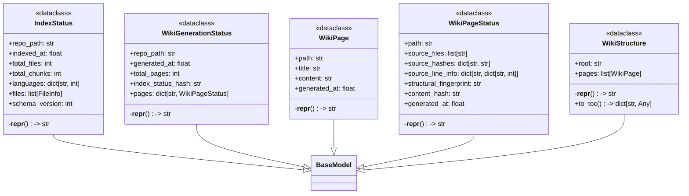
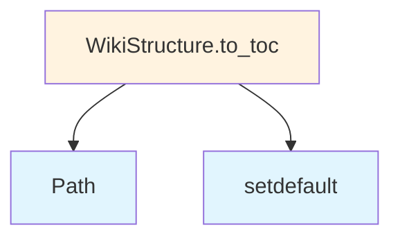

# File: `src/local_deepwiki/models/wiki.py`

## File Overview

This file defines pydantic models that represent the structure and status of generated wikis, as well as the indexing and generation processes. These models are used throughout the local_deepwiki project to track and manage the state of repository indexing, wiki page generation, and incremental updates.

The models encapsulate data related to:
- Repository indexing status (`IndexStatus`)
- Generated wiki pages (`WikiPage`)
- Wiki structure and navigation (`WikiStructure`)
- Status of individual wiki pages for incremental generation (`WikiPageStatus`)
- Overall status of wiki generation for tracking changes (`WikiGenerationStatus`)

These models ensure data consistency and provide a clear contract for how information flows between components in the system.

## Key Concepts

### 1. **Data Modeling with pydantic**
Each class in this file inherits from `BaseModel`, leveraging pydantic's validation and serialization capabilities. This approach ensures:
- Type safety at runtime
- Automatic documentation of fields via `Field()`
- Clean, structured representation of complex data

### 2. **Incremental Generation Support**
The models support incremental updates through:
- `WikiPageStatus`: Tracks which source files contributed to a page, their hashes, and line information.
- `WikiGenerationStatus`: Maintains a mapping of page paths to their statuses and a hash of the index status to detect changes.

This enables efficient regeneration of only the parts of the wiki that have changed.

### 3. **Wiki Structure Representation**
`WikiStructure` includes a `to_toc()` method that builds a hierarchical table of contents from the list of `WikiPage` objects. This allows for structured navigation and display of the generated wiki.

### 4. **Schema Versioning**
The `IndexStatus` model includes a `schema_version` field, supporting future migrations and schema evolution without breaking existing data.

## Integration

This file is a core part of the local_deepwiki system and integrates with:
- **Indexing pipeline**: The `IndexStatus` model is used by [`IndexStatusManager`](../core/index_manager.md) to track repository indexing progress.
- **Generation pipeline**: `WikiPage`, `WikiStructure`, `WikiPageStatus`, and `WikiGenerationStatus` are used by [`WikiGenerator`](../generators/wiki/generator.md) and related components to manage wiki content.
- **CLI and configuration**: Models are referenced by configuration validators and CLI handlers to validate input and manage state.

The models are imported and used across multiple modules including:
- `src/local_deepwiki/cli/config_validator.py`
- `src/local_deepwiki/cli/main.py`
- `src/local_deepwiki/generators/analysis/api_docs.py`

This tight integration ensures that all parts of the system share a consistent view of the wiki's structure and status.

## Design Notes

### 1. **Use of `FileInfo`**
The `IndexStatus` model includes a `files` field of type `list[FileInfo]`. This indicates that the system tracks detailed information about each indexed file, likely to support features like source code analysis or change tracking.

### 2. **Hierarchical Table of Contents**
The `WikiStructure.to_toc()` method demonstrates a practical approach to organizing wiki pages hierarchically using `pathlib.Path.parts`. This is an efficient way to build nested navigation structures from flat paths.

### 3. **Content Hashing for Change Detection**
In `WikiPageStatus`, the `content_hash` field and `source_hashes` mapping are used to detect when a page or its source files have changed. This is essential for incremental generation and performance optimization.

### 4. **Flexibility in Structural Fingerprints**
The `structural_fingerprint` field in `WikiPageStatus` allows for different handling of summary pages versus file-level pages. It's empty for file-level pages, which supports a clean separation of concerns in the generation logic.

### 5. **Timestamps for Tracking**
All relevant models include `generated_at` or `indexed_at` timestamps. This enables time-based tracking and decision-making, such as determining whether a page needs regeneration or if an index is stale.

### 6. **Default Factories for Mutable Fields**
Fields like `languages`, `files`, `pages`, and `source_files` use `default_factory=dict` or `list` to avoid mutable default issues in pydantic, ensuring each instance starts with a clean, independent data structure.

## API Reference

### class `IndexStatus`

**Inherits from:** `BaseModel`

Status of repository indexing.


<details>
<summary>View Source (lines 13-33) | <a href="https://github.com/UrbanDiver/local-deepwiki-mcp/blob/main/src/local_deepwiki/models/wiki.py#L13-L33">GitHub</a></summary>

```python
class IndexStatus(BaseModel):
    """Status of repository indexing."""

    repo_path: str = Field(description="Path to the repository")
    indexed_at: float = Field(description="Timestamp of last indexing")
    total_files: int = Field(description="Total files processed")
    total_chunks: int = Field(description="Total chunks extracted")
    languages: dict[str, int] = Field(
        default_factory=dict, description="Files per language"
    )
    files: list[FileInfo] = Field(default_factory=list, description="Indexed file info")
    schema_version: int = Field(
        default=1, description="Schema version for migration support"
    )

    def __repr__(self) -> str:
        """Return a concise representation for debugging."""
        return (
            f"<IndexStatus {self.repo_path} "
            f"({self.total_files} files, {self.total_chunks} chunks)>"
        )
```

</details>

### class `WikiPage`

**Inherits from:** `BaseModel`

A generated wiki page.


<details>
<summary>View Source (lines 36-46) | <a href="https://github.com/UrbanDiver/local-deepwiki-mcp/blob/main/src/local_deepwiki/models/wiki.py#L36-L46">GitHub</a></summary>

```python
class WikiPage(BaseModel):
    """A generated wiki page."""

    path: str = Field(description="Relative path in wiki directory")
    title: str = Field(description="Page title")
    content: str = Field(description="Markdown content")
    generated_at: float = Field(description="Generation timestamp")

    def __repr__(self) -> str:
        """Return a concise representation for debugging."""
        return f"<WikiPage {self.path} ({self.title!r})>"
```

</details>

### class `WikiStructure`

**Inherits from:** `BaseModel`

Structure of the generated wiki.

**Methods:**


<details>
<summary>View Source (lines 49-76) | <a href="https://github.com/UrbanDiver/local-deepwiki-mcp/blob/main/src/local_deepwiki/models/wiki.py#L49-L76">GitHub</a></summary>

```python
class WikiStructure(BaseModel):
    """Structure of the generated wiki."""

    root: str = Field(description="Wiki root directory")
    pages: list[WikiPage] = Field(default_factory=list, description="All wiki pages")

    def __repr__(self) -> str:
        """Return a concise representation for debugging."""
        return f"<WikiStructure {self.root} ({len(self.pages)} pages)>"

    def to_toc(self) -> dict[str, Any]:
        """Generate table of contents."""
        toc: dict[str, Any] = {"sections": []}
        for page in sorted(self.pages, key=lambda p: p.path):
            parts = Path(page.path).parts
            current = toc
            for part in parts[:-1]:
                section = next(
                    (s for s in current.get("sections", []) if s["name"] == part), None
                )
                if not section:
                    section = {"name": part, "sections": [], "pages": []}
                    current.setdefault("sections", []).append(section)
                current = section
            current.setdefault("pages", []).append(
                {"path": page.path, "title": page.title}
            )
        return toc
```

</details>

#### `to_toc`

```python
def to_toc() -> dict[str, Any]
```

Generate table of contents.


<details>
<summary>View Source (lines 49-76) | <a href="https://github.com/UrbanDiver/local-deepwiki-mcp/blob/main/src/local_deepwiki/models/wiki.py#L49-L76">GitHub</a></summary>

```python
class WikiStructure(BaseModel):
    """Structure of the generated wiki."""

    root: str = Field(description="Wiki root directory")
    pages: list[WikiPage] = Field(default_factory=list, description="All wiki pages")

    def __repr__(self) -> str:
        """Return a concise representation for debugging."""
        return f"<WikiStructure {self.root} ({len(self.pages)} pages)>"

    def to_toc(self) -> dict[str, Any]:
        """Generate table of contents."""
        toc: dict[str, Any] = {"sections": []}
        for page in sorted(self.pages, key=lambda p: p.path):
            parts = Path(page.path).parts
            current = toc
            for part in parts[:-1]:
                section = next(
                    (s for s in current.get("sections", []) if s["name"] == part), None
                )
                if not section:
                    section = {"name": part, "sections": [], "pages": []}
                    current.setdefault("sections", []).append(section)
                current = section
            current.setdefault("pages", []).append(
                {"path": page.path, "title": page.title}
            )
        return toc
```

</details>

### class `WikiPageStatus`

**Inherits from:** `BaseModel`

Status of a generated wiki page for incremental generation.


<details>
<summary>View Source (lines 79-102) | <a href="https://github.com/UrbanDiver/local-deepwiki-mcp/blob/main/src/local_deepwiki/models/wiki.py#L79-L102">GitHub</a></summary>

```python
class WikiPageStatus(BaseModel):
    """Status of a generated wiki page for incremental generation."""

    path: str = Field(description="Wiki page path (e.g., 'files/src/module/file.md')")
    source_files: list[str] = Field(
        default_factory=list, description="Source files that contributed to this page"
    )
    source_hashes: dict[str, str] = Field(
        default_factory=dict, description="Mapping of source file path to content hash"
    )
    source_line_info: dict[str, dict[str, int]] = Field(
        default_factory=dict,
        description="Mapping of source file path to {start_line, end_line}",
    )
    structural_fingerprint: str = Field(
        default="",
        description="Structural fingerprint for summary pages (empty for file-level pages)",
    )
    content_hash: str = Field(description="Hash of the generated page content")
    generated_at: float = Field(description="Timestamp when page was generated")

    def __repr__(self) -> str:
        """Return a concise representation for debugging."""
        return f"<WikiPageStatus {self.path} ({len(self.source_files)} sources)>"
```

</details>

### class `WikiGenerationStatus`

**Inherits from:** `BaseModel`

Status of wiki generation for tracking incremental updates.


<details>
<summary>View Source (lines 105-120) | <a href="https://github.com/UrbanDiver/local-deepwiki-mcp/blob/main/src/local_deepwiki/models/wiki.py#L105-L120">GitHub</a></summary>

```python
class WikiGenerationStatus(BaseModel):
    """Status of wiki generation for tracking incremental updates."""

    repo_path: str = Field(description="Path to the repository")
    generated_at: float = Field(description="Timestamp of last generation")
    total_pages: int = Field(description="Total pages generated")
    index_status_hash: str = Field(
        default="", description="Hash of index status for detecting changes"
    )
    pages: dict[str, WikiPageStatus] = Field(
        default_factory=dict, description="Mapping of page path to status"
    )

    def __repr__(self) -> str:
        """Return a concise representation for debugging."""
        return f"<WikiGenerationStatus {self.repo_path} ({self.total_pages} pages)>"
```

</details>

## Class Diagram



## Call Graph



## Used By

Functions and methods in this file and their callers:

- **`Path`**: called by `WikiStructure.to_toc`
- **`setdefault`**: called by `WikiStructure.to_toc`

## Usage Examples

*Examples extracted from test files*

### Test generates basic index content

From `test_wiki_file_callbacks.py::TestGenerateFilesIndex::test_generates_basic_index`:

```python
WikiPage(
        path="files/src/main.md",
        title="main.py",
        content="",
        generated_at=time.time(),
    ),
    WikiPage(
        path="files/src/utils.md",
        title="utils.py",
        content="",
        generated_at=time.time(),
    ),
]

result = _generate_files_index(pages)

assert "# Source Files" in result
assert "[main.py]" in result
```

### Test groups files by directory

From `test_wiki_file_callbacks.py::TestGenerateFilesIndex::test_groups_by_directory`:

```python
WikiPage(
        path="files/src/main.md",
        title="main.py",
        content="",
        generated_at=time.time(),
    ),
    WikiPage(
        path="files/tests/test_main.md",
        title="test_main.py",
        content="",
        generated_at=time.time(),
    ),
]

result = _generate_files_index(pages)

assert "## src" in result
assert "## tests" in result
```

### Example: `wiki`

From `test_wiki_pipeline_params.py::TestWikiPipelineParamsConstruction::test_fields_are_accessible`:

```python
ctx = make_wiki_ctx(repo_path=Path("/tmp/repo"))
        write_cb = AsyncMock()

        def progress_cb(msg, current, total):
            pass

        source_files = ["src/main.py", "src/utils.py"]

        params = WikiPipelineParams(
            ctx=ctx,
            write_callback=write_cb,
            progress_callback=progress_cb,
            all_source_files=source_files,
        )

        assert params.ctx is ctx
        assert params.write_callback is write_cb
```

### All internal markdown links should resolve to existing files

From `test_wiki_structural_integrity.py::TestLinkIntegrity::test_no_broken_internal_links`:

```python
broken = find_broken_links(wiki_path)
assert not broken, (
    f"Found {len(broken)} broken internal links:\n"
    + "\n".join(
        f"  - {src} -> [{text}]({target})" for src, text, target in broken[:20]
    )
    + (f"\n  ... and {len(broken) - 20} more" if len(broken) > 20 else "")
)
```

### Warnings are written to generation_status.json via finalize

From `test_wiki_generation_warnings.py::TestProgressTrackerWarnings::test_finalize_writes_warnings_to_status`:

```python
from local_deepwiki.generators.progress_tracker import GenerationProgress

progress = GenerationProgress(wiki_path=tmp_path)
progress.start_phase("test", total=0)

warnings = [
    "Dependency graph generation failed: timeout",
    "Caller search failed for 'my_func': connection error",
]

progress.finalize(success=True, warnings=warnings)

status_path = tmp_path / "generation_status.json"
assert status_path.exists()

with open(status_path) as f:
    status = json.load(f)

assert "generation_warnings" in status
```


## Last Modified

| Entity | Type | Author | Date | Commit |
|--------|------|--------|------|--------|
| `WikiPageStatus` | class | Brian Breidenbach | Feb 13, 2026 | `bdbd62f` perf: structural fingerprin... |
| `IndexStatus` | class | Brian Breidenbach | Feb 11, 2026 | `0c71b8e` refactor: convert models.py... |
| `WikiPage` | class | Brian Breidenbach | Feb 11, 2026 | `0c71b8e` refactor: convert models.py... |
| `WikiStructure` | class | Brian Breidenbach | Feb 11, 2026 | `0c71b8e` refactor: convert models.py... |
| `WikiGenerationStatus` | class | Brian Breidenbach | Feb 11, 2026 | `0c71b8e` refactor: convert models.py... |

## Relevant Source Files

- `src/local_deepwiki/models/wiki.py:13-33`
