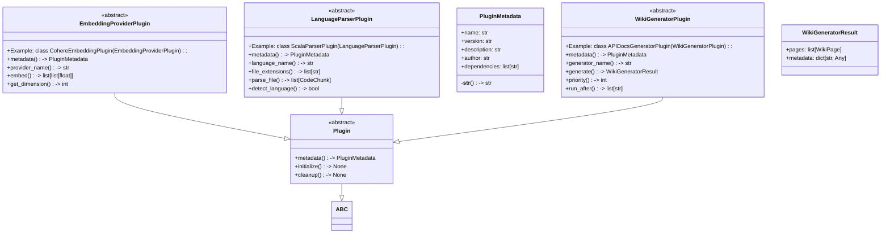

# File Overview

This file defines the base classes and data structures for plugins used in the local-deepwiki system. It provides abstract base classes for different types of plugins, including general plugins, language parsers, wiki generators, and embedding providers. These base classes define the interfaces that concrete plugins must implement to integrate with the system.

The file imports standard Python libraries and types from `local_deepwiki.models` to support plugin metadata and data structures.

## Classes

### PluginMetadata

Metadata for a plugin.

**Fields:**
- `name: str` - The name of the plugin.
- `version: str` - The version of the plugin.
- `description: str` - A description of the plugin (default: "").
- `author: str` - The author of the plugin (default: "").
- `dependencies: list[str]` - A list of plugin dependencies (default: []).

**Methods:**
- `__str__(self) -> str` - Returns a string representation of the plugin metadata in the format "{name} v{version}".

### Plugin

Base class for all plugins.

**Methods:**
- `metadata: PluginMetadata` (property, abstract) - Get plugin metadata.
- `initialize(self) -> None` - Initialize the plugin. Called when the plugin is loaded. Override to perform setup.
- `cleanup(self) -> None` - Clean up plugin resources. Called when the plugin is unloaded. Override to release resources.

### LanguageParserPlugin

Plugin for adding support for new programming languages.

Subclass this to add parsing support for languages not built into local-deepwiki.

**Methods:**
- `metadata: PluginMetadata` (property, abstract) - Get plugin metadata.
- `language_name: str` (property, abstract) - The name of the programming language this parser supports.
- `parse(self, code: str) -> list[CodeChunk]` (method, abstract) - Parse code into chunks.

### WikiGeneratorResult

Result from a wiki generator plugin.

**Fields:**
- `pages: list[WikiPage]` - Generated wiki pages.
- `metadata: dict[str, Any]` - Optional metadata about the generation (default: {}).

### WikiGeneratorPlugin

Plugin for adding custom wiki page generators.

Subclass this to add new types of wiki pages or sections.

**Methods:**
- `metadata: PluginMetadata` (property, abstract) - Get plugin metadata.
- `generator_name: str` (property, abstract) - The name of the generator.
- `generate(self, code_chunks: list[CodeChunk]) -> WikiGeneratorResult` (method, abstract) - Generate wiki pages from code chunks.

### EmbeddingProviderPlugin

Plugin for adding custom embedding providers.

Subclass this to add support for custom embedding models or services.

**Methods:**
- `metadata: PluginMetadata` (property, abstract) - Get plugin metadata.
- `provider_name: str` (property, abstract) - The name of the embedding provider.
- `embed(self, texts: list[str]) -> list[list[float]]` (method, abstract) - Generate embeddings for a list of texts.

## Integration

This file is part of the plugin architecture for local-deepwiki. It defines the interfaces that plugins must implement to be recognized and used by the system.

The classes defined here are used by:
- `WikiGeneratorResult`: used by test_plugins
- `WikiGeneratorPlugin`: used by registry
- `EmbeddingProviderPlugin`: used by registry, __init__, test_plugins

The file imports types from `local_deepwiki.models` including [`CodeChunk`](../models.md), [`IndexStatus`](../models.md), and [`WikiPage`](../export/streaming.md), which are used throughout the plugin system to represent code and documentation elements.

## Usage Examples

### Plugin Metadata Example

```python
metadata = PluginMetadata(
    name="my-plugin",
    version="1.0.0",
    description="A sample plugin",
    author="John Doe",
    dependencies=["other-plugin"]
)
```

### Plugin Example

```python
class MyPlugin(Plugin):
    @property
    def metadata(self) -> PluginMetadata:
        return PluginMetadata(
            name="my-plugin",
            version="1.0.0",
            description="A sample plugin"
        )
```

### Language Parser Plugin Example

```python
class MyLanguageParserPlugin(LanguageParserPlugin):
    @property
    def metadata(self) -> PluginMetadata:
        return PluginMetadata(
            name="my-language-parser",
            version="1.0.0",
            description="Parser for MyLanguage"
        )

    @property
    def language_name(self) -> str:
        return "MyLanguage"

    def parse(self, code: str) -> list[CodeChunk]:
        # Implementation here
        pass
```

### Wiki Generator Plugin Example

```python
class MyWikiGeneratorPlugin(WikiGeneratorPlugin):
    @property
    def metadata(self) -> PluginMetadata:
        return PluginMetadata(
            name="my-wiki-generator",
            version="1.0.0",
            description="Generator for MyWiki pages"
        )

    @property
    def generator_name(self) -> str:
        return "my-wiki"

    def generate(self, code_chunks: list[CodeChunk]) -> WikiGeneratorResult:
        # Implementation here
        pass
```

### Embedding Provider Plugin Example

```python
class MyEmbeddingProviderPlugin(EmbeddingProviderPlugin):
    @property
    def metadata(self) -> PluginMetadata:
        return PluginMetadata(
            name="my-embedding-provider",
            version="1.0.0",
            description="Embedding provider for MyModel"
        )

    @property
    def provider_name(self) -> str:
        return "my-embedding"

    def embed(self, texts: list[str]) -> list[list[float]]:
        # Implementation here
        pass
```

## API Reference

### class `PluginMetadata`

Metadata for a plugin.


<details>
<summary>View Source (lines 12-22) | <a href="https://github.com/UrbanDiver/local-deepwiki-mcp/blob/[main](../export/pdf.md)/src/local_deepwiki/plugins/base.py#L12-L22">GitHub</a></summary>

```python
class PluginMetadata:
    """Metadata for a plugin."""

    name: str
    version: str
    description: str = ""
    author: str = ""
    dependencies: list[str] = field(default_factory=list)

    def __str__(self) -> str:
        return f"{self.name} v{self.version}"
```

</details>

### class `Plugin`

**Inherits from:** `ABC`

Base class for all plugins.

**Methods:**


<details>
<summary>View Source (lines 25-46) | <a href="https://github.com/UrbanDiver/local-deepwiki-mcp/blob/[main](../export/pdf.md)/src/local_deepwiki/plugins/base.py#L25-L46">GitHub</a></summary>

```python
class Plugin(ABC):
    """Base class for all plugins."""

    @property
    @abstractmethod
    def metadata(self) -> PluginMetadata:
        """Get plugin metadata."""
        pass

    def initialize(self) -> None:
        """Initialize the plugin.

        Called when the plugin is loaded. Override to perform setup.
        """
        pass

    def cleanup(self) -> None:
        """Clean up plugin resources.

        Called when the plugin is unloaded. Override to release resources.
        """
        pass
```

</details>

#### `metadata`

```python
def metadata() -> PluginMetadata
```

Get plugin metadata.


<details>
<summary>View Source (lines 25-46) | <a href="https://github.com/UrbanDiver/local-deepwiki-mcp/blob/[main](../export/pdf.md)/src/local_deepwiki/plugins/base.py#L25-L46">GitHub</a></summary>

```python
class Plugin(ABC):
    """Base class for all plugins."""

    @property
    @abstractmethod
    def metadata(self) -> PluginMetadata:
        """Get plugin metadata."""
        pass

    def initialize(self) -> None:
        """Initialize the plugin.

        Called when the plugin is loaded. Override to perform setup.
        """
        pass

    def cleanup(self) -> None:
        """Clean up plugin resources.

        Called when the plugin is unloaded. Override to release resources.
        """
        pass
```

</details>

#### `initialize`

```python
def initialize() -> None
```

Initialize the plugin.  Called when the plugin is loaded. Override to perform setup.


<details>
<summary>View Source (lines 25-46) | <a href="https://github.com/UrbanDiver/local-deepwiki-mcp/blob/[main](../export/pdf.md)/src/local_deepwiki/plugins/base.py#L25-L46">GitHub</a></summary>

```python
class Plugin(ABC):
    """Base class for all plugins."""

    @property
    @abstractmethod
    def metadata(self) -> PluginMetadata:
        """Get plugin metadata."""
        pass

    def initialize(self) -> None:
        """Initialize the plugin.

        Called when the plugin is loaded. Override to perform setup.
        """
        pass

    def cleanup(self) -> None:
        """Clean up plugin resources.

        Called when the plugin is unloaded. Override to release resources.
        """
        pass
```

</details>

#### `cleanup`

```python
def cleanup() -> None
```

Clean up plugin resources.  Called when the plugin is unloaded. Override to release resources.


<details>
<summary>View Source (lines 25-46) | <a href="https://github.com/UrbanDiver/local-deepwiki-mcp/blob/[main](../export/pdf.md)/src/local_deepwiki/plugins/base.py#L25-L46">GitHub</a></summary>

```python
class Plugin(ABC):
    """Base class for all plugins."""

    @property
    @abstractmethod
    def metadata(self) -> PluginMetadata:
        """Get plugin metadata."""
        pass

    def initialize(self) -> None:
        """Initialize the plugin.

        Called when the plugin is loaded. Override to perform setup.
        """
        pass

    def cleanup(self) -> None:
        """Clean up plugin resources.

        Called when the plugin is unloaded. Override to release resources.
        """
        pass
```

</details>

### class `LanguageParserPlugin`

**Inherits from:** `Plugin`

Plugin for adding support for new programming languages.  Subclass this to add parsing support for languages not built into local-deepwiki.

**Methods:**


<details>
<summary>View Source (lines 49-115) | <a href="https://github.com/UrbanDiver/local-deepwiki-mcp/blob/[main](../export/pdf.md)/src/local_deepwiki/plugins/base.py#L49-L115">GitHub</a></summary>

```python
class LanguageParserPlugin(Plugin):
    """Plugin for adding support for new programming languages.

    Subclass this to add parsing support for languages not built into
    local-deepwiki.

    Example:
        class ScalaParserPlugin(LanguageParserPlugin):
            @property
            def metadata(self) -> PluginMetadata:
                return PluginMetadata(
                    name="scala-parser",
                    version="1.0.0",
                    description="Scala language support",
                )

            @property
            def language_name(self) -> str:
                return "scala"

            @property
            def file_extensions(self) -> list[str]:
                return [".scala", ".sc"]

            def parse_file(self, file_path: Path, source: bytes) -> list[CodeChunk]:
                # Parse Scala source and return chunks
                ...
    """

    @property
    @abstractmethod
    def language_name(self) -> str:
        """Get the language name (lowercase, e.g., 'scala', 'elixir')."""
        pass

    @property
    @abstractmethod
    def file_extensions(self) -> list[str]:
        """Get list of file extensions this plugin handles.

        Include the dot, e.g., ['.scala', '.sc'].
        """
        pass

    @abstractmethod
    def parse_file(self, file_path: Path, source: bytes) -> list[CodeChunk]:
        """Parse a source file and extract code chunks.

        Args:
            file_path: Path to the source file.
            source: The file contents as bytes.

        Returns:
            List of CodeChunk objects extracted from the file.
        """
        pass

    def detect_language(self, file_path: Path) -> bool:
        """Check if this plugin can handle the given file.

        Args:
            file_path: Path to check.

        Returns:
            True if this plugin should handle the file.
        """
        return file_path.suffix.lower() in self.file_extensions
```

</details>

#### `language_name`

```python
def language_name() -> str
```

Get the language name (lowercase, e.g., 'scala', 'elixir').


<details>
<summary>View Source (lines 49-115) | <a href="https://github.com/UrbanDiver/local-deepwiki-mcp/blob/[main](../export/pdf.md)/src/local_deepwiki/plugins/base.py#L49-L115">GitHub</a></summary>

```python
class LanguageParserPlugin(Plugin):
    """Plugin for adding support for new programming languages.

    Subclass this to add parsing support for languages not built into
    local-deepwiki.

    Example:
        class ScalaParserPlugin(LanguageParserPlugin):
            @property
            def metadata(self) -> PluginMetadata:
                return PluginMetadata(
                    name="scala-parser",
                    version="1.0.0",
                    description="Scala language support",
                )

            @property
            def language_name(self) -> str:
                return "scala"

            @property
            def file_extensions(self) -> list[str]:
                return [".scala", ".sc"]

            def parse_file(self, file_path: Path, source: bytes) -> list[CodeChunk]:
                # Parse Scala source and return chunks
                ...
    """

    @property
    @abstractmethod
    def language_name(self) -> str:
        """Get the language name (lowercase, e.g., 'scala', 'elixir')."""
        pass

    @property
    @abstractmethod
    def file_extensions(self) -> list[str]:
        """Get list of file extensions this plugin handles.

        Include the dot, e.g., ['.scala', '.sc'].
        """
        pass

    @abstractmethod
    def parse_file(self, file_path: Path, source: bytes) -> list[CodeChunk]:
        """Parse a source file and extract code chunks.

        Args:
            file_path: Path to the source file.
            source: The file contents as bytes.

        Returns:
            List of CodeChunk objects extracted from the file.
        """
        pass

    def detect_language(self, file_path: Path) -> bool:
        """Check if this plugin can handle the given file.

        Args:
            file_path: Path to check.

        Returns:
            True if this plugin should handle the file.
        """
        return file_path.suffix.lower() in self.file_extensions
```

</details>

#### `file_extensions`

```python
def file_extensions() -> list[str]
```

Get list of file extensions this plugin handles.  Include the dot, e.g., ['.scala', '.sc'].


<details>
<summary>View Source (lines 49-115) | <a href="https://github.com/UrbanDiver/local-deepwiki-mcp/blob/[main](../export/pdf.md)/src/local_deepwiki/plugins/base.py#L49-L115">GitHub</a></summary>

```python
class LanguageParserPlugin(Plugin):
    """Plugin for adding support for new programming languages.

    Subclass this to add parsing support for languages not built into
    local-deepwiki.

    Example:
        class ScalaParserPlugin(LanguageParserPlugin):
            @property
            def metadata(self) -> PluginMetadata:
                return PluginMetadata(
                    name="scala-parser",
                    version="1.0.0",
                    description="Scala language support",
                )

            @property
            def language_name(self) -> str:
                return "scala"

            @property
            def file_extensions(self) -> list[str]:
                return [".scala", ".sc"]

            def parse_file(self, file_path: Path, source: bytes) -> list[CodeChunk]:
                # Parse Scala source and return chunks
                ...
    """

    @property
    @abstractmethod
    def language_name(self) -> str:
        """Get the language name (lowercase, e.g., 'scala', 'elixir')."""
        pass

    @property
    @abstractmethod
    def file_extensions(self) -> list[str]:
        """Get list of file extensions this plugin handles.

        Include the dot, e.g., ['.scala', '.sc'].
        """
        pass

    @abstractmethod
    def parse_file(self, file_path: Path, source: bytes) -> list[CodeChunk]:
        """Parse a source file and extract code chunks.

        Args:
            file_path: Path to the source file.
            source: The file contents as bytes.

        Returns:
            List of CodeChunk objects extracted from the file.
        """
        pass

    def detect_language(self, file_path: Path) -> bool:
        """Check if this plugin can handle the given file.

        Args:
            file_path: Path to check.

        Returns:
            True if this plugin should handle the file.
        """
        return file_path.suffix.lower() in self.file_extensions
```

</details>

#### `parse_file`

```python
def parse_file(file_path: Path, source: bytes) -> list[CodeChunk]
```

Parse a source file and extract code chunks.


| [Parameter](../generators/api_docs.md) | Type | Default | Description |
|-----------|------|---------|-------------|
| `file_path` | `Path` | - | Path to the source file. |
| `source` | `bytes` | - | The file contents as bytes. |


<details>
<summary>View Source (lines 49-115) | <a href="https://github.com/UrbanDiver/local-deepwiki-mcp/blob/[main](../export/pdf.md)/src/local_deepwiki/plugins/base.py#L49-L115">GitHub</a></summary>

```python
class LanguageParserPlugin(Plugin):
    """Plugin for adding support for new programming languages.

    Subclass this to add parsing support for languages not built into
    local-deepwiki.

    Example:
        class ScalaParserPlugin(LanguageParserPlugin):
            @property
            def metadata(self) -> PluginMetadata:
                return PluginMetadata(
                    name="scala-parser",
                    version="1.0.0",
                    description="Scala language support",
                )

            @property
            def language_name(self) -> str:
                return "scala"

            @property
            def file_extensions(self) -> list[str]:
                return [".scala", ".sc"]

            def parse_file(self, file_path: Path, source: bytes) -> list[CodeChunk]:
                # Parse Scala source and return chunks
                ...
    """

    @property
    @abstractmethod
    def language_name(self) -> str:
        """Get the language name (lowercase, e.g., 'scala', 'elixir')."""
        pass

    @property
    @abstractmethod
    def file_extensions(self) -> list[str]:
        """Get list of file extensions this plugin handles.

        Include the dot, e.g., ['.scala', '.sc'].
        """
        pass

    @abstractmethod
    def parse_file(self, file_path: Path, source: bytes) -> list[CodeChunk]:
        """Parse a source file and extract code chunks.

        Args:
            file_path: Path to the source file.
            source: The file contents as bytes.

        Returns:
            List of CodeChunk objects extracted from the file.
        """
        pass

    def detect_language(self, file_path: Path) -> bool:
        """Check if this plugin can handle the given file.

        Args:
            file_path: Path to check.

        Returns:
            True if this plugin should handle the file.
        """
        return file_path.suffix.lower() in self.file_extensions
```

</details>

#### `detect_language`

```python
def detect_language(file_path: Path) -> bool
```

Check if this plugin can handle the given file.


| [Parameter](../generators/api_docs.md) | Type | Default | Description |
|-----------|------|---------|-------------|
| `file_path` | `Path` | - | Path to check. |


<details>
<summary>View Source (lines 49-115) | <a href="https://github.com/UrbanDiver/local-deepwiki-mcp/blob/[main](../export/pdf.md)/src/local_deepwiki/plugins/base.py#L49-L115">GitHub</a></summary>

```python
class LanguageParserPlugin(Plugin):
    """Plugin for adding support for new programming languages.

    Subclass this to add parsing support for languages not built into
    local-deepwiki.

    Example:
        class ScalaParserPlugin(LanguageParserPlugin):
            @property
            def metadata(self) -> PluginMetadata:
                return PluginMetadata(
                    name="scala-parser",
                    version="1.0.0",
                    description="Scala language support",
                )

            @property
            def language_name(self) -> str:
                return "scala"

            @property
            def file_extensions(self) -> list[str]:
                return [".scala", ".sc"]

            def parse_file(self, file_path: Path, source: bytes) -> list[CodeChunk]:
                # Parse Scala source and return chunks
                ...
    """

    @property
    @abstractmethod
    def language_name(self) -> str:
        """Get the language name (lowercase, e.g., 'scala', 'elixir')."""
        pass

    @property
    @abstractmethod
    def file_extensions(self) -> list[str]:
        """Get list of file extensions this plugin handles.

        Include the dot, e.g., ['.scala', '.sc'].
        """
        pass

    @abstractmethod
    def parse_file(self, file_path: Path, source: bytes) -> list[CodeChunk]:
        """Parse a source file and extract code chunks.

        Args:
            file_path: Path to the source file.
            source: The file contents as bytes.

        Returns:
            List of CodeChunk objects extracted from the file.
        """
        pass

    def detect_language(self, file_path: Path) -> bool:
        """Check if this plugin can handle the given file.

        Args:
            file_path: Path to check.

        Returns:
            True if this plugin should handle the file.
        """
        return file_path.suffix.lower() in self.file_extensions
```

</details>

### class `WikiGeneratorResult`

Result from a wiki generator plugin.


<details>
<summary>View Source (lines 119-126) | <a href="https://github.com/UrbanDiver/local-deepwiki-mcp/blob/[main](../export/pdf.md)/src/local_deepwiki/plugins/base.py#L119-L126">GitHub</a></summary>

```python
class WikiGeneratorResult:
    """Result from a wiki generator plugin."""

    pages: list[WikiPage]
    """Generated wiki pages."""

    metadata: dict[str, Any] = field(default_factory=dict)
    """Optional metadata about the generation."""
```

</details>

### class `WikiGeneratorPlugin`

**Inherits from:** `Plugin`

Plugin for adding custom wiki page generators.  Subclass this to add new types of wiki pages or sections.

**Methods:**


<details>
<summary>View Source (lines 129-201) | <a href="https://github.com/UrbanDiver/local-deepwiki-mcp/blob/[main](../export/pdf.md)/src/local_deepwiki/plugins/base.py#L129-L201">GitHub</a></summary>

```python
class WikiGeneratorPlugin(Plugin):
    """Plugin for adding custom wiki page generators.

    Subclass this to add new types of wiki pages or sections.

    Example:
        class APIDocsGeneratorPlugin(WikiGeneratorPlugin):
            @property
            def metadata(self) -> PluginMetadata:
                return PluginMetadata(
                    name="api-docs-generator",
                    version="1.0.0",
                    description="Generate API documentation pages",
                )

            @property
            def generator_name(self) -> str:
                return "api_docs"

            async def generate(
                self,
                index_status: IndexStatus,
                wiki_path: Path,
                context: dict[str, Any],
            ) -> WikiGeneratorResult:
                # Generate API documentation pages
                ...
    """

    @property
    @abstractmethod
    def generator_name(self) -> str:
        """Get the generator name (used for identification)."""
        pass

    @property
    def priority(self) -> int:
        """Get the generator priority (higher runs first).

        Default is 0. Built-in generators run at priority 100.
        """
        return 0

    @property
    def run_after(self) -> list[str]:
        """Get list of generator names this should run after.

        Use this for generators that depend on output from other generators.
        """
        return []

    @abstractmethod
    async def generate(
        self,
        index_status: IndexStatus,
        wiki_path: Path,
        context: dict[str, Any],
    ) -> WikiGeneratorResult:
        """Generate wiki pages.

        Args:
            index_status: The repository index status.
            wiki_path: Path to the wiki output directory.
            context: Context dictionary with:
                - 'vector_store': VectorStore instance
                - 'llm': LLM provider instance
                - 'config': Config instance
                - 'existing_pages': List of already-generated WikiPage objects

        Returns:
            WikiGeneratorResult with generated pages.
        """
        pass
```

</details>

#### `generator_name`

```python
def generator_name() -> str
```

Get the generator name (used for identification).


<details>
<summary>View Source (lines 129-201) | <a href="https://github.com/UrbanDiver/local-deepwiki-mcp/blob/[main](../export/pdf.md)/src/local_deepwiki/plugins/base.py#L129-L201">GitHub</a></summary>

```python
class WikiGeneratorPlugin(Plugin):
    """Plugin for adding custom wiki page generators.

    Subclass this to add new types of wiki pages or sections.

    Example:
        class APIDocsGeneratorPlugin(WikiGeneratorPlugin):
            @property
            def metadata(self) -> PluginMetadata:
                return PluginMetadata(
                    name="api-docs-generator",
                    version="1.0.0",
                    description="Generate API documentation pages",
                )

            @property
            def generator_name(self) -> str:
                return "api_docs"

            async def generate(
                self,
                index_status: IndexStatus,
                wiki_path: Path,
                context: dict[str, Any],
            ) -> WikiGeneratorResult:
                # Generate API documentation pages
                ...
    """

    @property
    @abstractmethod
    def generator_name(self) -> str:
        """Get the generator name (used for identification)."""
        pass

    @property
    def priority(self) -> int:
        """Get the generator priority (higher runs first).

        Default is 0. Built-in generators run at priority 100.
        """
        return 0

    @property
    def run_after(self) -> list[str]:
        """Get list of generator names this should run after.

        Use this for generators that depend on output from other generators.
        """
        return []

    @abstractmethod
    async def generate(
        self,
        index_status: IndexStatus,
        wiki_path: Path,
        context: dict[str, Any],
    ) -> WikiGeneratorResult:
        """Generate wiki pages.

        Args:
            index_status: The repository index status.
            wiki_path: Path to the wiki output directory.
            context: Context dictionary with:
                - 'vector_store': VectorStore instance
                - 'llm': LLM provider instance
                - 'config': Config instance
                - 'existing_pages': List of already-generated WikiPage objects

        Returns:
            WikiGeneratorResult with generated pages.
        """
        pass
```

</details>

#### `priority`

```python
def priority() -> int
```

Get the generator priority (higher runs first).  Default is 0. Built-in generators run at priority 100.


<details>
<summary>View Source (lines 129-201) | <a href="https://github.com/UrbanDiver/local-deepwiki-mcp/blob/[main](../export/pdf.md)/src/local_deepwiki/plugins/base.py#L129-L201">GitHub</a></summary>

```python
class WikiGeneratorPlugin(Plugin):
    """Plugin for adding custom wiki page generators.

    Subclass this to add new types of wiki pages or sections.

    Example:
        class APIDocsGeneratorPlugin(WikiGeneratorPlugin):
            @property
            def metadata(self) -> PluginMetadata:
                return PluginMetadata(
                    name="api-docs-generator",
                    version="1.0.0",
                    description="Generate API documentation pages",
                )

            @property
            def generator_name(self) -> str:
                return "api_docs"

            async def generate(
                self,
                index_status: IndexStatus,
                wiki_path: Path,
                context: dict[str, Any],
            ) -> WikiGeneratorResult:
                # Generate API documentation pages
                ...
    """

    @property
    @abstractmethod
    def generator_name(self) -> str:
        """Get the generator name (used for identification)."""
        pass

    @property
    def priority(self) -> int:
        """Get the generator priority (higher runs first).

        Default is 0. Built-in generators run at priority 100.
        """
        return 0

    @property
    def run_after(self) -> list[str]:
        """Get list of generator names this should run after.

        Use this for generators that depend on output from other generators.
        """
        return []

    @abstractmethod
    async def generate(
        self,
        index_status: IndexStatus,
        wiki_path: Path,
        context: dict[str, Any],
    ) -> WikiGeneratorResult:
        """Generate wiki pages.

        Args:
            index_status: The repository index status.
            wiki_path: Path to the wiki output directory.
            context: Context dictionary with:
                - 'vector_store': VectorStore instance
                - 'llm': LLM provider instance
                - 'config': Config instance
                - 'existing_pages': List of already-generated WikiPage objects

        Returns:
            WikiGeneratorResult with generated pages.
        """
        pass
```

</details>

#### `run_after`

```python
def run_after() -> list[str]
```

Get list of generator names this should run after.  Use this for generators that depend on output from other generators.


<details>
<summary>View Source (lines 129-201) | <a href="https://github.com/UrbanDiver/local-deepwiki-mcp/blob/[main](../export/pdf.md)/src/local_deepwiki/plugins/base.py#L129-L201">GitHub</a></summary>

```python
class WikiGeneratorPlugin(Plugin):
    """Plugin for adding custom wiki page generators.

    Subclass this to add new types of wiki pages or sections.

    Example:
        class APIDocsGeneratorPlugin(WikiGeneratorPlugin):
            @property
            def metadata(self) -> PluginMetadata:
                return PluginMetadata(
                    name="api-docs-generator",
                    version="1.0.0",
                    description="Generate API documentation pages",
                )

            @property
            def generator_name(self) -> str:
                return "api_docs"

            async def generate(
                self,
                index_status: IndexStatus,
                wiki_path: Path,
                context: dict[str, Any],
            ) -> WikiGeneratorResult:
                # Generate API documentation pages
                ...
    """

    @property
    @abstractmethod
    def generator_name(self) -> str:
        """Get the generator name (used for identification)."""
        pass

    @property
    def priority(self) -> int:
        """Get the generator priority (higher runs first).

        Default is 0. Built-in generators run at priority 100.
        """
        return 0

    @property
    def run_after(self) -> list[str]:
        """Get list of generator names this should run after.

        Use this for generators that depend on output from other generators.
        """
        return []

    @abstractmethod
    async def generate(
        self,
        index_status: IndexStatus,
        wiki_path: Path,
        context: dict[str, Any],
    ) -> WikiGeneratorResult:
        """Generate wiki pages.

        Args:
            index_status: The repository index status.
            wiki_path: Path to the wiki output directory.
            context: Context dictionary with:
                - 'vector_store': VectorStore instance
                - 'llm': LLM provider instance
                - 'config': Config instance
                - 'existing_pages': List of already-generated WikiPage objects

        Returns:
            WikiGeneratorResult with generated pages.
        """
        pass
```

</details>

#### `generate`

```python
async def generate(index_status: IndexStatus, wiki_path: Path, context: dict[str, Any]) -> WikiGeneratorResult
```

Generate wiki pages.


| [Parameter](../generators/api_docs.md) | Type | Default | Description |
|-----------|------|---------|-------------|
| `index_status` | [`IndexStatus`](../models.md) | - | The repository index status. |
| `wiki_path` | `Path` | - | Path to the wiki output directory. |
| `context` | `dict[str, Any]` | - | Context dictionary with: - 'vector_store': [VectorStore](../core/vectorstore.md) instance - 'llm': LLM provider instance - 'config': [Config](../config.md) instance - 'existing_pages': List of already-generated [WikiPage](../export/streaming.md) objects |


<details>
<summary>View Source (lines 129-201) | <a href="https://github.com/UrbanDiver/local-deepwiki-mcp/blob/[main](../export/pdf.md)/src/local_deepwiki/plugins/base.py#L129-L201">GitHub</a></summary>

```python
class WikiGeneratorPlugin(Plugin):
    """Plugin for adding custom wiki page generators.

    Subclass this to add new types of wiki pages or sections.

    Example:
        class APIDocsGeneratorPlugin(WikiGeneratorPlugin):
            @property
            def metadata(self) -> PluginMetadata:
                return PluginMetadata(
                    name="api-docs-generator",
                    version="1.0.0",
                    description="Generate API documentation pages",
                )

            @property
            def generator_name(self) -> str:
                return "api_docs"

            async def generate(
                self,
                index_status: IndexStatus,
                wiki_path: Path,
                context: dict[str, Any],
            ) -> WikiGeneratorResult:
                # Generate API documentation pages
                ...
    """

    @property
    @abstractmethod
    def generator_name(self) -> str:
        """Get the generator name (used for identification)."""
        pass

    @property
    def priority(self) -> int:
        """Get the generator priority (higher runs first).

        Default is 0. Built-in generators run at priority 100.
        """
        return 0

    @property
    def run_after(self) -> list[str]:
        """Get list of generator names this should run after.

        Use this for generators that depend on output from other generators.
        """
        return []

    @abstractmethod
    async def generate(
        self,
        index_status: IndexStatus,
        wiki_path: Path,
        context: dict[str, Any],
    ) -> WikiGeneratorResult:
        """Generate wiki pages.

        Args:
            index_status: The repository index status.
            wiki_path: Path to the wiki output directory.
            context: Context dictionary with:
                - 'vector_store': VectorStore instance
                - 'llm': LLM provider instance
                - 'config': Config instance
                - 'existing_pages': List of already-generated WikiPage objects

        Returns:
            WikiGeneratorResult with generated pages.
        """
        pass
```

</details>

### class `EmbeddingProviderPlugin`

**Inherits from:** `Plugin`

Plugin for adding custom embedding providers.  Subclass this to add support for custom embedding models or services.

**Methods:**


<details>
<summary>View Source (lines 204-256) | <a href="https://github.com/UrbanDiver/local-deepwiki-mcp/blob/[main](../export/pdf.md)/src/local_deepwiki/plugins/base.py#L204-L256">GitHub</a></summary>

```python
class EmbeddingProviderPlugin(Plugin):
    """Plugin for adding custom embedding providers.

    Subclass this to add support for custom embedding models or services.

    Example:
        class CohereEmbeddingPlugin(EmbeddingProviderPlugin):
            @property
            def metadata(self) -> PluginMetadata:
                return PluginMetadata(
                    name="cohere-embeddings",
                    version="1.0.0",
                    description="Cohere embedding support",
                )

            @property
            def provider_name(self) -> str:
                return "cohere"

            async def embed(self, texts: list[str]) -> list[list[float]]:
                # Call Cohere API to generate embeddings
                ...

            def get_dimension(self) -> int:
                return 1024  # Cohere embed-english-v3.0 dimension
    """

    @property
    @abstractmethod
    def provider_name(self) -> str:
        """Get the provider name (used in config)."""
        pass

    @abstractmethod
    async def embed(self, texts: list[str]) -> list[list[float]]:
        """Generate embeddings for texts.

        Args:
            texts: List of text strings to embed.

        Returns:
            List of embedding vectors.
        """
        pass

    @abstractmethod
    def get_dimension(self) -> int:
        """Get the embedding dimension.

        Returns:
            The dimension of the embedding vectors.
        """
        pass
```

</details>

#### `provider_name`

```python
def provider_name() -> str
```

Get the provider name (used in config).


<details>
<summary>View Source (lines 204-256) | <a href="https://github.com/UrbanDiver/local-deepwiki-mcp/blob/[main](../export/pdf.md)/src/local_deepwiki/plugins/base.py#L204-L256">GitHub</a></summary>

```python
class EmbeddingProviderPlugin(Plugin):
    """Plugin for adding custom embedding providers.

    Subclass this to add support for custom embedding models or services.

    Example:
        class CohereEmbeddingPlugin(EmbeddingProviderPlugin):
            @property
            def metadata(self) -> PluginMetadata:
                return PluginMetadata(
                    name="cohere-embeddings",
                    version="1.0.0",
                    description="Cohere embedding support",
                )

            @property
            def provider_name(self) -> str:
                return "cohere"

            async def embed(self, texts: list[str]) -> list[list[float]]:
                # Call Cohere API to generate embeddings
                ...

            def get_dimension(self) -> int:
                return 1024  # Cohere embed-english-v3.0 dimension
    """

    @property
    @abstractmethod
    def provider_name(self) -> str:
        """Get the provider name (used in config)."""
        pass

    @abstractmethod
    async def embed(self, texts: list[str]) -> list[list[float]]:
        """Generate embeddings for texts.

        Args:
            texts: List of text strings to embed.

        Returns:
            List of embedding vectors.
        """
        pass

    @abstractmethod
    def get_dimension(self) -> int:
        """Get the embedding dimension.

        Returns:
            The dimension of the embedding vectors.
        """
        pass
```

</details>

#### `embed`

```python
async def embed(texts: list[str]) -> list[list[float]]
```

Generate embeddings for texts.


| [Parameter](../generators/api_docs.md) | Type | Default | Description |
|-----------|------|---------|-------------|
| `texts` | `list[str]` | - | List of text strings to embed. |


<details>
<summary>View Source (lines 204-256) | <a href="https://github.com/UrbanDiver/local-deepwiki-mcp/blob/[main](../export/pdf.md)/src/local_deepwiki/plugins/base.py#L204-L256">GitHub</a></summary>

```python
class EmbeddingProviderPlugin(Plugin):
    """Plugin for adding custom embedding providers.

    Subclass this to add support for custom embedding models or services.

    Example:
        class CohereEmbeddingPlugin(EmbeddingProviderPlugin):
            @property
            def metadata(self) -> PluginMetadata:
                return PluginMetadata(
                    name="cohere-embeddings",
                    version="1.0.0",
                    description="Cohere embedding support",
                )

            @property
            def provider_name(self) -> str:
                return "cohere"

            async def embed(self, texts: list[str]) -> list[list[float]]:
                # Call Cohere API to generate embeddings
                ...

            def get_dimension(self) -> int:
                return 1024  # Cohere embed-english-v3.0 dimension
    """

    @property
    @abstractmethod
    def provider_name(self) -> str:
        """Get the provider name (used in config)."""
        pass

    @abstractmethod
    async def embed(self, texts: list[str]) -> list[list[float]]:
        """Generate embeddings for texts.

        Args:
            texts: List of text strings to embed.

        Returns:
            List of embedding vectors.
        """
        pass

    @abstractmethod
    def get_dimension(self) -> int:
        """Get the embedding dimension.

        Returns:
            The dimension of the embedding vectors.
        """
        pass
```

</details>

#### `get_dimension`

```python
def get_dimension() -> int
```

Get the embedding dimension.


<details>
<summary>View Source (lines 204-256) | <a href="https://github.com/UrbanDiver/local-deepwiki-mcp/blob/[main](../export/pdf.md)/src/local_deepwiki/plugins/base.py#L204-L256">GitHub</a></summary>

```python
class EmbeddingProviderPlugin(Plugin):
    """Plugin for adding custom embedding providers.

    Subclass this to add support for custom embedding models or services.

    Example:
        class CohereEmbeddingPlugin(EmbeddingProviderPlugin):
            @property
            def metadata(self) -> PluginMetadata:
                return PluginMetadata(
                    name="cohere-embeddings",
                    version="1.0.0",
                    description="Cohere embedding support",
                )

            @property
            def provider_name(self) -> str:
                return "cohere"

            async def embed(self, texts: list[str]) -> list[list[float]]:
                # Call Cohere API to generate embeddings
                ...

            def get_dimension(self) -> int:
                return 1024  # Cohere embed-english-v3.0 dimension
    """

    @property
    @abstractmethod
    def provider_name(self) -> str:
        """Get the provider name (used in config)."""
        pass

    @abstractmethod
    async def embed(self, texts: list[str]) -> list[list[float]]:
        """Generate embeddings for texts.

        Args:
            texts: List of text strings to embed.

        Returns:
            List of embedding vectors.
        """
        pass

    @abstractmethod
    def get_dimension(self) -> int:
        """Get the embedding dimension.

        Returns:
            The dimension of the embedding vectors.
        """
        pass
```

</details>

## Class Diagram



## Usage Examples

*Examples extracted from test files*

### Test that calling EmbeddingProvider.embed raises TypeError (abstract)

From `test_base_provider.py::TestEmbeddingProviderAbstractMethods::test_embed_abstract_method_body`:

```python
# These calls will execute the pass statements in the abstract base
assert provider.get_dimension() == 768
assert provider.name == "test-embedding"
```

### Test that calling the abstract name property fget covers line 141

From `test_base_provider.py::TestEmbeddingProviderAbstractMethods::test_name_property_abstract_fget_coverage`:

```python
# Call the abstract base class property's fget directly
# This executes the pass statement in the abstract method body
result = EmbeddingProvider.name.fget(provider)
# pass returns None
assert result is None
```


## Last Modified

| Entity | Type | Author | Date | Commit |
|--------|------|--------|------|--------|
| `PluginMetadata` | class | Brian Breidenbach | 1 week ago | `f2db999` Add plugin system for exten... |
| `Plugin` | class | Brian Breidenbach | 1 week ago | `f2db999` Add plugin system for exten... |
| `LanguageParserPlugin` | class | Brian Breidenbach | 1 week ago | `f2db999` Add plugin system for exten... |
| `WikiGeneratorResult` | class | Brian Breidenbach | 1 week ago | `f2db999` Add plugin system for exten... |
| `WikiGeneratorPlugin` | class | Brian Breidenbach | 1 week ago | `f2db999` Add plugin system for exten... |
| `EmbeddingProviderPlugin` | class | Brian Breidenbach | 1 week ago | `f2db999` Add plugin system for exten... |

## Relevant Source Files

- `src/local_deepwiki/plugins/base.py:12-22`
