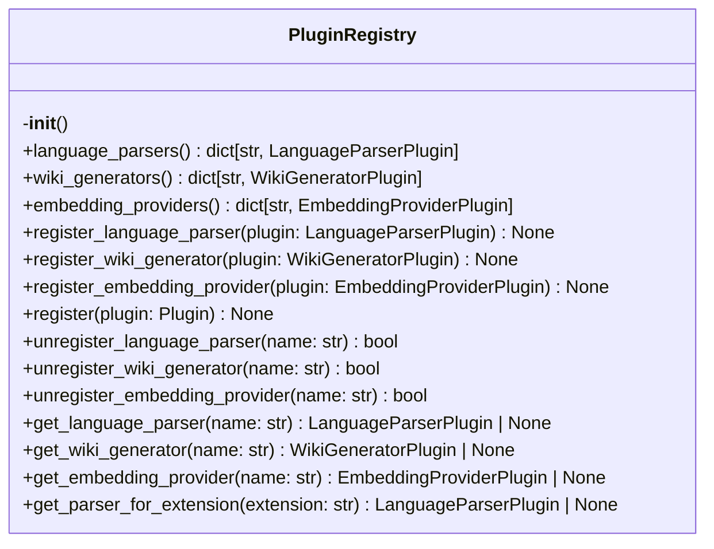

# File Overview

This file defines the `PluginRegistry` class, which is responsible for managing plugin instances in the local_deepwiki system. It supports registration, discovery, and retrieval of different types of plugins including language parsers, wiki generators, and embedding providers. The registry is initialized with empty dictionaries for each plugin type and supports loading plugins from directories or entry points.

Dependencies:
- `importlib.util`, `sys`, `Path`, `TypeVar` from standard library
- [`get_logger`](../logging.md) from `local_deepwiki.logging`
- [Plugin](base.md) base classes from `local_deepwiki.plugins.base`
- `entry_points` from `importlib.metadata`

# Classes

## PluginRegistry

The `PluginRegistry` class manages plugin instances for different categories:
- [Language](../models.md) parsers
- Wiki generators
- Embedding providers

It maintains internal dictionaries for each plugin type and provides methods to register, unregister, and retrieve plugins. It also supports loading plugins from directories or entry points.

### Methods

#### `__init__`
```python
def __init__(self)
```
Initialize the plugin registry.

#### `language_parsers`
```python
def language_parsers(self) -> dict[str, LanguageParserPlugin]
```
Get registered language parser plugins.

#### `wiki_generators`
```python
def wiki_generators(self) -> dict[str, WikiGeneratorPlugin]
```
Get registered wiki generator plugins.

#### `embedding_providers`
```python
def embedding_providers(self) -> dict[str, EmbeddingProviderPlugin]
```
Get registered embedding provider plugins.

#### `register_language_parser`
```python
def register_language_parser(self, plugin: LanguageParserPlugin) -> None
```
Register a language parser plugin.

**Parameters:**
- `plugin`: The plugin to register.

#### `register_wiki_generator`
```python
def register_wiki_generator(self, plugin: WikiGeneratorPlugin) -> None
```
Register a wiki generator plugin.

**Parameters:**
- `plugin`: The plugin to register.

#### `register_embedding_provider`
```python
def register_embedding_provider(self, plugin: EmbeddingProviderPlugin) -> None
```
Register an embedding provider plugin.

**Parameters:**
- `plugin`: The plugin to register.

#### `register`
```python
def register(self, plugin: Plugin) -> None
```
Register a plugin based on its type.

**Parameters:**
- `plugin`: The plugin to register.

**Raises:**
- `TypeError`: If plugin type is not recognized.

#### `unregister_language_parser`
```python
def unregister_language_parser(self, name: str) -> bool
```
Unregister a language parser plugin.

**Parameters:**
- `name`: The language name.

**Returns:**
- `True` if plugin was unregistered, `False` if not found.

#### `unregister_wiki_generator`
```python
def unregister_wiki_generator(self, name: str) -> bool
```
Unregister a wiki generator plugin.

**Parameters:**
- `name`: The generator name.

**Returns:**
- `True` if plugin was unregistered, `False` if not found.

#### `unregister_embedding_provider`
```python
def unregister_embedding_provider(self, name: str) -> bool
```
Unregister an embedding provider plugin.

**Parameters:**
- `name`: The provider name.

**Returns:**
- `True` if plugin was unregistered, `False` if not found.

#### `get_language_parser`
```python
def get_language_parser(self, name: str) -> LanguageParserPlugin | None
```
Get a language parser plugin by name.

**Parameters:**
- `name`: The language name.

**Returns:**
- The plugin or `None` if not found.

#### `get_wiki_generator`
```python
def get_wiki_generator(self, name: str) -> WikiGeneratorPlugin | None
```
Get a wiki generator plugin by name.

**Parameters:**
- `name`: The generator name.

**Returns:**
- The plugin or `None` if not found.

#### `get_embedding_provider`
```python
def get_embedding_provider(self, name: str) -> EmbeddingProviderPlugin | None
```
Get an embedding provider plugin by name.

**Parameters:**
- `name`: The provider name.

**Returns:**
- The plugin or `None` if not found.

#### `get_parser_for_extension`
```python
def get_parser_for_extension(self, extension: str) -> LanguageParserPlugin | None
```
Get a language parser plugin for a file extension.

**Parameters:**
- `extension`: The file extension.

**Returns:**
- The plugin or `None` if not found.

#### `load_from_directory`
```python
def load_from_directory(self, directory: Path) -> None
```
Load plugins from a directory.

**Parameters:**
- `directory`: The directory to load plugins from.

#### `load_from_entry_points`
```python
def load_from_entry_points(self) -> None
```
Load plugins from entry points.

#### `discover_plugins`
```python
def discover_plugins(self) -> None
```
Discover and load all available plugins.

#### `cleanup_all`
```python
def cleanup_all(self) -> None
```
Cleanup all registered plugins.

#### `list_plugins`
```python
def list_plugins(self) -> None
```
List all registered plugins.

# Functions

## `get_plugin_registry`
```python
def get_plugin_registry() -> PluginRegistry
```
Get the global plugin registry instance.

## `reset_plugin_registry`
```python
def reset_plugin_registry() -> None
```
Reset the global plugin registry to a fresh state. Used by test_plugins.

# Integration

This file is part of the plugin system in the local_deepwiki package. It is used by:
- `reset_plugin_registry` function, which is called by test_plugins

The `PluginRegistry` class is designed to work with the plugin base classes defined in `local_deepwiki.plugins.base`, which includes:
- [`EmbeddingProviderPlugin`](base.md)
- [`LanguageParserPlugin`](base.md)
- [`Plugin`](base.md)
- [`WikiGeneratorPlugin`](base.md)

It uses `importlib.metadata.entry_points` to discover plugins at runtime, and supports loading plugins from directories via `load_from_directory`.

# Usage Examples

```python
# Get the plugin registry
registry = get_plugin_registry()

# Register a plugin
registry.register(plugin_instance)

# Retrieve a plugin
parser = registry.get_language_parser("python")

# Unregister a plugin
registry.unregister_language_parser("python")

# Load plugins from entry points
registry.load_from_entry_points()

# Load plugins from a directory
registry.load_from_directory(Path("plugins/"))
```

## API Reference

### class `PluginRegistry`

Registry for discovering and managing plugins.

**Methods:**


<details>
<summary>View Source (lines 21-377) | <a href="https://github.com/UrbanDiver/local-deepwiki-mcp/blob/[main](../export/pdf.md)/src/local_deepwiki/plugins/registry.py#L21-L377">GitHub</a></summary>

```python
class PluginRegistry:
    # Methods: __init__, language_parsers, wiki_generators, embedding_providers, register_language_parser, register_wiki_generator, register_embedding_provider, register, unregister_language_parser, unregister_wiki_generator, unregister_embedding_provider, get_language_parser, get_wiki_generator, get_embedding_provider, get_parser_for_extension, load_from_directory, load_from_entry_points, discover_plugins, cleanup_all, list_plugins
```

</details>

#### `__init__`

```python
def __init__()
```

Initialize the plugin registry.


<details>
<summary>View Source (lines 31-36) | <a href="https://github.com/UrbanDiver/local-deepwiki-mcp/blob/[main](../export/pdf.md)/src/local_deepwiki/plugins/registry.py#L31-L36">GitHub</a></summary>

```python
def __init__(self):
        """Initialize the plugin registry."""
        self._language_parsers: dict[str, LanguageParserPlugin] = {}
        self._wiki_generators: dict[str, WikiGeneratorPlugin] = {}
        self._embedding_providers: dict[str, EmbeddingProviderPlugin] = {}
        self._loaded_modules: set[str] = set()
```

</details>

#### `language_parsers`

```python
def language_parsers() -> dict[str, LanguageParserPlugin]
```

Get registered language parser plugins.


<details>
<summary>View Source (lines 39-41) | <a href="https://github.com/UrbanDiver/local-deepwiki-mcp/blob/[main](../export/pdf.md)/src/local_deepwiki/plugins/registry.py#L39-L41">GitHub</a></summary>

```python
def language_parsers(self) -> dict[str, LanguageParserPlugin]:
        """Get registered language parser plugins."""
        return self._language_parsers.copy()
```

</details>

#### `wiki_generators`

```python
def wiki_generators() -> dict[str, WikiGeneratorPlugin]
```

Get registered wiki generator plugins.


<details>
<summary>View Source (lines 44-46) | <a href="https://github.com/UrbanDiver/local-deepwiki-mcp/blob/[main](../export/pdf.md)/src/local_deepwiki/plugins/registry.py#L44-L46">GitHub</a></summary>

```python
def wiki_generators(self) -> dict[str, WikiGeneratorPlugin]:
        """Get registered wiki generator plugins."""
        return self._wiki_generators.copy()
```

</details>

#### `embedding_providers`

```python
def embedding_providers() -> dict[str, EmbeddingProviderPlugin]
```

Get registered embedding provider plugins.


<details>
<summary>View Source (lines 49-51) | <a href="https://github.com/UrbanDiver/local-deepwiki-mcp/blob/[main](../export/pdf.md)/src/local_deepwiki/plugins/registry.py#L49-L51">GitHub</a></summary>

```python
def embedding_providers(self) -> dict[str, EmbeddingProviderPlugin]:
        """Get registered embedding provider plugins."""
        return self._embedding_providers.copy()
```

</details>

#### `register_language_parser`

```python
def register_language_parser(plugin: LanguageParserPlugin) -> None
```

Register a language parser plugin.


| [Parameter](../generators/api_docs.md) | Type | Default | Description |
|-----------|------|---------|-------------|
| `plugin` | [`LanguageParserPlugin`](base.md) | - | The plugin to register. |


<details>
<summary>View Source (lines 53-64) | <a href="https://github.com/UrbanDiver/local-deepwiki-mcp/blob/[main](../export/pdf.md)/src/local_deepwiki/plugins/registry.py#L53-L64">GitHub</a></summary>

```python
def register_language_parser(self, plugin: LanguageParserPlugin) -> None:
        """Register a language parser plugin.

        Args:
            plugin: The plugin to register.
        """
        name = plugin.language_name
        if name in self._language_parsers:
            logger.warning(f"Language parser '{name}' already registered, overwriting")
        self._language_parsers[name] = plugin
        plugin.initialize()
        logger.info(f"Registered language parser plugin: {plugin.metadata}")
```

</details>

#### `register_wiki_generator`

```python
def register_wiki_generator(plugin: WikiGeneratorPlugin) -> None
```

Register a wiki generator plugin.


| [Parameter](../generators/api_docs.md) | Type | Default | Description |
|-----------|------|---------|-------------|
| `plugin` | [`WikiGeneratorPlugin`](base.md) | - | The plugin to register. |


<details>
<summary>View Source (lines 66-77) | <a href="https://github.com/UrbanDiver/local-deepwiki-mcp/blob/[main](../export/pdf.md)/src/local_deepwiki/plugins/registry.py#L66-L77">GitHub</a></summary>

```python
def register_wiki_generator(self, plugin: WikiGeneratorPlugin) -> None:
        """Register a wiki generator plugin.

        Args:
            plugin: The plugin to register.
        """
        name = plugin.generator_name
        if name in self._wiki_generators:
            logger.warning(f"Wiki generator '{name}' already registered, overwriting")
        self._wiki_generators[name] = plugin
        plugin.initialize()
        logger.info(f"Registered wiki generator plugin: {plugin.metadata}")
```

</details>

#### `register_embedding_provider`

```python
def register_embedding_provider(plugin: EmbeddingProviderPlugin) -> None
```

Register an embedding provider plugin.


| [Parameter](../generators/api_docs.md) | Type | Default | Description |
|-----------|------|---------|-------------|
| `plugin` | [`EmbeddingProviderPlugin`](base.md) | - | The plugin to register. |


<details>
<summary>View Source (lines 79-90) | <a href="https://github.com/UrbanDiver/local-deepwiki-mcp/blob/[main](../export/pdf.md)/src/local_deepwiki/plugins/registry.py#L79-L90">GitHub</a></summary>

```python
def register_embedding_provider(self, plugin: EmbeddingProviderPlugin) -> None:
        """Register an embedding provider plugin.

        Args:
            plugin: The plugin to register.
        """
        name = plugin.provider_name
        if name in self._embedding_providers:
            logger.warning(f"Embedding provider '{name}' already registered, overwriting")
        self._embedding_providers[name] = plugin
        plugin.initialize()
        logger.info(f"Registered embedding provider plugin: {plugin.metadata}")
```

</details>

#### `register`

```python
def register(plugin: Plugin) -> None
```

Register a plugin based on its type.


| [Parameter](../generators/api_docs.md) | Type | Default | Description |
|-----------|------|---------|-------------|
| `plugin` | [`Plugin`](base.md) | - | The plugin to register. |


<details>
<summary>View Source (lines 92-108) | <a href="https://github.com/UrbanDiver/local-deepwiki-mcp/blob/[main](../export/pdf.md)/src/local_deepwiki/plugins/registry.py#L92-L108">GitHub</a></summary>

```python
def register(self, plugin: Plugin) -> None:
        """Register a plugin based on its type.

        Args:
            plugin: The plugin to register.

        Raises:
            TypeError: If plugin type is not recognized.
        """
        if isinstance(plugin, LanguageParserPlugin):
            self.register_language_parser(plugin)
        elif isinstance(plugin, WikiGeneratorPlugin):
            self.register_wiki_generator(plugin)
        elif isinstance(plugin, EmbeddingProviderPlugin):
            self.register_embedding_provider(plugin)
        else:
            raise TypeError(f"Unknown plugin type: {type(plugin)}")
```

</details>

#### `unregister_language_parser`

```python
def unregister_language_parser(name: str) -> bool
```

Unregister a language parser plugin.


| [Parameter](../generators/api_docs.md) | Type | Default | Description |
|-----------|------|---------|-------------|
| `name` | `str` | - | The language name. |


<details>
<summary>View Source (lines 110-124) | <a href="https://github.com/UrbanDiver/local-deepwiki-mcp/blob/[main](../export/pdf.md)/src/local_deepwiki/plugins/registry.py#L110-L124">GitHub</a></summary>

```python
def unregister_language_parser(self, name: str) -> bool:
        """Unregister a language parser plugin.

        Args:
            name: The language name.

        Returns:
            True if plugin was unregistered, False if not found.
        """
        if name in self._language_parsers:
            plugin = self._language_parsers.pop(name)
            plugin.cleanup()
            logger.info(f"Unregistered language parser: {name}")
            return True
        return False
```

</details>

#### `unregister_wiki_generator`

```python
def unregister_wiki_generator(name: str) -> bool
```

Unregister a wiki generator plugin.


| [Parameter](../generators/api_docs.md) | Type | Default | Description |
|-----------|------|---------|-------------|
| `name` | `str` | - | The generator name. |


<details>
<summary>View Source (lines 126-140) | <a href="https://github.com/UrbanDiver/local-deepwiki-mcp/blob/[main](../export/pdf.md)/src/local_deepwiki/plugins/registry.py#L126-L140">GitHub</a></summary>

```python
def unregister_wiki_generator(self, name: str) -> bool:
        """Unregister a wiki generator plugin.

        Args:
            name: The generator name.

        Returns:
            True if plugin was unregistered, False if not found.
        """
        if name in self._wiki_generators:
            plugin = self._wiki_generators.pop(name)
            plugin.cleanup()
            logger.info(f"Unregistered wiki generator: {name}")
            return True
        return False
```

</details>

#### `unregister_embedding_provider`

```python
def unregister_embedding_provider(name: str) -> bool
```

Unregister an embedding provider plugin.


| [Parameter](../generators/api_docs.md) | Type | Default | Description |
|-----------|------|---------|-------------|
| `name` | `str` | - | The provider name. |


<details>
<summary>View Source (lines 142-156) | <a href="https://github.com/UrbanDiver/local-deepwiki-mcp/blob/[main](../export/pdf.md)/src/local_deepwiki/plugins/registry.py#L142-L156">GitHub</a></summary>

```python
def unregister_embedding_provider(self, name: str) -> bool:
        """Unregister an embedding provider plugin.

        Args:
            name: The provider name.

        Returns:
            True if plugin was unregistered, False if not found.
        """
        if name in self._embedding_providers:
            plugin = self._embedding_providers.pop(name)
            plugin.cleanup()
            logger.info(f"Unregistered embedding provider: {name}")
            return True
        return False
```

</details>

#### `get_language_parser`

```python
def get_language_parser(name: str) -> LanguageParserPlugin | None
```

Get a language parser plugin by name.


| [Parameter](../generators/api_docs.md) | Type | Default | Description |
|-----------|------|---------|-------------|
| `name` | `str` | - | The language name. |


<details>
<summary>View Source (lines 158-167) | <a href="https://github.com/UrbanDiver/local-deepwiki-mcp/blob/[main](../export/pdf.md)/src/local_deepwiki/plugins/registry.py#L158-L167">GitHub</a></summary>

```python
def get_language_parser(self, name: str) -> LanguageParserPlugin | None:
        """Get a language parser plugin by name.

        Args:
            name: The language name.

        Returns:
            The plugin or None if not found.
        """
        return self._language_parsers.get(name)
```

</details>

#### `get_wiki_generator`

```python
def get_wiki_generator(name: str) -> WikiGeneratorPlugin | None
```

Get a wiki generator plugin by name.


| [Parameter](../generators/api_docs.md) | Type | Default | Description |
|-----------|------|---------|-------------|
| `name` | `str` | - | The generator name. |


<details>
<summary>View Source (lines 169-178) | <a href="https://github.com/UrbanDiver/local-deepwiki-mcp/blob/[main](../export/pdf.md)/src/local_deepwiki/plugins/registry.py#L169-L178">GitHub</a></summary>

```python
def get_wiki_generator(self, name: str) -> WikiGeneratorPlugin | None:
        """Get a wiki generator plugin by name.

        Args:
            name: The generator name.

        Returns:
            The plugin or None if not found.
        """
        return self._wiki_generators.get(name)
```

</details>

#### `get_embedding_provider`

```python
def get_embedding_provider(name: str) -> EmbeddingProviderPlugin | None
```

Get an embedding provider plugin by name.


| [Parameter](../generators/api_docs.md) | Type | Default | Description |
|-----------|------|---------|-------------|
| `name` | `str` | - | The provider name. |


<details>
<summary>View Source (lines 180-189) | <a href="https://github.com/UrbanDiver/local-deepwiki-mcp/blob/[main](../export/pdf.md)/src/local_deepwiki/plugins/registry.py#L180-L189">GitHub</a></summary>

```python
def get_embedding_provider(self, name: str) -> EmbeddingProviderPlugin | None:
        """Get an embedding provider plugin by name.

        Args:
            name: The provider name.

        Returns:
            The plugin or None if not found.
        """
        return self._embedding_providers.get(name)
```

</details>

#### `get_parser_for_extension`

```python
def get_parser_for_extension(extension: str) -> LanguageParserPlugin | None
```

Find a language parser plugin that handles a file extension.


| [Parameter](../generators/api_docs.md) | Type | Default | Description |
|-----------|------|---------|-------------|
| `extension` | `str` | - | The file extension (with dot, e.g., '.scala'). |


<details>
<summary>View Source (lines 191-204) | <a href="https://github.com/UrbanDiver/local-deepwiki-mcp/blob/[main](../export/pdf.md)/src/local_deepwiki/plugins/registry.py#L191-L204">GitHub</a></summary>

```python
def get_parser_for_extension(self, extension: str) -> LanguageParserPlugin | None:
        """Find a language parser plugin that handles a file extension.

        Args:
            extension: The file extension (with dot, e.g., '.scala').

        Returns:
            The plugin or None if no plugin handles this extension.
        """
        ext_lower = extension.lower()
        for plugin in self._language_parsers.values():
            if ext_lower in [e.lower() for e in plugin.file_extensions]:
                return plugin
        return None
```

</details>

#### `load_from_directory`

```python
def load_from_directory(directory: Path) -> int
```

Load plugins from a directory.  Looks for Python files in the directory and imports them. [Plugin](base.md) files should register themselves using the global registry.


| [Parameter](../generators/api_docs.md) | Type | Default | Description |
|-----------|------|---------|-------------|
| `directory` | `Path` | - | Path to the plugins directory. |


<details>
<summary>View Source (lines 206-248) | <a href="https://github.com/UrbanDiver/local-deepwiki-mcp/blob/[main](../export/pdf.md)/src/local_deepwiki/plugins/registry.py#L206-L248">GitHub</a></summary>

```python
def load_from_directory(self, directory: Path) -> int:
        """Load plugins from a directory.

        Looks for Python files in the directory and imports them.
        Plugin files should register themselves using the global registry.

        Args:
            directory: Path to the plugins directory.

        Returns:
            Number of plugins loaded.
        """
        if not directory.exists() or not directory.is_dir():
            return 0

        loaded = 0
        for py_file in directory.glob("*.py"):
            if py_file.name.startswith("_"):
                continue

            module_name = f"local_deepwiki_plugin_{py_file.stem}"
            if module_name in self._loaded_modules:
                logger.debug(f"Plugin module already loaded: {module_name}")
                continue

            try:
                spec = importlib.util.spec_from_file_location(module_name, py_file)
                if spec is None or spec.loader is None:
                    logger.warning(f"Could not load plugin spec: {py_file}")
                    continue

                module = importlib.util.module_from_spec(spec)
                sys.modules[module_name] = module
                spec.loader.exec_module(module)

                self._loaded_modules.add(module_name)
                loaded += 1
                logger.debug(f"Loaded plugin module: {py_file.name}")

            except Exception as e:
                logger.warning(f"Failed to load plugin {py_file}: {e}")

        return loaded
```

</details>

#### `load_from_entry_points`

```python
def load_from_entry_points() -> int
```

Load plugins from setuptools entry points.  Discovers plugins registered via pyproject.toml or setup.py entry points in the local_deepwiki.plugins.* groups.


<details>
<summary>View Source (lines 250-294) | <a href="https://github.com/UrbanDiver/local-deepwiki-mcp/blob/[main](../export/pdf.md)/src/local_deepwiki/plugins/registry.py#L250-L294">GitHub</a></summary>

```python
def load_from_entry_points(self) -> int:
        """Load plugins from setuptools entry points.

        Discovers plugins registered via pyproject.toml or setup.py
        entry points in the local_deepwiki.plugins.* groups.

        Returns:
            Number of plugins loaded.
        """
        loaded = 0

        try:
            if sys.version_info >= (3, 10):
                from importlib.metadata import entry_points

                for group in self.ENTRY_POINT_GROUPS.values():
                    eps = entry_points(group=group)
                    for ep in eps:
                        try:
                            plugin_class = ep.load()
                            plugin = plugin_class()
                            self.register(plugin)
                            loaded += 1
                        except Exception as e:
                            logger.warning(f"Failed to load entry point {ep.name}: {e}")
            else:
                # Python 3.9 compatibility
                from importlib.metadata import entry_points as get_entry_points

                all_eps = get_entry_points()
                for group in self.ENTRY_POINT_GROUPS.values():
                    if group in all_eps:
                        for ep in all_eps[group]:
                            try:
                                plugin_class = ep.load()
                                plugin = plugin_class()
                                self.register(plugin)
                                loaded += 1
                            except Exception as e:
                                logger.warning(f"Failed to load entry point {ep.name}: {e}")

        except ImportError:
            logger.debug("importlib.metadata not available, skipping entry points")

        return loaded
```

</details>

#### `discover_plugins`

```python
def discover_plugins(repo_path: Path | None = None, custom_dir: Path | None = None) -> int
```

Discover and load plugins from all sources.  Searches in order: 1. Custom directory (if specified) 2. Repository's .deepwiki/plugins/ directory 3. User's ~/.config/local-deepwiki/plugins/ 4. Setuptools entry points


| [Parameter](../generators/api_docs.md) | Type | Default | Description |
|-----------|------|---------|-------------|
| `repo_path` | `Path | None` | `None` | Optional repository path for project-specific plugins. |
| `custom_dir` | `Path | None` | `None` | Optional custom plugins directory. |


<details>
<summary>View Source (lines 296-340) | <a href="https://github.com/UrbanDiver/local-deepwiki-mcp/blob/[main](../export/pdf.md)/src/local_deepwiki/plugins/registry.py#L296-L340">GitHub</a></summary>

```python
def discover_plugins(
        self,
        repo_path: Path | None = None,
        custom_dir: Path | None = None,
    ) -> int:
        """Discover and load plugins from all sources.

        Searches in order:
        1. Custom directory (if specified)
        2. Repository's .deepwiki/plugins/ directory
        3. User's ~/.config/local-deepwiki/plugins/
        4. Setuptools entry points

        Args:
            repo_path: Optional repository path for project-specific plugins.
            custom_dir: Optional custom plugins directory.

        Returns:
            Total number of plugins loaded.
        """
        loaded = 0

        # 1. Custom directory
        if custom_dir:
            loaded += self.load_from_directory(custom_dir)

        # 2. Repository plugins
        if repo_path:
            repo_plugins = repo_path / ".deepwiki" / "plugins"
            loaded += self.load_from_directory(repo_plugins)

        # 3. User plugins
        user_plugins = Path.home() / ".config" / "local-deepwiki" / "plugins"
        loaded += self.load_from_directory(user_plugins)

        # 4. Entry points
        loaded += self.load_from_entry_points()

        logger.info(
            f"Plugin discovery complete: {len(self._language_parsers)} parsers, "
            f"{len(self._wiki_generators)} generators, "
            f"{len(self._embedding_providers)} embedding providers"
        )

        return loaded
```

</details>

#### `cleanup_all`

```python
def cleanup_all() -> None
```

Clean up all registered plugins.


<details>
<summary>View Source (lines 342-365) | <a href="https://github.com/UrbanDiver/local-deepwiki-mcp/blob/[main](../export/pdf.md)/src/local_deepwiki/plugins/registry.py#L342-L365">GitHub</a></summary>

```python
def cleanup_all(self) -> None:
        """Clean up all registered plugins."""
        for plugin in self._language_parsers.values():
            try:
                plugin.cleanup()
            except Exception as e:
                logger.warning(f"Error cleaning up parser plugin: {e}")

        for plugin in self._wiki_generators.values():
            try:
                plugin.cleanup()
            except Exception as e:
                logger.warning(f"Error cleaning up generator plugin: {e}")

        for plugin in self._embedding_providers.values():
            try:
                plugin.cleanup()
            except Exception as e:
                logger.warning(f"Error cleaning up embedding plugin: {e}")

        self._language_parsers.clear()
        self._wiki_generators.clear()
        self._embedding_providers.clear()
        self._loaded_modules.clear()
```

</details>

#### `list_plugins`

```python
def list_plugins() -> dict[str, list[str]]
```

List all registered plugins by type.


---


<details>
<summary>View Source (lines 367-377) | <a href="https://github.com/UrbanDiver/local-deepwiki-mcp/blob/[main](../export/pdf.md)/src/local_deepwiki/plugins/registry.py#L367-L377">GitHub</a></summary>

```python
def list_plugins(self) -> dict[str, list[str]]:
        """List all registered plugins by type.

        Returns:
            Dict mapping plugin type to list of plugin names.
        """
        return {
            "language_parsers": list(self._language_parsers.keys()),
            "wiki_generators": list(self._wiki_generators.keys()),
            "embedding_providers": list(self._embedding_providers.keys()),
        }
```

</details>

### Functions

#### `get_plugin_registry`

```python
def get_plugin_registry() -> PluginRegistry
```

Get the global plugin registry instance.

**Returns:** `PluginRegistry`


<details>
<summary>View Source (lines 384-393) | <a href="https://github.com/UrbanDiver/local-deepwiki-mcp/blob/[main](../export/pdf.md)/src/local_deepwiki/plugins/registry.py#L384-L393">GitHub</a></summary>

```python
def get_plugin_registry() -> PluginRegistry:
    """Get the global plugin registry instance.

    Returns:
        The global PluginRegistry singleton.
    """
    global _registry
    if _registry is None:
        _registry = PluginRegistry()
    return _registry
```

</details>

#### `reset_plugin_registry`

```python
def reset_plugin_registry() -> None
```

Reset the global plugin registry.  Useful for testing.

**Returns:** `None`


<details>
<summary>View Source (lines 396-404) | <a href="https://github.com/UrbanDiver/local-deepwiki-mcp/blob/[main](../export/pdf.md)/src/local_deepwiki/plugins/registry.py#L396-L404">GitHub</a></summary>

```python
def reset_plugin_registry() -> None:
    """Reset the global plugin registry.

    Useful for testing.
    """
    global _registry
    if _registry is not None:
        _registry.cleanup_all()
    _registry = None
```

</details>

## Class Diagram



## Call Graph

```mermaid
flowchart TD
    N0[PluginRegistry]
    N1[PluginRegistry.discover_plu...]
    N2[PluginRegistry.embedding_pr...]
    N3[PluginRegistry.language_par...]
    N4[PluginRegistry.load_from_di...]
    N5[PluginRegistry.load_from_en...]
    N6[PluginRegistry.register]
    N7[PluginRegistry.register_emb...]
    N8[PluginRegistry.register_lan...]
    N9[PluginRegistry.register_wik...]
    N10[PluginRegistry.unregister_e...]
    N11[PluginRegistry.unregister_l...]
    N12[PluginRegistry.unregister_w...]
    N13[PluginRegistry.wiki_generators]
    N14[TypeError]
    N15[cleanup]
    N16[cleanup_all]
    N17[copy]
    N18[exec_module]
    N19[exists]
    N20[get_plugin_registry]
    N21[glob]
    N22[initialize]
    N23[is_dir]
    N24[module_from_spec]
    N25[register_embedding_provider]
    N26[register_language_parser]
    N27[register_wiki_generator]
    N28[reset_plugin_registry]
    N29[spec_from_file_location]
    N20 --> N0
    N28 --> N16
    N3 --> N17
    N13 --> N17
    N2 --> N17
    N8 --> N22
    N9 --> N22
    N7 --> N22
    N6 --> N26
    N6 --> N27
    N6 --> N25
    N6 --> N14
    N11 --> N15
    N12 --> N15
    N10 --> N15
    N4 --> N19
    N4 --> N23
    N4 --> N21
    N4 --> N29
    N4 --> N24
    N4 --> N18
    classDef func fill:#e1f5fe
    class N0,N14,N15,N16,N17,N18,N19,N20,N21,N22,N23,N24,N25,N26,N27,N28,N29 func
    classDef method fill:#fff3e0
    class N1,N2,N3,N4,N5,N6,N7,N8,N9,N10,N11,N12,N13 method
```



## Used By

Functions and methods in this file and their callers:

- **`PluginRegistry`**: called by `get_plugin_registry`
- **`TypeError`**: called by `PluginRegistry.register`
- **`add`**: called by `PluginRegistry.load_from_directory`
- **`cleanup`**: called by `PluginRegistry.cleanup_all`, `PluginRegistry.unregister_embedding_provider`, `PluginRegistry.unregister_language_parser`, `PluginRegistry.unregister_wiki_generator`
- **`cleanup_all`**: called by `reset_plugin_registry`
- **`copy`**: called by `PluginRegistry.embedding_providers`, `PluginRegistry.language_parsers`, `PluginRegistry.wiki_generators`
- **`entry_points`**: called by `PluginRegistry.load_from_entry_points`
- **`exec_module`**: called by `PluginRegistry.load_from_directory`
- **`exists`**: called by `PluginRegistry.load_from_directory`
- **`get_entry_points`**: called by `PluginRegistry.load_from_entry_points`
- **`glob`**: called by `PluginRegistry.load_from_directory`
- **`home`**: called by `PluginRegistry.discover_plugins`
- **`initialize`**: called by `PluginRegistry.register_embedding_provider`, `PluginRegistry.register_language_parser`, `PluginRegistry.register_wiki_generator`
- **`is_dir`**: called by `PluginRegistry.load_from_directory`
- **`load`**: called by `PluginRegistry.load_from_entry_points`
- **`load_from_directory`**: called by `PluginRegistry.discover_plugins`
- **`load_from_entry_points`**: called by `PluginRegistry.discover_plugins`
- **`module_from_spec`**: called by `PluginRegistry.load_from_directory`
- **`plugin_class`**: called by `PluginRegistry.load_from_entry_points`
- **`register`**: called by `PluginRegistry.load_from_entry_points`
- **`register_embedding_provider`**: called by `PluginRegistry.register`
- **`register_language_parser`**: called by `PluginRegistry.register`
- **`register_wiki_generator`**: called by `PluginRegistry.register`
- **`spec_from_file_location`**: called by `PluginRegistry.load_from_directory`

## Last Modified

| Entity | Type | Author | Date | Commit |
|--------|------|--------|------|--------|
| `PluginRegistry` | class | Brian Breidenbach | 1 week ago | `f2db999` Add plugin system for exten... |
| `__init__` | method | Brian Breidenbach | 1 week ago | `f2db999` Add plugin system for exten... |
| `language_parsers` | method | Brian Breidenbach | 1 week ago | `f2db999` Add plugin system for exten... |
| `wiki_generators` | method | Brian Breidenbach | 1 week ago | `f2db999` Add plugin system for exten... |
| `embedding_providers` | method | Brian Breidenbach | 1 week ago | `f2db999` Add plugin system for exten... |
| `register_language_parser` | method | Brian Breidenbach | 1 week ago | `f2db999` Add plugin system for exten... |
| `register_wiki_generator` | method | Brian Breidenbach | 1 week ago | `f2db999` Add plugin system for exten... |
| `register_embedding_provider` | method | Brian Breidenbach | 1 week ago | `f2db999` Add plugin system for exten... |
| `register` | method | Brian Breidenbach | 1 week ago | `f2db999` Add plugin system for exten... |
| `unregister_language_parser` | method | Brian Breidenbach | 1 week ago | `f2db999` Add plugin system for exten... |
| `unregister_wiki_generator` | method | Brian Breidenbach | 1 week ago | `f2db999` Add plugin system for exten... |
| `unregister_embedding_provider` | method | Brian Breidenbach | 1 week ago | `f2db999` Add plugin system for exten... |
| `get_language_parser` | method | Brian Breidenbach | 1 week ago | `f2db999` Add plugin system for exten... |
| `get_wiki_generator` | method | Brian Breidenbach | 1 week ago | `f2db999` Add plugin system for exten... |
| `get_embedding_provider` | method | Brian Breidenbach | 1 week ago | `f2db999` Add plugin system for exten... |
| `get_parser_for_extension` | method | Brian Breidenbach | 1 week ago | `f2db999` Add plugin system for exten... |
| `load_from_directory` | method | Brian Breidenbach | 1 week ago | `f2db999` Add plugin system for exten... |
| `load_from_entry_points` | method | Brian Breidenbach | 1 week ago | `f2db999` Add plugin system for exten... |
| `discover_plugins` | method | Brian Breidenbach | 1 week ago | `f2db999` Add plugin system for exten... |
| `cleanup_all` | method | Brian Breidenbach | 1 week ago | `f2db999` Add plugin system for exten... |
| `list_plugins` | method | Brian Breidenbach | 1 week ago | `f2db999` Add plugin system for exten... |
| `get_plugin_registry` | function | Brian Breidenbach | 1 week ago | `f2db999` Add plugin system for exten... |
| `reset_plugin_registry` | function | Brian Breidenbach | 1 week ago | `f2db999` Add plugin system for exten... |

## Relevant Source Files

- `src/local_deepwiki/plugins/registry.py:21-377`
