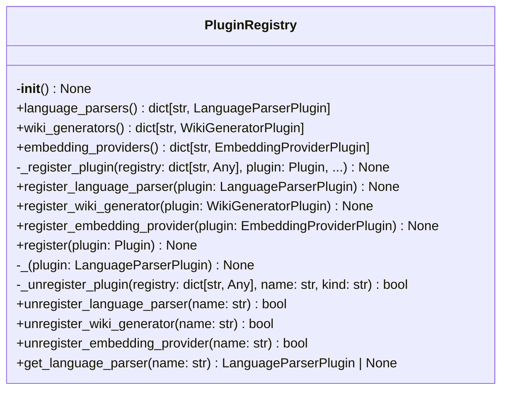

# Plugin Registry Module

## File Overview

This module implements a plugin registry system for managing language parsers, wiki generators, and embedding providers used by the local_deepwiki application. The registry provides a centralized mechanism for discovering, loading, registering, and managing plugins from multiple sources including directories, entry points, and custom locations.

The design rationale centers on creating a flexible, extensible plugin architecture that supports both built-in and third-party plugins while maintaining clean separation of concerns and proper resource cleanup.

## Key Concepts

### Plugin Registration Pattern
The registry implements a type-safe registration system using `singledispatchmethod` to automatically route plugin registration based on plugin type. This approach provides clean method dispatch while maintaining a unified registration interface.

### Plugin Discovery Strategy
The system supports multiple plugin discovery mechanisms:
- Directory scanning for Python modules
- Setuptools entry points for package-level plugins
- Repository-specific and user-specific plugin directories

This multi-source approach enables both built-in functionality and extensibility through external packages.

### Resource Management
Each plugin implements an `initialize()` and `cleanup()` method. The registry ensures proper resource cleanup during shutdown or reset operations, with exception handling to prevent one bad plugin from breaking the entire system.

### Singleton Pattern
The module provides a global registry instance using `contextvars.ContextVar`, allowing consistent access across the application while supporting test isolation through `reset_plugin_registry()`.

## Integration

This module integrates deeply with the core application architecture by:
1. **Dependency Injection**: Plugins are registered and retrieved through the global registry, enabling loose coupling between components
2. **CLI Integration**: The registry is used by CLI commands like `init_cli.py` and `update_cli.py` to discover and load plugins
3. **Configuration Flow**: Plugins are discovered and loaded during application initialization, as shown in `config/loader.py`
4. **Core Components**: The registry is used by vector store components in `core/vectorstore/embedding.py` to access embedding providers

The module imports from `local_deepwiki.plugins.base` to understand plugin interfaces and uses `importlib.metadata` for entry point discovery, making it a central hub for plugin lifecycle management.

## Design Notes

### Plugin Loading Isolation
The registry implements robust error handling during plugin loading. When a plugin fails to load, the system logs a warning and continues processing other plugins, ensuring that one faulty plugin doesn't prevent the entire system from starting.

### Version Compatibility
The entry point loading mechanism includes Python 3.9 compatibility by falling back to the older `importlib.metadata.entry_points` import method when the newer syntax isn't available, ensuring broad compatibility.

### Directory Loading Strategy
[Plugin](base.md) modules are loaded with unique names (`local_deepwiki_plugin_{stem}`) to prevent import conflicts. The registry tracks loaded modules to avoid duplicate loading, even if the same plugin is discovered multiple times.

### Cleanup Strategy
The `cleanup_all()` method ensures that all plugins are properly cleaned up in a specific order (parsers, generators, embedding providers) to maintain proper resource lifecycle management and prevent resource leaks.

### Context-Aware Singleton
Using `ContextVar` for the global registry instance allows for better testing isolation while maintaining a consistent interface for the rest of the application, supporting both single-application and multi-application scenarios.

## API Reference

### class `PluginRegistry`

Registry for discovering and managing plugins.

**Methods:**


<details>
<summary>View Source (lines 25-361) | <a href="https://github.com/UrbanDiver/local-deepwiki-mcp/blob/main/src/local_deepwiki/plugins/registry.py#L25-L361">GitHub</a></summary>

```python
class PluginRegistry:
    # Methods: __init__, language_parsers, wiki_generators, embedding_providers, _register_plugin, register_language_parser, register_wiki_generator, register_embedding_provider, register, _, _, _, _unregister_plugin, unregister_language_parser, unregister_wiki_generator, unregister_embedding_provider, get_language_parser, get_wiki_generator, get_embedding_provider, get_parser_for_extension, load_from_directory, _load_entry_point, load_from_entry_points, discover_plugins, cleanup_all, list_plugins
```

</details>

#### `__init__`

```python
def __init__() -> None
```

Initialize the plugin registry.


<details>
<summary>View Source (lines 35-40) | <a href="https://github.com/UrbanDiver/local-deepwiki-mcp/blob/main/src/local_deepwiki/plugins/registry.py#L35-L40">GitHub</a></summary>

```python
def __init__(self) -> None:
        """Initialize the plugin registry."""
        self._language_parsers: dict[str, LanguageParserPlugin] = {}
        self._wiki_generators: dict[str, WikiGeneratorPlugin] = {}
        self._embedding_providers: dict[str, EmbeddingProviderPlugin] = {}
        self._loaded_modules: set[str] = set()
```

</details>

#### `language_parsers`

```python
def language_parsers() -> dict[str, LanguageParserPlugin]
```

Get registered language parser plugins.


<details>
<summary>View Source (lines 43-45) | <a href="https://github.com/UrbanDiver/local-deepwiki-mcp/blob/main/src/local_deepwiki/plugins/registry.py#L43-L45">GitHub</a></summary>

```python
def language_parsers(self) -> dict[str, LanguageParserPlugin]:
        """Get registered language parser plugins."""
        return self._language_parsers.copy()
```

</details>

#### `wiki_generators`

```python
def wiki_generators() -> dict[str, WikiGeneratorPlugin]
```

Get registered wiki generator plugins.


<details>
<summary>View Source (lines 48-50) | <a href="https://github.com/UrbanDiver/local-deepwiki-mcp/blob/main/src/local_deepwiki/plugins/registry.py#L48-L50">GitHub</a></summary>

```python
def wiki_generators(self) -> dict[str, WikiGeneratorPlugin]:
        """Get registered wiki generator plugins."""
        return self._wiki_generators.copy()
```

</details>

#### `embedding_providers`

```python
def embedding_providers() -> dict[str, EmbeddingProviderPlugin]
```

Get registered embedding provider plugins.


<details>
<summary>View Source (lines 53-55) | <a href="https://github.com/UrbanDiver/local-deepwiki-mcp/blob/main/src/local_deepwiki/plugins/registry.py#L53-L55">GitHub</a></summary>

```python
def embedding_providers(self) -> dict[str, EmbeddingProviderPlugin]:
        """Get registered embedding provider plugins."""
        return self._embedding_providers.copy()
```

</details>

#### `register_language_parser`

```python
def register_language_parser(plugin: LanguageParserPlugin) -> None
```

Register a language parser plugin.


| Parameter | Type | Default | Description |
|-----------|------|---------|-------------|
| `plugin` | `LanguageParserPlugin` | - | - |


<details>
<summary>View Source (lines 71-75) | <a href="https://github.com/UrbanDiver/local-deepwiki-mcp/blob/main/src/local_deepwiki/plugins/registry.py#L71-L75">GitHub</a></summary>

```python
def register_language_parser(self, plugin: LanguageParserPlugin) -> None:
        """Register a language parser plugin."""
        self._register_plugin(
            self._language_parsers, plugin, "language_name", "Language parser"
        )
```

</details>

#### `register_wiki_generator`

```python
def register_wiki_generator(plugin: WikiGeneratorPlugin) -> None
```

Register a wiki generator plugin.


| Parameter | Type | Default | Description |
|-----------|------|---------|-------------|
| `plugin` | `WikiGeneratorPlugin` | - | - |


<details>
<summary>View Source (lines 77-81) | <a href="https://github.com/UrbanDiver/local-deepwiki-mcp/blob/main/src/local_deepwiki/plugins/registry.py#L77-L81">GitHub</a></summary>

```python
def register_wiki_generator(self, plugin: WikiGeneratorPlugin) -> None:
        """Register a wiki generator plugin."""
        self._register_plugin(
            self._wiki_generators, plugin, "generator_name", "Wiki generator"
        )
```

</details>

#### `register_embedding_provider`

```python
def register_embedding_provider(plugin: EmbeddingProviderPlugin) -> None
```

Register an embedding provider plugin.


| Parameter | Type | Default | Description |
|-----------|------|---------|-------------|
| `plugin` | `EmbeddingProviderPlugin` | - | - |


<details>
<summary>View Source (lines 83-87) | <a href="https://github.com/UrbanDiver/local-deepwiki-mcp/blob/main/src/local_deepwiki/plugins/registry.py#L83-L87">GitHub</a></summary>

```python
def register_embedding_provider(self, plugin: EmbeddingProviderPlugin) -> None:
        """Register an embedding provider plugin."""
        self._register_plugin(
            self._embedding_providers, plugin, "provider_name", "Embedding provider"
        )
```

</details>

#### `register`

```python
def register(plugin: Plugin) -> None
```

Register a plugin based on its type.


| Parameter | Type | Default | Description |
|-----------|------|---------|-------------|
| `plugin` | `Plugin` | - | The plugin to register. |


<details>
<summary>View Source (lines 90-99) | <a href="https://github.com/UrbanDiver/local-deepwiki-mcp/blob/main/src/local_deepwiki/plugins/registry.py#L90-L99">GitHub</a></summary>

```python
def register(self, plugin: Plugin) -> None:
        """Register a plugin based on its type.

        Args:
            plugin: The plugin to register.

        Raises:
            TypeError: If plugin type is not recognized.
        """
        raise TypeError(f"Unknown plugin type: {type(plugin)}")
```

</details>

#### `unregister_language_parser`

```python
def unregister_language_parser(name: str) -> bool
```

Unregister a language parser plugin.


| Parameter | Type | Default | Description |
|-----------|------|---------|-------------|
| `name` | `str` | - | - |


<details>
<summary>View Source (lines 123-125) | <a href="https://github.com/UrbanDiver/local-deepwiki-mcp/blob/main/src/local_deepwiki/plugins/registry.py#L123-L125">GitHub</a></summary>

```python
def unregister_language_parser(self, name: str) -> bool:
        """Unregister a language parser plugin."""
        return self._unregister_plugin(self._language_parsers, name, "language parser")
```

</details>

#### `unregister_wiki_generator`

```python
def unregister_wiki_generator(name: str) -> bool
```

Unregister a wiki generator plugin.


| Parameter | Type | Default | Description |
|-----------|------|---------|-------------|
| `name` | `str` | - | - |


<details>
<summary>View Source (lines 127-129) | <a href="https://github.com/UrbanDiver/local-deepwiki-mcp/blob/main/src/local_deepwiki/plugins/registry.py#L127-L129">GitHub</a></summary>

```python
def unregister_wiki_generator(self, name: str) -> bool:
        """Unregister a wiki generator plugin."""
        return self._unregister_plugin(self._wiki_generators, name, "wiki generator")
```

</details>

#### `unregister_embedding_provider`

```python
def unregister_embedding_provider(name: str) -> bool
```

Unregister an embedding provider plugin.


| Parameter | Type | Default | Description |
|-----------|------|---------|-------------|
| `name` | `str` | - | - |


<details>
<summary>View Source (lines 131-135) | <a href="https://github.com/UrbanDiver/local-deepwiki-mcp/blob/main/src/local_deepwiki/plugins/registry.py#L131-L135">GitHub</a></summary>

```python
def unregister_embedding_provider(self, name: str) -> bool:
        """Unregister an embedding provider plugin."""
        return self._unregister_plugin(
            self._embedding_providers, name, "embedding provider"
        )
```

</details>

#### `get_language_parser`

```python
def get_language_parser(name: str) -> LanguageParserPlugin | None
```

Get a language parser plugin by name.


| Parameter | Type | Default | Description |
|-----------|------|---------|-------------|
| `name` | `str` | - | The language name. |


<details>
<summary>View Source (lines 137-146) | <a href="https://github.com/UrbanDiver/local-deepwiki-mcp/blob/main/src/local_deepwiki/plugins/registry.py#L137-L146">GitHub</a></summary>

```python
def get_language_parser(self, name: str) -> LanguageParserPlugin | None:
        """Get a language parser plugin by name.

        Args:
            name: The language name.

        Returns:
            The plugin or None if not found.
        """
        return self._language_parsers.get(name)
```

</details>

#### `get_wiki_generator`

```python
def get_wiki_generator(name: str) -> WikiGeneratorPlugin | None
```

Get a wiki generator plugin by name.


| Parameter | Type | Default | Description |
|-----------|------|---------|-------------|
| `name` | `str` | - | The generator name. |


<details>
<summary>View Source (lines 148-157) | <a href="https://github.com/UrbanDiver/local-deepwiki-mcp/blob/main/src/local_deepwiki/plugins/registry.py#L148-L157">GitHub</a></summary>

```python
def get_wiki_generator(self, name: str) -> WikiGeneratorPlugin | None:
        """Get a wiki generator plugin by name.

        Args:
            name: The generator name.

        Returns:
            The plugin or None if not found.
        """
        return self._wiki_generators.get(name)
```

</details>

#### `get_embedding_provider`

```python
def get_embedding_provider(name: str) -> EmbeddingProviderPlugin | None
```

Get an embedding provider plugin by name.


| Parameter | Type | Default | Description |
|-----------|------|---------|-------------|
| `name` | `str` | - | The provider name. |


<details>
<summary>View Source (lines 159-168) | <a href="https://github.com/UrbanDiver/local-deepwiki-mcp/blob/main/src/local_deepwiki/plugins/registry.py#L159-L168">GitHub</a></summary>

```python
def get_embedding_provider(self, name: str) -> EmbeddingProviderPlugin | None:
        """Get an embedding provider plugin by name.

        Args:
            name: The provider name.

        Returns:
            The plugin or None if not found.
        """
        return self._embedding_providers.get(name)
```

</details>

#### `get_parser_for_extension`

```python
def get_parser_for_extension(extension: str) -> LanguageParserPlugin | None
```

Find a language parser plugin that handles a file extension.


| Parameter | Type | Default | Description |
|-----------|------|---------|-------------|
| `extension` | `str` | - | The file extension (with dot, e.g., '.scala'). |


<details>
<summary>View Source (lines 170-183) | <a href="https://github.com/UrbanDiver/local-deepwiki-mcp/blob/main/src/local_deepwiki/plugins/registry.py#L170-L183">GitHub</a></summary>

```python
def get_parser_for_extension(self, extension: str) -> LanguageParserPlugin | None:
        """Find a language parser plugin that handles a file extension.

        Args:
            extension: The file extension (with dot, e.g., '.scala').

        Returns:
            The plugin or None if no plugin handles this extension.
        """
        ext_lower = extension.lower()
        for plugin in self._language_parsers.values():
            if ext_lower in [e.lower() for e in plugin.file_extensions]:
                return plugin
        return None
```

</details>

#### `load_from_directory`

```python
def load_from_directory(directory: Path) -> int
```

Load plugins from a directory.  Looks for Python files in the directory and imports them. [Plugin](base.md) files should register themselves using the global registry.


| Parameter | Type | Default | Description |
|-----------|------|---------|-------------|
| `directory` | `Path` | - | Path to the plugins directory. |


<details>
<summary>View Source (lines 185-227) | <a href="https://github.com/UrbanDiver/local-deepwiki-mcp/blob/main/src/local_deepwiki/plugins/registry.py#L185-L227">GitHub</a></summary>

```python
def load_from_directory(self, directory: Path) -> int:
        """Load plugins from a directory.

        Looks for Python files in the directory and imports them.
        Plugin files should register themselves using the global registry.

        Args:
            directory: Path to the plugins directory.

        Returns:
            Number of plugins loaded.
        """
        if not directory.exists() or not directory.is_dir():
            return 0

        loaded = 0
        for py_file in directory.glob("*.py"):
            if py_file.name.startswith("_"):
                continue

            module_name = f"local_deepwiki_plugin_{py_file.stem}"
            if module_name in self._loaded_modules:
                logger.debug("Plugin module already loaded: %s", module_name)
                continue

            try:
                spec = importlib.util.spec_from_file_location(module_name, py_file)
                if spec is None or spec.loader is None:
                    logger.warning("Could not load plugin spec: %s", py_file)
                    continue

                module = importlib.util.module_from_spec(spec)
                sys.modules[module_name] = module
                spec.loader.exec_module(module)

                self._loaded_modules.add(module_name)
                loaded += 1
                logger.debug("Loaded plugin module: %s", py_file.name)

            except Exception as e:  # noqa: BLE001 — plugin isolation: one bad plugin must not crash the system
                logger.warning("Failed to load plugin %s: %s", py_file, e)

        return loaded
```

</details>

#### `load_from_entry_points`

```python
def load_from_entry_points() -> int
```

Load plugins from setuptools entry points.  Discovers plugins registered via pyproject.toml or setup.py entry points in the local_deepwiki.plugins.* groups.


<details>
<summary>View Source (lines 243-277) | <a href="https://github.com/UrbanDiver/local-deepwiki-mcp/blob/main/src/local_deepwiki/plugins/registry.py#L243-L277">GitHub</a></summary>

```python
def load_from_entry_points(self) -> int:
        """Load plugins from setuptools entry points.

        Discovers plugins registered via pyproject.toml or setup.py
        entry points in the local_deepwiki.plugins.* groups.

        Returns:
            Number of plugins loaded.
        """
        loaded = 0

        try:
            if sys.version_info >= (3, 10):
                from importlib.metadata import entry_points

                for group in self.ENTRY_POINT_GROUPS.values():
                    for ep in entry_points(group=group):
                        if self._load_entry_point(ep):
                            loaded += 1
            else:
                # Python 3.9 compatibility
                from importlib.metadata import entry_points as get_entry_points

                all_eps = get_entry_points()
                for group in self.ENTRY_POINT_GROUPS.values():
                    if group not in all_eps:
                        continue
                    for ep in all_eps[group]:
                        if self._load_entry_point(ep):
                            loaded += 1

        except ImportError:
            logger.debug("importlib.metadata not available, skipping entry points")

        return loaded
```

</details>

#### `discover_plugins`

```python
def discover_plugins(repo_path: Path | None = None, custom_dir: Path | None = None) -> int
```

Discover and load plugins from all sources.  Searches in order: 1. Custom directory (if specified) 2. Repository's .deepwiki/plugins/ directory 3. User's ~/.config/local-deepwiki/plugins/ 4. Setuptools entry points


| Parameter | Type | Default | Description |
|-----------|------|---------|-------------|
| `repo_path` | `Path | None` | `None` | Optional repository path for project-specific plugins. |
| `custom_dir` | `Path | None` | `None` | Optional custom plugins directory. |


<details>
<summary>View Source (lines 279-324) | <a href="https://github.com/UrbanDiver/local-deepwiki-mcp/blob/main/src/local_deepwiki/plugins/registry.py#L279-L324">GitHub</a></summary>

```python
def discover_plugins(
        self,
        repo_path: Path | None = None,
        custom_dir: Path | None = None,
    ) -> int:
        """Discover and load plugins from all sources.

        Searches in order:
        1. Custom directory (if specified)
        2. Repository's .deepwiki/plugins/ directory
        3. User's ~/.config/local-deepwiki/plugins/
        4. Setuptools entry points

        Args:
            repo_path: Optional repository path for project-specific plugins.
            custom_dir: Optional custom plugins directory.

        Returns:
            Total number of plugins loaded.
        """
        loaded = 0

        # 1. Custom directory
        if custom_dir:
            loaded += self.load_from_directory(custom_dir)

        # 2. Repository plugins
        if repo_path:
            repo_plugins = repo_path / ".deepwiki" / "plugins"
            loaded += self.load_from_directory(repo_plugins)

        # 3. User plugins
        user_plugins = Path.home() / ".config" / "local-deepwiki" / "plugins"
        loaded += self.load_from_directory(user_plugins)

        # 4. Entry points
        loaded += self.load_from_entry_points()

        logger.info(
            "Plugin discovery complete: %d parsers, %d generators, %d embedding providers",
            len(self._language_parsers),
            len(self._wiki_generators),
            len(self._embedding_providers),
        )

        return loaded
```

</details>

#### `cleanup_all`

```python
def cleanup_all() -> None
```

Clean up all registered plugins.


<details>
<summary>View Source (lines 326-349) | <a href="https://github.com/UrbanDiver/local-deepwiki-mcp/blob/main/src/local_deepwiki/plugins/registry.py#L326-L349">GitHub</a></summary>

```python
def cleanup_all(self) -> None:
        """Clean up all registered plugins."""
        for plugin in self._language_parsers.values():
            try:
                plugin.cleanup()
            except Exception as e:  # noqa: BLE001 — plugin isolation: one bad plugin must not crash the system
                logger.warning("Error cleaning up parser plugin: %s", e)

        for gen_plugin in self._wiki_generators.values():
            try:
                gen_plugin.cleanup()
            except Exception as e:  # noqa: BLE001 — plugin isolation: one bad plugin must not crash the system
                logger.warning("Error cleaning up generator plugin: %s", e)

        for emb_plugin in self._embedding_providers.values():
            try:
                emb_plugin.cleanup()
            except Exception as e:  # noqa: BLE001 — plugin isolation: one bad plugin must not crash the system
                logger.warning("Error cleaning up embedding plugin: %s", e)

        self._language_parsers.clear()
        self._wiki_generators.clear()
        self._embedding_providers.clear()
        self._loaded_modules.clear()
```

</details>

#### `list_plugins`

```python
def list_plugins() -> dict[str, list[str]]
```

List all registered plugins by type.


---


<details>
<summary>View Source (lines 351-361) | <a href="https://github.com/UrbanDiver/local-deepwiki-mcp/blob/main/src/local_deepwiki/plugins/registry.py#L351-L361">GitHub</a></summary>

```python
def list_plugins(self) -> dict[str, list[str]]:
        """List all registered plugins by type.

        Returns:
            Dict mapping plugin type to list of plugin names.
        """
        return {
            "language_parsers": list(self._language_parsers.keys()),
            "wiki_generators": list(self._wiki_generators.keys()),
            "embedding_providers": list(self._embedding_providers.keys()),
        }
```

</details>

### Functions

#### `get_plugin_registry`

```python
def get_plugin_registry() -> PluginRegistry
```

Get the global plugin registry instance.

**Returns:** `PluginRegistry`


<details>
<summary>View Source (lines 368-378) | <a href="https://github.com/UrbanDiver/local-deepwiki-mcp/blob/main/src/local_deepwiki/plugins/registry.py#L368-L378">GitHub</a></summary>

```python
def get_plugin_registry() -> PluginRegistry:
    """Get the global plugin registry instance.

    Returns:
        The global PluginRegistry singleton.
    """
    val = _registry_var.get()
    if val is None:
        val = PluginRegistry()
        _registry_var.set(val)
    return val
```

</details>

#### `reset_plugin_registry`

```python
def reset_plugin_registry() -> None
```

Reset the global plugin registry.  Useful for testing.

**Returns:** `None`


<details>
<summary>View Source (lines 381-389) | <a href="https://github.com/UrbanDiver/local-deepwiki-mcp/blob/main/src/local_deepwiki/plugins/registry.py#L381-L389">GitHub</a></summary>

```python
def reset_plugin_registry() -> None:
    """Reset the global plugin registry.

    Useful for testing.
    """
    val = _registry_var.get()
    if val is not None:
        val.cleanup_all()
    _registry_var.set(None)
```

</details>

## Class Diagram



## Call Graph

```mermaid
flowchart TD
    N0[PluginRegistry]
    N1[PluginRegistry._]
    N2[PluginRegistry._load_entry_...]
    N3[PluginRegistry._register_pl...]
    N4[PluginRegistry._unregister_...]
    N5[PluginRegistry.discover_plu...]
    N6[PluginRegistry.embedding_pr...]
    N7[PluginRegistry.language_par...]
    N8[PluginRegistry.load_from_di...]
    N9[PluginRegistry.load_from_en...]
    N10[PluginRegistry.register]
    N11[PluginRegistry.register_emb...]
    N12[PluginRegistry.register_lan...]
    N13[PluginRegistry.register_wik...]
    N14[PluginRegistry.unregister_e...]
    N15[PluginRegistry.unregister_l...]
    N16[PluginRegistry.unregister_w...]
    N17[PluginRegistry.wiki_generators]
    N18[TypeError]
    N19[_register_plugin]
    N20[_unregister_plugin]
    N21[cleanup]
    N22[cleanup_all]
    N23[copy]
    N24[exists]
    N25[get_plugin_registry]
    N26[initialize]
    N27[is_dir]
    N28[register_embedding_provider]
    N29[reset_plugin_registry]
    N25 --> N0
    N29 --> N22
    N7 --> N23
    N17 --> N23
    N6 --> N23
    N3 --> N26
    N12 --> N19
    N13 --> N19
    N11 --> N19
    N10 --> N18
    N1 --> N28
    N4 --> N21
    N15 --> N20
    N16 --> N20
    N14 --> N20
    N8 --> N24
    N8 --> N27
    classDef func fill:#e1f5fe
    class N0,N18,N19,N20,N21,N22,N23,N24,N25,N26,N27,N28,N29 func
    classDef method fill:#fff3e0
    class N1,N2,N3,N4,N5,N6,N7,N8,N9,N10,N11,N12,N13,N14,N15,N16,N17 method
```



## Used By

Functions and methods in this file and their callers:

- **`PluginRegistry`**: called by `get_plugin_registry`
- **`TypeError`**: called by `PluginRegistry.register`
- **`_load_entry_point`**: called by `PluginRegistry.load_from_entry_points`
- **`_register_plugin`**: called by `PluginRegistry.register_embedding_provider`, `PluginRegistry.register_language_parser`, `PluginRegistry.register_wiki_generator`
- **`_unregister_plugin`**: called by `PluginRegistry.unregister_embedding_provider`, `PluginRegistry.unregister_language_parser`, `PluginRegistry.unregister_wiki_generator`
- **`add`**: called by `PluginRegistry.load_from_directory`
- **`cleanup`**: called by `PluginRegistry._unregister_plugin`, `PluginRegistry.cleanup_all`
- **`cleanup_all`**: called by `reset_plugin_registry`
- **`copy`**: called by `PluginRegistry.embedding_providers`, `PluginRegistry.language_parsers`, `PluginRegistry.wiki_generators`
- **`entry_points`**: called by `PluginRegistry.load_from_entry_points`
- **`exec_module`**: called by `PluginRegistry.load_from_directory`
- **`exists`**: called by `PluginRegistry.load_from_directory`
- **`get_entry_points`**: called by `PluginRegistry.load_from_entry_points`
- **`glob`**: called by `PluginRegistry.load_from_directory`
- **`home`**: called by `PluginRegistry.discover_plugins`
- **`initialize`**: called by `PluginRegistry._register_plugin`
- **`is_dir`**: called by `PluginRegistry.load_from_directory`
- **`load`**: called by `PluginRegistry._load_entry_point`
- **`load_from_directory`**: called by `PluginRegistry.discover_plugins`
- **`load_from_entry_points`**: called by `PluginRegistry.discover_plugins`
- **`module_from_spec`**: called by `PluginRegistry.load_from_directory`
- **`plugin_class`**: called by `PluginRegistry._load_entry_point`
- **`register`**: called by `PluginRegistry._load_entry_point`
- **`register_embedding_provider`**: called by `PluginRegistry._`
- **`spec_from_file_location`**: called by `PluginRegistry.load_from_directory`

## Last Modified

| Entity | Type | Author | Date | Commit |
|--------|------|--------|------|--------|
| `PluginRegistry` | class | Brian Breidenbach | today | `2bc1322` refactor: extract generic r... |
| `_register_plugin` | method | Brian Breidenbach | today | `2bc1322` refactor: extract generic r... |
| `register_language_parser` | method | Brian Breidenbach | today | `2bc1322` refactor: extract generic r... |
| `register_wiki_generator` | method | Brian Breidenbach | today | `2bc1322` refactor: extract generic r... |
| `register_embedding_provider` | method | Brian Breidenbach | today | `2bc1322` refactor: extract generic r... |
| `_unregister_plugin` | method | Brian Breidenbach | today | `2bc1322` refactor: extract generic r... |
| `unregister_language_parser` | method | Brian Breidenbach | today | `2bc1322` refactor: extract generic r... |
| `unregister_wiki_generator` | method | Brian Breidenbach | today | `2bc1322` refactor: extract generic r... |
| `unregister_embedding_provider` | method | Brian Breidenbach | today | `2bc1322` refactor: extract generic r... |
| `_load_entry_point` | method | Brian Breidenbach | 4 days ago | `ca3ccca` refactor: flatten deep nest... |
| `load_from_entry_points` | method | Brian Breidenbach | 4 days ago | `ca3ccca` refactor: flatten deep nest... |
| `load_from_directory` | method | Brian Breidenbach | Feb 23, 2026 | `a662e1a` refactor: reduce complexity... |
| `cleanup_all` | method | Brian Breidenbach | Feb 23, 2026 | `a662e1a` refactor: reduce complexity... |
| `__init__` | method | Brian Breidenbach | Feb 23, 2026 | `c6fe2bd` refactor: split oversized m... |
| `get_plugin_registry` | function | Brian Breidenbach | Feb 22, 2026 | `78abcdc` refactor: replace global si... |
| `reset_plugin_registry` | function | Brian Breidenbach | Feb 22, 2026 | `78abcdc` refactor: replace global si... |
| `register` | method | Brian Breidenbach | Feb 21, 2026 | `01e8359` refactor: add __all__, dict... |
| `_` | method | Brian Breidenbach | Feb 21, 2026 | `01e8359` refactor: add __all__, dict... |
| `_` | method | Brian Breidenbach | Feb 21, 2026 | `01e8359` refactor: add __all__, dict... |
| `_` | method | Brian Breidenbach | Feb 21, 2026 | `01e8359` refactor: add __all__, dict... |
| `discover_plugins` | method | Brian Breidenbach | Feb 20, 2026 | `b807417` refactor: high-priority Pyt... |
| `language_parsers` | method | Brian Breidenbach | Jan 25, 2026 | `f2db999` Add plugin system for exten... |
| `wiki_generators` | method | Brian Breidenbach | Jan 25, 2026 | `f2db999` Add plugin system for exten... |
| `embedding_providers` | method | Brian Breidenbach | Jan 25, 2026 | `f2db999` Add plugin system for exten... |
| `get_language_parser` | method | Brian Breidenbach | Jan 25, 2026 | `f2db999` Add plugin system for exten... |
| `get_wiki_generator` | method | Brian Breidenbach | Jan 25, 2026 | `f2db999` Add plugin system for exten... |
| `get_embedding_provider` | method | Brian Breidenbach | Jan 25, 2026 | `f2db999` Add plugin system for exten... |
| `get_parser_for_extension` | method | Brian Breidenbach | Jan 25, 2026 | `f2db999` Add plugin system for exten... |
| `list_plugins` | method | Brian Breidenbach | Jan 25, 2026 | `f2db999` Add plugin system for exten... |

## Additional Source Code

Source code for functions and methods not listed in the API Reference above.

#### `_register_plugin`

<details>
<summary>View Source (lines 57-69) | <a href="https://github.com/UrbanDiver/local-deepwiki-mcp/blob/main/src/local_deepwiki/plugins/registry.py#L57-L69">GitHub</a></summary>

```python
def _register_plugin(
        self,
        registry: dict[str, Any],
        plugin: Plugin,
        name_attr: str,
        kind: str,
    ) -> None:
        name = getattr(plugin, name_attr)
        if name in registry:
            logger.warning("%s '%s' already registered, overwriting", kind, name)
        registry[name] = plugin
        plugin.initialize()
        logger.info("Registered %s plugin: %s", kind, plugin.metadata)
```

</details>


#### `_`

<details>
<summary>View Source (lines 102-103) | <a href="https://github.com/UrbanDiver/local-deepwiki-mcp/blob/main/src/local_deepwiki/plugins/registry.py#L102-L103">GitHub</a></summary>

```python
def _(self, plugin: LanguageParserPlugin) -> None:
        self.register_language_parser(plugin)
```

</details>


#### `_`

<details>
<summary>View Source (lines 106-107) | <a href="https://github.com/UrbanDiver/local-deepwiki-mcp/blob/main/src/local_deepwiki/plugins/registry.py#L106-L107">GitHub</a></summary>

```python
def _(self, plugin: WikiGeneratorPlugin) -> None:
        self.register_wiki_generator(plugin)
```

</details>


#### `_`

<details>
<summary>View Source (lines 110-111) | <a href="https://github.com/UrbanDiver/local-deepwiki-mcp/blob/main/src/local_deepwiki/plugins/registry.py#L110-L111">GitHub</a></summary>

```python
def _(self, plugin: EmbeddingProviderPlugin) -> None:
        self.register_embedding_provider(plugin)
```

</details>


#### `_unregister_plugin`

<details>
<summary>View Source (lines 113-121) | <a href="https://github.com/UrbanDiver/local-deepwiki-mcp/blob/main/src/local_deepwiki/plugins/registry.py#L113-L121">GitHub</a></summary>

```python
def _unregister_plugin(
        self, registry: dict[str, Any], name: str, kind: str
    ) -> bool:
        if name in registry:
            plugin = registry.pop(name)
            plugin.cleanup()
            logger.info("Unregistered %s: %s", kind, name)
            return True
        return False
```

</details>


#### `_load_entry_point`

<details>
<summary>View Source (lines 229-241) | <a href="https://github.com/UrbanDiver/local-deepwiki-mcp/blob/main/src/local_deepwiki/plugins/registry.py#L229-L241">GitHub</a></summary>

```python
def _load_entry_point(self, ep: Any) -> bool:
        """Try to load and register a single entry point plugin.

        Returns True on success, False on failure.
        """
        try:
            plugin_class = ep.load()
            plugin = plugin_class()
            self.register(plugin)
            return True
        except Exception as e:  # noqa: BLE001 — plugin isolation: one bad plugin must not crash the system
            logger.warning("Failed to load entry point %s: %s", ep.name, e)
            return False
```

</details>

## Relevant Source Files

- `src/local_deepwiki/plugins/registry.py:25-361`
