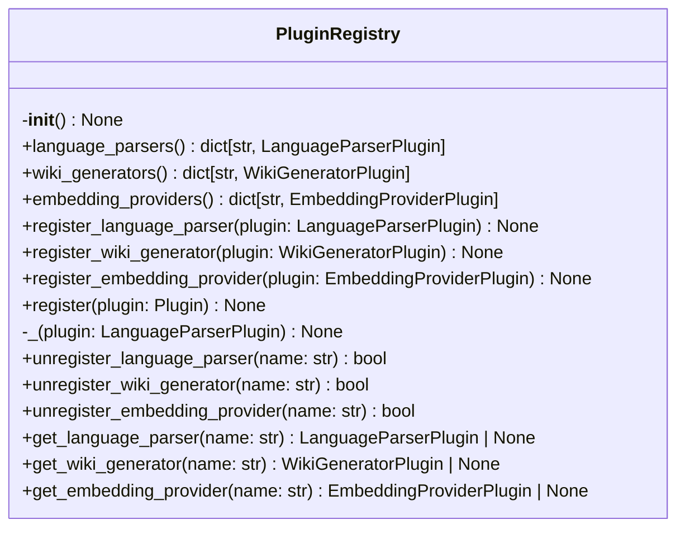

# File: `src/local_deepwiki/plugins/registry.py`

## File Overview

This file implements a plugin registry system for managing various types of plugins used by the `local_deepwiki` application. It provides a centralized mechanism to discover, load, register, and manage plugins such as language parsers, wiki generators, and embedding providers.

The registry supports loading plugins from multiple sources:
- Direct Python files in a directory
- Setuptools entry points defined in `pyproject.toml` or `setup.py`

This design enables extensibility and modularity, allowing third-party developers to contribute plugins without modifying the core application code.

## Key Concepts

### Plugin Registry Pattern
The `PluginRegistry` class implements a singleton pattern using `ContextVar` to maintain a global instance. This ensures that all parts of the application can access the same plugin registry, which is essential for consistent plugin management across the system.

### Plugin Type Dispatching
The registry uses `singledispatchmethod` to dynamically dispatch registration based on plugin type. This allows the system to register different plugin types (language parsers, wiki generators, embedding providers) with appropriate logic while keeping a unified interface for registration.

### Plugin Discovery and Loading
The system supports multiple plugin discovery mechanisms:
- Directory scanning for `.py` files
- Setuptools entry points for external plugins
- Repository-specific and user-specific plugin directories

This multi-source approach allows for flexible plugin installation and configuration, supporting both built-in and user-installed plugins.

### Plugin Lifecycle Management
Each plugin type supports initialization (`initialize()`) and cleanup (`cleanup()`) methods. The registry ensures proper lifecycle management during registration and shutdown, including global cleanup via `cleanup_all()`.

## Integration

### With the Application
The `PluginRegistry` is used throughout the `local_deepwiki` application to:
- Load plugins during startup via `discover_plugins()`
- Retrieve specific plugins for processing content
- Manage plugin lifecycle during application shutdown

### With External Components
This file integrates with:
- `local_deepwiki.plugins.base`: Provides the base plugin classes that are registered and managed
- `local_deepwiki.logging`: Uses logging for plugin discovery, registration, and error handling
- `importlib.metadata`: Enables loading plugins from setuptools entry points

### Testing
The global registry instance is exposed via `get_plugin_registry()` and can be reset via `reset_plugin_registry()`, making it easy to isolate tests and ensure clean state between test runs.

## Design Notes

### Singleton with ContextVar
The registry uses `ContextVar` to implement a global singleton. This approach allows for better testing and context isolation, especially in asynchronous environments where multiple contexts might need separate plugin registries.

### Plugin Isolation
[Plugin](base.md) loading is wrapped in try/except blocks to ensure that a single failing plugin does not crash the entire system. This is crucial for robustness in plugin-heavy environments.

### Directory Loading Strategy
When loading plugins from directories, the system:
- Skips files starting with `_` to avoid loading internal modules
- Uses unique module names to prevent duplicate loading
- Logs warnings for failed plugin loads rather than crashing

### Entry Point Compatibility
The system handles Python version differences when loading entry points, supporting both Python 3.10+ (using `importlib.metadata.entry_points`) and Python 3.9 (using `importlib.metadata.entry_points as get_entry_points`).

### Plugin Cleanup Strategy
The `cleanup_all()` method ensures that all registered plugins are properly cleaned up, calling `cleanup()` on each plugin and clearing internal data structures. This prevents resource leaks and ensures proper shutdown behavior.

### Extension-Based Plugin Selection
The `get_parser_for_extension()` method allows finding a language parser by file extension, enabling automatic plugin selection based on file type. This improves usability by reducing explicit plugin selection requirements.

## API Reference

### class `PluginRegistry`

Registry for discovering and managing plugins.

**Methods:**


<details>
<summary>View Source (lines 25-394) | <a href="https://github.com/UrbanDiver/local-deepwiki-mcp/blob/main/src/local_deepwiki/plugins/registry.py#L25-L394">GitHub</a></summary>

```python
class PluginRegistry:
    # Methods: __init__, language_parsers, wiki_generators, embedding_providers, register_language_parser, register_wiki_generator, register_embedding_provider, register, _, _, _, unregister_language_parser, unregister_wiki_generator, unregister_embedding_provider, get_language_parser, get_wiki_generator, get_embedding_provider, get_parser_for_extension, load_from_directory, _load_entry_point, load_from_entry_points, discover_plugins, cleanup_all, list_plugins
```

</details>

#### `__init__`

```python
def __init__() -> None
```

Initialize the plugin registry.


<details>
<summary>View Source (lines 35-40) | <a href="https://github.com/UrbanDiver/local-deepwiki-mcp/blob/main/src/local_deepwiki/plugins/registry.py#L35-L40">GitHub</a></summary>

```python
def __init__(self) -> None:
        """Initialize the plugin registry."""
        self._language_parsers: dict[str, LanguageParserPlugin] = {}
        self._wiki_generators: dict[str, WikiGeneratorPlugin] = {}
        self._embedding_providers: dict[str, EmbeddingProviderPlugin] = {}
        self._loaded_modules: set[str] = set()
```

</details>

#### `language_parsers`

```python
def language_parsers() -> dict[str, LanguageParserPlugin]
```

Get registered language parser plugins.


<details>
<summary>View Source (lines 43-45) | <a href="https://github.com/UrbanDiver/local-deepwiki-mcp/blob/main/src/local_deepwiki/plugins/registry.py#L43-L45">GitHub</a></summary>

```python
def language_parsers(self) -> dict[str, LanguageParserPlugin]:
        """Get registered language parser plugins."""
        return self._language_parsers.copy()
```

</details>

#### `wiki_generators`

```python
def wiki_generators() -> dict[str, WikiGeneratorPlugin]
```

Get registered wiki generator plugins.


<details>
<summary>View Source (lines 48-50) | <a href="https://github.com/UrbanDiver/local-deepwiki-mcp/blob/main/src/local_deepwiki/plugins/registry.py#L48-L50">GitHub</a></summary>

```python
def wiki_generators(self) -> dict[str, WikiGeneratorPlugin]:
        """Get registered wiki generator plugins."""
        return self._wiki_generators.copy()
```

</details>

#### `embedding_providers`

```python
def embedding_providers() -> dict[str, EmbeddingProviderPlugin]
```

Get registered embedding provider plugins.


<details>
<summary>View Source (lines 53-55) | <a href="https://github.com/UrbanDiver/local-deepwiki-mcp/blob/main/src/local_deepwiki/plugins/registry.py#L53-L55">GitHub</a></summary>

```python
def embedding_providers(self) -> dict[str, EmbeddingProviderPlugin]:
        """Get registered embedding provider plugins."""
        return self._embedding_providers.copy()
```

</details>

#### `register_language_parser`

```python
def register_language_parser(plugin: LanguageParserPlugin) -> None
```

Register a language parser plugin.


| Parameter | Type | Default | Description |
|-----------|------|---------|-------------|
| `plugin` | `LanguageParserPlugin` | - | The plugin to register. |


<details>
<summary>View Source (lines 57-68) | <a href="https://github.com/UrbanDiver/local-deepwiki-mcp/blob/main/src/local_deepwiki/plugins/registry.py#L57-L68">GitHub</a></summary>

```python
def register_language_parser(self, plugin: LanguageParserPlugin) -> None:
        """Register a language parser plugin.

        Args:
            plugin: The plugin to register.
        """
        name = plugin.language_name
        if name in self._language_parsers:
            logger.warning("Language parser '%s' already registered, overwriting", name)
        self._language_parsers[name] = plugin
        plugin.initialize()
        logger.info("Registered language parser plugin: %s", plugin.metadata)
```

</details>

#### `register_wiki_generator`

```python
def register_wiki_generator(plugin: WikiGeneratorPlugin) -> None
```

Register a wiki generator plugin.


| Parameter | Type | Default | Description |
|-----------|------|---------|-------------|
| `plugin` | `WikiGeneratorPlugin` | - | The plugin to register. |


<details>
<summary>View Source (lines 70-81) | <a href="https://github.com/UrbanDiver/local-deepwiki-mcp/blob/main/src/local_deepwiki/plugins/registry.py#L70-L81">GitHub</a></summary>

```python
def register_wiki_generator(self, plugin: WikiGeneratorPlugin) -> None:
        """Register a wiki generator plugin.

        Args:
            plugin: The plugin to register.
        """
        name = plugin.generator_name
        if name in self._wiki_generators:
            logger.warning("Wiki generator '%s' already registered, overwriting", name)
        self._wiki_generators[name] = plugin
        plugin.initialize()
        logger.info("Registered wiki generator plugin: %s", plugin.metadata)
```

</details>

#### `register_embedding_provider`

```python
def register_embedding_provider(plugin: EmbeddingProviderPlugin) -> None
```

Register an embedding provider plugin.


| Parameter | Type | Default | Description |
|-----------|------|---------|-------------|
| `plugin` | `EmbeddingProviderPlugin` | - | The plugin to register. |


<details>
<summary>View Source (lines 83-96) | <a href="https://github.com/UrbanDiver/local-deepwiki-mcp/blob/main/src/local_deepwiki/plugins/registry.py#L83-L96">GitHub</a></summary>

```python
def register_embedding_provider(self, plugin: EmbeddingProviderPlugin) -> None:
        """Register an embedding provider plugin.

        Args:
            plugin: The plugin to register.
        """
        name = plugin.provider_name
        if name in self._embedding_providers:
            logger.warning(
                "Embedding provider '%s' already registered, overwriting", name
            )
        self._embedding_providers[name] = plugin
        plugin.initialize()
        logger.info("Registered embedding provider plugin: %s", plugin.metadata)
```

</details>

#### `register`

```python
def register(plugin: Plugin) -> None
```

Register a plugin based on its type.


| Parameter | Type | Default | Description |
|-----------|------|---------|-------------|
| `plugin` | `Plugin` | - | The plugin to register. |


<details>
<summary>View Source (lines 99-108) | <a href="https://github.com/UrbanDiver/local-deepwiki-mcp/blob/main/src/local_deepwiki/plugins/registry.py#L99-L108">GitHub</a></summary>

```python
def register(self, plugin: Plugin) -> None:
        """Register a plugin based on its type.

        Args:
            plugin: The plugin to register.

        Raises:
            TypeError: If plugin type is not recognized.
        """
        raise TypeError(f"Unknown plugin type: {type(plugin)}")
```

</details>

#### `unregister_language_parser`

```python
def unregister_language_parser(name: str) -> bool
```

Unregister a language parser plugin.


| Parameter | Type | Default | Description |
|-----------|------|---------|-------------|
| `name` | `str` | - | The language name. |


<details>
<summary>View Source (lines 122-136) | <a href="https://github.com/UrbanDiver/local-deepwiki-mcp/blob/main/src/local_deepwiki/plugins/registry.py#L122-L136">GitHub</a></summary>

```python
def unregister_language_parser(self, name: str) -> bool:
        """Unregister a language parser plugin.

        Args:
            name: The language name.

        Returns:
            True if plugin was unregistered, False if not found.
        """
        if name in self._language_parsers:
            plugin = self._language_parsers.pop(name)
            plugin.cleanup()
            logger.info("Unregistered language parser: %s", name)
            return True
        return False
```

</details>

#### `unregister_wiki_generator`

```python
def unregister_wiki_generator(name: str) -> bool
```

Unregister a wiki generator plugin.


| Parameter | Type | Default | Description |
|-----------|------|---------|-------------|
| `name` | `str` | - | The generator name. |


<details>
<summary>View Source (lines 138-152) | <a href="https://github.com/UrbanDiver/local-deepwiki-mcp/blob/main/src/local_deepwiki/plugins/registry.py#L138-L152">GitHub</a></summary>

```python
def unregister_wiki_generator(self, name: str) -> bool:
        """Unregister a wiki generator plugin.

        Args:
            name: The generator name.

        Returns:
            True if plugin was unregistered, False if not found.
        """
        if name in self._wiki_generators:
            plugin = self._wiki_generators.pop(name)
            plugin.cleanup()
            logger.info("Unregistered wiki generator: %s", name)
            return True
        return False
```

</details>

#### `unregister_embedding_provider`

```python
def unregister_embedding_provider(name: str) -> bool
```

Unregister an embedding provider plugin.


| Parameter | Type | Default | Description |
|-----------|------|---------|-------------|
| `name` | `str` | - | The provider name. |


<details>
<summary>View Source (lines 154-168) | <a href="https://github.com/UrbanDiver/local-deepwiki-mcp/blob/main/src/local_deepwiki/plugins/registry.py#L154-L168">GitHub</a></summary>

```python
def unregister_embedding_provider(self, name: str) -> bool:
        """Unregister an embedding provider plugin.

        Args:
            name: The provider name.

        Returns:
            True if plugin was unregistered, False if not found.
        """
        if name in self._embedding_providers:
            plugin = self._embedding_providers.pop(name)
            plugin.cleanup()
            logger.info("Unregistered embedding provider: %s", name)
            return True
        return False
```

</details>

#### `get_language_parser`

```python
def get_language_parser(name: str) -> LanguageParserPlugin | None
```

Get a language parser plugin by name.


| Parameter | Type | Default | Description |
|-----------|------|---------|-------------|
| `name` | `str` | - | The language name. |


<details>
<summary>View Source (lines 170-179) | <a href="https://github.com/UrbanDiver/local-deepwiki-mcp/blob/main/src/local_deepwiki/plugins/registry.py#L170-L179">GitHub</a></summary>

```python
def get_language_parser(self, name: str) -> LanguageParserPlugin | None:
        """Get a language parser plugin by name.

        Args:
            name: The language name.

        Returns:
            The plugin or None if not found.
        """
        return self._language_parsers.get(name)
```

</details>

#### `get_wiki_generator`

```python
def get_wiki_generator(name: str) -> WikiGeneratorPlugin | None
```

Get a wiki generator plugin by name.


| Parameter | Type | Default | Description |
|-----------|------|---------|-------------|
| `name` | `str` | - | The generator name. |


<details>
<summary>View Source (lines 181-190) | <a href="https://github.com/UrbanDiver/local-deepwiki-mcp/blob/main/src/local_deepwiki/plugins/registry.py#L181-L190">GitHub</a></summary>

```python
def get_wiki_generator(self, name: str) -> WikiGeneratorPlugin | None:
        """Get a wiki generator plugin by name.

        Args:
            name: The generator name.

        Returns:
            The plugin or None if not found.
        """
        return self._wiki_generators.get(name)
```

</details>

#### `get_embedding_provider`

```python
def get_embedding_provider(name: str) -> EmbeddingProviderPlugin | None
```

Get an embedding provider plugin by name.


| Parameter | Type | Default | Description |
|-----------|------|---------|-------------|
| `name` | `str` | - | The provider name. |


<details>
<summary>View Source (lines 192-201) | <a href="https://github.com/UrbanDiver/local-deepwiki-mcp/blob/main/src/local_deepwiki/plugins/registry.py#L192-L201">GitHub</a></summary>

```python
def get_embedding_provider(self, name: str) -> EmbeddingProviderPlugin | None:
        """Get an embedding provider plugin by name.

        Args:
            name: The provider name.

        Returns:
            The plugin or None if not found.
        """
        return self._embedding_providers.get(name)
```

</details>

#### `get_parser_for_extension`

```python
def get_parser_for_extension(extension: str) -> LanguageParserPlugin | None
```

Find a language parser plugin that handles a file extension.


| Parameter | Type | Default | Description |
|-----------|------|---------|-------------|
| `extension` | `str` | - | The file extension (with dot, e.g., '.scala'). |


<details>
<summary>View Source (lines 203-216) | <a href="https://github.com/UrbanDiver/local-deepwiki-mcp/blob/main/src/local_deepwiki/plugins/registry.py#L203-L216">GitHub</a></summary>

```python
def get_parser_for_extension(self, extension: str) -> LanguageParserPlugin | None:
        """Find a language parser plugin that handles a file extension.

        Args:
            extension: The file extension (with dot, e.g., '.scala').

        Returns:
            The plugin or None if no plugin handles this extension.
        """
        ext_lower = extension.lower()
        for plugin in self._language_parsers.values():
            if ext_lower in [e.lower() for e in plugin.file_extensions]:
                return plugin
        return None
```

</details>

#### `load_from_directory`

```python
def load_from_directory(directory: Path) -> int
```

Load plugins from a directory.  Looks for Python files in the directory and imports them. [Plugin](base.md) files should register themselves using the global registry.


| Parameter | Type | Default | Description |
|-----------|------|---------|-------------|
| `directory` | `Path` | - | Path to the plugins directory. |


<details>
<summary>View Source (lines 218-260) | <a href="https://github.com/UrbanDiver/local-deepwiki-mcp/blob/main/src/local_deepwiki/plugins/registry.py#L218-L260">GitHub</a></summary>

```python
def load_from_directory(self, directory: Path) -> int:
        """Load plugins from a directory.

        Looks for Python files in the directory and imports them.
        Plugin files should register themselves using the global registry.

        Args:
            directory: Path to the plugins directory.

        Returns:
            Number of plugins loaded.
        """
        if not directory.exists() or not directory.is_dir():
            return 0

        loaded = 0
        for py_file in directory.glob("*.py"):
            if py_file.name.startswith("_"):
                continue

            module_name = f"local_deepwiki_plugin_{py_file.stem}"
            if module_name in self._loaded_modules:
                logger.debug("Plugin module already loaded: %s", module_name)
                continue

            try:
                spec = importlib.util.spec_from_file_location(module_name, py_file)
                if spec is None or spec.loader is None:
                    logger.warning("Could not load plugin spec: %s", py_file)
                    continue

                module = importlib.util.module_from_spec(spec)
                sys.modules[module_name] = module
                spec.loader.exec_module(module)

                self._loaded_modules.add(module_name)
                loaded += 1
                logger.debug("Loaded plugin module: %s", py_file.name)

            except Exception as e:  # noqa: BLE001 — plugin isolation: one bad plugin must not crash the system
                logger.warning("Failed to load plugin %s: %s", py_file, e)

        return loaded
```

</details>

#### `load_from_entry_points`

```python
def load_from_entry_points() -> int
```

Load plugins from setuptools entry points.  Discovers plugins registered via pyproject.toml or setup.py entry points in the local_deepwiki.plugins.* groups.


<details>
<summary>View Source (lines 276-310) | <a href="https://github.com/UrbanDiver/local-deepwiki-mcp/blob/main/src/local_deepwiki/plugins/registry.py#L276-L310">GitHub</a></summary>

```python
def load_from_entry_points(self) -> int:
        """Load plugins from setuptools entry points.

        Discovers plugins registered via pyproject.toml or setup.py
        entry points in the local_deepwiki.plugins.* groups.

        Returns:
            Number of plugins loaded.
        """
        loaded = 0

        try:
            if sys.version_info >= (3, 10):
                from importlib.metadata import entry_points

                for group in self.ENTRY_POINT_GROUPS.values():
                    for ep in entry_points(group=group):
                        if self._load_entry_point(ep):
                            loaded += 1
            else:
                # Python 3.9 compatibility
                from importlib.metadata import entry_points as get_entry_points

                all_eps = get_entry_points()
                for group in self.ENTRY_POINT_GROUPS.values():
                    if group not in all_eps:
                        continue
                    for ep in all_eps[group]:
                        if self._load_entry_point(ep):
                            loaded += 1

        except ImportError:
            logger.debug("importlib.metadata not available, skipping entry points")

        return loaded
```

</details>

#### `discover_plugins`

```python
def discover_plugins(repo_path: Path | None = None, custom_dir: Path | None = None) -> int
```

Discover and load plugins from all sources.  Searches in order: 1. Custom directory (if specified) 2. Repository's .deepwiki/plugins/ directory 3. User's ~/.config/local-deepwiki/plugins/ 4. Setuptools entry points


| Parameter | Type | Default | Description |
|-----------|------|---------|-------------|
| `repo_path` | `Path | None` | `None` | Optional repository path for project-specific plugins. |
| `custom_dir` | `Path | None` | `None` | Optional custom plugins directory. |


<details>
<summary>View Source (lines 312-357) | <a href="https://github.com/UrbanDiver/local-deepwiki-mcp/blob/main/src/local_deepwiki/plugins/registry.py#L312-L357">GitHub</a></summary>

```python
def discover_plugins(
        self,
        repo_path: Path | None = None,
        custom_dir: Path | None = None,
    ) -> int:
        """Discover and load plugins from all sources.

        Searches in order:
        1. Custom directory (if specified)
        2. Repository's .deepwiki/plugins/ directory
        3. User's ~/.config/local-deepwiki/plugins/
        4. Setuptools entry points

        Args:
            repo_path: Optional repository path for project-specific plugins.
            custom_dir: Optional custom plugins directory.

        Returns:
            Total number of plugins loaded.
        """
        loaded = 0

        # 1. Custom directory
        if custom_dir:
            loaded += self.load_from_directory(custom_dir)

        # 2. Repository plugins
        if repo_path:
            repo_plugins = repo_path / ".deepwiki" / "plugins"
            loaded += self.load_from_directory(repo_plugins)

        # 3. User plugins
        user_plugins = Path.home() / ".config" / "local-deepwiki" / "plugins"
        loaded += self.load_from_directory(user_plugins)

        # 4. Entry points
        loaded += self.load_from_entry_points()

        logger.info(
            "Plugin discovery complete: %d parsers, %d generators, %d embedding providers",
            len(self._language_parsers),
            len(self._wiki_generators),
            len(self._embedding_providers),
        )

        return loaded
```

</details>

#### `cleanup_all`

```python
def cleanup_all() -> None
```

Clean up all registered plugins.


<details>
<summary>View Source (lines 359-382) | <a href="https://github.com/UrbanDiver/local-deepwiki-mcp/blob/main/src/local_deepwiki/plugins/registry.py#L359-L382">GitHub</a></summary>

```python
def cleanup_all(self) -> None:
        """Clean up all registered plugins."""
        for plugin in self._language_parsers.values():
            try:
                plugin.cleanup()
            except Exception as e:  # noqa: BLE001 — plugin isolation: one bad plugin must not crash the system
                logger.warning("Error cleaning up parser plugin: %s", e)

        for gen_plugin in self._wiki_generators.values():
            try:
                gen_plugin.cleanup()
            except Exception as e:  # noqa: BLE001 — plugin isolation: one bad plugin must not crash the system
                logger.warning("Error cleaning up generator plugin: %s", e)

        for emb_plugin in self._embedding_providers.values():
            try:
                emb_plugin.cleanup()
            except Exception as e:  # noqa: BLE001 — plugin isolation: one bad plugin must not crash the system
                logger.warning("Error cleaning up embedding plugin: %s", e)

        self._language_parsers.clear()
        self._wiki_generators.clear()
        self._embedding_providers.clear()
        self._loaded_modules.clear()
```

</details>

#### `list_plugins`

```python
def list_plugins() -> dict[str, list[str]]
```

List all registered plugins by type.


---


<details>
<summary>View Source (lines 384-394) | <a href="https://github.com/UrbanDiver/local-deepwiki-mcp/blob/main/src/local_deepwiki/plugins/registry.py#L384-L394">GitHub</a></summary>

```python
def list_plugins(self) -> dict[str, list[str]]:
        """List all registered plugins by type.

        Returns:
            Dict mapping plugin type to list of plugin names.
        """
        return {
            "language_parsers": list(self._language_parsers.keys()),
            "wiki_generators": list(self._wiki_generators.keys()),
            "embedding_providers": list(self._embedding_providers.keys()),
        }
```

</details>

### Functions

#### `get_plugin_registry`

```python
def get_plugin_registry() -> PluginRegistry
```

Get the global plugin registry instance.

**Returns:** `PluginRegistry`


<details>
<summary>View Source (lines 401-411) | <a href="https://github.com/UrbanDiver/local-deepwiki-mcp/blob/main/src/local_deepwiki/plugins/registry.py#L401-L411">GitHub</a></summary>

```python
def get_plugin_registry() -> PluginRegistry:
    """Get the global plugin registry instance.

    Returns:
        The global PluginRegistry singleton.
    """
    val = _registry_var.get()
    if val is None:
        val = PluginRegistry()
        _registry_var.set(val)
    return val
```

</details>

#### `reset_plugin_registry`

```python
def reset_plugin_registry() -> None
```

Reset the global plugin registry.  Useful for testing.

**Returns:** `None`


<details>
<summary>View Source (lines 414-422) | <a href="https://github.com/UrbanDiver/local-deepwiki-mcp/blob/main/src/local_deepwiki/plugins/registry.py#L414-L422">GitHub</a></summary>

```python
def reset_plugin_registry() -> None:
    """Reset the global plugin registry.

    Useful for testing.
    """
    val = _registry_var.get()
    if val is not None:
        val.cleanup_all()
    _registry_var.set(None)
```

</details>

## Class Diagram



## Call Graph

```mermaid
flowchart TD
    N0[PluginRegistry]
    N1[PluginRegistry._]
    N2[PluginRegistry._load_entry_...]
    N3[PluginRegistry.discover_plu...]
    N4[PluginRegistry.embedding_pr...]
    N5[PluginRegistry.language_par...]
    N6[PluginRegistry.load_from_di...]
    N7[PluginRegistry.load_from_en...]
    N8[PluginRegistry.register]
    N9[PluginRegistry.register_emb...]
    N10[PluginRegistry.register_lan...]
    N11[PluginRegistry.register_wik...]
    N12[PluginRegistry.unregister_e...]
    N13[PluginRegistry.unregister_l...]
    N14[PluginRegistry.unregister_w...]
    N15[PluginRegistry.wiki_generators]
    N16[TypeError]
    N17[cleanup]
    N18[cleanup_all]
    N19[copy]
    N20[exec_module]
    N21[exists]
    N22[get_plugin_registry]
    N23[glob]
    N24[initialize]
    N25[is_dir]
    N26[module_from_spec]
    N27[register_embedding_provider]
    N28[reset_plugin_registry]
    N29[spec_from_file_location]
    N22 --> N0
    N28 --> N18
    N5 --> N19
    N15 --> N19
    N4 --> N19
    N10 --> N24
    N11 --> N24
    N9 --> N24
    N8 --> N16
    N1 --> N27
    N13 --> N17
    N14 --> N17
    N12 --> N17
    N6 --> N21
    N6 --> N25
    N6 --> N23
    N6 --> N29
    N6 --> N26
    N6 --> N20
    classDef func fill:#e1f5fe
    class N0,N16,N17,N18,N19,N20,N21,N22,N23,N24,N25,N26,N27,N28,N29 func
    classDef method fill:#fff3e0
    class N1,N2,N3,N4,N5,N6,N7,N8,N9,N10,N11,N12,N13,N14,N15 method
```



## Used By

Functions and methods in this file and their callers:

- **`PluginRegistry`**: called by `get_plugin_registry`
- **`TypeError`**: called by `PluginRegistry.register`
- **`_load_entry_point`**: called by `PluginRegistry.load_from_entry_points`
- **`add`**: called by `PluginRegistry.load_from_directory`
- **`cleanup`**: called by `PluginRegistry.cleanup_all`, `PluginRegistry.unregister_embedding_provider`, `PluginRegistry.unregister_language_parser`, `PluginRegistry.unregister_wiki_generator`
- **`cleanup_all`**: called by `reset_plugin_registry`
- **`copy`**: called by `PluginRegistry.embedding_providers`, `PluginRegistry.language_parsers`, `PluginRegistry.wiki_generators`
- **`entry_points`**: called by `PluginRegistry.load_from_entry_points`
- **`exec_module`**: called by `PluginRegistry.load_from_directory`
- **`exists`**: called by `PluginRegistry.load_from_directory`
- **`get_entry_points`**: called by `PluginRegistry.load_from_entry_points`
- **`glob`**: called by `PluginRegistry.load_from_directory`
- **`home`**: called by `PluginRegistry.discover_plugins`
- **`initialize`**: called by `PluginRegistry.register_embedding_provider`, `PluginRegistry.register_language_parser`, `PluginRegistry.register_wiki_generator`
- **`is_dir`**: called by `PluginRegistry.load_from_directory`
- **`load`**: called by `PluginRegistry._load_entry_point`
- **`load_from_directory`**: called by `PluginRegistry.discover_plugins`
- **`load_from_entry_points`**: called by `PluginRegistry.discover_plugins`
- **`module_from_spec`**: called by `PluginRegistry.load_from_directory`
- **`plugin_class`**: called by `PluginRegistry._load_entry_point`
- **`register`**: called by `PluginRegistry._load_entry_point`
- **`register_embedding_provider`**: called by `PluginRegistry._`
- **`spec_from_file_location`**: called by `PluginRegistry.load_from_directory`

## Last Modified

| Entity | Type | Author | Date | Commit |
|--------|------|--------|------|--------|
| `PluginRegistry` | class | Brian Breidenbach | yesterday | `ca3ccca` refactor: flatten deep nest... |
| `_load_entry_point` | method | Brian Breidenbach | yesterday | `ca3ccca` refactor: flatten deep nest... |
| `load_from_entry_points` | method | Brian Breidenbach | yesterday | `ca3ccca` refactor: flatten deep nest... |
| `load_from_directory` | method | Brian Breidenbach | Feb 23, 2026 | `a662e1a` refactor: reduce complexity... |
| `cleanup_all` | method | Brian Breidenbach | Feb 23, 2026 | `a662e1a` refactor: reduce complexity... |
| `__init__` | method | Brian Breidenbach | Feb 23, 2026 | `c6fe2bd` refactor: split oversized m... |
| `get_plugin_registry` | function | Brian Breidenbach | Feb 22, 2026 | `78abcdc` refactor: replace global si... |
| `reset_plugin_registry` | function | Brian Breidenbach | Feb 22, 2026 | `78abcdc` refactor: replace global si... |
| `register` | method | Brian Breidenbach | Feb 21, 2026 | `01e8359` refactor: add __all__, dict... |
| `_` | method | Brian Breidenbach | Feb 21, 2026 | `01e8359` refactor: add __all__, dict... |
| `_` | method | Brian Breidenbach | Feb 21, 2026 | `01e8359` refactor: add __all__, dict... |
| `_` | method | Brian Breidenbach | Feb 21, 2026 | `01e8359` refactor: add __all__, dict... |
| `register_embedding_provider` | method | Brian Breidenbach | Feb 20, 2026 | `b807417` refactor: high-priority Pyt... |
| `discover_plugins` | method | Brian Breidenbach | Feb 20, 2026 | `b807417` refactor: high-priority Pyt... |
| `register_language_parser` | method | Brian Breidenbach | Feb 11, 2026 | `ba96da1` fix: publication plan P0-P2... |
| `register_wiki_generator` | method | Brian Breidenbach | Feb 11, 2026 | `ba96da1` fix: publication plan P0-P2... |
| `unregister_language_parser` | method | Brian Breidenbach | Feb 11, 2026 | `ba96da1` fix: publication plan P0-P2... |
| `unregister_wiki_generator` | method | Brian Breidenbach | Feb 11, 2026 | `ba96da1` fix: publication plan P0-P2... |
| `unregister_embedding_provider` | method | Brian Breidenbach | Feb 11, 2026 | `ba96da1` fix: publication plan P0-P2... |
| `language_parsers` | method | Brian Breidenbach | Jan 25, 2026 | `f2db999` Add plugin system for exten... |
| `wiki_generators` | method | Brian Breidenbach | Jan 25, 2026 | `f2db999` Add plugin system for exten... |
| `embedding_providers` | method | Brian Breidenbach | Jan 25, 2026 | `f2db999` Add plugin system for exten... |
| `get_language_parser` | method | Brian Breidenbach | Jan 25, 2026 | `f2db999` Add plugin system for exten... |
| `get_wiki_generator` | method | Brian Breidenbach | Jan 25, 2026 | `f2db999` Add plugin system for exten... |
| `get_embedding_provider` | method | Brian Breidenbach | Jan 25, 2026 | `f2db999` Add plugin system for exten... |
| `get_parser_for_extension` | method | Brian Breidenbach | Jan 25, 2026 | `f2db999` Add plugin system for exten... |
| `list_plugins` | method | Brian Breidenbach | Jan 25, 2026 | `f2db999` Add plugin system for exten... |

## Additional Source Code

Source code for functions and methods not listed in the API Reference above.

#### `_`

<details>
<summary>View Source (lines 111-112) | <a href="https://github.com/UrbanDiver/local-deepwiki-mcp/blob/main/src/local_deepwiki/plugins/registry.py#L111-L112">GitHub</a></summary>

```python
def _(self, plugin: LanguageParserPlugin) -> None:
        self.register_language_parser(plugin)
```

</details>


#### `_`

<details>
<summary>View Source (lines 115-116) | <a href="https://github.com/UrbanDiver/local-deepwiki-mcp/blob/main/src/local_deepwiki/plugins/registry.py#L115-L116">GitHub</a></summary>

```python
def _(self, plugin: WikiGeneratorPlugin) -> None:
        self.register_wiki_generator(plugin)
```

</details>


#### `_`

<details>
<summary>View Source (lines 119-120) | <a href="https://github.com/UrbanDiver/local-deepwiki-mcp/blob/main/src/local_deepwiki/plugins/registry.py#L119-L120">GitHub</a></summary>

```python
def _(self, plugin: EmbeddingProviderPlugin) -> None:
        self.register_embedding_provider(plugin)
```

</details>


#### `_load_entry_point`

<details>
<summary>View Source (lines 262-274) | <a href="https://github.com/UrbanDiver/local-deepwiki-mcp/blob/main/src/local_deepwiki/plugins/registry.py#L262-L274">GitHub</a></summary>

```python
def _load_entry_point(self, ep: Any) -> bool:
        """Try to load and register a single entry point plugin.

        Returns True on success, False on failure.
        """
        try:
            plugin_class = ep.load()
            plugin = plugin_class()
            self.register(plugin)
            return True
        except Exception as e:  # noqa: BLE001 — plugin isolation: one bad plugin must not crash the system
            logger.warning("Failed to load entry point %s: %s", ep.name, e)
            return False
```

</details>

## Relevant Source Files

- `src/local_deepwiki/plugins/registry.py:25-394`
