# File: `src/local_deepwiki/progress.py`

## File Overview

This module provides a comprehensive progress tracking infrastructure for long-running operations within the `local_deepwiki` system. It supports real-time progress updates, ETA (estimated time of arrival) calculation, and persistence of historical timing data for improved future predictions. The system is designed to handle multiple concurrent operations and allows for both push-based notifications (via callbacks) and pull-based querying (via a registry).

The core responsibility of this file is to abstract and manage the state of ongoing operations, enabling components like indexing, research, and export to report their progress and estimate completion times. This facilitates user feedback and system monitoring.

## Key Concepts

### 1. **Progress Tracking Abstraction**

The `ProgressManager` class encapsulates the state and logic for tracking a single operation's progress. It holds information like current progress, total items, phase, and message. This abstraction allows components to update progress without worrying about how the data is stored or reported.

### 2. **ETA Calculation with Historical Data**

The `get_eta` method combines real-time rate calculation with historical data to provide a more accurate ETA. It uses recent progress samples to compute a current rate and weights it against historical rates (70% current, 30% historical). This approach balances responsiveness to current behavior with long-term trends, improving accuracy for operations that have been performed before.

### 3. **Buffered Notifications for Performance**

The `ProgressBuffer` class buffers rapid progress updates to reduce notification overhead. It flushes updates either after a set interval or when the buffer reaches a maximum size. This is particularly useful for operations with high-frequency progress updates, preventing excessive callback invocations that could impact performance or UI responsiveness.

### 4. **Operation Registry for Global State**

The `OperationProgressRegistry` maintains a global mapping of active operations to their respective `ProgressManager` instances. This allows components to start, query, and complete operations without maintaining their own state. It also supports persistence of historical timing data, which is used to improve future ETA predictions.

### 5. **Structured Progress Updates**

The `ProgressUpdate` dataclass provides a standardized format for progress data. It includes fields for operation ID, type, phase, current and total progress, message, timestamp, ETA, and metadata. This structure ensures consistency in how progress is reported and consumed.

## Integration

This module is integrated into the larger `local_deepwiki` system through its usage in CLI tools and core processing components:

- **CLI Tools**: Used by `check_cli.py`, `config_validator.py`, `main.py`, and `status_cli.py` to provide progress feedback during operations like indexing and research.
- **Core Processing**: The `ProgressManager` and `OperationProgressRegistry` are used internally by indexing, research, and export processes to track their progress.
- **External Consumption**: The `get_progress_registry` function provides access to the global registry, which is used by tools like `research` to query current operation states.

The module's design supports both synchronous and asynchronous operation contexts, as evidenced by the `asyncio` import and usage patterns. The registry and progress managers are designed to be thread-safe in their core operations, though explicit concurrency handling may be needed in multi-threaded environments.

## Design Notes

### **Historical Data Persistence**

Historical timing data is persisted to disk using JSON, allowing the system to learn from past performance and improve ETA predictions. The system uses an exponential moving average for rate updates, which gives more weight to recent data while maintaining some influence from historical trends. This helps the system adapt to changing conditions without being overly sensitive to outliers.

### **Rate Calculation Robustness**

The rate calculation in `_calculate_current_rate` uses the first and last samples from a recent window. This approach provides a reasonable estimate of progress rate while being resilient to noise in individual updates. It avoids complex smoothing algorithms that might introduce delays or inaccuracies.

### **Callback Error Handling**

Progress callbacks are wrapped in a try-except block to prevent one failing callback from breaking the entire progress update mechanism. This allows the system to continue functioning even if a specific callback has issues.

### **Phase Tracking and Durations**

The `ProgressManager` tracks phase transitions and maintains duration statistics for completed phases. This provides richer progress information beyond just current/total values, useful for debugging and detailed reporting.

### **Memory Management**

The `ProgressBuffer` uses a fixed-size buffer with a flush interval to prevent unbounded memory growth. It also flushes immediately on completion to ensure final updates are not lost.

### **Thread Safety Considerations**

While the module does not explicitly use threading primitives, the design assumes that `ProgressManager` instances are used in a single-threaded context per operation. The registry is designed to be safe for concurrent access to start, get, and complete operations, but individual `ProgressManager` updates should be serialized to avoid race conditions.

### **Error Handling**

The module includes robust error handling for file I/O operations (e.g., loading/saving historical data) and callback execution. It uses appropriate exception types (`json.JSONDecodeError`, `OSError`, `ValueError`) to differentiate between different failure modes and logs warnings rather than failing the entire system.

## API Reference

### class `OperationType`

**Inherits from:** `StrEnum`

Types of operations that can be tracked.


<details>
<summary>View Source (lines 37-44) | <a href="https://github.com/UrbanDiver/local-deepwiki-mcp/blob/main/src/local_deepwiki/progress.py#L37-L44">GitHub</a></summary>

```python
class OperationType(StrEnum):
    """Types of operations that can be tracked."""

    INDEX_REPOSITORY = "index_repository"
    DEEP_RESEARCH = "deep_research"
    EXPORT_HTML = "export_html"
    EXPORT_PDF = "export_pdf"
    ASK_QUESTION = "ask_question"
```

</details>

### class `ProgressPhase`

**Inherits from:** `StrEnum`

Phases within an operation.


<details>
<summary>View Source (lines 47-69) | <a href="https://github.com/UrbanDiver/local-deepwiki-mcp/blob/main/src/local_deepwiki/progress.py#L47-L69">GitHub</a></summary>

```python
class ProgressPhase(StrEnum):
    """Phases within an operation."""

    # Indexing phases
    SCANNING = "scanning"
    PARSING = "parsing"
    EMBEDDING = "embedding"
    STORING = "storing"
    WIKI_GENERATION = "wiki_generation"

    # Research phases
    DECOMPOSITION = "decomposition"
    RETRIEVAL = "retrieval"
    GAP_ANALYSIS = "gap_analysis"
    SYNTHESIS = "synthesis"

    # Export phases
    RENDERING = "rendering"
    WRITING = "writing"

    # Generic
    PROCESSING = "processing"
    COMPLETE = "complete"
```

</details>

### class `ProgressUpdate`

A single progress update.

**Methods:**


<details>
<summary>View Source (lines 73-103) | <a href="https://github.com/UrbanDiver/local-deepwiki-mcp/blob/main/src/local_deepwiki/progress.py#L73-L103">GitHub</a></summary>

```python
class ProgressUpdate:
    """A single progress update."""

    operation_id: str
    operation_type: OperationType
    phase: ProgressPhase
    current: int
    total: int | None
    message: str
    timestamp: float = field(default_factory=time.time)
    eta_seconds: float | None = None
    metadata: dict[str, Any] = field(default_factory=dict)

    def to_dict(self) -> dict[str, Any]:
        """Convert to dictionary for JSON serialization."""
        return {
            "operation_id": self.operation_id,
            "operation_type": self.operation_type.value,
            "phase": self.phase.value,
            "current": self.current,
            "total": self.total,
            "message": self.message,
            "timestamp": self.timestamp,
            "eta_seconds": self.eta_seconds,
            "percent_complete": (
                round(self.current / self.total * 100, 1)
                if self.total and self.total > 0
                else None
            ),
            "metadata": self.metadata,
        }
```

</details>

#### `to_dict`

```python
def to_dict() -> dict[str, Any]
```

Convert to dictionary for JSON serialization.


<details>
<summary>View Source (lines 73-103) | <a href="https://github.com/UrbanDiver/local-deepwiki-mcp/blob/main/src/local_deepwiki/progress.py#L73-L103">GitHub</a></summary>

```python
class ProgressUpdate:
    """A single progress update."""

    operation_id: str
    operation_type: OperationType
    phase: ProgressPhase
    current: int
    total: int | None
    message: str
    timestamp: float = field(default_factory=time.time)
    eta_seconds: float | None = None
    metadata: dict[str, Any] = field(default_factory=dict)

    def to_dict(self) -> dict[str, Any]:
        """Convert to dictionary for JSON serialization."""
        return {
            "operation_id": self.operation_id,
            "operation_type": self.operation_type.value,
            "phase": self.phase.value,
            "current": self.current,
            "total": self.total,
            "message": self.message,
            "timestamp": self.timestamp,
            "eta_seconds": self.eta_seconds,
            "percent_complete": (
                round(self.current / self.total * 100, 1)
                if self.total and self.total > 0
                else None
            ),
            "metadata": self.metadata,
        }
```

</details>

### class `ProgressManager`

Manages progress tracking for a single operation.  Supports ETA calculation based on historical performance data and current progress rate.

**Methods:**


<details>
<summary>View Source (lines 106-342) | <a href="https://github.com/UrbanDiver/local-deepwiki-mcp/blob/main/src/local_deepwiki/progress.py#L106-L342">GitHub</a></summary>

```python
class ProgressManager:
    # Methods: __init__, update, get_eta, _calculate_current_rate, _get_historical_rate, get_progress_dict, add_callback, remove_callback, complete
```

</details>

#### `__init__`

```python
def __init__(operation_id: str, operation_type: OperationType, total: int | None = None, historical_data: dict[str, Any] | None = None)
```

Initialize the progress manager.


| Parameter | Type | Default | Description |
|-----------|------|---------|-------------|
| `operation_id` | `str` | - | Unique identifier for this operation. |
| `operation_type` | `OperationType` | - | Type of operation being tracked. |
| `total` | `int | None` | `None` | Total number of items to process (None if unknown). |
| `historical_data` | `dict[str, Any] | None` | `None` | Historical timing data for ETA prediction. |


<details>
<summary>View Source (lines 113-148) | <a href="https://github.com/UrbanDiver/local-deepwiki-mcp/blob/main/src/local_deepwiki/progress.py#L113-L148">GitHub</a></summary>

```python
def __init__(
        self,
        operation_id: str,
        operation_type: OperationType,
        total: int | None = None,
        historical_data: dict[str, Any] | None = None,
    ):
        """Initialize the progress manager.

        Args:
            operation_id: Unique identifier for this operation.
            operation_type: Type of operation being tracked.
            total: Total number of items to process (None if unknown).
            historical_data: Historical timing data for ETA prediction.
        """
        self.operation_id = operation_id
        self.operation_type = operation_type
        self.total = total
        self.current = 0
        self.started_at = time.time()
        self.phase = ProgressPhase.PROCESSING
        self.message = ""

        # Historical data for better ETA prediction
        self._historical_data = historical_data or {}

        # Timing data
        self._phase_start_times: dict[ProgressPhase, float] = {}
        self._phase_durations: dict[ProgressPhase, float] = {}

        # Callbacks
        self._callbacks: list[Callable[[ProgressUpdate], None]] = []

        # Rate tracking for ETA
        self._rate_samples: list[tuple[float, int]] = []  # (timestamp, progress)
        self._last_progress_time = self.started_at
```

</details>

#### `update`

```python
def update(current: int | None = None, total: int | None = None, message: str = "", phase: ProgressPhase | None = None, metadata: dict[str, Any] | None = None) -> ProgressUpdate
```

Update progress and notify callbacks.


| Parameter | Type | Default | Description |
|-----------|------|---------|-------------|
| `current` | `int | None` | `None` | Current progress value. |
| `total` | `int | None` | `None` | Total items (updates if different from initial). |
| `message` | `str` | `""` | Human-readable progress message. |
| `phase` | `ProgressPhase | None` | `None` | Current phase of operation. |
| `metadata` | `dict[str, Any] | None` | `None` | Additional metadata to include. |


<details>
<summary>View Source (lines 150-220) | <a href="https://github.com/UrbanDiver/local-deepwiki-mcp/blob/main/src/local_deepwiki/progress.py#L150-L220">GitHub</a></summary>

```python
def update(
        self,
        current: int | None = None,
        total: int | None = None,
        message: str = "",
        phase: ProgressPhase | None = None,
        metadata: dict[str, Any] | None = None,
    ) -> ProgressUpdate:
        """Update progress and notify callbacks.

        Args:
            current: Current progress value.
            total: Total items (updates if different from initial).
            message: Human-readable progress message.
            phase: Current phase of operation.
            metadata: Additional metadata to include.

        Returns:
            The progress update that was created.
        """
        now = time.time()

        if current is not None:
            self.current = current
        if total is not None:
            self.total = total
        if message:
            self.message = message
        if phase is not None:
            # Track phase transitions
            if phase != self.phase and self.phase in self._phase_start_times:
                self._phase_durations[self.phase] = (
                    now - self._phase_start_times[self.phase]
                )
            if phase not in self._phase_start_times:
                self._phase_start_times[phase] = now
            self.phase = phase

        # Track rate samples for ETA calculation (keep last 10)
        self._rate_samples.append((now, self.current))
        if len(self._rate_samples) > 10:
            self._rate_samples.pop(0)
        self._last_progress_time = now

        # Calculate ETA
        eta = self.get_eta()

        # Create progress update
        update = ProgressUpdate(
            operation_id=self.operation_id,
            operation_type=self.operation_type,
            phase=self.phase,
            current=self.current,
            total=self.total,
            message=self.message,
            timestamp=now,
            eta_seconds=eta,
            metadata=metadata or {},
        )

        # Notify callbacks
        for callback in self._callbacks:
            try:
                callback(update)
            except (RuntimeError, ValueError, TypeError) as e:
                # RuntimeError: Callback runtime failures
                # ValueError: Invalid callback state
                # TypeError: Callback signature mismatch
                logger.warning("Progress callback failed: %s", e)

        return update
```

</details>

#### `get_eta`

```python
def get_eta() -> float | None
```

Calculate estimated time remaining.  Uses a combination of: 1. Current rate of progress (weighted more heavily) 2. Historical data for this operation type (if available)


<details>
<summary>View Source (lines 222-258) | <a href="https://github.com/UrbanDiver/local-deepwiki-mcp/blob/main/src/local_deepwiki/progress.py#L222-L258">GitHub</a></summary>

```python
def get_eta(self) -> float | None:
        """Calculate estimated time remaining.

        Uses a combination of:
        1. Current rate of progress (weighted more heavily)
        2. Historical data for this operation type (if available)

        Returns:
            Estimated seconds remaining, or None if cannot estimate.
        """
        if self.total is None or self.total <= 0:
            return None

        remaining = self.total - self.current
        if remaining <= 0:
            return 0.0

        # Calculate current rate from recent samples
        current_rate = self._calculate_current_rate()

        # Get historical rate if available
        historical_rate = self._get_historical_rate()

        # Combine rates with weighting (current rate weighted 70%, historical 30%)
        if current_rate is not None and historical_rate is not None:
            rate = current_rate * 0.7 + historical_rate * 0.3
        elif current_rate is not None:
            rate = current_rate
        elif historical_rate is not None:
            rate = historical_rate
        else:
            return None

        if rate <= 0:
            return None

        return remaining / rate
```

</details>

#### `get_progress_dict`

```python
def get_progress_dict() -> dict[str, Any]
```

Return progress as dict for serialization.


<details>
<summary>View Source (lines 282-309) | <a href="https://github.com/UrbanDiver/local-deepwiki-mcp/blob/main/src/local_deepwiki/progress.py#L282-L309">GitHub</a></summary>

```python
def get_progress_dict(self) -> dict[str, Any]:
        """Return progress as dict for serialization.

        Returns:
            Dictionary with current progress state.
        """
        elapsed = time.time() - self.started_at
        eta = self.get_eta()

        return {
            "operation_id": self.operation_id,
            "operation_type": self.operation_type.value,
            "phase": self.phase.value,
            "current": self.current,
            "total": self.total,
            "message": self.message,
            "percent_complete": (
                round(self.current / self.total * 100, 1)
                if self.total and self.total > 0
                else None
            ),
            "elapsed_seconds": round(elapsed, 2),
            "eta_seconds": round(eta, 2) if eta is not None else None,
            "started_at": self.started_at,
            "phase_durations": {
                k.value: round(v, 2) for k, v in self._phase_durations.items()
            },
        }
```

</details>

#### `add_callback`

```python
def add_callback(callback: Callable[[ProgressUpdate], None]) -> None
```

Add progress callback.


| Parameter | Type | Default | Description |
|-----------|------|---------|-------------|
| `callback` | `Callable[[ProgressUpdate], None]` | - | Function to call on progress updates. |


<details>
<summary>View Source (lines 311-317) | <a href="https://github.com/UrbanDiver/local-deepwiki-mcp/blob/main/src/local_deepwiki/progress.py#L311-L317">GitHub</a></summary>

```python
def add_callback(self, callback: Callable[[ProgressUpdate], None]) -> None:
        """Add progress callback.

        Args:
            callback: Function to call on progress updates.
        """
        self._callbacks.append(callback)
```

</details>

#### `remove_callback`

```python
def remove_callback(callback: Callable[[ProgressUpdate], None]) -> None
```

Remove progress callback.


| Parameter | Type | Default | Description |
|-----------|------|---------|-------------|
| `callback` | `Callable[[ProgressUpdate], None]` | - | Function to remove. |


<details>
<summary>View Source (lines 319-326) | <a href="https://github.com/UrbanDiver/local-deepwiki-mcp/blob/main/src/local_deepwiki/progress.py#L319-L326">GitHub</a></summary>

```python
def remove_callback(self, callback: Callable[[ProgressUpdate], None]) -> None:
        """Remove progress callback.

        Args:
            callback: Function to remove.
        """
        if callback in self._callbacks:
            self._callbacks.remove(callback)
```

</details>

#### `complete`

```python
def complete(message: str = "Complete") -> ProgressUpdate
```

Mark operation as complete.


| Parameter | Type | Default | Description |
|-----------|------|---------|-------------|
| `message` | `str` | `"Complete"` | Completion message. |


<details>
<summary>View Source (lines 328-342) | <a href="https://github.com/UrbanDiver/local-deepwiki-mcp/blob/main/src/local_deepwiki/progress.py#L328-L342">GitHub</a></summary>

```python
def complete(self, message: str = "Complete") -> ProgressUpdate:
        """Mark operation as complete.

        Args:
            message: Completion message.

        Returns:
            Final progress update.
        """
        if self.total is not None:
            self.current = self.total
        return self.update(
            phase=ProgressPhase.COMPLETE,
            message=message,
        )
```

</details>

### class `ProgressBuffer`

Buffers progress updates for batched notifications.  Helps reduce notification spam by batching rapid progress updates and only flushing at configured intervals.

**Methods:**


<details>
<summary>View Source (lines 345-404) | <a href="https://github.com/UrbanDiver/local-deepwiki-mcp/blob/main/src/local_deepwiki/progress.py#L345-L404">GitHub</a></summary>

```python
class ProgressBuffer:
    """Buffers progress updates for batched notifications.

    Helps reduce notification spam by batching rapid progress updates
    and only flushing at configured intervals.
    """

    def __init__(
        self,
        flush_interval: float = 0.5,
        max_buffer_size: int = 100,
    ):
        """Initialize the buffer.

        Args:
            flush_interval: Minimum seconds between flushes.
            max_buffer_size: Maximum buffered updates before forced flush.
        """
        self._buffer: list[ProgressUpdate] = []
        self._flush_interval = flush_interval
        self._max_buffer_size = max_buffer_size
        self._last_flush = time.time()  # Initialize to current time

    def add(self, update: ProgressUpdate) -> list[ProgressUpdate] | None:
        """Add update to buffer, return buffered updates if flush needed.

        Args:
            update: Progress update to buffer.

        Returns:
            List of buffered updates if flush triggered, None otherwise.
        """
        self._buffer.append(update)

        now = time.time()
        should_flush = (
            now - self._last_flush >= self._flush_interval
            or len(self._buffer) >= self._max_buffer_size
            or update.phase == ProgressPhase.COMPLETE
        )

        if should_flush:
            return self.flush()
        return None

    def flush(self) -> list[ProgressUpdate]:
        """Force flush all buffered updates.

        Returns:
            List of all buffered updates (may be empty).
        """
        updates = self._buffer
        self._buffer = []
        self._last_flush = time.time()
        return updates

    @property
    def buffered_count(self) -> int:
        """Number of currently buffered updates."""
        return len(self._buffer)
```

</details>

#### `__init__`

```python
def __init__(flush_interval: float = 0.5, max_buffer_size: int = 100)
```

Initialize the buffer.


| Parameter | Type | Default | Description |
|-----------|------|---------|-------------|
| `flush_interval` | `float` | `0.5` | Minimum seconds between flushes. |
| `max_buffer_size` | `int` | `100` | Maximum buffered updates before forced flush. |


<details>
<summary>View Source (lines 345-404) | <a href="https://github.com/UrbanDiver/local-deepwiki-mcp/blob/main/src/local_deepwiki/progress.py#L345-L404">GitHub</a></summary>

```python
class ProgressBuffer:
    """Buffers progress updates for batched notifications.

    Helps reduce notification spam by batching rapid progress updates
    and only flushing at configured intervals.
    """

    def __init__(
        self,
        flush_interval: float = 0.5,
        max_buffer_size: int = 100,
    ):
        """Initialize the buffer.

        Args:
            flush_interval: Minimum seconds between flushes.
            max_buffer_size: Maximum buffered updates before forced flush.
        """
        self._buffer: list[ProgressUpdate] = []
        self._flush_interval = flush_interval
        self._max_buffer_size = max_buffer_size
        self._last_flush = time.time()  # Initialize to current time

    def add(self, update: ProgressUpdate) -> list[ProgressUpdate] | None:
        """Add update to buffer, return buffered updates if flush needed.

        Args:
            update: Progress update to buffer.

        Returns:
            List of buffered updates if flush triggered, None otherwise.
        """
        self._buffer.append(update)

        now = time.time()
        should_flush = (
            now - self._last_flush >= self._flush_interval
            or len(self._buffer) >= self._max_buffer_size
            or update.phase == ProgressPhase.COMPLETE
        )

        if should_flush:
            return self.flush()
        return None

    def flush(self) -> list[ProgressUpdate]:
        """Force flush all buffered updates.

        Returns:
            List of all buffered updates (may be empty).
        """
        updates = self._buffer
        self._buffer = []
        self._last_flush = time.time()
        return updates

    @property
    def buffered_count(self) -> int:
        """Number of currently buffered updates."""
        return len(self._buffer)
```

</details>

#### `add`

```python
def add(update: ProgressUpdate) -> list[ProgressUpdate] | None
```

Add update to buffer, return buffered updates if flush needed.


| Parameter | Type | Default | Description |
|-----------|------|---------|-------------|
| `update` | `ProgressUpdate` | - | Progress update to buffer. |


<details>
<summary>View Source (lines 345-404) | <a href="https://github.com/UrbanDiver/local-deepwiki-mcp/blob/main/src/local_deepwiki/progress.py#L345-L404">GitHub</a></summary>

```python
class ProgressBuffer:
    """Buffers progress updates for batched notifications.

    Helps reduce notification spam by batching rapid progress updates
    and only flushing at configured intervals.
    """

    def __init__(
        self,
        flush_interval: float = 0.5,
        max_buffer_size: int = 100,
    ):
        """Initialize the buffer.

        Args:
            flush_interval: Minimum seconds between flushes.
            max_buffer_size: Maximum buffered updates before forced flush.
        """
        self._buffer: list[ProgressUpdate] = []
        self._flush_interval = flush_interval
        self._max_buffer_size = max_buffer_size
        self._last_flush = time.time()  # Initialize to current time

    def add(self, update: ProgressUpdate) -> list[ProgressUpdate] | None:
        """Add update to buffer, return buffered updates if flush needed.

        Args:
            update: Progress update to buffer.

        Returns:
            List of buffered updates if flush triggered, None otherwise.
        """
        self._buffer.append(update)

        now = time.time()
        should_flush = (
            now - self._last_flush >= self._flush_interval
            or len(self._buffer) >= self._max_buffer_size
            or update.phase == ProgressPhase.COMPLETE
        )

        if should_flush:
            return self.flush()
        return None

    def flush(self) -> list[ProgressUpdate]:
        """Force flush all buffered updates.

        Returns:
            List of all buffered updates (may be empty).
        """
        updates = self._buffer
        self._buffer = []
        self._last_flush = time.time()
        return updates

    @property
    def buffered_count(self) -> int:
        """Number of currently buffered updates."""
        return len(self._buffer)
```

</details>

#### `flush`

```python
def flush() -> list[ProgressUpdate]
```

Force flush all buffered updates.


<details>
<summary>View Source (lines 345-404) | <a href="https://github.com/UrbanDiver/local-deepwiki-mcp/blob/main/src/local_deepwiki/progress.py#L345-L404">GitHub</a></summary>

```python
class ProgressBuffer:
    """Buffers progress updates for batched notifications.

    Helps reduce notification spam by batching rapid progress updates
    and only flushing at configured intervals.
    """

    def __init__(
        self,
        flush_interval: float = 0.5,
        max_buffer_size: int = 100,
    ):
        """Initialize the buffer.

        Args:
            flush_interval: Minimum seconds between flushes.
            max_buffer_size: Maximum buffered updates before forced flush.
        """
        self._buffer: list[ProgressUpdate] = []
        self._flush_interval = flush_interval
        self._max_buffer_size = max_buffer_size
        self._last_flush = time.time()  # Initialize to current time

    def add(self, update: ProgressUpdate) -> list[ProgressUpdate] | None:
        """Add update to buffer, return buffered updates if flush needed.

        Args:
            update: Progress update to buffer.

        Returns:
            List of buffered updates if flush triggered, None otherwise.
        """
        self._buffer.append(update)

        now = time.time()
        should_flush = (
            now - self._last_flush >= self._flush_interval
            or len(self._buffer) >= self._max_buffer_size
            or update.phase == ProgressPhase.COMPLETE
        )

        if should_flush:
            return self.flush()
        return None

    def flush(self) -> list[ProgressUpdate]:
        """Force flush all buffered updates.

        Returns:
            List of all buffered updates (may be empty).
        """
        updates = self._buffer
        self._buffer = []
        self._last_flush = time.time()
        return updates

    @property
    def buffered_count(self) -> int:
        """Number of currently buffered updates."""
        return len(self._buffer)
```

</details>

#### `buffered_count`

```python
def buffered_count() -> int
```

Number of currently buffered updates.


<details>
<summary>View Source (lines 345-404) | <a href="https://github.com/UrbanDiver/local-deepwiki-mcp/blob/main/src/local_deepwiki/progress.py#L345-L404">GitHub</a></summary>

```python
class ProgressBuffer:
    """Buffers progress updates for batched notifications.

    Helps reduce notification spam by batching rapid progress updates
    and only flushing at configured intervals.
    """

    def __init__(
        self,
        flush_interval: float = 0.5,
        max_buffer_size: int = 100,
    ):
        """Initialize the buffer.

        Args:
            flush_interval: Minimum seconds between flushes.
            max_buffer_size: Maximum buffered updates before forced flush.
        """
        self._buffer: list[ProgressUpdate] = []
        self._flush_interval = flush_interval
        self._max_buffer_size = max_buffer_size
        self._last_flush = time.time()  # Initialize to current time

    def add(self, update: ProgressUpdate) -> list[ProgressUpdate] | None:
        """Add update to buffer, return buffered updates if flush needed.

        Args:
            update: Progress update to buffer.

        Returns:
            List of buffered updates if flush triggered, None otherwise.
        """
        self._buffer.append(update)

        now = time.time()
        should_flush = (
            now - self._last_flush >= self._flush_interval
            or len(self._buffer) >= self._max_buffer_size
            or update.phase == ProgressPhase.COMPLETE
        )

        if should_flush:
            return self.flush()
        return None

    def flush(self) -> list[ProgressUpdate]:
        """Force flush all buffered updates.

        Returns:
            List of all buffered updates (may be empty).
        """
        updates = self._buffer
        self._buffer = []
        self._last_flush = time.time()
        return updates

    @property
    def buffered_count(self) -> int:
        """Number of currently buffered updates."""
        return len(self._buffer)
```

</details>

### class `OperationProgressRegistry`

Registry for tracking active operations and their progress.  Provides a central place to store and retrieve progress for all active operations, supporting the pull-based progress model.

**Methods:**


<details>
<summary>View Source (lines 407-552) | <a href="https://github.com/UrbanDiver/local-deepwiki-mcp/blob/main/src/local_deepwiki/progress.py#L407-L552">GitHub</a></summary>

```python
class OperationProgressRegistry:
    # Methods: __init__, set_data_path, _load_historical_data, _save_historical_data, start_operation, get_operation, complete_operation, list_operations, get_operation_progress
```

</details>

#### `__init__`

```python
def __init__() -> None
```

Initialize the registry.


<details>
<summary>View Source (lines 414-418) | <a href="https://github.com/UrbanDiver/local-deepwiki-mcp/blob/main/src/local_deepwiki/progress.py#L414-L418">GitHub</a></summary>

```python
def __init__(self) -> None:
        """Initialize the registry."""
        self._operations: dict[str, ProgressManager] = {}
        self._historical_data: dict[str, dict[str, Any]] = {}
        self._data_path: Path | None = None
```

</details>

#### `set_data_path`

```python
def set_data_path(path: Path) -> None
```

Set the path for persisting historical data.


| Parameter | Type | Default | Description |
|-----------|------|---------|-------------|
| `path` | `Path` | - | Path to store historical timing data. |


<details>
<summary>View Source (lines 420-427) | <a href="https://github.com/UrbanDiver/local-deepwiki-mcp/blob/main/src/local_deepwiki/progress.py#L420-L427">GitHub</a></summary>

```python
def set_data_path(self, path: Path) -> None:
        """Set the path for persisting historical data.

        Args:
            path: Path to store historical timing data.
        """
        self._data_path = path
        self._load_historical_data()
```

</details>

#### `start_operation`

```python
def start_operation(operation_id: str, operation_type: OperationType, total: int | None = None) -> ProgressManager
```

Start tracking a new operation.


| Parameter | Type | Default | Description |
|-----------|------|---------|-------------|
| `operation_id` | `str` | - | Unique identifier for this operation. |
| `operation_type` | `OperationType` | - | Type of operation. |
| `total` | `int | None` | `None` | Total items to process. |


<details>
<summary>View Source (lines 451-478) | <a href="https://github.com/UrbanDiver/local-deepwiki-mcp/blob/main/src/local_deepwiki/progress.py#L451-L478">GitHub</a></summary>

```python
def start_operation(
        self,
        operation_id: str,
        operation_type: OperationType,
        total: int | None = None,
    ) -> ProgressManager:
        """Start tracking a new operation.

        Args:
            operation_id: Unique identifier for this operation.
            operation_type: Type of operation.
            total: Total items to process.

        Returns:
            ProgressManager for the operation.
        """
        historical = self._historical_data.get(operation_type.value, {})
        manager = ProgressManager(
            operation_id=operation_id,
            operation_type=operation_type,
            total=total,
            historical_data=historical,
        )
        self._operations[operation_id] = manager
        logger.debug(
            "Started tracking operation %s (%s)", operation_id, operation_type.value
        )
        return manager
```

</details>

#### `get_operation`

```python
def get_operation(operation_id: str) -> ProgressManager | None
```

Get progress manager for an operation.


| Parameter | Type | Default | Description |
|-----------|------|---------|-------------|
| `operation_id` | `str` | - | Operation identifier. |


<details>
<summary>View Source (lines 480-489) | <a href="https://github.com/UrbanDiver/local-deepwiki-mcp/blob/main/src/local_deepwiki/progress.py#L480-L489">GitHub</a></summary>

```python
def get_operation(self, operation_id: str) -> ProgressManager | None:
        """Get progress manager for an operation.

        Args:
            operation_id: Operation identifier.

        Returns:
            ProgressManager or None if not found.
        """
        return self._operations.get(operation_id)
```

</details>

#### `complete_operation`

```python
def complete_operation(operation_id: str, record_timing: bool = True) -> dict[str, Any] | None
```

Complete and remove an operation.


| Parameter | Type | Default | Description |
|-----------|------|---------|-------------|
| `operation_id` | `str` | - | Operation to complete. |
| `record_timing` | `bool` | `True` | Whether to record timing for future ETA predictions. |


<details>
<summary>View Source (lines 491-530) | <a href="https://github.com/UrbanDiver/local-deepwiki-mcp/blob/main/src/local_deepwiki/progress.py#L491-L530">GitHub</a></summary>

```python
def complete_operation(
        self,
        operation_id: str,
        record_timing: bool = True,
    ) -> dict[str, Any] | None:
        """Complete and remove an operation.

        Args:
            operation_id: Operation to complete.
            record_timing: Whether to record timing for future ETA predictions.

        Returns:
            Final progress dict, or None if operation not found.
        """
        manager = self._operations.pop(operation_id, None)
        if not manager:
            return None

        final_progress = manager.get_progress_dict()

        # Record timing data for future ETA predictions
        if record_timing and manager.total and manager.total > 0:
            elapsed = time.time() - manager.started_at
            rate = manager.total / elapsed if elapsed > 0 else 0

            op_type = manager.operation_type.value
            if op_type not in self._historical_data:
                self._historical_data[op_type] = {}

            # Update rolling average rate
            old_rate = self._historical_data[op_type].get(f"{op_type}_rate", rate)
            new_rate = old_rate * 0.7 + rate * 0.3  # Exponential moving average
            self._historical_data[op_type][f"{op_type}_rate"] = new_rate
            self._historical_data[op_type]["last_total"] = manager.total
            self._historical_data[op_type]["last_duration"] = elapsed

            self._save_historical_data()

        logger.debug("Completed operation %s", operation_id)
        return final_progress
```

</details>

#### `list_operations`

```python
def list_operations() -> list[dict[str, Any]]
```

List all active operations with their progress.


<details>
<summary>View Source (lines 532-538) | <a href="https://github.com/UrbanDiver/local-deepwiki-mcp/blob/main/src/local_deepwiki/progress.py#L532-L538">GitHub</a></summary>

```python
def list_operations(self) -> list[dict[str, Any]]:
        """List all active operations with their progress.

        Returns:
            List of progress dicts for all active operations.
        """
        return [manager.get_progress_dict() for manager in self._operations.values()]
```

</details>

#### `get_operation_progress`

```python
def get_operation_progress(operation_id: str) -> dict[str, Any] | None
```

Get current progress for an operation.


| Parameter | Type | Default | Description |
|-----------|------|---------|-------------|
| `operation_id` | `str` | - | Operation identifier. |


<details>
<summary>View Source (lines 540-552) | <a href="https://github.com/UrbanDiver/local-deepwiki-mcp/blob/main/src/local_deepwiki/progress.py#L540-L552">GitHub</a></summary>

```python
def get_operation_progress(self, operation_id: str) -> dict[str, Any] | None:
        """Get current progress for an operation.

        Args:
            operation_id: Operation identifier.

        Returns:
            Progress dict or None if not found.
        """
        manager = self._operations.get(operation_id)
        if manager:
            return manager.get_progress_dict()
        return None
```

</details>

### class `OperationProgressResponse`

**Inherits from:** `BaseModel`

Response model for get_operation_progress tool.


<details>
<summary>View Source (lines 569-587) | <a href="https://github.com/UrbanDiver/local-deepwiki-mcp/blob/main/src/local_deepwiki/progress.py#L569-L587">GitHub</a></summary>

```python
class OperationProgressResponse(BaseModel):
    """Response model for get_operation_progress tool."""

    operation_id: str = Field(description="Operation identifier")
    operation_type: str = Field(description="Type of operation")
    phase: str = Field(description="Current phase")
    current: int = Field(description="Current progress value")
    total: int | None = Field(default=None, description="Total items")
    percent_complete: float | None = Field(
        default=None, description="Percentage complete"
    )
    message: str = Field(default="", description="Status message")
    elapsed_seconds: float = Field(description="Time elapsed")
    eta_seconds: float | None = Field(
        default=None, description="Estimated time remaining"
    )
    phase_durations: dict[str, float] = Field(
        default_factory=dict, description="Duration of each completed phase"
    )
```

</details>

### class `GetOperationProgressArgs`

**Inherits from:** `BaseModel`

Arguments for the get_operation_progress tool.

---


<details>
<summary>View Source (lines 590-596) | <a href="https://github.com/UrbanDiver/local-deepwiki-mcp/blob/main/src/local_deepwiki/progress.py#L590-L596">GitHub</a></summary>

```python
class GetOperationProgressArgs(BaseModel):
    """Arguments for the get_operation_progress tool."""

    operation_id: str | None = Field(
        default=None,
        description="Specific operation ID to get progress for. If not provided, returns all active operations.",
    )
```

</details>

### Functions

#### `get_progress_registry`

```python
def get_progress_registry() -> OperationProgressRegistry
```

Get the global progress registry.

**Returns:** `OperationProgressRegistry`


<details>
<summary>View Source (lines 559-565) | <a href="https://github.com/UrbanDiver/local-deepwiki-mcp/blob/main/src/local_deepwiki/progress.py#L559-L565">GitHub</a></summary>

```python
def get_progress_registry() -> OperationProgressRegistry:
    """Get the global progress registry.

    Returns:
        The global OperationProgressRegistry instance.
    """
    return _progress_registry
```

</details>

## Class Diagram

```mermaid
classDiagram
    class GetOperationProgressArgs {
        <<dataclass>>
        +operation_id: str | None
    }
    class OperationProgressRegistry {
        -__init__() None
        +set_data_path(path: Path) None
        -_load_historical_data() None
        -_save_historical_data() None
        +start_operation(operation_id: str, operation_type: OperationType, total: int | None) ProgressManager
        +get_operation(operation_id: str) ProgressManager | None
        +complete_operation(operation_id: str, record_timing: bool) dict[str, Any] | None
        +list_operations() list[dict[str, Any]]
        +get_operation_progress(operation_id: str) dict[str, Any] | None
    }
    class OperationProgressResponse {
        <<dataclass>>
        +operation_id: str
        +operation_type: str
        +phase: str
        +current: int
        +total: int | None
        +percent_complete: float | None
        +message: str
        +elapsed_seconds: float
        +eta_seconds: float | None
        +phase_durations: dict[str, float]
    }
    class ProgressBuffer {
        -_buffer: list[ProgressUpdate]
        -_flush_interval
        -_max_buffer_size
        -_last_flush
        -__init__()
        +add() -> list[ProgressUpdate] | None
        +flush() -> list[ProgressUpdate]
        +buffered_count() -> int
    }
    class ProgressManager {
        -__init__(operation_id: str, operation_type: OperationType, total: int | None, ...)
        +update(current: int | None, total: int | None, message: str, ...) ProgressUpdate
        +get_eta() float | None
        -_calculate_current_rate() float | None
        -_get_historical_rate() float | None
        +get_progress_dict() dict[str, Any]
        +add_callback(callback: Callable[[ProgressUpdate], None]) None
        +remove_callback(callback: Callable[[ProgressUpdate], None]) None
        +complete(message: str) ProgressUpdate
    }
    class ProgressUpdate {
        +operation_id: str
        +operation_type: OperationType
        +phase: ProgressPhase
        +current: int
        +total: int | None
        +message: str
        +timestamp: float
        +eta_seconds: float | None
        +metadata: dict[str, Any]
        +to_dict() -> dict[str, Any]
    }
    GetOperationProgressArgs --|> BaseModel
    OperationProgressResponse --|> BaseModel
```



## Call Graph

```mermaid
flowchart TD
    N0[OperationProgressRegistry._...]
    N1[OperationProgressRegistry._...]
    N2[OperationProgressRegistry.c...]
    N3[OperationProgressRegistry.l...]
    N4[OperationProgressRegistry.s...]
    N5[OperationProgressRegistry.s...]
    N6[ProgressBuffer.__init__]
    N7[ProgressBuffer.add]
    N8[ProgressBuffer.flush]
    N9[ProgressManager]
    N10[ProgressManager.__init__]
    N11[ProgressManager.get_eta]
    N12[ProgressManager.get_progres...]
    N13[ProgressManager.update]
    N14[ProgressUpdate]
    N15[_calculate_current_rate]
    N16[_get_historical_rate]
    N17[_load_historical_data]
    N18[_save_historical_data]
    N19[callback]
    N20[dumps]
    N21[exists]
    N22[flush]
    N23[get_eta]
    N24[get_progress_dict]
    N25[loads]
    N26[mkdir]
    N27[read_text]
    N28[time]
    N29[write_text]
    N10 --> N28
    N13 --> N28
    N13 --> N23
    N13 --> N14
    N13 --> N19
    N11 --> N15
    N11 --> N16
    N12 --> N28
    N12 --> N23
    N6 --> N28
    N7 --> N28
    N7 --> N22
    N8 --> N28
    N4 --> N17
    N0 --> N21
    N0 --> N25
    N0 --> N27
    N1 --> N26
    N1 --> N29
    N1 --> N20
    N5 --> N9
    N2 --> N24
    N2 --> N28
    N2 --> N18
    N3 --> N24
    classDef func fill:#e1f5fe
    class N9,N14,N15,N16,N17,N18,N19,N20,N21,N22,N23,N24,N25,N26,N27,N28,N29 func
    classDef method fill:#fff3e0
    class N0,N1,N2,N3,N4,N5,N6,N7,N8,N10,N11,N12,N13 method
```



## Used By

Functions and methods in this file and their callers:

- **`ProgressManager`**: called by `OperationProgressRegistry.start_operation`
- **`ProgressUpdate`**: called by `ProgressManager.update`
- **`_calculate_current_rate`**: called by `ProgressManager.get_eta`
- **`_get_historical_rate`**: called by `ProgressManager.get_eta`
- **`_load_historical_data`**: called by `OperationProgressRegistry.set_data_path`
- **`_save_historical_data`**: called by `OperationProgressRegistry.complete_operation`
- **`callback`**: called by `ProgressManager.update`
- **`dumps`**: called by `OperationProgressRegistry._save_historical_data`
- **`exists`**: called by `OperationProgressRegistry._load_historical_data`
- **`flush`**: called by `ProgressBuffer.add`
- **`get_eta`**: called by `ProgressManager.get_progress_dict`, `ProgressManager.update`
- **`get_progress_dict`**: called by `OperationProgressRegistry.complete_operation`, `OperationProgressRegistry.get_operation_progress`, `OperationProgressRegistry.list_operations`
- **`loads`**: called by `OperationProgressRegistry._load_historical_data`
- **`mkdir`**: called by `OperationProgressRegistry._save_historical_data`
- **`read_text`**: called by `OperationProgressRegistry._load_historical_data`
- **`time`**: called by `OperationProgressRegistry.complete_operation`, `ProgressBuffer.__init__`, `ProgressBuffer.add`, `ProgressBuffer.flush`, `ProgressManager.__init__`, `ProgressManager.get_progress_dict`, `ProgressManager.update`
- **`write_text`**: called by `OperationProgressRegistry._save_historical_data`

## Usage Examples

*Examples extracted from test files*

### Test creating a progress update

From `test_progress.py::TestProgressUpdate::test_create_progress_update`:

```python
operation_type=OperationType.INDEX_REPOSITORY,
    phase=ProgressPhase.PARSING,
    current=5,
    total=10,
    message="Processing files",
)

assert update.operation_id == "test-123"
assert update.operation_type == OperationType.INDEX_REPOSITORY
```

### Test creating a progress update

From `test_progress.py::TestProgressUpdate::test_create_progress_update`:

```python
phase=ProgressPhase.PARSING,
    current=5,
    total=10,
    message="Processing files",
)

assert update.operation_id == "test-123"
assert update.operation_type == OperationType.INDEX_REPOSITORY
```

### Test creating a progress update

From `test_progress.py::TestProgressUpdate::test_create_progress_update`:

```python
update = ProgressUpdate(
    operation_id="test-123",
    operation_type=OperationType.INDEX_REPOSITORY,
    phase=ProgressPhase.PARSING,
    current=5,
    total=10,
    message="Processing files",
)

assert update.operation_id == "test-123"
assert update.operation_type == OperationType.INDEX_REPOSITORY
```

### Test creating a progress update

From `test_progress.py::TestProgressUpdate::test_create_progress_update`:

```python
update = ProgressUpdate(
    operation_id="test-123",
    operation_type=OperationType.INDEX_REPOSITORY,
    phase=ProgressPhase.PARSING,
    current=5,
    total=10,
    message="Processing files",
)

assert update.operation_id == "test-123"
assert update.operation_type == OperationType.INDEX_REPOSITORY
```

### Test converting progress update to dict

From `test_progress.py::TestProgressUpdate::test_to_dict`:

```python
operation_type=OperationType.INDEX_REPOSITORY,
    phase=ProgressPhase.PARSING,
    current=5,
    total=10,
    message="Processing files",
    eta_seconds=30.5,
    metadata={"files_processed": 5},
)

d = update.to_dict()

assert d["operation_id"] == "test-123"
assert d["operation_type"] == "index_repository"
```


## Last Modified

| Entity | Type | Author | Date | Commit |
|--------|------|--------|------|--------|
| `OperationProgressRegistry` | class | Brian Breidenbach | Feb 23, 2026 | `c6fe2bd` refactor: split oversized m... |
| `__init__` | method | Brian Breidenbach | Feb 23, 2026 | `c6fe2bd` refactor: split oversized m... |
| `OperationType` | class | Brian Breidenbach | Feb 20, 2026 | `b807417` refactor: high-priority Pyt... |
| `ProgressPhase` | class | Brian Breidenbach | Feb 20, 2026 | `b807417` refactor: high-priority Pyt... |
| `start_operation` | method | Brian Breidenbach | Feb 20, 2026 | `b807417` refactor: high-priority Pyt... |
| `ProgressManager` | class | Brian Breidenbach | Feb 11, 2026 | `ba96da1` fix: publication plan P0-P2... |
| `update` | method | Brian Breidenbach | Feb 11, 2026 | `ba96da1` fix: publication plan P0-P2... |
| `_load_historical_data` | method | Brian Breidenbach | Feb 11, 2026 | `ba96da1` fix: publication plan P0-P2... |
| `_save_historical_data` | method | Brian Breidenbach | Feb 11, 2026 | `ba96da1` fix: publication plan P0-P2... |
| `complete_operation` | method | Brian Breidenbach | Feb 11, 2026 | `ba96da1` fix: publication plan P0-P2... |
| `list_operations` | method | Brian Breidenbach | Feb 11, 2026 | `74bebaf` fix: improve exception hand... |
| `OperationProgressResponse` | class | Brian Breidenbach | Feb 11, 2026 | `74bebaf` fix: improve exception hand... |
| `ProgressUpdate` | class | Brian Breidenbach | Jan 26, 2026 | `a64166a` Add seven medium-priority e... |
| `__init__` | method | Brian Breidenbach | Jan 26, 2026 | `a64166a` Add seven medium-priority e... |
| `get_eta` | method | Brian Breidenbach | Jan 26, 2026 | `a64166a` Add seven medium-priority e... |
| `_calculate_current_rate` | method | Brian Breidenbach | Jan 26, 2026 | `a64166a` Add seven medium-priority e... |
| `_get_historical_rate` | method | Brian Breidenbach | Jan 26, 2026 | `a64166a` Add seven medium-priority e... |
| `get_progress_dict` | method | Brian Breidenbach | Jan 26, 2026 | `a64166a` Add seven medium-priority e... |
| `add_callback` | method | Brian Breidenbach | Jan 26, 2026 | `a64166a` Add seven medium-priority e... |
| `remove_callback` | method | Brian Breidenbach | Jan 26, 2026 | `a64166a` Add seven medium-priority e... |
| `complete` | method | Brian Breidenbach | Jan 26, 2026 | `a64166a` Add seven medium-priority e... |
| `ProgressBuffer` | class | Brian Breidenbach | Jan 26, 2026 | `a64166a` Add seven medium-priority e... |
| `set_data_path` | method | Brian Breidenbach | Jan 26, 2026 | `a64166a` Add seven medium-priority e... |
| `get_operation` | method | Brian Breidenbach | Jan 26, 2026 | `a64166a` Add seven medium-priority e... |
| `get_operation_progress` | method | Brian Breidenbach | Jan 26, 2026 | `a64166a` Add seven medium-priority e... |
| `GetOperationProgressArgs` | class | Brian Breidenbach | Jan 26, 2026 | `a64166a` Add seven medium-priority e... |
| `get_progress_registry` | function | Brian Breidenbach | Jan 26, 2026 | `a64166a` Add seven medium-priority e... |

## Additional Source Code

Source code for functions and methods not listed in the API Reference above.

#### `_calculate_current_rate`

<details>
<summary>View Source (lines 260-275) | <a href="https://github.com/UrbanDiver/local-deepwiki-mcp/blob/main/src/local_deepwiki/progress.py#L260-L275">GitHub</a></summary>

```python
def _calculate_current_rate(self) -> float | None:
        """Calculate items per second from recent progress."""
        if len(self._rate_samples) < 2:
            return None

        # Use first and last samples for rate calculation
        first_time, first_progress = self._rate_samples[0]
        last_time, last_progress = self._rate_samples[-1]

        time_diff = last_time - first_time
        progress_diff = last_progress - first_progress

        if time_diff <= 0 or progress_diff <= 0:
            return None

        return progress_diff / time_diff
```

</details>


#### `_get_historical_rate`

<details>
<summary>View Source (lines 277-280) | <a href="https://github.com/UrbanDiver/local-deepwiki-mcp/blob/main/src/local_deepwiki/progress.py#L277-L280">GitHub</a></summary>

```python
def _get_historical_rate(self) -> float | None:
        """Get historical rate from past operations."""
        key = f"{self.operation_type.value}_rate"
        return self._historical_data.get(key)
```

</details>


#### `_load_historical_data`

<details>
<summary>View Source (lines 429-440) | <a href="https://github.com/UrbanDiver/local-deepwiki-mcp/blob/main/src/local_deepwiki/progress.py#L429-L440">GitHub</a></summary>

```python
def _load_historical_data(self) -> None:
        """Load historical timing data from disk."""
        if self._data_path and self._data_path.exists():
            try:
                data = json.loads(self._data_path.read_text())
                self._historical_data = data
                logger.debug("Loaded historical progress data from %s", self._data_path)
            except (json.JSONDecodeError, OSError, ValueError) as e:
                # json.JSONDecodeError: Invalid JSON format
                # OSError: File system or file access errors
                # ValueError: Invalid data structure
                logger.warning("Failed to load historical progress data: %s", e)
```

</details>


#### `_save_historical_data`

<details>
<summary>View Source (lines 442-449) | <a href="https://github.com/UrbanDiver/local-deepwiki-mcp/blob/main/src/local_deepwiki/progress.py#L442-L449">GitHub</a></summary>

```python
def _save_historical_data(self) -> None:
        """Save historical timing data to disk."""
        if self._data_path:
            try:
                self._data_path.parent.mkdir(parents=True, exist_ok=True)
                self._data_path.write_text(json.dumps(self._historical_data, indent=2))
            except OSError as e:
                logger.warning("Failed to save historical progress data: %s", e)
```

</details>

## Relevant Source Files

- `src/local_deepwiki/progress.py:37-44`
