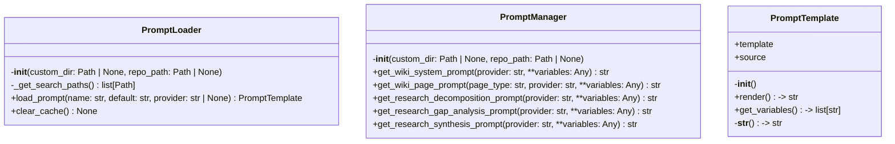

# File: `src/local_deepwiki/prompts.py`

## File Overview

This file implements a custom prompt template system for the `local-deepwiki` project. It provides the infrastructure to load, manage, and render prompt templates with variable interpolation. The system supports loading prompts from external files (with fallback to built-in defaults) and supports provider-specific prompt variants.

The module is designed to decouple prompt definition from prompt usage, allowing for customization of prompts through external files while maintaining a consistent interface for prompt consumers throughout the codebase.

## Key Concepts

### Prompt Template System
The `PromptTemplate` class provides a simple yet flexible way to define prompts with placeholders. It supports variable substitution using a basic string replacement mechanism, allowing prompts to be dynamically customized with runtime values.

### Prompt Loading Strategy
The `PromptLoader` class implements a flexible loading strategy that supports multiple search paths:
1. Custom directory (highest priority)
2. Repository's `.deepwiki/prompts/` directory
3. User's `~/.config/local-deepwiki/prompts/` directory

This strategy allows for project-specific, user-specific, and default prompts to be used in a hierarchical manner, enabling customization without requiring changes to the core codebase.

### Prompt Manager Abstraction
The `PromptManager` class provides a centralized interface for accessing different types of prompts used by the application. It handles:
- Mapping prompt types (e.g., `wiki_system`, `research_decomposition`) to their respective templates
- Fallback logic to built-in defaults when external files are not found
- Provider-specific prompt resolution (e.g., `wiki_system.anthropic.md` vs `wiki_system.md`)

### Caching
Both `PromptLoader` and `PromptManager` implement caching to avoid repeated file I/O operations when the same prompt is requested multiple times.

## Integration

This file integrates with the broader `local-deepwiki` system through several key mechanisms:

1. **Dependency on Configuration**: The module imports several prompt configuration constants from `local_deepwiki.config`, which define the default prompt templates used when external files are not found. This ensures that the system has a baseline set of prompts even when no custom files are provided.

2. **Usage by Core Components**: The `PromptManager` is used by various core components throughout the application that need to generate prompts for LLM interactions. These include:
   - CLI components (`src/local_deepwiki/cli/main.py`)
   - Documentation generators (`src/local_deepwiki/generators/analysis/`)
   - Reranking logic (`src/local_deepwiki/core/reranker.py`)

3. **Testing Infrastructure**: The module is directly tested through `test_prompts.py`, which uses `PromptTemplate`, `PromptLoader`, and `PromptManager` classes to verify prompt loading and rendering behavior.

4. **Configuration Validation**: The module integrates with configuration validation logic (`src/local_deepwiki/cli/config_validator.py`) to ensure that prompt configurations are valid and consistent.

## Design Notes

### Why Variable Interpolation?
The choice to use simple string replacement (`{variable}`) for placeholders instead of more complex templating systems was made to keep the system lightweight and easy to understand. This approach also allows for easy integration with LLM inputs without additional processing overhead.

### Why Hierarchical Prompt Loading?
The hierarchical search order (custom → repo → user → default) was chosen to allow:
- Per-project customization
- User-level overrides
- System-wide defaults
- Easy debugging and development workflows

### Why Provider-Specific Prompts?
Support for provider-specific prompts (e.g., `wiki_system.anthropic.md`) allows the system to adapt prompts to the specific capabilities or style preferences of different LLM providers, which is important for consistent results across different providers.

### Caching Strategy
Caching is implemented at both the `PromptLoader` and `PromptManager` levels to balance performance and memory usage. The cache is cleared when explicitly requested, but otherwise persists across requests to avoid repeated filesystem reads.

### Error Handling
The system gracefully handles missing prompt files by falling back to default templates. When file reading fails, the system logs a warning but continues operation, ensuring robustness in environments where custom prompts may be partially configured or missing.

## API Reference

### class `PromptTemplate`

A prompt template with variable interpolation support.

**Methods:**


<details>
<summary>View Source (lines 28-72) | <a href="https://github.com/UrbanDiver/local-deepwiki-mcp/blob/main/src/local_deepwiki/prompts.py#L28-L72">GitHub</a></summary>

```python
class PromptTemplate:
    """A prompt template with variable interpolation support."""

    def __init__(self, template: str, source: str = "default"):
        """Initialize a prompt template.

        Args:
            template: The template string with optional {variable} placeholders.
            source: Description of where this template came from (for debugging).
        """
        self.template = template
        self.source = source

    def render(self, **variables: Any) -> str:
        """Render the template with variable substitution.

        Args:
            **variables: Variables to substitute into the template.

        Returns:
            The rendered template string.

        Example:
            template = PromptTemplate("Document the {language} code in {file_path}")
            result = template.render(language="Python", file_path="src/main.py")
        """
        result = self.template

        for key, value in variables.items():
            placeholder = "{" + key + "}"
            result = result.replace(placeholder, str(value))

        return result

    def get_variables(self) -> list[str]:
        """Get list of variable names used in this template.

        Returns:
            List of variable names found in the template.
        """
        return VARIABLE_PATTERN.findall(self.template)

    def __str__(self) -> str:
        """Return the raw template string."""
        return self.template
```

</details>

#### `__init__`

```python
def __init__(template: str, source: str = "default")
```

Initialize a prompt template.


| Parameter | Type | Default | Description |
|-----------|------|---------|-------------|
| `template` | `str` | - | The template string with optional {variable} placeholders. |
| `source` | `str` | `"default"` | Description of where this template came from (for debugging). |


<details>
<summary>View Source (lines 28-72) | <a href="https://github.com/UrbanDiver/local-deepwiki-mcp/blob/main/src/local_deepwiki/prompts.py#L28-L72">GitHub</a></summary>

```python
class PromptTemplate:
    """A prompt template with variable interpolation support."""

    def __init__(self, template: str, source: str = "default"):
        """Initialize a prompt template.

        Args:
            template: The template string with optional {variable} placeholders.
            source: Description of where this template came from (for debugging).
        """
        self.template = template
        self.source = source

    def render(self, **variables: Any) -> str:
        """Render the template with variable substitution.

        Args:
            **variables: Variables to substitute into the template.

        Returns:
            The rendered template string.

        Example:
            template = PromptTemplate("Document the {language} code in {file_path}")
            result = template.render(language="Python", file_path="src/main.py")
        """
        result = self.template

        for key, value in variables.items():
            placeholder = "{" + key + "}"
            result = result.replace(placeholder, str(value))

        return result

    def get_variables(self) -> list[str]:
        """Get list of variable names used in this template.

        Returns:
            List of variable names found in the template.
        """
        return VARIABLE_PATTERN.findall(self.template)

    def __str__(self) -> str:
        """Return the raw template string."""
        return self.template
```

</details>

#### `render`

```python
def render() -> str
```

Render the template with variable substitution.


<details>
<summary>View Source (lines 28-72) | <a href="https://github.com/UrbanDiver/local-deepwiki-mcp/blob/main/src/local_deepwiki/prompts.py#L28-L72">GitHub</a></summary>

```python
class PromptTemplate:
    """A prompt template with variable interpolation support."""

    def __init__(self, template: str, source: str = "default"):
        """Initialize a prompt template.

        Args:
            template: The template string with optional {variable} placeholders.
            source: Description of where this template came from (for debugging).
        """
        self.template = template
        self.source = source

    def render(self, **variables: Any) -> str:
        """Render the template with variable substitution.

        Args:
            **variables: Variables to substitute into the template.

        Returns:
            The rendered template string.

        Example:
            template = PromptTemplate("Document the {language} code in {file_path}")
            result = template.render(language="Python", file_path="src/main.py")
        """
        result = self.template

        for key, value in variables.items():
            placeholder = "{" + key + "}"
            result = result.replace(placeholder, str(value))

        return result

    def get_variables(self) -> list[str]:
        """Get list of variable names used in this template.

        Returns:
            List of variable names found in the template.
        """
        return VARIABLE_PATTERN.findall(self.template)

    def __str__(self) -> str:
        """Return the raw template string."""
        return self.template
```

</details>

#### `get_variables`

```python
def get_variables() -> list[str]
```

Get list of variable names used in this template.


<details>
<summary>View Source (lines 28-72) | <a href="https://github.com/UrbanDiver/local-deepwiki-mcp/blob/main/src/local_deepwiki/prompts.py#L28-L72">GitHub</a></summary>

```python
class PromptTemplate:
    """A prompt template with variable interpolation support."""

    def __init__(self, template: str, source: str = "default"):
        """Initialize a prompt template.

        Args:
            template: The template string with optional {variable} placeholders.
            source: Description of where this template came from (for debugging).
        """
        self.template = template
        self.source = source

    def render(self, **variables: Any) -> str:
        """Render the template with variable substitution.

        Args:
            **variables: Variables to substitute into the template.

        Returns:
            The rendered template string.

        Example:
            template = PromptTemplate("Document the {language} code in {file_path}")
            result = template.render(language="Python", file_path="src/main.py")
        """
        result = self.template

        for key, value in variables.items():
            placeholder = "{" + key + "}"
            result = result.replace(placeholder, str(value))

        return result

    def get_variables(self) -> list[str]:
        """Get list of variable names used in this template.

        Returns:
            List of variable names found in the template.
        """
        return VARIABLE_PATTERN.findall(self.template)

    def __str__(self) -> str:
        """Return the raw template string."""
        return self.template
```

</details>

### class `PromptLoader`

Load prompt templates from files or config with fallback chain.

**Methods:**


<details>
<summary>View Source (lines 75-188) | <a href="https://github.com/UrbanDiver/local-deepwiki-mcp/blob/main/src/local_deepwiki/prompts.py#L75-L188">GitHub</a></summary>

```python
class PromptLoader:
    # Methods: __init__, _get_search_paths, load_prompt, clear_cache
```

</details>

#### `__init__`

```python
def __init__(custom_dir: Path | None = None, repo_path: Path | None = None)
```

Initialize the prompt loader.


| Parameter | Type | Default | Description |
|-----------|------|---------|-------------|
| `custom_dir` | `Path | None` | `None` | Optional custom directory containing prompt files. |
| `repo_path` | `Path | None` | `None` | Optional repository path to check for .deepwiki/prompts/. |


<details>
<summary>View Source (lines 78-91) | <a href="https://github.com/UrbanDiver/local-deepwiki-mcp/blob/main/src/local_deepwiki/prompts.py#L78-L91">GitHub</a></summary>

```python
def __init__(
        self,
        custom_dir: Path | None = None,
        repo_path: Path | None = None,
    ):
        """Initialize the prompt loader.

        Args:
            custom_dir: Optional custom directory containing prompt files.
            repo_path: Optional repository path to check for .deepwiki/prompts/.
        """
        self.custom_dir = custom_dir
        self.repo_path = repo_path
        self._cache: dict[str, PromptTemplate] = {}
```

</details>

#### `load_prompt`

```python
def load_prompt(name: str, default: str, provider: str | None = None) -> PromptTemplate
```

Load a prompt template by name.  Searches for prompt files in priority order: 1. Custom directory (if specified) 2. Repository's .deepwiki/prompts/ 3. User's ~/.config/local-deepwiki/prompts/ 4. Falls back to the provided default  Provider-specific prompts can be loaded by looking for files like: - wiki_system.anthropic.md (provider-specific) - wiki_system.md (generic)


| Parameter | Type | Default | Description |
|-----------|------|---------|-------------|
| `name` | `str` | - | Prompt name (e.g., "wiki_system", "research_synthesis"). |
| `default` | `str` | - | Default prompt text if no file is found. |
| `provider` | `str | None` | `None` | Optional provider name for provider-specific prompts. |


<details>
<summary>View Source (lines 118-184) | <a href="https://github.com/UrbanDiver/local-deepwiki-mcp/blob/main/src/local_deepwiki/prompts.py#L118-L184">GitHub</a></summary>

```python
def load_prompt(
        self,
        name: str,
        default: str,
        provider: str | None = None,
    ) -> PromptTemplate:
        """Load a prompt template by name.

        Searches for prompt files in priority order:
        1. Custom directory (if specified)
        2. Repository's .deepwiki/prompts/
        3. User's ~/.config/local-deepwiki/prompts/
        4. Falls back to the provided default

        Provider-specific prompts can be loaded by looking for files like:
        - wiki_system.anthropic.md (provider-specific)
        - wiki_system.md (generic)

        Args:
            name: Prompt name (e.g., "wiki_system", "research_synthesis").
            default: Default prompt text if no file is found.
            provider: Optional provider name for provider-specific prompts.

        Returns:
            PromptTemplate loaded from file or default.
        """
        # Check cache first
        cache_key = f"{name}:{provider or 'default'}"
        if cache_key in self._cache:
            return self._cache[cache_key]

        # Build list of filenames to try
        filenames_to_try = []
        if provider:
            # Provider-specific first (e.g., wiki_system.anthropic.md)
            filenames_to_try.append(f"{name}.{provider}.md")
            filenames_to_try.append(f"{name}.{provider}.txt")
        # Generic fallback
        filenames_to_try.append(f"{name}.md")
        filenames_to_try.append(f"{name}.txt")

        # Search directories in priority order
        for search_path in self._get_search_paths():
            for filename in filenames_to_try:
                prompt_file = search_path / filename
                if prompt_file.exists():
                    try:
                        content = prompt_file.read_text().strip()
                        template = PromptTemplate(
                            content,
                            source=str(prompt_file),
                        )
                        logger.debug(
                            "Loaded custom prompt '%s' from %s", name, prompt_file
                        )
                        self._cache[cache_key] = template
                        return template
                    except OSError as e:
                        logger.warning(
                            "Failed to read prompt file %s: %s", prompt_file, e
                        )
                        continue

        # Fall back to default
        template = PromptTemplate(default, source="built-in default")
        self._cache[cache_key] = template
        return template
```

</details>

#### `clear_cache`

```python
def clear_cache() -> None
```

Clear the prompt cache.


<details>
<summary>View Source (lines 186-188) | <a href="https://github.com/UrbanDiver/local-deepwiki-mcp/blob/main/src/local_deepwiki/prompts.py#L186-L188">GitHub</a></summary>

```python
def clear_cache(self) -> None:
        """Clear the prompt cache."""
        self._cache.clear()
```

</details>

### class `PromptManager`

Manage prompts for wiki generation with custom template support.

**Methods:**


<details>
<summary>View Source (lines 191-353) | <a href="https://github.com/UrbanDiver/local-deepwiki-mcp/blob/main/src/local_deepwiki/prompts.py#L191-L353">GitHub</a></summary>

```python
class PromptManager:
    # Methods: __init__, get_wiki_system_prompt, get_wiki_page_prompt, get_research_decomposition_prompt, get_research_gap_analysis_prompt, get_research_synthesis_prompt
```

</details>

#### `__init__`

```python
def __init__(custom_dir: Path | None = None, repo_path: Path | None = None)
```

Initialize the prompt manager.


| Parameter | Type | Default | Description |
|-----------|------|---------|-------------|
| `custom_dir` | `Path | None` | `None` | Optional custom directory containing prompt files. |
| `repo_path` | `Path | None` | `None` | Optional repository path for per-project prompts. |


<details>
<summary>View Source (lines 194-228) | <a href="https://github.com/UrbanDiver/local-deepwiki-mcp/blob/main/src/local_deepwiki/prompts.py#L194-L228">GitHub</a></summary>

```python
def __init__(
        self,
        custom_dir: Path | None = None,
        repo_path: Path | None = None,
    ):
        """Initialize the prompt manager.

        Args:
            custom_dir: Optional custom directory containing prompt files.
            repo_path: Optional repository path for per-project prompts.
        """
        self.loader = PromptLoader(custom_dir=custom_dir, repo_path=repo_path)

        # Import here to avoid circular import
        from local_deepwiki.config import (
            RESEARCH_DECOMPOSITION_PROMPTS,
            RESEARCH_GAP_ANALYSIS_PROMPTS,
            RESEARCH_SYNTHESIS_PROMPTS,
            WIKI_ARCHITECTURE_PROMPTS,
            WIKI_FILE_PROMPTS,
            WIKI_MODULE_PROMPTS,
            WIKI_OVERVIEW_PROMPTS,
            WIKI_SYSTEM_PROMPTS,
        )

        self._defaults = {
            "wiki_system": WIKI_SYSTEM_PROMPTS,
            "wiki_overview": WIKI_OVERVIEW_PROMPTS,
            "wiki_architecture": WIKI_ARCHITECTURE_PROMPTS,
            "wiki_file": WIKI_FILE_PROMPTS,
            "wiki_module": WIKI_MODULE_PROMPTS,
            "research_decomposition": RESEARCH_DECOMPOSITION_PROMPTS,
            "research_gap_analysis": RESEARCH_GAP_ANALYSIS_PROMPTS,
            "research_synthesis": RESEARCH_SYNTHESIS_PROMPTS,
        }
```

</details>

#### `get_wiki_system_prompt`

```python
def get_wiki_system_prompt(provider: str = "anthropic") -> str
```

Get the wiki system prompt for a provider.


| Parameter | Type | Default | Description |
|-----------|------|---------|-------------|
| `provider` | `str` | `"anthropic"` | LLM provider name. **variables: Variables to interpolate into the template. |


<details>
<summary>View Source (lines 233-252) | <a href="https://github.com/UrbanDiver/local-deepwiki-mcp/blob/main/src/local_deepwiki/prompts.py#L233-L252">GitHub</a></summary>

```python
def get_wiki_system_prompt(
        self,
        provider: str = "anthropic",
        **variables: Any,
    ) -> str:
        """Get the wiki system prompt for a provider.

        Args:
            provider: LLM provider name.
            **variables: Variables to interpolate into the template.

        Returns:
            Rendered prompt string.
        """
        default = self._defaults["wiki_system"].get(
            provider,
            self._defaults["wiki_system"]["anthropic"],
        )
        template = self.loader.load_prompt("wiki_system", default, provider)
        return template.render(**variables)
```

</details>

#### `get_wiki_page_prompt`

```python
def get_wiki_page_prompt(page_type: str, provider: str = "anthropic") -> str
```

Get a page-type-specific wiki prompt for a provider.  Looks for custom file overrides like ``wiki_architecture.anthropic.md`` or ``wiki_module.md``, then falls back to the built-in page-type prompt, and finally to the generic ``wiki_system`` prompt.


| Parameter | Type | Default | Description |
|-----------|------|---------|-------------|
| `page_type` | `str` | - | One of "overview", "architecture", "file", "module". |
| `provider` | `str` | `"anthropic"` | LLM provider name. **variables: Variables to interpolate into the template. |


<details>
<summary>View Source (lines 254-290) | <a href="https://github.com/UrbanDiver/local-deepwiki-mcp/blob/main/src/local_deepwiki/prompts.py#L254-L290">GitHub</a></summary>

```python
def get_wiki_page_prompt(
        self,
        page_type: str,
        provider: str = "anthropic",
        **variables: Any,
    ) -> str:
        """Get a page-type-specific wiki prompt for a provider.

        Looks for custom file overrides like ``wiki_architecture.anthropic.md``
        or ``wiki_module.md``, then falls back to the built-in page-type
        prompt, and finally to the generic ``wiki_system`` prompt.

        Args:
            page_type: One of "overview", "architecture", "file", "module".
            provider: LLM provider name.
            **variables: Variables to interpolate into the template.

        Returns:
            Rendered prompt string.
        """
        prompt_key = f"wiki_{page_type}"

        # If we have a page-type-specific default, use it
        if prompt_key in self._defaults:
            default = self._defaults[prompt_key].get(
                provider,
                self._defaults[prompt_key]["anthropic"],
            )
        else:
            # Fall back to the generic wiki_system prompt
            default = self._defaults["wiki_system"].get(
                provider,
                self._defaults["wiki_system"]["anthropic"],
            )

        template = self.loader.load_prompt(prompt_key, default, provider)
        return template.render(**variables)
```

</details>

#### `get_research_decomposition_prompt`

```python
def get_research_decomposition_prompt(provider: str = "anthropic") -> str
```

Get the research decomposition prompt for a provider.


| Parameter | Type | Default | Description |
|-----------|------|---------|-------------|
| `provider` | `str` | `"anthropic"` | LLM provider name. **variables: Variables to interpolate into the template. |


<details>
<summary>View Source (lines 292-311) | <a href="https://github.com/UrbanDiver/local-deepwiki-mcp/blob/main/src/local_deepwiki/prompts.py#L292-L311">GitHub</a></summary>

```python
def get_research_decomposition_prompt(
        self,
        provider: str = "anthropic",
        **variables: Any,
    ) -> str:
        """Get the research decomposition prompt for a provider.

        Args:
            provider: LLM provider name.
            **variables: Variables to interpolate into the template.

        Returns:
            Rendered prompt string.
        """
        default = self._defaults["research_decomposition"].get(
            provider,
            self._defaults["research_decomposition"]["anthropic"],
        )
        template = self.loader.load_prompt("research_decomposition", default, provider)
        return template.render(**variables)
```

</details>

#### `get_research_gap_analysis_prompt`

```python
def get_research_gap_analysis_prompt(provider: str = "anthropic") -> str
```

Get the research gap analysis prompt for a provider.


| Parameter | Type | Default | Description |
|-----------|------|---------|-------------|
| `provider` | `str` | `"anthropic"` | LLM provider name. **variables: Variables to interpolate into the template. |


<details>
<summary>View Source (lines 313-332) | <a href="https://github.com/UrbanDiver/local-deepwiki-mcp/blob/main/src/local_deepwiki/prompts.py#L313-L332">GitHub</a></summary>

```python
def get_research_gap_analysis_prompt(
        self,
        provider: str = "anthropic",
        **variables: Any,
    ) -> str:
        """Get the research gap analysis prompt for a provider.

        Args:
            provider: LLM provider name.
            **variables: Variables to interpolate into the template.

        Returns:
            Rendered prompt string.
        """
        default = self._defaults["research_gap_analysis"].get(
            provider,
            self._defaults["research_gap_analysis"]["anthropic"],
        )
        template = self.loader.load_prompt("research_gap_analysis", default, provider)
        return template.render(**variables)
```

</details>

#### `get_research_synthesis_prompt`

```python
def get_research_synthesis_prompt(provider: str = "anthropic") -> str
```

Get the research synthesis prompt for a provider.


| Parameter | Type | Default | Description |
|-----------|------|---------|-------------|
| `provider` | `str` | `"anthropic"` | LLM provider name. **variables: Variables to interpolate into the template. |


---


<details>
<summary>View Source (lines 334-353) | <a href="https://github.com/UrbanDiver/local-deepwiki-mcp/blob/main/src/local_deepwiki/prompts.py#L334-L353">GitHub</a></summary>

```python
def get_research_synthesis_prompt(
        self,
        provider: str = "anthropic",
        **variables: Any,
    ) -> str:
        """Get the research synthesis prompt for a provider.

        Args:
            provider: LLM provider name.
            **variables: Variables to interpolate into the template.

        Returns:
            Rendered prompt string.
        """
        default = self._defaults["research_synthesis"].get(
            provider,
            self._defaults["research_synthesis"]["anthropic"],
        )
        template = self.loader.load_prompt("research_synthesis", default, provider)
        return template.render(**variables)
```

</details>

### Functions

#### `get_prompt_manager`

```python
def get_prompt_manager(custom_dir: Path | None = None, repo_path: Path | None = None) -> PromptManager
```

Get a prompt manager instance.


| Parameter | Type | Default | Description |
|-----------|------|---------|-------------|
| `custom_dir` | `Path | None` | `None` | Optional custom prompts directory. |
| `repo_path` | `Path | None` | `None` | Optional repository path for per-project prompts. |

**Returns:** `PromptManager`


<details>
<summary>View Source (lines 356-369) | <a href="https://github.com/UrbanDiver/local-deepwiki-mcp/blob/main/src/local_deepwiki/prompts.py#L356-L369">GitHub</a></summary>

```python
def get_prompt_manager(
    custom_dir: Path | None = None,
    repo_path: Path | None = None,
) -> PromptManager:
    """Get a prompt manager instance.

    Args:
        custom_dir: Optional custom prompts directory.
        repo_path: Optional repository path for per-project prompts.

    Returns:
        Configured PromptManager instance.
    """
    return PromptManager(custom_dir=custom_dir, repo_path=repo_path)
```

</details>

## Class Diagram



## Call Graph

```mermaid
flowchart TD
    N0[PromptLoader]
    N1[PromptLoader._get_search_paths]
    N2[PromptLoader.load_prompt]
    N3[PromptManager]
    N4[PromptManager.__init__]
    N5[PromptManager.get_research_...]
    N6[PromptManager.get_research_...]
    N7[PromptManager.get_research_...]
    N8[PromptManager.get_wiki_page...]
    N9[PromptManager.get_wiki_syst...]
    N10[PromptTemplate]
    N11[PromptTemplate.get_variables]
    N12[_get_search_paths]
    N13[exists]
    N14[findall]
    N15[get_prompt_manager]
    N16[home]
    N17[load_prompt]
    N18[read_text]
    N19[render]
    N15 --> N3
    N11 --> N14
    N1 --> N13
    N1 --> N16
    N2 --> N12
    N2 --> N13
    N2 --> N18
    N2 --> N10
    N4 --> N0
    N9 --> N17
    N9 --> N19
    N8 --> N17
    N8 --> N19
    N5 --> N17
    N5 --> N19
    N6 --> N17
    N6 --> N19
    N7 --> N17
    N7 --> N19
    classDef func fill:#e1f5fe
    class N0,N3,N10,N12,N13,N14,N15,N16,N17,N18,N19 func
    classDef method fill:#fff3e0
    class N1,N2,N4,N5,N6,N7,N8,N9,N11 method
```



## Used By

Functions and methods in this file and their callers:

- **`PromptLoader`**: called by `PromptManager.__init__`
- **`PromptManager`**: called by `get_prompt_manager`
- **`PromptTemplate`**: called by `PromptLoader.load_prompt`
- **`_get_search_paths`**: called by `PromptLoader.load_prompt`
- **`exists`**: called by `PromptLoader._get_search_paths`, `PromptLoader.load_prompt`
- **`findall`**: called by `PromptTemplate.get_variables`
- **`home`**: called by `PromptLoader._get_search_paths`
- **`load_prompt`**: called by `PromptManager.get_research_decomposition_prompt`, `PromptManager.get_research_gap_analysis_prompt`, `PromptManager.get_research_synthesis_prompt`, `PromptManager.get_wiki_page_prompt`, `PromptManager.get_wiki_system_prompt`
- **`read_text`**: called by `PromptLoader.load_prompt`
- **`render`**: called by `PromptManager.get_research_decomposition_prompt`, `PromptManager.get_research_gap_analysis_prompt`, `PromptManager.get_research_synthesis_prompt`, `PromptManager.get_wiki_page_prompt`, `PromptManager.get_wiki_system_prompt`

## Usage Examples

*Examples extracted from test files*

### Test creating a basic template

From `test_prompts.py::TestPromptTemplate::test_basic_creation`:

```python
template = PromptTemplate("Hello, world!")
assert template.template == "Hello, world!"
assert template.source == "default"
```

### Test creating template with custom source

From `test_prompts.py::TestPromptTemplate::test_creation_with_source`:

```python
template = PromptTemplate("Hello", source="/path/to/file.md")
assert template.source == "/path/to/file.md"
```

### Test loader with no valid search paths

From `test_prompts.py::TestPromptLoader::test_empty_search_paths`:

```python
loader = PromptLoader()
paths = loader._get_search_paths()
# Should only have home config if it exists
assert isinstance(paths, list)
```

### Test loader with no valid search paths

From `test_prompts.py::TestPromptLoader::test_empty_search_paths`:

```python
loader = PromptLoader()
paths = loader._get_search_paths()
# Should only have home config if it exists
assert isinstance(paths, list)
```

### Test that custom_dir is included in search paths

From `test_prompts.py::TestPromptLoader::test_custom_dir_in_search_paths`:

```python
custom_dir = tmp_path / "prompts"
custom_dir.mkdir()

loader = PromptLoader(custom_dir=custom_dir)
paths = loader._get_search_paths()

assert custom_dir in paths
assert paths[0] == custom_dir  # Should be first (highest priority)
```


## Last Modified

| Entity | Type | Author | Date | Commit |
|--------|------|--------|------|--------|
| `PromptLoader` | class | Brian Breidenbach | Feb 19, 2026 | `fe2a6e6` feat: improve wiki generati... |
| `load_prompt` | method | Brian Breidenbach | Feb 19, 2026 | `fe2a6e6` feat: improve wiki generati... |
| `PromptManager` | class | Brian Breidenbach | Feb 19, 2026 | `fe2a6e6` feat: improve wiki generati... |
| `__init__` | method | Brian Breidenbach | Feb 19, 2026 | `fe2a6e6` feat: improve wiki generati... |
| `get_wiki_page_prompt` | method | Brian Breidenbach | Feb 19, 2026 | `fe2a6e6` feat: improve wiki generati... |
| `PromptTemplate` | class | Brian Breidenbach | Jan 25, 2026 | `a142542` Add custom prompt template ... |
| `__init__` | method | Brian Breidenbach | Jan 25, 2026 | `a142542` Add custom prompt template ... |
| `_get_search_paths` | method | Brian Breidenbach | Jan 25, 2026 | `a142542` Add custom prompt template ... |
| `clear_cache` | method | Brian Breidenbach | Jan 25, 2026 | `a142542` Add custom prompt template ... |
| `get_wiki_system_prompt` | method | Brian Breidenbach | Jan 25, 2026 | `a142542` Add custom prompt template ... |
| `get_research_decomposition_prompt` | method | Brian Breidenbach | Jan 25, 2026 | `a142542` Add custom prompt template ... |
| `get_research_gap_analysis_prompt` | method | Brian Breidenbach | Jan 25, 2026 | `a142542` Add custom prompt template ... |
| `get_research_synthesis_prompt` | method | Brian Breidenbach | Jan 25, 2026 | `a142542` Add custom prompt template ... |
| `get_prompt_manager` | function | Brian Breidenbach | Jan 25, 2026 | `a142542` Add custom prompt template ... |

## Additional Source Code

Source code for functions and methods not listed in the API Reference above.

#### `_get_search_paths`

<details>
<summary>View Source (lines 93-116) | <a href="https://github.com/UrbanDiver/local-deepwiki-mcp/blob/main/src/local_deepwiki/prompts.py#L93-L116">GitHub</a></summary>

```python
def _get_search_paths(self) -> list[Path]:
        """Get ordered list of directories to search for prompt files.

        Returns:
            List of paths to check, in priority order.
        """
        paths = []

        # 1. Custom directory (highest priority)
        if self.custom_dir and self.custom_dir.exists():
            paths.append(self.custom_dir)

        # 2. Repository's .deepwiki/prompts/ directory
        if self.repo_path:
            repo_prompts = self.repo_path / ".deepwiki" / "prompts"
            if repo_prompts.exists():
                paths.append(repo_prompts)

        # 3. User's home config directory
        home_prompts = Path.home() / ".config" / "local-deepwiki" / "prompts"
        if home_prompts.exists():
            paths.append(home_prompts)

        return paths
```

</details>

## Relevant Source Files

- `src/local_deepwiki/prompts.py:28-72`
