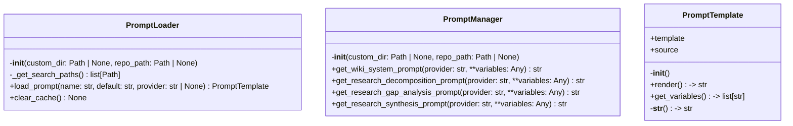

# File Overview

This file defines the core prompt management system for the `local_deepwiki` project. It provides infrastructure for loading and rendering prompt templates, supporting custom directories, repository-specific prompts, and fallback to default prompts. The system is designed to support multiple LLM providers and integrates with configuration-defined defaults.

## Dependencies

This file imports:
- `re` - for regular expressions
- `Path` from `pathlib` - for path manipulation
- `Any` from `typing` - for type hints
- [`get_logger`](logging.md) from `local_deepwiki.logging` - for logging
- Configuration constants from `local_deepwiki.config`:
  - `RESEARCH_DECOMPOSITION_PROMPTS`
  - `RESEARCH_GAP_ANALYSIS_PROMPTS`
  - `RESEARCH_SYNTHESIS_PROMPTS`
  - `WIKI_SYSTEM_PROMPTS`

## Integration

This file is used by:
- `get_prompt_manager` function, which is called by `test_prompts`

Related files in the project:
- `src/local_deepwiki/core/__init__.py`
- `src/local_deepwiki/generators/source_refs.py`
- `src/local_deepwiki/plugins/base.py`
- `tests/__init__.py`
- `tests/test_plugins.py`

# Classes

## PromptTemplate

A prompt template with variable interpolation support.

### Methods

#### `__init__(self, template: str, source: str = "default")`

Initialize a prompt template.

**Parameters:**
- `template`: The template string with optional `{variable}` placeholders.
- `source`: Description of where this template came from (for debugging).

#### `render(self, **variables: Any) -> str`

Render the template with variable substitution.

**Parameters:**
- `**variables`: Variable values to substitute into the template.

**Returns:**
- Rendered prompt string with variables replaced.

## PromptLoader

Handles loading of prompt templates from various sources with caching.

### Methods

#### `__init__(self, custom_dir: Path | None = None, repo_path: Path | None = None)`

Initialize the prompt loader.

**Parameters:**
- `custom_dir`: Optional custom directory containing prompt files.
- `repo_path`: Optional repository path to check for `.deepwiki/prompts/`.

#### `_get_search_paths(self) -> list[Path]`

Get ordered list of directories to search for prompt files.

**Returns:**
- List of paths to check, in priority order.

#### `load_prompt(self, name: str, default: str, provider: str | None = None) -> PromptTemplate`

Load a prompt template by name.

**Parameters:**
- `name`: Name of the prompt to load.
- `default`: Default prompt string to use if file is not found.
- `provider`: Optional LLM provider name for provider-specific prompt lookup.

**Returns:**
- Loaded `PromptTemplate` instance.

#### `clear_cache(self) -> None`

Clear the prompt cache.

## PromptManager

Manages loading and retrieval of various system prompts for different tasks and providers.

### Methods

#### `__init__(self, custom_dir: Path | None = None, repo_path: Path | None = None)`

Initialize the prompt manager.

**Parameters:**
- `custom_dir`: Optional custom directory containing prompt files.
- `repo_path`: Optional repository path for per-project prompts.

#### `get_wiki_system_prompt(self, provider: str = "anthropic", **variables: Any) -> str`

Get the wiki system prompt for a provider.

**Parameters:**
- `provider`: LLM provider name.
- `**variables`: Variables to interpolate into the template.

**Returns:**
- Rendered prompt string.

#### `get_research_decomposition_prompt(self, provider: str = "anthropic", **variables: Any) -> str`

Get the research decomposition prompt for a provider.

**Parameters:**
- `provider`: LLM provider name.
- `**variables`: Variables to interpolate into the template.

**Returns:**
- Rendered prompt string.

#### `get_research_gap_analysis_prompt(self, provider: str = "anthropic", **variables: Any) -> str`

Get the research gap analysis prompt for a provider.

**Parameters:**
- `provider`: LLM provider name.
- `**variables`: Variables to interpolate into the template.

**Returns:**
- Rendered prompt string.

#### `get_research_synthesis_prompt(self, provider: str = "anthropic", **variables: Any) -> str`

Get the research synthesis prompt for a provider.

**Parameters:**
- `provider`: LLM provider name.
- `**variables`: Variables to interpolate into the template.

**Returns:**
- Rendered prompt string.

# Functions

## get_prompt_manager

Get a prompt manager instance.

**Parameters:**
- `custom_dir`: Optional custom prompts directory.
- `repo_path`: Optional repository path for per-project prompts.

**Returns:**
- Configured `PromptManager` instance.

## API Reference

### class `PromptTemplate`

A prompt template with variable interpolation support.

**Methods:**


<details>
<summary>View Source (lines 26-70) | <a href="https://github.com/UrbanDiver/local-deepwiki-mcp/blob/[main](export/pdf.md)/src/local_deepwiki/prompts.py#L26-L70">GitHub</a></summary>

```python
class PromptTemplate:
    """A prompt template with variable interpolation support."""

    def __init__(self, template: str, source: str = "default"):
        """Initialize a prompt template.

        Args:
            template: The template string with optional {variable} placeholders.
            source: Description of where this template came from (for debugging).
        """
        self.template = template
        self.source = source

    def render(self, **variables: Any) -> str:
        """Render the template with variable substitution.

        Args:
            **variables: Variables to substitute into the template.

        Returns:
            The rendered template string.

        Example:
            template = PromptTemplate("Document the {language} code in {file_path}")
            result = template.render(language="Python", file_path="src/main.py")
        """
        result = self.template

        for key, value in variables.items():
            placeholder = "{" + key + "}"
            result = result.replace(placeholder, str(value))

        return result

    def get_variables(self) -> list[str]:
        """Get list of variable names used in this template.

        Returns:
            List of variable names found in the template.
        """
        return VARIABLE_PATTERN.findall(self.template)

    def __str__(self) -> str:
        """Return the raw template string."""
        return self.template
```

</details>

#### `__init__`

```python
def __init__(template: str, source: str = "default")
```

Initialize a prompt template.


| [Parameter](generators/api_docs.md) | Type | Default | Description |
|-----------|------|---------|-------------|
| `template` | `str` | - | The template string with optional {variable} placeholders. |
| `source` | `str` | `"default"` | Description of where this template came from (for debugging). |


<details>
<summary>View Source (lines 26-70) | <a href="https://github.com/UrbanDiver/local-deepwiki-mcp/blob/[main](export/pdf.md)/src/local_deepwiki/prompts.py#L26-L70">GitHub</a></summary>

```python
class PromptTemplate:
    """A prompt template with variable interpolation support."""

    def __init__(self, template: str, source: str = "default"):
        """Initialize a prompt template.

        Args:
            template: The template string with optional {variable} placeholders.
            source: Description of where this template came from (for debugging).
        """
        self.template = template
        self.source = source

    def render(self, **variables: Any) -> str:
        """Render the template with variable substitution.

        Args:
            **variables: Variables to substitute into the template.

        Returns:
            The rendered template string.

        Example:
            template = PromptTemplate("Document the {language} code in {file_path}")
            result = template.render(language="Python", file_path="src/main.py")
        """
        result = self.template

        for key, value in variables.items():
            placeholder = "{" + key + "}"
            result = result.replace(placeholder, str(value))

        return result

    def get_variables(self) -> list[str]:
        """Get list of variable names used in this template.

        Returns:
            List of variable names found in the template.
        """
        return VARIABLE_PATTERN.findall(self.template)

    def __str__(self) -> str:
        """Return the raw template string."""
        return self.template
```

</details>

#### `render`

```python
def render() -> str
```

Render the template with variable substitution.


<details>
<summary>View Source (lines 26-70) | <a href="https://github.com/UrbanDiver/local-deepwiki-mcp/blob/[main](export/pdf.md)/src/local_deepwiki/prompts.py#L26-L70">GitHub</a></summary>

```python
class PromptTemplate:
    """A prompt template with variable interpolation support."""

    def __init__(self, template: str, source: str = "default"):
        """Initialize a prompt template.

        Args:
            template: The template string with optional {variable} placeholders.
            source: Description of where this template came from (for debugging).
        """
        self.template = template
        self.source = source

    def render(self, **variables: Any) -> str:
        """Render the template with variable substitution.

        Args:
            **variables: Variables to substitute into the template.

        Returns:
            The rendered template string.

        Example:
            template = PromptTemplate("Document the {language} code in {file_path}")
            result = template.render(language="Python", file_path="src/main.py")
        """
        result = self.template

        for key, value in variables.items():
            placeholder = "{" + key + "}"
            result = result.replace(placeholder, str(value))

        return result

    def get_variables(self) -> list[str]:
        """Get list of variable names used in this template.

        Returns:
            List of variable names found in the template.
        """
        return VARIABLE_PATTERN.findall(self.template)

    def __str__(self) -> str:
        """Return the raw template string."""
        return self.template
```

</details>

#### `get_variables`

```python
def get_variables() -> list[str]
```

Get list of variable names used in this template.


<details>
<summary>View Source (lines 26-70) | <a href="https://github.com/UrbanDiver/local-deepwiki-mcp/blob/[main](export/pdf.md)/src/local_deepwiki/prompts.py#L26-L70">GitHub</a></summary>

```python
class PromptTemplate:
    """A prompt template with variable interpolation support."""

    def __init__(self, template: str, source: str = "default"):
        """Initialize a prompt template.

        Args:
            template: The template string with optional {variable} placeholders.
            source: Description of where this template came from (for debugging).
        """
        self.template = template
        self.source = source

    def render(self, **variables: Any) -> str:
        """Render the template with variable substitution.

        Args:
            **variables: Variables to substitute into the template.

        Returns:
            The rendered template string.

        Example:
            template = PromptTemplate("Document the {language} code in {file_path}")
            result = template.render(language="Python", file_path="src/main.py")
        """
        result = self.template

        for key, value in variables.items():
            placeholder = "{" + key + "}"
            result = result.replace(placeholder, str(value))

        return result

    def get_variables(self) -> list[str]:
        """Get list of variable names used in this template.

        Returns:
            List of variable names found in the template.
        """
        return VARIABLE_PATTERN.findall(self.template)

    def __str__(self) -> str:
        """Return the raw template string."""
        return self.template
```

</details>

### class `PromptLoader`

Load prompt templates from files or config with fallback chain.

**Methods:**


<details>
<summary>View Source (lines 73-182) | <a href="https://github.com/UrbanDiver/local-deepwiki-mcp/blob/[main](export/pdf.md)/src/local_deepwiki/prompts.py#L73-L182">GitHub</a></summary>

```python
class PromptLoader:
    # Methods: __init__, _get_search_paths, load_prompt, clear_cache
```

</details>

#### `__init__`

```python
def __init__(custom_dir: Path | None = None, repo_path: Path | None = None)
```

Initialize the prompt loader.


| [Parameter](generators/api_docs.md) | Type | Default | Description |
|-----------|------|---------|-------------|
| `custom_dir` | `Path | None` | `None` | Optional custom directory containing prompt files. |
| `repo_path` | `Path | None` | `None` | Optional repository path to check for .deepwiki/prompts/. |


<details>
<summary>View Source (lines 76-89) | <a href="https://github.com/UrbanDiver/local-deepwiki-mcp/blob/[main](export/pdf.md)/src/local_deepwiki/prompts.py#L76-L89">GitHub</a></summary>

```python
def __init__(
        self,
        custom_dir: Path | None = None,
        repo_path: Path | None = None,
    ):
        """Initialize the prompt loader.

        Args:
            custom_dir: Optional custom directory containing prompt files.
            repo_path: Optional repository path to check for .deepwiki/prompts/.
        """
        self.custom_dir = custom_dir
        self.repo_path = repo_path
        self._cache: dict[str, PromptTemplate] = {}
```

</details>

#### `load_prompt`

```python
def load_prompt(name: str, default: str, provider: str | None = None) -> PromptTemplate
```

Load a prompt template by name.  Searches for prompt files in priority order: 1. Custom directory (if specified) 2. Repository's .deepwiki/prompts/ 3. User's ~/.config/local-deepwiki/prompts/ 4. Falls back to the provided default  Provider-specific prompts can be loaded by looking for files like: - wiki_system.anthropic.md (provider-specific) - wiki_system.md (generic)


| [Parameter](generators/api_docs.md) | Type | Default | Description |
|-----------|------|---------|-------------|
| `name` | `str` | - | Prompt name (e.g., "wiki_system", "research_synthesis"). |
| `default` | `str` | - | Default prompt text if no file is found. |
| `provider` | `str | None` | `None` | Optional provider name for provider-specific prompts. |


<details>
<summary>View Source (lines 116-178) | <a href="https://github.com/UrbanDiver/local-deepwiki-mcp/blob/[main](export/pdf.md)/src/local_deepwiki/prompts.py#L116-L178">GitHub</a></summary>

```python
def load_prompt(
        self,
        name: str,
        default: str,
        provider: str | None = None,
    ) -> PromptTemplate:
        """Load a prompt template by name.

        Searches for prompt files in priority order:
        1. Custom directory (if specified)
        2. Repository's .deepwiki/prompts/
        3. User's ~/.config/local-deepwiki/prompts/
        4. Falls back to the provided default

        Provider-specific prompts can be loaded by looking for files like:
        - wiki_system.anthropic.md (provider-specific)
        - wiki_system.md (generic)

        Args:
            name: Prompt name (e.g., "wiki_system", "research_synthesis").
            default: Default prompt text if no file is found.
            provider: Optional provider name for provider-specific prompts.

        Returns:
            PromptTemplate loaded from file or default.
        """
        # Check cache first
        cache_key = f"{name}:{provider or 'default'}"
        if cache_key in self._cache:
            return self._cache[cache_key]

        # Build list of filenames to try
        filenames_to_try = []
        if provider:
            # Provider-specific first (e.g., wiki_system.anthropic.md)
            filenames_to_try.append(f"{name}.{provider}.md")
            filenames_to_try.append(f"{name}.{provider}.txt")
        # Generic fallback
        filenames_to_try.append(f"{name}.md")
        filenames_to_try.append(f"{name}.txt")

        # Search directories in priority order
        for search_path in self._get_search_paths():
            for filename in filenames_to_try:
                prompt_file = search_path / filename
                if prompt_file.exists():
                    try:
                        content = prompt_file.read_text().strip()
                        template = PromptTemplate(
                            content,
                            source=str(prompt_file),
                        )
                        logger.debug(f"Loaded custom prompt '{name}' from {prompt_file}")
                        self._cache[cache_key] = template
                        return template
                    except OSError as e:
                        logger.warning(f"Failed to read prompt file {prompt_file}: {e}")
                        continue

        # Fall back to default
        template = PromptTemplate(default, source="built-in default")
        self._cache[cache_key] = template
        return template
```

</details>

#### `clear_cache`

```python
def clear_cache() -> None
```

Clear the prompt cache.


<details>
<summary>View Source (lines 180-182) | <a href="https://github.com/UrbanDiver/local-deepwiki-mcp/blob/[main](export/pdf.md)/src/local_deepwiki/prompts.py#L180-L182">GitHub</a></summary>

```python
def clear_cache(self) -> None:
        """Clear the prompt cache."""
        self._cache.clear()
```

</details>

### class `PromptManager`

Manage prompts for wiki generation with custom template support.

**Methods:**


<details>
<summary>View Source (lines 185-298) | <a href="https://github.com/UrbanDiver/local-deepwiki-mcp/blob/[main](export/pdf.md)/src/local_deepwiki/prompts.py#L185-L298">GitHub</a></summary>

```python
class PromptManager:
    # Methods: __init__, get_wiki_system_prompt, get_research_decomposition_prompt, get_research_gap_analysis_prompt, get_research_synthesis_prompt
```

</details>

#### `__init__`

```python
def __init__(custom_dir: Path | None = None, repo_path: Path | None = None)
```

Initialize the prompt manager.


| [Parameter](generators/api_docs.md) | Type | Default | Description |
|-----------|------|---------|-------------|
| `custom_dir` | `Path | None` | `None` | Optional custom directory containing prompt files. |
| `repo_path` | `Path | None` | `None` | Optional repository path for per-project prompts. |


<details>
<summary>View Source (lines 188-214) | <a href="https://github.com/UrbanDiver/local-deepwiki-mcp/blob/[main](export/pdf.md)/src/local_deepwiki/prompts.py#L188-L214">GitHub</a></summary>

```python
def __init__(
        self,
        custom_dir: Path | None = None,
        repo_path: Path | None = None,
    ):
        """Initialize the prompt manager.

        Args:
            custom_dir: Optional custom directory containing prompt files.
            repo_path: Optional repository path for per-project prompts.
        """
        self.loader = PromptLoader(custom_dir=custom_dir, repo_path=repo_path)

        # Import here to avoid circular import
        from local_deepwiki.config import (
            RESEARCH_DECOMPOSITION_PROMPTS,
            RESEARCH_GAP_ANALYSIS_PROMPTS,
            RESEARCH_SYNTHESIS_PROMPTS,
            WIKI_SYSTEM_PROMPTS,
        )

        self._defaults = {
            "wiki_system": WIKI_SYSTEM_PROMPTS,
            "research_decomposition": RESEARCH_DECOMPOSITION_PROMPTS,
            "research_gap_analysis": RESEARCH_GAP_ANALYSIS_PROMPTS,
            "research_synthesis": RESEARCH_SYNTHESIS_PROMPTS,
        }
```

</details>

#### `get_wiki_system_prompt`

```python
def get_wiki_system_prompt(provider: str = "anthropic") -> str
```

Get the wiki system prompt for a provider.


| [Parameter](generators/api_docs.md) | Type | Default | Description |
|-----------|------|---------|-------------|
| `provider` | `str` | `"anthropic"` | LLM provider name. **variables: Variables to interpolate into the template. |


<details>
<summary>View Source (lines 216-235) | <a href="https://github.com/UrbanDiver/local-deepwiki-mcp/blob/[main](export/pdf.md)/src/local_deepwiki/prompts.py#L216-L235">GitHub</a></summary>

```python
def get_wiki_system_prompt(
        self,
        provider: str = "anthropic",
        **variables: Any,
    ) -> str:
        """Get the wiki system prompt for a provider.

        Args:
            provider: LLM provider name.
            **variables: Variables to interpolate into the template.

        Returns:
            Rendered prompt string.
        """
        default = self._defaults["wiki_system"].get(
            provider,
            self._defaults["wiki_system"]["anthropic"],
        )
        template = self.loader.load_prompt("wiki_system", default, provider)
        return template.render(**variables)
```

</details>

#### `get_research_decomposition_prompt`

```python
def get_research_decomposition_prompt(provider: str = "anthropic") -> str
```

Get the research decomposition prompt for a provider.


| [Parameter](generators/api_docs.md) | Type | Default | Description |
|-----------|------|---------|-------------|
| `provider` | `str` | `"anthropic"` | LLM provider name. **variables: Variables to interpolate into the template. |


<details>
<summary>View Source (lines 237-256) | <a href="https://github.com/UrbanDiver/local-deepwiki-mcp/blob/[main](export/pdf.md)/src/local_deepwiki/prompts.py#L237-L256">GitHub</a></summary>

```python
def get_research_decomposition_prompt(
        self,
        provider: str = "anthropic",
        **variables: Any,
    ) -> str:
        """Get the research decomposition prompt for a provider.

        Args:
            provider: LLM provider name.
            **variables: Variables to interpolate into the template.

        Returns:
            Rendered prompt string.
        """
        default = self._defaults["research_decomposition"].get(
            provider,
            self._defaults["research_decomposition"]["anthropic"],
        )
        template = self.loader.load_prompt("research_decomposition", default, provider)
        return template.render(**variables)
```

</details>

#### `get_research_gap_analysis_prompt`

```python
def get_research_gap_analysis_prompt(provider: str = "anthropic") -> str
```

Get the research gap analysis prompt for a provider.


| [Parameter](generators/api_docs.md) | Type | Default | Description |
|-----------|------|---------|-------------|
| `provider` | `str` | `"anthropic"` | LLM provider name. **variables: Variables to interpolate into the template. |


<details>
<summary>View Source (lines 258-277) | <a href="https://github.com/UrbanDiver/local-deepwiki-mcp/blob/[main](export/pdf.md)/src/local_deepwiki/prompts.py#L258-L277">GitHub</a></summary>

```python
def get_research_gap_analysis_prompt(
        self,
        provider: str = "anthropic",
        **variables: Any,
    ) -> str:
        """Get the research gap analysis prompt for a provider.

        Args:
            provider: LLM provider name.
            **variables: Variables to interpolate into the template.

        Returns:
            Rendered prompt string.
        """
        default = self._defaults["research_gap_analysis"].get(
            provider,
            self._defaults["research_gap_analysis"]["anthropic"],
        )
        template = self.loader.load_prompt("research_gap_analysis", default, provider)
        return template.render(**variables)
```

</details>

#### `get_research_synthesis_prompt`

```python
def get_research_synthesis_prompt(provider: str = "anthropic") -> str
```

Get the research synthesis prompt for a provider.


| [Parameter](generators/api_docs.md) | Type | Default | Description |
|-----------|------|---------|-------------|
| `provider` | `str` | `"anthropic"` | LLM provider name. **variables: Variables to interpolate into the template. |


---


<details>
<summary>View Source (lines 279-298) | <a href="https://github.com/UrbanDiver/local-deepwiki-mcp/blob/[main](export/pdf.md)/src/local_deepwiki/prompts.py#L279-L298">GitHub</a></summary>

```python
def get_research_synthesis_prompt(
        self,
        provider: str = "anthropic",
        **variables: Any,
    ) -> str:
        """Get the research synthesis prompt for a provider.

        Args:
            provider: LLM provider name.
            **variables: Variables to interpolate into the template.

        Returns:
            Rendered prompt string.
        """
        default = self._defaults["research_synthesis"].get(
            provider,
            self._defaults["research_synthesis"]["anthropic"],
        )
        template = self.loader.load_prompt("research_synthesis", default, provider)
        return template.render(**variables)
```

</details>

### Functions

#### `get_prompt_manager`

```python
def get_prompt_manager(custom_dir: Path | None = None, repo_path: Path | None = None) -> PromptManager
```

Get a prompt manager instance.


| [Parameter](generators/api_docs.md) | Type | Default | Description |
|-----------|------|---------|-------------|
| `custom_dir` | `Path | None` | `None` | Optional custom prompts directory. |
| `repo_path` | `Path | None` | `None` | Optional repository path for per-project prompts. |

**Returns:** `PromptManager`


<details>
<summary>View Source (lines 301-314) | <a href="https://github.com/UrbanDiver/local-deepwiki-mcp/blob/[main](export/pdf.md)/src/local_deepwiki/prompts.py#L301-L314">GitHub</a></summary>

```python
def get_prompt_manager(
    custom_dir: Path | None = None,
    repo_path: Path | None = None,
) -> PromptManager:
    """Get a prompt manager instance.

    Args:
        custom_dir: Optional custom prompts directory.
        repo_path: Optional repository path for per-project prompts.

    Returns:
        Configured PromptManager instance.
    """
    return PromptManager(custom_dir=custom_dir, repo_path=repo_path)
```

</details>

## Class Diagram



## Call Graph

```mermaid
flowchart TD
    N0[PromptLoader]
    N1[PromptLoader._get_search_paths]
    N2[PromptLoader.load_prompt]
    N3[PromptManager]
    N4[PromptManager.__init__]
    N5[PromptManager.get_research_...]
    N6[PromptManager.get_research_...]
    N7[PromptManager.get_research_...]
    N8[PromptManager.get_wiki_syst...]
    N9[PromptTemplate]
    N10[PromptTemplate.get_variables]
    N11[_get_search_paths]
    N12[exists]
    N13[findall]
    N14[get_prompt_manager]
    N15[home]
    N16[load_prompt]
    N17[read_text]
    N18[render]
    N14 --> N3
    N10 --> N13
    N1 --> N12
    N1 --> N15
    N2 --> N11
    N2 --> N12
    N2 --> N17
    N2 --> N9
    N4 --> N0
    N8 --> N16
    N8 --> N18
    N5 --> N16
    N5 --> N18
    N6 --> N16
    N6 --> N18
    N7 --> N16
    N7 --> N18
    classDef func fill:#e1f5fe
    class N0,N3,N9,N11,N12,N13,N14,N15,N16,N17,N18 func
    classDef method fill:#fff3e0
    class N1,N2,N4,N5,N6,N7,N8,N10 method
```



## Used By

Functions and methods in this file and their callers:

- **`PromptLoader`**: called by `PromptManager.__init__`
- **`PromptManager`**: called by `get_prompt_manager`
- **`PromptTemplate`**: called by `PromptLoader.load_prompt`
- **`_get_search_paths`**: called by `PromptLoader.load_prompt`
- **`exists`**: called by `PromptLoader._get_search_paths`, `PromptLoader.load_prompt`
- **`findall`**: called by `PromptTemplate.get_variables`
- **`home`**: called by `PromptLoader._get_search_paths`
- **`load_prompt`**: called by `PromptManager.get_research_decomposition_prompt`, `PromptManager.get_research_gap_analysis_prompt`, `PromptManager.get_research_synthesis_prompt`, `PromptManager.get_wiki_system_prompt`
- **`read_text`**: called by `PromptLoader.load_prompt`
- **`render`**: called by `PromptManager.get_research_decomposition_prompt`, `PromptManager.get_research_gap_analysis_prompt`, `PromptManager.get_research_synthesis_prompt`, `PromptManager.get_wiki_system_prompt`

## Usage Examples

*Examples extracted from test files*

### Test creating a basic template

From `test_prompts.py::TestPromptTemplate::test_basic_creation`:

```python
template = PromptTemplate("Hello, world!")
assert template.template == "Hello, world!"
assert template.source == "default"
```

### Test creating template with custom source

From `test_prompts.py::TestPromptTemplate::test_creation_with_source`:

```python
template = PromptTemplate("Hello", source="/path/to/file.md")
assert template.source == "/path/to/file.md"
```

### Test loader with no valid search paths

From `test_prompts.py::TestPromptLoader::test_empty_search_paths`:

```python
loader = PromptLoader()
paths = loader._get_search_paths()
# Should only have home config if it exists
assert isinstance(paths, list)
```

### Test loader with no valid search paths

From `test_prompts.py::TestPromptLoader::test_empty_search_paths`:

```python
loader = PromptLoader()
paths = loader._get_search_paths()
# Should only have home config if it exists
assert isinstance(paths, list)
```

### Test that custom_dir is included in search paths

From `test_prompts.py::TestPromptLoader::test_custom_dir_in_search_paths`:

```python
custom_dir = tmp_path / "prompts"
custom_dir.mkdir()

loader = PromptLoader(custom_dir=custom_dir)
paths = loader._get_search_paths()

assert custom_dir in paths
assert paths[0] == custom_dir  # Should be first (highest priority)
```


## Last Modified

| Entity | Type | Author | Date | Commit |
|--------|------|--------|------|--------|
| `PromptTemplate` | class | Brian Breidenbach | 1 week ago | `a142542` Add custom prompt template ... |
| `PromptLoader` | class | Brian Breidenbach | 1 week ago | `a142542` Add custom prompt template ... |
| `__init__` | method | Brian Breidenbach | 1 week ago | `a142542` Add custom prompt template ... |
| `_get_search_paths` | method | Brian Breidenbach | 1 week ago | `a142542` Add custom prompt template ... |
| `load_prompt` | method | Brian Breidenbach | 1 week ago | `a142542` Add custom prompt template ... |
| `clear_cache` | method | Brian Breidenbach | 1 week ago | `a142542` Add custom prompt template ... |
| `PromptManager` | class | Brian Breidenbach | 1 week ago | `a142542` Add custom prompt template ... |
| `__init__` | method | Brian Breidenbach | 1 week ago | `a142542` Add custom prompt template ... |
| `get_wiki_system_prompt` | method | Brian Breidenbach | 1 week ago | `a142542` Add custom prompt template ... |
| `get_research_decomposition_prompt` | method | Brian Breidenbach | 1 week ago | `a142542` Add custom prompt template ... |
| `get_research_gap_analysis_prompt` | method | Brian Breidenbach | 1 week ago | `a142542` Add custom prompt template ... |
| `get_research_synthesis_prompt` | method | Brian Breidenbach | 1 week ago | `a142542` Add custom prompt template ... |
| `get_prompt_manager` | function | Brian Breidenbach | 1 week ago | `a142542` Add custom prompt template ... |

## Additional Source Code

Source code for functions and methods not listed in the API Reference above.

#### `_get_search_paths`

<details>
<summary>View Source (lines 91-114) | <a href="https://github.com/UrbanDiver/local-deepwiki-mcp/blob/[main](export/pdf.md)/src/local_deepwiki/prompts.py#L91-L114">GitHub</a></summary>

```python
def _get_search_paths(self) -> list[Path]:
        """Get ordered list of directories to search for prompt files.

        Returns:
            List of paths to check, in priority order.
        """
        paths = []

        # 1. Custom directory (highest priority)
        if self.custom_dir and self.custom_dir.exists():
            paths.append(self.custom_dir)

        # 2. Repository's .deepwiki/prompts/ directory
        if self.repo_path:
            repo_prompts = self.repo_path / ".deepwiki" / "prompts"
            if repo_prompts.exists():
                paths.append(repo_prompts)

        # 3. User's home config directory
        home_prompts = Path.home() / ".config" / "local-deepwiki" / "prompts"
        if home_prompts.exists():
            paths.append(home_prompts)

        return paths
```

</details>

## Relevant Source Files

- `src/local_deepwiki/prompts.py:26-70`
