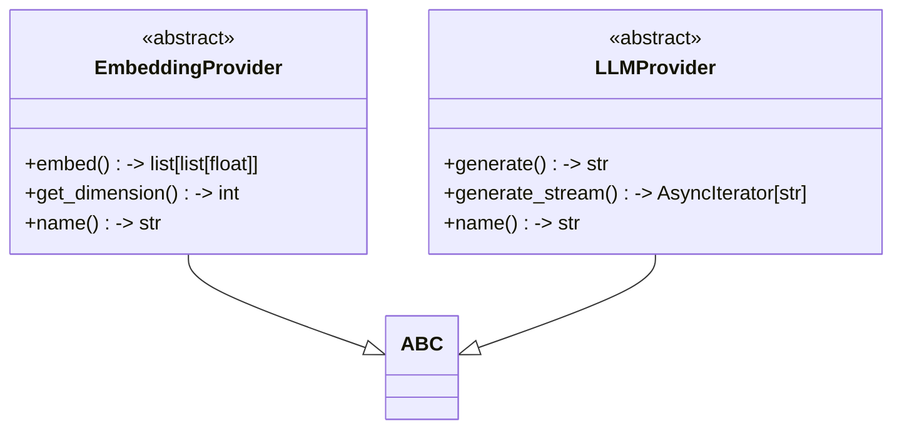
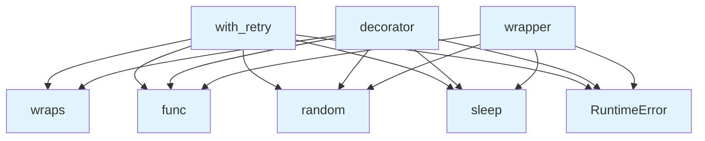

# Base Provider Module

## File Overview

This file defines the abstract base class for embedding providers in the local_deepwiki system. It establishes the interface that all embedding provider implementations must follow.

## Classes

### EmbeddingProvider

The EmbeddingProvider class serves as an abstract base class that defines the standard interface for all embedding providers. It uses Python's ABC (Abstract Base Class) to ensure that concrete implementations provide the required methods.

#### Abstract Methods

**embed(texts: list[str]) -> list[list[float]]**
- Generates embeddings for a list of text strings
- Parameters:
  - `texts`: List of text strings to embed
- Returns: List of embedding vectors as lists of floats
- This method must be implemented by all concrete embedding providers

**get_dimension() -> int**
- Retrieves the embedding dimension for the provider
- Returns: The dimension of the embedding vectors as an integer
- This method must be implemented by all concrete embedding providers

## Usage Examples

Since this is an abstract base class, it cannot be instantiated directly. Instead, it serves as a template for concrete implementations:

```python
from abc import ABC, abstractmethod

class CustomEmbeddingProvider(EmbeddingProvider):
    async def embed(self, texts: list[str]) -> list[list[float]]:
        # Implementation for generating embeddings
        pass
    
    def get_dimension(self) -> int:
        # Implementation for returning embedding dimension
        return 768
```

## Related Components

This base class is designed to be extended by concrete embedding provider implementations throughout the local_deepwiki system. Any class that provides embedding functionality should inherit from EmbeddingProvider to ensure a consistent interface.

## API Reference

### class `EmbeddingProvider`

**Inherits from:** `ABC`

Abstract base class for embedding providers.

**Methods:**

#### `embed`

```python
async def embed(texts: list[str]) -> list[list[float]]
```

Generate embeddings for a list of texts.


| [Parameter](../generators/api_docs.md) | Type | Default | Description |
|-----------|------|---------|-------------|
| `texts` | `list[str]` | - | List of text strings to embed. |

#### `get_dimension`

```python
def get_dimension() -> int
```

Get the embedding dimension.

#### `name`

```python
def name() -> str
```

Get the provider name.


### class `LLMProvider`

**Inherits from:** `ABC`

Abstract base class for LLM providers.

**Methods:**

#### `generate`

```python
async def generate(prompt: str, system_prompt: str | None = None, max_tokens: int = 4096, temperature: float = 0.7) -> str
```

Generate text from a prompt.


| [Parameter](../generators/api_docs.md) | Type | Default | Description |
|-----------|------|---------|-------------|
| `prompt` | `str` | - | The user prompt. |
| `system_prompt` | `str | None` | `None` | Optional system prompt. |
| `max_tokens` | `int` | `4096` | Maximum tokens to generate. |
| `temperature` | `float` | `0.7` | Sampling temperature. |

#### `generate_stream`

```python
async def generate_stream(prompt: str, system_prompt: str | None = None, max_tokens: int = 4096, temperature: float = 0.7) -> AsyncIterator[str]
```

Generate text from a prompt with streaming.


| [Parameter](../generators/api_docs.md) | Type | Default | Description |
|-----------|------|---------|-------------|
| `prompt` | `str` | - | The user prompt. |
| `system_prompt` | `str | None` | `None` | Optional system prompt. |
| `max_tokens` | `int` | `4096` | Maximum tokens to generate. |
| `temperature` | `float` | `0.7` | Sampling temperature. |

#### `name`

```python
def name() -> str
```

Get the provider name.


---

### Functions

#### `with_retry`

```python
def with_retry(max_attempts: int = 3, base_delay: float = 1.0, max_delay: float = 30.0, exponential_base: float = 2.0, jitter: bool = True) -> Callable[[Callable[..., Any]], Callable[..., Any]]
```

Decorator for adding retry logic with exponential backoff to async functions.


| [Parameter](../generators/api_docs.md) | Type | Default | Description |
|-----------|------|---------|-------------|
| `max_attempts` | `int` | `3` | Maximum number of attempts before giving up. |
| `base_delay` | `float` | `1.0` | Initial delay between retries in seconds. |
| `max_delay` | `float` | `30.0` | Maximum delay between retries in seconds. |
| `exponential_base` | `float` | `2.0` | Base for exponential backoff calculation. |
| `jitter` | `bool` | `True` | Whether to add random jitter to delays. |

**Returns:** `Callable[[Callable[..., Any]], Callable[..., Any]]`


#### `decorator`

```python
def decorator(func: Callable[..., Any]) -> Callable[..., Any]
```


| [Parameter](../generators/api_docs.md) | Type | Default | Description |
|-----------|------|---------|-------------|
| `func` | `Callable[..., Any]` | - | - |

**Returns:** `Callable[..., Any]`


#### `wrapper`

`@wraps(func)`

```python
async def wrapper() -> Any
```

**Returns:** `Any`


## Class Diagram



## Call Graph



## Relevant Source Files

- `src/local_deepwiki/providers/base.py:110-138`

## See Also

- [llm_cache](../core/llm_cache.md) - uses this
- [local](embeddings/local.md) - uses this
- [openai](embeddings/openai.md) - uses this
- [test_vectorstore](../../../tests/test_vectorstore.md) - uses this
- [vectorstore](../core/vectorstore.md) - uses this
