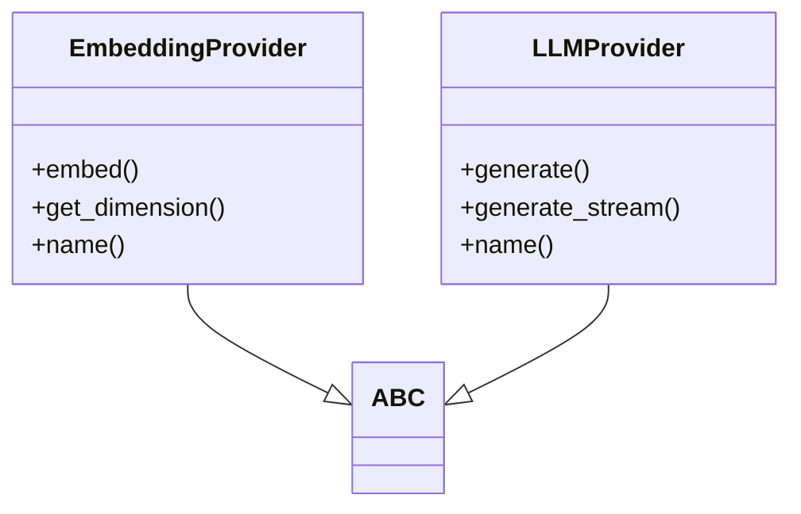

# Base Provider Classes

## File Overview

This file defines abstract base classes for embedding and language model providers. It establishes the interface contract that concrete provider implementations must follow, ensuring consistency across different embedding and LLM services.

## Classes

### EmbeddingProvider

Abstract base class for embedding providers. All concrete embedding implementations must inherit from this class and implement its abstract methods.

#### Methods

##### `embed(texts: list[str]) -> list[list[float]]`

Generate embeddings for a list of texts.

**Parameters:**
- `texts` (list[str]): List of text strings to embed

**Returns:**
- `list[list[float]]`: List of embedding vectors

**Example:**
```python
# This method must be implemented by concrete classes
async def embed(self, texts: list[str]) -> list[list[float]]:
    # Implementation would generate embeddings for the provided texts
    pass
```

##### `get_dimension() -> int`

Get the embedding dimension.

**Returns:**
- `int`: The dimension of the embedding vectors

**Example:**
```python
# This method must be implemented by concrete classes
def get_dimension(self) -> int:
    # Implementation would return the dimension of embeddings
    pass
```

##### `dimension` (property)

Returns the embedding dimension as a property.

**Returns:**
- `int`: The dimension of the embedding vectors

## Dependencies

- `abc.ABC`: Abstract base class functionality
- `typing.AsyncIterator`: Type hint for asynchronous iterators

## Usage Examples

To create a concrete embedding provider:

```python
from base import EmbeddingProvider

class MyEmbeddingProvider(EmbeddingProvider):
    def __init__(self):
        self._dimension = 768

    async def embed(self, texts: list[str]) -> list[list[float]]:
        # Implementation here
        pass

    def get_dimension(self) -> int:
        return self._dimension

# Usage
provider = MyEmbeddingProvider()
dimension = provider.get_dimension()  # Returns 768
```

## Class Diagram



## See Also

- [vectorstore](../core/vectorstore.md) - uses this
- [openai](embeddings/openai.md) - uses this
- [ollama](llm/ollama.md) - uses this
- [openai](llm/openai.md) - uses this
- [local](embeddings/local.md) - uses this
