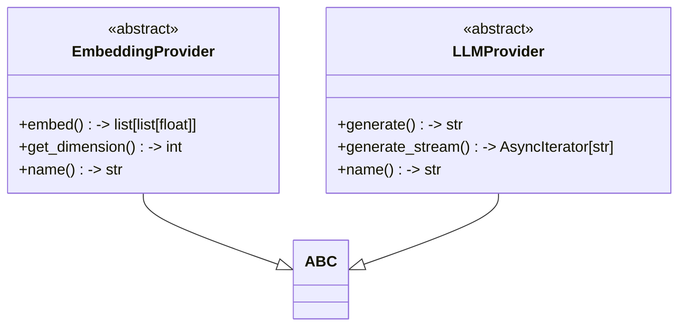
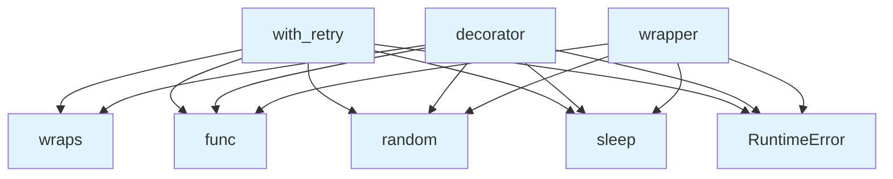

# Base Provider Module

## File Overview

This file defines the abstract base class for embedding providers in the local_deepwiki system. It establishes the interface that all embedding provider implementations must follow.

## Classes

### EmbeddingProvider

The EmbeddingProvider class serves as an abstract base class that defines the contract for all embedding provider implementations. It uses Python's ABC (Abstract Base Class) mechanism to enforce implementation of required methods.

#### Abstract Methods

**embed**
```python
async def embed(self, texts: list[str]) -> list[list[float]]
```
Generates embeddings for a list of text strings.

- **Parameters:**
  - `texts`: List of text strings to embed
- **Returns:** List of embedding vectors as lists of floats
- **Note:** This is an asynchronous method that must be implemented by subclasses

**get_dimension**
```python
def get_dimension(self) -> int
```
Returns the dimension of the embedding vectors produced by this provider.

- **Returns:** The dimension of the embedding vectors as an integer

**Abstract Property**
The class also defines an abstract property (implementation not shown in the provided code).

## Usage Examples

Since this is an abstract base class, it cannot be instantiated directly. Instead, it serves as a template for concrete implementations:

```python
from local_deepwiki.providers.base import EmbeddingProvider

class ConcreteEmbeddingProvider(EmbeddingProvider):
    async def embed(self, texts: list[str]) -> list[list[float]]:
        # Implementation specific logic
        pass
    
    def get_dimension(self) -> int:
        # Return the specific dimension for this provider
        return 768
```

## Implementation Requirements

Any class inheriting from EmbeddingProvider must implement:

1. The `embed` method for generating embeddings asynchronously
2. The `get_dimension` method for reporting vector dimensions
3. An abstract property (details not visible in provided code)

The abstract nature of this class ensures that all embedding providers in the system follow a consistent interface, enabling interchangeable use of different embedding implementations.

## API Reference

### class `EmbeddingProvider`

**Inherits from:** `ABC`

Abstract base class for embedding providers.

**Methods:**

#### `embed`

```python
async def embed(texts: list[str]) -> list[list[float]]
```

Generate embeddings for a list of texts.


| [Parameter](../generators/api_docs.md) | Type | Default | Description |
|-----------|------|---------|-------------|
| `texts` | `list[str]` | - | List of text strings to embed. |

#### `get_dimension`

```python
def get_dimension() -> int
```

Get the embedding dimension.

#### `name`

```python
def name() -> str
```

Get the provider name.


### class `LLMProvider`

**Inherits from:** `ABC`

Abstract base class for LLM providers.

**Methods:**

#### `generate`

```python
async def generate(prompt: str, system_prompt: str | None = None, max_tokens: int = 4096, temperature: float = 0.7) -> str
```

Generate text from a prompt.


| [Parameter](../generators/api_docs.md) | Type | Default | Description |
|-----------|------|---------|-------------|
| `prompt` | `str` | - | The user prompt. |
| `system_prompt` | `str | None` | `None` | Optional system prompt. |
| `max_tokens` | `int` | `4096` | Maximum tokens to generate. |
| `temperature` | `float` | `0.7` | Sampling temperature. |

#### `generate_stream`

```python
async def generate_stream(prompt: str, system_prompt: str | None = None, max_tokens: int = 4096, temperature: float = 0.7) -> AsyncIterator[str]
```

Generate text from a prompt with streaming.


| [Parameter](../generators/api_docs.md) | Type | Default | Description |
|-----------|------|---------|-------------|
| `prompt` | `str` | - | The user prompt. |
| `system_prompt` | `str | None` | `None` | Optional system prompt. |
| `max_tokens` | `int` | `4096` | Maximum tokens to generate. |
| `temperature` | `float` | `0.7` | Sampling temperature. |

#### `name`

```python
def name() -> str
```

Get the provider name.


---

### Functions

#### `with_retry`

```python
def with_retry(max_attempts: int = 3, base_delay: float = 1.0, max_delay: float = 30.0, exponential_base: float = 2.0, jitter: bool = True) -> Callable[[Callable[..., Any]], Callable[..., Any]]
```

Decorator for adding retry logic with exponential backoff to async functions.


| [Parameter](../generators/api_docs.md) | Type | Default | Description |
|-----------|------|---------|-------------|
| `max_attempts` | `int` | `3` | Maximum number of attempts before giving up. |
| `base_delay` | `float` | `1.0` | Initial delay between retries in seconds. |
| `max_delay` | `float` | `30.0` | Maximum delay between retries in seconds. |
| `exponential_base` | `float` | `2.0` | Base for exponential backoff calculation. |
| `jitter` | `bool` | `True` | Whether to add random jitter to delays. |

**Returns:** `Callable[[Callable[..., Any]], Callable[..., Any]]`


#### `decorator`

```python
def decorator(func: Callable[..., Any]) -> Callable[..., Any]
```


| [Parameter](../generators/api_docs.md) | Type | Default | Description |
|-----------|------|---------|-------------|
| `func` | `Callable[..., Any]` | - | - |

**Returns:** `Callable[..., Any]`


#### `wrapper`

`@wraps(func)`

```python
async def wrapper() -> Any
```

**Returns:** `Any`


## Class Diagram



## Call Graph



## Relevant Source Files

- `src/local_deepwiki/providers/base.py:110-138`

## See Also

- [local](embeddings/local.md) - uses this
- [llm_cache](../core/llm_cache.md) - uses this
- [vectorstore](../core/vectorstore.md) - uses this
- [openai](embeddings/openai.md) - uses this
