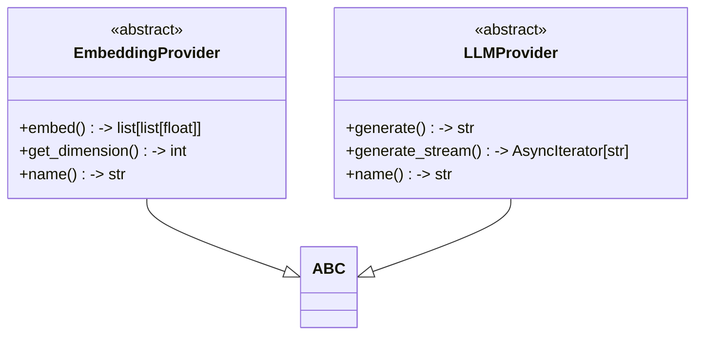
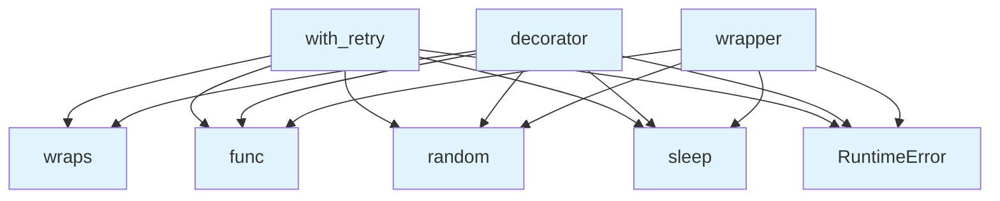

# Base Provider Classes

## File Overview

This file defines the abstract base class for embedding providers in the local_deepwiki system. It establishes the interface that all embedding providers must implement to generate text embeddings.

## Classes

### EmbeddingProvider

An abstract base class that defines the interface for embedding providers. This class uses Python's ABC (Abstract Base Class) to ensure that all concrete implementations provide the required methods.

**Abstract Methods:**

- **embed**: Generates embeddings for a list of text strings
  - **Parameters**: 
    - `texts` (list[str]): List of text strings to embed
  - **Returns**: list[list[float]] - List of embedding vectors
  - **Type**: Async method

- **get_dimension**: Returns the embedding dimension
  - **Returns**: int - The dimension of the embedding vectors

**Abstract Properties:**

The class includes an abstract property (implementation details not visible in the provided code chunk).

## Usage Examples

To implement a custom embedding provider, inherit from EmbeddingProvider and implement all abstract methods:

```python
class CustomEmbeddingProvider(EmbeddingProvider):
    async def embed(self, texts: list[str]) -> list[list[float]]:
        # Implementation for generating embeddings
        embeddings = []
        for text in texts:
            # Generate embedding vector for each text
            vector = generate_embedding(text)
            embeddings.append(vector)
        return embeddings
    
    def get_dimension(self) -> int:
        # Return the dimension of your embedding vectors
        return 768
```

## Related Components

This base class serves as the foundation for all embedding provider implementations in the local_deepwiki system. Concrete providers would inherit from EmbeddingProvider to provide specific embedding functionality using different models or services.

## API Reference

### class `EmbeddingProvider`

**Inherits from:** `ABC`

Abstract base class for embedding providers.

**Methods:**


<details>
<summary>View Source (lines 113-141) | <a href="https://github.com/UrbanDiver/local-deepwiki-mcp/blob/feature/wiki-enhancements-round2/src/local_deepwiki/providers/base.py#L113-L141">GitHub</a></summary>

```python
class EmbeddingProvider(ABC):
    """Abstract base class for embedding providers."""

    @abstractmethod
    async def embed(self, texts: list[str]) -> list[list[float]]:
        """Generate embeddings for a list of texts.

        Args:
            texts: List of text strings to embed.

        Returns:
            List of embedding vectors.
        """
        pass

    @abstractmethod
    def get_dimension(self) -> int:
        """Get the embedding dimension.

        Returns:
            The dimension of the embedding vectors.
        """
        pass

    @property
    @abstractmethod
    def name(self) -> str:
        """Get the provider name."""
        pass
```

</details>

#### `embed`

```python
async def embed(texts: list[str]) -> list[list[float]]
```

Generate embeddings for a list of texts.


| [Parameter](../generators/api_docs.md) | Type | Default | Description |
|-----------|------|---------|-------------|
| `texts` | `list[str]` | - | List of text strings to embed. |


<details>
<summary>View Source (lines 113-141) | <a href="https://github.com/UrbanDiver/local-deepwiki-mcp/blob/feature/wiki-enhancements-round2/src/local_deepwiki/providers/base.py#L113-L141">GitHub</a></summary>

```python
class EmbeddingProvider(ABC):
    """Abstract base class for embedding providers."""

    @abstractmethod
    async def embed(self, texts: list[str]) -> list[list[float]]:
        """Generate embeddings for a list of texts.

        Args:
            texts: List of text strings to embed.

        Returns:
            List of embedding vectors.
        """
        pass

    @abstractmethod
    def get_dimension(self) -> int:
        """Get the embedding dimension.

        Returns:
            The dimension of the embedding vectors.
        """
        pass

    @property
    @abstractmethod
    def name(self) -> str:
        """Get the provider name."""
        pass
```

</details>

#### `get_dimension`

```python
def get_dimension() -> int
```

Get the embedding dimension.


<details>
<summary>View Source (lines 113-141) | <a href="https://github.com/UrbanDiver/local-deepwiki-mcp/blob/feature/wiki-enhancements-round2/src/local_deepwiki/providers/base.py#L113-L141">GitHub</a></summary>

```python
class EmbeddingProvider(ABC):
    """Abstract base class for embedding providers."""

    @abstractmethod
    async def embed(self, texts: list[str]) -> list[list[float]]:
        """Generate embeddings for a list of texts.

        Args:
            texts: List of text strings to embed.

        Returns:
            List of embedding vectors.
        """
        pass

    @abstractmethod
    def get_dimension(self) -> int:
        """Get the embedding dimension.

        Returns:
            The dimension of the embedding vectors.
        """
        pass

    @property
    @abstractmethod
    def name(self) -> str:
        """Get the provider name."""
        pass
```

</details>

#### `name`

```python
def name() -> str
```

Get the provider name.


<details>
<summary>View Source (lines 113-141) | <a href="https://github.com/UrbanDiver/local-deepwiki-mcp/blob/feature/wiki-enhancements-round2/src/local_deepwiki/providers/base.py#L113-L141">GitHub</a></summary>

```python
class EmbeddingProvider(ABC):
    """Abstract base class for embedding providers."""

    @abstractmethod
    async def embed(self, texts: list[str]) -> list[list[float]]:
        """Generate embeddings for a list of texts.

        Args:
            texts: List of text strings to embed.

        Returns:
            List of embedding vectors.
        """
        pass

    @abstractmethod
    def get_dimension(self) -> int:
        """Get the embedding dimension.

        Returns:
            The dimension of the embedding vectors.
        """
        pass

    @property
    @abstractmethod
    def name(self) -> str:
        """Get the provider name."""
        pass
```

</details>

### class `LLMProvider`

**Inherits from:** `ABC`

Abstract base class for LLM providers.

**Methods:**


<details>
<summary>View Source (lines 144-196) | <a href="https://github.com/UrbanDiver/local-deepwiki-mcp/blob/feature/wiki-enhancements-round2/src/local_deepwiki/providers/base.py#L144-L196">GitHub</a></summary>

```python
class LLMProvider(ABC):
    """Abstract base class for LLM providers."""

    @abstractmethod
    async def generate(
        self,
        prompt: str,
        system_prompt: str | None = None,
        max_tokens: int = 4096,
        temperature: float = 0.7,
    ) -> str:
        """Generate text from a prompt.

        Args:
            prompt: The user prompt.
            system_prompt: Optional system prompt.
            max_tokens: Maximum tokens to generate.
            temperature: Sampling temperature.

        Returns:
            Generated text.
        """
        pass

    @abstractmethod
    async def generate_stream(
        self,
        prompt: str,
        system_prompt: str | None = None,
        max_tokens: int = 4096,
        temperature: float = 0.7,
    ) -> AsyncIterator[str]:
        """Generate text from a prompt with streaming.

        Args:
            prompt: The user prompt.
            system_prompt: Optional system prompt.
            max_tokens: Maximum tokens to generate.
            temperature: Sampling temperature.

        Yields:
            Generated text chunks.
        """
        # Make this an async generator for proper typing
        if False:  # pragma: no cover
            yield ""
        raise NotImplementedError

    @property
    @abstractmethod
    def name(self) -> str:
        """Get the provider name."""
        pass
```

</details>

#### `generate`

```python
async def generate(prompt: str, system_prompt: str | None = None, max_tokens: int = 4096, temperature: float = 0.7) -> str
```

Generate text from a prompt.


| [Parameter](../generators/api_docs.md) | Type | Default | Description |
|-----------|------|---------|-------------|
| `prompt` | `str` | - | The user prompt. |
| `system_prompt` | `str | None` | `None` | Optional system prompt. |
| `max_tokens` | `int` | `4096` | Maximum tokens to generate. |
| `temperature` | `float` | `0.7` | Sampling temperature. |


<details>
<summary>View Source (lines 144-196) | <a href="https://github.com/UrbanDiver/local-deepwiki-mcp/blob/feature/wiki-enhancements-round2/src/local_deepwiki/providers/base.py#L144-L196">GitHub</a></summary>

```python
class LLMProvider(ABC):
    """Abstract base class for LLM providers."""

    @abstractmethod
    async def generate(
        self,
        prompt: str,
        system_prompt: str | None = None,
        max_tokens: int = 4096,
        temperature: float = 0.7,
    ) -> str:
        """Generate text from a prompt.

        Args:
            prompt: The user prompt.
            system_prompt: Optional system prompt.
            max_tokens: Maximum tokens to generate.
            temperature: Sampling temperature.

        Returns:
            Generated text.
        """
        pass

    @abstractmethod
    async def generate_stream(
        self,
        prompt: str,
        system_prompt: str | None = None,
        max_tokens: int = 4096,
        temperature: float = 0.7,
    ) -> AsyncIterator[str]:
        """Generate text from a prompt with streaming.

        Args:
            prompt: The user prompt.
            system_prompt: Optional system prompt.
            max_tokens: Maximum tokens to generate.
            temperature: Sampling temperature.

        Yields:
            Generated text chunks.
        """
        # Make this an async generator for proper typing
        if False:  # pragma: no cover
            yield ""
        raise NotImplementedError

    @property
    @abstractmethod
    def name(self) -> str:
        """Get the provider name."""
        pass
```

</details>

#### `generate_stream`

```python
async def generate_stream(prompt: str, system_prompt: str | None = None, max_tokens: int = 4096, temperature: float = 0.7) -> AsyncIterator[str]
```

Generate text from a prompt with streaming.


| [Parameter](../generators/api_docs.md) | Type | Default | Description |
|-----------|------|---------|-------------|
| `prompt` | `str` | - | The user prompt. |
| `system_prompt` | `str | None` | `None` | Optional system prompt. |
| `max_tokens` | `int` | `4096` | Maximum tokens to generate. |
| `temperature` | `float` | `0.7` | Sampling temperature. |


<details>
<summary>View Source (lines 144-196) | <a href="https://github.com/UrbanDiver/local-deepwiki-mcp/blob/feature/wiki-enhancements-round2/src/local_deepwiki/providers/base.py#L144-L196">GitHub</a></summary>

```python
class LLMProvider(ABC):
    """Abstract base class for LLM providers."""

    @abstractmethod
    async def generate(
        self,
        prompt: str,
        system_prompt: str | None = None,
        max_tokens: int = 4096,
        temperature: float = 0.7,
    ) -> str:
        """Generate text from a prompt.

        Args:
            prompt: The user prompt.
            system_prompt: Optional system prompt.
            max_tokens: Maximum tokens to generate.
            temperature: Sampling temperature.

        Returns:
            Generated text.
        """
        pass

    @abstractmethod
    async def generate_stream(
        self,
        prompt: str,
        system_prompt: str | None = None,
        max_tokens: int = 4096,
        temperature: float = 0.7,
    ) -> AsyncIterator[str]:
        """Generate text from a prompt with streaming.

        Args:
            prompt: The user prompt.
            system_prompt: Optional system prompt.
            max_tokens: Maximum tokens to generate.
            temperature: Sampling temperature.

        Yields:
            Generated text chunks.
        """
        # Make this an async generator for proper typing
        if False:  # pragma: no cover
            yield ""
        raise NotImplementedError

    @property
    @abstractmethod
    def name(self) -> str:
        """Get the provider name."""
        pass
```

</details>

#### `name`

```python
def name() -> str
```

Get the provider name.


---


<details>
<summary>View Source (lines 144-196) | <a href="https://github.com/UrbanDiver/local-deepwiki-mcp/blob/feature/wiki-enhancements-round2/src/local_deepwiki/providers/base.py#L144-L196">GitHub</a></summary>

```python
class LLMProvider(ABC):
    """Abstract base class for LLM providers."""

    @abstractmethod
    async def generate(
        self,
        prompt: str,
        system_prompt: str | None = None,
        max_tokens: int = 4096,
        temperature: float = 0.7,
    ) -> str:
        """Generate text from a prompt.

        Args:
            prompt: The user prompt.
            system_prompt: Optional system prompt.
            max_tokens: Maximum tokens to generate.
            temperature: Sampling temperature.

        Returns:
            Generated text.
        """
        pass

    @abstractmethod
    async def generate_stream(
        self,
        prompt: str,
        system_prompt: str | None = None,
        max_tokens: int = 4096,
        temperature: float = 0.7,
    ) -> AsyncIterator[str]:
        """Generate text from a prompt with streaming.

        Args:
            prompt: The user prompt.
            system_prompt: Optional system prompt.
            max_tokens: Maximum tokens to generate.
            temperature: Sampling temperature.

        Yields:
            Generated text chunks.
        """
        # Make this an async generator for proper typing
        if False:  # pragma: no cover
            yield ""
        raise NotImplementedError

    @property
    @abstractmethod
    def name(self) -> str:
        """Get the provider name."""
        pass
```

</details>

### Functions

#### `with_retry`

```python
def with_retry(max_attempts: int = 3, base_delay: float = 1.0, max_delay: float = 30.0, exponential_base: float = 2.0, jitter: bool = True) -> Callable[[Callable[..., Any]], Callable[..., Any]]
```

Decorator for adding retry logic with exponential backoff to async functions.


| [Parameter](../generators/api_docs.md) | Type | Default | Description |
|-----------|------|---------|-------------|
| `max_attempts` | `int` | `3` | Maximum number of attempts before giving up. |
| `base_delay` | `float` | `1.0` | Initial delay between retries in seconds. |
| `max_delay` | `float` | `30.0` | Maximum delay between retries in seconds. |
| `exponential_base` | `float` | `2.0` | Base for exponential backoff calculation. |
| `jitter` | `bool` | `True` | Whether to add random jitter to delays. |

**Returns:** `Callable[[Callable[..., Any]], Callable[..., Any]]`


<details>
<summary>View Source (lines 21-110) | <a href="https://github.com/UrbanDiver/local-deepwiki-mcp/blob/feature/wiki-enhancements-round2/src/local_deepwiki/providers/base.py#L21-L110">GitHub</a></summary>

```python
def with_retry(
    max_attempts: int = 3,
    base_delay: float = 1.0,
    max_delay: float = 30.0,
    exponential_base: float = 2.0,
    jitter: bool = True,
) -> Callable[[Callable[..., Any]], Callable[..., Any]]:
    """Decorator for adding retry logic with exponential backoff to async functions.

    Args:
        max_attempts: Maximum number of attempts before giving up.
        base_delay: Initial delay between retries in seconds.
        max_delay: Maximum delay between retries in seconds.
        exponential_base: Base for exponential backoff calculation.
        jitter: Whether to add random jitter to delays.

    Returns:
        Decorated function with retry logic.
    """

    def decorator(func: Callable[..., Any]) -> Callable[..., Any]:
        @wraps(func)
        async def wrapper(*args: Any, **kwargs: Any) -> Any:
            last_exception: Exception | None = None

            for attempt in range(1, max_attempts + 1):
                try:
                    return await func(*args, **kwargs)
                except RETRYABLE_EXCEPTIONS as e:
                    last_exception = e
                    if attempt == max_attempts:
                        logger.warning(f"{func.__name__} failed after {max_attempts} attempts: {e}")
                        raise

                    # Calculate delay with exponential backoff
                    delay = min(base_delay * (exponential_base ** (attempt - 1)), max_delay)
                    if jitter:
                        delay = delay * (0.5 + random.random())

                    logger.warning(
                        f"{func.__name__} attempt {attempt} failed: {e}. "
                        f"Retrying in {delay:.2f}s..."
                    )
                    await asyncio.sleep(delay)
                except Exception as e:  # noqa: BLE001
                    # Broad catch is intentional: different API providers (Anthropic, OpenAI,
                    # Ollama) raise different exception types for rate limits. We inspect
                    # the error message to determine retry behavior, and re-raise immediately
                    # if not a recognized retryable condition.
                    error_str = str(e).lower()
                    if "rate" in error_str and "limit" in error_str:
                        last_exception = e
                        if attempt == max_attempts:
                            logger.warning(
                                f"{func.__name__} rate limited after {max_attempts} attempts"
                            )
                            raise

                        delay = min(base_delay * (exponential_base**attempt), max_delay)
                        if jitter:
                            delay = delay * (0.5 + random.random())

                        logger.warning(f"{func.__name__} rate limited. Retrying in {delay:.2f}s...")
                        await asyncio.sleep(delay)
                    elif "overloaded" in error_str or "503" in error_str or "502" in error_str:
                        # Server overloaded - retry with backoff
                        last_exception = e
                        if attempt == max_attempts:
                            raise

                        delay = min(base_delay * (exponential_base**attempt), max_delay)
                        if jitter:
                            delay = delay * (0.5 + random.random())

                        logger.warning(
                            f"{func.__name__} server overloaded. Retrying in {delay:.2f}s..."
                        )
                        await asyncio.sleep(delay)
                    else:
                        # Non-retryable error
                        raise

            # Should not reach here, but just in case
            if last_exception:
                raise last_exception
            raise RuntimeError(f"{func.__name__} failed unexpectedly")

        return wrapper

    return decorator
```

</details>

#### `decorator`

```python
def decorator(func: Callable[..., Any]) -> Callable[..., Any]
```


| [Parameter](../generators/api_docs.md) | Type | Default | Description |
|-----------|------|---------|-------------|
| `func` | `Callable[..., Any]` | - | - |

**Returns:** `Callable[..., Any]`


<details>
<summary>View Source (lines 41-108) | <a href="https://github.com/UrbanDiver/local-deepwiki-mcp/blob/feature/wiki-enhancements-round2/src/local_deepwiki/providers/base.py#L41-L108">GitHub</a></summary>

```python
def decorator(func: Callable[..., Any]) -> Callable[..., Any]:
        @wraps(func)
        async def wrapper(*args: Any, **kwargs: Any) -> Any:
            last_exception: Exception | None = None

            for attempt in range(1, max_attempts + 1):
                try:
                    return await func(*args, **kwargs)
                except RETRYABLE_EXCEPTIONS as e:
                    last_exception = e
                    if attempt == max_attempts:
                        logger.warning(f"{func.__name__} failed after {max_attempts} attempts: {e}")
                        raise

                    # Calculate delay with exponential backoff
                    delay = min(base_delay * (exponential_base ** (attempt - 1)), max_delay)
                    if jitter:
                        delay = delay * (0.5 + random.random())

                    logger.warning(
                        f"{func.__name__} attempt {attempt} failed: {e}. "
                        f"Retrying in {delay:.2f}s..."
                    )
                    await asyncio.sleep(delay)
                except Exception as e:  # noqa: BLE001
                    # Broad catch is intentional: different API providers (Anthropic, OpenAI,
                    # Ollama) raise different exception types for rate limits. We inspect
                    # the error message to determine retry behavior, and re-raise immediately
                    # if not a recognized retryable condition.
                    error_str = str(e).lower()
                    if "rate" in error_str and "limit" in error_str:
                        last_exception = e
                        if attempt == max_attempts:
                            logger.warning(
                                f"{func.__name__} rate limited after {max_attempts} attempts"
                            )
                            raise

                        delay = min(base_delay * (exponential_base**attempt), max_delay)
                        if jitter:
                            delay = delay * (0.5 + random.random())

                        logger.warning(f"{func.__name__} rate limited. Retrying in {delay:.2f}s...")
                        await asyncio.sleep(delay)
                    elif "overloaded" in error_str or "503" in error_str or "502" in error_str:
                        # Server overloaded - retry with backoff
                        last_exception = e
                        if attempt == max_attempts:
                            raise

                        delay = min(base_delay * (exponential_base**attempt), max_delay)
                        if jitter:
                            delay = delay * (0.5 + random.random())

                        logger.warning(
                            f"{func.__name__} server overloaded. Retrying in {delay:.2f}s..."
                        )
                        await asyncio.sleep(delay)
                    else:
                        # Non-retryable error
                        raise

            # Should not reach here, but just in case
            if last_exception:
                raise last_exception
            raise RuntimeError(f"{func.__name__} failed unexpectedly")

        return wrapper
```

</details>

#### `wrapper`

`@wraps(func)`

```python
async def wrapper() -> Any
```

**Returns:** `Any`


<details>
<summary>View Source (lines 43-106) | <a href="https://github.com/UrbanDiver/local-deepwiki-mcp/blob/feature/wiki-enhancements-round2/src/local_deepwiki/providers/base.py#L43-L106">GitHub</a></summary>

```python
async def wrapper(*args: Any, **kwargs: Any) -> Any:
            last_exception: Exception | None = None

            for attempt in range(1, max_attempts + 1):
                try:
                    return await func(*args, **kwargs)
                except RETRYABLE_EXCEPTIONS as e:
                    last_exception = e
                    if attempt == max_attempts:
                        logger.warning(f"{func.__name__} failed after {max_attempts} attempts: {e}")
                        raise

                    # Calculate delay with exponential backoff
                    delay = min(base_delay * (exponential_base ** (attempt - 1)), max_delay)
                    if jitter:
                        delay = delay * (0.5 + random.random())

                    logger.warning(
                        f"{func.__name__} attempt {attempt} failed: {e}. "
                        f"Retrying in {delay:.2f}s..."
                    )
                    await asyncio.sleep(delay)
                except Exception as e:  # noqa: BLE001
                    # Broad catch is intentional: different API providers (Anthropic, OpenAI,
                    # Ollama) raise different exception types for rate limits. We inspect
                    # the error message to determine retry behavior, and re-raise immediately
                    # if not a recognized retryable condition.
                    error_str = str(e).lower()
                    if "rate" in error_str and "limit" in error_str:
                        last_exception = e
                        if attempt == max_attempts:
                            logger.warning(
                                f"{func.__name__} rate limited after {max_attempts} attempts"
                            )
                            raise

                        delay = min(base_delay * (exponential_base**attempt), max_delay)
                        if jitter:
                            delay = delay * (0.5 + random.random())

                        logger.warning(f"{func.__name__} rate limited. Retrying in {delay:.2f}s...")
                        await asyncio.sleep(delay)
                    elif "overloaded" in error_str or "503" in error_str or "502" in error_str:
                        # Server overloaded - retry with backoff
                        last_exception = e
                        if attempt == max_attempts:
                            raise

                        delay = min(base_delay * (exponential_base**attempt), max_delay)
                        if jitter:
                            delay = delay * (0.5 + random.random())

                        logger.warning(
                            f"{func.__name__} server overloaded. Retrying in {delay:.2f}s..."
                        )
                        await asyncio.sleep(delay)
                    else:
                        # Non-retryable error
                        raise

            # Should not reach here, but just in case
            if last_exception:
                raise last_exception
            raise RuntimeError(f"{func.__name__} failed unexpectedly")
```

</details>

## Class Diagram



## Call Graph



## Used By

Functions and methods in this file and their callers:

- **`RuntimeError`**: called by `decorator`, `with_retry`, `wrapper`
- **`func`**: called by `decorator`, `with_retry`, `wrapper`
- **`random`**: called by `decorator`, `with_retry`, `wrapper`
- **`sleep`**: called by `decorator`, `with_retry`, `wrapper`
- **`wraps`**: called by `decorator`, `with_retry`

## Relevant Source Files

- `src/local_deepwiki/providers/base.py:113-141`

## See Also

- [vectorstore](../core/vectorstore.md) - uses this
- [local](embeddings/local.md) - uses this
- [openai](embeddings/openai.md) - uses this
