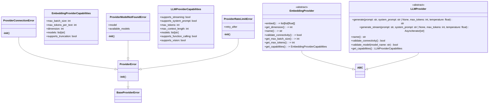

# File Overview

This file defines the base classes and exceptions for embedding and language model (LLM) providers in the local_deepwiki project. It provides abstract base classes (`EmbeddingProvider`, `LLMProvider`) that define the interface for implementing various AI provider integrations, along with a set of custom exception classes for handling provider-specific errors.

## Dependencies

This file imports:
- `asyncio`, `logging`, `random` from the standard library
- `ABC`, `abstractmethod` from `abc`
- `dataclass`, `field` from `dataclasses`
- `wraps` from `functools`
- `Any`, `AsyncIterator`, `Callable` from `typing`
- `ProviderError` from `local_deepwiki.errors`

## Related Files

This file is related to:
- `src/local_deepwiki/cli/__init__.py`
- `src/local_deepwiki/core/__init__.py`
- `src/local_deepwiki/generators/source_refs.py`
- `src/local_deepwiki/generators/wiki.py`
- `src/local_deepwiki/logging.py`

# Classes

## ProviderError

Base exception for all provider errors.

Inherits from `local_deepwiki.errors.ProviderError` (DeepWikiError subclass) to provide consistent error handling with hints and context.

This class maintains backward compatibility with existing code that uses the simpler `(message, provider_name)` signature while also supporting the richer DeepWikiError features (`hint`, `context`, `original_error`).

### Constructor

```python
def __init__(
    self,
    message: str,
    provider_name: str | None = None,
    *,
    hint: str | None = None,
    context: dict[str, Any] | None = None,
    original_error: Exception | None = None,
)
```

- **message**: Error message
- **provider_name**: Name of the provider that caused the error
- **hint**: Suggested action to resolve the error
- **context**: Additional context about the error
- **original_error**: The underlying exception that caused this error

## ProviderConnectionError

Raised when a provider cannot be reached or connected to.

### Constructor

```python
def __init__(
    self,
    message: str,
    provider_name: str | None = None,
    original_error: Exception | None = None,
)
```

- **message**: Error message
- **provider_name**: Name of the provider that caused the error
- **original_error**: The underlying exception that caused this error

## ProviderRateLimitError

Raised when a provider rate limits the request.

### Constructor

```python
def __init__(
    self,
    message: str,
    provider_name: str | None = None,
    retry_after: float | None = None,
)
```

- **message**: Error message
- **provider_name**: Name of the provider that caused the error
- **retry_after**: Number of seconds to wait before retrying

## ProviderModelNotFoundError

Raised when the requested model is not available.

### Constructor

```python
def __init__(
    self,
    model: str,
    provider_name: str | None = None,
    available_models: list[str] | None = None,
)
```

- **model**: The model name that was requested
- **provider_name**: Name of the provider that caused the error
- **available_models**: List of models available from the provider

## ProviderAuthenticationError

Raised when authentication with the provider fails.

## ProviderConfigurationError

Raised when the provider is misconfigured.

## LLMProviderCapabilities

Capabilities of an LLM provider.

### Attributes

- `supports_streaming`: bool = True
- `supports_system_prompt`: bool = True
- `max_tokens`: int = 4096
- `max_context_length`: int = 128000
- `models`: list[str] = field(default_factory=list)
- `supports_function_calling`: bool = False
- `supports_vision`: bool = False

## EmbeddingProviderCapabilities

Capabilities of an embedding provider.

### Attributes

- `max_batch_size`: int = 100
- `max_tokens_per_text`: int = 8192
- `dimension`: int = 0
- `models`: list[str] = field(default_factory=list)
- `supports_truncation`: bool = True

## EmbeddingProvider

Abstract base class for embedding providers.

All embedding providers must implement the abstract methods defined here. The base class provides default implementations for optional methods.

### Methods

#### embed

```python
async def embed(self, texts: list[str]) -> list[list[float]]:
```

Generate embeddings for a list of texts.

- **texts**: List of text strings to embed.
- **Returns**: List of embedding vectors, one per input text.
- **Raises**: `ProviderConnectionError` if the provider cannot be reached.

## LLMProvider

Abstract base class for LLM providers.

### Methods

#### generate

```python
async def generate(
    self,
    prompt: str,
    system_prompt: str | None = None,
    max_tokens: int = 4096,
    temperature: float = 0.7,
) -> str:
```

Generate text from a prompt.

- **prompt**: The user prompt.
- **system_prompt**: Optional system prompt.
- **max_tokens**: Maximum tokens to generate.
- **temperature**: Sampling temperature (0.0 to 1.0+).
- **Returns**: Generated text.
- **Raises**: `ProviderConnectionError` if the provider cannot be reached, `ProviderRateLimitError` if rate limited.

#### generate_stream

```python
async def generate_stream(
    self,
    prompt: str,
    system_prompt: str | None = None,
    max_tokens: int = 4096,
    temperature: float = 0.7,
) -> AsyncIterator[str]:
```

Generate text from a prompt with streaming.

- **prompt**: The user prompt.
- **system_prompt**: Optional system prompt.
- **max_tokens**: Maximum tokens to generate.
- **temperature**: Sampling temperature.
- **Yields**: Generated text chunks.
- **Raises**: `ProviderConnectionError` if the provider cannot be reached, `ProviderRateLimitError` if rate limited.

#### name

```python
def name(self) -> str:
```

Get the provider name.

- **Returns**: A string identifier for this provider (e.g., "anthropic:claude-sonnet-4-20250514").

# Functions

## with_retry

Decorator to retry a function call with exponential backoff.

## decorator

Helper function for `with_retry`.

## wrapper

Internal wrapper function used by `with_retry`.

# Integration

This file is part of the local_deepwiki core infrastructure and provides the foundational abstractions for integrating with various AI providers. It is used by:

- `src/local_deepwiki/providers/__init__.py` (via `EmbeddingProvider` and `LLMProvider`)
- Test files that validate provider implementations

The classes defined here are used by:
- `test_providers` (uses `ProviderError`, `ProviderConnectionError`)
- `test_openai_embeddings` (uses `ProviderConnectionError`, `ProviderError`)

# Usage Examples

## Creating an Embedding Provider

```python
from local_deepwiki.providers.base import EmbeddingProvider

class MyEmbeddingProvider(EmbeddingProvider):
    async def embed(self, texts: list[str]) -> list[list[float]]:
        # Implementation here
        pass
```

## Creating an LLM Provider

```python
from local_deepwiki.providers.base import LLMProvider

class MyLLMProvider(LLMProvider):
    async def generate(
        self,
        prompt: str,
        system_prompt: str | None = None,
        max_tokens: int = 4096,
        temperature: float = 0.7,
    ) -> str:
        # Implementation here
        pass

    async def generate_stream(
        self,
        prompt: str,
        system_prompt: str | None = None,
        max_tokens: int = 4096,
        temperature: float = 0.7,
    ) -> AsyncIterator[str]:
        # Implementation here
        pass

    def name(self) -> str:
        return "my-provider"
```

## Handling Errors

```python
from local_deepwiki.providers.base import ProviderConnectionError

try:
    # Some provider operation
    pass
except ProviderConnectionError as e:
    print(f"Connection failed: {e}")
```

## API Reference

### class `ProviderError`

**Inherits from:** `BaseProviderError`

Base exception for all provider errors.  Inherits from local_deepwiki.errors.ProviderError (DeepWikiError subclass) to provide consistent error handling with hints and context.  This class maintains backward compatibility with existing code that uses the simpler (message, provider_name) signature while also supporting the richer DeepWikiError features (hint, context, original_error).

**Methods:**


<details>
<summary>View Source (lines 21-48) | <a href="https://github.com/UrbanDiver/local-deepwiki-mcp/blob/main/src/local_deepwiki/providers/base.py#L21-L48">GitHub</a></summary>

```python
class ProviderError(BaseProviderError):
    """Base exception for all provider errors.

    Inherits from local_deepwiki.errors.ProviderError (DeepWikiError subclass)
    to provide consistent error handling with hints and context.

    This class maintains backward compatibility with existing code that uses
    the simpler (message, provider_name) signature while also supporting
    the richer DeepWikiError features (hint, context, original_error).
    """

    def __init__(
        self,
        message: str,
        provider_name: str | None = None,
        *,
        hint: str | None = None,
        context: dict[str, Any] | None = None,
        original_error: Exception | None = None,
    ):
        # Call the parent (BaseProviderError) __init__ with all parameters
        super().__init__(
            message=message,
            hint=hint,
            context=context,
            provider_name=provider_name,
            original_error=original_error,
        )
```

</details>

#### `__init__`

```python
def __init__(message: str, provider_name: str | None = None, hint: str | None = None, context: dict[str, Any] | None = None, original_error: Exception | None = None)
```


| Parameter | Type | Default | Description |
|-----------|------|---------|-------------|
| `message` | `str` | - | - |
| `provider_name` | `str | None` | `None` | - |
| `hint` | `str | None` | `None` | - |
| `context` | `dict[str, Any] | None` | `None` | - |
| `original_error` | `Exception | None` | `None` | - |


<details>
<summary>View Source (lines 21-48) | <a href="https://github.com/UrbanDiver/local-deepwiki-mcp/blob/main/src/local_deepwiki/providers/base.py#L21-L48">GitHub</a></summary>

```python
class ProviderError(BaseProviderError):
    """Base exception for all provider errors.

    Inherits from local_deepwiki.errors.ProviderError (DeepWikiError subclass)
    to provide consistent error handling with hints and context.

    This class maintains backward compatibility with existing code that uses
    the simpler (message, provider_name) signature while also supporting
    the richer DeepWikiError features (hint, context, original_error).
    """

    def __init__(
        self,
        message: str,
        provider_name: str | None = None,
        *,
        hint: str | None = None,
        context: dict[str, Any] | None = None,
        original_error: Exception | None = None,
    ):
        # Call the parent (BaseProviderError) __init__ with all parameters
        super().__init__(
            message=message,
            hint=hint,
            context=context,
            provider_name=provider_name,
            original_error=original_error,
        )
```

</details>

### class `ProviderConnectionError`

**Inherits from:** `ProviderError`

Raised when a provider cannot be reached or connected to.

**Methods:**


<details>
<summary>View Source (lines 51-65) | <a href="https://github.com/UrbanDiver/local-deepwiki-mcp/blob/main/src/local_deepwiki/providers/base.py#L51-L65">GitHub</a></summary>

```python
class ProviderConnectionError(ProviderError):
    """Raised when a provider cannot be reached or connected to."""

    def __init__(
        self,
        message: str,
        provider_name: str | None = None,
        original_error: Exception | None = None,
    ):
        super().__init__(
            message,
            provider_name,
            original_error=original_error,
            hint="Check your network connection and verify the service is accessible.",
        )
```

</details>

#### `__init__`

```python
def __init__(message: str, provider_name: str | None = None, original_error: Exception | None = None)
```


| Parameter | Type | Default | Description |
|-----------|------|---------|-------------|
| `message` | `str` | - | - |
| `provider_name` | `str | None` | `None` | - |
| `original_error` | `Exception | None` | `None` | - |


<details>
<summary>View Source (lines 51-65) | <a href="https://github.com/UrbanDiver/local-deepwiki-mcp/blob/main/src/local_deepwiki/providers/base.py#L51-L65">GitHub</a></summary>

```python
class ProviderConnectionError(ProviderError):
    """Raised when a provider cannot be reached or connected to."""

    def __init__(
        self,
        message: str,
        provider_name: str | None = None,
        original_error: Exception | None = None,
    ):
        super().__init__(
            message,
            provider_name,
            original_error=original_error,
            hint="Check your network connection and verify the service is accessible.",
        )
```

</details>

### class `ProviderRateLimitError`

**Inherits from:** `ProviderError`

Raised when a provider rate limits the request.

**Methods:**


<details>
<summary>View Source (lines 68-81) | <a href="https://github.com/UrbanDiver/local-deepwiki-mcp/blob/main/src/local_deepwiki/providers/base.py#L68-L81">GitHub</a></summary>

```python
class ProviderRateLimitError(ProviderError):
    """Raised when a provider rate limits the request."""

    def __init__(
        self,
        message: str,
        provider_name: str | None = None,
        retry_after: float | None = None,
    ):
        self.retry_after = retry_after
        hint = "Wait a few minutes and try again, or consider upgrading your API plan."
        if retry_after:
            hint = f"Rate limited. Retry after {retry_after} seconds."
        super().__init__(message, provider_name, hint=hint)
```

</details>

#### `__init__`

```python
def __init__(message: str, provider_name: str | None = None, retry_after: float | None = None)
```


| Parameter | Type | Default | Description |
|-----------|------|---------|-------------|
| `message` | `str` | - | - |
| `provider_name` | `str | None` | `None` | - |
| `retry_after` | `float | None` | `None` | - |


<details>
<summary>View Source (lines 68-81) | <a href="https://github.com/UrbanDiver/local-deepwiki-mcp/blob/main/src/local_deepwiki/providers/base.py#L68-L81">GitHub</a></summary>

```python
class ProviderRateLimitError(ProviderError):
    """Raised when a provider rate limits the request."""

    def __init__(
        self,
        message: str,
        provider_name: str | None = None,
        retry_after: float | None = None,
    ):
        self.retry_after = retry_after
        hint = "Wait a few minutes and try again, or consider upgrading your API plan."
        if retry_after:
            hint = f"Rate limited. Retry after {retry_after} seconds."
        super().__init__(message, provider_name, hint=hint)
```

</details>

### class `ProviderModelNotFoundError`

**Inherits from:** `ProviderError`

Raised when the requested model is not available.

**Methods:**


<details>
<summary>View Source (lines 84-104) | <a href="https://github.com/UrbanDiver/local-deepwiki-mcp/blob/main/src/local_deepwiki/providers/base.py#L84-L104">GitHub</a></summary>

```python
class ProviderModelNotFoundError(ProviderError):
    """Raised when the requested model is not available."""

    def __init__(
        self,
        model: str,
        provider_name: str | None = None,
        available_models: list[str] | None = None,
    ):
        self.model = model
        self.available_models = available_models or []
        if available_models:
            models_str = ", ".join(available_models[:10])
            if len(available_models) > 10:
                models_str += f"... ({len(available_models)} total)"
            message = f"Model '{model}' not found. Available models: {models_str}"
            hint = f"Try one of the available models: {models_str}"
        else:
            message = f"Model '{model}' not found"
            hint = "Check the model name and ensure it's accessible in your account."
        super().__init__(message, provider_name, hint=hint)
```

</details>

#### `__init__`

```python
def __init__(model: str, provider_name: str | None = None, available_models: list[str] | None = None)
```


| Parameter | Type | Default | Description |
|-----------|------|---------|-------------|
| `model` | `str` | - | - |
| `provider_name` | `str | None` | `None` | - |
| `available_models` | `list[str] | None` | `None` | - |


<details>
<summary>View Source (lines 84-104) | <a href="https://github.com/UrbanDiver/local-deepwiki-mcp/blob/main/src/local_deepwiki/providers/base.py#L84-L104">GitHub</a></summary>

```python
class ProviderModelNotFoundError(ProviderError):
    """Raised when the requested model is not available."""

    def __init__(
        self,
        model: str,
        provider_name: str | None = None,
        available_models: list[str] | None = None,
    ):
        self.model = model
        self.available_models = available_models or []
        if available_models:
            models_str = ", ".join(available_models[:10])
            if len(available_models) > 10:
                models_str += f"... ({len(available_models)} total)"
            message = f"Model '{model}' not found. Available models: {models_str}"
            hint = f"Try one of the available models: {models_str}"
        else:
            message = f"Model '{model}' not found"
            hint = "Check the model name and ensure it's accessible in your account."
        super().__init__(message, provider_name, hint=hint)
```

</details>

### class `ProviderAuthenticationError`

**Inherits from:** `ProviderError`

Raised when authentication with the provider fails.


<details>
<summary>View Source (lines 107-110) | <a href="https://github.com/UrbanDiver/local-deepwiki-mcp/blob/main/src/local_deepwiki/providers/base.py#L107-L110">GitHub</a></summary>

```python
class ProviderAuthenticationError(ProviderError):
    """Raised when authentication with the provider fails."""

    pass
```

</details>

### class `ProviderConfigurationError`

**Inherits from:** `ProviderError`

Raised when the provider is misconfigured.


<details>
<summary>View Source (lines 113-116) | <a href="https://github.com/UrbanDiver/local-deepwiki-mcp/blob/main/src/local_deepwiki/providers/base.py#L113-L116">GitHub</a></summary>

```python
class ProviderConfigurationError(ProviderError):
    """Raised when the provider is misconfigured."""

    pass
```

</details>

### class `LLMProviderCapabilities`

Capabilities of an LLM provider.


<details>
<summary>View Source (lines 125-134) | <a href="https://github.com/UrbanDiver/local-deepwiki-mcp/blob/main/src/local_deepwiki/providers/base.py#L125-L134">GitHub</a></summary>

```python
class LLMProviderCapabilities:
    """Capabilities of an LLM provider."""

    supports_streaming: bool = True
    supports_system_prompt: bool = True
    max_tokens: int = 4096
    max_context_length: int = 128000
    models: list[str] = field(default_factory=list)
    supports_function_calling: bool = False
    supports_vision: bool = False
```

</details>

### class `EmbeddingProviderCapabilities`

Capabilities of an embedding provider.


<details>
<summary>View Source (lines 138-145) | <a href="https://github.com/UrbanDiver/local-deepwiki-mcp/blob/main/src/local_deepwiki/providers/base.py#L138-L145">GitHub</a></summary>

```python
class EmbeddingProviderCapabilities:
    """Capabilities of an embedding provider."""

    max_batch_size: int = 100
    max_tokens_per_text: int = 8192
    dimension: int = 0
    models: list[str] = field(default_factory=list)
    supports_truncation: bool = True
```

</details>

### class `EmbeddingProvider`

**Inherits from:** `ABC`

Abstract base class for embedding providers.  All embedding providers must implement the abstract methods defined here. The base class provides default implementations for optional methods.

**Methods:**


<details>
<summary>View Source (lines 260-351) | <a href="https://github.com/UrbanDiver/local-deepwiki-mcp/blob/main/src/local_deepwiki/providers/base.py#L260-L351">GitHub</a></summary>

```python
class EmbeddingProvider(ABC):
    """Abstract base class for embedding providers.

    All embedding providers must implement the abstract methods defined here.
    The base class provides default implementations for optional methods.
    """

    @abstractmethod
    async def embed(self, texts: list[str]) -> list[list[float]]:
        """Generate embeddings for a list of texts.

        Args:
            texts: List of text strings to embed.

        Returns:
            List of embedding vectors, one per input text.

        Raises:
            ProviderConnectionError: If the provider cannot be reached.
            ProviderRateLimitError: If rate limited by the provider.
            ProviderAuthenticationError: If authentication fails.
        """
        pass

    @abstractmethod
    def get_dimension(self) -> int:
        """Get the embedding dimension.

        Returns:
            The dimension of the embedding vectors.
        """
        pass

    @property
    @abstractmethod
    def name(self) -> str:
        """Get the provider name.

        Returns:
            A string identifier for this provider (e.g., "openai:text-embedding-3-small").
        """
        pass

    async def validate_connectivity(self) -> bool:
        """Test that the provider is reachable and configured correctly.

        Returns:
            True if the provider is accessible and properly configured.

        Raises:
            ProviderConnectionError: If the provider cannot be reached.
            ProviderAuthenticationError: If authentication fails.
            ProviderConfigurationError: If misconfigured.
        """
        # Default implementation: try to embed a simple text
        try:
            await self.embed(["test"])
            return True
        except Exception as e:
            raise ProviderConnectionError(
                f"Failed to validate connectivity: {e}",
                provider_name=self.name,
                original_error=e,
            ) from e

    def get_max_batch_size(self) -> int:
        """Return maximum number of texts that can be embedded in a single call.

        Returns:
            Maximum batch size. Default is 100.
        """
        return 100

    def get_max_tokens(self) -> int:
        """Return maximum tokens per text.

        Returns:
            Maximum tokens per text. Default is 8192.
        """
        return 8192

    def get_capabilities(self) -> EmbeddingProviderCapabilities:
        """Return provider capabilities.

        Returns:
            EmbeddingProviderCapabilities dataclass with provider information.
        """
        return EmbeddingProviderCapabilities(
            max_batch_size=self.get_max_batch_size(),
            max_tokens_per_text=self.get_max_tokens(),
            dimension=self.get_dimension(),
        )
```

</details>

#### `embed`

```python
async def embed(texts: list[str]) -> list[list[float]]
```

Generate embeddings for a list of texts.


| Parameter | Type | Default | Description |
|-----------|------|---------|-------------|
| `texts` | `list[str]` | - | List of text strings to embed. |


<details>
<summary>View Source (lines 260-351) | <a href="https://github.com/UrbanDiver/local-deepwiki-mcp/blob/main/src/local_deepwiki/providers/base.py#L260-L351">GitHub</a></summary>

```python
class EmbeddingProvider(ABC):
    """Abstract base class for embedding providers.

    All embedding providers must implement the abstract methods defined here.
    The base class provides default implementations for optional methods.
    """

    @abstractmethod
    async def embed(self, texts: list[str]) -> list[list[float]]:
        """Generate embeddings for a list of texts.

        Args:
            texts: List of text strings to embed.

        Returns:
            List of embedding vectors, one per input text.

        Raises:
            ProviderConnectionError: If the provider cannot be reached.
            ProviderRateLimitError: If rate limited by the provider.
            ProviderAuthenticationError: If authentication fails.
        """
        pass

    @abstractmethod
    def get_dimension(self) -> int:
        """Get the embedding dimension.

        Returns:
            The dimension of the embedding vectors.
        """
        pass

    @property
    @abstractmethod
    def name(self) -> str:
        """Get the provider name.

        Returns:
            A string identifier for this provider (e.g., "openai:text-embedding-3-small").
        """
        pass

    async def validate_connectivity(self) -> bool:
        """Test that the provider is reachable and configured correctly.

        Returns:
            True if the provider is accessible and properly configured.

        Raises:
            ProviderConnectionError: If the provider cannot be reached.
            ProviderAuthenticationError: If authentication fails.
            ProviderConfigurationError: If misconfigured.
        """
        # Default implementation: try to embed a simple text
        try:
            await self.embed(["test"])
            return True
        except Exception as e:
            raise ProviderConnectionError(
                f"Failed to validate connectivity: {e}",
                provider_name=self.name,
                original_error=e,
            ) from e

    def get_max_batch_size(self) -> int:
        """Return maximum number of texts that can be embedded in a single call.

        Returns:
            Maximum batch size. Default is 100.
        """
        return 100

    def get_max_tokens(self) -> int:
        """Return maximum tokens per text.

        Returns:
            Maximum tokens per text. Default is 8192.
        """
        return 8192

    def get_capabilities(self) -> EmbeddingProviderCapabilities:
        """Return provider capabilities.

        Returns:
            EmbeddingProviderCapabilities dataclass with provider information.
        """
        return EmbeddingProviderCapabilities(
            max_batch_size=self.get_max_batch_size(),
            max_tokens_per_text=self.get_max_tokens(),
            dimension=self.get_dimension(),
        )
```

</details>

#### `get_dimension`

```python
def get_dimension() -> int
```

Get the embedding dimension.


<details>
<summary>View Source (lines 260-351) | <a href="https://github.com/UrbanDiver/local-deepwiki-mcp/blob/main/src/local_deepwiki/providers/base.py#L260-L351">GitHub</a></summary>

```python
class EmbeddingProvider(ABC):
    """Abstract base class for embedding providers.

    All embedding providers must implement the abstract methods defined here.
    The base class provides default implementations for optional methods.
    """

    @abstractmethod
    async def embed(self, texts: list[str]) -> list[list[float]]:
        """Generate embeddings for a list of texts.

        Args:
            texts: List of text strings to embed.

        Returns:
            List of embedding vectors, one per input text.

        Raises:
            ProviderConnectionError: If the provider cannot be reached.
            ProviderRateLimitError: If rate limited by the provider.
            ProviderAuthenticationError: If authentication fails.
        """
        pass

    @abstractmethod
    def get_dimension(self) -> int:
        """Get the embedding dimension.

        Returns:
            The dimension of the embedding vectors.
        """
        pass

    @property
    @abstractmethod
    def name(self) -> str:
        """Get the provider name.

        Returns:
            A string identifier for this provider (e.g., "openai:text-embedding-3-small").
        """
        pass

    async def validate_connectivity(self) -> bool:
        """Test that the provider is reachable and configured correctly.

        Returns:
            True if the provider is accessible and properly configured.

        Raises:
            ProviderConnectionError: If the provider cannot be reached.
            ProviderAuthenticationError: If authentication fails.
            ProviderConfigurationError: If misconfigured.
        """
        # Default implementation: try to embed a simple text
        try:
            await self.embed(["test"])
            return True
        except Exception as e:
            raise ProviderConnectionError(
                f"Failed to validate connectivity: {e}",
                provider_name=self.name,
                original_error=e,
            ) from e

    def get_max_batch_size(self) -> int:
        """Return maximum number of texts that can be embedded in a single call.

        Returns:
            Maximum batch size. Default is 100.
        """
        return 100

    def get_max_tokens(self) -> int:
        """Return maximum tokens per text.

        Returns:
            Maximum tokens per text. Default is 8192.
        """
        return 8192

    def get_capabilities(self) -> EmbeddingProviderCapabilities:
        """Return provider capabilities.

        Returns:
            EmbeddingProviderCapabilities dataclass with provider information.
        """
        return EmbeddingProviderCapabilities(
            max_batch_size=self.get_max_batch_size(),
            max_tokens_per_text=self.get_max_tokens(),
            dimension=self.get_dimension(),
        )
```

</details>

#### `name`

```python
def name() -> str
```

Get the provider name.


<details>
<summary>View Source (lines 260-351) | <a href="https://github.com/UrbanDiver/local-deepwiki-mcp/blob/main/src/local_deepwiki/providers/base.py#L260-L351">GitHub</a></summary>

```python
class EmbeddingProvider(ABC):
    """Abstract base class for embedding providers.

    All embedding providers must implement the abstract methods defined here.
    The base class provides default implementations for optional methods.
    """

    @abstractmethod
    async def embed(self, texts: list[str]) -> list[list[float]]:
        """Generate embeddings for a list of texts.

        Args:
            texts: List of text strings to embed.

        Returns:
            List of embedding vectors, one per input text.

        Raises:
            ProviderConnectionError: If the provider cannot be reached.
            ProviderRateLimitError: If rate limited by the provider.
            ProviderAuthenticationError: If authentication fails.
        """
        pass

    @abstractmethod
    def get_dimension(self) -> int:
        """Get the embedding dimension.

        Returns:
            The dimension of the embedding vectors.
        """
        pass

    @property
    @abstractmethod
    def name(self) -> str:
        """Get the provider name.

        Returns:
            A string identifier for this provider (e.g., "openai:text-embedding-3-small").
        """
        pass

    async def validate_connectivity(self) -> bool:
        """Test that the provider is reachable and configured correctly.

        Returns:
            True if the provider is accessible and properly configured.

        Raises:
            ProviderConnectionError: If the provider cannot be reached.
            ProviderAuthenticationError: If authentication fails.
            ProviderConfigurationError: If misconfigured.
        """
        # Default implementation: try to embed a simple text
        try:
            await self.embed(["test"])
            return True
        except Exception as e:
            raise ProviderConnectionError(
                f"Failed to validate connectivity: {e}",
                provider_name=self.name,
                original_error=e,
            ) from e

    def get_max_batch_size(self) -> int:
        """Return maximum number of texts that can be embedded in a single call.

        Returns:
            Maximum batch size. Default is 100.
        """
        return 100

    def get_max_tokens(self) -> int:
        """Return maximum tokens per text.

        Returns:
            Maximum tokens per text. Default is 8192.
        """
        return 8192

    def get_capabilities(self) -> EmbeddingProviderCapabilities:
        """Return provider capabilities.

        Returns:
            EmbeddingProviderCapabilities dataclass with provider information.
        """
        return EmbeddingProviderCapabilities(
            max_batch_size=self.get_max_batch_size(),
            max_tokens_per_text=self.get_max_tokens(),
            dimension=self.get_dimension(),
        )
```

</details>

#### `validate_connectivity`

```python
async def validate_connectivity() -> bool
```

Test that the provider is reachable and configured correctly.


<details>
<summary>View Source (lines 260-351) | <a href="https://github.com/UrbanDiver/local-deepwiki-mcp/blob/main/src/local_deepwiki/providers/base.py#L260-L351">GitHub</a></summary>

```python
class EmbeddingProvider(ABC):
    """Abstract base class for embedding providers.

    All embedding providers must implement the abstract methods defined here.
    The base class provides default implementations for optional methods.
    """

    @abstractmethod
    async def embed(self, texts: list[str]) -> list[list[float]]:
        """Generate embeddings for a list of texts.

        Args:
            texts: List of text strings to embed.

        Returns:
            List of embedding vectors, one per input text.

        Raises:
            ProviderConnectionError: If the provider cannot be reached.
            ProviderRateLimitError: If rate limited by the provider.
            ProviderAuthenticationError: If authentication fails.
        """
        pass

    @abstractmethod
    def get_dimension(self) -> int:
        """Get the embedding dimension.

        Returns:
            The dimension of the embedding vectors.
        """
        pass

    @property
    @abstractmethod
    def name(self) -> str:
        """Get the provider name.

        Returns:
            A string identifier for this provider (e.g., "openai:text-embedding-3-small").
        """
        pass

    async def validate_connectivity(self) -> bool:
        """Test that the provider is reachable and configured correctly.

        Returns:
            True if the provider is accessible and properly configured.

        Raises:
            ProviderConnectionError: If the provider cannot be reached.
            ProviderAuthenticationError: If authentication fails.
            ProviderConfigurationError: If misconfigured.
        """
        # Default implementation: try to embed a simple text
        try:
            await self.embed(["test"])
            return True
        except Exception as e:
            raise ProviderConnectionError(
                f"Failed to validate connectivity: {e}",
                provider_name=self.name,
                original_error=e,
            ) from e

    def get_max_batch_size(self) -> int:
        """Return maximum number of texts that can be embedded in a single call.

        Returns:
            Maximum batch size. Default is 100.
        """
        return 100

    def get_max_tokens(self) -> int:
        """Return maximum tokens per text.

        Returns:
            Maximum tokens per text. Default is 8192.
        """
        return 8192

    def get_capabilities(self) -> EmbeddingProviderCapabilities:
        """Return provider capabilities.

        Returns:
            EmbeddingProviderCapabilities dataclass with provider information.
        """
        return EmbeddingProviderCapabilities(
            max_batch_size=self.get_max_batch_size(),
            max_tokens_per_text=self.get_max_tokens(),
            dimension=self.get_dimension(),
        )
```

</details>

#### `get_max_batch_size`

```python
def get_max_batch_size() -> int
```

Return maximum number of texts that can be embedded in a single call.


<details>
<summary>View Source (lines 260-351) | <a href="https://github.com/UrbanDiver/local-deepwiki-mcp/blob/main/src/local_deepwiki/providers/base.py#L260-L351">GitHub</a></summary>

```python
class EmbeddingProvider(ABC):
    """Abstract base class for embedding providers.

    All embedding providers must implement the abstract methods defined here.
    The base class provides default implementations for optional methods.
    """

    @abstractmethod
    async def embed(self, texts: list[str]) -> list[list[float]]:
        """Generate embeddings for a list of texts.

        Args:
            texts: List of text strings to embed.

        Returns:
            List of embedding vectors, one per input text.

        Raises:
            ProviderConnectionError: If the provider cannot be reached.
            ProviderRateLimitError: If rate limited by the provider.
            ProviderAuthenticationError: If authentication fails.
        """
        pass

    @abstractmethod
    def get_dimension(self) -> int:
        """Get the embedding dimension.

        Returns:
            The dimension of the embedding vectors.
        """
        pass

    @property
    @abstractmethod
    def name(self) -> str:
        """Get the provider name.

        Returns:
            A string identifier for this provider (e.g., "openai:text-embedding-3-small").
        """
        pass

    async def validate_connectivity(self) -> bool:
        """Test that the provider is reachable and configured correctly.

        Returns:
            True if the provider is accessible and properly configured.

        Raises:
            ProviderConnectionError: If the provider cannot be reached.
            ProviderAuthenticationError: If authentication fails.
            ProviderConfigurationError: If misconfigured.
        """
        # Default implementation: try to embed a simple text
        try:
            await self.embed(["test"])
            return True
        except Exception as e:
            raise ProviderConnectionError(
                f"Failed to validate connectivity: {e}",
                provider_name=self.name,
                original_error=e,
            ) from e

    def get_max_batch_size(self) -> int:
        """Return maximum number of texts that can be embedded in a single call.

        Returns:
            Maximum batch size. Default is 100.
        """
        return 100

    def get_max_tokens(self) -> int:
        """Return maximum tokens per text.

        Returns:
            Maximum tokens per text. Default is 8192.
        """
        return 8192

    def get_capabilities(self) -> EmbeddingProviderCapabilities:
        """Return provider capabilities.

        Returns:
            EmbeddingProviderCapabilities dataclass with provider information.
        """
        return EmbeddingProviderCapabilities(
            max_batch_size=self.get_max_batch_size(),
            max_tokens_per_text=self.get_max_tokens(),
            dimension=self.get_dimension(),
        )
```

</details>

#### `get_max_tokens`

```python
def get_max_tokens() -> int
```

Return maximum tokens per text.


<details>
<summary>View Source (lines 260-351) | <a href="https://github.com/UrbanDiver/local-deepwiki-mcp/blob/main/src/local_deepwiki/providers/base.py#L260-L351">GitHub</a></summary>

```python
class EmbeddingProvider(ABC):
    """Abstract base class for embedding providers.

    All embedding providers must implement the abstract methods defined here.
    The base class provides default implementations for optional methods.
    """

    @abstractmethod
    async def embed(self, texts: list[str]) -> list[list[float]]:
        """Generate embeddings for a list of texts.

        Args:
            texts: List of text strings to embed.

        Returns:
            List of embedding vectors, one per input text.

        Raises:
            ProviderConnectionError: If the provider cannot be reached.
            ProviderRateLimitError: If rate limited by the provider.
            ProviderAuthenticationError: If authentication fails.
        """
        pass

    @abstractmethod
    def get_dimension(self) -> int:
        """Get the embedding dimension.

        Returns:
            The dimension of the embedding vectors.
        """
        pass

    @property
    @abstractmethod
    def name(self) -> str:
        """Get the provider name.

        Returns:
            A string identifier for this provider (e.g., "openai:text-embedding-3-small").
        """
        pass

    async def validate_connectivity(self) -> bool:
        """Test that the provider is reachable and configured correctly.

        Returns:
            True if the provider is accessible and properly configured.

        Raises:
            ProviderConnectionError: If the provider cannot be reached.
            ProviderAuthenticationError: If authentication fails.
            ProviderConfigurationError: If misconfigured.
        """
        # Default implementation: try to embed a simple text
        try:
            await self.embed(["test"])
            return True
        except Exception as e:
            raise ProviderConnectionError(
                f"Failed to validate connectivity: {e}",
                provider_name=self.name,
                original_error=e,
            ) from e

    def get_max_batch_size(self) -> int:
        """Return maximum number of texts that can be embedded in a single call.

        Returns:
            Maximum batch size. Default is 100.
        """
        return 100

    def get_max_tokens(self) -> int:
        """Return maximum tokens per text.

        Returns:
            Maximum tokens per text. Default is 8192.
        """
        return 8192

    def get_capabilities(self) -> EmbeddingProviderCapabilities:
        """Return provider capabilities.

        Returns:
            EmbeddingProviderCapabilities dataclass with provider information.
        """
        return EmbeddingProviderCapabilities(
            max_batch_size=self.get_max_batch_size(),
            max_tokens_per_text=self.get_max_tokens(),
            dimension=self.get_dimension(),
        )
```

</details>

#### `get_capabilities`

```python
def get_capabilities() -> EmbeddingProviderCapabilities
```

Return provider capabilities.


<details>
<summary>View Source (lines 260-351) | <a href="https://github.com/UrbanDiver/local-deepwiki-mcp/blob/main/src/local_deepwiki/providers/base.py#L260-L351">GitHub</a></summary>

```python
class EmbeddingProvider(ABC):
    """Abstract base class for embedding providers.

    All embedding providers must implement the abstract methods defined here.
    The base class provides default implementations for optional methods.
    """

    @abstractmethod
    async def embed(self, texts: list[str]) -> list[list[float]]:
        """Generate embeddings for a list of texts.

        Args:
            texts: List of text strings to embed.

        Returns:
            List of embedding vectors, one per input text.

        Raises:
            ProviderConnectionError: If the provider cannot be reached.
            ProviderRateLimitError: If rate limited by the provider.
            ProviderAuthenticationError: If authentication fails.
        """
        pass

    @abstractmethod
    def get_dimension(self) -> int:
        """Get the embedding dimension.

        Returns:
            The dimension of the embedding vectors.
        """
        pass

    @property
    @abstractmethod
    def name(self) -> str:
        """Get the provider name.

        Returns:
            A string identifier for this provider (e.g., "openai:text-embedding-3-small").
        """
        pass

    async def validate_connectivity(self) -> bool:
        """Test that the provider is reachable and configured correctly.

        Returns:
            True if the provider is accessible and properly configured.

        Raises:
            ProviderConnectionError: If the provider cannot be reached.
            ProviderAuthenticationError: If authentication fails.
            ProviderConfigurationError: If misconfigured.
        """
        # Default implementation: try to embed a simple text
        try:
            await self.embed(["test"])
            return True
        except Exception as e:
            raise ProviderConnectionError(
                f"Failed to validate connectivity: {e}",
                provider_name=self.name,
                original_error=e,
            ) from e

    def get_max_batch_size(self) -> int:
        """Return maximum number of texts that can be embedded in a single call.

        Returns:
            Maximum batch size. Default is 100.
        """
        return 100

    def get_max_tokens(self) -> int:
        """Return maximum tokens per text.

        Returns:
            Maximum tokens per text. Default is 8192.
        """
        return 8192

    def get_capabilities(self) -> EmbeddingProviderCapabilities:
        """Return provider capabilities.

        Returns:
            EmbeddingProviderCapabilities dataclass with provider information.
        """
        return EmbeddingProviderCapabilities(
            max_batch_size=self.get_max_batch_size(),
            max_tokens_per_text=self.get_max_tokens(),
            dimension=self.get_dimension(),
        )
```

</details>

### class `LLMProvider`

**Inherits from:** `ABC`

Abstract base class for LLM providers.  All LLM providers must implement the abstract methods defined here. The base class provides default implementations for optional methods.

**Methods:**


<details>
<summary>View Source (lines 354-479) | <a href="https://github.com/UrbanDiver/local-deepwiki-mcp/blob/main/src/local_deepwiki/providers/base.py#L354-L479">GitHub</a></summary>

```python
class LLMProvider(ABC):
    # Methods: generate, generate_stream, name, validate_connectivity, validate_model, get_capabilities
```

</details>

#### `generate`

```python
async def generate(prompt: str, system_prompt: str | None = None, max_tokens: int = 4096, temperature: float = 0.7) -> str
```

Generate text from a prompt.


| Parameter | Type | Default | Description |
|-----------|------|---------|-------------|
| `prompt` | `str` | - | The user prompt. |
| `system_prompt` | `str | None` | `None` | Optional system prompt. |
| `max_tokens` | `int` | `4096` | Maximum tokens to generate. |
| `temperature` | `float` | `0.7` | Sampling temperature (0.0 to 1.0+). |


<details>
<summary>View Source (lines 362-386) | <a href="https://github.com/UrbanDiver/local-deepwiki-mcp/blob/main/src/local_deepwiki/providers/base.py#L362-L386">GitHub</a></summary>

```python
async def generate(
        self,
        prompt: str,
        system_prompt: str | None = None,
        max_tokens: int = 4096,
        temperature: float = 0.7,
    ) -> str:
        """Generate text from a prompt.

        Args:
            prompt: The user prompt.
            system_prompt: Optional system prompt.
            max_tokens: Maximum tokens to generate.
            temperature: Sampling temperature (0.0 to 1.0+).

        Returns:
            Generated text.

        Raises:
            ProviderConnectionError: If the provider cannot be reached.
            ProviderRateLimitError: If rate limited by the provider.
            ProviderAuthenticationError: If authentication fails.
            ProviderModelNotFoundError: If the model is not available.
        """
        pass
```

</details>

#### `generate_stream`

```python
async def generate_stream(prompt: str, system_prompt: str | None = None, max_tokens: int = 4096, temperature: float = 0.7) -> AsyncIterator[str]
```

Generate text from a prompt with streaming.


| Parameter | Type | Default | Description |
|-----------|------|---------|-------------|
| `prompt` | `str` | - | The user prompt. |
| `system_prompt` | `str | None` | `None` | Optional system prompt. |
| `max_tokens` | `int` | `4096` | Maximum tokens to generate. |
| `temperature` | `float` | `0.7` | Sampling temperature. |


<details>
<summary>View Source (lines 389-416) | <a href="https://github.com/UrbanDiver/local-deepwiki-mcp/blob/main/src/local_deepwiki/providers/base.py#L389-L416">GitHub</a></summary>

```python
async def generate_stream(
        self,
        prompt: str,
        system_prompt: str | None = None,
        max_tokens: int = 4096,
        temperature: float = 0.7,
    ) -> AsyncIterator[str]:
        """Generate text from a prompt with streaming.

        Args:
            prompt: The user prompt.
            system_prompt: Optional system prompt.
            max_tokens: Maximum tokens to generate.
            temperature: Sampling temperature.

        Yields:
            Generated text chunks.

        Raises:
            ProviderConnectionError: If the provider cannot be reached.
            ProviderRateLimitError: If rate limited by the provider.
            ProviderAuthenticationError: If authentication fails.
            ProviderModelNotFoundError: If the model is not available.
        """
        # Make this an async generator for proper typing
        if False:  # pragma: no cover
            yield ""
        raise NotImplementedError
```

</details>

#### `name`

```python
def name() -> str
```

Get the provider name.


<details>
<summary>View Source (lines 420-426) | <a href="https://github.com/UrbanDiver/local-deepwiki-mcp/blob/main/src/local_deepwiki/providers/base.py#L420-L426">GitHub</a></summary>

```python
def name(self) -> str:
        """Get the provider name.

        Returns:
            A string identifier for this provider (e.g., "anthropic:claude-sonnet-4-20250514").
        """
        pass
```

</details>

#### `validate_connectivity`

```python
async def validate_connectivity() -> bool
```

Test that the provider is reachable and configured correctly.


<details>
<summary>View Source (lines 428-451) | <a href="https://github.com/UrbanDiver/local-deepwiki-mcp/blob/main/src/local_deepwiki/providers/base.py#L428-L451">GitHub</a></summary>

```python
async def validate_connectivity(self) -> bool:
        """Test that the provider is reachable and configured correctly.

        Returns:
            True if the provider is accessible and properly configured.

        Raises:
            ProviderConnectionError: If the provider cannot be reached.
            ProviderAuthenticationError: If authentication fails.
            ProviderConfigurationError: If misconfigured.
        """
        # Default implementation: try a simple generation
        try:
            await self.generate("Say 'OK'", max_tokens=10)
            return True
        except ProviderModelNotFoundError:
            # Model not found is a valid response - connectivity works
            raise
        except Exception as e:
            raise ProviderConnectionError(
                f"Failed to validate connectivity: {e}",
                provider_name=self.name,
                original_error=e,
            ) from e
```

</details>

#### `validate_model`

```python
async def validate_model(model_name: str) -> bool
```

Test that a specific model is available.


| Parameter | Type | Default | Description |
|-----------|------|---------|-------------|
| `model_name` | `str` | - | The model name to validate. |


<details>
<summary>View Source (lines 453-471) | <a href="https://github.com/UrbanDiver/local-deepwiki-mcp/blob/main/src/local_deepwiki/providers/base.py#L453-L471">GitHub</a></summary>

```python
async def validate_model(self, model_name: str) -> bool:
        """Test that a specific model is available.

        Args:
            model_name: The model name to validate.

        Returns:
            True if the model is available.

        Raises:
            ProviderModelNotFoundError: If the model is not available.
            ProviderConnectionError: If the provider cannot be reached.
        """
        # Default implementation - subclasses should override for better validation
        # This just checks if the current model matches
        current_model = self.name.split(":")[-1] if ":" in self.name else self.name
        if current_model == model_name:
            return True
        raise ProviderModelNotFoundError(model_name, provider_name=self.name)
```

</details>

#### `get_capabilities`

```python
def get_capabilities() -> LLMProviderCapabilities
```

Return provider capabilities.


---


<details>
<summary>View Source (lines 473-479) | <a href="https://github.com/UrbanDiver/local-deepwiki-mcp/blob/main/src/local_deepwiki/providers/base.py#L473-L479">GitHub</a></summary>

```python
def get_capabilities(self) -> LLMProviderCapabilities:
        """Return provider capabilities.

        Returns:
            LLMProviderCapabilities dataclass with provider information.
        """
        return LLMProviderCapabilities()
```

</details>

### Functions

#### `with_retry`

```python
def with_retry(max_attempts: int = 3, base_delay: float = 1.0, max_delay: float = 30.0, exponential_base: float = 2.0, jitter: bool = True) -> Callable[[Callable[..., Any]], Callable[..., Any]]
```

Decorator for adding retry logic with exponential backoff to async functions.


| Parameter | Type | Default | Description |
|-----------|------|---------|-------------|
| `max_attempts` | `int` | `3` | Maximum number of attempts before giving up. |
| `base_delay` | `float` | `1.0` | Initial delay between retries in seconds. |
| `max_delay` | `float` | `30.0` | Maximum delay between retries in seconds. |
| `exponential_base` | `float` | `2.0` | Base for exponential backoff calculation. |
| `jitter` | `bool` | `True` | Whether to add random jitter to delays. |

**Returns:** `Callable[[Callable[..., Any]], Callable[..., Any]]`


<details>
<summary>View Source (lines 163-252) | <a href="https://github.com/UrbanDiver/local-deepwiki-mcp/blob/main/src/local_deepwiki/providers/base.py#L163-L252">GitHub</a></summary>

```python
def with_retry(
    max_attempts: int = 3,
    base_delay: float = 1.0,
    max_delay: float = 30.0,
    exponential_base: float = 2.0,
    jitter: bool = True,
) -> Callable[[Callable[..., Any]], Callable[..., Any]]:
    """Decorator for adding retry logic with exponential backoff to async functions.

    Args:
        max_attempts: Maximum number of attempts before giving up.
        base_delay: Initial delay between retries in seconds.
        max_delay: Maximum delay between retries in seconds.
        exponential_base: Base for exponential backoff calculation.
        jitter: Whether to add random jitter to delays.

    Returns:
        Decorated function with retry logic.
    """

    def decorator(func: Callable[..., Any]) -> Callable[..., Any]:
        @wraps(func)
        async def wrapper(*args: Any, **kwargs: Any) -> Any:
            last_exception: Exception | None = None

            for attempt in range(1, max_attempts + 1):
                try:
                    return await func(*args, **kwargs)
                except RETRYABLE_EXCEPTIONS as e:
                    last_exception = e
                    if attempt == max_attempts:
                        logger.warning(f"{func.__name__} failed after {max_attempts} attempts: {e}")
                        raise

                    # Calculate delay with exponential backoff
                    delay = min(base_delay * (exponential_base ** (attempt - 1)), max_delay)
                    if jitter:
                        delay = delay * (0.5 + random.random())

                    logger.warning(
                        f"{func.__name__} attempt {attempt} failed: {e}. "
                        f"Retrying in {delay:.2f}s..."
                    )
                    await asyncio.sleep(delay)
                except Exception as e:  # noqa: BLE001
                    # Broad catch is intentional: different API providers (Anthropic, OpenAI,
                    # Ollama) raise different exception types for rate limits. We inspect
                    # the error message to determine retry behavior, and re-raise immediately
                    # if not a recognized retryable condition.
                    error_str = str(e).lower()
                    if "rate" in error_str and "limit" in error_str:
                        last_exception = e
                        if attempt == max_attempts:
                            logger.warning(
                                f"{func.__name__} rate limited after {max_attempts} attempts"
                            )
                            raise

                        delay = min(base_delay * (exponential_base**attempt), max_delay)
                        if jitter:
                            delay = delay * (0.5 + random.random())

                        logger.warning(f"{func.__name__} rate limited. Retrying in {delay:.2f}s...")
                        await asyncio.sleep(delay)
                    elif "overloaded" in error_str or "503" in error_str or "502" in error_str:
                        # Server overloaded - retry with backoff
                        last_exception = e
                        if attempt == max_attempts:
                            raise

                        delay = min(base_delay * (exponential_base**attempt), max_delay)
                        if jitter:
                            delay = delay * (0.5 + random.random())

                        logger.warning(
                            f"{func.__name__} server overloaded. Retrying in {delay:.2f}s..."
                        )
                        await asyncio.sleep(delay)
                    else:
                        # Non-retryable error
                        raise

            # Should not reach here, but just in case
            if last_exception:  # pragma: no cover
                raise last_exception  # pragma: no cover
            raise RuntimeError(f"{func.__name__} failed unexpectedly")

        return wrapper

    return decorator
```

</details>

#### `decorator`

```python
def decorator(func: Callable[..., Any]) -> Callable[..., Any]
```


| Parameter | Type | Default | Description |
|-----------|------|---------|-------------|
| `func` | `Callable[..., Any]` | - | - |

**Returns:** `Callable[..., Any]`


<details>
<summary>View Source (lines 183-250) | <a href="https://github.com/UrbanDiver/local-deepwiki-mcp/blob/main/src/local_deepwiki/providers/base.py#L183-L250">GitHub</a></summary>

```python
def decorator(func: Callable[..., Any]) -> Callable[..., Any]:
        @wraps(func)
        async def wrapper(*args: Any, **kwargs: Any) -> Any:
            last_exception: Exception | None = None

            for attempt in range(1, max_attempts + 1):
                try:
                    return await func(*args, **kwargs)
                except RETRYABLE_EXCEPTIONS as e:
                    last_exception = e
                    if attempt == max_attempts:
                        logger.warning(f"{func.__name__} failed after {max_attempts} attempts: {e}")
                        raise

                    # Calculate delay with exponential backoff
                    delay = min(base_delay * (exponential_base ** (attempt - 1)), max_delay)
                    if jitter:
                        delay = delay * (0.5 + random.random())

                    logger.warning(
                        f"{func.__name__} attempt {attempt} failed: {e}. "
                        f"Retrying in {delay:.2f}s..."
                    )
                    await asyncio.sleep(delay)
                except Exception as e:  # noqa: BLE001
                    # Broad catch is intentional: different API providers (Anthropic, OpenAI,
                    # Ollama) raise different exception types for rate limits. We inspect
                    # the error message to determine retry behavior, and re-raise immediately
                    # if not a recognized retryable condition.
                    error_str = str(e).lower()
                    if "rate" in error_str and "limit" in error_str:
                        last_exception = e
                        if attempt == max_attempts:
                            logger.warning(
                                f"{func.__name__} rate limited after {max_attempts} attempts"
                            )
                            raise

                        delay = min(base_delay * (exponential_base**attempt), max_delay)
                        if jitter:
                            delay = delay * (0.5 + random.random())

                        logger.warning(f"{func.__name__} rate limited. Retrying in {delay:.2f}s...")
                        await asyncio.sleep(delay)
                    elif "overloaded" in error_str or "503" in error_str or "502" in error_str:
                        # Server overloaded - retry with backoff
                        last_exception = e
                        if attempt == max_attempts:
                            raise

                        delay = min(base_delay * (exponential_base**attempt), max_delay)
                        if jitter:
                            delay = delay * (0.5 + random.random())

                        logger.warning(
                            f"{func.__name__} server overloaded. Retrying in {delay:.2f}s..."
                        )
                        await asyncio.sleep(delay)
                    else:
                        # Non-retryable error
                        raise

            # Should not reach here, but just in case
            if last_exception:  # pragma: no cover
                raise last_exception  # pragma: no cover
            raise RuntimeError(f"{func.__name__} failed unexpectedly")

        return wrapper
```

</details>

#### `wrapper`

`@wraps(func)`

```python
async def wrapper() -> Any
```

**Returns:** `Any`


<details>
<summary>View Source (lines 185-248) | <a href="https://github.com/UrbanDiver/local-deepwiki-mcp/blob/main/src/local_deepwiki/providers/base.py#L185-L248">GitHub</a></summary>

```python
async def wrapper(*args: Any, **kwargs: Any) -> Any:
            last_exception: Exception | None = None

            for attempt in range(1, max_attempts + 1):
                try:
                    return await func(*args, **kwargs)
                except RETRYABLE_EXCEPTIONS as e:
                    last_exception = e
                    if attempt == max_attempts:
                        logger.warning(f"{func.__name__} failed after {max_attempts} attempts: {e}")
                        raise

                    # Calculate delay with exponential backoff
                    delay = min(base_delay * (exponential_base ** (attempt - 1)), max_delay)
                    if jitter:
                        delay = delay * (0.5 + random.random())

                    logger.warning(
                        f"{func.__name__} attempt {attempt} failed: {e}. "
                        f"Retrying in {delay:.2f}s..."
                    )
                    await asyncio.sleep(delay)
                except Exception as e:  # noqa: BLE001
                    # Broad catch is intentional: different API providers (Anthropic, OpenAI,
                    # Ollama) raise different exception types for rate limits. We inspect
                    # the error message to determine retry behavior, and re-raise immediately
                    # if not a recognized retryable condition.
                    error_str = str(e).lower()
                    if "rate" in error_str and "limit" in error_str:
                        last_exception = e
                        if attempt == max_attempts:
                            logger.warning(
                                f"{func.__name__} rate limited after {max_attempts} attempts"
                            )
                            raise

                        delay = min(base_delay * (exponential_base**attempt), max_delay)
                        if jitter:
                            delay = delay * (0.5 + random.random())

                        logger.warning(f"{func.__name__} rate limited. Retrying in {delay:.2f}s...")
                        await asyncio.sleep(delay)
                    elif "overloaded" in error_str or "503" in error_str or "502" in error_str:
                        # Server overloaded - retry with backoff
                        last_exception = e
                        if attempt == max_attempts:
                            raise

                        delay = min(base_delay * (exponential_base**attempt), max_delay)
                        if jitter:
                            delay = delay * (0.5 + random.random())

                        logger.warning(
                            f"{func.__name__} server overloaded. Retrying in {delay:.2f}s..."
                        )
                        await asyncio.sleep(delay)
                    else:
                        # Non-retryable error
                        raise

            # Should not reach here, but just in case
            if last_exception:  # pragma: no cover
                raise last_exception  # pragma: no cover
            raise RuntimeError(f"{func.__name__} failed unexpectedly")
```

</details>

## Class Diagram


```mermaid
classDiagram
    class EmbeddingProvider {
        <<abstract>>
        +embed() -> list[list[float]]
        +get_dimension() -> int
        +name() -> str
        +validate_connectivity() -> bool
        +get_max_batch_size() -> int
        +get_max_tokens() -> int
        +get_capabilities() -> EmbeddingProviderCapabilities
    }
    class EmbeddingProviderCapabilities {
        +max_batch_size: int
        +max_tokens_per_text: int
        +dimension: int
        +models: list[str]
        +supports_truncation: bool
    }
    class LLMProvider {
        <<abstract>>
        +generate(prompt: str, system_prompt: str | None, max_tokens: int, temperature: float) str
        +generate_stream(prompt: str, system_prompt: str | None, max_tokens: int, temperature: float) AsyncIterator[str]
        +name() str
        +validate_connectivity() bool
        +validate_model(model_name: str) bool
        +get_capabilities() LLMProviderCapabilities
    }
    class LLMProviderCapabilities {
        +supports_streaming: bool
        +supports_system_prompt: bool
        +max_tokens: int
        +max_context_length: int
        +models: list[str]
        +supports_function_calling: bool
        +supports_vision: bool
    }
    class ProviderConnectionError {
        -__init__()
    }
    class ProviderError {
        -__init__()
    }
    class ProviderModelNotFoundError {
        +model
        +available_models
        -__init__()
    }
    class ProviderRateLimitError {
        +retry_after
        -__init__()
    }
    EmbeddingProvider --|> ABC
    LLMProvider --|> ABC
    ProviderConnectionError --|> ProviderError
    ProviderError --|> BaseProviderError
    ProviderModelNotFoundError --|> ProviderError
    ProviderRateLimitError --|> ProviderError
```

## Call Graph


```mermaid
flowchart TD
    N0[EmbeddingProvider.get_capab...]
    N1[EmbeddingProvider.validate_...]
    N2[EmbeddingProviderCapabilities]
    N3[LLMProvider.get_capabilities]
    N4[LLMProvider.validate_connec...]
    N5[LLMProvider.validate_model]
    N6[LLMProviderCapabilities]
    N7[ProviderConnectionError]
    N8[ProviderConnectionError.__i...]
    N9[ProviderError.__init__]
    N10[ProviderModelNotFoundError]
    N11[ProviderModelNotFoundError....]
    N12[ProviderRateLimitError.__in...]
    N13[RuntimeError]
    N14[__init__]
    N15[decorator]
    N16[embed]
    N17[func]
    N18[generate]
    N19[get_dimension]
    N20[get_max_batch_size]
    N21[get_max_tokens]
    N22[random]
    N23[sleep]
    N24[with_retry]
    N25[wrapper]
    N26[wraps]
    N24 --> N26
    N24 --> N17
    N24 --> N22
    N24 --> N23
    N24 --> N13
    N15 --> N26
    N15 --> N17
    N15 --> N22
    N15 --> N23
    N15 --> N13
    N25 --> N17
    N25 --> N22
    N25 --> N23
    N25 --> N13
    N9 --> N14
    N8 --> N14
    N12 --> N14
    N11 --> N14
    N1 --> N16
    N1 --> N7
    N0 --> N2
    N0 --> N20
    N0 --> N21
    N0 --> N19
    N4 --> N18
    N4 --> N7
    N5 --> N10
    N3 --> N6
    classDef func fill:#e1f5fe
    class N2,N6,N7,N10,N13,N14,N15,N16,N17,N18,N19,N20,N21,N22,N23,N24,N25,N26 func
    classDef method fill:#fff3e0
    class N0,N1,N3,N4,N5,N8,N9,N11,N12 method
```

## Used By

Functions and methods in this file and their callers:

- **`EmbeddingProviderCapabilities`**: called by `EmbeddingProvider.get_capabilities`
- **`LLMProviderCapabilities`**: called by `LLMProvider.get_capabilities`
- **`ProviderConnectionError`**: called by `EmbeddingProvider.validate_connectivity`, `LLMProvider.validate_connectivity`
- **`ProviderModelNotFoundError`**: called by `LLMProvider.validate_model`
- **`RuntimeError`**: called by `decorator`, `with_retry`, `wrapper`
- **`__init__`**: called by `ProviderConnectionError.__init__`, `ProviderError.__init__`, `ProviderModelNotFoundError.__init__`, `ProviderRateLimitError.__init__`
- **`embed`**: called by `EmbeddingProvider.validate_connectivity`
- **`func`**: called by `decorator`, `with_retry`, `wrapper`
- **`generate`**: called by `LLMProvider.validate_connectivity`
- **`get_dimension`**: called by `EmbeddingProvider.get_capabilities`
- **`get_max_batch_size`**: called by `EmbeddingProvider.get_capabilities`
- **`get_max_tokens`**: called by `EmbeddingProvider.get_capabilities`
- **`random`**: called by `decorator`, `with_retry`, `wrapper`
- **`sleep`**: called by `decorator`, `with_retry`, `wrapper`
- **`wraps`**: called by `decorator`, `with_retry`

## Usage Examples

*Examples extracted from test files*

### Test that calling EmbeddingProvider.embed raises TypeError (abstract)

From `test_base_provider.py::TestEmbeddingProviderAbstractMethods::test_embed_abstract_method_body`:

```python
# These calls will execute the pass statements in the abstract base
assert provider.get_dimension() == 768
assert provider.name == "test-embedding"
```

### Test that calling EmbeddingProvider.embed raises TypeError (abstract)

From `test_base_provider.py::TestEmbeddingProviderAbstractMethods::test_embed_abstract_method_body`:

```python
class ConcreteEmbeddingProvider(EmbeddingProvider):
    """Concrete implementation for testing."""

    async def embed(self, texts: list[str]) -> list[list[float]]:
        # Call the abstract method's pass body via super
        await EmbeddingProvider.embed(self, texts)
        return [[0.0] * 768 for _ in texts]

    def get_dimension(self) -> int:
        # Call the abstract method's pass body via super
        EmbeddingProvider.get_dimension(self)
        return 768

    @property
    def name(self) -> str:
        # We cannot call super() on abstract property in usual way
        return "test-embedding"

provider = ConcreteEmbeddingProvider()

# These calls will execute the pass statements in the abstract base
assert provider.get_dimension() == 768
assert provider.name == "test-embedding"
```

### Test that calling EmbeddingProvider.embed raises TypeError (abstract)

From `test_base_provider.py::TestEmbeddingProviderAbstractMethods::test_embed_abstract_method_body`:

```python
def name(self) -> str:
        # We cannot call super() on abstract property in usual way
        return "test-embedding"

provider = ConcreteEmbeddingProvider()

# These calls will execute the pass statements in the abstract base
assert provider.get_dimension() == 768
assert provider.name == "test-embedding"
```

### Test that embed abstract method body is covered

From `test_base_provider.py::TestEmbeddingProviderAbstractMethods::test_embed_abstract_calls_pass`:

```python
class TestEmbeddingProvider(EmbeddingProvider):
    """Test implementation that calls super."""

    async def embed(self, texts: list[str]) -> list[list[float]]:
        # Call parent's pass body
        result = await EmbeddingProvider.embed(self, texts)
        # result is None because pass returns None
        return [[0.0] * 768 for _ in texts]

    def get_dimension(self) -> int:
        return 768

    @property
    def name(self) -> str:
        return "test"

provider = TestEmbeddingProvider()
result = await provider.embed(["test"])
assert result == [[0.0] * 768]
```

### Test that embed abstract method body is covered

From `test_base_provider.py::TestEmbeddingProviderAbstractMethods::test_embed_abstract_calls_pass`:

```python
def name(self) -> str:
        return "test"

provider = TestEmbeddingProvider()
result = await provider.embed(["test"])
assert result == [[0.0] * 768]
```


## Last Modified

| Entity | Type | Author | Date | Commit |
|--------|------|--------|------|--------|
| `ProviderError` | class | Brian Breidenbach | 1 week ago | `89d3399` Add code quality improvemen... |
| `ProviderConnectionError` | class | Brian Breidenbach | 1 week ago | `89d3399` Add code quality improvemen... |
| `ProviderRateLimitError` | class | Brian Breidenbach | 1 week ago | `89d3399` Add code quality improvemen... |
| `ProviderModelNotFoundError` | class | Brian Breidenbach | 1 week ago | `89d3399` Add code quality improvemen... |
| `ProviderAuthenticationError` | class | Brian Breidenbach | 1 week ago | `a64166a` Add seven medium-priority e... |
| `ProviderConfigurationError` | class | Brian Breidenbach | 1 week ago | `a64166a` Add seven medium-priority e... |
| `LLMProviderCapabilities` | class | Brian Breidenbach | 1 week ago | `a64166a` Add seven medium-priority e... |
| `EmbeddingProviderCapabilities` | class | Brian Breidenbach | 1 week ago | `a64166a` Add seven medium-priority e... |
| `EmbeddingProvider` | class | Brian Breidenbach | 1 week ago | `a64166a` Add seven medium-priority e... |
| `LLMProvider` | class | Brian Breidenbach | 1 week ago | `a64166a` Add seven medium-priority e... |
| `generate` | method | Brian Breidenbach | 1 week ago | `a64166a` Add seven medium-priority e... |
| `generate_stream` | method | Brian Breidenbach | 1 week ago | `a64166a` Add seven medium-priority e... |
| `name` | method | Brian Breidenbach | 1 week ago | `a64166a` Add seven medium-priority e... |
| `validate_connectivity` | method | Brian Breidenbach | 1 week ago | `a64166a` Add seven medium-priority e... |
| `validate_model` | method | Brian Breidenbach | 1 week ago | `a64166a` Add seven medium-priority e... |
| `get_capabilities` | method | Brian Breidenbach | 1 week ago | `a64166a` Add seven medium-priority e... |
| `with_retry` | function | Brian Breidenbach | 1 week ago | `2424f98` Add comprehensive tests to ... |
| `decorator` | function | Brian Breidenbach | 1 week ago | `2424f98` Add comprehensive tests to ... |
| `wrapper` | function | Brian Breidenbach | 1 week ago | `2424f98` Add comprehensive tests to ... |