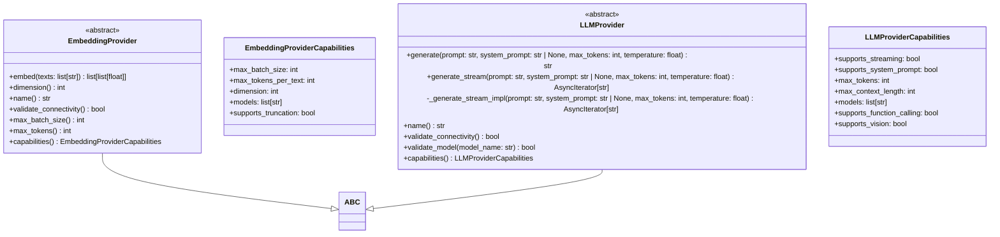
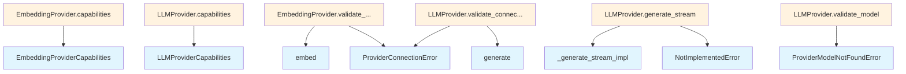

# File: `src/local_deepwiki/providers/base.py`

## File Overview

This file defines the base classes and interfaces for LLM and embedding providers within the `local_deepwiki` system. It establishes a common abstraction layer for different provider implementations (e.g., OpenAI, Anthropic, Ollama) to ensure consistent behavior, error handling, and configuration across the system.

The design rationale is to enforce a standardized contract for providers while allowing flexibility in implementation details. This promotes code reuse, testability, and maintainability by abstracting away provider-specific logic into a shared interface.

## Key Concepts

### Abstract Base Classes (ABCs)
The core of this module is built around abstract base classes (`EmbeddingProvider` and `LLMProvider`) which define the expected interface for provider implementations. This approach enforces consistency and ensures that all concrete provider classes implement required methods.

### Capability Models
Two dataclasses, `LLMProviderCapabilities` and `EmbeddingProviderCapabilities`, are used to describe what features a provider supports. This design allows for runtime checks and enables consumers to make informed decisions about which provider to use based on their requirements.

### Error Handling and Validation
The module integrates with `providers.errors` to provide consistent error handling and validation logic. This includes connectivity checks, authentication validation, and model availability verification. The use of [`validate_provider_credentials`](errors.md) and [`handle_api_status_error`](errors.md) ensures that providers behave predictably under various failure conditions.

### Retry Decorator Integration
The [`with_retry`](retry.md) [decorator](retry.md) from `providers.retry` is imported and can be used by provider implementations to automatically retry failed requests, improving robustness against transient failures.

## Integration

This file is a foundational component of the `local_deepwiki.providers` package and is used throughout the codebase. It is imported by:

- `LLMProviderCapabilities` and `EmbeddingProviderCapabilities` — used by various provider implementations like `anthropic`, `ollama`, `test_base_provider`, and others.
- `EmbeddingProvider` and `LLMProvider` — used by multiple concrete provider classes including `models`, `provider_types`, `registry`, and more.

It also imports from:
- `providers.errors`: Provides standardized exceptions for handling API errors, authentication issues, and configuration problems.
- `providers.retry`: Offers a retry mechanism that can wrap provider calls to improve resilience.

The file acts as a central point of integration for all provider-related logic, ensuring that different providers (e.g., `openai`, `anthropic`) adhere to a consistent API and error handling pattern.

## Design Notes

### Why Abstract Base Classes?
Using `ABC` ensures that any subclass of `EmbeddingProvider` or `LLMProvider` must implement specific methods like `embed`, `generate`, etc. This prevents runtime errors due to missing methods and encourages adherence to a shared interface.

### Capability Models for Flexibility
By defining `LLMProviderCapabilities` and `EmbeddingProviderCapabilities`, the system supports dynamic feature detection. For example, a client can check if a provider supports streaming before attempting to use it, avoiding `NotImplementedError` exceptions.

### Validation Patterns
The `validate_connectivity` and `validate_model` methods provide default implementations that can be overridden by concrete providers. This allows for more robust validation (e.g., checking actual model availability) without forcing all implementations to define complex logic.

### Streaming Support
The `generate_stream` method checks `self.capabilities.supports_streaming` before delegating to `_generate_stream_impl`. This pattern ensures that streaming is only attempted when supported, preventing unexpected failures.

### Default Values in Capabilities
Default values in `LLMProviderCapabilities` and `EmbeddingProviderCapabilities` provide sensible fallbacks for providers that don't override them. For example, `max_tokens` defaults to 4096 for LLMs and 8192 for embeddings, aligning with common limits in large language models and embedding models.

### Retry Decorator Usage
Although not explicitly used in the base classes themselves, the [`with_retry`](retry.md) [decorator](retry.md) is imported and available for use in provider implementations, enabling automatic retries for transient failures such as timeouts or rate limits.

### Error Handling Consistency
All exceptions raised by methods in `EmbeddingProvider` and `LLMProvider` are consistent with those defined in `providers.errors`. This ensures that consumers can reliably catch and handle provider-specific errors regardless of the underlying implementation.

## API Reference

### class `LLMProviderCapabilities`

Capabilities of an LLM provider.


<details>
<summary>View Source (lines 55-64) | <a href="https://github.com/UrbanDiver/local-deepwiki-mcp/blob/main/src/local_deepwiki/providers/base.py#L55-L64">GitHub</a></summary>

```python
class LLMProviderCapabilities:
    """Capabilities of an LLM provider."""

    supports_streaming: bool = True
    supports_system_prompt: bool = True
    max_tokens: int = 4096
    max_context_length: int = 128000
    models: list[str] = field(default_factory=list)
    supports_function_calling: bool = False
    supports_vision: bool = False
```

</details>

### class `EmbeddingProviderCapabilities`

Capabilities of an embedding provider.


<details>
<summary>View Source (lines 68-75) | <a href="https://github.com/UrbanDiver/local-deepwiki-mcp/blob/main/src/local_deepwiki/providers/base.py#L68-L75">GitHub</a></summary>

```python
class EmbeddingProviderCapabilities:
    """Capabilities of an embedding provider."""

    max_batch_size: int = 100
    max_tokens_per_text: int = 8192
    dimension: int = 0
    models: list[str] = field(default_factory=list)
    supports_truncation: bool = True
```

</details>

### class `EmbeddingProvider`

**Inherits from:** `ABC`

Abstract base class for embedding providers.  All embedding providers must implement the abstract methods defined here. The base class provides default implementations for optional methods.

**Methods:**


<details>
<summary>View Source (lines 83-185) | <a href="https://github.com/UrbanDiver/local-deepwiki-mcp/blob/main/src/local_deepwiki/providers/base.py#L83-L185">GitHub</a></summary>

```python
class EmbeddingProvider(ABC):
    # Methods: embed, dimension, name, validate_connectivity, max_batch_size, max_tokens, capabilities
```

</details>

#### `embed`

```python
async def embed(texts: list[str]) -> list[list[float]]
```

Generate embeddings for a list of texts.


| Parameter | Type | Default | Description |
|-----------|------|---------|-------------|
| `texts` | `list[str]` | - | List of text strings to embed. |


<details>
<summary>View Source (lines 91-105) | <a href="https://github.com/UrbanDiver/local-deepwiki-mcp/blob/main/src/local_deepwiki/providers/base.py#L91-L105">GitHub</a></summary>

```python
async def embed(self, texts: list[str]) -> list[list[float]]:
        """Generate embeddings for a list of texts.

        Args:
            texts: List of text strings to embed.

        Returns:
            List of embedding vectors, one per input text.

        Raises:
            ProviderConnectionError: If the provider cannot be reached.
            ProviderRateLimitError: If rate limited by the provider.
            ProviderAuthenticationError: If authentication fails.
        """
        pass
```

</details>

#### `dimension`

```python
def dimension() -> int
```

Get the embedding dimension.


<details>
<summary>View Source (lines 109-115) | <a href="https://github.com/UrbanDiver/local-deepwiki-mcp/blob/main/src/local_deepwiki/providers/base.py#L109-L115">GitHub</a></summary>

```python
def dimension(self) -> int:
        """Get the embedding dimension.

        Returns:
            The dimension of the embedding vectors.
        """
        pass
```

</details>

#### `name`

```python
def name() -> str
```

Get the provider name.


<details>
<summary>View Source (lines 119-125) | <a href="https://github.com/UrbanDiver/local-deepwiki-mcp/blob/main/src/local_deepwiki/providers/base.py#L119-L125">GitHub</a></summary>

```python
def name(self) -> str:
        """Get the provider name.

        Returns:
            A string identifier for this provider (e.g., "openai:text-embedding-3-small").
        """
        pass
```

</details>

#### `validate_connectivity`

```python
async def validate_connectivity() -> bool
```

Test that the provider is reachable and configured correctly.


<details>
<summary>View Source (lines 127-154) | <a href="https://github.com/UrbanDiver/local-deepwiki-mcp/blob/main/src/local_deepwiki/providers/base.py#L127-L154">GitHub</a></summary>

```python
async def validate_connectivity(self) -> bool:
        """Test that the provider is reachable and configured correctly.

        Returns:
            True if the provider is accessible and properly configured.

        Raises:
            ProviderConnectionError: If the provider cannot be reached.
            ProviderAuthenticationError: If authentication fails.
            ProviderConfigurationError: If misconfigured.
        """
        # Default implementation: try to embed a simple text
        try:
            await self.embed(["test"])
            return True
        except (
            ConnectionError,
            TimeoutError,
            OSError,
            ProviderConnectionError,
            ProviderAuthenticationError,
            ProviderRateLimitError,
        ) as e:
            raise ProviderConnectionError(
                f"Failed to validate connectivity: {e}",
                provider_name=self.name,
                original_error=e,
            ) from e
```

</details>

#### `max_batch_size`

```python
def max_batch_size() -> int
```

Return maximum number of texts that can be embedded in a single call.


<details>
<summary>View Source (lines 157-163) | <a href="https://github.com/UrbanDiver/local-deepwiki-mcp/blob/main/src/local_deepwiki/providers/base.py#L157-L163">GitHub</a></summary>

```python
def max_batch_size(self) -> int:
        """Return maximum number of texts that can be embedded in a single call.

        Returns:
            Maximum batch size. Default is 100.
        """
        return 100
```

</details>

#### `max_tokens`

```python
def max_tokens() -> int
```

Return maximum tokens per text.


<details>
<summary>View Source (lines 166-172) | <a href="https://github.com/UrbanDiver/local-deepwiki-mcp/blob/main/src/local_deepwiki/providers/base.py#L166-L172">GitHub</a></summary>

```python
def max_tokens(self) -> int:
        """Return maximum tokens per text.

        Returns:
            Maximum tokens per text. Default is 8192.
        """
        return 8192
```

</details>

#### `capabilities`

```python
def capabilities() -> EmbeddingProviderCapabilities
```

Return provider capabilities.


<details>
<summary>View Source (lines 175-185) | <a href="https://github.com/UrbanDiver/local-deepwiki-mcp/blob/main/src/local_deepwiki/providers/base.py#L175-L185">GitHub</a></summary>

```python
def capabilities(self) -> EmbeddingProviderCapabilities:
        """Return provider capabilities.

        Returns:
            EmbeddingProviderCapabilities dataclass with provider information.
        """
        return EmbeddingProviderCapabilities(
            max_batch_size=self.max_batch_size,
            max_tokens_per_text=self.max_tokens,
            dimension=self.dimension,
        )
```

</details>

### class `LLMProvider`

**Inherits from:** `ABC`

Abstract base class for LLM providers.  All LLM providers must implement the abstract methods defined here. The base class provides default implementations for optional methods.

**Methods:**


<details>
<summary>View Source (lines 188-356) | <a href="https://github.com/UrbanDiver/local-deepwiki-mcp/blob/main/src/local_deepwiki/providers/base.py#L188-L356">GitHub</a></summary>

```python
class LLMProvider(ABC):
    # Methods: generate, generate_stream, _generate_stream_impl, name, validate_connectivity, validate_model, capabilities
```

</details>

#### `generate`

```python
async def generate(prompt: str, system_prompt: str | None = None, max_tokens: int = 4096, temperature: float = 0.7) -> str
```

Generate text from a prompt.


| Parameter | Type | Default | Description |
|-----------|------|---------|-------------|
| `prompt` | `str` | - | The user prompt. |
| `system_prompt` | `str | None` | `None` | Optional system prompt. |
| `max_tokens` | `int` | `4096` | Maximum tokens to generate. |
| `temperature` | `float` | `0.7` | Sampling temperature (0.0 to 1.0+). |


<details>
<summary>View Source (lines 196-220) | <a href="https://github.com/UrbanDiver/local-deepwiki-mcp/blob/main/src/local_deepwiki/providers/base.py#L196-L220">GitHub</a></summary>

```python
async def generate(
        self,
        prompt: str,
        system_prompt: str | None = None,
        max_tokens: int = 4096,
        temperature: float = 0.7,
    ) -> str:
        """Generate text from a prompt.

        Args:
            prompt: The user prompt.
            system_prompt: Optional system prompt.
            max_tokens: Maximum tokens to generate.
            temperature: Sampling temperature (0.0 to 1.0+).

        Returns:
            Generated text.

        Raises:
            ProviderConnectionError: If the provider cannot be reached.
            ProviderRateLimitError: If rate limited by the provider.
            ProviderAuthenticationError: If authentication fails.
            ProviderModelNotFoundError: If the model is not available.
        """
        pass
```

</details>

#### `generate_stream`

```python
async def generate_stream(prompt: str, system_prompt: str | None = None, max_tokens: int = 4096, temperature: float = 0.7) -> AsyncIterator[str]
```

Generate text from a prompt with streaming.  Checks ``self.capabilities.supports_streaming`` before delegating to :meth:`_generate_stream_impl`.  Subclasses should override ``_generate_stream_impl`` rather than this method.


| Parameter | Type | Default | Description |
|-----------|------|---------|-------------|
| `prompt` | `str` | - | The user prompt. |
| `system_prompt` | `str | None` | `None` | Optional system prompt. |
| `max_tokens` | `int` | `4096` | Maximum tokens to generate. |
| `temperature` | `float` | `0.7` | Sampling temperature. |


<details>
<summary>View Source (lines 222-258) | <a href="https://github.com/UrbanDiver/local-deepwiki-mcp/blob/main/src/local_deepwiki/providers/base.py#L222-L258">GitHub</a></summary>

```python
async def generate_stream(
        self,
        prompt: str,
        system_prompt: str | None = None,
        max_tokens: int = 4096,
        temperature: float = 0.7,
    ) -> AsyncIterator[str]:
        """Generate text from a prompt with streaming.

        Checks ``self.capabilities.supports_streaming`` before delegating to
        :meth:`_generate_stream_impl`.  Subclasses should override
        ``_generate_stream_impl`` rather than this method.

        Args:
            prompt: The user prompt.
            system_prompt: Optional system prompt.
            max_tokens: Maximum tokens to generate.
            temperature: Sampling temperature.

        Yields:
            Generated text chunks.

        Raises:
            NotImplementedError: If the provider does not support streaming.
            ProviderConnectionError: If the provider cannot be reached.
            ProviderRateLimitError: If rate limited by the provider.
            ProviderAuthenticationError: If authentication fails.
            ProviderModelNotFoundError: If the model is not available.
        """
        if not self.capabilities.supports_streaming:
            raise NotImplementedError(
                f"{type(self).__name__} does not support streaming"
            )
        async for chunk in self._generate_stream_impl(
            prompt, system_prompt, max_tokens, temperature
        ):
            yield chunk
```

</details>

#### `name`

```python
def name() -> str
```

Get the provider name.


<details>
<summary>View Source (lines 289-295) | <a href="https://github.com/UrbanDiver/local-deepwiki-mcp/blob/main/src/local_deepwiki/providers/base.py#L289-L295">GitHub</a></summary>

```python
def name(self) -> str:
        """Get the provider name.

        Returns:
            A string identifier for this provider (e.g., "anthropic:claude-sonnet-4-20250514").
        """
        pass
```

</details>

#### `validate_connectivity`

```python
async def validate_connectivity() -> bool
```

Test that the provider is reachable and configured correctly.


<details>
<summary>View Source (lines 297-327) | <a href="https://github.com/UrbanDiver/local-deepwiki-mcp/blob/main/src/local_deepwiki/providers/base.py#L297-L327">GitHub</a></summary>

```python
async def validate_connectivity(self) -> bool:
        """Test that the provider is reachable and configured correctly.

        Returns:
            True if the provider is accessible and properly configured.

        Raises:
            ProviderConnectionError: If the provider cannot be reached.
            ProviderAuthenticationError: If authentication fails.
            ProviderConfigurationError: If misconfigured.
        """
        # Default implementation: try a simple generation
        try:
            await self.generate("Say 'OK'", max_tokens=10)
            return True
        except ProviderModelNotFoundError:
            # Model not found is a valid response - connectivity works
            raise
        except (
            ConnectionError,
            TimeoutError,
            OSError,
            ProviderConnectionError,
            ProviderAuthenticationError,
            ProviderRateLimitError,
        ) as e:
            raise ProviderConnectionError(
                f"Failed to validate connectivity: {e}",
                provider_name=self.name,
                original_error=e,
            ) from e
```

</details>

#### `validate_model`

```python
async def validate_model(model_name: str) -> bool
```

Test that a specific model is available.


| Parameter | Type | Default | Description |
|-----------|------|---------|-------------|
| `model_name` | `str` | - | The model name to validate. |


<details>
<summary>View Source (lines 329-347) | <a href="https://github.com/UrbanDiver/local-deepwiki-mcp/blob/main/src/local_deepwiki/providers/base.py#L329-L347">GitHub</a></summary>

```python
async def validate_model(self, model_name: str) -> bool:
        """Test that a specific model is available.

        Args:
            model_name: The model name to validate.

        Returns:
            True if the model is available.

        Raises:
            ProviderModelNotFoundError: If the model is not available.
            ProviderConnectionError: If the provider cannot be reached.
        """
        # Default implementation - subclasses should override for better validation
        # This just checks if the current model matches
        current_model = self.name.split(":")[-1] if ":" in self.name else self.name
        if current_model == model_name:
            return True
        raise ProviderModelNotFoundError(model_name, provider_name=self.name)
```

</details>

#### `capabilities`

```python
def capabilities() -> LLMProviderCapabilities
```

Return provider capabilities.


<details>
<summary>View Source (lines 350-356) | <a href="https://github.com/UrbanDiver/local-deepwiki-mcp/blob/main/src/local_deepwiki/providers/base.py#L350-L356">GitHub</a></summary>

```python
def capabilities(self) -> LLMProviderCapabilities:
        """Return provider capabilities.

        Returns:
            LLMProviderCapabilities dataclass with provider information.
        """
        return LLMProviderCapabilities()
```

</details>

## Class Diagram


```mermaid
classDiagram
    class EmbeddingProvider {
        <<abstract>>
        +embed(texts: list[str]) list[list[float]]
        +dimension() int
        +name() str
        +validate_connectivity() bool
        +max_batch_size() int
        +max_tokens() int
        +capabilities() EmbeddingProviderCapabilities
    }
    class EmbeddingProviderCapabilities {
        +max_batch_size: int
        +max_tokens_per_text: int
        +dimension: int
        +models: list[str]
        +supports_truncation: bool
    }
    class LLMProvider {
        <<abstract>>
        +generate(prompt: str, system_prompt: str | None, max_tokens: int, temperature: float) str
        +generate_stream(prompt: str, system_prompt: str | None, max_tokens: int, temperature: float) AsyncIterator[str]
        -_generate_stream_impl(prompt: str, system_prompt: str | None, max_tokens: int, temperature: float) AsyncIterator[str]
        +name() str
        +validate_connectivity() bool
        +validate_model(model_name: str) bool
        +capabilities() LLMProviderCapabilities
    }
    class LLMProviderCapabilities {
        +supports_streaming: bool
        +supports_system_prompt: bool
        +max_tokens: int
        +max_context_length: int
        +models: list[str]
        +supports_function_calling: bool
        +supports_vision: bool
    }
    EmbeddingProvider --|> ABC
    LLMProvider --|> ABC
```

## Call Graph


```mermaid
flowchart TD
    N0[EmbeddingProvider.capabilities]
    N1[EmbeddingProvider.validate_...]
    N2[EmbeddingProviderCapabilities]
    N3[LLMProvider.capabilities]
    N4[LLMProvider.generate_stream]
    N5[LLMProvider.validate_connec...]
    N6[LLMProvider.validate_model]
    N7[LLMProviderCapabilities]
    N8[NotImplementedError]
    N9[ProviderConnectionError]
    N10[ProviderModelNotFoundError]
    N11[_generate_stream_impl]
    N12[embed]
    N13[generate]
    N1 --> N12
    N1 --> N9
    N0 --> N2
    N4 --> N8
    N4 --> N11
    N5 --> N13
    N5 --> N9
    N6 --> N10
    N3 --> N7
    classDef func fill:#e1f5fe
    class N2,N7,N8,N9,N10,N11,N12,N13 func
    classDef method fill:#fff3e0
    class N0,N1,N3,N4,N5,N6 method
```

## Used By

Functions and methods in this file and their callers:

- **`EmbeddingProviderCapabilities`**: called by `EmbeddingProvider.capabilities`
- **`LLMProviderCapabilities`**: called by `LLMProvider.capabilities`
- **`NotImplementedError`**: called by `LLMProvider.generate_stream`
- **[`ProviderConnectionError`](errors.md)**: called by `EmbeddingProvider.validate_connectivity`, `LLMProvider.validate_connectivity`
- **[`ProviderModelNotFoundError`](errors.md)**: called by `LLMProvider.validate_model`
- **`_generate_stream_impl`**: called by `LLMProvider.generate_stream`
- **`embed`**: called by `EmbeddingProvider.validate_connectivity`
- **`generate`**: called by `LLMProvider.validate_connectivity`

## Usage Examples

*Examples extracted from test files*

### Test that calling EmbeddingProvider.embed raises TypeError (abstract)

From `test_base_provider.py::TestEmbeddingProviderAbstractMethods::test_embed_abstract_method_body`:

```python
# These calls will execute the pass statements in the abstract base
assert provider.dimension == 768
assert provider.name == "test-embedding"
```

### Test that calling EmbeddingProvider.embed raises TypeError (abstract)

From `test_base_provider.py::TestEmbeddingProviderAbstractMethods::test_embed_abstract_method_body`:

```python
class ConcreteEmbeddingProvider(EmbeddingProvider):
    """Concrete implementation for testing."""

    async def embed(self, texts: list[str]) -> list[list[float]]:
        # Call the abstract method's pass body via super
        await EmbeddingProvider.embed(self, texts)
        return [[0.0] * 768 for _ in texts]

    @property
    def dimension(self) -> int:
        # Call the abstract property's pass body via super
        EmbeddingProvider.dimension.fget(self)
        return 768

    @property
    def name(self) -> str:
        # We cannot call super() on abstract property in usual way
        return "test-embedding"

provider = ConcreteEmbeddingProvider()

# These calls will execute the pass statements in the abstract base
assert provider.dimension == 768
assert provider.name == "test-embedding"
```

### Test that calling EmbeddingProvider.embed raises TypeError (abstract)

From `test_base_provider.py::TestEmbeddingProviderAbstractMethods::test_embed_abstract_method_body`:

```python
async def embed(self, texts: list[str]) -> list[list[float]]:
        # Call the abstract method's pass body via super
        await EmbeddingProvider.embed(self, texts)
        return [[0.0] * 768 for _ in texts]

    @property
    def dimension(self) -> int:
        # Call the abstract property's pass body via super
        EmbeddingProvider.dimension.fget(self)
        return 768

    @property
    def name(self) -> str:
        # We cannot call super() on abstract property in usual way
        return "test-embedding"

provider = ConcreteEmbeddingProvider()

# These calls will execute the pass statements in the abstract base
assert provider.dimension == 768
assert provider.name == "test-embedding"
```

### Test that calling EmbeddingProvider.embed raises TypeError (abstract)

From `test_base_provider.py::TestEmbeddingProviderAbstractMethods::test_embed_abstract_method_body`:

```python
def dimension(self) -> int:
        # Call the abstract property's pass body via super
        EmbeddingProvider.dimension.fget(self)
        return 768

    @property
    def name(self) -> str:
        # We cannot call super() on abstract property in usual way
        return "test-embedding"

provider = ConcreteEmbeddingProvider()

# These calls will execute the pass statements in the abstract base
assert provider.dimension == 768
assert provider.name == "test-embedding"
```

### Test that calling EmbeddingProvider.embed raises TypeError (abstract)

From `test_base_provider.py::TestEmbeddingProviderAbstractMethods::test_embed_abstract_method_body`:

```python
def name(self) -> str:
        # We cannot call super() on abstract property in usual way
        return "test-embedding"

provider = ConcreteEmbeddingProvider()

# These calls will execute the pass statements in the abstract base
assert provider.dimension == 768
assert provider.name == "test-embedding"
```


## Last Modified

| Entity | Type | Author | Date | Commit |
|--------|------|--------|------|--------|
| `LLMProvider` | class | Brian Breidenbach | 2 weeks ago | `c850cb5` feat: enforce provider stre... |
| `generate_stream` | method | Brian Breidenbach | 2 weeks ago | `c850cb5` feat: enforce provider stre... |
| `_generate_stream_impl` | method | Brian Breidenbach | 2 weeks ago | `c850cb5` feat: enforce provider stre... |
| `EmbeddingProvider` | class | Brian Breidenbach | Feb 20, 2026 | `8182b15` refactor: Pythonic API impr... |
| `dimension` | method | Brian Breidenbach | Feb 20, 2026 | `8182b15` refactor: Pythonic API impr... |
| `max_batch_size` | method | Brian Breidenbach | Feb 20, 2026 | `8182b15` refactor: Pythonic API impr... |
| `max_tokens` | method | Brian Breidenbach | Feb 20, 2026 | `8182b15` refactor: Pythonic API impr... |
| `capabilities` | method | Brian Breidenbach | Feb 20, 2026 | `8182b15` refactor: Pythonic API impr... |
| `capabilities` | method | Brian Breidenbach | Feb 20, 2026 | `8182b15` refactor: Pythonic API impr... |
| `validate_connectivity` | method | Brian Breidenbach | Feb 11, 2026 | `74bebaf` fix: improve exception hand... |
| `validate_connectivity` | method | Brian Breidenbach | Feb 11, 2026 | `74bebaf` fix: improve exception hand... |
| `LLMProviderCapabilities` | class | Brian Breidenbach | Jan 26, 2026 | `a64166a` Add seven medium-priority e... |
| `EmbeddingProviderCapabilities` | class | Brian Breidenbach | Jan 26, 2026 | `a64166a` Add seven medium-priority e... |
| `embed` | method | Brian Breidenbach | Jan 26, 2026 | `a64166a` Add seven medium-priority e... |
| `name` | method | Brian Breidenbach | Jan 26, 2026 | `a64166a` Add seven medium-priority e... |
| `generate` | method | Brian Breidenbach | Jan 26, 2026 | `a64166a` Add seven medium-priority e... |
| `name` | method | Brian Breidenbach | Jan 26, 2026 | `a64166a` Add seven medium-priority e... |
| `validate_model` | method | Brian Breidenbach | Jan 26, 2026 | `a64166a` Add seven medium-priority e... |

## Additional Source Code

Source code for functions and methods not listed in the API Reference above.

#### `_generate_stream_impl`

<details>
<summary>View Source (lines 261-285) | <a href="https://github.com/UrbanDiver/local-deepwiki-mcp/blob/main/src/local_deepwiki/providers/base.py#L261-L285">GitHub</a></summary>

```python
async def _generate_stream_impl(
        self,
        prompt: str,
        system_prompt: str | None = None,
        max_tokens: int = 4096,
        temperature: float = 0.7,
    ) -> AsyncIterator[str]:
        """Implement streaming generation.

        Subclasses must override this method to provide streaming support.
        It is only called after the streaming capability check passes.

        Args:
            prompt: The user prompt.
            system_prompt: Optional system prompt.
            max_tokens: Maximum tokens to generate.
            temperature: Sampling temperature.

        Yields:
            Generated text chunks.
        """
        # Make this an async generator for proper typing
        if False:  # pragma: no cover
            yield ""
        raise NotImplementedError
```

</details>

## Relevant Source Files

- `src/local_deepwiki/providers/base.py:55-64`
