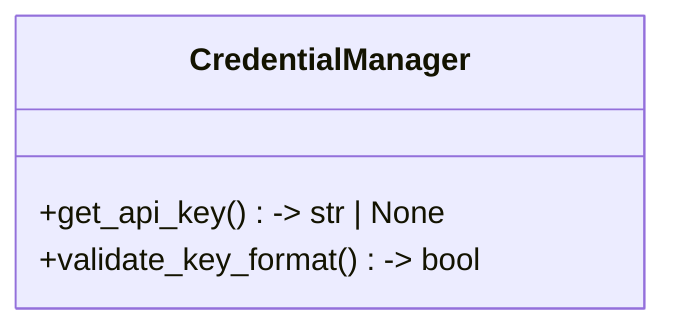
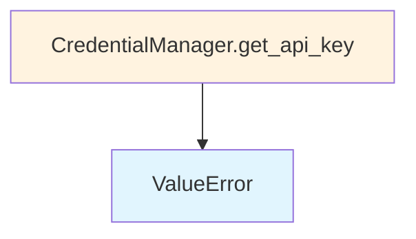

# File: `src/local_deepwiki/providers/credentials.py`

## File Overview

This module provides secure credential handling for API providers within the `local_deepwiki` project. It is designed to manage API keys without storing them in memory, thereby reducing the risk of exposure through memory dumps or debugging tools.

The `CredentialManager` class encapsulates methods for retrieving and validating API keys from environment variables, enforcing basic format checks to ensure that keys are not only present but also reasonably valid.

## Key Concepts

The core abstraction in this file is the `CredentialManager`, which follows a **secure credential retrieval pattern**. The design avoids storing sensitive information in instance attributes or memory, aligning with security best practices for handling API keys.

The module also implements **provider-specific validation logic**:
- Anthropic keys must start with `sk-ant-` and be longer than 20 characters.
- OpenAI keys must start with `sk-` and also be longer than 20 characters.
- Generic providers have a minimum key length of 8 characters.

This approach allows the system to support multiple providers while maintaining a consistent and secure interface for key validation.

## Integration

This file is imported by the `src/local_deepwiki/core/graph_rag/models.py` and `src/local_deepwiki/handlers/web_server.py` modules, indicating that it is used to securely fetch and validate API keys for embedding and other provider-based services.

It is also closely related to `tests/test_access_control.py` and `tests/test_tour_handler.py`, which likely test credential handling in the context of access control and user flows.

The `CredentialManager` class is likely used in conjunction with the `Provider` class (from `EmbeddingProvider(ABC)`) to fetch and validate credentials before initializing provider-specific services.

## Design Notes

- **No In-Memory Storage**: The design avoids storing API keys as instance attributes. This prevents accidental exposure during debugging or in memory dumps.
- **Environment-Based Retrieval**: Keys are retrieved directly from `os.environ`, relying on the deployment environment to provide them securely.
- **Basic Format Validation**: The module performs only basic checks on key format. It does not validate key authenticity or permissions — that responsibility lies with the underlying provider APIs.
- **Provider-Specific Logic**: The `validate_key_format` method applies different validation rules depending on the provider, supporting both known providers (Anthropic, OpenAI) and generic ones.
- **Static Methods**: All methods in `CredentialManager` are static, reflecting that no instance state is required, and the class is used purely as a namespace for credential handling logic.

This design is a pragmatic balance between usability and security, ensuring that API keys are handled with care without overcomplicating the interface.

## API Reference

### class `CredentialManager`

Manages credentials securely without storing in memory.  API keys are retrieved from environment variables at initialization and validated, but never stored as instance attributes. This prevents accidental exposure through process memory dumps or debugging tools.

**Methods:**


<details>
<summary>View Source (lines 12-80) | <a href="https://github.com/UrbanDiver/local-deepwiki-mcp/blob/main/src/local_deepwiki/providers/credentials.py#L12-L80">GitHub</a></summary>

```python
class CredentialManager:
    """Manages credentials securely without storing in memory.

    API keys are retrieved from environment variables at initialization
    and validated, but never stored as instance attributes. This prevents
    accidental exposure through process memory dumps or debugging tools.
    """

    @staticmethod
    def get_api_key(env_var: str, provider: str) -> str | None:
        """Get API key from environment without storing.

        Args:
            env_var: Environment variable name to check
            provider: Provider name for logging and validation

        Returns:
            API key string or None if not set

        Raises:
            ValueError: If key format appears invalid
        """
        key = os.environ.get(env_var)
        if not key:
            return None

        # Validate key format (basic check)
        if len(key) < 8:
            raise ValueError(f"{provider} API key appears invalid (too short)")

        # Don't store in memory, validate and return
        return key

    # Minimum key length for generic providers
    _MIN_GENERIC_KEY_LENGTH = 8
    # Minimum key length for known providers (Anthropic, OpenAI)
    _MIN_KNOWN_KEY_LENGTH = 20

    @staticmethod
    def validate_key_format(key: str, provider: str) -> bool:
        """Validate API key format without storing.

        Performs strict provider-specific format validation. Anthropic keys
        must start with ``sk-ant-`` and OpenAI keys with ``sk-``, both with
        a minimum length of 20 characters. Generic providers require at
        least 8 characters.

        Args:
            key: API key to validate
            provider: Provider name to determine validation rules

        Returns:
            True if key format appears valid, False otherwise
        """
        if not key or len(key) < 4:
            return False

        if provider == "anthropic":
            return (
                key.startswith("sk-ant-")
                and len(key) > CredentialManager._MIN_KNOWN_KEY_LENGTH
            )
        elif provider == "openai":
            return (
                key.startswith("sk-")
                and len(key) > CredentialManager._MIN_KNOWN_KEY_LENGTH
            )
        else:
            return len(key) >= CredentialManager._MIN_GENERIC_KEY_LENGTH
```

</details>

#### `get_api_key`

```python
def get_api_key(env_var: str, provider: str) -> str | None
```

Get API key from environment without storing.


| Parameter | Type | Default | Description |
|-----------|------|---------|-------------|
| `env_var` | `str` | - | Environment variable name to check |
| `provider` | `str` | - | Provider name for logging and validation |


<details>
<summary>View Source (lines 12-80) | <a href="https://github.com/UrbanDiver/local-deepwiki-mcp/blob/main/src/local_deepwiki/providers/credentials.py#L12-L80">GitHub</a></summary>

```python
class CredentialManager:
    """Manages credentials securely without storing in memory.

    API keys are retrieved from environment variables at initialization
    and validated, but never stored as instance attributes. This prevents
    accidental exposure through process memory dumps or debugging tools.
    """

    @staticmethod
    def get_api_key(env_var: str, provider: str) -> str | None:
        """Get API key from environment without storing.

        Args:
            env_var: Environment variable name to check
            provider: Provider name for logging and validation

        Returns:
            API key string or None if not set

        Raises:
            ValueError: If key format appears invalid
        """
        key = os.environ.get(env_var)
        if not key:
            return None

        # Validate key format (basic check)
        if len(key) < 8:
            raise ValueError(f"{provider} API key appears invalid (too short)")

        # Don't store in memory, validate and return
        return key

    # Minimum key length for generic providers
    _MIN_GENERIC_KEY_LENGTH = 8
    # Minimum key length for known providers (Anthropic, OpenAI)
    _MIN_KNOWN_KEY_LENGTH = 20

    @staticmethod
    def validate_key_format(key: str, provider: str) -> bool:
        """Validate API key format without storing.

        Performs strict provider-specific format validation. Anthropic keys
        must start with ``sk-ant-`` and OpenAI keys with ``sk-``, both with
        a minimum length of 20 characters. Generic providers require at
        least 8 characters.

        Args:
            key: API key to validate
            provider: Provider name to determine validation rules

        Returns:
            True if key format appears valid, False otherwise
        """
        if not key or len(key) < 4:
            return False

        if provider == "anthropic":
            return (
                key.startswith("sk-ant-")
                and len(key) > CredentialManager._MIN_KNOWN_KEY_LENGTH
            )
        elif provider == "openai":
            return (
                key.startswith("sk-")
                and len(key) > CredentialManager._MIN_KNOWN_KEY_LENGTH
            )
        else:
            return len(key) >= CredentialManager._MIN_GENERIC_KEY_LENGTH
```

</details>

#### `validate_key_format`

```python
def validate_key_format(key: str, provider: str) -> bool
```

Validate API key format without storing.  Performs strict provider-specific format validation. Anthropic keys must start with ``sk-ant-`` and OpenAI keys with ``sk-``, both with a minimum length of 20 characters. Generic providers require at least 8 characters.


| Parameter | Type | Default | Description |
|-----------|------|---------|-------------|
| `key` | `str` | - | API key to validate |
| `provider` | `str` | - | Provider name to determine validation rules |


<details>
<summary>View Source (lines 12-80) | <a href="https://github.com/UrbanDiver/local-deepwiki-mcp/blob/main/src/local_deepwiki/providers/credentials.py#L12-L80">GitHub</a></summary>

```python
class CredentialManager:
    """Manages credentials securely without storing in memory.

    API keys are retrieved from environment variables at initialization
    and validated, but never stored as instance attributes. This prevents
    accidental exposure through process memory dumps or debugging tools.
    """

    @staticmethod
    def get_api_key(env_var: str, provider: str) -> str | None:
        """Get API key from environment without storing.

        Args:
            env_var: Environment variable name to check
            provider: Provider name for logging and validation

        Returns:
            API key string or None if not set

        Raises:
            ValueError: If key format appears invalid
        """
        key = os.environ.get(env_var)
        if not key:
            return None

        # Validate key format (basic check)
        if len(key) < 8:
            raise ValueError(f"{provider} API key appears invalid (too short)")

        # Don't store in memory, validate and return
        return key

    # Minimum key length for generic providers
    _MIN_GENERIC_KEY_LENGTH = 8
    # Minimum key length for known providers (Anthropic, OpenAI)
    _MIN_KNOWN_KEY_LENGTH = 20

    @staticmethod
    def validate_key_format(key: str, provider: str) -> bool:
        """Validate API key format without storing.

        Performs strict provider-specific format validation. Anthropic keys
        must start with ``sk-ant-`` and OpenAI keys with ``sk-``, both with
        a minimum length of 20 characters. Generic providers require at
        least 8 characters.

        Args:
            key: API key to validate
            provider: Provider name to determine validation rules

        Returns:
            True if key format appears valid, False otherwise
        """
        if not key or len(key) < 4:
            return False

        if provider == "anthropic":
            return (
                key.startswith("sk-ant-")
                and len(key) > CredentialManager._MIN_KNOWN_KEY_LENGTH
            )
        elif provider == "openai":
            return (
                key.startswith("sk-")
                and len(key) > CredentialManager._MIN_KNOWN_KEY_LENGTH
            )
        else:
            return len(key) >= CredentialManager._MIN_GENERIC_KEY_LENGTH
```

</details>

## Class Diagram



## Call Graph



## Used By

Functions and methods in this file and their callers:

- **`ValueError`**: called by `CredentialManager.get_api_key`

## Usage Examples

*Examples extracted from test files*

### Test that get_api_key returns the key from environment variable

From `test_credentials.py::TestGetApiKey::test_get_api_key_returns_key_from_environment`:

```python
with patch.dict(os.environ, {"TEST_API_KEY": "valid-api-key-12345"}):
    result = CredentialManager.get_api_key("TEST_API_KEY", "test-provider")
    assert result == "valid-api-key-12345"
```

### Test that get_api_key returns None when env var is not set

From `test_credentials.py::TestGetApiKey::test_get_api_key_returns_none_when_not_set`:

```python
env_copy = os.environ.copy()
env_copy.pop("NONEXISTENT_API_KEY", None)
with patch.dict(os.environ, env_copy, clear=True):
    result = CredentialManager.get_api_key(
        "NONEXISTENT_API_KEY", "test-provider"
    )
    assert result is None
```


## Last Modified

| Entity | Type | Author | Date | Commit |
|--------|------|--------|------|--------|
| `CredentialManager` | class | Brian Breidenbach | 1 week ago | `456a5ca` fix: harden web security — ... |

## Relevant Source Files

- `src/local_deepwiki/providers/credentials.py:12-80`
