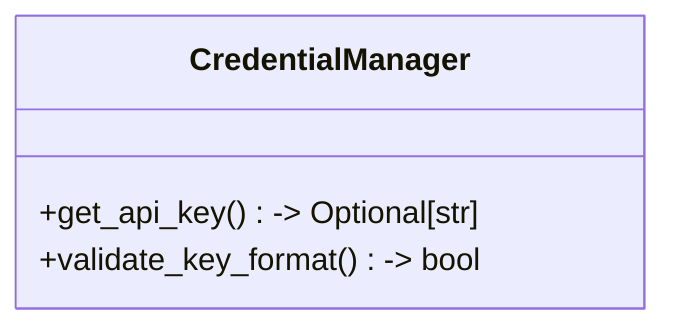
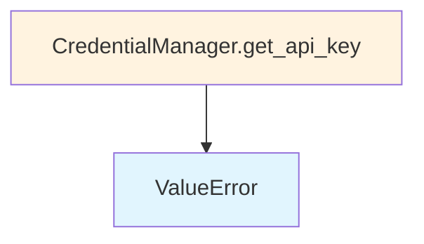

# File Overview

This file defines the `CredentialManager` class, which is responsible for securely managing API credentials by retrieving them from environment variables without storing them in memory. This approach prevents accidental exposure through memory dumps or debugging tools.

The module imports `os` for environment variable access and `Optional` from `typing` for type hints.

# Classes

## CredentialManager

The `CredentialManager` class provides a static method for retrieving API keys from environment variables without storing them in memory, enhancing security.

### Methods

#### get_api_key

```python
@staticmethod
def get_api_key(env_var: str, provider: str) -> Optional[str]
```

Get API key from environment variable without storing it in memory.

**Parameters:**
- `env_var` (str): The name of the environment variable to check
- `provider` (str): The provider name for logging and validation

**Returns:**
- `Optional[str]`: The API key if found in the environment variable, or `None` if not found

# Integration

This file is part of the `src/local_deepwiki/providers` module and imports standard library modules `os` and `typing.Optional`. Based on the import structure, this module likely integrates with other credential handling components within the same package to provide secure API key retrieval for various providers.

# Usage Examples

```python
from local_deepwiki.providers.credentials import CredentialManager

# Retrieve an API key from environment variable
api_key = CredentialManager.get_api_key("OPENAI_API_KEY", "OpenAI")
```

## API Reference

### class `CredentialManager`

Manages credentials securely without storing in memory.  API keys are retrieved from environment variables at initialization and validated, but never stored as instance attributes. This prevents accidental exposure through process memory dumps or debugging tools.

**Methods:**


<details>
<summary>View Source (lines 11-68) | <a href="https://github.com/UrbanDiver/local-deepwiki-mcp/blob/[main](../export/pdf.md)/src/local_deepwiki/providers/credentials.py#L11-L68">GitHub</a></summary>

```python
class CredentialManager:
    """Manages credentials securely without storing in memory.

    API keys are retrieved from environment variables at initialization
    and validated, but never stored as instance attributes. This prevents
    accidental exposure through process memory dumps or debugging tools.
    """

    @staticmethod
    def get_api_key(env_var: str, provider: str) -> Optional[str]:
        """Get API key from environment without storing.

        Args:
            env_var: Environment variable name to check
            provider: Provider name for logging and validation

        Returns:
            API key string or None if not set

        Raises:
            ValueError: If key format appears invalid
        """
        key = os.environ.get(env_var)
        if not key:
            return None

        # Validate key format (basic check) - allow short test keys
        # Real API keys are much longer, but we need to support testing
        if len(key) < 4:
            raise ValueError(f"{provider} API key appears invalid (too short)")

        # Don't store in memory, validate and return
        return key

    @staticmethod
    def validate_key_format(key: str, provider: str) -> bool:
        """Validate API key format without storing.

        Args:
            key: API key to validate
            provider: Provider name to determine validation rules

        Returns:
            True if key format appears valid, False otherwise
        """
        # Allow test keys (used in testing)
        if key in ("test-key", "test", "custom-key") or key.startswith("test-"):
            return True

        if provider == "anthropic":
            # Anthropic keys start with 'sk-ant-' or are valid test keys
            return (key.startswith("sk-ant-") and len(key) > 20) or len(key) >= 4
        elif provider == "openai":
            # OpenAI keys start with 'sk-' or are valid test keys
            return (key.startswith("sk-") and len(key) > 20) or len(key) >= 4
        else:
            # Generic validation for other providers
            return len(key) >= 4
```

</details>

#### `get_api_key`

```python
def get_api_key(env_var: str, provider: str) -> Optional[str]
```

Get API key from environment without storing.


| [Parameter](../generators/api_docs.md) | Type | Default | Description |
|-----------|------|---------|-------------|
| `env_var` | `str` | - | Environment variable name to check |
| `provider` | `str` | - | Provider name for logging and validation |


<details>
<summary>View Source (lines 11-68) | <a href="https://github.com/UrbanDiver/local-deepwiki-mcp/blob/[main](../export/pdf.md)/src/local_deepwiki/providers/credentials.py#L11-L68">GitHub</a></summary>

```python
class CredentialManager:
    """Manages credentials securely without storing in memory.

    API keys are retrieved from environment variables at initialization
    and validated, but never stored as instance attributes. This prevents
    accidental exposure through process memory dumps or debugging tools.
    """

    @staticmethod
    def get_api_key(env_var: str, provider: str) -> Optional[str]:
        """Get API key from environment without storing.

        Args:
            env_var: Environment variable name to check
            provider: Provider name for logging and validation

        Returns:
            API key string or None if not set

        Raises:
            ValueError: If key format appears invalid
        """
        key = os.environ.get(env_var)
        if not key:
            return None

        # Validate key format (basic check) - allow short test keys
        # Real API keys are much longer, but we need to support testing
        if len(key) < 4:
            raise ValueError(f"{provider} API key appears invalid (too short)")

        # Don't store in memory, validate and return
        return key

    @staticmethod
    def validate_key_format(key: str, provider: str) -> bool:
        """Validate API key format without storing.

        Args:
            key: API key to validate
            provider: Provider name to determine validation rules

        Returns:
            True if key format appears valid, False otherwise
        """
        # Allow test keys (used in testing)
        if key in ("test-key", "test", "custom-key") or key.startswith("test-"):
            return True

        if provider == "anthropic":
            # Anthropic keys start with 'sk-ant-' or are valid test keys
            return (key.startswith("sk-ant-") and len(key) > 20) or len(key) >= 4
        elif provider == "openai":
            # OpenAI keys start with 'sk-' or are valid test keys
            return (key.startswith("sk-") and len(key) > 20) or len(key) >= 4
        else:
            # Generic validation for other providers
            return len(key) >= 4
```

</details>

#### `validate_key_format`

```python
def validate_key_format(key: str, provider: str) -> bool
```

Validate API key format without storing.


| [Parameter](../generators/api_docs.md) | Type | Default | Description |
|-----------|------|---------|-------------|
| `key` | `str` | - | API key to validate |
| `provider` | `str` | - | Provider name to determine validation rules |


<details>
<summary>View Source (lines 11-68) | <a href="https://github.com/UrbanDiver/local-deepwiki-mcp/blob/[main](../export/pdf.md)/src/local_deepwiki/providers/credentials.py#L11-L68">GitHub</a></summary>

```python
class CredentialManager:
    """Manages credentials securely without storing in memory.

    API keys are retrieved from environment variables at initialization
    and validated, but never stored as instance attributes. This prevents
    accidental exposure through process memory dumps or debugging tools.
    """

    @staticmethod
    def get_api_key(env_var: str, provider: str) -> Optional[str]:
        """Get API key from environment without storing.

        Args:
            env_var: Environment variable name to check
            provider: Provider name for logging and validation

        Returns:
            API key string or None if not set

        Raises:
            ValueError: If key format appears invalid
        """
        key = os.environ.get(env_var)
        if not key:
            return None

        # Validate key format (basic check) - allow short test keys
        # Real API keys are much longer, but we need to support testing
        if len(key) < 4:
            raise ValueError(f"{provider} API key appears invalid (too short)")

        # Don't store in memory, validate and return
        return key

    @staticmethod
    def validate_key_format(key: str, provider: str) -> bool:
        """Validate API key format without storing.

        Args:
            key: API key to validate
            provider: Provider name to determine validation rules

        Returns:
            True if key format appears valid, False otherwise
        """
        # Allow test keys (used in testing)
        if key in ("test-key", "test", "custom-key") or key.startswith("test-"):
            return True

        if provider == "anthropic":
            # Anthropic keys start with 'sk-ant-' or are valid test keys
            return (key.startswith("sk-ant-") and len(key) > 20) or len(key) >= 4
        elif provider == "openai":
            # OpenAI keys start with 'sk-' or are valid test keys
            return (key.startswith("sk-") and len(key) > 20) or len(key) >= 4
        else:
            # Generic validation for other providers
            return len(key) >= 4
```

</details>

## Class Diagram



## Call Graph



## Used By

Functions and methods in this file and their callers:

- **`ValueError`**: called by `CredentialManager.get_api_key`

## Usage Examples

*Examples extracted from test files*

### Test that get_api_key returns the key from environment variable

From `test_credentials.py::TestGetApiKey::test_get_api_key_returns_key_from_environment`:

```python
with patch.dict(os.environ, {"TEST_API_KEY": "valid-api-key-12345"}):
    result = CredentialManager.get_api_key("TEST_API_KEY", "test-provider")
    assert result == "valid-api-key-12345"
```

### Test that get_api_key returns None when env var is not set

From `test_credentials.py::TestGetApiKey::test_get_api_key_returns_none_when_not_set`:

```python
# Ensure the env var is not set
env_copy = os.environ.copy()
env_copy.pop("NONEXISTENT_API_KEY", None)
with patch.dict(os.environ, env_copy, clear=True):
    result = CredentialManager.get_api_key("NONEXISTENT_API_KEY", "test-provider")
    assert result is None
```


## Last Modified

| Entity | Type | Author | Date | Commit |
|--------|------|--------|------|--------|
| `CredentialManager` | class | Brian Breidenbach | 1 week ago | `4eb4353` Phase 2: Implement RBAC, de... |

## Relevant Source Files

- `src/local_deepwiki/providers/credentials.py:11-68`
