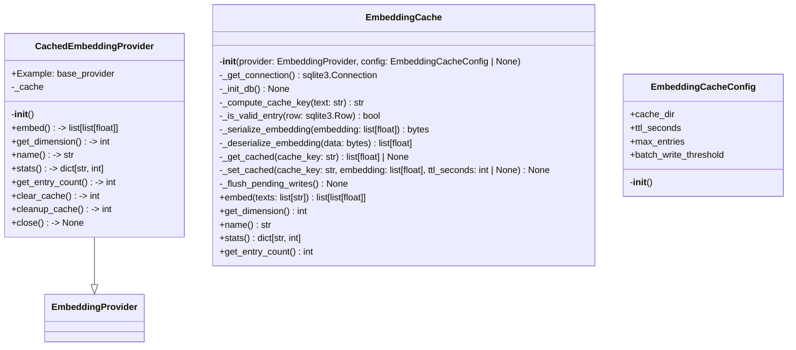

# File Overview

This file defines the `EmbeddingCache` class, which provides a caching mechanism for embedding vectors generated by an [`EmbeddingProvider`](../base.md). It uses SQLite for persistent storage and supports time-to-live (TTL) for cache entries. The cache is thread-safe and includes methods for managing the cache lifecycle, such as clearing, cleaning up expired entries, and invalidating entries by model.

Dependencies:
- `hashlib`: For computing cache keys.
- `json`: For serializing and deserializing embedding vectors.
- `sqlite3`: For database operations.
- `threading`: For thread-local connections and locking.
- `time`: For tracking entry age and TTL.
- `pathlib.Path`: For handling file paths.
- `typing.cast`: For type casting.
- [`local_deepwiki.logging.get_logger`](../../logging.md): For logging.
- [`local_deepwiki.providers.base.EmbeddingProvider`](../base.md): Base interface for embedding providers.

# Classes

## EmbeddingCacheConfig

Configuration class for the embedding cache.

### Attributes

- `cache_dir`: Directory for cache database. Defaults to `~/.cache/local-deepwiki`.
- `ttl_seconds`: Time-to-live for cache entries in seconds (default: 7 days).
- `max_entries`: Maximum number of cache entries before cleanup (default: 100,000).
- `batch_write_threshold`: Number of pending writes before flushing to the database (default: 100).

### Methods

- `__init__(cache_dir: Path | None = None, ttl_seconds: int = 604800, max_entries: int = 100000, batch_write_threshold: int = 100)`: Initializes the configuration with the specified parameters.

## EmbeddingCache

Main class that wraps an [`EmbeddingProvider`](../base.md) and provides caching functionality.

### Attributes

- `_provider`: The underlying [`EmbeddingProvider`](../base.md).
- `_config`: Instance of `EmbeddingCacheConfig`.
- `_db_path`: Path to the SQLite database file.
- `_lock`: Thread lock for database operations.
- `_local`: Thread-local storage for database connections.
- `_stats`: Dictionary to store cache statistics.
- `_pending_writes`: List of pending writes to flush.

### Methods

- `__init__(provider: EmbeddingProvider, config: EmbeddingCacheConfig | None = None)`: Initializes the cache with an embedding provider and optional configuration.
- `_get_connection() -> sqlite3.Connection`: Returns a thread-local SQLite connection.
- `_init_db() -> None`: Initializes the database schema.
- `_compute_cache_key(text: str) -> str`: Computes a SHA-256 hash for the given text and model.
- `_is_valid_entry(row: sqlite3.Row) -> bool`: Checks if a cache entry is valid based on TTL.
- `_serialize_embedding(embedding: list[float]) -> bytes`: Serializes an embedding vector to bytes using JSON.
- `_deserialize_embedding(data: bytes) -> list[float]`: Deserializes embedding bytes back to a list of floats.
- `_get_cached(cache_key: str) -> list[float] | None`: Retrieves a cached embedding if it exists and is valid.
- `_set_cached(cache_key: str, embedding: list[float], ttl_seconds: int | None = None) -> None`: Stores an embedding in the cache.
- `_flush_pending_writes() -> None`: Flushes pending writes to the database.
- `embed(texts: list[str]) -> list[list[float]]`: Generates embeddings for a list of texts, using cache when available.
- `get_dimension() -> int`: Returns the dimension of embeddings from the provider.
- `name() -> str`: Returns the name of the underlying provider.
- `stats() -> dict`: Returns cache statistics.
- `get_entry_count() -> int`: Returns the number of entries in the cache.
- `clear() -> None`: Clears all entries from the cache.
- `cleanup_expired() -> None`: Removes expired entries from the cache.
- `cleanup_if_needed() -> None`: Cleans up expired entries if the cache is full.
- `invalidate_by_model() -> None`: Invalidates all entries for the current model.
- `close() -> None`: Closes the database connection.
- `__del__() -> None`: Destructor to close the database connection.

## CachedEmbeddingProvider

Wrapper class for `EmbeddingCache` that implements [`EmbeddingProvider`](../base.md).

# Functions

No standalone functions are defined in this file.

# Integration

This file is used by the `EmbeddingCache` class, which is referenced in the project's configuration system. It integrates with:

- [`local_deepwiki.providers.base.EmbeddingProvider`](../base.md): The base interface for embedding providers.
- [`local_deepwiki.logging.get_logger`](../../logging.md): For logging cache operations.
- Other components in `src/local_deepwiki/core/`, `src/local_deepwiki/generators/source_refs.py`, and `src/local_deepwiki/plugins/base.py` that may use or depend on embedding caching.

# Usage Examples

To create and use an `EmbeddingCache`:

```python
from local_deepwiki.providers.base import EmbeddingProvider
from local_deepwiki.providers.embeddings.cache import EmbeddingCache, EmbeddingCacheConfig

# Assuming `provider` is an instance of EmbeddingProvider
config = EmbeddingCacheConfig(cache_dir=Path("/tmp/cache"), ttl_seconds=3600)
cache = EmbeddingCache(provider, config)

# Generate embeddings
texts = ["Hello world", "Foo bar"]
embeddings = await cache.embed(texts)
```

To get cache statistics:

```python
stats = cache.stats()
print(stats)
```

To clear the cache:

```python
cache.clear()
```

To close the cache:

```python
cache.close()
```

## API Reference

### class `EmbeddingCacheConfig`

Configuration for the embedding cache.

**Methods:**


<details>
<summary>View Source (lines 22-43) | <a href="https://github.com/UrbanDiver/local-deepwiki-mcp/blob/[main](../../export/pdf.md)/src/local_deepwiki/providers/embeddings/cache.py#L22-L43">GitHub</a></summary>

```python
class EmbeddingCacheConfig:
    """Configuration for the embedding cache."""

    def __init__(
        self,
        cache_dir: Path | None = None,
        ttl_seconds: int = 604800,  # 7 days default
        max_entries: int = 100000,
        batch_write_threshold: int = 100,
    ):
        """Initialize cache configuration.

        Args:
            cache_dir: Directory for cache database. Defaults to ~/.cache/local-deepwiki.
            ttl_seconds: Time-to-live for cache entries in seconds (default: 7 days).
            max_entries: Maximum number of cache entries before cleanup (default: 100k).
            batch_write_threshold: Number of entries to batch before committing.
        """
        self.cache_dir = cache_dir or (Path.home() / ".cache" / "local-deepwiki")
        self.ttl_seconds = ttl_seconds
        self.max_entries = max_entries
        self.batch_write_threshold = batch_write_threshold
```

</details>

#### `__init__`

```python
def __init__(cache_dir: Path | None = None, ttl_seconds: int = 604800, max_entries: int = 100000, batch_write_threshold: int = 100)
```

Initialize cache configuration.


| [Parameter](../../generators/api_docs.md) | Type | Default | Description |
|-----------|------|---------|-------------|
| `cache_dir` | `Path | None` | `None` | Directory for cache database. Defaults to ~/.cache/local-deepwiki. |
| `ttl_seconds` | `int` | `604800` | Time-to-live for cache entries in seconds (default: 7 days). |
| `max_entries` | `int` | `100000` | Maximum number of cache entries before cleanup (default: 100k). |
| `batch_write_threshold` | `int` | `100` | Number of entries to batch before committing. |


<details>
<summary>View Source (lines 22-43) | <a href="https://github.com/UrbanDiver/local-deepwiki-mcp/blob/[main](../../export/pdf.md)/src/local_deepwiki/providers/embeddings/cache.py#L22-L43">GitHub</a></summary>

```python
class EmbeddingCacheConfig:
    """Configuration for the embedding cache."""

    def __init__(
        self,
        cache_dir: Path | None = None,
        ttl_seconds: int = 604800,  # 7 days default
        max_entries: int = 100000,
        batch_write_threshold: int = 100,
    ):
        """Initialize cache configuration.

        Args:
            cache_dir: Directory for cache database. Defaults to ~/.cache/local-deepwiki.
            ttl_seconds: Time-to-live for cache entries in seconds (default: 7 days).
            max_entries: Maximum number of cache entries before cleanup (default: 100k).
            batch_write_threshold: Number of entries to batch before committing.
        """
        self.cache_dir = cache_dir or (Path.home() / ".cache" / "local-deepwiki")
        self.ttl_seconds = ttl_seconds
        self.max_entries = max_entries
        self.batch_write_threshold = batch_write_threshold
```

</details>

### class `EmbeddingCache`

SQLite-based embedding cache with content hashing and TTL support.  This class wraps an [EmbeddingProvider](../base.md) and caches embeddings to disk. Cache keys are computed from the text content and model name, so the same text will return cached embeddings even across different runs.  Thread-safe for concurrent access.

**Methods:**


<details>
<summary>View Source (lines 46-540) | <a href="https://github.com/UrbanDiver/local-deepwiki-mcp/blob/[main](../../export/pdf.md)/src/local_deepwiki/providers/embeddings/cache.py#L46-L540">GitHub</a></summary>

```python
class EmbeddingCache:
    # Methods: __init__, _get_connection, _init_db, _compute_cache_key, _is_valid_entry, _serialize_embedding, _deserialize_embedding, _get_cached, _set_cached, _flush_pending_writes, embed, get_dimension, name, stats, get_entry_count, clear, cleanup_expired, cleanup_if_needed, invalidate_by_model, close, __del__
```

</details>

#### `__init__`

```python
def __init__(provider: EmbeddingProvider, config: EmbeddingCacheConfig | None = None)
```

Initialize the embedding cache.


| [Parameter](../../generators/api_docs.md) | Type | Default | Description |
|-----------|------|---------|-------------|
| `provider` | [`EmbeddingProvider`](../base.md) | - | The underlying embedding provider to wrap. |
| `config` | `EmbeddingCacheConfig | None` | `None` | Optional cache configuration. Uses defaults if not provided. |


<details>
<summary>View Source (lines 69-92) | <a href="https://github.com/UrbanDiver/local-deepwiki-mcp/blob/[main](../../export/pdf.md)/src/local_deepwiki/providers/embeddings/cache.py#L69-L92">GitHub</a></summary>

```python
def __init__(
        self,
        provider: EmbeddingProvider,
        config: EmbeddingCacheConfig | None = None,
    ):
        """Initialize the embedding cache.

        Args:
            provider: The underlying embedding provider to wrap.
            config: Optional cache configuration. Uses defaults if not provided.
        """
        self._provider = provider
        self._config = config or EmbeddingCacheConfig()
        self._db_path = self._config.cache_dir / self.DB_FILENAME
        self._lock = threading.Lock()
        self._local = threading.local()
        self._stats = {"hits": 0, "misses": 0, "errors": 0}
        self._pending_writes: list[tuple[str, list[float], float, int]] = []

        # Ensure cache directory exists
        self._config.cache_dir.mkdir(parents=True, exist_ok=True)

        # Initialize database schema
        self._init_db()
```

</details>

#### `embed`

```python
async def embed(texts: list[str]) -> list[list[float]]
```

Generate embeddings for a list of texts, using cache when available.  This method checks the cache for each text and only calls the underlying provider for texts that are not cached. Results are then stored in the cache for future use.


| [Parameter](../../generators/api_docs.md) | Type | Default | Description |
|-----------|------|---------|-------------|
| `texts` | `list[str]` | - | List of text strings to embed. |


<details>
<summary>View Source (lines 308-360) | <a href="https://github.com/UrbanDiver/local-deepwiki-mcp/blob/[main](../../export/pdf.md)/src/local_deepwiki/providers/embeddings/cache.py#L308-L360">GitHub</a></summary>

```python
async def embed(self, texts: list[str]) -> list[list[float]]:
        """Generate embeddings for a list of texts, using cache when available.

        This method checks the cache for each text and only calls the underlying
        provider for texts that are not cached. Results are then stored in the
        cache for future use.

        Args:
            texts: List of text strings to embed.

        Returns:
            List of embedding vectors, one per input text.
        """
        if not texts:
            return []

        # Check cache for each text
        cache_keys = [self._compute_cache_key(text) for text in texts]
        results: list[list[float] | None] = [None] * len(texts)
        texts_to_embed: list[tuple[int, str]] = []

        for i, (text, cache_key) in enumerate(zip(texts, cache_keys)):
            cached = self._get_cached(cache_key)
            if cached is not None:
                results[i] = cached
                self._stats["hits"] += 1
            else:
                texts_to_embed.append((i, text))
                self._stats["misses"] += 1

        # Log cache performance
        if texts_to_embed:
            logger.debug(
                f"Embedding cache: {len(texts) - len(texts_to_embed)}/{len(texts)} hits, "
                f"fetching {len(texts_to_embed)} from provider"
            )

        # Fetch uncached embeddings from provider
        if texts_to_embed:
            indices, uncached_texts = zip(*texts_to_embed)
            new_embeddings = await self._provider.embed(list(uncached_texts))

            # Store results and cache them
            for idx, embedding in zip(indices, new_embeddings):
                results[idx] = embedding
                cache_key = cache_keys[idx]
                self._set_cached(cache_key, embedding)

        # Ensure all pending writes are flushed
        self._flush_pending_writes()

        # All results should be filled now
        return cast(list[list[float]], results)
```

</details>

#### `get_dimension`

```python
def get_dimension() -> int
```

Get the embedding dimension.


<details>
<summary>View Source (lines 362-368) | <a href="https://github.com/UrbanDiver/local-deepwiki-mcp/blob/[main](../../export/pdf.md)/src/local_deepwiki/providers/embeddings/cache.py#L362-L368">GitHub</a></summary>

```python
def get_dimension(self) -> int:
        """Get the embedding dimension.

        Returns:
            The dimension of the embedding vectors.
        """
        return self._provider.get_dimension()
```

</details>

#### `name`

```python
def name() -> str
```

Get the provider name (includes cache indicator).


<details>
<summary>View Source (lines 371-373) | <a href="https://github.com/UrbanDiver/local-deepwiki-mcp/blob/[main](../../export/pdf.md)/src/local_deepwiki/providers/embeddings/cache.py#L371-L373">GitHub</a></summary>

```python
def name(self) -> str:
        """Get the provider name (includes cache indicator)."""
        return f"cached:{self._provider.name}"
```

</details>

#### `stats`

```python
def stats() -> dict[str, int]
```

Get cache statistics.


<details>
<summary>View Source (lines 376-382) | <a href="https://github.com/UrbanDiver/local-deepwiki-mcp/blob/[main](../../export/pdf.md)/src/local_deepwiki/providers/embeddings/cache.py#L376-L382">GitHub</a></summary>

```python
def stats(self) -> dict[str, int]:
        """Get cache statistics.

        Returns:
            Dictionary with hits, misses, and errors counts.
        """
        return self._stats.copy()
```

</details>

#### `get_entry_count`

```python
def get_entry_count() -> int
```

Get the number of entries in the cache.


<details>
<summary>View Source (lines 384-396) | <a href="https://github.com/UrbanDiver/local-deepwiki-mcp/blob/[main](../../export/pdf.md)/src/local_deepwiki/providers/embeddings/cache.py#L384-L396">GitHub</a></summary>

```python
def get_entry_count(self) -> int:
        """Get the number of entries in the cache.

        Returns:
            Number of cache entries.
        """
        try:
            conn = self._get_connection()
            cursor = conn.execute("SELECT COUNT(*) FROM embeddings")
            row = cursor.fetchone()
            return row[0] if row else 0
        except sqlite3.Error:
            return 0
```

</details>

#### `clear`

```python
def clear() -> int
```

Clear all cache entries.


<details>
<summary>View Source (lines 398-416) | <a href="https://github.com/UrbanDiver/local-deepwiki-mcp/blob/[main](../../export/pdf.md)/src/local_deepwiki/providers/embeddings/cache.py#L398-L416">GitHub</a></summary>

```python
def clear(self) -> int:
        """Clear all cache entries.

        Returns:
            Number of entries cleared.
        """
        try:
            conn = self._get_connection()
            cursor = conn.execute("SELECT COUNT(*) FROM embeddings")
            count = cursor.fetchone()[0]

            conn.execute("DELETE FROM embeddings")
            conn.commit()

            logger.info(f"Cleared {count} embedding cache entries")
            return count
        except sqlite3.Error as e:
            logger.warning(f"Failed to clear embedding cache: {e}")
            return 0
```

</details>

#### `cleanup_expired`

```python
def cleanup_expired() -> int
```

Remove expired cache entries.


<details>
<summary>View Source (lines 418-441) | <a href="https://github.com/UrbanDiver/local-deepwiki-mcp/blob/[main](../../export/pdf.md)/src/local_deepwiki/providers/embeddings/cache.py#L418-L441">GitHub</a></summary>

```python
def cleanup_expired(self) -> int:
        """Remove expired cache entries.

        Returns:
            Number of entries removed.
        """
        try:
            conn = self._get_connection()
            now = time.time()

            # Delete entries where created_at + ttl_seconds < now
            cursor = conn.execute(
                "DELETE FROM embeddings WHERE (created_at + ttl_seconds) < ?",
                (now,),
            )
            deleted = cursor.rowcount
            conn.commit()

            if deleted > 0:
                logger.info(f"Cleaned up {deleted} expired embedding cache entries")
            return deleted
        except sqlite3.Error as e:
            logger.warning(f"Failed to cleanup expired entries: {e}")
            return 0
```

</details>

#### `cleanup_if_needed`

```python
def cleanup_if_needed() -> int
```

Clean up cache if it exceeds max_entries.  Removes oldest entries (by creation time) when the cache exceeds the configured maximum size. Also removes expired entries.


<details>
<summary>View Source (lines 443-489) | <a href="https://github.com/UrbanDiver/local-deepwiki-mcp/blob/[main](../../export/pdf.md)/src/local_deepwiki/providers/embeddings/cache.py#L443-L489">GitHub</a></summary>

```python
def cleanup_if_needed(self) -> int:
        """Clean up cache if it exceeds max_entries.

        Removes oldest entries (by creation time) when the cache exceeds
        the configured maximum size. Also removes expired entries.

        Returns:
            Number of entries removed.
        """
        try:
            conn = self._get_connection()

            # First, remove expired entries
            expired_count = self.cleanup_expired()

            # Check current count
            cursor = conn.execute("SELECT COUNT(*) FROM embeddings")
            count = cursor.fetchone()[0]

            if count <= self._config.max_entries:
                return expired_count

            # Calculate how many to remove (remove 10% buffer)
            to_remove = count - int(self._config.max_entries * 0.9)

            # Delete oldest entries
            cursor = conn.execute(
                """
                DELETE FROM embeddings WHERE cache_key IN (
                    SELECT cache_key FROM embeddings
                    ORDER BY created_at ASC
                    LIMIT ?
                )
                """,
                (to_remove,),
            )
            deleted = cursor.rowcount
            conn.commit()

            logger.info(
                f"Cache cleanup: removed {expired_count} expired + {deleted} oldest entries"
            )
            return expired_count + deleted

        except sqlite3.Error as e:
            logger.warning(f"Cache cleanup failed: {e}")
            return 0
```

</details>

#### `invalidate_by_model`

```python
def invalidate_by_model(model_name: str) -> int
```

Invalidate all cache entries for a specific model.  Useful when switching models or when a model is updated.


| [Parameter](../../generators/api_docs.md) | Type | Default | Description |
|-----------|------|---------|-------------|
| `model_name` | `str` | - | The model name to invalidate entries for. |


<details>
<summary>View Source (lines 491-516) | <a href="https://github.com/UrbanDiver/local-deepwiki-mcp/blob/[main](../../export/pdf.md)/src/local_deepwiki/providers/embeddings/cache.py#L491-L516">GitHub</a></summary>

```python
def invalidate_by_model(self, model_name: str) -> int:
        """Invalidate all cache entries for a specific model.

        Useful when switching models or when a model is updated.

        Args:
            model_name: The model name to invalidate entries for.

        Returns:
            Number of entries invalidated.
        """
        try:
            conn = self._get_connection()
            cursor = conn.execute(
                "DELETE FROM embeddings WHERE model_name = ?",
                (model_name,),
            )
            deleted = cursor.rowcount
            conn.commit()

            if deleted > 0:
                logger.info(f"Invalidated {deleted} cache entries for model {model_name}")
            return deleted
        except sqlite3.Error as e:
            logger.warning(f"Failed to invalidate model cache: {e}")
            return 0
```

</details>

#### `close`

```python
def close() -> None
```

Close the database connection.  Should be called when the cache is no longer needed to ensure all pending writes are flushed and connections are closed cleanly.


<details>
<summary>View Source (lines 518-533) | <a href="https://github.com/UrbanDiver/local-deepwiki-mcp/blob/[main](../../export/pdf.md)/src/local_deepwiki/providers/embeddings/cache.py#L518-L533">GitHub</a></summary>

```python
def close(self) -> None:
        """Close the database connection.

        Should be called when the cache is no longer needed to ensure
        all pending writes are flushed and connections are closed cleanly.
        """
        # Flush any pending writes
        self._flush_pending_writes()

        # Close thread-local connection if it exists
        if hasattr(self._local, "conn") and self._local.conn is not None:
            try:
                self._local.conn.close()
            except sqlite3.Error:
                pass
            self._local.conn = None
```

</details>

### class `CachedEmbeddingProvider`

**Inherits from:** [`EmbeddingProvider`](../base.md)

Embedding provider [wrapper](../base.md) that adds caching.  This class implements the [EmbeddingProvider](../base.md) interface and wraps another provider with caching functionality. It can be used as a drop-in replacement for any [EmbeddingProvider](../base.md).

**Methods:**


<details>
<summary>View Source (lines 543-614) | <a href="https://github.com/UrbanDiver/local-deepwiki-mcp/blob/[main](../../export/pdf.md)/src/local_deepwiki/providers/embeddings/cache.py#L543-L614">GitHub</a></summary>

```python
class CachedEmbeddingProvider(EmbeddingProvider):
    """Embedding provider wrapper that adds caching.

    This class implements the EmbeddingProvider interface and wraps another
    provider with caching functionality. It can be used as a drop-in replacement
    for any EmbeddingProvider.

    Example:
        base_provider = OpenAIEmbeddingProvider()
        cached_provider = CachedEmbeddingProvider(base_provider)

        # Use cached_provider anywhere an EmbeddingProvider is expected
        vector_store = VectorStore(db_path, cached_provider)
    """

    def __init__(
        self,
        provider: EmbeddingProvider,
        config: EmbeddingCacheConfig | None = None,
    ):
        """Initialize the cached embedding provider.

        Args:
            provider: The underlying embedding provider to wrap.
            config: Optional cache configuration.
        """
        self._cache = EmbeddingCache(provider, config)

    async def embed(self, texts: list[str]) -> list[list[float]]:
        """Generate embeddings for a list of texts.

        Args:
            texts: List of text strings to embed.

        Returns:
            List of embedding vectors.
        """
        return await self._cache.embed(texts)

    def get_dimension(self) -> int:
        """Get the embedding dimension.

        Returns:
            The dimension of the embedding vectors.
        """
        return self._cache.get_dimension()

    @property
    def name(self) -> str:
        """Get the provider name."""
        return self._cache.name

    @property
    def stats(self) -> dict[str, int]:
        """Get cache statistics."""
        return self._cache.stats

    def get_entry_count(self) -> int:
        """Get the number of entries in the cache."""
        return self._cache.get_entry_count()

    def clear_cache(self) -> int:
        """Clear all cache entries."""
        return self._cache.clear()

    def cleanup_cache(self) -> int:
        """Clean up expired and excess cache entries."""
        return self._cache.cleanup_if_needed()

    def close(self) -> None:
        """Close the cache."""
        self._cache.close()
```

</details>

#### `__init__`

```python
def __init__(provider: EmbeddingProvider, config: EmbeddingCacheConfig | None = None)
```

Initialize the cached embedding provider.


| [Parameter](../../generators/api_docs.md) | Type | Default | Description |
|-----------|------|---------|-------------|
| `provider` | [`EmbeddingProvider`](../base.md) | - | The underlying embedding provider to wrap. |
| `config` | `EmbeddingCacheConfig | None` | `None` | Optional cache configuration. |


<details>
<summary>View Source (lines 543-614) | <a href="https://github.com/UrbanDiver/local-deepwiki-mcp/blob/[main](../../export/pdf.md)/src/local_deepwiki/providers/embeddings/cache.py#L543-L614">GitHub</a></summary>

```python
class CachedEmbeddingProvider(EmbeddingProvider):
    """Embedding provider wrapper that adds caching.

    This class implements the EmbeddingProvider interface and wraps another
    provider with caching functionality. It can be used as a drop-in replacement
    for any EmbeddingProvider.

    Example:
        base_provider = OpenAIEmbeddingProvider()
        cached_provider = CachedEmbeddingProvider(base_provider)

        # Use cached_provider anywhere an EmbeddingProvider is expected
        vector_store = VectorStore(db_path, cached_provider)
    """

    def __init__(
        self,
        provider: EmbeddingProvider,
        config: EmbeddingCacheConfig | None = None,
    ):
        """Initialize the cached embedding provider.

        Args:
            provider: The underlying embedding provider to wrap.
            config: Optional cache configuration.
        """
        self._cache = EmbeddingCache(provider, config)

    async def embed(self, texts: list[str]) -> list[list[float]]:
        """Generate embeddings for a list of texts.

        Args:
            texts: List of text strings to embed.

        Returns:
            List of embedding vectors.
        """
        return await self._cache.embed(texts)

    def get_dimension(self) -> int:
        """Get the embedding dimension.

        Returns:
            The dimension of the embedding vectors.
        """
        return self._cache.get_dimension()

    @property
    def name(self) -> str:
        """Get the provider name."""
        return self._cache.name

    @property
    def stats(self) -> dict[str, int]:
        """Get cache statistics."""
        return self._cache.stats

    def get_entry_count(self) -> int:
        """Get the number of entries in the cache."""
        return self._cache.get_entry_count()

    def clear_cache(self) -> int:
        """Clear all cache entries."""
        return self._cache.clear()

    def cleanup_cache(self) -> int:
        """Clean up expired and excess cache entries."""
        return self._cache.cleanup_if_needed()

    def close(self) -> None:
        """Close the cache."""
        self._cache.close()
```

</details>

#### `embed`

```python
async def embed(texts: list[str]) -> list[list[float]]
```

Generate embeddings for a list of texts.


| [Parameter](../../generators/api_docs.md) | Type | Default | Description |
|-----------|------|---------|-------------|
| `texts` | `list[str]` | - | List of text strings to embed. |


<details>
<summary>View Source (lines 543-614) | <a href="https://github.com/UrbanDiver/local-deepwiki-mcp/blob/[main](../../export/pdf.md)/src/local_deepwiki/providers/embeddings/cache.py#L543-L614">GitHub</a></summary>

```python
class CachedEmbeddingProvider(EmbeddingProvider):
    """Embedding provider wrapper that adds caching.

    This class implements the EmbeddingProvider interface and wraps another
    provider with caching functionality. It can be used as a drop-in replacement
    for any EmbeddingProvider.

    Example:
        base_provider = OpenAIEmbeddingProvider()
        cached_provider = CachedEmbeddingProvider(base_provider)

        # Use cached_provider anywhere an EmbeddingProvider is expected
        vector_store = VectorStore(db_path, cached_provider)
    """

    def __init__(
        self,
        provider: EmbeddingProvider,
        config: EmbeddingCacheConfig | None = None,
    ):
        """Initialize the cached embedding provider.

        Args:
            provider: The underlying embedding provider to wrap.
            config: Optional cache configuration.
        """
        self._cache = EmbeddingCache(provider, config)

    async def embed(self, texts: list[str]) -> list[list[float]]:
        """Generate embeddings for a list of texts.

        Args:
            texts: List of text strings to embed.

        Returns:
            List of embedding vectors.
        """
        return await self._cache.embed(texts)

    def get_dimension(self) -> int:
        """Get the embedding dimension.

        Returns:
            The dimension of the embedding vectors.
        """
        return self._cache.get_dimension()

    @property
    def name(self) -> str:
        """Get the provider name."""
        return self._cache.name

    @property
    def stats(self) -> dict[str, int]:
        """Get cache statistics."""
        return self._cache.stats

    def get_entry_count(self) -> int:
        """Get the number of entries in the cache."""
        return self._cache.get_entry_count()

    def clear_cache(self) -> int:
        """Clear all cache entries."""
        return self._cache.clear()

    def cleanup_cache(self) -> int:
        """Clean up expired and excess cache entries."""
        return self._cache.cleanup_if_needed()

    def close(self) -> None:
        """Close the cache."""
        self._cache.close()
```

</details>

#### `get_dimension`

```python
def get_dimension() -> int
```

Get the embedding dimension.


<details>
<summary>View Source (lines 543-614) | <a href="https://github.com/UrbanDiver/local-deepwiki-mcp/blob/[main](../../export/pdf.md)/src/local_deepwiki/providers/embeddings/cache.py#L543-L614">GitHub</a></summary>

```python
class CachedEmbeddingProvider(EmbeddingProvider):
    """Embedding provider wrapper that adds caching.

    This class implements the EmbeddingProvider interface and wraps another
    provider with caching functionality. It can be used as a drop-in replacement
    for any EmbeddingProvider.

    Example:
        base_provider = OpenAIEmbeddingProvider()
        cached_provider = CachedEmbeddingProvider(base_provider)

        # Use cached_provider anywhere an EmbeddingProvider is expected
        vector_store = VectorStore(db_path, cached_provider)
    """

    def __init__(
        self,
        provider: EmbeddingProvider,
        config: EmbeddingCacheConfig | None = None,
    ):
        """Initialize the cached embedding provider.

        Args:
            provider: The underlying embedding provider to wrap.
            config: Optional cache configuration.
        """
        self._cache = EmbeddingCache(provider, config)

    async def embed(self, texts: list[str]) -> list[list[float]]:
        """Generate embeddings for a list of texts.

        Args:
            texts: List of text strings to embed.

        Returns:
            List of embedding vectors.
        """
        return await self._cache.embed(texts)

    def get_dimension(self) -> int:
        """Get the embedding dimension.

        Returns:
            The dimension of the embedding vectors.
        """
        return self._cache.get_dimension()

    @property
    def name(self) -> str:
        """Get the provider name."""
        return self._cache.name

    @property
    def stats(self) -> dict[str, int]:
        """Get cache statistics."""
        return self._cache.stats

    def get_entry_count(self) -> int:
        """Get the number of entries in the cache."""
        return self._cache.get_entry_count()

    def clear_cache(self) -> int:
        """Clear all cache entries."""
        return self._cache.clear()

    def cleanup_cache(self) -> int:
        """Clean up expired and excess cache entries."""
        return self._cache.cleanup_if_needed()

    def close(self) -> None:
        """Close the cache."""
        self._cache.close()
```

</details>

#### `name`

```python
def name() -> str
```

Get the provider name.


<details>
<summary>View Source (lines 543-614) | <a href="https://github.com/UrbanDiver/local-deepwiki-mcp/blob/[main](../../export/pdf.md)/src/local_deepwiki/providers/embeddings/cache.py#L543-L614">GitHub</a></summary>

```python
class CachedEmbeddingProvider(EmbeddingProvider):
    """Embedding provider wrapper that adds caching.

    This class implements the EmbeddingProvider interface and wraps another
    provider with caching functionality. It can be used as a drop-in replacement
    for any EmbeddingProvider.

    Example:
        base_provider = OpenAIEmbeddingProvider()
        cached_provider = CachedEmbeddingProvider(base_provider)

        # Use cached_provider anywhere an EmbeddingProvider is expected
        vector_store = VectorStore(db_path, cached_provider)
    """

    def __init__(
        self,
        provider: EmbeddingProvider,
        config: EmbeddingCacheConfig | None = None,
    ):
        """Initialize the cached embedding provider.

        Args:
            provider: The underlying embedding provider to wrap.
            config: Optional cache configuration.
        """
        self._cache = EmbeddingCache(provider, config)

    async def embed(self, texts: list[str]) -> list[list[float]]:
        """Generate embeddings for a list of texts.

        Args:
            texts: List of text strings to embed.

        Returns:
            List of embedding vectors.
        """
        return await self._cache.embed(texts)

    def get_dimension(self) -> int:
        """Get the embedding dimension.

        Returns:
            The dimension of the embedding vectors.
        """
        return self._cache.get_dimension()

    @property
    def name(self) -> str:
        """Get the provider name."""
        return self._cache.name

    @property
    def stats(self) -> dict[str, int]:
        """Get cache statistics."""
        return self._cache.stats

    def get_entry_count(self) -> int:
        """Get the number of entries in the cache."""
        return self._cache.get_entry_count()

    def clear_cache(self) -> int:
        """Clear all cache entries."""
        return self._cache.clear()

    def cleanup_cache(self) -> int:
        """Clean up expired and excess cache entries."""
        return self._cache.cleanup_if_needed()

    def close(self) -> None:
        """Close the cache."""
        self._cache.close()
```

</details>

#### `stats`

```python
def stats() -> dict[str, int]
```

Get cache statistics.


<details>
<summary>View Source (lines 543-614) | <a href="https://github.com/UrbanDiver/local-deepwiki-mcp/blob/[main](../../export/pdf.md)/src/local_deepwiki/providers/embeddings/cache.py#L543-L614">GitHub</a></summary>

```python
class CachedEmbeddingProvider(EmbeddingProvider):
    """Embedding provider wrapper that adds caching.

    This class implements the EmbeddingProvider interface and wraps another
    provider with caching functionality. It can be used as a drop-in replacement
    for any EmbeddingProvider.

    Example:
        base_provider = OpenAIEmbeddingProvider()
        cached_provider = CachedEmbeddingProvider(base_provider)

        # Use cached_provider anywhere an EmbeddingProvider is expected
        vector_store = VectorStore(db_path, cached_provider)
    """

    def __init__(
        self,
        provider: EmbeddingProvider,
        config: EmbeddingCacheConfig | None = None,
    ):
        """Initialize the cached embedding provider.

        Args:
            provider: The underlying embedding provider to wrap.
            config: Optional cache configuration.
        """
        self._cache = EmbeddingCache(provider, config)

    async def embed(self, texts: list[str]) -> list[list[float]]:
        """Generate embeddings for a list of texts.

        Args:
            texts: List of text strings to embed.

        Returns:
            List of embedding vectors.
        """
        return await self._cache.embed(texts)

    def get_dimension(self) -> int:
        """Get the embedding dimension.

        Returns:
            The dimension of the embedding vectors.
        """
        return self._cache.get_dimension()

    @property
    def name(self) -> str:
        """Get the provider name."""
        return self._cache.name

    @property
    def stats(self) -> dict[str, int]:
        """Get cache statistics."""
        return self._cache.stats

    def get_entry_count(self) -> int:
        """Get the number of entries in the cache."""
        return self._cache.get_entry_count()

    def clear_cache(self) -> int:
        """Clear all cache entries."""
        return self._cache.clear()

    def cleanup_cache(self) -> int:
        """Clean up expired and excess cache entries."""
        return self._cache.cleanup_if_needed()

    def close(self) -> None:
        """Close the cache."""
        self._cache.close()
```

</details>

#### `get_entry_count`

```python
def get_entry_count() -> int
```

Get the number of entries in the cache.


<details>
<summary>View Source (lines 543-614) | <a href="https://github.com/UrbanDiver/local-deepwiki-mcp/blob/[main](../../export/pdf.md)/src/local_deepwiki/providers/embeddings/cache.py#L543-L614">GitHub</a></summary>

```python
class CachedEmbeddingProvider(EmbeddingProvider):
    """Embedding provider wrapper that adds caching.

    This class implements the EmbeddingProvider interface and wraps another
    provider with caching functionality. It can be used as a drop-in replacement
    for any EmbeddingProvider.

    Example:
        base_provider = OpenAIEmbeddingProvider()
        cached_provider = CachedEmbeddingProvider(base_provider)

        # Use cached_provider anywhere an EmbeddingProvider is expected
        vector_store = VectorStore(db_path, cached_provider)
    """

    def __init__(
        self,
        provider: EmbeddingProvider,
        config: EmbeddingCacheConfig | None = None,
    ):
        """Initialize the cached embedding provider.

        Args:
            provider: The underlying embedding provider to wrap.
            config: Optional cache configuration.
        """
        self._cache = EmbeddingCache(provider, config)

    async def embed(self, texts: list[str]) -> list[list[float]]:
        """Generate embeddings for a list of texts.

        Args:
            texts: List of text strings to embed.

        Returns:
            List of embedding vectors.
        """
        return await self._cache.embed(texts)

    def get_dimension(self) -> int:
        """Get the embedding dimension.

        Returns:
            The dimension of the embedding vectors.
        """
        return self._cache.get_dimension()

    @property
    def name(self) -> str:
        """Get the provider name."""
        return self._cache.name

    @property
    def stats(self) -> dict[str, int]:
        """Get cache statistics."""
        return self._cache.stats

    def get_entry_count(self) -> int:
        """Get the number of entries in the cache."""
        return self._cache.get_entry_count()

    def clear_cache(self) -> int:
        """Clear all cache entries."""
        return self._cache.clear()

    def cleanup_cache(self) -> int:
        """Clean up expired and excess cache entries."""
        return self._cache.cleanup_if_needed()

    def close(self) -> None:
        """Close the cache."""
        self._cache.close()
```

</details>

#### `clear_cache`

```python
def clear_cache() -> int
```

Clear all cache entries.


<details>
<summary>View Source (lines 543-614) | <a href="https://github.com/UrbanDiver/local-deepwiki-mcp/blob/[main](../../export/pdf.md)/src/local_deepwiki/providers/embeddings/cache.py#L543-L614">GitHub</a></summary>

```python
class CachedEmbeddingProvider(EmbeddingProvider):
    """Embedding provider wrapper that adds caching.

    This class implements the EmbeddingProvider interface and wraps another
    provider with caching functionality. It can be used as a drop-in replacement
    for any EmbeddingProvider.

    Example:
        base_provider = OpenAIEmbeddingProvider()
        cached_provider = CachedEmbeddingProvider(base_provider)

        # Use cached_provider anywhere an EmbeddingProvider is expected
        vector_store = VectorStore(db_path, cached_provider)
    """

    def __init__(
        self,
        provider: EmbeddingProvider,
        config: EmbeddingCacheConfig | None = None,
    ):
        """Initialize the cached embedding provider.

        Args:
            provider: The underlying embedding provider to wrap.
            config: Optional cache configuration.
        """
        self._cache = EmbeddingCache(provider, config)

    async def embed(self, texts: list[str]) -> list[list[float]]:
        """Generate embeddings for a list of texts.

        Args:
            texts: List of text strings to embed.

        Returns:
            List of embedding vectors.
        """
        return await self._cache.embed(texts)

    def get_dimension(self) -> int:
        """Get the embedding dimension.

        Returns:
            The dimension of the embedding vectors.
        """
        return self._cache.get_dimension()

    @property
    def name(self) -> str:
        """Get the provider name."""
        return self._cache.name

    @property
    def stats(self) -> dict[str, int]:
        """Get cache statistics."""
        return self._cache.stats

    def get_entry_count(self) -> int:
        """Get the number of entries in the cache."""
        return self._cache.get_entry_count()

    def clear_cache(self) -> int:
        """Clear all cache entries."""
        return self._cache.clear()

    def cleanup_cache(self) -> int:
        """Clean up expired and excess cache entries."""
        return self._cache.cleanup_if_needed()

    def close(self) -> None:
        """Close the cache."""
        self._cache.close()
```

</details>

#### `cleanup_cache`

```python
def cleanup_cache() -> int
```

Clean up expired and excess cache entries.


<details>
<summary>View Source (lines 543-614) | <a href="https://github.com/UrbanDiver/local-deepwiki-mcp/blob/[main](../../export/pdf.md)/src/local_deepwiki/providers/embeddings/cache.py#L543-L614">GitHub</a></summary>

```python
class CachedEmbeddingProvider(EmbeddingProvider):
    """Embedding provider wrapper that adds caching.

    This class implements the EmbeddingProvider interface and wraps another
    provider with caching functionality. It can be used as a drop-in replacement
    for any EmbeddingProvider.

    Example:
        base_provider = OpenAIEmbeddingProvider()
        cached_provider = CachedEmbeddingProvider(base_provider)

        # Use cached_provider anywhere an EmbeddingProvider is expected
        vector_store = VectorStore(db_path, cached_provider)
    """

    def __init__(
        self,
        provider: EmbeddingProvider,
        config: EmbeddingCacheConfig | None = None,
    ):
        """Initialize the cached embedding provider.

        Args:
            provider: The underlying embedding provider to wrap.
            config: Optional cache configuration.
        """
        self._cache = EmbeddingCache(provider, config)

    async def embed(self, texts: list[str]) -> list[list[float]]:
        """Generate embeddings for a list of texts.

        Args:
            texts: List of text strings to embed.

        Returns:
            List of embedding vectors.
        """
        return await self._cache.embed(texts)

    def get_dimension(self) -> int:
        """Get the embedding dimension.

        Returns:
            The dimension of the embedding vectors.
        """
        return self._cache.get_dimension()

    @property
    def name(self) -> str:
        """Get the provider name."""
        return self._cache.name

    @property
    def stats(self) -> dict[str, int]:
        """Get cache statistics."""
        return self._cache.stats

    def get_entry_count(self) -> int:
        """Get the number of entries in the cache."""
        return self._cache.get_entry_count()

    def clear_cache(self) -> int:
        """Clear all cache entries."""
        return self._cache.clear()

    def cleanup_cache(self) -> int:
        """Clean up expired and excess cache entries."""
        return self._cache.cleanup_if_needed()

    def close(self) -> None:
        """Close the cache."""
        self._cache.close()
```

</details>

#### `close`

```python
def close() -> None
```

Close the cache.


<details>
<summary>View Source (lines 543-614) | <a href="https://github.com/UrbanDiver/local-deepwiki-mcp/blob/[main](../../export/pdf.md)/src/local_deepwiki/providers/embeddings/cache.py#L543-L614">GitHub</a></summary>

```python
class CachedEmbeddingProvider(EmbeddingProvider):
    """Embedding provider wrapper that adds caching.

    This class implements the EmbeddingProvider interface and wraps another
    provider with caching functionality. It can be used as a drop-in replacement
    for any EmbeddingProvider.

    Example:
        base_provider = OpenAIEmbeddingProvider()
        cached_provider = CachedEmbeddingProvider(base_provider)

        # Use cached_provider anywhere an EmbeddingProvider is expected
        vector_store = VectorStore(db_path, cached_provider)
    """

    def __init__(
        self,
        provider: EmbeddingProvider,
        config: EmbeddingCacheConfig | None = None,
    ):
        """Initialize the cached embedding provider.

        Args:
            provider: The underlying embedding provider to wrap.
            config: Optional cache configuration.
        """
        self._cache = EmbeddingCache(provider, config)

    async def embed(self, texts: list[str]) -> list[list[float]]:
        """Generate embeddings for a list of texts.

        Args:
            texts: List of text strings to embed.

        Returns:
            List of embedding vectors.
        """
        return await self._cache.embed(texts)

    def get_dimension(self) -> int:
        """Get the embedding dimension.

        Returns:
            The dimension of the embedding vectors.
        """
        return self._cache.get_dimension()

    @property
    def name(self) -> str:
        """Get the provider name."""
        return self._cache.name

    @property
    def stats(self) -> dict[str, int]:
        """Get cache statistics."""
        return self._cache.stats

    def get_entry_count(self) -> int:
        """Get the number of entries in the cache."""
        return self._cache.get_entry_count()

    def clear_cache(self) -> int:
        """Clear all cache entries."""
        return self._cache.clear()

    def cleanup_cache(self) -> int:
        """Clean up expired and excess cache entries."""
        return self._cache.cleanup_if_needed()

    def close(self) -> None:
        """Close the cache."""
        self._cache.close()
```

</details>

## Class Diagram



## Call Graph

```mermaid
flowchart TD
    N0[EmbeddingCache.__init__]
    N1[EmbeddingCache._compute_cac...]
    N2[EmbeddingCache._deserialize...]
    N3[EmbeddingCache._flush_pendi...]
    N4[EmbeddingCache._get_cached]
    N5[EmbeddingCache._get_connection]
    N6[EmbeddingCache._init_db]
    N7[EmbeddingCache._is_valid_entry]
    N8[EmbeddingCache._serialize_e...]
    N9[EmbeddingCache._set_cached]
    N10[EmbeddingCache.cleanup_expired]
    N11[EmbeddingCache.cleanup_if_n...]
    N12[EmbeddingCache.clear]
    N13[EmbeddingCache.embed]
    N14[EmbeddingCache.get_entry_count]
    N15[EmbeddingCache.invalidate_b...]
    N16[EmbeddingCacheConfig]
    N17[EmbeddingCacheConfig.__init__]
    N18[Lock]
    N19[_flush_pending_writes]
    N20[_get_connection]
    N21[cast]
    N22[commit]
    N23[embed]
    N24[encode]
    N25[execute]
    N26[fetchone]
    N27[get_dimension]
    N28[home]
    N29[time]
    N17 --> N28
    N0 --> N16
    N0 --> N18
    N5 --> N25
    N6 --> N20
    N6 --> N25
    N6 --> N26
    N6 --> N22
    N1 --> N24
    N7 --> N21
    N7 --> N29
    N8 --> N24
    N2 --> N21
    N4 --> N20
    N4 --> N25
    N4 --> N26
    N4 --> N22
    N9 --> N29
    N9 --> N19
    N3 --> N20
    N3 --> N22
    N13 --> N23
    N13 --> N19
    N13 --> N21
    N14 --> N20
    N14 --> N25
    N14 --> N26
    N12 --> N20
    N12 --> N25
    N12 --> N26
    N12 --> N22
    N10 --> N20
    N10 --> N29
    N10 --> N25
    N10 --> N22
    N11 --> N20
    N11 --> N25
    N11 --> N26
    N11 --> N22
    N15 --> N20
    N15 --> N25
    N15 --> N22
    classDef func fill:#e1f5fe
    class N16,N18,N19,N20,N21,N22,N23,N24,N25,N26,N27,N28,N29 func
    classDef method fill:#fff3e0
    class N0,N1,N2,N3,N4,N5,N6,N7,N8,N9,N10,N11,N12,N13,N14,N15,N17 method
```



## Used By

Functions and methods in this file and their callers:

- **`EmbeddingCache`**: called by `CachedEmbeddingProvider.__init__`
- **`EmbeddingCacheConfig`**: called by `EmbeddingCache.__init__`
- **`Lock`**: called by `EmbeddingCache.__init__`
- **`_compute_cache_key`**: called by `EmbeddingCache.embed`
- **`_deserialize_embedding`**: called by `EmbeddingCache._get_cached`
- **`_flush_pending_writes`**: called by `EmbeddingCache._set_cached`, `EmbeddingCache.close`, `EmbeddingCache.embed`
- **`_get_cached`**: called by `EmbeddingCache.embed`
- **`_get_connection`**: called by `EmbeddingCache._flush_pending_writes`, `EmbeddingCache._get_cached`, `EmbeddingCache._init_db`, `EmbeddingCache.cleanup_expired`, `EmbeddingCache.cleanup_if_needed`, `EmbeddingCache.clear`, `EmbeddingCache.get_entry_count`, `EmbeddingCache.invalidate_by_model`
- **`_init_db`**: called by `EmbeddingCache.__init__`
- **`_is_valid_entry`**: called by `EmbeddingCache._get_cached`
- **`_serialize_embedding`**: called by `EmbeddingCache._flush_pending_writes`
- **`_set_cached`**: called by `EmbeddingCache.embed`
- **`cast`**: called by `EmbeddingCache._deserialize_embedding`, `EmbeddingCache._is_valid_entry`, `EmbeddingCache.embed`
- **`cleanup_expired`**: called by `EmbeddingCache.cleanup_if_needed`
- **`cleanup_if_needed`**: called by `CachedEmbeddingProvider.cleanup_cache`
- **`commit`**: called by `EmbeddingCache._flush_pending_writes`, `EmbeddingCache._get_cached`, `EmbeddingCache._init_db`, `EmbeddingCache.cleanup_expired`, `EmbeddingCache.cleanup_if_needed`, `EmbeddingCache.clear`, `EmbeddingCache.invalidate_by_model`
- **`connect`**: called by `EmbeddingCache._get_connection`
- **`copy`**: called by `EmbeddingCache.stats`
- **`decode`**: called by `EmbeddingCache._deserialize_embedding`
- **`dumps`**: called by `EmbeddingCache._serialize_embedding`
- **`embed`**: called by `CachedEmbeddingProvider.embed`, `EmbeddingCache.embed`
- **`encode`**: called by `EmbeddingCache._compute_cache_key`, `EmbeddingCache._serialize_embedding`
- **`execute`**: called by `EmbeddingCache._get_cached`, `EmbeddingCache._get_connection`, `EmbeddingCache._init_db`, `EmbeddingCache.cleanup_expired`, `EmbeddingCache.cleanup_if_needed`, `EmbeddingCache.clear`, `EmbeddingCache.get_entry_count`, `EmbeddingCache.invalidate_by_model`
- **`executemany`**: called by `EmbeddingCache._flush_pending_writes`
- **`executescript`**: called by `EmbeddingCache._init_db`
- **`fetchone`**: called by `EmbeddingCache._get_cached`, `EmbeddingCache._init_db`, `EmbeddingCache.cleanup_if_needed`, `EmbeddingCache.clear`, `EmbeddingCache.get_entry_count`
- **`get_dimension`**: called by `CachedEmbeddingProvider.get_dimension`, `EmbeddingCache.get_dimension`
- **`get_entry_count`**: called by `CachedEmbeddingProvider.get_entry_count`
- **`hexdigest`**: called by `EmbeddingCache._compute_cache_key`
- **`home`**: called by `EmbeddingCacheConfig.__init__`
- **`loads`**: called by `EmbeddingCache._deserialize_embedding`
- **`local`**: called by `EmbeddingCache.__init__`
- **`mkdir`**: called by `EmbeddingCache.__init__`
- **`sha256`**: called by `EmbeddingCache._compute_cache_key`
- **`time`**: called by `EmbeddingCache._is_valid_entry`, `EmbeddingCache._set_cached`, `EmbeddingCache.cleanup_expired`

## Last Modified

| Entity | Type | Author | Date | Commit |
|--------|------|--------|------|--------|
| `EmbeddingCacheConfig` | class | Brian Breidenbach | 2 weeks ago | `d3cbf90` Fix medium priority issues:... |
| `EmbeddingCache` | class | Brian Breidenbach | 2 weeks ago | `d3cbf90` Fix medium priority issues:... |
| `__init__` | method | Brian Breidenbach | 2 weeks ago | `d3cbf90` Fix medium priority issues:... |
| `_get_connection` | method | Brian Breidenbach | 2 weeks ago | `d3cbf90` Fix medium priority issues:... |
| `_init_db` | method | Brian Breidenbach | 2 weeks ago | `d3cbf90` Fix medium priority issues:... |
| `_compute_cache_key` | method | Brian Breidenbach | 2 weeks ago | `d3cbf90` Fix medium priority issues:... |
| `_is_valid_entry` | method | Brian Breidenbach | 2 weeks ago | `d3cbf90` Fix medium priority issues:... |
| `_serialize_embedding` | method | Brian Breidenbach | 2 weeks ago | `d3cbf90` Fix medium priority issues:... |
| `_deserialize_embedding` | method | Brian Breidenbach | 2 weeks ago | `d3cbf90` Fix medium priority issues:... |
| `_get_cached` | method | Brian Breidenbach | 2 weeks ago | `d3cbf90` Fix medium priority issues:... |
| `_set_cached` | method | Brian Breidenbach | 2 weeks ago | `d3cbf90` Fix medium priority issues:... |
| `_flush_pending_writes` | method | Brian Breidenbach | 2 weeks ago | `d3cbf90` Fix medium priority issues:... |
| `embed` | method | Brian Breidenbach | 2 weeks ago | `d3cbf90` Fix medium priority issues:... |
| `get_dimension` | method | Brian Breidenbach | 2 weeks ago | `d3cbf90` Fix medium priority issues:... |
| `name` | method | Brian Breidenbach | 2 weeks ago | `d3cbf90` Fix medium priority issues:... |
| `stats` | method | Brian Breidenbach | 2 weeks ago | `d3cbf90` Fix medium priority issues:... |
| `get_entry_count` | method | Brian Breidenbach | 2 weeks ago | `d3cbf90` Fix medium priority issues:... |
| `clear` | method | Brian Breidenbach | 2 weeks ago | `d3cbf90` Fix medium priority issues:... |
| `cleanup_expired` | method | Brian Breidenbach | 2 weeks ago | `d3cbf90` Fix medium priority issues:... |
| `cleanup_if_needed` | method | Brian Breidenbach | 2 weeks ago | `d3cbf90` Fix medium priority issues:... |
| `invalidate_by_model` | method | Brian Breidenbach | 2 weeks ago | `d3cbf90` Fix medium priority issues:... |
| `close` | method | Brian Breidenbach | 2 weeks ago | `d3cbf90` Fix medium priority issues:... |
| `__del__` | method | Brian Breidenbach | 2 weeks ago | `d3cbf90` Fix medium priority issues:... |
| `CachedEmbeddingProvider` | class | Brian Breidenbach | 2 weeks ago | `d3cbf90` Fix medium priority issues:... |

## Additional Source Code

Source code for functions and methods not listed in the API Reference above.

#### `_get_connection`

<details>
<summary>View Source (lines 94-110) | <a href="https://github.com/UrbanDiver/local-deepwiki-mcp/blob/[main](../../export/pdf.md)/src/local_deepwiki/providers/embeddings/cache.py#L94-L110">GitHub</a></summary>

```python
def _get_connection(self) -> sqlite3.Connection:
        """Get a thread-local database connection.

        Returns:
            SQLite connection for the current thread.
        """
        if not hasattr(self._local, "conn") or self._local.conn is None:
            self._local.conn = sqlite3.connect(
                str(self._db_path),
                timeout=30.0,
                check_same_thread=False,
            )
            # Enable WAL mode for better concurrent access
            self._local.conn.execute("PRAGMA journal_mode=WAL")
            self._local.conn.execute("PRAGMA synchronous=NORMAL")
            self._local.conn.row_factory = sqlite3.Row
        return self._local.conn
```

</details>


#### `_init_db`

<details>
<summary>View Source (lines 112-152) | <a href="https://github.com/UrbanDiver/local-deepwiki-mcp/blob/[main](../../export/pdf.md)/src/local_deepwiki/providers/embeddings/cache.py#L112-L152">GitHub</a></summary>

```python
def _init_db(self) -> None:
        """Initialize the database schema."""
        conn = self._get_connection()
        try:
            conn.executescript(
                """
                CREATE TABLE IF NOT EXISTS cache_meta (
                    key TEXT PRIMARY KEY,
                    value TEXT
                );

                CREATE TABLE IF NOT EXISTS embeddings (
                    cache_key TEXT PRIMARY KEY,
                    embedding BLOB NOT NULL,
                    created_at REAL NOT NULL,
                    ttl_seconds INTEGER NOT NULL,
                    model_name TEXT NOT NULL,
                    dimension INTEGER NOT NULL
                );

                CREATE INDEX IF NOT EXISTS idx_embeddings_created
                    ON embeddings(created_at);
                CREATE INDEX IF NOT EXISTS idx_embeddings_model
                    ON embeddings(model_name);
                """
            )

            # Check and update schema version
            cursor = conn.execute(
                "SELECT value FROM cache_meta WHERE key = 'schema_version'"
            )
            row = cursor.fetchone()
            if row is None:
                conn.execute(
                    "INSERT INTO cache_meta (key, value) VALUES ('schema_version', ?)",
                    (str(self.SCHEMA_VERSION),),
                )
            conn.commit()
            logger.debug(f"Embedding cache initialized at {self._db_path}")
        except sqlite3.Error as e:
            logger.warning(f"Failed to initialize embedding cache: {e}")
```

</details>


#### `_compute_cache_key`

<details>
<summary>View Source (lines 154-168) | <a href="https://github.com/UrbanDiver/local-deepwiki-mcp/blob/[main](../../export/pdf.md)/src/local_deepwiki/providers/embeddings/cache.py#L154-L168">GitHub</a></summary>

```python
def _compute_cache_key(self, text: str) -> str:
        """Compute a cache key for the given text and model.

        The cache key is a SHA-256 hash of the text content combined with
        the model name, ensuring that different models have separate caches.

        Args:
            text: The text to compute a key for.

        Returns:
            A hex-encoded SHA-256 hash string.
        """
        # Combine text with model name to ensure model-specific caching
        combined = f"{self._provider.name}:{text}"
        return hashlib.sha256(combined.encode("utf-8")).hexdigest()
```

</details>


#### `_is_valid_entry`

<details>
<summary>View Source (lines 170-182) | <a href="https://github.com/UrbanDiver/local-deepwiki-mcp/blob/[main](../../export/pdf.md)/src/local_deepwiki/providers/embeddings/cache.py#L170-L182">GitHub</a></summary>

```python
def _is_valid_entry(self, row: sqlite3.Row) -> bool:
        """Check if a cache entry is still valid (not expired).

        Args:
            row: Database row with created_at and ttl_seconds fields.

        Returns:
            True if entry is valid, False if expired.
        """
        created_at = cast(float, row["created_at"])
        ttl = cast(int, row["ttl_seconds"])
        age = time.time() - created_at
        return age < ttl
```

</details>


#### `_serialize_embedding`

<details>
<summary>View Source (lines 184-196) | <a href="https://github.com/UrbanDiver/local-deepwiki-mcp/blob/[main](../../export/pdf.md)/src/local_deepwiki/providers/embeddings/cache.py#L184-L196">GitHub</a></summary>

```python
def _serialize_embedding(self, embedding: list[float]) -> bytes:
        """Serialize an embedding vector to bytes for storage.

        Uses JSON for simplicity and compatibility. For higher performance
        with very large caches, consider struct.pack or numpy.

        Args:
            embedding: The embedding vector.

        Returns:
            Serialized bytes.
        """
        return json.dumps(embedding).encode("utf-8")
```

</details>


#### `_deserialize_embedding`

<details>
<summary>View Source (lines 198-207) | <a href="https://github.com/UrbanDiver/local-deepwiki-mcp/blob/[main](../../export/pdf.md)/src/local_deepwiki/providers/embeddings/cache.py#L198-L207">GitHub</a></summary>

```python
def _deserialize_embedding(self, data: bytes) -> list[float]:
        """Deserialize an embedding vector from bytes.

        Args:
            data: Serialized embedding bytes.

        Returns:
            The embedding vector.
        """
        return cast(list[float], json.loads(data.decode("utf-8")))
```

</details>


#### `_get_cached`

<details>
<summary>View Source (lines 209-240) | <a href="https://github.com/UrbanDiver/local-deepwiki-mcp/blob/[main](../../export/pdf.md)/src/local_deepwiki/providers/embeddings/cache.py#L209-L240">GitHub</a></summary>

```python
def _get_cached(self, cache_key: str) -> list[float] | None:
        """Try to get a cached embedding.

        Args:
            cache_key: The cache key to look up.

        Returns:
            The cached embedding vector, or None if not found/expired.
        """
        try:
            conn = self._get_connection()
            cursor = conn.execute(
                "SELECT embedding, created_at, ttl_seconds FROM embeddings WHERE cache_key = ?",
                (cache_key,),
            )
            row = cursor.fetchone()

            if row is None:
                return None

            if not self._is_valid_entry(row):
                # Entry expired - delete it
                conn.execute("DELETE FROM embeddings WHERE cache_key = ?", (cache_key,))
                conn.commit()
                return None

            return self._deserialize_embedding(row["embedding"])

        except sqlite3.Error as e:
            logger.debug(f"Cache lookup failed: {e}")
            self._stats["errors"] += 1
            return None
```

</details>


#### `_set_cached`

<details>
<summary>View Source (lines 242-264) | <a href="https://github.com/UrbanDiver/local-deepwiki-mcp/blob/[main](../../export/pdf.md)/src/local_deepwiki/providers/embeddings/cache.py#L242-L264">GitHub</a></summary>

```python
def _set_cached(
        self,
        cache_key: str,
        embedding: list[float],
        ttl_seconds: int | None = None,
    ) -> None:
        """Store an embedding in the cache.

        Args:
            cache_key: The cache key.
            embedding: The embedding vector to store.
            ttl_seconds: Optional TTL override.
        """
        ttl = ttl_seconds or self._config.ttl_seconds
        now = time.time()
        dimension = len(embedding)

        # Add to pending writes
        self._pending_writes.append((cache_key, embedding, now, ttl))

        # Flush if threshold reached
        if len(self._pending_writes) >= self._config.batch_write_threshold:
            self._flush_pending_writes()
```

</details>


#### `_flush_pending_writes`

<details>
<summary>View Source (lines 266-306) | <a href="https://github.com/UrbanDiver/local-deepwiki-mcp/blob/[main](../../export/pdf.md)/src/local_deepwiki/providers/embeddings/cache.py#L266-L306">GitHub</a></summary>

```python
def _flush_pending_writes(self) -> None:
        """Flush all pending writes to the database."""
        if not self._pending_writes:
            return

        with self._lock:
            writes = self._pending_writes[:]
            self._pending_writes.clear()

        if not writes:
            return

        try:
            conn = self._get_connection()
            model_name = self._provider.name

            # Batch insert with upsert (replace on conflict)
            conn.executemany(
                """
                INSERT OR REPLACE INTO embeddings
                    (cache_key, embedding, created_at, ttl_seconds, model_name, dimension)
                VALUES (?, ?, ?, ?, ?, ?)
                """,
                [
                    (
                        key,
                        self._serialize_embedding(emb),
                        created_at,
                        ttl,
                        model_name,
                        len(emb),
                    )
                    for key, emb, created_at, ttl in writes
                ],
            )
            conn.commit()
            logger.debug(f"Flushed {len(writes)} embeddings to cache")

        except sqlite3.Error as e:
            logger.warning(f"Failed to write embeddings to cache: {e}")
            self._stats["errors"] += 1
```

</details>


#### `__del__`

<details>
<summary>View Source (lines 535-540) | <a href="https://github.com/UrbanDiver/local-deepwiki-mcp/blob/[main](../../export/pdf.md)/src/local_deepwiki/providers/embeddings/cache.py#L535-L540">GitHub</a></summary>

```python
def __del__(self) -> None:
        """Destructor to ensure connections are closed."""
        try:
            self.close()
        except Exception:
            pass
```

</details>

## Relevant Source Files

- `src/local_deepwiki/providers/embeddings/cache.py:22-43`
