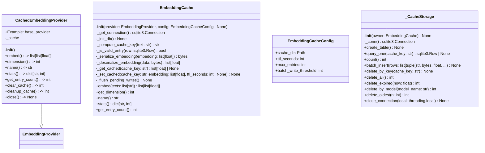

# File: `src/local_deepwiki/providers/embeddings/cache.py`

## File Overview

This module implements a caching layer for embedding providers to prevent redundant API calls. It persists embeddings to disk using SQLite and supports TTL-based expiration, allowing for efficient reuse of previously computed embeddings. The cache is designed to be transparent to the user and integrates seamlessly with existing embedding providers.

The module provides two main abstractions:
1. `EmbeddingCache`: A thread-safe cache implementation that wraps an [`EmbeddingProvider`](../base.md).
2. `CachedEmbeddingProvider`: A [wrapper](../../handlers/_error_handling.md) class that implements the [`EmbeddingProvider`](../base.md) interface and uses `EmbeddingCache` internally.

## Key Concepts

### Caching Strategy
The module uses a **content-based cache key** derived from a SHA-256 hash of the text content combined with the model name. This ensures that:
- Different models maintain separate caches.
- Identical text content produces identical cache keys, enabling effective reuse.
- Cache invalidation is model-specific.

### Thread Safety
The cache uses thread-local database connections to ensure safe concurrent access. A `threading.Lock` is used to protect operations that modify the pending writes list and flush them to the database, preventing race conditions.

### Batch Writes
To optimize database I/O, the cache accumulates writes in memory (`_pending_writes`) and flushes them in batches when the threshold (`batch_write_threshold`) is reached. This minimizes the number of database transactions.

### Cache Cleanup
The cache implements automatic cleanup strategies:
- **Expiration**: Removes entries whose TTL has passed.
- **Size Management**: When the cache exceeds `max_entries`, it removes the oldest entries (with a 10% buffer) to maintain size limits.

### Data Serialization
Embedding vectors are serialized to JSON and stored as BLOBs in SQLite. While not the most performant option for large-scale usage, this approach ensures compatibility and simplicity.

## Integration

This file integrates with the broader codebase through:
- **Imports**: It imports from `local_deepwiki.logging` for logging and [`local_deepwiki.providers.base.EmbeddingProvider`](../base.md) to define the interface it wraps.
- **External Usage**: The `EmbeddingCacheConfig` and `EmbeddingCache` classes are used by `models_embedding` and `test_embedding_cache`, indicating their role in embedding-related workflows.
- **Related Files**: It's closely related to CLI modules like `cache_cli.py`, `check_cli.py`, `config_validator.py`, `main.py`, and `status_cli.py`, which likely use the caching functionality for managing embeddings and checking cache status.

The `CachedEmbeddingProvider` is the primary entry point for integrating caching into embedding workflows. It allows any code that expects an [`EmbeddingProvider`](../base.md) to transparently use cached embeddings.

## Design Notes

### Why SQLite?
SQLite was chosen for its:
- **Simplicity**: No external dependencies or setup required.
- **Reliability**: Well-tested and robust for small to medium-sized databases.
- **Concurrency**: WAL mode support for better concurrent access.
- **Persistence**: Data survives process restarts.

### TTL Handling
TTL is enforced both at query time (via `_is_valid_entry`) and during cleanup (via `delete_expired`). This dual enforcement ensures that expired entries are not returned and are cleaned up efficiently.

### Memory Management
Pending writes are batched to reduce database load, but the cache also flushes them explicitly before closing to ensure no data loss. This is especially important during shutdown or when the cache is used in short-lived contexts.

### Error Handling
The cache is designed to be resilient to database errors:
- Database failures during initialization or operations are logged as warnings, and the system continues to function by falling back to uncached operations.
- Errors during cache operations increment a statistics counter (`errors`), which can be used for monitoring.

### Default Cache Directory
The `_default_cache_dir` function returns a path under `~/.cache/local-deepwiki`, ensuring a consistent and user-friendly default location for cache data. This path is used by `EmbeddingCacheConfig` when no explicit cache directory is provided.

### Context Manager Support
The `EmbeddingCache` class supports Python's context manager protocol (`__enter__` and `__exit__`) to ensure proper cleanup of resources. This allows for safe use in `with` statements.

### Destructor Safety
A `__del__` method is included as a safety net to ensure cleanup during interpreter shutdown, though explicit `close()` calls are preferred. This prevents resource leaks in edge cases.

## API Reference

### class `EmbeddingCacheConfig`

Configuration for the embedding cache.


<details>
<summary>View Source (lines 33-39) | <a href="https://github.com/UrbanDiver/local-deepwiki-mcp/blob/main/src/local_deepwiki/providers/embeddings/cache.py#L33-L39">GitHub</a></summary>

```python
class EmbeddingCacheConfig:
    """Configuration for the embedding cache."""

    cache_dir: Path = field(default_factory=_default_cache_dir)
    ttl_seconds: int = 604800  # 7 days default
    max_entries: int = 100000
    batch_write_threshold: int = 100
```

</details>

### class `EmbeddingCache`

SQLite-based embedding cache with content hashing and TTL support.  This class wraps an [EmbeddingProvider](../base.md) and caches embeddings to disk. Cache keys are computed from the text content and model name, so the same text will return cached embeddings even across different runs.  Thread-safe for concurrent access.

**Methods:**


<details>
<summary>View Source (lines 211-655) | <a href="https://github.com/UrbanDiver/local-deepwiki-mcp/blob/main/src/local_deepwiki/providers/embeddings/cache.py#L211-L655">GitHub</a></summary>

```python
class EmbeddingCache:
    # Methods: __init__, _get_connection, _init_db, _compute_cache_key, _is_valid_entry, _serialize_embedding, _deserialize_embedding, _get_cached, _set_cached, _flush_pending_writes, embed, get_dimension, name, stats, get_entry_count, clear, cleanup_expired, cleanup_if_needed, invalidate_by_model, __enter__, __exit__, close, __del__
```

</details>

#### `__init__`

```python
def __init__(provider: EmbeddingProvider, config: EmbeddingCacheConfig | None = None)
```

Initialize the embedding cache.


| Parameter | Type | Default | Description |
|-----------|------|---------|-------------|
| `provider` | `EmbeddingProvider` | - | The underlying embedding provider to wrap. |
| `config` | `EmbeddingCacheConfig | None` | `None` | Optional cache configuration. Uses defaults if not provided. |


<details>
<summary>View Source (lines 234-261) | <a href="https://github.com/UrbanDiver/local-deepwiki-mcp/blob/main/src/local_deepwiki/providers/embeddings/cache.py#L234-L261">GitHub</a></summary>

```python
def __init__(
        self,
        provider: EmbeddingProvider,
        config: EmbeddingCacheConfig | None = None,
    ):
        """Initialize the embedding cache.

        Args:
            provider: The underlying embedding provider to wrap.
            config: Optional cache configuration. Uses defaults if not provided.
        """
        self._provider = provider
        self._config = config or EmbeddingCacheConfig()
        self._db_path = self._config.cache_dir / self.DB_FILENAME
        self._lock = threading.Lock()
        self._local = threading.local()
        self._stats = {"hits": 0, "misses": 0, "errors": 0}
        self._pending_writes: list[tuple[str, list[float], float, int]] = []

        # Ensure cache directory exists
        self._config.cache_dir.mkdir(parents=True, exist_ok=True)

        # Storage helper — holds a reference to self so that patches to
        # _get_connection applied after construction are always honoured.
        self._storage = _CacheStorage(self)

        # Initialize database schema
        self._init_db()
```

</details>

#### `embed`

```python
async def embed(texts: list[str]) -> list[list[float]]
```

Generate embeddings for a list of texts, using cache when available.  This method checks the cache for each text and only calls the underlying provider for texts that are not cached. Results are then stored in the cache for future use.


| Parameter | Type | Default | Description |
|-----------|------|---------|-------------|
| `texts` | `list[str]` | - | List of text strings to embed. |


<details>
<summary>View Source (lines 451-505) | <a href="https://github.com/UrbanDiver/local-deepwiki-mcp/blob/main/src/local_deepwiki/providers/embeddings/cache.py#L451-L505">GitHub</a></summary>

```python
async def embed(self, texts: list[str]) -> list[list[float]]:
        """Generate embeddings for a list of texts, using cache when available.

        This method checks the cache for each text and only calls the underlying
        provider for texts that are not cached. Results are then stored in the
        cache for future use.

        Args:
            texts: List of text strings to embed.

        Returns:
            List of embedding vectors, one per input text.
        """
        if not texts:
            return []

        # Check cache for each text
        cache_keys = [self._compute_cache_key(text) for text in texts]
        results: list[list[float] | None] = [None] * len(texts)
        texts_to_embed: list[tuple[int, str]] = []

        for i, (text, cache_key) in enumerate(zip(texts, cache_keys)):
            cached = self._get_cached(cache_key)
            if cached is not None:
                results[i] = cached
                self._stats["hits"] += 1
            else:
                texts_to_embed.append((i, text))
                self._stats["misses"] += 1

        # Log cache performance
        if texts_to_embed:
            logger.debug(
                "Embedding cache: %d/%d hits, fetching %d from provider",
                len(texts) - len(texts_to_embed),
                len(texts),
                len(texts_to_embed),
            )

        # Fetch uncached embeddings from provider
        if texts_to_embed:
            indices, uncached_texts = zip(*texts_to_embed)
            new_embeddings = await self._provider.embed(list(uncached_texts))

            # Store results and cache them
            for idx, embedding in zip(indices, new_embeddings):
                results[idx] = embedding
                cache_key = cache_keys[idx]
                self._set_cached(cache_key, embedding)

        # Ensure all pending writes are flushed
        self._flush_pending_writes()

        # All results should be filled now
        return cast(list[list[float]], results)
```

</details>

#### `get_dimension`

```python
def get_dimension() -> int
```

Get the embedding dimension.


<details>
<summary>View Source (lines 507-513) | <a href="https://github.com/UrbanDiver/local-deepwiki-mcp/blob/main/src/local_deepwiki/providers/embeddings/cache.py#L507-L513">GitHub</a></summary>

```python
def get_dimension(self) -> int:
        """Get the embedding dimension.

        Returns:
            The dimension of the embedding vectors.
        """
        return self._provider.dimension
```

</details>

#### `name`

```python
def name() -> str
```

Get the provider name (includes cache indicator).


<details>
<summary>View Source (lines 516-518) | <a href="https://github.com/UrbanDiver/local-deepwiki-mcp/blob/main/src/local_deepwiki/providers/embeddings/cache.py#L516-L518">GitHub</a></summary>

```python
def name(self) -> str:
        """Get the provider name (includes cache indicator)."""
        return f"cached:{self._provider.name}"
```

</details>

#### `stats`

```python
def stats() -> dict[str, int]
```

Get cache statistics.


<details>
<summary>View Source (lines 521-527) | <a href="https://github.com/UrbanDiver/local-deepwiki-mcp/blob/main/src/local_deepwiki/providers/embeddings/cache.py#L521-L527">GitHub</a></summary>

```python
def stats(self) -> dict[str, int]:
        """Get cache statistics.

        Returns:
            Dictionary with hits, misses, and errors counts.
        """
        return self._stats.copy()
```

</details>

#### `get_entry_count`

```python
def get_entry_count() -> int
```

Get the number of entries in the cache.


<details>
<summary>View Source (lines 529-538) | <a href="https://github.com/UrbanDiver/local-deepwiki-mcp/blob/main/src/local_deepwiki/providers/embeddings/cache.py#L529-L538">GitHub</a></summary>

```python
def get_entry_count(self) -> int:
        """Get the number of entries in the cache.

        Returns:
            Number of cache entries.
        """
        try:
            return self._storage.count()
        except sqlite3.Error:
            return 0
```

</details>

#### `clear`

```python
def clear() -> int
```

Clear all cache entries.


<details>
<summary>View Source (lines 540-552) | <a href="https://github.com/UrbanDiver/local-deepwiki-mcp/blob/main/src/local_deepwiki/providers/embeddings/cache.py#L540-L552">GitHub</a></summary>

```python
def clear(self) -> int:
        """Clear all cache entries.

        Returns:
            Number of entries cleared.
        """
        try:
            count = self._storage.delete_all()
            logger.info("Cleared %s embedding cache entries", count)
            return count
        except sqlite3.Error as e:
            logger.warning("Failed to clear embedding cache: %s", e)
            return 0
```

</details>

#### `cleanup_expired`

```python
def cleanup_expired() -> int
```

Remove expired cache entries.


<details>
<summary>View Source (lines 554-567) | <a href="https://github.com/UrbanDiver/local-deepwiki-mcp/blob/main/src/local_deepwiki/providers/embeddings/cache.py#L554-L567">GitHub</a></summary>

```python
def cleanup_expired(self) -> int:
        """Remove expired cache entries.

        Returns:
            Number of entries removed.
        """
        try:
            deleted = self._storage.delete_expired(time.time())
            if deleted > 0:
                logger.info("Cleaned up %s expired embedding cache entries", deleted)
            return deleted
        except sqlite3.Error as e:
            logger.warning("Failed to cleanup expired entries: %s", e)
            return 0
```

</details>

#### `cleanup_if_needed`

```python
def cleanup_if_needed() -> int
```

Clean up cache if it exceeds max_entries.  Removes oldest entries (by creation time) when the cache exceeds the configured maximum size. Also removes expired entries.


<details>
<summary>View Source (lines 569-601) | <a href="https://github.com/UrbanDiver/local-deepwiki-mcp/blob/main/src/local_deepwiki/providers/embeddings/cache.py#L569-L601">GitHub</a></summary>

```python
def cleanup_if_needed(self) -> int:
        """Clean up cache if it exceeds max_entries.

        Removes oldest entries (by creation time) when the cache exceeds
        the configured maximum size. Also removes expired entries.

        Returns:
            Number of entries removed.
        """
        try:
            # First, remove expired entries
            expired_count = self.cleanup_expired()

            # Check current count
            count = self._storage.count()

            if count <= self._config.max_entries:
                return expired_count

            # Calculate how many to remove (remove 10% buffer)
            to_remove = count - int(self._config.max_entries * 0.9)
            deleted = self._storage.delete_oldest(to_remove)

            logger.info(
                "Cache cleanup: removed %d expired + %d oldest entries",
                expired_count,
                deleted,
            )
            return expired_count + deleted

        except sqlite3.Error as e:
            logger.warning("Cache cleanup failed: %s", e)
            return 0
```

</details>

#### `invalidate_by_model`

```python
def invalidate_by_model(model_name: str) -> int
```

Invalidate all cache entries for a specific model.  Useful when switching models or when a model is updated.


| Parameter | Type | Default | Description |
|-----------|------|---------|-------------|
| `model_name` | `str` | - | The model name to invalidate entries for. |


<details>
<summary>View Source (lines 603-623) | <a href="https://github.com/UrbanDiver/local-deepwiki-mcp/blob/main/src/local_deepwiki/providers/embeddings/cache.py#L603-L623">GitHub</a></summary>

```python
def invalidate_by_model(self, model_name: str) -> int:
        """Invalidate all cache entries for a specific model.

        Useful when switching models or when a model is updated.

        Args:
            model_name: The model name to invalidate entries for.

        Returns:
            Number of entries invalidated.
        """
        try:
            deleted = self._storage.delete_by_model(model_name)
            if deleted > 0:
                logger.info(
                    "Invalidated %d cache entries for model %s", deleted, model_name
                )
            return deleted
        except sqlite3.Error as e:
            logger.warning("Failed to invalidate model cache: %s", e)
            return 0
```

</details>

#### `__enter__`

```python
def __enter__() -> EmbeddingCache
```

Enter context manager.


<details>
<summary>View Source (lines 625-627) | <a href="https://github.com/UrbanDiver/local-deepwiki-mcp/blob/main/src/local_deepwiki/providers/embeddings/cache.py#L625-L627">GitHub</a></summary>

```python
def __enter__(self) -> EmbeddingCache:
        """Enter context manager."""
        return self
```

</details>

#### `__exit__`

```python
def __exit__() -> None
```

Exit context manager, closing all connections.


<details>
<summary>View Source (lines 629-631) | <a href="https://github.com/UrbanDiver/local-deepwiki-mcp/blob/main/src/local_deepwiki/providers/embeddings/cache.py#L629-L631">GitHub</a></summary>

```python
def __exit__(self, *exc: object) -> None:
        """Exit context manager, closing all connections."""
        self.close()
```

</details>

#### `close`

```python
def close() -> None
```

Close all database connections.  Should be called when the cache is no longer needed to ensure all pending writes are flushed and connections are closed cleanly. Closes thread-local connections from all threads that accessed this cache.


<details>
<summary>View Source (lines 633-644) | <a href="https://github.com/UrbanDiver/local-deepwiki-mcp/blob/main/src/local_deepwiki/providers/embeddings/cache.py#L633-L644">GitHub</a></summary>

```python
def close(self) -> None:
        """Close all database connections.

        Should be called when the cache is no longer needed to ensure
        all pending writes are flushed and connections are closed cleanly.
        Closes thread-local connections from all threads that accessed this cache.
        """
        # Flush any pending writes
        self._flush_pending_writes()

        # Close thread-local connection if it exists in current thread
        self._storage.close_connection(self._local)
```

</details>

### class `CachedEmbeddingProvider`

**Inherits from:** [`EmbeddingProvider`](../base.md)

Embedding provider [wrapper](../../handlers/_error_handling.md) that adds caching.  This class implements the [EmbeddingProvider](../base.md) interface and wraps another provider with caching functionality. It can be used as a drop-in replacement for any [EmbeddingProvider](../base.md).

**Methods:**


<details>
<summary>View Source (lines 658-730) | <a href="https://github.com/UrbanDiver/local-deepwiki-mcp/blob/main/src/local_deepwiki/providers/embeddings/cache.py#L658-L730">GitHub</a></summary>

```python
class CachedEmbeddingProvider(EmbeddingProvider):
    """Embedding provider wrapper that adds caching.

    This class implements the EmbeddingProvider interface and wraps another
    provider with caching functionality. It can be used as a drop-in replacement
    for any EmbeddingProvider.

    Example:
        base_provider = OpenAIEmbeddingProvider()
        cached_provider = CachedEmbeddingProvider(base_provider)

        # Use cached_provider anywhere an EmbeddingProvider is expected
        vector_store = VectorStore(db_path, cached_provider)
    """

    def __init__(
        self,
        provider: EmbeddingProvider,
        config: EmbeddingCacheConfig | None = None,
    ):
        """Initialize the cached embedding provider.

        Args:
            provider: The underlying embedding provider to wrap.
            config: Optional cache configuration.
        """
        self._cache = EmbeddingCache(provider, config)

    async def embed(self, texts: list[str]) -> list[list[float]]:
        """Generate embeddings for a list of texts.

        Args:
            texts: List of text strings to embed.

        Returns:
            List of embedding vectors.
        """
        return await self._cache.embed(texts)

    @property
    def dimension(self) -> int:
        """Get the embedding dimension.

        Returns:
            The dimension of the embedding vectors.
        """
        return self._cache.get_dimension()

    @property
    def name(self) -> str:
        """Get the provider name."""
        return self._cache.name

    @property
    def stats(self) -> dict[str, int]:
        """Get cache statistics."""
        return self._cache.stats

    def get_entry_count(self) -> int:
        """Get the number of entries in the cache."""
        return self._cache.get_entry_count()

    def clear_cache(self) -> int:
        """Clear all cache entries."""
        return self._cache.clear()

    def cleanup_cache(self) -> int:
        """Clean up expired and excess cache entries."""
        return self._cache.cleanup_if_needed()

    def close(self) -> None:
        """Close the cache."""
        self._cache.close()
```

</details>

#### `__init__`

```python
def __init__(provider: EmbeddingProvider, config: EmbeddingCacheConfig | None = None)
```

Initialize the cached embedding provider.


| Parameter | Type | Default | Description |
|-----------|------|---------|-------------|
| `provider` | `EmbeddingProvider` | - | The underlying embedding provider to wrap. |
| `config` | `EmbeddingCacheConfig | None` | `None` | Optional cache configuration. |


<details>
<summary>View Source (lines 658-730) | <a href="https://github.com/UrbanDiver/local-deepwiki-mcp/blob/main/src/local_deepwiki/providers/embeddings/cache.py#L658-L730">GitHub</a></summary>

```python
class CachedEmbeddingProvider(EmbeddingProvider):
    """Embedding provider wrapper that adds caching.

    This class implements the EmbeddingProvider interface and wraps another
    provider with caching functionality. It can be used as a drop-in replacement
    for any EmbeddingProvider.

    Example:
        base_provider = OpenAIEmbeddingProvider()
        cached_provider = CachedEmbeddingProvider(base_provider)

        # Use cached_provider anywhere an EmbeddingProvider is expected
        vector_store = VectorStore(db_path, cached_provider)
    """

    def __init__(
        self,
        provider: EmbeddingProvider,
        config: EmbeddingCacheConfig | None = None,
    ):
        """Initialize the cached embedding provider.

        Args:
            provider: The underlying embedding provider to wrap.
            config: Optional cache configuration.
        """
        self._cache = EmbeddingCache(provider, config)

    async def embed(self, texts: list[str]) -> list[list[float]]:
        """Generate embeddings for a list of texts.

        Args:
            texts: List of text strings to embed.

        Returns:
            List of embedding vectors.
        """
        return await self._cache.embed(texts)

    @property
    def dimension(self) -> int:
        """Get the embedding dimension.

        Returns:
            The dimension of the embedding vectors.
        """
        return self._cache.get_dimension()

    @property
    def name(self) -> str:
        """Get the provider name."""
        return self._cache.name

    @property
    def stats(self) -> dict[str, int]:
        """Get cache statistics."""
        return self._cache.stats

    def get_entry_count(self) -> int:
        """Get the number of entries in the cache."""
        return self._cache.get_entry_count()

    def clear_cache(self) -> int:
        """Clear all cache entries."""
        return self._cache.clear()

    def cleanup_cache(self) -> int:
        """Clean up expired and excess cache entries."""
        return self._cache.cleanup_if_needed()

    def close(self) -> None:
        """Close the cache."""
        self._cache.close()
```

</details>

#### `embed`

```python
async def embed(texts: list[str]) -> list[list[float]]
```

Generate embeddings for a list of texts.


| Parameter | Type | Default | Description |
|-----------|------|---------|-------------|
| `texts` | `list[str]` | - | List of text strings to embed. |


<details>
<summary>View Source (lines 658-730) | <a href="https://github.com/UrbanDiver/local-deepwiki-mcp/blob/main/src/local_deepwiki/providers/embeddings/cache.py#L658-L730">GitHub</a></summary>

```python
class CachedEmbeddingProvider(EmbeddingProvider):
    """Embedding provider wrapper that adds caching.

    This class implements the EmbeddingProvider interface and wraps another
    provider with caching functionality. It can be used as a drop-in replacement
    for any EmbeddingProvider.

    Example:
        base_provider = OpenAIEmbeddingProvider()
        cached_provider = CachedEmbeddingProvider(base_provider)

        # Use cached_provider anywhere an EmbeddingProvider is expected
        vector_store = VectorStore(db_path, cached_provider)
    """

    def __init__(
        self,
        provider: EmbeddingProvider,
        config: EmbeddingCacheConfig | None = None,
    ):
        """Initialize the cached embedding provider.

        Args:
            provider: The underlying embedding provider to wrap.
            config: Optional cache configuration.
        """
        self._cache = EmbeddingCache(provider, config)

    async def embed(self, texts: list[str]) -> list[list[float]]:
        """Generate embeddings for a list of texts.

        Args:
            texts: List of text strings to embed.

        Returns:
            List of embedding vectors.
        """
        return await self._cache.embed(texts)

    @property
    def dimension(self) -> int:
        """Get the embedding dimension.

        Returns:
            The dimension of the embedding vectors.
        """
        return self._cache.get_dimension()

    @property
    def name(self) -> str:
        """Get the provider name."""
        return self._cache.name

    @property
    def stats(self) -> dict[str, int]:
        """Get cache statistics."""
        return self._cache.stats

    def get_entry_count(self) -> int:
        """Get the number of entries in the cache."""
        return self._cache.get_entry_count()

    def clear_cache(self) -> int:
        """Clear all cache entries."""
        return self._cache.clear()

    def cleanup_cache(self) -> int:
        """Clean up expired and excess cache entries."""
        return self._cache.cleanup_if_needed()

    def close(self) -> None:
        """Close the cache."""
        self._cache.close()
```

</details>

#### `dimension`

```python
def dimension() -> int
```

Get the embedding dimension.


<details>
<summary>View Source (lines 658-730) | <a href="https://github.com/UrbanDiver/local-deepwiki-mcp/blob/main/src/local_deepwiki/providers/embeddings/cache.py#L658-L730">GitHub</a></summary>

```python
class CachedEmbeddingProvider(EmbeddingProvider):
    """Embedding provider wrapper that adds caching.

    This class implements the EmbeddingProvider interface and wraps another
    provider with caching functionality. It can be used as a drop-in replacement
    for any EmbeddingProvider.

    Example:
        base_provider = OpenAIEmbeddingProvider()
        cached_provider = CachedEmbeddingProvider(base_provider)

        # Use cached_provider anywhere an EmbeddingProvider is expected
        vector_store = VectorStore(db_path, cached_provider)
    """

    def __init__(
        self,
        provider: EmbeddingProvider,
        config: EmbeddingCacheConfig | None = None,
    ):
        """Initialize the cached embedding provider.

        Args:
            provider: The underlying embedding provider to wrap.
            config: Optional cache configuration.
        """
        self._cache = EmbeddingCache(provider, config)

    async def embed(self, texts: list[str]) -> list[list[float]]:
        """Generate embeddings for a list of texts.

        Args:
            texts: List of text strings to embed.

        Returns:
            List of embedding vectors.
        """
        return await self._cache.embed(texts)

    @property
    def dimension(self) -> int:
        """Get the embedding dimension.

        Returns:
            The dimension of the embedding vectors.
        """
        return self._cache.get_dimension()

    @property
    def name(self) -> str:
        """Get the provider name."""
        return self._cache.name

    @property
    def stats(self) -> dict[str, int]:
        """Get cache statistics."""
        return self._cache.stats

    def get_entry_count(self) -> int:
        """Get the number of entries in the cache."""
        return self._cache.get_entry_count()

    def clear_cache(self) -> int:
        """Clear all cache entries."""
        return self._cache.clear()

    def cleanup_cache(self) -> int:
        """Clean up expired and excess cache entries."""
        return self._cache.cleanup_if_needed()

    def close(self) -> None:
        """Close the cache."""
        self._cache.close()
```

</details>

#### `name`

```python
def name() -> str
```

Get the provider name.


<details>
<summary>View Source (lines 658-730) | <a href="https://github.com/UrbanDiver/local-deepwiki-mcp/blob/main/src/local_deepwiki/providers/embeddings/cache.py#L658-L730">GitHub</a></summary>

```python
class CachedEmbeddingProvider(EmbeddingProvider):
    """Embedding provider wrapper that adds caching.

    This class implements the EmbeddingProvider interface and wraps another
    provider with caching functionality. It can be used as a drop-in replacement
    for any EmbeddingProvider.

    Example:
        base_provider = OpenAIEmbeddingProvider()
        cached_provider = CachedEmbeddingProvider(base_provider)

        # Use cached_provider anywhere an EmbeddingProvider is expected
        vector_store = VectorStore(db_path, cached_provider)
    """

    def __init__(
        self,
        provider: EmbeddingProvider,
        config: EmbeddingCacheConfig | None = None,
    ):
        """Initialize the cached embedding provider.

        Args:
            provider: The underlying embedding provider to wrap.
            config: Optional cache configuration.
        """
        self._cache = EmbeddingCache(provider, config)

    async def embed(self, texts: list[str]) -> list[list[float]]:
        """Generate embeddings for a list of texts.

        Args:
            texts: List of text strings to embed.

        Returns:
            List of embedding vectors.
        """
        return await self._cache.embed(texts)

    @property
    def dimension(self) -> int:
        """Get the embedding dimension.

        Returns:
            The dimension of the embedding vectors.
        """
        return self._cache.get_dimension()

    @property
    def name(self) -> str:
        """Get the provider name."""
        return self._cache.name

    @property
    def stats(self) -> dict[str, int]:
        """Get cache statistics."""
        return self._cache.stats

    def get_entry_count(self) -> int:
        """Get the number of entries in the cache."""
        return self._cache.get_entry_count()

    def clear_cache(self) -> int:
        """Clear all cache entries."""
        return self._cache.clear()

    def cleanup_cache(self) -> int:
        """Clean up expired and excess cache entries."""
        return self._cache.cleanup_if_needed()

    def close(self) -> None:
        """Close the cache."""
        self._cache.close()
```

</details>

#### `stats`

```python
def stats() -> dict[str, int]
```

Get cache statistics.


<details>
<summary>View Source (lines 658-730) | <a href="https://github.com/UrbanDiver/local-deepwiki-mcp/blob/main/src/local_deepwiki/providers/embeddings/cache.py#L658-L730">GitHub</a></summary>

```python
class CachedEmbeddingProvider(EmbeddingProvider):
    """Embedding provider wrapper that adds caching.

    This class implements the EmbeddingProvider interface and wraps another
    provider with caching functionality. It can be used as a drop-in replacement
    for any EmbeddingProvider.

    Example:
        base_provider = OpenAIEmbeddingProvider()
        cached_provider = CachedEmbeddingProvider(base_provider)

        # Use cached_provider anywhere an EmbeddingProvider is expected
        vector_store = VectorStore(db_path, cached_provider)
    """

    def __init__(
        self,
        provider: EmbeddingProvider,
        config: EmbeddingCacheConfig | None = None,
    ):
        """Initialize the cached embedding provider.

        Args:
            provider: The underlying embedding provider to wrap.
            config: Optional cache configuration.
        """
        self._cache = EmbeddingCache(provider, config)

    async def embed(self, texts: list[str]) -> list[list[float]]:
        """Generate embeddings for a list of texts.

        Args:
            texts: List of text strings to embed.

        Returns:
            List of embedding vectors.
        """
        return await self._cache.embed(texts)

    @property
    def dimension(self) -> int:
        """Get the embedding dimension.

        Returns:
            The dimension of the embedding vectors.
        """
        return self._cache.get_dimension()

    @property
    def name(self) -> str:
        """Get the provider name."""
        return self._cache.name

    @property
    def stats(self) -> dict[str, int]:
        """Get cache statistics."""
        return self._cache.stats

    def get_entry_count(self) -> int:
        """Get the number of entries in the cache."""
        return self._cache.get_entry_count()

    def clear_cache(self) -> int:
        """Clear all cache entries."""
        return self._cache.clear()

    def cleanup_cache(self) -> int:
        """Clean up expired and excess cache entries."""
        return self._cache.cleanup_if_needed()

    def close(self) -> None:
        """Close the cache."""
        self._cache.close()
```

</details>

#### `get_entry_count`

```python
def get_entry_count() -> int
```

Get the number of entries in the cache.


<details>
<summary>View Source (lines 658-730) | <a href="https://github.com/UrbanDiver/local-deepwiki-mcp/blob/main/src/local_deepwiki/providers/embeddings/cache.py#L658-L730">GitHub</a></summary>

```python
class CachedEmbeddingProvider(EmbeddingProvider):
    """Embedding provider wrapper that adds caching.

    This class implements the EmbeddingProvider interface and wraps another
    provider with caching functionality. It can be used as a drop-in replacement
    for any EmbeddingProvider.

    Example:
        base_provider = OpenAIEmbeddingProvider()
        cached_provider = CachedEmbeddingProvider(base_provider)

        # Use cached_provider anywhere an EmbeddingProvider is expected
        vector_store = VectorStore(db_path, cached_provider)
    """

    def __init__(
        self,
        provider: EmbeddingProvider,
        config: EmbeddingCacheConfig | None = None,
    ):
        """Initialize the cached embedding provider.

        Args:
            provider: The underlying embedding provider to wrap.
            config: Optional cache configuration.
        """
        self._cache = EmbeddingCache(provider, config)

    async def embed(self, texts: list[str]) -> list[list[float]]:
        """Generate embeddings for a list of texts.

        Args:
            texts: List of text strings to embed.

        Returns:
            List of embedding vectors.
        """
        return await self._cache.embed(texts)

    @property
    def dimension(self) -> int:
        """Get the embedding dimension.

        Returns:
            The dimension of the embedding vectors.
        """
        return self._cache.get_dimension()

    @property
    def name(self) -> str:
        """Get the provider name."""
        return self._cache.name

    @property
    def stats(self) -> dict[str, int]:
        """Get cache statistics."""
        return self._cache.stats

    def get_entry_count(self) -> int:
        """Get the number of entries in the cache."""
        return self._cache.get_entry_count()

    def clear_cache(self) -> int:
        """Clear all cache entries."""
        return self._cache.clear()

    def cleanup_cache(self) -> int:
        """Clean up expired and excess cache entries."""
        return self._cache.cleanup_if_needed()

    def close(self) -> None:
        """Close the cache."""
        self._cache.close()
```

</details>

#### `clear_cache`

```python
def clear_cache() -> int
```

Clear all cache entries.


<details>
<summary>View Source (lines 658-730) | <a href="https://github.com/UrbanDiver/local-deepwiki-mcp/blob/main/src/local_deepwiki/providers/embeddings/cache.py#L658-L730">GitHub</a></summary>

```python
class CachedEmbeddingProvider(EmbeddingProvider):
    """Embedding provider wrapper that adds caching.

    This class implements the EmbeddingProvider interface and wraps another
    provider with caching functionality. It can be used as a drop-in replacement
    for any EmbeddingProvider.

    Example:
        base_provider = OpenAIEmbeddingProvider()
        cached_provider = CachedEmbeddingProvider(base_provider)

        # Use cached_provider anywhere an EmbeddingProvider is expected
        vector_store = VectorStore(db_path, cached_provider)
    """

    def __init__(
        self,
        provider: EmbeddingProvider,
        config: EmbeddingCacheConfig | None = None,
    ):
        """Initialize the cached embedding provider.

        Args:
            provider: The underlying embedding provider to wrap.
            config: Optional cache configuration.
        """
        self._cache = EmbeddingCache(provider, config)

    async def embed(self, texts: list[str]) -> list[list[float]]:
        """Generate embeddings for a list of texts.

        Args:
            texts: List of text strings to embed.

        Returns:
            List of embedding vectors.
        """
        return await self._cache.embed(texts)

    @property
    def dimension(self) -> int:
        """Get the embedding dimension.

        Returns:
            The dimension of the embedding vectors.
        """
        return self._cache.get_dimension()

    @property
    def name(self) -> str:
        """Get the provider name."""
        return self._cache.name

    @property
    def stats(self) -> dict[str, int]:
        """Get cache statistics."""
        return self._cache.stats

    def get_entry_count(self) -> int:
        """Get the number of entries in the cache."""
        return self._cache.get_entry_count()

    def clear_cache(self) -> int:
        """Clear all cache entries."""
        return self._cache.clear()

    def cleanup_cache(self) -> int:
        """Clean up expired and excess cache entries."""
        return self._cache.cleanup_if_needed()

    def close(self) -> None:
        """Close the cache."""
        self._cache.close()
```

</details>

#### `cleanup_cache`

```python
def cleanup_cache() -> int
```

Clean up expired and excess cache entries.


<details>
<summary>View Source (lines 658-730) | <a href="https://github.com/UrbanDiver/local-deepwiki-mcp/blob/main/src/local_deepwiki/providers/embeddings/cache.py#L658-L730">GitHub</a></summary>

```python
class CachedEmbeddingProvider(EmbeddingProvider):
    """Embedding provider wrapper that adds caching.

    This class implements the EmbeddingProvider interface and wraps another
    provider with caching functionality. It can be used as a drop-in replacement
    for any EmbeddingProvider.

    Example:
        base_provider = OpenAIEmbeddingProvider()
        cached_provider = CachedEmbeddingProvider(base_provider)

        # Use cached_provider anywhere an EmbeddingProvider is expected
        vector_store = VectorStore(db_path, cached_provider)
    """

    def __init__(
        self,
        provider: EmbeddingProvider,
        config: EmbeddingCacheConfig | None = None,
    ):
        """Initialize the cached embedding provider.

        Args:
            provider: The underlying embedding provider to wrap.
            config: Optional cache configuration.
        """
        self._cache = EmbeddingCache(provider, config)

    async def embed(self, texts: list[str]) -> list[list[float]]:
        """Generate embeddings for a list of texts.

        Args:
            texts: List of text strings to embed.

        Returns:
            List of embedding vectors.
        """
        return await self._cache.embed(texts)

    @property
    def dimension(self) -> int:
        """Get the embedding dimension.

        Returns:
            The dimension of the embedding vectors.
        """
        return self._cache.get_dimension()

    @property
    def name(self) -> str:
        """Get the provider name."""
        return self._cache.name

    @property
    def stats(self) -> dict[str, int]:
        """Get cache statistics."""
        return self._cache.stats

    def get_entry_count(self) -> int:
        """Get the number of entries in the cache."""
        return self._cache.get_entry_count()

    def clear_cache(self) -> int:
        """Clear all cache entries."""
        return self._cache.clear()

    def cleanup_cache(self) -> int:
        """Clean up expired and excess cache entries."""
        return self._cache.cleanup_if_needed()

    def close(self) -> None:
        """Close the cache."""
        self._cache.close()
```

</details>

#### `close`

```python
def close() -> None
```

Close the cache.


<details>
<summary>View Source (lines 658-730) | <a href="https://github.com/UrbanDiver/local-deepwiki-mcp/blob/main/src/local_deepwiki/providers/embeddings/cache.py#L658-L730">GitHub</a></summary>

```python
class CachedEmbeddingProvider(EmbeddingProvider):
    """Embedding provider wrapper that adds caching.

    This class implements the EmbeddingProvider interface and wraps another
    provider with caching functionality. It can be used as a drop-in replacement
    for any EmbeddingProvider.

    Example:
        base_provider = OpenAIEmbeddingProvider()
        cached_provider = CachedEmbeddingProvider(base_provider)

        # Use cached_provider anywhere an EmbeddingProvider is expected
        vector_store = VectorStore(db_path, cached_provider)
    """

    def __init__(
        self,
        provider: EmbeddingProvider,
        config: EmbeddingCacheConfig | None = None,
    ):
        """Initialize the cached embedding provider.

        Args:
            provider: The underlying embedding provider to wrap.
            config: Optional cache configuration.
        """
        self._cache = EmbeddingCache(provider, config)

    async def embed(self, texts: list[str]) -> list[list[float]]:
        """Generate embeddings for a list of texts.

        Args:
            texts: List of text strings to embed.

        Returns:
            List of embedding vectors.
        """
        return await self._cache.embed(texts)

    @property
    def dimension(self) -> int:
        """Get the embedding dimension.

        Returns:
            The dimension of the embedding vectors.
        """
        return self._cache.get_dimension()

    @property
    def name(self) -> str:
        """Get the provider name."""
        return self._cache.name

    @property
    def stats(self) -> dict[str, int]:
        """Get cache statistics."""
        return self._cache.stats

    def get_entry_count(self) -> int:
        """Get the number of entries in the cache."""
        return self._cache.get_entry_count()

    def clear_cache(self) -> int:
        """Clear all cache entries."""
        return self._cache.clear()

    def cleanup_cache(self) -> int:
        """Clean up expired and excess cache entries."""
        return self._cache.cleanup_if_needed()

    def close(self) -> None:
        """Close the cache."""
        self._cache.close()
```

</details>

## Class Diagram



## Call Graph

```mermaid
flowchart TD
    N0[EmbeddingCache.__init__]
    N1[EmbeddingCache._compute_cac...]
    N2[EmbeddingCache._deserialize...]
    N3[EmbeddingCache._flush_pendi...]
    N4[EmbeddingCache._get_cached]
    N5[EmbeddingCache._get_connection]
    N6[EmbeddingCache._is_valid_entry]
    N7[EmbeddingCache._serialize_e...]
    N8[EmbeddingCache._set_cached]
    N9[EmbeddingCache.cleanup_expired]
    N10[EmbeddingCache.cleanup_if_n...]
    N11[EmbeddingCache.embed]
    N12[_CacheStorage.batch_insert]
    N13[_CacheStorage.count]
    N14[_CacheStorage.create_table]
    N15[_CacheStorage.delete_all]
    N16[_CacheStorage.delete_by_key]
    N17[_CacheStorage.delete_by_model]
    N18[_CacheStorage.delete_expired]
    N19[_CacheStorage.delete_oldest]
    N20[_CacheStorage.query_one]
    N21[_conn]
    N22[_flush_pending_writes]
    N23[cast]
    N24[commit]
    N25[embed]
    N26[encode]
    N27[execute]
    N28[fetchone]
    N29[time]
    N14 --> N21
    N14 --> N27
    N14 --> N28
    N14 --> N24
    N20 --> N27
    N20 --> N21
    N20 --> N28
    N13 --> N27
    N13 --> N21
    N13 --> N28
    N12 --> N21
    N12 --> N24
    N16 --> N21
    N16 --> N27
    N16 --> N24
    N15 --> N21
    N15 --> N27
    N15 --> N24
    N18 --> N21
    N18 --> N27
    N18 --> N24
    N17 --> N21
    N17 --> N27
    N17 --> N24
    N19 --> N21
    N19 --> N27
    N19 --> N24
    N5 --> N27
    N1 --> N26
    N6 --> N23
    N6 --> N29
    N7 --> N26
    N2 --> N23
    N8 --> N29
    N8 --> N22
    N11 --> N25
    N11 --> N22
    N11 --> N23
    N9 --> N29
    classDef func fill:#e1f5fe
    class N21,N22,N23,N24,N25,N26,N27,N28,N29 func
    classDef method fill:#fff3e0
    class N0,N1,N2,N3,N4,N5,N6,N7,N8,N9,N10,N11,N12,N13,N14,N15,N16,N17,N18,N19,N20 method
```



## Used By

Functions and methods in this file and their callers:

- **`EmbeddingCache`**: called by `CachedEmbeddingProvider.__init__`
- **`EmbeddingCacheConfig`**: called by `EmbeddingCache.__init__`
- **`Lock`**: called by `EmbeddingCache.__init__`
- **`_CacheStorage`**: called by `EmbeddingCache.__init__`
- **`_compute_cache_key`**: called by `EmbeddingCache.embed`
- **`_conn`**: called by `_CacheStorage.batch_insert`, `_CacheStorage.count`, `_CacheStorage.create_table`, `_CacheStorage.delete_all`, `_CacheStorage.delete_by_key`, `_CacheStorage.delete_by_model`, `_CacheStorage.delete_expired`, `_CacheStorage.delete_oldest`, `_CacheStorage.query_one`
- **`_deserialize_embedding`**: called by `EmbeddingCache._get_cached`
- **`_flush_pending_writes`**: called by `EmbeddingCache._set_cached`, `EmbeddingCache.close`, `EmbeddingCache.embed`
- **`_get_cached`**: called by `EmbeddingCache.embed`
- **`_get_connection`**: called by `_CacheStorage._conn`
- **`_init_db`**: called by `EmbeddingCache.__init__`
- **`_is_valid_entry`**: called by `EmbeddingCache._get_cached`
- **`_serialize_embedding`**: called by `EmbeddingCache._flush_pending_writes`
- **`_set_cached`**: called by `EmbeddingCache.embed`
- **`batch_insert`**: called by `EmbeddingCache._flush_pending_writes`
- **`cast`**: called by `EmbeddingCache._deserialize_embedding`, `EmbeddingCache._is_valid_entry`, `EmbeddingCache.embed`
- **`cleanup_expired`**: called by `EmbeddingCache.cleanup_if_needed`
- **`cleanup_if_needed`**: called by `CachedEmbeddingProvider.cleanup_cache`
- **`close_connection`**: called by `EmbeddingCache.close`
- **`commit`**: called by `_CacheStorage.batch_insert`, `_CacheStorage.create_table`, `_CacheStorage.delete_all`, `_CacheStorage.delete_by_key`, `_CacheStorage.delete_by_model`, `_CacheStorage.delete_expired`, `_CacheStorage.delete_oldest`
- **`connect`**: called by `EmbeddingCache._get_connection`
- **`copy`**: called by `EmbeddingCache.stats`
- **`create_table`**: called by `EmbeddingCache._init_db`
- **`decode`**: called by `EmbeddingCache._deserialize_embedding`
- **`delete_all`**: called by `EmbeddingCache.clear`
- **`delete_by_key`**: called by `EmbeddingCache._get_cached`
- **`delete_by_model`**: called by `EmbeddingCache.invalidate_by_model`
- **`delete_expired`**: called by `EmbeddingCache.cleanup_expired`
- **`delete_oldest`**: called by `EmbeddingCache.cleanup_if_needed`
- **`dumps`**: called by `EmbeddingCache._serialize_embedding`
- **`embed`**: called by `CachedEmbeddingProvider.embed`, `EmbeddingCache.embed`
- **`encode`**: called by `EmbeddingCache._compute_cache_key`, `EmbeddingCache._serialize_embedding`
- **`execute`**: called by `EmbeddingCache._get_connection`, `_CacheStorage.count`, `_CacheStorage.create_table`, `_CacheStorage.delete_all`, `_CacheStorage.delete_by_key`, `_CacheStorage.delete_by_model`, `_CacheStorage.delete_expired`, `_CacheStorage.delete_oldest`, `_CacheStorage.query_one`
- **`executemany`**: called by `_CacheStorage.batch_insert`
- **`executescript`**: called by `_CacheStorage.create_table`
- **`fetchone`**: called by `_CacheStorage.count`, `_CacheStorage.create_table`, `_CacheStorage.query_one`
- **`get_dimension`**: called by `CachedEmbeddingProvider.dimension`
- **`get_entry_count`**: called by `CachedEmbeddingProvider.get_entry_count`
- **`hexdigest`**: called by `EmbeddingCache._compute_cache_key`
- **`home`**: called by `_default_cache_dir`
- **`loads`**: called by `EmbeddingCache._deserialize_embedding`
- **`local`**: called by `EmbeddingCache.__init__`
- **`mkdir`**: called by `EmbeddingCache.__init__`
- **`query_one`**: called by `EmbeddingCache._get_cached`
- **`sha256`**: called by `EmbeddingCache._compute_cache_key`
- **`time`**: called by `EmbeddingCache._is_valid_entry`, `EmbeddingCache._set_cached`, `EmbeddingCache.cleanup_expired`

## Last Modified

| Entity | Type | Author | Date | Commit |
|--------|------|--------|------|--------|
| `_CacheStorage` | class | Brian Breidenbach | 1 week ago | `bc5bef3` refactor: extract Embedding... |
| `__init__` | method | Brian Breidenbach | 1 week ago | `bc5bef3` refactor: extract Embedding... |
| `_conn` | method | Brian Breidenbach | 1 week ago | `bc5bef3` refactor: extract Embedding... |
| `create_table` | method | Brian Breidenbach | 1 week ago | `bc5bef3` refactor: extract Embedding... |
| `query_one` | method | Brian Breidenbach | 1 week ago | `bc5bef3` refactor: extract Embedding... |
| `count` | method | Brian Breidenbach | 1 week ago | `bc5bef3` refactor: extract Embedding... |
| `batch_insert` | method | Brian Breidenbach | 1 week ago | `bc5bef3` refactor: extract Embedding... |
| `delete_by_key` | method | Brian Breidenbach | 1 week ago | `bc5bef3` refactor: extract Embedding... |
| `delete_all` | method | Brian Breidenbach | 1 week ago | `bc5bef3` refactor: extract Embedding... |
| `delete_expired` | method | Brian Breidenbach | 1 week ago | `bc5bef3` refactor: extract Embedding... |
| `delete_by_model` | method | Brian Breidenbach | 1 week ago | `bc5bef3` refactor: extract Embedding... |
| `delete_oldest` | method | Brian Breidenbach | 1 week ago | `bc5bef3` refactor: extract Embedding... |
| `close_connection` | method | Brian Breidenbach | 1 week ago | `bc5bef3` refactor: extract Embedding... |
| `EmbeddingCache` | class | Brian Breidenbach | 1 week ago | `bc5bef3` refactor: extract Embedding... |
| `__init__` | method | Brian Breidenbach | 1 week ago | `bc5bef3` refactor: extract Embedding... |
| `_init_db` | method | Brian Breidenbach | 1 week ago | `bc5bef3` refactor: extract Embedding... |
| `_get_cached` | method | Brian Breidenbach | 1 week ago | `bc5bef3` refactor: extract Embedding... |
| `_set_cached` | method | Brian Breidenbach | 1 week ago | `bc5bef3` refactor: extract Embedding... |
| `_flush_pending_writes` | method | Brian Breidenbach | 1 week ago | `bc5bef3` refactor: extract Embedding... |
| `get_entry_count` | method | Brian Breidenbach | 1 week ago | `bc5bef3` refactor: extract Embedding... |
| `clear` | method | Brian Breidenbach | 1 week ago | `bc5bef3` refactor: extract Embedding... |
| `cleanup_expired` | method | Brian Breidenbach | 1 week ago | `bc5bef3` refactor: extract Embedding... |
| `cleanup_if_needed` | method | Brian Breidenbach | 1 week ago | `bc5bef3` refactor: extract Embedding... |
| `invalidate_by_model` | method | Brian Breidenbach | 1 week ago | `bc5bef3` refactor: extract Embedding... |
| `close` | method | Brian Breidenbach | 1 week ago | `bc5bef3` refactor: extract Embedding... |
| `__del__` | method | Brian Breidenbach | Feb 23, 2026 | `c6fe2bd` refactor: split oversized m... |
| `get_dimension` | method | Brian Breidenbach | Feb 20, 2026 | `8182b15` refactor: Pythonic API impr... |
| `CachedEmbeddingProvider` | class | Brian Breidenbach | Feb 20, 2026 | `8182b15` refactor: Pythonic API impr... |
| `_is_valid_entry` | method | Brian Breidenbach | Feb 20, 2026 | `6be69f5` refactor: low-priority Pyth... |
| `_serialize_embedding` | method | Brian Breidenbach | Feb 20, 2026 | `6be69f5` refactor: low-priority Pyth... |
| `_deserialize_embedding` | method | Brian Breidenbach | Feb 20, 2026 | `6be69f5` refactor: low-priority Pyth... |
| `embed` | method | Brian Breidenbach | Feb 20, 2026 | `b807417` refactor: high-priority Pyt... |
| `EmbeddingCacheConfig` | class | Brian Breidenbach | Feb 20, 2026 | `fdff11b` refactor: apply Pythonic id... |
| `__enter__` | method | Brian Breidenbach | Feb 20, 2026 | `fdff11b` refactor: apply Pythonic id... |
| `__exit__` | method | Brian Breidenbach | Feb 20, 2026 | `fdff11b` refactor: apply Pythonic id... |
| `_default_cache_dir` | function | Brian Breidenbach | Feb 20, 2026 | `fdff11b` refactor: apply Pythonic id... |
| `_get_connection` | method | Brian Breidenbach | Jan 24, 2026 | `d3cbf90` Fix medium priority issues:... |
| `_compute_cache_key` | method | Brian Breidenbach | Jan 24, 2026 | `d3cbf90` Fix medium priority issues:... |
| `name` | method | Brian Breidenbach | Jan 24, 2026 | `d3cbf90` Fix medium priority issues:... |
| `stats` | method | Brian Breidenbach | Jan 24, 2026 | `d3cbf90` Fix medium priority issues:... |

## Additional Source Code

Source code for functions and methods not listed in the API Reference above.

#### `_default_cache_dir`

<details>
<summary>View Source (lines 28-29) | <a href="https://github.com/UrbanDiver/local-deepwiki-mcp/blob/main/src/local_deepwiki/providers/embeddings/cache.py#L28-L29">GitHub</a></summary>

```python
def _default_cache_dir() -> Path:
    return Path.home() / ".cache" / "local-deepwiki"
```

</details>


### `_CacheStorage`

<details>
<summary>View Source (lines 42-208) | <a href="https://github.com/UrbanDiver/local-deepwiki-mcp/blob/main/src/local_deepwiki/providers/embeddings/cache.py#L42-L208">GitHub</a></summary>

```python
class _CacheStorage:
    # Methods: __init__, _conn, create_table, query_one, count, batch_insert, delete_by_key, delete_all, delete_expired, delete_by_model, delete_oldest, close_connection
```

</details>


#### `__init__`

<details>
<summary>View Source (lines 53-56) | <a href="https://github.com/UrbanDiver/local-deepwiki-mcp/blob/main/src/local_deepwiki/providers/embeddings/cache.py#L53-L56">GitHub</a></summary>

```python
def __init__(self, owner: EmbeddingCache) -> None:
        # Keep a reference to the owner; _get_connection is resolved at
        # call time so that test-time patches on the owner are respected.
        self._owner = owner
```

</details>


#### `_conn`

<details>
<summary>View Source (lines 58-60) | <a href="https://github.com/UrbanDiver/local-deepwiki-mcp/blob/main/src/local_deepwiki/providers/embeddings/cache.py#L58-L60">GitHub</a></summary>

```python
def _conn(self) -> sqlite3.Connection:
        """Return the current thread's connection via the owner's factory."""
        return self._owner._get_connection()
```

</details>


#### `create_table`

<details>
<summary>View Source (lines 66-99) | <a href="https://github.com/UrbanDiver/local-deepwiki-mcp/blob/main/src/local_deepwiki/providers/embeddings/cache.py#L66-L99">GitHub</a></summary>

```python
def create_table(self) -> None:
        """Create tables and indexes if they do not already exist."""
        conn = self._conn()
        conn.executescript(
            """
            CREATE TABLE IF NOT EXISTS cache_meta (
                key TEXT PRIMARY KEY,
                value TEXT
            );

            CREATE TABLE IF NOT EXISTS embeddings (
                cache_key TEXT PRIMARY KEY,
                embedding BLOB NOT NULL,
                created_at REAL NOT NULL,
                ttl_seconds INTEGER NOT NULL,
                model_name TEXT NOT NULL,
                dimension INTEGER NOT NULL
            );

            CREATE INDEX IF NOT EXISTS idx_embeddings_created
                ON embeddings(created_at);
            CREATE INDEX IF NOT EXISTS idx_embeddings_model
                ON embeddings(model_name);
            """
        )
        cursor = conn.execute(
            "SELECT value FROM cache_meta WHERE key = 'schema_version'"
        )
        if cursor.fetchone() is None:
            conn.execute(
                "INSERT INTO cache_meta (key, value) VALUES ('schema_version', ?)",
                (str(self.SCHEMA_VERSION),),
            )
        conn.commit()
```

</details>


#### `query_one`

<details>
<summary>View Source (lines 105-111) | <a href="https://github.com/UrbanDiver/local-deepwiki-mcp/blob/main/src/local_deepwiki/providers/embeddings/cache.py#L105-L111">GitHub</a></summary>

```python
def query_one(self, cache_key: str) -> sqlite3.Row | None:
        """Return the embeddings row for *cache_key*, or None if absent."""
        cursor = self._conn().execute(
            "SELECT embedding, created_at, ttl_seconds FROM embeddings WHERE cache_key = ?",
            (cache_key,),
        )
        return cursor.fetchone()
```

</details>


#### `count`

<details>
<summary>View Source (lines 113-117) | <a href="https://github.com/UrbanDiver/local-deepwiki-mcp/blob/main/src/local_deepwiki/providers/embeddings/cache.py#L113-L117">GitHub</a></summary>

```python
def count(self) -> int:
        """Return the total number of cached embeddings."""
        cursor = self._conn().execute("SELECT COUNT(*) FROM embeddings")
        row = cursor.fetchone()
        return row[0] if row else 0
```

</details>


#### `batch_insert`

<details>
<summary>View Source (lines 123-137) | <a href="https://github.com/UrbanDiver/local-deepwiki-mcp/blob/main/src/local_deepwiki/providers/embeddings/cache.py#L123-L137">GitHub</a></summary>

```python
def batch_insert(
        self,
        rows: list[tuple[str, bytes, float, int, str, int]],
    ) -> None:
        """Upsert *rows* of (cache_key, blob, created_at, ttl, model, dim)."""
        conn = self._conn()
        conn.executemany(
            """
            INSERT OR REPLACE INTO embeddings
                (cache_key, embedding, created_at, ttl_seconds, model_name, dimension)
            VALUES (?, ?, ?, ?, ?, ?)
            """,
            rows,
        )
        conn.commit()
```

</details>


#### `delete_by_key`

<details>
<summary>View Source (lines 143-147) | <a href="https://github.com/UrbanDiver/local-deepwiki-mcp/blob/main/src/local_deepwiki/providers/embeddings/cache.py#L143-L147">GitHub</a></summary>

```python
def delete_by_key(self, cache_key: str) -> None:
        """Delete a single entry by primary key."""
        conn = self._conn()
        conn.execute("DELETE FROM embeddings WHERE cache_key = ?", (cache_key,))
        conn.commit()
```

</details>


#### `delete_all`

<details>
<summary>View Source (lines 149-155) | <a href="https://github.com/UrbanDiver/local-deepwiki-mcp/blob/main/src/local_deepwiki/providers/embeddings/cache.py#L149-L155">GitHub</a></summary>

```python
def delete_all(self) -> int:
        """Delete every entry and return the prior count."""
        conn = self._conn()
        prior = self.count()
        conn.execute("DELETE FROM embeddings")
        conn.commit()
        return prior
```

</details>


#### `delete_expired`

<details>
<summary>View Source (lines 157-166) | <a href="https://github.com/UrbanDiver/local-deepwiki-mcp/blob/main/src/local_deepwiki/providers/embeddings/cache.py#L157-L166">GitHub</a></summary>

```python
def delete_expired(self, now: float) -> int:
        """Delete entries whose TTL has elapsed; return the number removed."""
        conn = self._conn()
        cursor = conn.execute(
            "DELETE FROM embeddings WHERE (created_at + ttl_seconds) < ?",
            (now,),
        )
        deleted = cursor.rowcount
        conn.commit()
        return deleted
```

</details>


#### `delete_by_model`

<details>
<summary>View Source (lines 168-177) | <a href="https://github.com/UrbanDiver/local-deepwiki-mcp/blob/main/src/local_deepwiki/providers/embeddings/cache.py#L168-L177">GitHub</a></summary>

```python
def delete_by_model(self, model_name: str) -> int:
        """Delete all entries for *model_name*; return the number removed."""
        conn = self._conn()
        cursor = conn.execute(
            "DELETE FROM embeddings WHERE model_name = ?",
            (model_name,),
        )
        deleted = cursor.rowcount
        conn.commit()
        return deleted
```

</details>


#### `delete_oldest`

<details>
<summary>View Source (lines 179-194) | <a href="https://github.com/UrbanDiver/local-deepwiki-mcp/blob/main/src/local_deepwiki/providers/embeddings/cache.py#L179-L194">GitHub</a></summary>

```python
def delete_oldest(self, n: int) -> int:
        """Delete the *n* oldest entries; return the number removed."""
        conn = self._conn()
        cursor = conn.execute(
            """
            DELETE FROM embeddings WHERE cache_key IN (
                SELECT cache_key FROM embeddings
                ORDER BY created_at ASC
                LIMIT ?
            )
            """,
            (n,),
        )
        deleted = cursor.rowcount
        conn.commit()
        return deleted
```

</details>


#### `close_connection`

<details>
<summary>View Source (lines 200-208) | <a href="https://github.com/UrbanDiver/local-deepwiki-mcp/blob/main/src/local_deepwiki/providers/embeddings/cache.py#L200-L208">GitHub</a></summary>

```python
def close_connection(self, local: threading.local) -> None:
        """Close the thread-local connection stored in *local.conn* if present."""
        conn = getattr(local, "conn", None)
        if conn is not None:
            try:
                conn.close()
            except sqlite3.Error:
                pass
            local.conn = None
```

</details>


#### `_get_connection`

<details>
<summary>View Source (lines 267-283) | <a href="https://github.com/UrbanDiver/local-deepwiki-mcp/blob/main/src/local_deepwiki/providers/embeddings/cache.py#L267-L283">GitHub</a></summary>

```python
def _get_connection(self) -> sqlite3.Connection:
        """Get a thread-local database connection.

        Returns:
            SQLite connection for the current thread.
        """
        if not hasattr(self._local, "conn") or self._local.conn is None:
            self._local.conn = sqlite3.connect(
                str(self._db_path),
                timeout=30.0,
                check_same_thread=False,
            )
            # Enable WAL mode for better concurrent access
            self._local.conn.execute("PRAGMA journal_mode=WAL")
            self._local.conn.execute("PRAGMA synchronous=NORMAL")
            self._local.conn.row_factory = sqlite3.Row
        return self._local.conn
```

</details>


#### `_init_db`

<details>
<summary>View Source (lines 289-297) | <a href="https://github.com/UrbanDiver/local-deepwiki-mcp/blob/main/src/local_deepwiki/providers/embeddings/cache.py#L289-L297">GitHub</a></summary>

```python
def _init_db(self) -> None:
        """Initialize the database schema."""
        try:
            self._storage.create_table()
            logger.debug("Embedding cache initialized at %s", self._db_path)
        except (sqlite3.Error, OSError) as e:
            # sqlite3.Error: Database schema creation failures
            # OSError: File system or database file access errors
            logger.warning("Failed to initialize embedding cache: %s", e)
```

</details>


#### `_compute_cache_key`

<details>
<summary>View Source (lines 303-317) | <a href="https://github.com/UrbanDiver/local-deepwiki-mcp/blob/main/src/local_deepwiki/providers/embeddings/cache.py#L303-L317">GitHub</a></summary>

```python
def _compute_cache_key(self, text: str) -> str:
        """Compute a cache key for the given text and model.

        The cache key is a SHA-256 hash of the text content combined with
        the model name, ensuring that different models have separate caches.

        Args:
            text: The text to compute a key for.

        Returns:
            A hex-encoded SHA-256 hash string.
        """
        # Combine text with model name to ensure model-specific caching
        combined = f"{self._provider.name}:{text}"
        return hashlib.sha256(combined.encode("utf-8")).hexdigest()
```

</details>


#### `_is_valid_entry`

<details>
<summary>View Source (lines 320-332) | <a href="https://github.com/UrbanDiver/local-deepwiki-mcp/blob/main/src/local_deepwiki/providers/embeddings/cache.py#L320-L332">GitHub</a></summary>

```python
def _is_valid_entry(row: sqlite3.Row) -> bool:
        """Check if a cache entry is still valid (not expired).

        Args:
            row: Database row with created_at and ttl_seconds fields.

        Returns:
            True if entry is valid, False if expired.
        """
        created_at = cast(float, row["created_at"])
        ttl = cast(int, row["ttl_seconds"])
        age = time.time() - created_at
        return age < ttl
```

</details>


#### `_serialize_embedding`

<details>
<summary>View Source (lines 335-347) | <a href="https://github.com/UrbanDiver/local-deepwiki-mcp/blob/main/src/local_deepwiki/providers/embeddings/cache.py#L335-L347">GitHub</a></summary>

```python
def _serialize_embedding(embedding: list[float]) -> bytes:
        """Serialize an embedding vector to bytes for storage.

        Uses JSON for simplicity and compatibility. For higher performance
        with very large caches, consider struct.pack or numpy.

        Args:
            embedding: The embedding vector.

        Returns:
            Serialized bytes.
        """
        return json.dumps(embedding).encode("utf-8")
```

</details>


#### `_deserialize_embedding`

<details>
<summary>View Source (lines 350-359) | <a href="https://github.com/UrbanDiver/local-deepwiki-mcp/blob/main/src/local_deepwiki/providers/embeddings/cache.py#L350-L359">GitHub</a></summary>

```python
def _deserialize_embedding(data: bytes) -> list[float]:
        """Deserialize an embedding vector from bytes.

        Args:
            data: Serialized embedding bytes.

        Returns:
            The embedding vector.
        """
        return cast(list[float], json.loads(data.decode("utf-8")))
```

</details>


#### `_get_cached`

<details>
<summary>View Source (lines 365-390) | <a href="https://github.com/UrbanDiver/local-deepwiki-mcp/blob/main/src/local_deepwiki/providers/embeddings/cache.py#L365-L390">GitHub</a></summary>

```python
def _get_cached(self, cache_key: str) -> list[float] | None:
        """Try to get a cached embedding.

        Args:
            cache_key: The cache key to look up.

        Returns:
            The cached embedding vector, or None if not found/expired.
        """
        try:
            row = self._storage.query_one(cache_key)

            if row is None:
                return None

            if not self._is_valid_entry(row):
                # Entry expired — remove it
                self._storage.delete_by_key(cache_key)
                return None

            return self._deserialize_embedding(row["embedding"])

        except sqlite3.Error as e:
            logger.debug("Cache lookup failed: %s", e)
            self._stats["errors"] += 1
            return None
```

</details>


#### `_set_cached`

<details>
<summary>View Source (lines 392-413) | <a href="https://github.com/UrbanDiver/local-deepwiki-mcp/blob/main/src/local_deepwiki/providers/embeddings/cache.py#L392-L413">GitHub</a></summary>

```python
def _set_cached(
        self,
        cache_key: str,
        embedding: list[float],
        ttl_seconds: int | None = None,
    ) -> None:
        """Stage an embedding for storage (flushed in batch).

        Args:
            cache_key: The cache key.
            embedding: The embedding vector to store.
            ttl_seconds: Optional TTL override.
        """
        ttl = ttl_seconds or self._config.ttl_seconds
        now = time.time()

        # Add to pending writes
        self._pending_writes.append((cache_key, embedding, now, ttl))

        # Flush if threshold reached
        if len(self._pending_writes) >= self._config.batch_write_threshold:
            self._flush_pending_writes()
```

</details>


#### `_flush_pending_writes`

<details>
<summary>View Source (lines 415-445) | <a href="https://github.com/UrbanDiver/local-deepwiki-mcp/blob/main/src/local_deepwiki/providers/embeddings/cache.py#L415-L445">GitHub</a></summary>

```python
def _flush_pending_writes(self) -> None:
        """Flush all pending writes to the database."""
        if not self._pending_writes:
            return

        with self._lock:
            writes = self._pending_writes[:]
            self._pending_writes.clear()

        if not writes:
            return

        try:
            model_name = self._provider.name
            rows = [
                (
                    key,
                    self._serialize_embedding(emb),
                    created_at,
                    ttl,
                    model_name,
                    len(emb),
                )
                for key, emb, created_at, ttl in writes
            ]
            self._storage.batch_insert(rows)
            logger.debug("Flushed %s embeddings to cache", len(writes))

        except sqlite3.Error as e:
            logger.warning("Failed to write embeddings to cache: %s", e)
            self._stats["errors"] += 1
```

</details>


#### `__del__`

<details>
<summary>View Source (lines 646-655) | <a href="https://github.com/UrbanDiver/local-deepwiki-mcp/blob/main/src/local_deepwiki/providers/embeddings/cache.py#L646-L655">GitHub</a></summary>

```python
def __del__(self) -> None:
        """Destructor to ensure connections are closed.

        Note: This is a safety net for cleanup during interpreter shutdown.
        Explicit close() calls are preferred.
        """
        try:
            self.close()
        except Exception:  # noqa: BLE001 — destructor must not fail during interpreter shutdown when objects may already be gone
            pass
```

</details>

## Relevant Source Files

- `src/local_deepwiki/providers/embeddings/cache.py:33-39`
