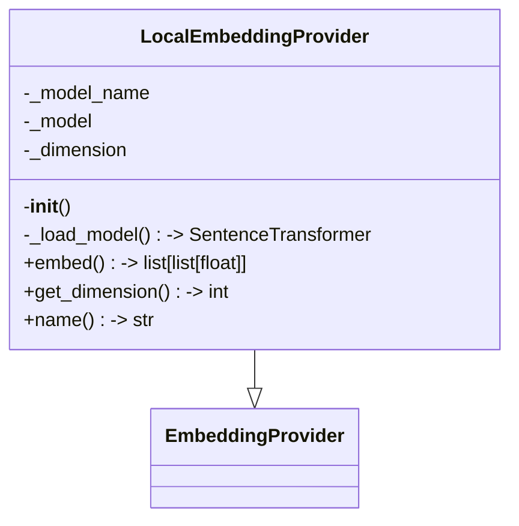
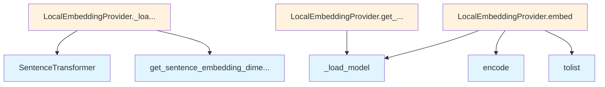

# Local Embedding Provider

## File Overview

This file implements a local embedding provider that uses the SentenceTransformer library to generate embeddings locally without requiring external API calls. It extends the base [EmbeddingProvider](../base.md) interface to provide local embedding capabilities.

## Classes

### LocalEmbeddingProvider

The LocalEmbeddingProvider class provides local text embedding functionality using sentence transformers. This class inherits from the base [EmbeddingProvider](../base.md) class and implements embedding generation that runs entirely on the local machine.

**Key Features:**
- Local embedding generation using SentenceTransformer models
- No external API dependencies
- Extends the base [EmbeddingProvider](../base.md) interface

## Dependencies

The file imports the following components:

- `SentenceTransformer` from the sentence-transformers library for local embedding model functionality
- [`EmbeddingProvider`](../base.md) from the local_deepwiki.providers.base module as the base class

## Related Components

This file works with:
- **[EmbeddingProvider](../base.md)**: The base class that defines the embedding provider interface
- **SentenceTransformer**: The underlying model library used for generating embeddings locally

## Usage Context

The LocalEmbeddingProvider serves as a local alternative to cloud-based embedding services, allowing users to generate embeddings without network dependencies or API costs. It integrates with the broader local_deepwiki system as one of the available embedding provider options.

## API Reference

### class `LocalEmbeddingProvider`

**Inherits from:** [`EmbeddingProvider`](../base.md)

Embedding provider using local sentence-transformers models.

**Methods:**

#### `__init__`

```python
def __init__(model_name: str = "all-MiniLM-L6-v2")
```

Initialize the local embedding provider.


| [Parameter](../../generators/api_docs.md) | Type | Default | Description |
|-----------|------|---------|-------------|
| `model_name` | `str` | `"all-MiniLM-L6-v2"` | Name of the sentence-transformers model to use. |

#### `embed`

```python
async def embed(texts: list[str]) -> list[list[float]]
```

Generate embeddings for a list of texts.


| [Parameter](../../generators/api_docs.md) | Type | Default | Description |
|-----------|------|---------|-------------|
| `texts` | `list[str]` | - | List of text strings to embed. |

#### `get_dimension`

```python
def get_dimension() -> int
```

Get the embedding dimension.

#### `name`

```python
def name() -> str
```

Get the provider name.


## Class Diagram



## Call Graph



## Relevant Source Files

- `src/local_deepwiki/providers/embeddings/local.py:8-55`
