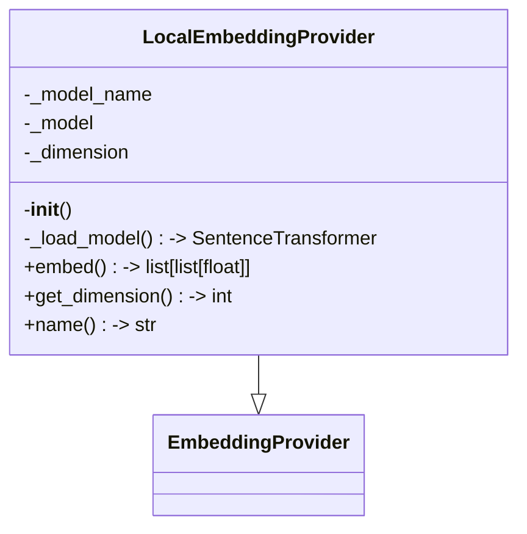
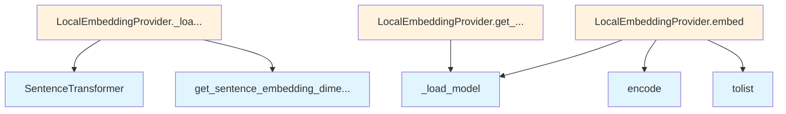

# LocalEmbeddingProvider Module

## File Overview

This module provides a local embedding implementation using the SentenceTransformer library. It contains the LocalEmbeddingProvider class that extends the base [EmbeddingProvider](../base.md) interface to generate text embeddings locally without requiring external API calls.

## Classes

### LocalEmbeddingProvider

The LocalEmbeddingProvider class implements local text embedding functionality using SentenceTransformer models. This class extends the base [EmbeddingProvider](../base.md) interface to provide a local alternative to cloud-based embedding services.

**Note**: The specific methods and implementation details of this class are not visible in the provided code chunks, but it inherits from the [EmbeddingProvider](../base.md) base class.

## Dependencies

This module relies on the following dependencies:

- `sentence_transformers`: Used for loading and running transformer models locally to generate embeddings
- `local_deepwiki.providers.base`: Provides the [EmbeddingProvider](../base.md) base class that this implementation extends

## Related Components

- **[EmbeddingProvider](../base.md)**: The base class that LocalEmbeddingProvider extends, defining the interface for embedding providers
- **SentenceTransformer**: The underlying library used to generate embeddings from text inputs

## Usage Context

This module is part of the local_deepwiki embedding providers system, offering a local alternative to remote embedding services. It allows users to generate text embeddings without depending on external APIs, using pre-trained transformer models that run locally.

## API Reference

### class `LocalEmbeddingProvider`

**Inherits from:** [`EmbeddingProvider`](../base.md)

Embedding provider using local sentence-transformers models.

**Methods:**

#### `__init__`

```python
def __init__(model_name: str = "all-MiniLM-L6-v2")
```

Initialize the local embedding provider.


| [Parameter](../../generators/api_docs.md) | Type | Default | Description |
|-----------|------|---------|-------------|
| `model_name` | `str` | `"all-MiniLM-L6-v2"` | Name of the sentence-transformers model to use. |

#### `embed`

```python
async def embed(texts: list[str]) -> list[list[float]]
```

Generate embeddings for a list of texts.


| [Parameter](../../generators/api_docs.md) | Type | Default | Description |
|-----------|------|---------|-------------|
| `texts` | `list[str]` | - | List of text strings to embed. |

#### `get_dimension`

```python
def get_dimension() -> int
```

Get the embedding dimension.

#### `name`

```python
def name() -> str
```

Get the provider name.


## Class Diagram



## Call Graph



## Relevant Source Files

- `src/local_deepwiki/providers/embeddings/local.py:8-55`
