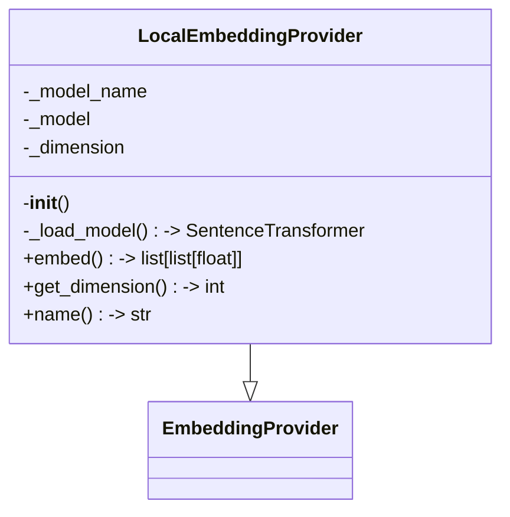
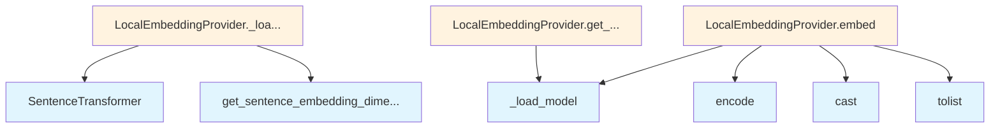

# LocalEmbeddingProvider

## File Overview

This file implements a local embedding provider that uses sentence-transformers models to generate embeddings. It provides a concrete implementation of the [EmbeddingProvider](../base.md) interface for running models locally without requiring external API calls.

## Classes

### LocalEmbeddingProvider

The LocalEmbeddingProvider class extends [EmbeddingProvider](../base.md) to provide local text embedding capabilities using sentence-transformers models.

**Key Features:**
- Lazy loading of sentence-transformer models
- Configurable model selection
- Local processing without external dependencies

**Attributes:**
- `_model_name`: The name of the sentence-transformers model to use
- `_model`: The loaded SentenceTransformer model instance (lazy-loaded)
- `_dimension`: The embedding dimension of the loaded model

## Methods

### `__init__(model_name: str = "all-MiniLM-L6-v2")`

Initializes the local embedding provider with a specified model.

**Parameters:**
- `model_name` (str, optional): Name of the sentence-transformers model to use. Defaults to "all-MiniLM-L6-v2"

**Example:**
```python
# Use default model
provider = LocalEmbeddingProvider()

# Use custom model
provider = LocalEmbeddingProvider(model_name="all-mpnet-base-v2")
```

### `_load_model() -> SentenceTransformer`

Private method that implements lazy loading of the sentence-transformer model.

**Returns:**
- `SentenceTransformer`: The loaded model instance

**Note:** This method ensures the model is only loaded when first needed, improving initialization performance.

## Usage Examples

### Basic Usage

```python
# Initialize with default model
embedding_provider = LocalEmbeddingProvider()

# Initialize with specific model
embedding_provider = LocalEmbeddingProvider(model_name="all-mpnet-base-v2")
```

### Custom Model Selection

```python
# Use a different sentence-transformers model
provider = LocalEmbeddingProvider(model_name="paraphrase-MiniLM-L6-v2")
```

## Related Components

This class works with:
- **[EmbeddingProvider](../base.md)**: The base class that this implementation extends
- **SentenceTransformer**: The underlying model class from the sentence-transformers library used for generating embeddings

## API Reference

### class `LocalEmbeddingProvider`

**Inherits from:** [`EmbeddingProvider`](../base.md)

Embedding provider using local sentence-transformers models.

**Methods:**


<details>
<summary>View Source (lines 10-57) | <a href="https://github.com/UrbanDiver/local-deepwiki-mcp/blob/[main](../../export/pdf.md)/src/local_deepwiki/providers/embeddings/local.py#L10-L57">GitHub</a></summary>

```python
class LocalEmbeddingProvider(EmbeddingProvider):
    """Embedding provider using local sentence-transformers models."""

    def __init__(self, model_name: str = "all-MiniLM-L6-v2"):
        """Initialize the local embedding provider.

        Args:
            model_name: Name of the sentence-transformers model to use.
        """
        self._model_name = model_name
        self._model: SentenceTransformer | None = None
        self._dimension: int | None = None

    def _load_model(self) -> SentenceTransformer:
        """Lazy load the model."""
        if self._model is None:
            self._model = SentenceTransformer(self._model_name)
            self._dimension = self._model.get_sentence_embedding_dimension()
        return self._model

    async def embed(self, texts: list[str]) -> list[list[float]]:
        """Generate embeddings for a list of texts.

        Args:
            texts: List of text strings to embed.

        Returns:
            List of embedding vectors.
        """
        model = self._load_model()
        # sentence-transformers is synchronous, but we keep async interface for consistency
        embeddings = model.encode(texts, convert_to_numpy=True)
        return cast(list[list[float]], embeddings.tolist())

    def get_dimension(self) -> int:
        """Get the embedding dimension.

        Returns:
            The dimension of the embedding vectors.
        """
        if self._dimension is None:
            self._load_model()
        return self._dimension  # type: ignore

    @property
    def name(self) -> str:
        """Get the provider name."""
        return f"local:{self._model_name}"
```

</details>

#### `__init__`

```python
def __init__(model_name: str = "all-MiniLM-L6-v2")
```

Initialize the local embedding provider.


| [Parameter](../../generators/api_docs.md) | Type | Default | Description |
|-----------|------|---------|-------------|
| `model_name` | `str` | `"all-MiniLM-L6-v2"` | Name of the sentence-transformers model to use. |


<details>
<summary>View Source (lines 10-57) | <a href="https://github.com/UrbanDiver/local-deepwiki-mcp/blob/[main](../../export/pdf.md)/src/local_deepwiki/providers/embeddings/local.py#L10-L57">GitHub</a></summary>

```python
class LocalEmbeddingProvider(EmbeddingProvider):
    """Embedding provider using local sentence-transformers models."""

    def __init__(self, model_name: str = "all-MiniLM-L6-v2"):
        """Initialize the local embedding provider.

        Args:
            model_name: Name of the sentence-transformers model to use.
        """
        self._model_name = model_name
        self._model: SentenceTransformer | None = None
        self._dimension: int | None = None

    def _load_model(self) -> SentenceTransformer:
        """Lazy load the model."""
        if self._model is None:
            self._model = SentenceTransformer(self._model_name)
            self._dimension = self._model.get_sentence_embedding_dimension()
        return self._model

    async def embed(self, texts: list[str]) -> list[list[float]]:
        """Generate embeddings for a list of texts.

        Args:
            texts: List of text strings to embed.

        Returns:
            List of embedding vectors.
        """
        model = self._load_model()
        # sentence-transformers is synchronous, but we keep async interface for consistency
        embeddings = model.encode(texts, convert_to_numpy=True)
        return cast(list[list[float]], embeddings.tolist())

    def get_dimension(self) -> int:
        """Get the embedding dimension.

        Returns:
            The dimension of the embedding vectors.
        """
        if self._dimension is None:
            self._load_model()
        return self._dimension  # type: ignore

    @property
    def name(self) -> str:
        """Get the provider name."""
        return f"local:{self._model_name}"
```

</details>

#### `embed`

```python
async def embed(texts: list[str]) -> list[list[float]]
```

Generate embeddings for a list of texts.


| [Parameter](../../generators/api_docs.md) | Type | Default | Description |
|-----------|------|---------|-------------|
| `texts` | `list[str]` | - | List of text strings to embed. |


<details>
<summary>View Source (lines 10-57) | <a href="https://github.com/UrbanDiver/local-deepwiki-mcp/blob/[main](../../export/pdf.md)/src/local_deepwiki/providers/embeddings/local.py#L10-L57">GitHub</a></summary>

```python
class LocalEmbeddingProvider(EmbeddingProvider):
    """Embedding provider using local sentence-transformers models."""

    def __init__(self, model_name: str = "all-MiniLM-L6-v2"):
        """Initialize the local embedding provider.

        Args:
            model_name: Name of the sentence-transformers model to use.
        """
        self._model_name = model_name
        self._model: SentenceTransformer | None = None
        self._dimension: int | None = None

    def _load_model(self) -> SentenceTransformer:
        """Lazy load the model."""
        if self._model is None:
            self._model = SentenceTransformer(self._model_name)
            self._dimension = self._model.get_sentence_embedding_dimension()
        return self._model

    async def embed(self, texts: list[str]) -> list[list[float]]:
        """Generate embeddings for a list of texts.

        Args:
            texts: List of text strings to embed.

        Returns:
            List of embedding vectors.
        """
        model = self._load_model()
        # sentence-transformers is synchronous, but we keep async interface for consistency
        embeddings = model.encode(texts, convert_to_numpy=True)
        return cast(list[list[float]], embeddings.tolist())

    def get_dimension(self) -> int:
        """Get the embedding dimension.

        Returns:
            The dimension of the embedding vectors.
        """
        if self._dimension is None:
            self._load_model()
        return self._dimension  # type: ignore

    @property
    def name(self) -> str:
        """Get the provider name."""
        return f"local:{self._model_name}"
```

</details>

#### `get_dimension`

```python
def get_dimension() -> int
```

Get the embedding dimension.


<details>
<summary>View Source (lines 10-57) | <a href="https://github.com/UrbanDiver/local-deepwiki-mcp/blob/[main](../../export/pdf.md)/src/local_deepwiki/providers/embeddings/local.py#L10-L57">GitHub</a></summary>

```python
class LocalEmbeddingProvider(EmbeddingProvider):
    """Embedding provider using local sentence-transformers models."""

    def __init__(self, model_name: str = "all-MiniLM-L6-v2"):
        """Initialize the local embedding provider.

        Args:
            model_name: Name of the sentence-transformers model to use.
        """
        self._model_name = model_name
        self._model: SentenceTransformer | None = None
        self._dimension: int | None = None

    def _load_model(self) -> SentenceTransformer:
        """Lazy load the model."""
        if self._model is None:
            self._model = SentenceTransformer(self._model_name)
            self._dimension = self._model.get_sentence_embedding_dimension()
        return self._model

    async def embed(self, texts: list[str]) -> list[list[float]]:
        """Generate embeddings for a list of texts.

        Args:
            texts: List of text strings to embed.

        Returns:
            List of embedding vectors.
        """
        model = self._load_model()
        # sentence-transformers is synchronous, but we keep async interface for consistency
        embeddings = model.encode(texts, convert_to_numpy=True)
        return cast(list[list[float]], embeddings.tolist())

    def get_dimension(self) -> int:
        """Get the embedding dimension.

        Returns:
            The dimension of the embedding vectors.
        """
        if self._dimension is None:
            self._load_model()
        return self._dimension  # type: ignore

    @property
    def name(self) -> str:
        """Get the provider name."""
        return f"local:{self._model_name}"
```

</details>

#### `name`

```python
def name() -> str
```

Get the provider name.


<details>
<summary>View Source (lines 10-57) | <a href="https://github.com/UrbanDiver/local-deepwiki-mcp/blob/[main](../../export/pdf.md)/src/local_deepwiki/providers/embeddings/local.py#L10-L57">GitHub</a></summary>

```python
class LocalEmbeddingProvider(EmbeddingProvider):
    """Embedding provider using local sentence-transformers models."""

    def __init__(self, model_name: str = "all-MiniLM-L6-v2"):
        """Initialize the local embedding provider.

        Args:
            model_name: Name of the sentence-transformers model to use.
        """
        self._model_name = model_name
        self._model: SentenceTransformer | None = None
        self._dimension: int | None = None

    def _load_model(self) -> SentenceTransformer:
        """Lazy load the model."""
        if self._model is None:
            self._model = SentenceTransformer(self._model_name)
            self._dimension = self._model.get_sentence_embedding_dimension()
        return self._model

    async def embed(self, texts: list[str]) -> list[list[float]]:
        """Generate embeddings for a list of texts.

        Args:
            texts: List of text strings to embed.

        Returns:
            List of embedding vectors.
        """
        model = self._load_model()
        # sentence-transformers is synchronous, but we keep async interface for consistency
        embeddings = model.encode(texts, convert_to_numpy=True)
        return cast(list[list[float]], embeddings.tolist())

    def get_dimension(self) -> int:
        """Get the embedding dimension.

        Returns:
            The dimension of the embedding vectors.
        """
        if self._dimension is None:
            self._load_model()
        return self._dimension  # type: ignore

    @property
    def name(self) -> str:
        """Get the provider name."""
        return f"local:{self._model_name}"
```

</details>

## Class Diagram



## Call Graph



## Used By

Functions and methods in this file and their callers:

- **`SentenceTransformer`**: called by `LocalEmbeddingProvider._load_model`
- **`_load_model`**: called by `LocalEmbeddingProvider.embed`, `LocalEmbeddingProvider.get_dimension`
- **`cast`**: called by `LocalEmbeddingProvider.embed`
- **`encode`**: called by `LocalEmbeddingProvider.embed`
- **`get_sentence_embedding_dimension`**: called by `LocalEmbeddingProvider._load_model`
- **`tolist`**: called by `LocalEmbeddingProvider.embed`

## Usage Examples

*Examples extracted from test files*

### Test provider initialization

From `test_local_embedding_provider.py::TestLocalEmbeddingProvider::test_initialization`:

```python
from local_deepwiki.providers.embeddings.local import LocalEmbeddingProvider

provider = LocalEmbeddingProvider(model_name="all-MiniLM-L6-v2")
assert provider.name == "local:all-MiniLM-L6-v2"
assert provider._model is None  # Lazy loaded
```

### Test provider initialization

From `test_local_embedding_provider.py::TestLocalEmbeddingProvider::test_initialization`:

```python
from local_deepwiki.providers.embeddings.local import LocalEmbeddingProvider

provider = LocalEmbeddingProvider(model_name="all-MiniLM-L6-v2")
assert provider.name == "local:all-MiniLM-L6-v2"
assert provider._model is None  # Lazy loaded
```

### Test provider initialization with default model

From `test_local_embedding_provider.py::TestLocalEmbeddingProvider::test_initialization_default_model`:

```python
from local_deepwiki.providers.embeddings.local import LocalEmbeddingProvider

provider = LocalEmbeddingProvider()
assert provider.name == "local:all-MiniLM-L6-v2"
```

### Test provider initialization with default model

From `test_local_embedding_provider.py::TestLocalEmbeddingProvider::test_initialization_default_model`:

```python
from local_deepwiki.providers.embeddings.local import LocalEmbeddingProvider

provider = LocalEmbeddingProvider()
assert provider.name == "local:all-MiniLM-L6-v2"
```


## Last Modified

| Entity | Type | Author | Date | Commit |
|--------|------|--------|------|--------|
| `LocalEmbeddingProvider` | class | Brian Breidenbach | today | `0d91a70` Apply Python best practices... |

## Relevant Source Files

- `src/local_deepwiki/providers/embeddings/local.py:10-57`

## See Also

- [vectorstore](../../core/vectorstore.md) - shares 2 dependencies

## See Also

- [vectorstore](../../core/vectorstore.md) - shares 2 dependencies
