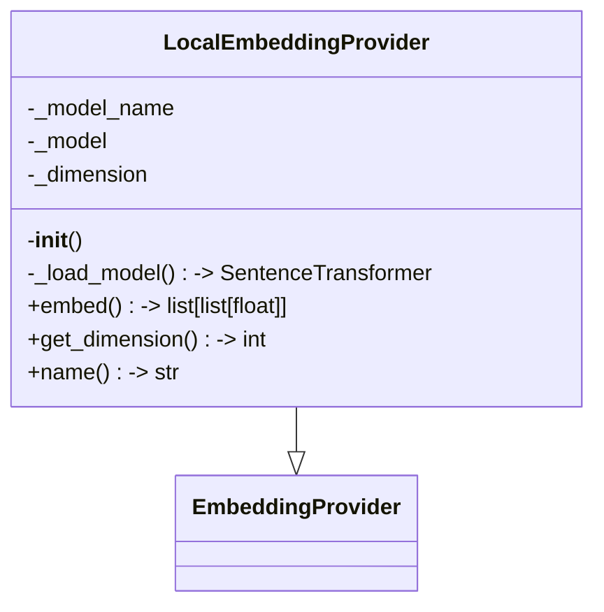
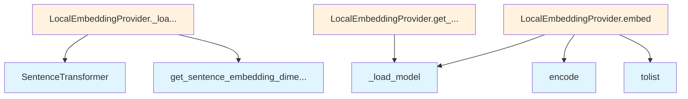

# Local Embedding Provider

## File Overview

This file implements a local embedding provider for the deepwiki system. It provides a LocalEmbeddingProvider class that uses the SentenceTransformer library to generate embeddings locally, extending the base [EmbeddingProvider](../base.md) interface.

## Classes

### LocalEmbeddingProvider

The LocalEmbeddingProvider class provides local text embedding capabilities using sentence transformers. It inherits from the [EmbeddingProvider](../base.md) base class to implement the standard embedding interface.

**Note**: The complete implementation details of this class are not visible in the provided code chunk, showing only the class definition within the module structure.

## Dependencies

The module relies on the following components:

- `sentence_transformers.SentenceTransformer` - For generating text embeddings using transformer models
- [`local_deepwiki.providers.base.EmbeddingProvider`](../base.md) - Base class that defines the embedding provider interface

## Related Components

This file works with:

- **[EmbeddingProvider](../base.md)**: The base class that defines the standard interface for embedding providers
- **SentenceTransformer**: The underlying transformer model used for generating embeddings locally

## Usage Context

This local embedding provider allows the deepwiki system to generate text embeddings without requiring external API calls, providing a self-contained solution for embedding generation using pre-trained sentence transformer models.

## API Reference

### class `LocalEmbeddingProvider`

**Inherits from:** [`EmbeddingProvider`](../base.md)

Embedding provider using local sentence-transformers models.

**Methods:**

#### `__init__`

```python
def __init__(model_name: str = "all-MiniLM-L6-v2")
```

Initialize the local embedding provider.


| [Parameter](../../generators/api_docs.md) | Type | Default | Description |
|-----------|------|---------|-------------|
| `model_name` | `str` | `"all-MiniLM-L6-v2"` | Name of the sentence-transformers model to use. |

#### `embed`

```python
async def embed(texts: list[str]) -> list[list[float]]
```

Generate embeddings for a list of texts.


| [Parameter](../../generators/api_docs.md) | Type | Default | Description |
|-----------|------|---------|-------------|
| `texts` | `list[str]` | - | List of text strings to embed. |

#### `get_dimension`

```python
def get_dimension() -> int
```

Get the embedding dimension.

#### `name`

```python
def name() -> str
```

Get the provider name.


## Class Diagram



## Call Graph



## Relevant Source Files

- `src/local_deepwiki/providers/embeddings/local.py:8-55`
