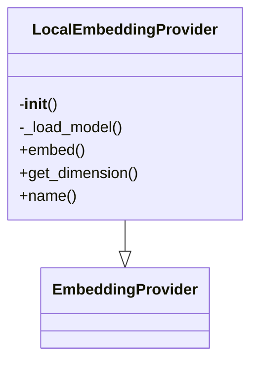

# Local Embedding Provider

## File Overview

This file implements a local embedding provider using the sentence-transformers library. It provides an implementation of the `EmbeddingProvider` base class that generates dense vector embeddings for text using pre-trained sentence transformers models.

## Classes

### LocalEmbeddingProvider

The `LocalEmbeddingProvider` class implements the `EmbeddingProvider` interface to generate text embeddings using local sentence transformer models.

**Key Methods:**

- `__init__(self, model_name: str = "all-MiniLM-L6-v2")`: Initializes the provider with a specified model name
- `get_embedding(self, text: str) -> list[float]`: Generates a vector embedding for the given text
- `get_embeddings(self, texts: list[str]) -> list[list[float]]`: Generates vector embeddings for multiple texts

**Usage:**
```python
from local_deepwiki.providers.embeddings.local import LocalEmbeddingProvider

# Initialize provider
provider = LocalEmbeddingProvider(model_name="all-MiniLM-L6-v2")

# Generate single embedding
embedding = provider.get_embedding("Hello world")

# Generate multiple embeddings
embeddings = provider.get_embeddings(["Hello world", "How are you?"])
```

## Functions

### `__init__(self, model_name: str = "all-MiniLM-L6-v2")`

Initializes the LocalEmbeddingProvider with a specified sentence transformer model.

**Parameters:**
- `model_name` (str): Name of the sentence transformer model to use. Defaults to "all-MiniLM-L6-v2"

**Returns:**
- None

### `get_embedding(self, text: str) -> list[float]`

Generates a vector embedding for a single text string.

**Parameters:**
- `text` (str): The text to embed

**Returns:**
- `list[float]`: The embedding vector as a list of floating point numbers

### `get_embeddings(self, texts: list[str]) -> list[list[float]]`

Generates vector embeddings for multiple text strings.

**Parameters:**
- `texts` (list[str]): List of texts to embed

**Returns:**
- `list[list[float]]`: List of embedding vectors, one for each input text

## Usage Examples

```python
# Basic usage
from local_deepwiki.providers.embeddings.local import LocalEmbeddingProvider

# Create provider with default model
provider = LocalEmbeddingProvider()

# Generate single embedding
text = "The quick brown fox jumps over the lazy dog"
embedding = provider.get_embedding(text)
print(f"Embedding shape: {len(embedding)}")

# Generate multiple embeddings
texts = [
    "Hello world",
    "How are you?",
    "I am fine, thank you"
]
embeddings = provider.get_embeddings(texts)
print(f"Generated {len(embeddings)} embeddings")
```

## Dependencies

This file depends on:
- `sentence_transformers.SentenceTransformer`: For generating sentence embeddings
- `local_deepwiki.providers.base.EmbeddingProvider`: Base class interface for embedding providers

The package requires the `sentence-transformers` library to be installed:
```bash
pip install sentence-transformers
```

## Class Diagram



## See Also

- [base](../base.md) - dependency
