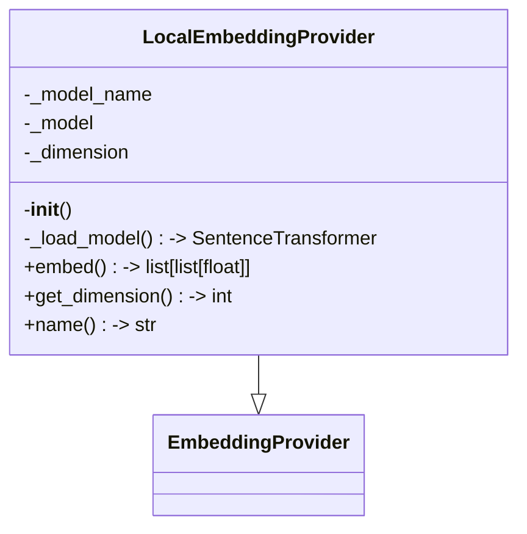
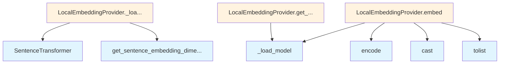

# LocalEmbeddingProvider

## File Overview

This file implements a local embedding provider that uses sentence-transformers models to generate text embeddings. The provider supports lazy loading of models and provides a local alternative to cloud-based embedding services.

## Classes

### LocalEmbeddingProvider

The LocalEmbeddingProvider class extends [EmbeddingProvider](../base.md) to provide text embedding functionality using locally-hosted sentence-transformers models.

**Purpose**: Generate text embeddings using pre-trained sentence-transformer models that run locally without requiring external API calls.

**Key Features**:
- Lazy loading of models for memory efficiency
- Configurable model selection
- Default model: "all-MiniLM-L6-v2"

#### Constructor

```python
def __init__(self, model_name: str = "all-MiniLM-L6-v2"):
```

**Parameters**:
- `model_name` (str, optional): Name of the sentence-transformers model to use. Defaults to "all-MiniLM-L6-v2"

**Attributes**:
- `_model_name`: Stores the configured model name
- `_model`: Holds the loaded SentenceTransformer instance (initially None)
- `_dimension`: Stores the embedding dimension (initially None)

#### Methods

##### _load_model

```python
def _load_model(self) -> SentenceTransformer:
```

**Purpose**: Implements lazy loading for the sentence-transformer model.

**Returns**: SentenceTransformer instance

**Behavior**: Only loads the model when first accessed, storing it in `_model` for subsequent use.

## Usage Examples

### Basic Initialization

```python
# Use default model
provider = LocalEmbeddingProvider()

# Use custom model
provider = LocalEmbeddingProvider(model_name="paraphrase-MiniLM-L6-v2")
```

### Model Loading

```python
# Model is loaded automatically when needed
provider = LocalEmbeddingProvider()
model = provider._load_model()  # Loads and caches the model
```

## Related Components

- **[EmbeddingProvider](../base.md)**: Base class that LocalEmbeddingProvider extends
- **SentenceTransformer**: External library class used for the actual embedding generation

## Dependencies

Based on the code shown, this module requires:
- `sentence_transformers.SentenceTransformer` for model functionality
- A base [`EmbeddingProvider`](../base.md) class for inheritance

## API Reference

### class `LocalEmbeddingProvider`

**Inherits from:** [`EmbeddingProvider`](../base.md)

Embedding provider using local sentence-transformers models.

**Methods:**


<details>
<summary>View Source (lines 10-57) | <a href="https://github.com/UrbanDiver/local-deepwiki-mcp/blob/feature/wiki-enhancements-round2/src/local_deepwiki/providers/embeddings/local.py#L10-L57">GitHub</a></summary>

```python
class LocalEmbeddingProvider(EmbeddingProvider):
    """Embedding provider using local sentence-transformers models."""

    def __init__(self, model_name: str = "all-MiniLM-L6-v2"):
        """Initialize the local embedding provider.

        Args:
            model_name: Name of the sentence-transformers model to use.
        """
        self._model_name = model_name
        self._model: SentenceTransformer | None = None
        self._dimension: int | None = None

    def _load_model(self) -> SentenceTransformer:
        """Lazy load the model."""
        if self._model is None:
            self._model = SentenceTransformer(self._model_name)
            self._dimension = self._model.get_sentence_embedding_dimension()
        return self._model

    async def embed(self, texts: list[str]) -> list[list[float]]:
        """Generate embeddings for a list of texts.

        Args:
            texts: List of text strings to embed.

        Returns:
            List of embedding vectors.
        """
        model = self._load_model()
        # sentence-transformers is synchronous, but we keep async interface for consistency
        embeddings = model.encode(texts, convert_to_numpy=True)
        return cast(list[list[float]], embeddings.tolist())

    def get_dimension(self) -> int:
        """Get the embedding dimension.

        Returns:
            The dimension of the embedding vectors.
        """
        if self._dimension is None:
            self._load_model()
        return self._dimension  # type: ignore

    @property
    def name(self) -> str:
        """Get the provider name."""
        return f"local:{self._model_name}"
```

</details>

#### `__init__`

```python
def __init__(model_name: str = "all-MiniLM-L6-v2")
```

Initialize the local embedding provider.


| [Parameter](../../generators/api_docs.md) | Type | Default | Description |
|-----------|------|---------|-------------|
| `model_name` | `str` | `"all-MiniLM-L6-v2"` | Name of the sentence-transformers model to use. |


<details>
<summary>View Source (lines 10-57) | <a href="https://github.com/UrbanDiver/local-deepwiki-mcp/blob/feature/wiki-enhancements-round2/src/local_deepwiki/providers/embeddings/local.py#L10-L57">GitHub</a></summary>

```python
class LocalEmbeddingProvider(EmbeddingProvider):
    """Embedding provider using local sentence-transformers models."""

    def __init__(self, model_name: str = "all-MiniLM-L6-v2"):
        """Initialize the local embedding provider.

        Args:
            model_name: Name of the sentence-transformers model to use.
        """
        self._model_name = model_name
        self._model: SentenceTransformer | None = None
        self._dimension: int | None = None

    def _load_model(self) -> SentenceTransformer:
        """Lazy load the model."""
        if self._model is None:
            self._model = SentenceTransformer(self._model_name)
            self._dimension = self._model.get_sentence_embedding_dimension()
        return self._model

    async def embed(self, texts: list[str]) -> list[list[float]]:
        """Generate embeddings for a list of texts.

        Args:
            texts: List of text strings to embed.

        Returns:
            List of embedding vectors.
        """
        model = self._load_model()
        # sentence-transformers is synchronous, but we keep async interface for consistency
        embeddings = model.encode(texts, convert_to_numpy=True)
        return cast(list[list[float]], embeddings.tolist())

    def get_dimension(self) -> int:
        """Get the embedding dimension.

        Returns:
            The dimension of the embedding vectors.
        """
        if self._dimension is None:
            self._load_model()
        return self._dimension  # type: ignore

    @property
    def name(self) -> str:
        """Get the provider name."""
        return f"local:{self._model_name}"
```

</details>

#### `embed`

```python
async def embed(texts: list[str]) -> list[list[float]]
```

Generate embeddings for a list of texts.


| [Parameter](../../generators/api_docs.md) | Type | Default | Description |
|-----------|------|---------|-------------|
| `texts` | `list[str]` | - | List of text strings to embed. |


<details>
<summary>View Source (lines 10-57) | <a href="https://github.com/UrbanDiver/local-deepwiki-mcp/blob/feature/wiki-enhancements-round2/src/local_deepwiki/providers/embeddings/local.py#L10-L57">GitHub</a></summary>

```python
class LocalEmbeddingProvider(EmbeddingProvider):
    """Embedding provider using local sentence-transformers models."""

    def __init__(self, model_name: str = "all-MiniLM-L6-v2"):
        """Initialize the local embedding provider.

        Args:
            model_name: Name of the sentence-transformers model to use.
        """
        self._model_name = model_name
        self._model: SentenceTransformer | None = None
        self._dimension: int | None = None

    def _load_model(self) -> SentenceTransformer:
        """Lazy load the model."""
        if self._model is None:
            self._model = SentenceTransformer(self._model_name)
            self._dimension = self._model.get_sentence_embedding_dimension()
        return self._model

    async def embed(self, texts: list[str]) -> list[list[float]]:
        """Generate embeddings for a list of texts.

        Args:
            texts: List of text strings to embed.

        Returns:
            List of embedding vectors.
        """
        model = self._load_model()
        # sentence-transformers is synchronous, but we keep async interface for consistency
        embeddings = model.encode(texts, convert_to_numpy=True)
        return cast(list[list[float]], embeddings.tolist())

    def get_dimension(self) -> int:
        """Get the embedding dimension.

        Returns:
            The dimension of the embedding vectors.
        """
        if self._dimension is None:
            self._load_model()
        return self._dimension  # type: ignore

    @property
    def name(self) -> str:
        """Get the provider name."""
        return f"local:{self._model_name}"
```

</details>

#### `get_dimension`

```python
def get_dimension() -> int
```

Get the embedding dimension.


<details>
<summary>View Source (lines 10-57) | <a href="https://github.com/UrbanDiver/local-deepwiki-mcp/blob/feature/wiki-enhancements-round2/src/local_deepwiki/providers/embeddings/local.py#L10-L57">GitHub</a></summary>

```python
class LocalEmbeddingProvider(EmbeddingProvider):
    """Embedding provider using local sentence-transformers models."""

    def __init__(self, model_name: str = "all-MiniLM-L6-v2"):
        """Initialize the local embedding provider.

        Args:
            model_name: Name of the sentence-transformers model to use.
        """
        self._model_name = model_name
        self._model: SentenceTransformer | None = None
        self._dimension: int | None = None

    def _load_model(self) -> SentenceTransformer:
        """Lazy load the model."""
        if self._model is None:
            self._model = SentenceTransformer(self._model_name)
            self._dimension = self._model.get_sentence_embedding_dimension()
        return self._model

    async def embed(self, texts: list[str]) -> list[list[float]]:
        """Generate embeddings for a list of texts.

        Args:
            texts: List of text strings to embed.

        Returns:
            List of embedding vectors.
        """
        model = self._load_model()
        # sentence-transformers is synchronous, but we keep async interface for consistency
        embeddings = model.encode(texts, convert_to_numpy=True)
        return cast(list[list[float]], embeddings.tolist())

    def get_dimension(self) -> int:
        """Get the embedding dimension.

        Returns:
            The dimension of the embedding vectors.
        """
        if self._dimension is None:
            self._load_model()
        return self._dimension  # type: ignore

    @property
    def name(self) -> str:
        """Get the provider name."""
        return f"local:{self._model_name}"
```

</details>

#### `name`

```python
def name() -> str
```

Get the provider name.


<details>
<summary>View Source (lines 10-57) | <a href="https://github.com/UrbanDiver/local-deepwiki-mcp/blob/feature/wiki-enhancements-round2/src/local_deepwiki/providers/embeddings/local.py#L10-L57">GitHub</a></summary>

```python
class LocalEmbeddingProvider(EmbeddingProvider):
    """Embedding provider using local sentence-transformers models."""

    def __init__(self, model_name: str = "all-MiniLM-L6-v2"):
        """Initialize the local embedding provider.

        Args:
            model_name: Name of the sentence-transformers model to use.
        """
        self._model_name = model_name
        self._model: SentenceTransformer | None = None
        self._dimension: int | None = None

    def _load_model(self) -> SentenceTransformer:
        """Lazy load the model."""
        if self._model is None:
            self._model = SentenceTransformer(self._model_name)
            self._dimension = self._model.get_sentence_embedding_dimension()
        return self._model

    async def embed(self, texts: list[str]) -> list[list[float]]:
        """Generate embeddings for a list of texts.

        Args:
            texts: List of text strings to embed.

        Returns:
            List of embedding vectors.
        """
        model = self._load_model()
        # sentence-transformers is synchronous, but we keep async interface for consistency
        embeddings = model.encode(texts, convert_to_numpy=True)
        return cast(list[list[float]], embeddings.tolist())

    def get_dimension(self) -> int:
        """Get the embedding dimension.

        Returns:
            The dimension of the embedding vectors.
        """
        if self._dimension is None:
            self._load_model()
        return self._dimension  # type: ignore

    @property
    def name(self) -> str:
        """Get the provider name."""
        return f"local:{self._model_name}"
```

</details>

## Class Diagram



## Call Graph



## Used By

Functions and methods in this file and their callers:

- **`SentenceTransformer`**: called by `LocalEmbeddingProvider._load_model`
- **`_load_model`**: called by `LocalEmbeddingProvider.embed`, `LocalEmbeddingProvider.get_dimension`
- **`cast`**: called by `LocalEmbeddingProvider.embed`
- **`encode`**: called by `LocalEmbeddingProvider.embed`
- **`get_sentence_embedding_dimension`**: called by `LocalEmbeddingProvider._load_model`
- **`tolist`**: called by `LocalEmbeddingProvider.embed`

## Relevant Source Files

- `src/local_deepwiki/providers/embeddings/local.py:10-57`

## See Also

- [vectorstore](../../core/vectorstore.md) - shares 2 dependencies
