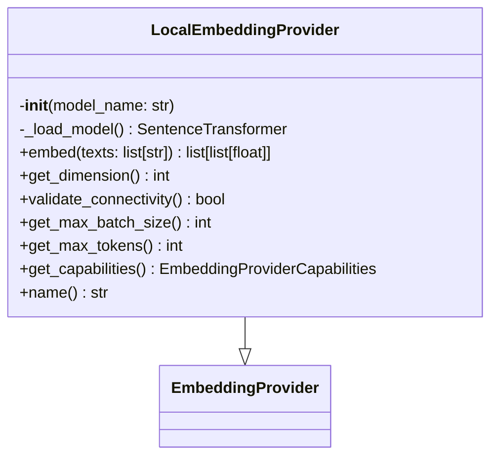

# File Overview

This file implements a local embedding provider using the `sentence-transformers` library. It defines the `LocalEmbeddingProvider` class that conforms to the [`EmbeddingProvider`](../base.md) interface, enabling local generation of text embeddings with support for asynchronous operations.

The provider is initialized with a model name, lazily loads the model, and supports embedding generation, dimension retrieval, connectivity validation, and capability reporting.

## Dependencies

This file imports:
- `asyncio`
- `cast` from `typing`
- `SentenceTransformer` from `sentence_transformers`
- [`EmbeddingProvider`](../base.md), [`EmbeddingProviderCapabilities`](../base.md), [`ProviderConfigurationError`](../base.md), [`ProviderConnectionError`](../base.md) from `local_deepwiki.providers.base`

## Integration

This file is part of the `local_deepwiki.providers.embeddings` module and integrates with:
- The base [`EmbeddingProvider`](../base.md) interface
- Other providers in the `local_deepwiki.providers` package
- Core functionality in `src/local_deepwiki/core/__init__.py`
- [Plugin](../../plugins/base.md) and generator systems in `src/local_deepwiki/generators/source_refs.py` and `src/local_deepwiki/plugins/base.py`

# Classes

## LocalEmbeddingProvider

The `LocalEmbeddingProvider` class provides local embedding generation using the `sentence-transformers` library. It supports asynchronous embedding generation, lazy model loading, and validation of connectivity.

### Methods

#### `__init__(self, model_name: str = "all-MiniLM-L6-v2")`

Initialize the local embedding provider.

**Parameters:**
- `model_name`: Name of the sentence-transformers model to use. Defaults to `"all-MiniLM-L6-v2"`.

#### `_load_model(self)`

Lazy load the model.

**Returns:**
- The loaded `SentenceTransformer` model.

**Raises:**
- [`ProviderConfigurationError`](../base.md): If the model cannot be loaded.

#### `embed(self, texts: list[str]) -> list[list[float]]`

Generate embeddings for a list of texts.

**Parameters:**
- `texts`: List of text strings to embed.

**Returns:**
- List of embedding vectors.

**Raises:**
- [`ProviderConfigurationError`](../base.md): If the model cannot be loaded.

#### `get_dimension(self) -> int`

Get the embedding dimension.

**Returns:**
- The dimension of the embedding vectors.

#### `validate_connectivity(self) -> bool`

Test that the model can be loaded and used.

**Returns:**
- True if the model is accessible and working.

**Raises:**
- [`ProviderConnectionError`](../base.md): If the model cannot be loaded.

#### `get_max_batch_size(self) -> int`

Return maximum number of texts that can be embedded in a single call.

**Returns:**
- Maximum batch size. Local models can handle large batches.

#### `get_max_tokens(self) -> int`

Return maximum tokens per text.

**Returns:**
- Maximum tokens per text for this model.

#### `get_capabilities(self) -> EmbeddingProviderCapabilities`

Return provider capabilities.

**Returns:**
- [`EmbeddingProviderCapabilities`](../base.md) with model-specific information.

#### `name(self) -> str`

Get the provider name.

**Returns:**
- A string identifier for the provider in the format `local:{model_name}`.

## API Reference

### class `LocalEmbeddingProvider`

**Inherits from:** [`EmbeddingProvider`](../base.md)

Embedding provider using local sentence-transformers models.

**Methods:**


<details>
<summary>View Source (lines 28-147) | <a href="https://github.com/UrbanDiver/local-deepwiki-mcp/blob/[main](../../export/pdf.md)/src/local_deepwiki/providers/embeddings/local.py#L28-L147">GitHub</a></summary>

```python
class LocalEmbeddingProvider(EmbeddingProvider):
    # Methods: __init__, _load_model, embed, get_dimension, validate_connectivity, get_max_batch_size, get_max_tokens, get_capabilities, name
```

</details>

#### `__init__`

```python
def __init__(model_name: str = "all-MiniLM-L6-v2")
```

Initialize the local embedding provider.


| [Parameter](../../generators/api_docs.md) | Type | Default | Description |
|-----------|------|---------|-------------|
| `model_name` | `str` | `"all-MiniLM-L6-v2"` | Name of the sentence-transformers model to use. |


<details>
<summary>View Source (lines 31-39) | <a href="https://github.com/UrbanDiver/local-deepwiki-mcp/blob/[main](../../export/pdf.md)/src/local_deepwiki/providers/embeddings/local.py#L31-L39">GitHub</a></summary>

```python
def __init__(self, model_name: str = "all-MiniLM-L6-v2"):
        """Initialize the local embedding provider.

        Args:
            model_name: Name of the sentence-transformers model to use.
        """
        self._model_name = model_name
        self._model: SentenceTransformer | None = None
        self._dimension: int | None = None
```

</details>

#### `embed`

```python
async def embed(texts: list[str]) -> list[list[float]]
```

Generate embeddings for a list of texts.


| [Parameter](../../generators/api_docs.md) | Type | Default | Description |
|-----------|------|---------|-------------|
| `texts` | `list[str]` | - | List of text strings to embed. |


<details>
<summary>View Source (lines 61-78) | <a href="https://github.com/UrbanDiver/local-deepwiki-mcp/blob/[main](../../export/pdf.md)/src/local_deepwiki/providers/embeddings/local.py#L61-L78">GitHub</a></summary>

```python
async def embed(self, texts: list[str]) -> list[list[float]]:
        """Generate embeddings for a list of texts.

        Args:
            texts: List of text strings to embed.

        Returns:
            List of embedding vectors.

        Raises:
            ProviderConfigurationError: If the model cannot be loaded.
        """
        model = self._load_model()
        # Run CPU-bound encoding in thread pool to avoid blocking async event loop
        embeddings = await asyncio.to_thread(
            model.encode, texts, convert_to_numpy=True
        )
        return cast(list[list[float]], embeddings.tolist())
```

</details>

#### `get_dimension`

```python
def get_dimension() -> int
```

Get the embedding dimension.


<details>
<summary>View Source (lines 80-88) | <a href="https://github.com/UrbanDiver/local-deepwiki-mcp/blob/[main](../../export/pdf.md)/src/local_deepwiki/providers/embeddings/local.py#L80-L88">GitHub</a></summary>

```python
def get_dimension(self) -> int:
        """Get the embedding dimension.

        Returns:
            The dimension of the embedding vectors.
        """
        if self._dimension is None:
            self._load_model()
        return self._dimension  # type: ignore
```

</details>

#### `validate_connectivity`

```python
async def validate_connectivity() -> bool
```

Test that the model can be loaded and used.


<details>
<summary>View Source (lines 90-111) | <a href="https://github.com/UrbanDiver/local-deepwiki-mcp/blob/[main](../../export/pdf.md)/src/local_deepwiki/providers/embeddings/local.py#L90-L111">GitHub</a></summary>

```python
async def validate_connectivity(self) -> bool:
        """Test that the model can be loaded and used.

        Returns:
            True if the model is accessible and working.

        Raises:
            ProviderConnectionError: If the model cannot be loaded.
        """
        try:
            self._load_model()
            # Try a test embedding
            await self.embed(["test"])
            return True
        except ProviderConfigurationError:
            raise
        except Exception as e:
            raise ProviderConnectionError(
                f"Failed to validate local embedding provider: {e}",
                provider_name=self.name,
                original_error=e,
            ) from e
```

</details>

#### `get_max_batch_size`

```python
def get_max_batch_size() -> int
```

Return maximum number of texts that can be embedded in a single call.


<details>
<summary>View Source (lines 113-119) | <a href="https://github.com/UrbanDiver/local-deepwiki-mcp/blob/[main](../../export/pdf.md)/src/local_deepwiki/providers/embeddings/local.py#L113-L119">GitHub</a></summary>

```python
def get_max_batch_size(self) -> int:
        """Return maximum number of texts that can be embedded in a single call.

        Returns:
            Maximum batch size. Local models can handle large batches.
        """
        return 1000  # Local models can handle larger batches
```

</details>

#### `get_max_tokens`

```python
def get_max_tokens() -> int
```

Return maximum tokens per text.


<details>
<summary>View Source (lines 121-128) | <a href="https://github.com/UrbanDiver/local-deepwiki-mcp/blob/[main](../../export/pdf.md)/src/local_deepwiki/providers/embeddings/local.py#L121-L128">GitHub</a></summary>

```python
def get_max_tokens(self) -> int:
        """Return maximum tokens per text.

        Returns:
            Maximum tokens per text for this model.
        """
        model_info = LOCAL_EMBEDDING_MODELS.get(self._model_name, {})
        return model_info.get("max_tokens", 512)
```

</details>

#### `get_capabilities`

```python
def get_capabilities() -> EmbeddingProviderCapabilities
```

Return provider capabilities.


<details>
<summary>View Source (lines 130-142) | <a href="https://github.com/UrbanDiver/local-deepwiki-mcp/blob/[main](../../export/pdf.md)/src/local_deepwiki/providers/embeddings/local.py#L130-L142">GitHub</a></summary>

```python
def get_capabilities(self) -> EmbeddingProviderCapabilities:
        """Return provider capabilities.

        Returns:
            EmbeddingProviderCapabilities with model-specific information.
        """
        return EmbeddingProviderCapabilities(
            max_batch_size=self.get_max_batch_size(),
            max_tokens_per_text=self.get_max_tokens(),
            dimension=self.get_dimension(),
            models=list(LOCAL_EMBEDDING_MODELS.keys()),
            supports_truncation=True,  # sentence-transformers handles truncation
        )
```

</details>

#### `name`

```python
def name() -> str
```

Get the provider name.


<details>
<summary>View Source (lines 145-147) | <a href="https://github.com/UrbanDiver/local-deepwiki-mcp/blob/[main](../../export/pdf.md)/src/local_deepwiki/providers/embeddings/local.py#L145-L147">GitHub</a></summary>

```python
def name(self) -> str:
        """Get the provider name."""
        return f"local:{self._model_name}"
```

</details>

## Class Diagram


```mermaid
classDiagram
    class LocalEmbeddingProvider {
        -__init__(model_name: str)
        -_load_model() SentenceTransformer
        +embed(texts: list[str]) list[list[float]]
        +get_dimension() int
        +validate_connectivity() bool
        +get_max_batch_size() int
        +get_max_tokens() int
        +get_capabilities() EmbeddingProviderCapabilities
        +name() str
    }
    LocalEmbeddingProvider --|> EmbeddingProvider
```

## Call Graph


```mermaid
flowchart TD
    N0[EmbeddingProviderCapabilities]
    N1[LocalEmbeddingProvider._loa...]
    N2[LocalEmbeddingProvider.embed]
    N3[LocalEmbeddingProvider.get_...]
    N4[LocalEmbeddingProvider.get_...]
    N5[LocalEmbeddingProvider.vali...]
    N6[ProviderConfigurationError]
    N7[ProviderConnectionError]
    N8[SentenceTransformer]
    N9[_load_model]
    N10[cast]
    N11[embed]
    N12[get_dimension]
    N13[get_max_batch_size]
    N14[get_max_tokens]
    N15[get_sentence_embedding_dime...]
    N16[to_thread]
    N17[tolist]
    N1 --> N8
    N1 --> N15
    N1 --> N6
    N2 --> N9
    N2 --> N16
    N2 --> N10
    N2 --> N17
    N4 --> N9
    N5 --> N9
    N5 --> N11
    N5 --> N7
    N3 --> N0
    N3 --> N13
    N3 --> N14
    N3 --> N12
    classDef func fill:#e1f5fe
    class N0,N6,N7,N8,N9,N10,N11,N12,N13,N14,N15,N16,N17 func
    classDef method fill:#fff3e0
    class N1,N2,N3,N4,N5 method
```

## Used By

Functions and methods in this file and their callers:

- **[`EmbeddingProviderCapabilities`](../base.md)**: called by `LocalEmbeddingProvider.get_capabilities`
- **[`ProviderConfigurationError`](../base.md)**: called by `LocalEmbeddingProvider._load_model`
- **[`ProviderConnectionError`](../base.md)**: called by `LocalEmbeddingProvider.validate_connectivity`
- **`SentenceTransformer`**: called by `LocalEmbeddingProvider._load_model`
- **`_load_model`**: called by `LocalEmbeddingProvider.embed`, `LocalEmbeddingProvider.get_dimension`, `LocalEmbeddingProvider.validate_connectivity`
- **`cast`**: called by `LocalEmbeddingProvider.embed`
- **`embed`**: called by `LocalEmbeddingProvider.validate_connectivity`
- **`get_dimension`**: called by `LocalEmbeddingProvider.get_capabilities`
- **`get_max_batch_size`**: called by `LocalEmbeddingProvider.get_capabilities`
- **`get_max_tokens`**: called by `LocalEmbeddingProvider.get_capabilities`
- **`get_sentence_embedding_dimension`**: called by `LocalEmbeddingProvider._load_model`
- **`to_thread`**: called by `LocalEmbeddingProvider.embed`
- **`tolist`**: called by `LocalEmbeddingProvider.embed`

## Usage Examples

*Examples extracted from test files*

### Test provider initialization

From `test_local_embedding_provider.py::TestLocalEmbeddingProvider::test_initialization`:

```python
from local_deepwiki.providers.embeddings.local import LocalEmbeddingProvider

provider = LocalEmbeddingProvider(model_name="all-MiniLM-L6-v2")
assert provider.name == "local:all-MiniLM-L6-v2"
assert provider._model is None  # Lazy loaded
```

### Test provider initialization

From `test_local_embedding_provider.py::TestLocalEmbeddingProvider::test_initialization`:

```python
from local_deepwiki.providers.embeddings.local import LocalEmbeddingProvider

provider = LocalEmbeddingProvider(model_name="all-MiniLM-L6-v2")
assert provider.name == "local:all-MiniLM-L6-v2"
assert provider._model is None  # Lazy loaded
```

### Test provider initialization

From `test_local_embedding_provider.py::TestLocalEmbeddingProvider::test_initialization`:

```python
from local_deepwiki.providers.embeddings.local import LocalEmbeddingProvider

provider = LocalEmbeddingProvider(model_name="all-MiniLM-L6-v2")
assert provider.name == "local:all-MiniLM-L6-v2"
assert provider._model is None  # Lazy loaded
```

### Test provider initialization

From `test_local_embedding_provider.py::TestLocalEmbeddingProvider::test_initialization`:

```python
from local_deepwiki.providers.embeddings.local import LocalEmbeddingProvider

provider = LocalEmbeddingProvider(model_name="all-MiniLM-L6-v2")
assert provider.name == "local:all-MiniLM-L6-v2"
assert provider._model is None  # Lazy loaded
```

### Test provider initialization with default model

From `test_local_embedding_provider.py::TestLocalEmbeddingProvider::test_initialization_default_model`:

```python
from local_deepwiki.providers.embeddings.local import LocalEmbeddingProvider

provider = LocalEmbeddingProvider()
assert provider.name == "local:all-MiniLM-L6-v2"
```


## Last Modified

| Entity | Type | Author | Date | Commit |
|--------|------|--------|------|--------|
| `LocalEmbeddingProvider` | class | Brian Breidenbach | 1 week ago | `a64166a` Add seven medium-priority e... |
| `_load_model` | method | Brian Breidenbach | 1 week ago | `a64166a` Add seven medium-priority e... |
| `embed` | method | Brian Breidenbach | 1 week ago | `a64166a` Add seven medium-priority e... |
| `validate_connectivity` | method | Brian Breidenbach | 1 week ago | `a64166a` Add seven medium-priority e... |
| `get_max_batch_size` | method | Brian Breidenbach | 1 week ago | `a64166a` Add seven medium-priority e... |
| `get_max_tokens` | method | Brian Breidenbach | 1 week ago | `a64166a` Add seven medium-priority e... |
| `get_capabilities` | method | Brian Breidenbach | 1 week ago | `a64166a` Add seven medium-priority e... |
| `__init__` | method | Brian Breidenbach | 3 weeks ago | `cdae76f` Initial commit: Local DeepW... |
| `get_dimension` | method | Brian Breidenbach | 3 weeks ago | `cdae76f` Initial commit: Local DeepW... |
| `name` | method | Brian Breidenbach | 3 weeks ago | `cdae76f` Initial commit: Local DeepW... |

## Additional Source Code

Source code for functions and methods not listed in the API Reference above.

#### `_load_model`

<details>
<summary>View Source (lines 41-59) | <a href="https://github.com/UrbanDiver/local-deepwiki-mcp/blob/[main](../../export/pdf.md)/src/local_deepwiki/providers/embeddings/local.py#L41-L59">GitHub</a></summary>

```python
def _load_model(self) -> SentenceTransformer:
        """Lazy load the model.

        Returns:
            The loaded SentenceTransformer model.

        Raises:
            ProviderConfigurationError: If the model cannot be loaded.
        """
        if self._model is None:
            try:
                self._model = SentenceTransformer(self._model_name)
                self._dimension = self._model.get_sentence_embedding_dimension()
            except Exception as e:
                raise ProviderConfigurationError(
                    f"Failed to load sentence-transformers model '{self._model_name}': {e}",
                    provider_name=self.name,
                ) from e
        return self._model
```

</details>

## Relevant Source Files

- `src/local_deepwiki/providers/embeddings/local.py:28-147`
