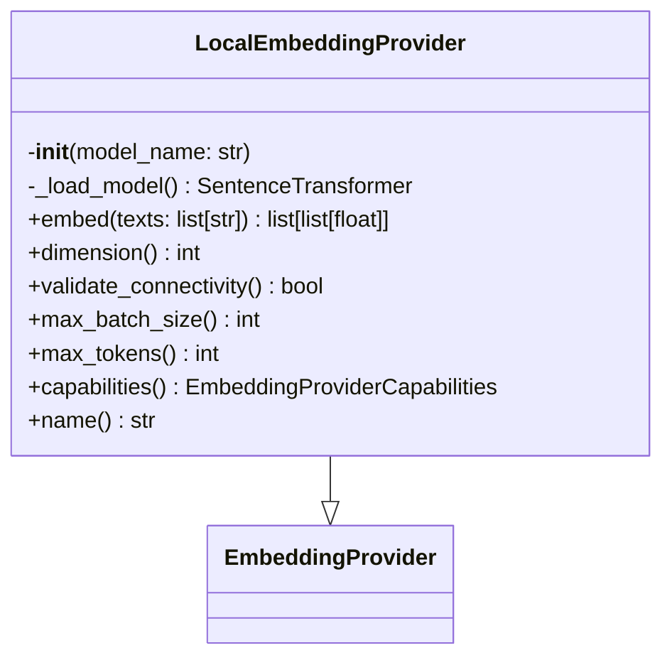

# File: `src/local_deepwiki/providers/embeddings/local.py`

## File Overview

This file implements the `LocalEmbeddingProvider` class, which provides embedding generation capabilities using local sentence-transformers models. It serves as a concrete implementation of the [`EmbeddingProvider`](../base.md) base class, enabling the application to generate embeddings without relying on external APIs.

The provider is designed to be lazy-loaded, meaning the model is only loaded when first needed. This approach optimizes resource usage and ensures that initialization failures are handled gracefully. The implementation supports asynchronous embedding generation and includes validation logic to confirm model accessibility.

## Key Concepts

### Local Model Usage
The `LocalEmbeddingProvider` uses the `sentence-transformers` library to load and utilize pre-trained transformer models for generating embeddings. This choice was made to provide high-quality, locally hosted embeddings without requiring network connectivity or external API access.

### Asynchronous Execution
The `embed` method is defined as `async` to allow non-blocking execution, particularly important for CPU-bound operations like model inference. It leverages `asyncio.to_thread` to offload the embedding computation to a thread pool, preventing blocking of the event loop.

### Lazy Model Loading
The `_load_model` method implements lazy loading of the `SentenceTransformer` model. This pattern avoids unnecessary resource consumption during initialization and delays potential errors until the model is actually required.

### Validation and Error Handling
The `validate_connectivity` method ensures that the model can be loaded and used for inference. It raises appropriate exceptions ([`ProviderConfigurationError`](../errors.md) or [`ProviderConnectionError`](../errors.md)) based on the type of failure encountered, allowing the application to handle errors gracefully.

## Integration

This file integrates with the broader codebase by extending the [`EmbeddingProvider`](../base.md) base class, which is used across the system for consistent provider behavior. It is imported and instantiated by components such as:

- The `LocalEmbeddingProvider` class is used by `test_local_embedding_provider` (likely in test files)
- It is consumed by vector store and embedding-related modules (`src/local_deepwiki/core/vectorstore/embedding.py`)
- It may be referenced by configuration validators (`src/local_deepwiki/cli/config_validator.py`) or CLI entry points (`src/local_deepwiki/cli/main.py`)

The `sentence_transformers` library is a key external dependency, enabling the core functionality of this provider.

## Design Notes

### Batch Size and Token Limits
The provider defines a maximum batch size of 1000, reflecting the ability of local models to handle large inputs efficiently. The `max_tokens` method retrieves limits from a predefined `LOCAL_EMBEDDING_MODELS` dictionary, allowing for flexibility in handling different model configurations.

### Truncation Support
The `capabilities` method explicitly indicates support for truncation, which is handled automatically by the `sentence-transformers` library, ensuring that text inputs exceeding token limits are appropriately managed.

### Type Safety and Casting
The use of `cast` in the `embed` method ensures type safety when converting from `numpy.ndarray` to `list[list[float]]`, aligning with the expected return type of embedding vectors.

### Error Handling Granularity
Errors during model loading or inference are categorized into [`ProviderConfigurationError`](../errors.md) and [`ProviderConnectionError`](../errors.md) to provide clear context for the calling system, aiding in debugging and recovery strategies.

### Redundant Imports
There are two redundant imports of `SentenceTransformer` from `sentence_transformers`. This is likely a copy-paste artifact and could be cleaned up for maintainability.

## API Reference

### class `LocalEmbeddingProvider`

**Inherits from:** [`EmbeddingProvider`](../base.md)

Embedding provider using local sentence-transformers models.

**Methods:**


<details>
<summary>View Source (lines 31-168) | <a href="https://github.com/UrbanDiver/local-deepwiki-mcp/blob/main/src/local_deepwiki/providers/embeddings/local.py#L31-L168">GitHub</a></summary>

```python
class LocalEmbeddingProvider(EmbeddingProvider):
    # Methods: __init__, _load_model, embed, dimension, validate_connectivity, max_batch_size, max_tokens, capabilities, name
```

</details>

#### `__init__`

```python
def __init__(model_name: str = "multi-qa-MiniLM-L6-cos-v1")
```

Initialize the local embedding provider.


| Parameter | Type | Default | Description |
|-----------|------|---------|-------------|
| `model_name` | `str` | `"multi-qa-MiniLM-L6-cos-v1"` | Name of the sentence-transformers model to use. |


<details>
<summary>View Source (lines 34-42) | <a href="https://github.com/UrbanDiver/local-deepwiki-mcp/blob/main/src/local_deepwiki/providers/embeddings/local.py#L34-L42">GitHub</a></summary>

```python
def __init__(self, model_name: str = "multi-qa-MiniLM-L6-cos-v1"):
        """Initialize the local embedding provider.

        Args:
            model_name: Name of the sentence-transformers model to use.
        """
        self._model_name = model_name
        self._model: SentenceTransformer | None = None
        self._dimension: int | None = None
```

</details>

#### `embed`

```python
async def embed(texts: list[str]) -> list[list[float]]
```

Generate embeddings for a list of texts.


| Parameter | Type | Default | Description |
|-----------|------|---------|-------------|
| `texts` | `list[str]` | - | List of text strings to embed. |


<details>
<summary>View Source (lines 77-92) | <a href="https://github.com/UrbanDiver/local-deepwiki-mcp/blob/main/src/local_deepwiki/providers/embeddings/local.py#L77-L92">GitHub</a></summary>

```python
async def embed(self, texts: list[str]) -> list[list[float]]:
        """Generate embeddings for a list of texts.

        Args:
            texts: List of text strings to embed.

        Returns:
            List of embedding vectors.

        Raises:
            ProviderConfigurationError: If the model cannot be loaded.
        """
        model = self._load_model()
        # Run CPU-bound encoding in thread pool to avoid blocking async event loop
        embeddings = await asyncio.to_thread(model.encode, texts, convert_to_numpy=True)
        return cast(list[list[float]], embeddings.tolist())
```

</details>

#### `dimension`

```python
def dimension() -> int
```

Get the embedding dimension.


<details>
<summary>View Source (lines 95-103) | <a href="https://github.com/UrbanDiver/local-deepwiki-mcp/blob/main/src/local_deepwiki/providers/embeddings/local.py#L95-L103">GitHub</a></summary>

```python
def dimension(self) -> int:
        """Get the embedding dimension.

        Returns:
            The dimension of the embedding vectors.
        """
        if self._dimension is None:
            self._load_model()
        return self._dimension  # type: ignore[return-value]  # _dimension set in __init__ but type checker doesn't track it
```

</details>

#### `validate_connectivity`

```python
async def validate_connectivity() -> bool
```

Test that the model can be loaded and used.


<details>
<summary>View Source (lines 105-129) | <a href="https://github.com/UrbanDiver/local-deepwiki-mcp/blob/main/src/local_deepwiki/providers/embeddings/local.py#L105-L129">GitHub</a></summary>

```python
async def validate_connectivity(self) -> bool:
        """Test that the model can be loaded and used.

        Returns:
            True if the model is accessible and working.

        Raises:
            ProviderConnectionError: If the model cannot be loaded.
        """
        try:
            self._load_model()
            # Try a test embedding
            await self.embed(["test"])
            return True
        except ProviderConfigurationError:
            raise
        except (RuntimeError, OSError, ValueError) as e:
            # RuntimeError: Model inference failures
            # OSError: File system or model access errors
            # ValueError: Invalid input during validation
            raise ProviderConnectionError(
                f"Failed to validate local embedding provider: {e}",
                provider_name=self.name,
                original_error=e,
            ) from e
```

</details>

#### `max_batch_size`

```python
def max_batch_size() -> int
```

Return maximum number of texts that can be embedded in a single call.


<details>
<summary>View Source (lines 132-138) | <a href="https://github.com/UrbanDiver/local-deepwiki-mcp/blob/main/src/local_deepwiki/providers/embeddings/local.py#L132-L138">GitHub</a></summary>

```python
def max_batch_size(self) -> int:
        """Return maximum number of texts that can be embedded in a single call.

        Returns:
            Maximum batch size. Local models can handle large batches.
        """
        return 1000  # Local models can handle larger batches
```

</details>

#### `max_tokens`

```python
def max_tokens() -> int
```

Return maximum tokens per text.


<details>
<summary>View Source (lines 141-148) | <a href="https://github.com/UrbanDiver/local-deepwiki-mcp/blob/main/src/local_deepwiki/providers/embeddings/local.py#L141-L148">GitHub</a></summary>

```python
def max_tokens(self) -> int:
        """Return maximum tokens per text.

        Returns:
            Maximum tokens per text for this model.
        """
        model_info = LOCAL_EMBEDDING_MODELS.get(self._model_name, {})
        return model_info.get("max_tokens", 512)
```

</details>

#### `capabilities`

```python
def capabilities() -> EmbeddingProviderCapabilities
```

Return provider capabilities.


<details>
<summary>View Source (lines 151-163) | <a href="https://github.com/UrbanDiver/local-deepwiki-mcp/blob/main/src/local_deepwiki/providers/embeddings/local.py#L151-L163">GitHub</a></summary>

```python
def capabilities(self) -> EmbeddingProviderCapabilities:
        """Return provider capabilities.

        Returns:
            EmbeddingProviderCapabilities with model-specific information.
        """
        return EmbeddingProviderCapabilities(
            max_batch_size=self.max_batch_size,
            max_tokens_per_text=self.max_tokens,
            dimension=self.dimension,
            models=list(LOCAL_EMBEDDING_MODELS.keys()),
            supports_truncation=True,  # sentence-transformers handles truncation
        )
```

</details>

#### `name`

```python
def name() -> str
```

Get the provider name.


<details>
<summary>View Source (lines 166-168) | <a href="https://github.com/UrbanDiver/local-deepwiki-mcp/blob/main/src/local_deepwiki/providers/embeddings/local.py#L166-L168">GitHub</a></summary>

```python
def name(self) -> str:
        """Get the provider name."""
        return f"local:{self._model_name}"
```

</details>

## Class Diagram


```mermaid
classDiagram
    class LocalEmbeddingProvider {
        -__init__(model_name: str)
        -_load_model() SentenceTransformer
        +embed(texts: list[str]) list[list[float]]
        +dimension() int
        +validate_connectivity() bool
        +max_batch_size() int
        +max_tokens() int
        +capabilities() EmbeddingProviderCapabilities
        +name() str
    }
    LocalEmbeddingProvider --|> EmbeddingProvider
```

## Call Graph


```mermaid
flowchart TD
    N0[EmbeddingProviderCapabilities]
    N1[LocalEmbeddingProvider._loa...]
    N2[LocalEmbeddingProvider.capa...]
    N3[LocalEmbeddingProvider.dime...]
    N4[LocalEmbeddingProvider.embed]
    N5[LocalEmbeddingProvider.vali...]
    N6[ProviderConfigurationError]
    N7[ProviderConnectionError]
    N8[SentenceTransformer]
    N9[_load_model]
    N10[cast]
    N11[embed]
    N12[get_sentence_embedding_dime...]
    N13[to_thread]
    N14[tolist]
    N1 --> N6
    N1 --> N8
    N1 --> N12
    N4 --> N9
    N4 --> N13
    N4 --> N10
    N4 --> N14
    N3 --> N9
    N5 --> N9
    N5 --> N11
    N5 --> N7
    N2 --> N0
    classDef func fill:#e1f5fe
    class N0,N6,N7,N8,N9,N10,N11,N12,N13,N14 func
    classDef method fill:#fff3e0
    class N1,N2,N3,N4,N5 method
```

## Used By

Functions and methods in this file and their callers:

- **[`EmbeddingProviderCapabilities`](../base.md)**: called by `LocalEmbeddingProvider.capabilities`
- **[`ProviderConfigurationError`](../errors.md)**: called by `LocalEmbeddingProvider._load_model`
- **[`ProviderConnectionError`](../errors.md)**: called by `LocalEmbeddingProvider.validate_connectivity`
- **`SentenceTransformer`**: called by `LocalEmbeddingProvider._load_model`
- **`_load_model`**: called by `LocalEmbeddingProvider.dimension`, `LocalEmbeddingProvider.embed`, `LocalEmbeddingProvider.validate_connectivity`
- **`cast`**: called by `LocalEmbeddingProvider.embed`
- **`embed`**: called by `LocalEmbeddingProvider.validate_connectivity`
- **`get_sentence_embedding_dimension`**: called by `LocalEmbeddingProvider._load_model`
- **`to_thread`**: called by `LocalEmbeddingProvider.embed`
- **`tolist`**: called by `LocalEmbeddingProvider.embed`

## Usage Examples

*Examples extracted from test files*

### Test provider initialization

From `test_local_embedding_provider.py::TestLocalEmbeddingProvider::test_initialization`:

```python
from local_deepwiki.providers.embeddings.local import LocalEmbeddingProvider

provider = LocalEmbeddingProvider(model_name="all-MiniLM-L6-v2")
assert provider.name == "local:all-MiniLM-L6-v2"
assert provider._model is None  # Lazy loaded
```

### Test provider initialization

From `test_local_embedding_provider.py::TestLocalEmbeddingProvider::test_initialization`:

```python
from local_deepwiki.providers.embeddings.local import LocalEmbeddingProvider

provider = LocalEmbeddingProvider(model_name="all-MiniLM-L6-v2")
assert provider.name == "local:all-MiniLM-L6-v2"
assert provider._model is None  # Lazy loaded
```

### Test provider initialization

From `test_local_embedding_provider.py::TestLocalEmbeddingProvider::test_initialization`:

```python
from local_deepwiki.providers.embeddings.local import LocalEmbeddingProvider

provider = LocalEmbeddingProvider(model_name="all-MiniLM-L6-v2")
assert provider.name == "local:all-MiniLM-L6-v2"
assert provider._model is None  # Lazy loaded
```

### Test provider initialization

From `test_local_embedding_provider.py::TestLocalEmbeddingProvider::test_initialization`:

```python
from local_deepwiki.providers.embeddings.local import LocalEmbeddingProvider

provider = LocalEmbeddingProvider(model_name="all-MiniLM-L6-v2")
assert provider.name == "local:all-MiniLM-L6-v2"
assert provider._model is None  # Lazy loaded
```

### Test provider initialization with default model

From `test_local_embedding_provider.py::TestLocalEmbeddingProvider::test_initialization_default_model`:

```python
from local_deepwiki.providers.embeddings.local import LocalEmbeddingProvider

provider = LocalEmbeddingProvider()
assert provider.name == "local:multi-qa-MiniLM-L6-cos-v1"
```


## Last Modified

| Entity | Type | Author | Date | Commit |
|--------|------|--------|------|--------|
| `LocalEmbeddingProvider` | class | Brian Breidenbach | Feb 20, 2026 | `8182b15` refactor: Pythonic API impr... |
| `dimension` | method | Brian Breidenbach | Feb 20, 2026 | `8182b15` refactor: Pythonic API impr... |
| `max_batch_size` | method | Brian Breidenbach | Feb 20, 2026 | `8182b15` refactor: Pythonic API impr... |
| `max_tokens` | method | Brian Breidenbach | Feb 20, 2026 | `8182b15` refactor: Pythonic API impr... |
| `capabilities` | method | Brian Breidenbach | Feb 20, 2026 | `8182b15` refactor: Pythonic API impr... |
| `__init__` | method | Brian Breidenbach | Feb 20, 2026 | `43f3a22` feat: configurable chunk li... |
| `_load_model` | method | Brian Breidenbach | Feb 11, 2026 | `74bebaf` fix: improve exception hand... |
| `validate_connectivity` | method | Brian Breidenbach | Feb 11, 2026 | `74bebaf` fix: improve exception hand... |
| `embed` | method | Brian Breidenbach | Feb 09, 2026 | `c79a754` fix: improve type safety ac... |
| `name` | method | Brian Breidenbach | Jan 10, 2026 | `cdae76f` Initial commit: Local DeepW... |

## Additional Source Code

Source code for functions and methods not listed in the API Reference above.

#### `_load_model`

<details>
<summary>View Source (lines 44-75) | <a href="https://github.com/UrbanDiver/local-deepwiki-mcp/blob/main/src/local_deepwiki/providers/embeddings/local.py#L44-L75">GitHub</a></summary>

```python
def _load_model(self) -> SentenceTransformer:
        """Lazy load the model.

        Returns:
            The loaded SentenceTransformer model.

        Raises:
            ProviderConfigurationError: If the model cannot be loaded.
        """
        if self._model is None:
            try:
                from sentence_transformers import SentenceTransformer
            except ImportError:
                raise ProviderConfigurationError(
                    "sentence-transformers is required for local embeddings "
                    "but is not installed.\n"
                    "Install with: uv pip install sentence-transformers",
                    provider_name=self.name,
                ) from None
            try:
                self._model = SentenceTransformer(self._model_name)
                self._dimension = self._model.get_sentence_embedding_dimension()
            except (RuntimeError, OSError, ValueError, ImportError) as e:
                # RuntimeError: Model loading failures
                # OSError: File system or model file access errors
                # ValueError: Invalid model name or configuration
                # ImportError: Missing dependencies (torch, transformers, etc.)
                raise ProviderConfigurationError(
                    f"Failed to load sentence-transformers model '{self._model_name}': {e}",
                    provider_name=self.name,
                ) from e
        return self._model
```

</details>

## Relevant Source Files

- `src/local_deepwiki/providers/embeddings/local.py:31-168`
