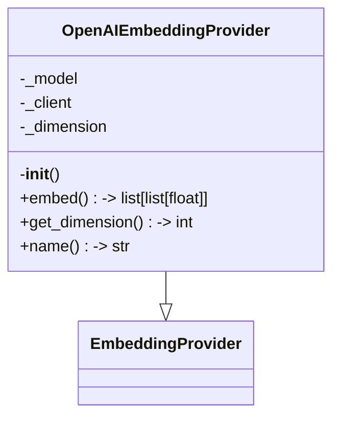
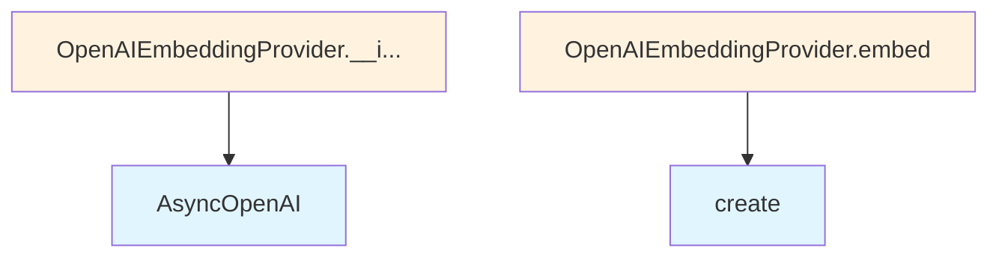

# OpenAI Embedding Provider

## File Overview

This module provides an OpenAI-based implementation of the embedding provider interface. It handles text embeddings using OpenAI's embedding models through their async API client.

## Classes

### OpenAIEmbeddingProvider

The OpenAIEmbeddingProvider class extends [EmbeddingProvider](../base.md) to provide text embeddings using OpenAI's API.

**Constructor Parameters:**
- `model` (str, optional): The OpenAI embedding model name. Defaults to "text-embedding-3-small"
- `api_key` (str | None, optional): The OpenAI API key. If not provided, uses the `OPENAI_API_KEY` environment variable

**Key Features:**
- Initializes an async OpenAI client for API communication
- Automatically determines embedding dimensions based on the model
- Falls back to environment variable for API key configuration

## Usage Examples

### Basic Initialization

```python
from local_deepwiki.providers.embeddings.openai import OpenAIEmbeddingProvider

# Using default model with environment variable API key
provider = OpenAIEmbeddingProvider()

# Using custom model
provider = OpenAIEmbeddingProvider(model="text-embedding-3-large")

# Providing API key explicitly
provider = OpenAIEmbeddingProvider(
    model="text-embedding-3-small",
    api_key="your-api-key-here"
)
```

### Environment Setup

The provider expects the OpenAI API key to be available as an environment variable:

```bash
export OPENAI_API_KEY="your-openai-api-key"
```

## Related Components

- **[EmbeddingProvider](../base.md)**: The base class that OpenAIEmbeddingProvider extends
- **AsyncOpenAI**: The OpenAI client used for API communication

## Dependencies

- `openai`: OpenAI Python client library for API access
- `os`: Standard library for environment variable access

## API Reference

### class `OpenAIEmbeddingProvider`

**Inherits from:** [`EmbeddingProvider`](../base.md)

Embedding provider using OpenAI API.

**Methods:**


<details>
<summary>View Source (lines 17-57)</summary>

```python
class OpenAIEmbeddingProvider(EmbeddingProvider):
    """Embedding provider using OpenAI API."""

    def __init__(self, model: str = "text-embedding-3-small", api_key: str | None = None):
        """Initialize the OpenAI embedding provider.

        Args:
            model: OpenAI embedding model name.
            api_key: Optional API key. Uses OPENAI_API_KEY env var if not provided.
        """
        self._model = model
        self._client = AsyncOpenAI(api_key=api_key or os.environ.get("OPENAI_API_KEY"))
        self._dimension = OPENAI_EMBEDDING_DIMENSIONS.get(model, 1536)

    async def embed(self, texts: list[str]) -> list[list[float]]:
        """Generate embeddings for a list of texts.

        Args:
            texts: List of text strings to embed.

        Returns:
            List of embedding vectors.
        """
        response = await self._client.embeddings.create(
            model=self._model,
            input=texts,
        )
        return [item.embedding for item in response.data]

    def get_dimension(self) -> int:
        """Get the embedding dimension.

        Returns:
            The dimension of the embedding vectors.
        """
        return self._dimension

    @property
    def name(self) -> str:
        """Get the provider name."""
        return f"openai:{self._model}"
```

</details>

#### `__init__`

```python
def __init__(model: str = "text-embedding-3-small", api_key: str | None = None)
```

Initialize the OpenAI embedding provider.


| [Parameter](../../generators/api_docs.md) | Type | Default | Description |
|-----------|------|---------|-------------|
| `model` | `str` | `"text-embedding-3-small"` | OpenAI embedding model name. |
| `api_key` | `str | None` | `None` | Optional API key. Uses OPENAI_API_KEY env var if not provided. |


<details>
<summary>View Source (lines 17-57)</summary>

```python
class OpenAIEmbeddingProvider(EmbeddingProvider):
    """Embedding provider using OpenAI API."""

    def __init__(self, model: str = "text-embedding-3-small", api_key: str | None = None):
        """Initialize the OpenAI embedding provider.

        Args:
            model: OpenAI embedding model name.
            api_key: Optional API key. Uses OPENAI_API_KEY env var if not provided.
        """
        self._model = model
        self._client = AsyncOpenAI(api_key=api_key or os.environ.get("OPENAI_API_KEY"))
        self._dimension = OPENAI_EMBEDDING_DIMENSIONS.get(model, 1536)

    async def embed(self, texts: list[str]) -> list[list[float]]:
        """Generate embeddings for a list of texts.

        Args:
            texts: List of text strings to embed.

        Returns:
            List of embedding vectors.
        """
        response = await self._client.embeddings.create(
            model=self._model,
            input=texts,
        )
        return [item.embedding for item in response.data]

    def get_dimension(self) -> int:
        """Get the embedding dimension.

        Returns:
            The dimension of the embedding vectors.
        """
        return self._dimension

    @property
    def name(self) -> str:
        """Get the provider name."""
        return f"openai:{self._model}"
```

</details>

#### `embed`

```python
async def embed(texts: list[str]) -> list[list[float]]
```

Generate embeddings for a list of texts.


| [Parameter](../../generators/api_docs.md) | Type | Default | Description |
|-----------|------|---------|-------------|
| `texts` | `list[str]` | - | List of text strings to embed. |


<details>
<summary>View Source (lines 17-57)</summary>

```python
class OpenAIEmbeddingProvider(EmbeddingProvider):
    """Embedding provider using OpenAI API."""

    def __init__(self, model: str = "text-embedding-3-small", api_key: str | None = None):
        """Initialize the OpenAI embedding provider.

        Args:
            model: OpenAI embedding model name.
            api_key: Optional API key. Uses OPENAI_API_KEY env var if not provided.
        """
        self._model = model
        self._client = AsyncOpenAI(api_key=api_key or os.environ.get("OPENAI_API_KEY"))
        self._dimension = OPENAI_EMBEDDING_DIMENSIONS.get(model, 1536)

    async def embed(self, texts: list[str]) -> list[list[float]]:
        """Generate embeddings for a list of texts.

        Args:
            texts: List of text strings to embed.

        Returns:
            List of embedding vectors.
        """
        response = await self._client.embeddings.create(
            model=self._model,
            input=texts,
        )
        return [item.embedding for item in response.data]

    def get_dimension(self) -> int:
        """Get the embedding dimension.

        Returns:
            The dimension of the embedding vectors.
        """
        return self._dimension

    @property
    def name(self) -> str:
        """Get the provider name."""
        return f"openai:{self._model}"
```

</details>

#### `get_dimension`

```python
def get_dimension() -> int
```

Get the embedding dimension.


<details>
<summary>View Source (lines 17-57)</summary>

```python
class OpenAIEmbeddingProvider(EmbeddingProvider):
    """Embedding provider using OpenAI API."""

    def __init__(self, model: str = "text-embedding-3-small", api_key: str | None = None):
        """Initialize the OpenAI embedding provider.

        Args:
            model: OpenAI embedding model name.
            api_key: Optional API key. Uses OPENAI_API_KEY env var if not provided.
        """
        self._model = model
        self._client = AsyncOpenAI(api_key=api_key or os.environ.get("OPENAI_API_KEY"))
        self._dimension = OPENAI_EMBEDDING_DIMENSIONS.get(model, 1536)

    async def embed(self, texts: list[str]) -> list[list[float]]:
        """Generate embeddings for a list of texts.

        Args:
            texts: List of text strings to embed.

        Returns:
            List of embedding vectors.
        """
        response = await self._client.embeddings.create(
            model=self._model,
            input=texts,
        )
        return [item.embedding for item in response.data]

    def get_dimension(self) -> int:
        """Get the embedding dimension.

        Returns:
            The dimension of the embedding vectors.
        """
        return self._dimension

    @property
    def name(self) -> str:
        """Get the provider name."""
        return f"openai:{self._model}"
```

</details>

#### `name`

```python
def name() -> str
```

Get the provider name.


<details>
<summary>View Source (lines 17-57)</summary>

```python
class OpenAIEmbeddingProvider(EmbeddingProvider):
    """Embedding provider using OpenAI API."""

    def __init__(self, model: str = "text-embedding-3-small", api_key: str | None = None):
        """Initialize the OpenAI embedding provider.

        Args:
            model: OpenAI embedding model name.
            api_key: Optional API key. Uses OPENAI_API_KEY env var if not provided.
        """
        self._model = model
        self._client = AsyncOpenAI(api_key=api_key or os.environ.get("OPENAI_API_KEY"))
        self._dimension = OPENAI_EMBEDDING_DIMENSIONS.get(model, 1536)

    async def embed(self, texts: list[str]) -> list[list[float]]:
        """Generate embeddings for a list of texts.

        Args:
            texts: List of text strings to embed.

        Returns:
            List of embedding vectors.
        """
        response = await self._client.embeddings.create(
            model=self._model,
            input=texts,
        )
        return [item.embedding for item in response.data]

    def get_dimension(self) -> int:
        """Get the embedding dimension.

        Returns:
            The dimension of the embedding vectors.
        """
        return self._dimension

    @property
    def name(self) -> str:
        """Get the provider name."""
        return f"openai:{self._model}"
```

</details>

## Class Diagram



## Call Graph



## Relevant Source Files

- `src/local_deepwiki/providers/embeddings/openai.py:17-57`
