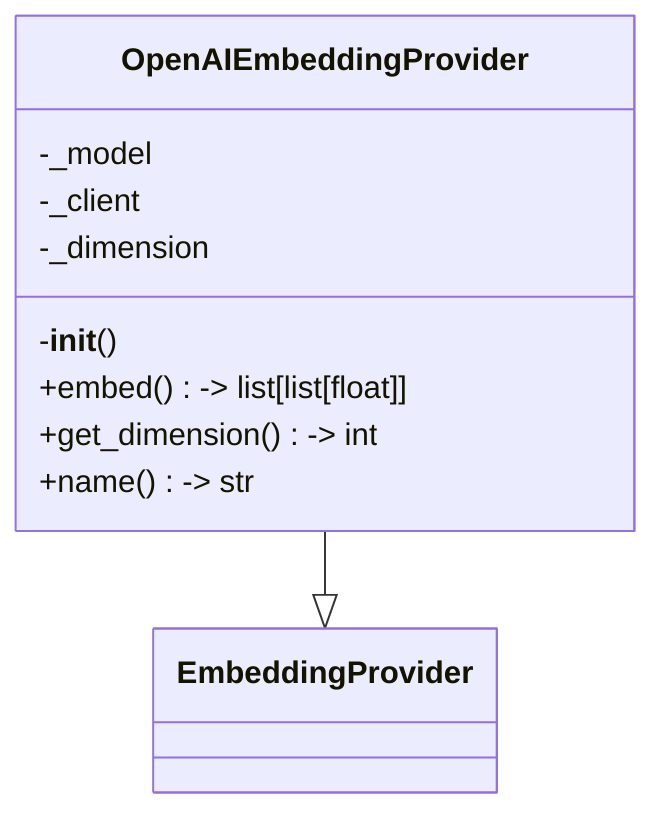
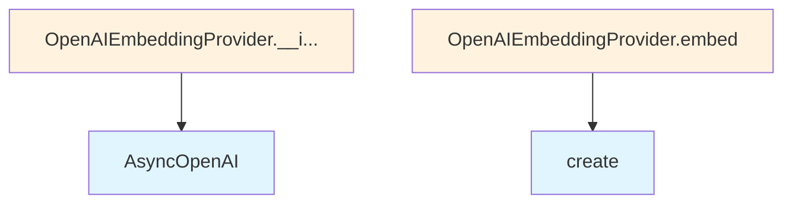

# OpenAI Embedding Provider

## File Overview

This module provides an OpenAI-based implementation of the embedding provider interface. It uses the OpenAI API to generate text embeddings through their embedding models.

## Classes

### OpenAIEmbeddingProvider

The OpenAIEmbeddingProvider class implements the [EmbeddingProvider](../base.md) interface to provide text embeddings using OpenAI's embedding models.

**Inheritance**: Extends [EmbeddingProvider](../base.md)

**Constructor Parameters**:
- `model` (str, optional): The OpenAI embedding model name. Defaults to "text-embedding-3-small"
- `api_key` (str | None, optional): The OpenAI API key. If not provided, uses the `OPENAI_API_KEY` environment variable

**Key Features**:
- Supports configurable OpenAI embedding models
- Automatically determines embedding dimensions based on the selected model
- Uses asynchronous OpenAI client for non-blocking operations
- Falls back to environment variable for API key configuration

## Usage Examples

### Basic Usage

```python
from local_deepwiki.providers.embeddings.openai import OpenAIEmbeddingProvider

# Using default model with environment variable API key
provider = OpenAIEmbeddingProvider()

# Using custom model
provider = OpenAIEmbeddingProvider(model="text-embedding-3-large")

# Using explicit API key
provider = OpenAIEmbeddingProvider(
    model="text-embedding-3-small",
    api_key="your-api-key-here"
)
```

### Environment Setup

The provider expects the OpenAI API key to be available either as a parameter or through the environment:

```bash
export OPENAI_API_KEY="your-openai-api-key"
```

## Related Components

- **[EmbeddingProvider](../base.md)**: The base class that this provider extends, defining the interface for embedding providers
- **AsyncOpenAI**: The OpenAI client library used for API communication

## Dependencies

- `openai`: Provides the AsyncOpenAI client for API interactions
- `os`: Used for environment variable access

## API Reference

### class `OpenAIEmbeddingProvider`

**Inherits from:** [`EmbeddingProvider`](../base.md)

Embedding provider using OpenAI API.

**Methods:**

#### `__init__`

```python
def __init__(model: str = "text-embedding-3-small", api_key: str | None = None)
```

Initialize the OpenAI embedding provider.


| [Parameter](../../generators/api_docs.md) | Type | Default | Description |
|-----------|------|---------|-------------|
| `model` | `str` | `"text-embedding-3-small"` | OpenAI embedding model name. |
| `api_key` | `str | None` | `None` | Optional API key. Uses OPENAI_API_KEY env var if not provided. |

#### `embed`

```python
async def embed(texts: list[str]) -> list[list[float]]
```

Generate embeddings for a list of texts.


| [Parameter](../../generators/api_docs.md) | Type | Default | Description |
|-----------|------|---------|-------------|
| `texts` | `list[str]` | - | List of text strings to embed. |

#### `get_dimension`

```python
def get_dimension() -> int
```

Get the embedding dimension.

#### `name`

```python
def name() -> str
```

Get the provider name.


## Class Diagram



## Call Graph



## Relevant Source Files

- `src/local_deepwiki/providers/embeddings/openai.py:17-57`
